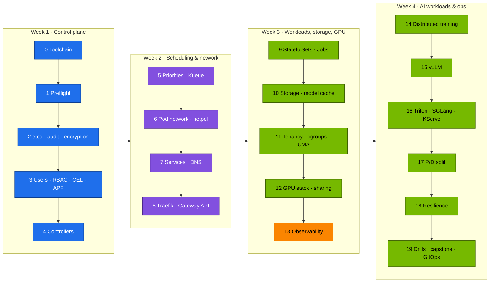

# Step-by-Step: From the Ansible-Built k3s to a Complete AI Platform on DGX Spark

> **Module 02 companion guide.** The shortest correct path through the lab, in the order that avoids rework. Each step lists the commands, what "done" looks like, and the volume that explains it. Prerequisite: the [01 Ansible step-by-step guide](../01%20Ansible/00-ansible-step-by-step-guide.md) through its Step 10 (k3s + GPU Operator).



**One Spark or two?** Everything works on one. Steps marked **(2×)** have an optional second part that needs spark-02 and the QSFP cable.

---

## Step 0 · Toolchain on the control node (20 min) → [20 §CI](20-hands-on-practice-exercises-workbook.md)

```bash
cd "technical-depth/02 Kubernetes/lab"
pip install yamllint shellcheck-py pyyaml
# kubectl, kubeconform, promtool, mikefarah yq: versions in versions.env / the CI workflow
export KUBECONFIG="$PWD/../../01 Ansible/lab/.cache/kubeconfig-spark-lab.yaml"
tests/run-local-checks.sh
```

✅ `ALL LOCAL CHECKS PASSED`

## Step 1 · Preflight (5 min) → [01](01-kubernetes-core-architecture.md)

```bash
scripts/preflight.sh          # run on the Spark
```

✅ 0 failed. `allocatable nvidia.com/gpu=4`. GB10 cc 12.1.

## Step 2 · Control plane hardening (30 min) → [03](03-etcd-database-deep-dive.md), [02](02-kube-apiserver-internals.md)

```bash
scripts/install-addons.sh k3s-config
kubectl get secrets -A -o json | kubectl replace -f - >/dev/null
sudo apt-get install -y etcd-client && scripts/etcd-drill.sh status && scripts/etcd-drill.sh snapshot
```

✅ 1 etcd member, no alarms, a snapshot listed. `sudo k3s secrets-encrypt status` → Enabled. `/var/log/k3s/audit.log` growing.

## Step 3 · Tenancy, users, policy (45 min) → [02](02-kube-apiserver-internals.md), [12](12-multi-tenancy-resource-quotas-and-cgroups.md)

```bash
for d in 00-platform 10-tenancy 15-admission 16-apf; do kubectl apply -k manifests/$d; done
scripts/make-user.sh alice team-alpha && scripts/make-user.sh bob team-beta
scripts/verify.sh tenancy admission
```

✅ `20 passed, 0 failed`

## Step 4 · Controllers (30 min) → [04](04-kube-controller-manager-and-controllers.md)

```bash
kubectl apply -k manifests/30-networking
kubectl apply -k manifests/45-controller
kubectl -n lab-tools logs deploy/slice-ledger
```

✅ `relist: … GPU pods` and a `gpu-slice-ledger` ConfigMap.

## Step 5 · Add-ons, priorities, Kueue (40 min) → [05](05-kube-scheduler-and-ai-batch-scheduling.md), [15](15-dgx-spark-datacenter-simulation-lab.md)

```bash
scripts/install-addons.sh all            # storage traefik kps kueue keda
kubectl apply -k manifests/20-scheduling
tests/kueue-gang-test.sh
```

✅ `PASS: one gang admitted whole, the other held whole`

## Step 6 · Pod network & policies (40 min) → [06](06-kubernetes-networking-deep-dive.md)

```bash
scripts/pod-netns.sh lab-tools "$(kubectl -n lab-tools get pod -l app=echo -o jsonpath='{.items[0].metadata.name}')"
scripts/breakfix.sh inject 06     # fix it, then: scripts/breakfix.sh answer 06
```

✅ You can name the veth, bridge and MTU. Drill 06 fixed.

## Step 7 · Services & DNS (40 min) → [07](07-kube-proxy-and-cluster-ip-mechanics.md), [08](08-coredns-and-service-discovery.md)

```bash
scripts/svc-trace.sh lab-tools echo
kubectl apply -f manifests/30-networking/coredns-custom.yaml && kubectl -n kube-system rollout restart deploy coredns
```

✅ KUBE-SEP probabilities explained. ndots query counts measured (≈10 vs 2).

## Step 8 · Ingress & Gateway API (40 min) → [09](09-ingress-controllers-and-gateway-api.md)

```bash
kubectl apply -k manifests/40-ingress
echo "192.168.0.100 llm.lab.local gw.lab.local" | sudo tee -a /etc/hosts      # on the laptop
scripts/verify.sh ingress
```

✅ Streaming PASS. HTTPRoute 200. Canary ≈ 90/10.

## Step 9 · Stateful and batch workloads (40 min) → [10](10-advanced-workload-controllers.md)

```bash
kubectl apply -k manifests/50-workloads
kubectl apply -f manifests/50-workloads/tokenizer-indexed-job.yaml
```

✅ Qdrant data survives pod deletion. `completedIndexes: 0-7`.

## Step 10 · Storage & model cache (40 min) → [11](11-storage-csi-and-high-performance-volumes.md)

```bash
kubectl apply -k manifests/60-storage && kubectl apply -f manifests/60-storage/model-prefetch-job.yaml
kubectl apply -f manifests/60-storage/fio-job.yaml
```

✅ `model-cache` Bound on Retain. fio baseline saved.

## Step 11 · Tenancy under load & the UMA question (40 min) → [12](12-multi-tenancy-resource-quotas-and-cgroups.md)

```bash
kubectl apply -f manifests/10-tenancy/experiments/qos-trio.yaml -f manifests/10-tenancy/experiments/cpu-throttle.yaml
kubectl apply -f manifests/10-tenancy/experiments/uma-cgroup-experiment.yaml && kubectl -n lab-tools logs -f uma-cgroup-experiment
```

✅ QoS/`oom_score_adj` table filled in. **UMA experiment result recorded with the driver version.**

## Step 12 · GPU stack & sharing (60 min) → [13](13-nvidia-hardware-and-driver-stack.md), [14](14-nvidia-container-toolkit-and-gpu-virtualization.md), [16](16-nvidia-gpu-operator-and-network-operator.md)

```bash
kubectl apply -k manifests/70-gpu && kubectl apply -f manifests/70-gpu/gemm-solo.yaml
kubectl -n lab-tools scale deploy gemm-contention --replicas=4      # Vol 14 §5.3 table
scripts/breakfix.sh inject 10                                       # the GPU leak
```

✅ Baseline TFLOPS. Aggregate ≈ baseline under 4-way contention. Leak explained (hardening optional).

## Step 13 · Observability (30 min) → [16](16-nvidia-gpu-operator-and-network-operator.md)

```bash
kubectl apply -k manifests/95-observability
scripts/verify.sh observability      # Grafana http://192.168.0.100:32000 → "Spark · Kubernetes"
```

✅ Every dashboard row has data. One alert seen firing (drill 02).

## Step 14 · Distributed training (45 min) (2×) → [17](17-distributed-ai-training-and-nccl.md), [18](18-large-scale-superpod-and-network-fabrics.md)

```bash
kubectl apply -k manifests/80-distributed/base
kubectl -n batch logs -f -l job-name=ddp --prefix
# (2×) kubectl apply -k manifests/80-distributed/two-spark
```

✅ `correctness OK`. (2×) `Using network IB`, busbw near line rate.

## Step 15 · vLLM (60 min) → [21](21-vllm-high-throughput-llm-serving.md)

```bash
kubectl apply -k manifests/90-serving/vllm
kubectl apply -f manifests/90-serving/vllm/vllm-bench.yaml
scripts/verify.sh serving
```

✅ `vLLM answered a chat completion`. Benchmark table for c = 1/8/32.

## Step 16 · Triton, SGLang, KServe (90 min) → [22](22-nvidia-triton-inference-server.md), [23](23-llm-inference-alternatives-and-kserve.md)

```bash
kubectl apply -k manifests/90-serving/triton
kubectl -n llm-serving scale deploy vllm --replicas=0 && kubectl apply -k manifests/90-serving/sglang && kubectl -n llm-serving scale deploy sglang --replicas=1
python3 scripts/ttft_probe.py --url http://localhost:30000 --model qwen2.5-0.5b     # via port-forward
```

✅ Triton batch size > 1 under load. Prefix-cache speed-up measured on two engines.

## Step 17 · Prefill/decode split (45 min) (2×) → [24](24-disaggregated-prefill-and-decode-serving.md)

```bash
kubectl apply -k manifests/90-serving/pd-disagg
```

✅ `X-Prefill-Ms` header and NIXL activity in the decode log.

## Step 18 · Resilience (45 min) → [26](26-ultra-scale-cluster-resilience-and-fault-tolerance.md), [25](25-hyperscaler-silicon-and-compilers.md)

```bash
kubectl apply -k manifests/80-distributed/resilient      # kill a pod mid-run → RESUMED
kubectl apply -f manifests/70-gpu/compile-compare.yaml   # eager vs compiled
```

✅ Resume from the newest complete checkpoint. SDC drill fails fast.

## Step 19 · Drills, capstone, GitOps → [19](19-cluster-diagnostics-and-failure-scenarios.md), [20](20-hands-on-practice-exercises-workbook.md), [production-mlops](production-mlops.md)

```bash
scripts/breakfix.sh list                 # at least 5 drills, timed
scripts/collect-diag.sh
# capstone: tear down the 02 layer and rebuild to green in < 60 min (Vol 20)
kubectl apply -n argocd -f gitops/applications.yaml    # after installing Argo CD
```

✅ `scripts/verify.sh` → `0 failed` after the rebuild. Argo CD apps Synced/Healthy.
