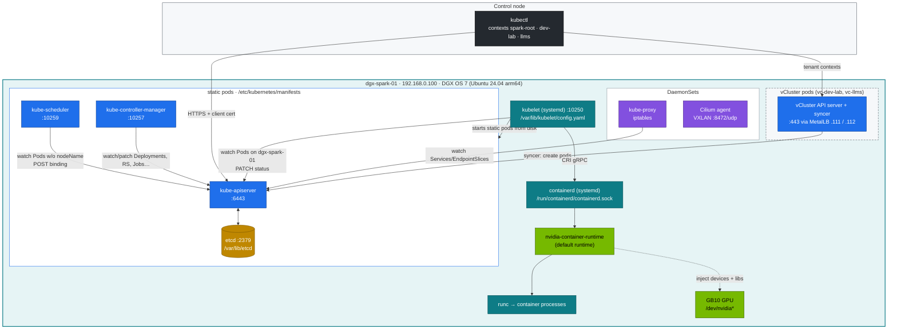
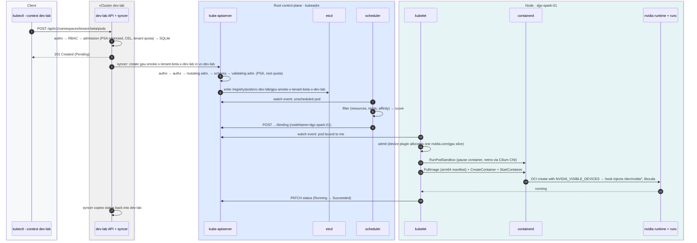
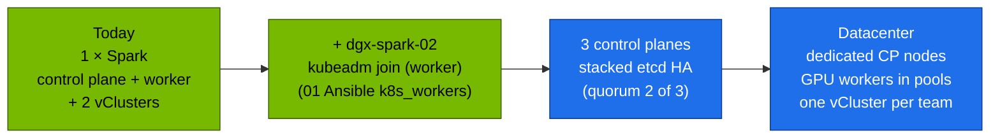

# Volume 01 — Kubernetes Core Architecture & Pod Lifecycle on a DGX Spark

> **Module 02 · Part I — Control plane** · Next: [02 API server internals](02-kube-apiserver-internals.md) · Guide: [00 step-by-step](00-kubernetes-step-by-step-guide.md) · The lab's shape: [27 Nested clusters](27-nested-clusters-with-vcluster.md)

| | |
|---|---|
| **You will build** | A mental model you can check against the real processes, sockets and files. You'll read the kubeadm control plane on the Spark, then trace one `kubectl apply` from your laptop to a running container on the GB10 — through a vCluster's API server and the root's — and read each hop's evidence. |
| **Hardware** | dgx-spark-01 running the kubeadm root cluster from the 01 Ansible lab (`playbooks/05-kubernetes.yml`, `06-gpu-operator.yml`, `06b-vclusters.yml`) |
| **Time** | 75 min |
| **Risk** | None. Read-only apart from one test pod |
| **Clusters** | `spark-root` (the control plane itself) and `dev-lab` (the test pod) |
| **Lab files** | [`lab/scripts/preflight.sh`](lab/scripts/preflight.sh), [`lab/manifests/dev-lab/70-gpu/gpu-smoke.yaml`](lab/manifests/dev-lab/70-gpu/gpu-smoke.yaml), 01 Ansible [`kubeadm-init.yaml.j2`](../01%20Ansible/lab/roles/kubeadm_cluster/templates/kubeadm-init.yaml.j2) |

---

## 1. Why this matters on a Spark

Kubernetes is a set of **control loops that share one database**. Every component watches the API server for objects, compares desired state (`spec`) with observed state (`status`) and acts on the difference. Almost every failure you'll debug later breaks one of those loops. Examples: a scheduler that can't find a node, a kubelet that can't start a container, a controller that can't write status. So the first skill is knowing which loop owns which step, and where each loop leaves evidence.

On a DGX Spark, four things differ from a textbook cluster:

| Textbook cluster | DGX Spark lab (kubeadm) | Consequence |
|---|---|---|
| 3+ control-plane VMs, separate workers | **One node** is control plane *and* worker — kubeadm was told not to taint it (`nodeRegistration.taints: []`) | A runaway pod competes with etcd and the API server for CPU, memory and NVMe. Kubelet reservations (§3.3) matter |
| (same) — kubeadm runs each component as a **static pod** | apiserver, etcd, scheduler and controller-manager are pods the kubelet starts from `/etc/kubernetes/manifests/`; kubelet and containerd are systemd services | The control plane is visible with `kubectl -n kube-system get pods` *and* `crictl ps`. Its pods' requests count against allocatable |
| One cluster | **Three API servers**: the root, plus vCluster `dev-lab` and `llms` running as pods inside it (Vol 27) | A tenant's pod passes through two API servers before the kubelet sees it |
| GPU memory is separate from host RAM | **128 GB unified memory** shared by CPU and GB10 | A pod's memory limit may not cap its CUDA allocations (Vol 12 measures it). Node memory pressure also starves the GPU |
| x86-64 | **aarch64** (Grace: 10× Cortex-X925 + 10× Cortex-A725) | Every image needs an `arm64` manifest. `exec format error` means you pulled an amd64-only image |

---

## 2. Architecture — HLD



Rule of thumb: **only the API server talks to etcd.** Every other component is a client of the API server and uses *watches* (long-lived HTTP streams), not polling. The vClusters are no exception: to the root they are clients too — their syncers create pods through the root API like any controller.

---

## 3. LLD — what runs where

### 3.1 Processes, ports, paths

| Component | How it runs | Listens | Key paths / evidence |
|---|---|---|---|
| kube-apiserver | static pod `kube-apiserver-dgx-spark-01` | `:6443` (TLS) | manifest `/etc/kubernetes/manifests/kube-apiserver.yaml`, certs `/etc/kubernetes/pki/`, audit log `/var/log/kubernetes/audit/audit.log` (Vol 02) |
| etcd | static pod `etcd-dgx-spark-01` (stacked) | `127.0.0.1:2379`, `:2380`, metrics `:2381` | data `/var/lib/etcd`, certs `/etc/kubernetes/pki/etcd/`, snapshots `/var/lib/etcd-snapshots` (Vol 03) |
| kube-scheduler | static pod | `:10259` metrics | leader Lease `kube-system/kube-scheduler` |
| kube-controller-manager | static pod | `:10257` metrics | leader Lease `kube-system/kube-controller-manager`; allocates each node's pod CIDR from `10.42.0.0/16` |
| kubelet | systemd `kubelet.service` | `:10250` (API), `:10248` healthz | `/var/lib/kubelet/config.yaml` (from the kubeadm config), `/var/lib/kubelet/pods/<uid>/`, `journalctl -u kubelet` |
| kube-proxy | DaemonSet | `:10249` metrics | ConfigMap `kube-system/kube-proxy` (mode iptables), chains `KUBE-SERVICES`, `KUBE-SVC-*` (Vol 07) |
| Cilium | DaemonSet + operator | `8472/udp` VXLAN, `:9962` metrics | `cilium_host`, `cilium_vxlan`, `lxc*` veths, `/etc/cni/net.d/05-cilium.conflist` (Vol 06) |
| containerd | systemd `containerd.service` (DGX OS `containerd.io`, shared with Docker) | unix socket | `/run/containerd/containerd.sock`, config `/etc/containerd/config.toml`, `/etc/crictl.yaml` |
| nvidia runtime | containerd runtime handler | — | `default_runtime_name = "nvidia"` in the containerd config (01 Ansible `nvidia-ctk runtime configure --set-as-default`) |
| kubeadm config | file | — | `/etc/kubernetes/kubeadm-config.yaml` (what Ansible fed `kubeadm init`), ConfigMap `kube-system/kubeadm-config` |

### 3.2 Objects you'll see in `kube-system` (and around it)

| Object | Purpose | Comes from |
|---|---|---|
| `pod/kube-apiserver-dgx-spark-01`, `etcd-…`, `kube-scheduler-…`, `kube-controller-manager-…` | mirror pods of the static pods | kubeadm |
| `deploy/coredns` | Cluster DNS `10.43.0.10` (the root's; each vCluster has its own) | kubeadm add-on |
| `ds/kube-proxy` | Service VIPs via iptables | kubeadm add-on |
| `ds/cilium`, `deploy/cilium-operator`, Hubble | pod network, NetworkPolicy, flow logs | 01 Ansible `roles/cilium` |
| `deploy/metrics-server` | `kubectl top`, HPAs (proxied into both vClusters) | `scripts/install-addons.sh metrics-server` |
| namespaces `metallb-system`, `local-path-storage`, `gpu-operator` | LoadBalancer IPs, local PVs on NVMe, NFD/GFD/device plugin/validator | 01 Ansible (MetalLB, GPU Operator), lab add-ons |
| `runtimeclass/nvidia` | Explicit GPU runtime | GPU Operator (and `common/runtimeclass` inside each vCluster) |
| namespaces `vc-dev-lab`, `vc-llms` | the two vClusters and every pod they sync | Vol 27 |

### 3.3 Capacity vs allocatable on a GB10

The 01 Ansible kubeadm config sets `systemReserved: {cpu: 2, memory: 8Gi}`, `kubeReserved: {cpu: 1, memory: 2Gi}` and `evictionHard: memory.available: 4Gi` in the KubeletConfiguration:

| | CPU | Memory | Why |
|---|---|---|---|
| Capacity | 20 | ≈119.7 GiB | What the kernel reports (part of the 128 GB is firmware/carve-outs) |
| − system-reserved | 2 | 8 Gi | DGX OS, DGX Dashboard, sshd, journald, Docker |
| − kube-reserved | 1 | 2 Gi | kubelet + containerd |
| − eviction threshold | — | 4 Gi | kubelet starts evicting below this |
| **Allocatable** | **17** | **≈105.7 GiB** | What the scheduler hands out, **CPU and GPU combined** |

Unlike k3s, the control plane is *not* inside kube-reserved: the static pods request ~0.65 CPU and a few hundred MiB themselves (apiserver 250m, controller-manager 200m, scheduler 100m, etcd 100m + 100Mi) out of allocatable. `kubectl --context spark-root describe node dgx-spark-01 | grep -A12 'Allocated resources'` shows them alongside the vCluster pods.

### 3.4 Three API servers, one node

| API server | Stores in | Runs as | You use it to |
|---|---|---|---|
| root `kube-apiserver` | etcd | static pod | manage the node, platform, GPU, and the vClusters' budgets |
| `dev-lab` | SQLite (PVC) | container in pod `dev-lab-0` (ns `vc-dev-lab`) | run tenants: `tenant-alpha`, `tenant-beta`, `lab-tools` |
| `llms` | SQLite (PVC) | container in pod `llms-0` (ns `vc-llms`) | run serving and training |

There is still only **one scheduler that places pods on the GB10 node: the root's.** The vClusters run no scheduler (vCluster's default); their syncers hand pods to the root.

---

## 4. Pod lifecycle — the sequence



Each numbered step leaves evidence you can read. §5 does exactly that.

---

## 5. Lab — trace a pod end to end

### Step 1 · Preflight

```bash
cd "02 Kubernetes/lab"
scripts/preflight.sh
```

Expected (abridged):

```text
[PASS] arch aarch64
[PASS] 20 CPU cores (10 X925 + 10 A725)
[PASS] MemTotal 119 GiB (unified CPU+GPU pool)
[PASS] cgroup v2
[PASS] swap off
[PASS] GPU NVIDIA GB10, compute capability 12.1
[PASS] containerd active
[PASS] containerd default runtime: nvidia
[PASS] kubelet active
[PASS] kubeadm v1.36.5
[PASS] root API server /readyz (context spark-root, KUBECONFIG=…/kubeconfig-spark-lab.yaml)
[PASS] dgx-spark-01 schedulable (no control-plane taint)
[PASS] Cilium agent ready
[PASS] dgx-spark-01 allocatable nvidia.com/gpu=15 (time-slices)
[PASS] vCluster dev-lab answers
[PASS] vCluster llms answers
```

### Step 2 · See the control plane as static pods

```bash
ssh nvidia@192.168.0.100
ls /etc/kubernetes/manifests/
sudo crictl ps --name 'kube-|etcd' -o table
sudo ss -ltnp | grep -E ':(6443|10250|10257|10259|2379|2381) '
kubectl --context spark-root -n kube-system get pods -o wide | grep -E 'apiserver|etcd|scheduler|controller'
```

Expected: four YAML files; four running containers; each port owned by its own process (`kube-apiserver`, `etcd`, …) and `kubelet` on 10250; and four `…-dgx-spark-01` mirror pods. Delete one of them with `kubectl delete pod` and watch it come straight back — the kubelet owns static pods, not the API server.

```bash
sudo grep -A3 'audit-policy-file\|encryption-provider' /etc/kubernetes/manifests/kube-apiserver.yaml | head -8
sudo cat /var/lib/kubelet/config.yaml | grep -A3 -E 'systemReserved|kubeReserved|evictionHard'
```

The flags and reservations from the 01 Ansible kubeadm config are visible exactly where kubeadm put them.

### Step 3 · Ask the API server how healthy it is

```bash
kubectl --context spark-root get --raw='/readyz?verbose' | tail -8
kubectl --context spark-root get --raw='/livez?verbose' | grep -v '^\[+\]' || echo "all livez checks OK"
kubectl --context spark-root get lease -n kube-system        # scheduler + controller-manager leader leases
kubectl --context dev-lab get --raw='/readyz'                 # the vCluster's own API server
```

Expected: `readyz check passed`, Leases `kube-scheduler` and `kube-controller-manager` with a `HOLDER` of the form `dgx-spark-01_<uuid>`, and `ok` from dev-lab.

### Step 4 · Watch a pod walk through its lifecycle — in both clusters

Terminal A (the tenant's view):

```bash
kubectl --context dev-lab -n tenant-beta get events -w --field-selector involvedObject.name=gpu-smoke
```

Terminal B (the platform's view):

```bash
kubectl --context spark-root -n vc-dev-lab get events -w | grep gpu-smoke
```

Terminal C:

```bash
kubectl --context dev-lab apply -k manifests/dev-lab/00-platform && kubectl --context dev-lab apply -k manifests/dev-lab/10-tenancy
kubectl --context dev-lab apply -f manifests/dev-lab/70-gpu/gpu-smoke.yaml
kubectl --context dev-lab -n tenant-beta get pod gpu-smoke -w -o wide
```

Expected event order on the root, which matches the sequence diagram:

```text
Normal  Scheduled  pod/gpu-smoke-x-tenant-beta-x-dev-lab  Successfully assigned vc-dev-lab/gpu-smoke-x-tenant-beta-x-dev-lab to dgx-spark-01
Normal  Pulling    pod/gpu-smoke-x-tenant-beta-x-dev-lab  Pulling image "nvcr.io/nvidia/cuda:13.0.1-base-ubuntu24.04"
Normal  Pulled     pod/gpu-smoke-x-tenant-beta-x-dev-lab  Successfully pulled image … in 14.2s
Normal  Created    pod/gpu-smoke-x-tenant-beta-x-dev-lab  Created container: smi
Normal  Started    pod/gpu-smoke-x-tenant-beta-x-dev-lab  Started container smi
```

The same events appear in dev-lab under the tenant's name: vCluster copies them up.

```bash
kubectl --context dev-lab -n tenant-beta logs gpu-smoke
```

```text
GPU 0: NVIDIA GB10 (UUID: GPU-xxxxxxxx-…)
name, compute_cap, driver_version, memory.total [MiB]
NVIDIA GB10, 12.1, 580.xx, [N/A]
```

`memory.total` reads `[N/A]` / "Not Supported". That's expected on a UMA GPU: there is no separate framebuffer to report.

### Step 5 · Find the same pod one layer down (CRI)

```bash
sudo crictl pods --name gpu-smoke
POD=$(sudo crictl pods --name gpu-smoke -q | head -1)
sudo crictl inspectp "$POD" | jq '.info.runtimeSpec.linux.namespaces, .status.network'
sudo crictl ps -a --pod "$POD"
```

The node only knows the root name (`gpu-smoke-x-tenant-beta-x-dev-lab`). The **sandbox** (the `pause` container) owns the network namespace. The `smi` container joins it. That's why every container in a pod shares one IP.

### Step 6 · …and in the OCI spec: where the GPU came from

```bash
CID=$(sudo crictl ps -a --pod "$POD" -q | head -1)
sudo crictl inspect "$CID" | jq -r '.info.runtimeType, (.info.config.envs[]? | select(.key|test("NVIDIA")) | "\(.key)=\(.value)")'
```

Expected: runtime `io.containerd.runc.v2` with the `nvidia` handler, and `NVIDIA_VISIBLE_DEVICES=GPU-<uuid>` set **by the device plugin** because the pod asked for `nvidia.com/gpu: 1`. Keep this in mind. [Break/fix 10](lab/breakfix/10-gpu-leak.yaml) shows what happens when a pod gets this variable *without* asking.

### Step 7 · Read the object as each API server stored it

```bash
kubectl --context dev-lab get --raw /api/v1/namespaces/tenant-beta/pods/gpu-smoke | jq '.metadata.managedFields[].manager'
kubectl --context spark-root -n vc-dev-lab get pod -o name | grep gpu-smoke
kubectl --context spark-root -n vc-dev-lab get pod gpu-smoke-x-tenant-beta-x-dev-lab -o json \
  | jq '[.metadata.managedFields[].manager], (.metadata.annotations | with_entries(select(.key | startswith("vcluster"))))'
```

In dev-lab the managers are `kubectl-client-side-apply` and the syncer (writing status back). On the root they are the **vCluster syncer** and `kubelet`: the tenant never wrote to the root at all. [Volume 03](03-etcd-database-deep-dive.md) reads the raw etcd key of the root copy.

---

## 6. Verify

| Check | Command | Expected |
|---|---|---|
| Control plane healthy | `kubectl --context spark-root get --raw /readyz` | `ok` |
| Static pods | `ls /etc/kubernetes/manifests` | 4 files |
| Node Ready + GPU advertised | `kubectl --context spark-root get node dgx-spark-01 -o jsonpath='{.status.allocatable.nvidia\.com/gpu}'` | `15` |
| Pod completed on GPU (via dev-lab) | `kubectl --context dev-lab -n tenant-beta get pod gpu-smoke` | `Completed` |
| Scripted | `scripts/verify.sh platform vclusters gpu` | all `[PASS]` |

---

## 7. Troubleshooting

| Symptom | Likely cause | Diagnose | Fix |
|---|---|---|---|
| Pod `Pending`, event `0/1 nodes are available: 1 Insufficient nvidia.com/gpu` | All 15 time-slices taken | `kubectl --context spark-root describe node dgx-spark-01 \| grep -A10 'Allocated resources'` | Free a slice, queue with Kueue (Vol 05) |
| Pod `Pending` in a vCluster, **no** scheduler events | the root quota of that vCluster is spent | `kubectl --context spark-root -n vc-dev-lab describe resourcequota vcluster-budget` | Vol 27 §8; break/fix 02 |
| Pod `Pending` on the root, **no events at all** | scheduler not running / not leader | `kubectl --context spark-root get lease -n kube-system kube-scheduler -o yaml` (renewTime stale?), `sudo crictl logs $(sudo crictl ps -q --name kube-scheduler)` | fix the manifest in `/etc/kubernetes/manifests/kube-scheduler.yaml`; the kubelet restarts it |
| `kubectl` hangs / `connection refused :6443` | API server static pod crash-looping (bad flag, cert, etcd down) | `sudo crictl ps -a --name kube-apiserver`, `sudo crictl logs <id>`, `journalctl -u kubelet -n 50` | revert the last edit of `kube-apiserver.yaml`; check etcd first |
| `ContainerCreating` for minutes | Large image pull (NGC PyTorch ≈ 10 GB) or CNI failure | `kubectl describe pod` → `Pulling` vs `FailedCreatePodSandBox` | Pre-pull (`sudo crictl pull …`), check Cilium (Vol 06) |
| `exec format error` in logs | amd64-only image on aarch64 | `docker manifest inspect  \| jq '.manifests[].platform'` | Use an arm64 or multi-arch tag |
| Node `NotReady` | kubelet can't reach apiserver, CNI not ready, disk/memory pressure | `kubectl describe node` → Conditions; `journalctl -u kubelet -p err --since -10m` | Fix pressure. `sudo systemctl restart kubelet` |
| `x509: certificate has expired` | kubeadm certificates expire after 1 year | `sudo kubeadm certs check-expiration` | `sudo kubeadm certs renew all`, restart the static pods, re-run `05-kubernetes.yml` to re-fetch the kubeconfig (a `kubeadm upgrade` also renews them) |
| `Unable to connect to the server: x509` (new CA) | kubeconfig for an earlier cluster | `kubectl config view --minify` | Re-fetch: 01 Ansible `playbooks/05-kubernetes.yml` (and `06b` for the vCluster contexts) |
| Everything slow, API timeouts | etcd fsync latency (NVMe saturated by a checkpoint or fio) | `EtcdSlowFsync` alert, Vol 03 §7 | Move heavy I/O off peak, `ionice` the job |

**Drill:** `scripts/breakfix.sh inject 13` taints the node. Work out why new pods stay Pending — in the root *and* in both vClusters — using only `describe` output.

---

## 8. Upgrades and scale-out

### 8.1 Upgrading the root with kubeadm

One minor version at a time (1.36 → 1.37), control plane first, then kubelets. On a single node the workloads restart with the kubelet; schedule it.

```bash
# 1. kubeadm itself (the 01 Ansible role holds the packages; unhold for the upgrade)
sudo apt-mark unhold kubeadm && sudo apt-get install -y kubeadm=1.37.x-1.1 && sudo apt-mark hold kubeadm
# (new minor = new pkgs.k8s.io repo: set kubeadm_cluster_version in 01 Ansible first, it switches the repo)
sudo kubeadm upgrade plan
sudo kubeadm upgrade apply v1.37.x          # rewrites the static pods one by one, renews certificates
# 2. kubelet + kubectl
kubectl --context spark-root drain dgx-spark-01 --ignore-daemonsets --delete-emptydir-data   # single node: evicts everything
sudo apt-mark unhold kubelet kubectl && sudo apt-get install -y kubelet=1.37.x-1.1 kubectl=1.37.x-1.1 && sudo apt-mark hold kubelet kubectl
sudo systemctl daemon-reload && sudo systemctl restart kubelet
kubectl --context spark-root uncordon dgx-spark-01
scripts/verify.sh
```

Before you start: check that the vCluster release supports the new host version (vCluster's lifecycle table), and that `kubeadm upgrade` keeps your CoreDNS Corefile changes (Vol 08 — re-apply `root/30-networking/coredns-corefile.yaml` if not). Then set `kubeadm_cluster_version` in the 01 Ansible role so a rebuild lands on the same version.

### 8.2 Scale-out



| Step | What changes | What stays the same |
|---|---|---|
| Add dgx-spark-02 | Uncomment `dgx-spark-02` under `k8s_workers` in `inventory/hosts.yml` and re-run `playbooks/05-kubernetes.yml`. Both vClusters see the node at once | All manifests. The scheduler now has 30 GPU slices; budgets stay until you raise them |
| 3 control planes | `controlPlaneEndpoint` is already in the kubeadm config, so more control planes can `kubeadm join --control-plane` (with `kubeadm init phase upload-certs`). You need three machines for etcd quorum (2 Sparks can't form a safe quorum) | Workloads, vClusters |
| Datacenter | Control plane on small CPU nodes, GPU nodes tainted `nvidia.com/gpu=present:NoSchedule`, OIDC auth, external etcd, a vCluster per team | The loops, the objects, the debugging method in this volume |

---

## 9. Checklist

- [ ] I can name the component that writes each of: `nodeName`, container `state`, ReplicaSet `replicas` — and which API server each write goes to for a dev-lab pod.
- [ ] I can find the four static-pod manifests and explain why deleting a mirror pod does nothing.
- [ ] I can show, with commands, that a pod's containers share one network namespace.
- [ ] I know why `memory.total` is N/A for the GB10 and where allocatable memory comes from.
- [ ] I found `NVIDIA_VISIBLE_DEVICES` in the container spec and know who set it.
