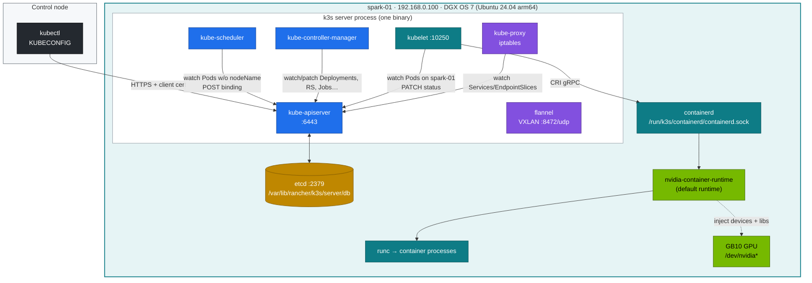
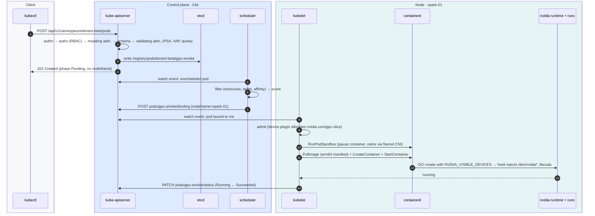
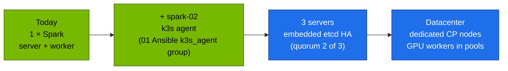

# Volume 01 — Kubernetes Core Architecture & Pod Lifecycle on a DGX Spark

> **Module 02 · Part I — Control plane** · Next: [02 API server internals](02-kube-apiserver-internals.md) · Guide: [00 step-by-step](00-kubernetes-step-by-step-guide.md)

| | |
|---|---|
| **You will build** | A mental model you can check against the real processes, sockets and files. You'll trace one `kubectl apply` from your laptop to a running container on the GB10 node, and read each hop's evidence. |
| **Hardware** | spark-01 running k3s from the 01 Ansible lab (`playbooks/05-k3s.yml`, `06-gpu-operator.yml`) |
| **Time** | 60 min |
| **Risk** | None. Read-only apart from one test pod |
| **Lab files** | [`lab/scripts/preflight.sh`](lab/scripts/preflight.sh), [`lab/manifests/70-gpu/gpu-smoke.yaml`](lab/manifests/70-gpu/gpu-smoke.yaml) |

---

## 1. Why this matters on a Spark

Kubernetes is a set of **control loops that share one database**. Every component watches the API server for objects, compares desired state (`spec`) with observed state (`status`) and acts on the difference. Almost every failure you'll debug later breaks one of those loops. Examples: a scheduler that can't find a node, a kubelet that can't start a container, a controller that can't write status. So the first skill is knowing which loop owns which step, and where each loop leaves evidence.

On a DGX Spark, three things differ from a textbook cluster:

| Textbook cluster | DGX Spark lab (k3s) | Consequence |
|---|---|---|
| 3+ control-plane VMs, separate workers | **One node** is server *and* worker | A runaway pod competes with etcd and the API server for CPU, memory and NVMe. Kubelet reservations (§3.3) matter |
| Each component is its own binary or static pod | **One `k3s` process** embeds apiserver, scheduler, controller-manager, kubelet, kube-proxy and flannel. containerd runs as a child process | `ps` shows 2 processes, not 7. Logs are all in `journalctl -u k3s` |
| GPU memory is separate from host RAM | **128 GB unified memory** shared by CPU and GB10 | A pod's memory limit doesn't cap its CUDA allocations (Vol 12 proves this). Node memory pressure also starves the GPU |
| x86-64 | **aarch64** (Grace: 10× Cortex-X925 + 10× Cortex-A725) | Every image needs an `arm64` manifest. `exec format error` means you pulled an amd64-only image |

---

## 2. Architecture — HLD



Rule of thumb: **only the API server talks to etcd.** Every other component is a client of the API server and uses *watches* (long-lived HTTP streams), not polling.

---

## 3. LLD — what runs where

### 3.1 Processes, ports, paths

| Component | Where in k3s | Listens | Key paths / evidence |
|---|---|---|---|
| kube-apiserver | `k3s server` goroutine | `:6443` (TLS) | certs `/var/lib/rancher/k3s/server/tls/`, audit log `/var/log/k3s/audit.log` (Vol 02) |
| etcd (after [Vol 03](03-etcd-database-deep-dive.md)) | embedded | `127.0.0.1:2379`, `:2380`, metrics `:2381` | `/var/lib/rancher/k3s/server/db/etcd/` (SQLite `state.db` before migration) |
| kube-scheduler | embedded | `:10259` metrics | leader Lease `kube-system/kube-scheduler` |
| kube-controller-manager | embedded | `:10257` metrics | leader Lease `kube-system/kube-controller-manager` |
| kubelet | embedded | `:10250` (API), `:10248` healthz | `/var/lib/kubelet/pods/<uid>/`, config from `kubelet-arg` |
| kube-proxy | embedded | `:10249` metrics | iptables chains `KUBE-SERVICES`, `KUBE-SVC-*` (Vol 07) |
| flannel | embedded | `8472/udp` VXLAN | `flannel.1`, `cni0` bridge, `/run/flannel/subnet.env` (Vol 06) |
| containerd | child process | unix socket | `/run/k3s/containerd/containerd.sock`, config `/var/lib/rancher/k3s/agent/etc/containerd/config.toml` |
| nvidia runtime | containerd runtime handler | — | `default_runtime_name = "nvidia"` in the containerd config (01 Ansible `default-runtime: nvidia`) |
| Auto-deploy manifests | k3s deploy controller | — | `/var/lib/rancher/k3s/server/manifests/*.yaml` (CoreDNS, local-path, …) |

### 3.2 Objects you'll see in `kube-system`

| Object | Purpose | Comes from |
|---|---|---|
| `deploy/coredns` | Cluster DNS `10.43.0.10` | k3s auto-deploy |
| `deploy/local-path-provisioner` | Local PVs on NVMe | k3s auto-deploy |
| `svclb-*` DaemonSet | k3s servicelb (klipper) for `LoadBalancer` Services | k3s (Traefik's LB in Vol 09) |
| `runtimeclass/nvidia` | Explicit GPU runtime | k3s detects nvidia-container-runtime |
| namespace `gpu-operator` | NFD, GFD, device plugin, validator | 01 Ansible Vol 17 |

### 3.3 Capacity vs allocatable on a GB10

The 01 Ansible lab starts kubelet with `system-reserved=cpu=2,memory=8Gi`, `kube-reserved=cpu=1,memory=2Gi` and `eviction-hard=memory.available<4Gi`:

| | CPU | Memory | Why |
|---|---|---|---|
| Capacity | 20 | ≈119.7 GiB | What the kernel reports (part of the 128 GB is firmware/carve-outs) |
| − system-reserved | 2 | 8 Gi | DGX OS, DGX Dashboard, sshd, journald |
| − kube-reserved | 1 | 2 Gi | the k3s process itself (apiserver + etcd live here!) |
| − eviction threshold | — | 4 Gi | kubelet starts evicting below this |
| **Allocatable** | **17** | **≈105.7 GiB** | What the scheduler hands out, **CPU and GPU combined** |

---

## 4. Pod lifecycle — the sequence



Each numbered step leaves evidence you can read. §5 does exactly that.

---

## 5. Lab — trace a pod end to end

### Step 1 · Preflight

```bash
cd "02 Kubernetes/lab"
scripts/preflight.sh
```

Expected (abridged):

```text
[PASS] arch aarch64
[PASS] 20 CPU cores (10 X925 + 10 A725)
[PASS] MemTotal 119 GiB (unified CPU+GPU pool)
[PASS] cgroup v2
[PASS] GPU NVIDIA GB10, compute capability 12.1
[PASS] k3s service active
[PASS] API server /readyz (KUBECONFIG=…/kubeconfig-spark-lab.yaml)
[PASS] spark-01 allocatable nvidia.com/gpu=4 (time-slices)
```

### Step 2 · See that k3s really is one process

```bash
ssh nvidia@192.168.0.100
ps -eo pid,rss,cmd | grep -E '[k]3s server|[c]ontainerd ' | cut -c1-120
sudo ss -ltnp | grep -E ':(6443|10250|10257|10259|2379) '
```

Expected: one `k3s server` (RSS roughly 600 MB–1.2 GB) and one `containerd` owned by it. Every control-plane port belongs to the k3s PID.

### Step 3 · Ask the API server how healthy it is

```bash
kubectl get --raw='/readyz?verbose' | tail -8
kubectl get --raw='/livez?verbose' | grep -v '^\[+\]' || echo "all livez checks OK"
kubectl get lease -n kube-system        # scheduler + controller-manager leader leases
```

Expected: `readyz check passed`, and Leases `kube-scheduler` and `kube-controller-manager` with a `HOLDER` of the form `spark-01_<uuid>`.

### Step 4 · Watch a pod walk through its lifecycle

Terminal A:

```bash
kubectl -n tenant-beta get events -w --field-selector involvedObject.name=gpu-smoke
```

Terminal B:

```bash
kubectl apply -k manifests/00-platform && kubectl apply -k manifests/10-tenancy   # namespaces + quotas
kubectl apply -f manifests/70-gpu/gpu-smoke.yaml
kubectl -n tenant-beta get pod gpu-smoke -w -o wide
```

Expected event order, which matches the sequence diagram:

```text
Normal  Scheduled  pod/gpu-smoke  Successfully assigned tenant-beta/gpu-smoke to spark-01
Normal  Pulling    pod/gpu-smoke  Pulling image "nvcr.io/nvidia/cuda:13.0.1-base-ubuntu24.04"
Normal  Pulled     pod/gpu-smoke  Successfully pulled image … in 14.2s
Normal  Created    pod/gpu-smoke  Created container: smi
Normal  Started    pod/gpu-smoke  Started container smi
```

```bash
kubectl -n tenant-beta logs gpu-smoke
```

```text
GPU 0: NVIDIA GB10 (UUID: GPU-xxxxxxxx-…)
name, compute_cap, driver_version, memory.total [MiB]
NVIDIA GB10, 12.1, 580.xx, [N/A]
```

`memory.total` reads `[N/A]` / "Not Supported". That's expected on a UMA GPU: there is no separate framebuffer to report.

### Step 5 · Find the same pod one layer down (CRI)

```bash
sudo k3s crictl pods --name gpu-smoke
POD=$(sudo k3s crictl pods --name gpu-smoke -q | head -1)
sudo k3s crictl inspectp "$POD" | jq '.info.runtimeSpec.linux.namespaces, .status.network'
sudo k3s crictl ps -a --pod "$POD"
```

The **sandbox** (the `pause` container) owns the network namespace. The `smi` container joins it. That's why every container in a pod shares one IP.

### Step 6 · …and in the OCI spec: where the GPU came from

```bash
CID=$(sudo k3s crictl ps -a --pod "$POD" -q | head -1)
sudo k3s crictl inspect "$CID" | jq -r '.info.runtimeType, (.info.config.envs[]? | select(.key|test("NVIDIA")) | "\(.key)=\(.value)")'
```

Expected: runtime `io.containerd.runc.v2` with the `nvidia` handler, and `NVIDIA_VISIBLE_DEVICES=GPU-<uuid>` set **by the device plugin** because the pod asked for `nvidia.com/gpu: 1`. Keep this in mind. [Break/fix 10](lab/breakfix/10-gpu-leak.yaml) shows what happens when a pod gets this variable *without* asking.

### Step 7 · Read the object as the API server stored it

```bash
kubectl get --raw /api/v1/namespaces/tenant-beta/pods/gpu-smoke | jq '.metadata.managedFields[].manager'
```

Managers such as `kubectl-client-side-apply`, `kubelet` and `k3s` show which loop wrote which fields. After [Volume 03](03-etcd-database-deep-dive.md) migrates k3s to etcd, you'll read the raw etcd key too.

---

## 6. Verify

| Check | Command | Expected |
|---|---|---|
| Control plane healthy | `kubectl get --raw /readyz` | `ok` |
| Node Ready + GPU advertised | `kubectl get node spark-01 -o jsonpath='{.status.allocatable.nvidia\.com/gpu}'` | `4` |
| Pod completed on GPU | `kubectl -n tenant-beta get pod gpu-smoke` | `Completed` |
| Scripted | `scripts/verify.sh platform gpu` | all `[PASS]` |

---

## 7. Troubleshooting

| Symptom | Likely cause | Diagnose | Fix |
|---|---|---|---|
| Pod `Pending`, event `0/1 nodes are available: 1 Insufficient nvidia.com/gpu` | All time-slices taken | `kubectl describe node spark-01 \| grep -A10 'Allocated resources'` | Free a slice, queue with Kueue (Vol 05) |
| Pod `Pending`, **no events at all** | Scheduler not running / not leader | `kubectl get lease -n kube-system kube-scheduler -o yaml` (renewTime stale?), `journalctl -u k3s \| grep -i scheduler` | `sudo systemctl restart k3s` |
| `ContainerCreating` for minutes | Large image pull (NGC PyTorch ≈ 10 GB) or CNI failure | `kubectl describe pod` → `Pulling` vs `FailedCreatePodSandBox` | Pre-pull (`sudo k3s crictl pull …`), check flannel (Vol 06) |
| `exec format error` in logs | amd64-only image on aarch64 | `docker manifest inspect  \| jq '.manifests[].platform'` | Use an arm64 or multi-arch tag |
| Node `NotReady` | kubelet can't reach apiserver, PLEG unhealthy, disk/memory pressure | `kubectl describe node` → Conditions; `journalctl -u k3s -p err --since -10m` | Fix pressure. Restart k3s |
| `Unable to connect to the server: x509` | kubeconfig for another cluster or rotated CA | `kubectl config view --minify` | Re-fetch the kubeconfig (01 Ansible `playbooks/05-k3s.yml`) |
| Everything slow, API timeouts | etcd fsync latency (NVMe saturated by a checkpoint or fio) | `EtcdSlowFsync` alert, Vol 03 §7 | Move heavy I/O off peak, `ionice` the job |

**Drill:** `scripts/breakfix.sh inject 13` taints the node. Work out why new pods stay Pending using only `describe` output.

---

## 8. Scale-out path



| Step | What changes | What stays the same |
|---|---|---|
| Add spark-02 | Uncomment `spark-02` in `inventory/hosts.yml` and re-run `playbooks/05-k3s.yml`. Flannel then runs over the CX-7 link | All manifests. The scheduler now has 8 GPU slices |
| 3 servers | `server: https://192.168.0.100:6443` + `cluster-init` on the first. You need a third machine for etcd quorum (2 Sparks can't form a safe quorum) | Workloads |
| Datacenter | Control plane on small CPU nodes, GPU nodes tainted `nvidia.com/gpu=present:NoSchedule`, OIDC auth, external etcd or managed control plane | The loops, the objects, the debugging method in this volume |

---

## 9. Checklist

- [ ] I can name the component that writes each of: `nodeName`, container `state`, ReplicaSet `replicas`.
- [ ] I can show, with commands, that a pod's containers share one network namespace.
- [ ] I know why `memory.total` is N/A for the GB10 and where allocatable memory comes from.
- [ ] I found `NVIDIA_VISIBLE_DEVICES` in the container spec and know who set it.
