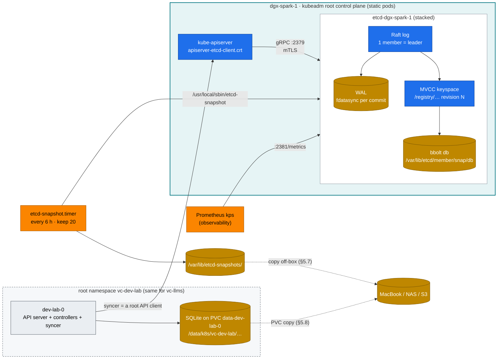
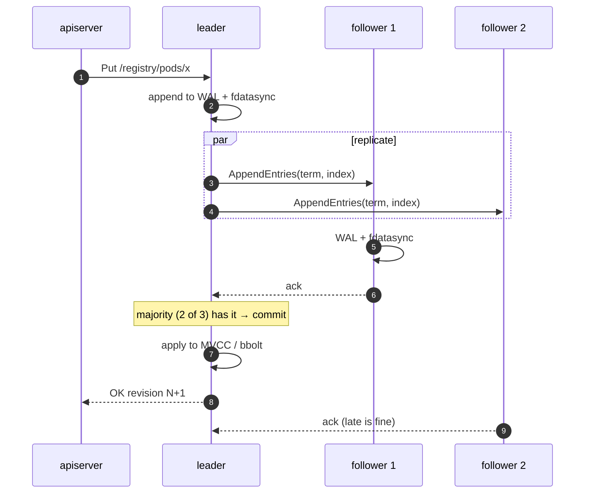
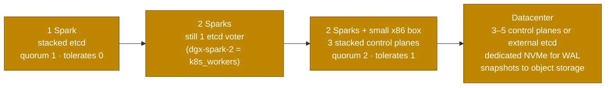

# Step 02 · etcd Deep Dive: Raft, MVCC, Quotas, Backups & Disaster Recovery

> **02 Kubernetes · Part I — Control plane & the nested lab · Step 02 of 28** · ← [Step 01 · Core architecture](01-kubernetes-core-architecture.md) · [All steps](00-kubernetes-step-by-step-guide.md) · [Step 03 · API server](03-kube-apiserver-internals.md) →

| | |
|---|---|
| **You will build** | A working knowledge of the root cluster's stacked etcd: its static pod, certificates, keyspace and the snapshot timer 01 Ansible installed. You'll prove Secret encryption by reading a raw key, break Raft on purpose in a throw-away 3-member etcd (kill the leader, lose quorum, hit NOSPACE), run a tested restore of the real root cluster, copy everything a rebuild needs off the box, and back up the state etcd does **not** hold: the two vClusters' SQLite databases |
| **Hardware** | dgx-spark-1 (Docker is already installed by 01 Ansible `container_runtime`; the sandbox uses it) |
| **Time** | 2 h |
| **Risk** | **Medium.** The restore step rolls the root cluster's state back and stops its control plane for a minute or two. Snapshot first, and do it when nothing important is running |
| **Clusters** | `spark-root` (etcd, snapshots, restore) · `dev-lab` (where a tenant's Secret really lives, PVC backup of its SQLite) · `llms` (survives a root restore untouched) |
| **Lab files** | [`scripts/etcd-drill.sh`](lab/scripts/etcd-drill.sh), [`scripts/etcd-sandbox.sh`](lab/scripts/etcd-sandbox.sh), [`etcd-sandbox/compose.yaml`](lab/etcd-sandbox/compose.yaml), [`manifests/root/95-observability/rules.yaml`](lab/manifests/root/95-observability/rules.yaml), [`addons/kube-prometheus-stack-values.yaml`](lab/addons/kube-prometheus-stack-values.yaml), [`manifests/root/60-storage/fio-job.yaml`](lab/manifests/root/60-storage/fio-job.yaml), [`vclusters/dev-lab.yaml`](lab/vclusters/dev-lab.yaml), 01 Ansible [`kubeadm-init.yaml.j2`](../01%20Ansible/lab/roles/kubeadm_cluster/templates/kubeadm-init.yaml.j2) and [`etcd-snapshot.sh.j2`](../01%20Ansible/lab/roles/kubeadm_cluster/templates/etcd-snapshot.sh.j2) |

---

## 1. Why this matters on a Spark

etcd is the root cluster's only source of truth. If it's lost, every Deployment, Secret, root quota, CiliumNetworkPolicy, GPU Operator `ClusterPolicy` and vCluster control-plane StatefulSet is gone. If it's slow, the API server is slow, leases expire, and controllers thrash. On a Spark it shares **one NVMe** with 60 GB model downloads, checkpoint writes and `fio`. That makes fsync latency, not capacity, the thing to watch.

The nesting adds a second lesson: **this lab has three databases, not one.** The root's etcd holds the root's objects — including the *host copies* of every tenant pod the syncers created. But each vCluster's own objects (its Deployments, Jobs, Kueue queues, RBAC, CRDs, Secrets) live in that vCluster's **embedded SQLite database on a PVC**. An etcd snapshot doesn't contain them, and an etcd restore doesn't roll them back.

| Datastore choice | When | This lab |
|---|---|---|
| **Stacked etcd** (kubeadm default: etcd as a static pod next to the API server) | single control plane now, 3 control planes later. Snapshots and `etcdctl` tooling | **the root cluster** |
| External etcd (its own hosts, `etcd.external` in the kubeadm config) | large clusters, strict separation of the datastore | datacenter (§8) |
| Embedded SQLite (vCluster's `backingStore.database.embedded`) | one-replica virtual control plane, no etcd to run | **both vClusters** |
| Embedded or external etcd for a vCluster | HA virtual control planes | §8 |

---

## 2. Architecture — HLD



Only the root API server talks to etcd. The vClusters reach it the same way every controller does — through the root API server, as a client — so a busy vCluster shows up as root API load (APF lane `spark-vcluster-syncers`, Step 03 §3.4) and then as etcd writes.

### 2.1 Raft in one picture



Quorum is ⌊n/2⌋+1. **1 member tolerates 0 failures, 2 members tolerate 0, and 3 tolerate 1.** The root runs one member, so steps 3–6 collapse into "fdatasync, then commit": every write the cluster makes waits for exactly one fsync on the Spark's NVMe. Two Sparks don't give you HA etcd; you need a third voter (§8). The sandbox in §5.4 shows the 3-member picture for real.

---

## 3. LLD

### 3.1 Paths, ports, flags (kubeadm, stacked)

| Item | Value |
|---|---|
| Static pod | `/etc/kubernetes/manifests/etcd.yaml` → mirror pod `kube-system/etcd-dgx-spark-1`; requests 100m CPU + 100Mi |
| Data dir | `/var/lib/etcd/` (`member/wal/`, `member/snap/db`) — a hostPath, set by `etcd.local.dataDir` in the kubeadm config |
| Client / peer / metrics | `https://127.0.0.1:2379` + `https://192.168.0.100:2379` · `https://192.168.0.100:2380` · `http://0.0.0.0:2381` (`listen-metrics-urls`, from the 01 Ansible kubeadm config so Prometheus can scrape it) |
| CA and certs (kubeadm's etcd CA) | `/etc/kubernetes/pki/etcd/{ca,server,peer,healthcheck-client}.{crt,key}`. The API server uses `/etc/kubernetes/pki/apiserver-etcd-client.{crt,key}` |
| etcdctl flags | `--endpoints=https://127.0.0.1:2379 --cacert=/etc/kubernetes/pki/etcd/ca.crt --cert=/etc/kubernetes/pki/etcd/healthcheck-client.crt --key=/etc/kubernetes/pki/etcd/healthcheck-client.key` |
| Tools | `etcdctl` (online, talks to the member) and `etcdutl` (offline, works on files: `snapshot status`, `snapshot restore`, offline `defrag`), downloaded by the `kubeadm_cluster` role at the exact version of the etcd image |
| Snapshots | `etcd-snapshot.timer` → `etcd-snapshot.service` → `/usr/local/sbin/etcd-snapshot` → `/var/lib/etcd-snapshots/etcd-dgx-spark-1-<YYYYmmdd-HHMMSS>[-suffix].db`, every 6 h, newest 20 kept |
| Backend quota | 2 GiB default (kubeadm doesn't change it). Raise with `etcd.local.extraArgs: [{name: quota-backend-bytes, value: "8589934592"}]` if needed |
| Compaction | the API server compacts every 5 min (`--etcd-compaction-interval`). **Defrag is manual** |
| Encryption config (needed to read Secrets from any backup) | `/etc/kubernetes/encryption/config.yaml` (aescbc, key `key1`) |

### 3.2 Keyspace

| Prefix | Holds |
|---|---|
| `/registry/pods/<ns>/<name>` | Pods (protobuf, prefix `k8s\x00`). Includes the synced tenant pods: `/registry/pods/vc-dev-lab/echo-…-x-lab-tools-x-dev-lab` |
| `/registry/secrets/<ns>/<name>` | Secrets, encrypted: value starts `k8s:enc:aescbc:v1:key1:` |
| `/registry/leases/kube-system/*` | leader-election leases (renewed every ~2 s) |
| `/registry/leases/kube-node-lease/dgx-spark-1` | node heartbeat (every 10 s) |
| `/registry/events/…` | Events, with a 1 h TTL. Often the biggest churn |
| `/registry/resourcequotas/vc-*/vcluster-budget` | the vClusters' budgets — the objects that size dev-lab and llms (Step 04 §3.2) |
| `/registry/apiextensions.k8s.io/customresourcedefinitions/…` | the **root's** CRDs: Cilium, MetalLB, GPU Operator, Prometheus Operator, Argo CD. Kueue, KEDA, KServe and Traefik CRDs are *not* here — they were installed into llms |

### 3.3 Health targets on NVMe

| Metric | Healthy | Alarm (lab rule) |
|---|---|---|
| `etcd_disk_wal_fsync_duration_seconds` p99 | < 10 ms | > 50 ms for 10 min (`EtcdSlowFsync`) |
| `etcd_disk_backend_commit_duration_seconds` p99 | < 25 ms | > 100 ms |
| `etcd_mvcc_db_total_size_in_bytes / etcd_server_quota_backend_bytes` | < 50 % | > 80 % (`EtcdDbNearQuota`) |
| `etcd_server_leader_changes_seen_total` rate | 0 on a single member | any increase |

### 3.4 Where each cluster's state lives

| Cluster | Backing store | Encrypted at rest? | Backed up by | Restored by |
|---|---|---|---|---|
| `spark-root` | stacked etcd, `/var/lib/etcd` | Secrets: yes (aescbc) | `etcd-snapshot.timer` + §5.7 | `scripts/etcd-drill.sh restore` (§5.6) |
| `dev-lab` | SQLite in the `dev-lab-0` pod, PVC `vc-dev-lab/data-dev-lab-0` (`local-nvme`, 5 Gi) | no — dev-lab's API server has no `--encryption-provider-config` | PVC copy or `vcluster snapshot` (§5.8) | replace the PVC contents (§5.8) |
| `llms` | same, PVC `vc-llms/data-llms-0` | no | same | same |

What the syncer copies to the root (pods, Services, PVCs, and the Secrets/ConfigMaps those pods use) **is** in root etcd — as host copies under translated names. That's why a root restore and a vCluster's own state can disagree, and why §5.6 shows you what the syncer does about it.

---

## 4. Integrations

| With | How |
|---|---|
| Step 03 Secret encryption | Proven in §5.3 by reading the raw key — and shown to stop at the root boundary |
| Prometheus (Step 17) | kube-prometheus-stack scrapes `kubeEtcd` on port 2381 over plain HTTP ([`addons/kube-prometheus-stack-values.yaml`](lab/addons/kube-prometheus-stack-values.yaml)); two alert rules in [`rules.yaml`](lab/manifests/root/95-observability/rules.yaml) |
| 01 Ansible `kubeadm_cluster` role | installs `etcdctl`/`etcdutl` matching the etcd image, `/usr/local/sbin/etcd-snapshot`, and the timer. `playbooks/99-reset-kubernetes.yml -e reset_wipe_data=true` deletes `/var/lib/etcd` — your off-box copy (§5.7) is the only way back after that |
| Off-box backup | §5.7 pulls snapshots + PKI + encryption config to your MacBook (not sema01: it already holds cluster-admin kubeconfigs, so keep the CA keys apart); vault01 KV (01 Ansible Step 18) for the keys. In production, push to object storage (MinIO from module 08 works) from the same timer |
| vClusters (Step 04) | their state is on PVCs, not in etcd (§3.4, §5.8; Step 04 §6.7) |
| Storage (Step 13) | fsync latency is a storage QoS problem. The checkpoint-write patterns in Step 13 are what hurt etcd |
| Controllers (Step 06) | an informer that watches from a compacted revision gets `410 Gone` and must re-list — compaction (§5.5) and restores (§5.6) are where that comes from |

---

## 5. Lab

All commands run on the Spark, from a checkout of this repo, in `02 Kubernetes/lab`: the `etcdctl` lines need the root's etcd client certificate, which only exists there. The scripts call `kubectl --context spark-root|dev-lab|llms`. The Spark's own `~/.kube/config` (written by 01 Ansible) is `admin.conf` with its context renamed to `spark-root`, which is enough for every root step; for the vCluster steps bring the full lab kubeconfig along:

```bash
# on your MacBook (after 01 Ansible/lab/tools/fetch-kubeconfig.sh sema01)
scp "01 Ansible/lab/.cache/kubeconfig-spark-lab.yaml" nvidia@192.168.0.100:.kube/spark-lab.yaml
# on the Spark
export KUBECONFIG=~/.kube/spark-lab.yaml
kubectl config get-contexts -o name          # spark-root, dev-lab, llms
```

### 5.1 Meet the stacked etcd

There's nothing to migrate: kubeadm created etcd at `kubeadm init`. Look at how:

```bash
cd "02 Kubernetes/lab"
sudo grep -E -- '--(data-dir|listen-client-urls|listen-peer-urls|listen-metrics-urls|initial-cluster|cert-file|trusted-ca-file|snapshot-count)=' \
  /etc/kubernetes/manifests/etcd.yaml
sudo ls /etc/kubernetes/pki/etcd/
kubectl --context spark-root -n kube-system get pod etcd-dgx-spark-1 -o wide
etcdctl version && etcdutl version
scripts/etcd-drill.sh status
```

Expected (abridged):

```text
+------------------+---------+----------+----------------------------+----------------------------------------------------+
|        ID        | STATUS  |   NAME   |         PEER ADDRS         |                    CLIENT ADDRS                    |
| 3a1f…            | started | dgx-spark-1 | https://192.168.0.100:2380 | https://127.0.0.1:2379,https://192.168.0.100:2379 |
+------------------------+---------+----------------+-----------+-----------+
|        ENDPOINT        | DB SIZE | DB SIZE IN USE | IS LEADER | RAFT TERM |
| https://127.0.0.1:2379 |  31 MB  |     18 MB      |   true    |     2     |
(empty alarm list)
-rw------- 1 root root  31M … etcd-dgx-spark-1-20261005-120000.db
NEXT                         LEFT    LAST  PASSED  UNIT                 ACTIVATES
Mon 2026-10-05 18:00:00 UTC  5h …    …     …       etcd-snapshot.timer  etcd-snapshot.service
```

Things to notice:

- **One member, always leader, term barely moves.** There's no one to hold an election against.
- **`etcdctl` and `etcdutl` match the server's version**, because 01 Ansible read the image tag out of `etcd.yaml` and downloaded that release. A mismatched `etcdutl` is the classic reason a restore fails at 3 a.m.
- **The snapshot timer is already running.** Read the script it calls — `sudo cat /usr/local/sbin/etcd-snapshot` — it's `etcdctl snapshot save`, an `etcdutl snapshot status` check, and retention. `systemctl status etcd-snapshot.service` shows the last run.
- **The client certificate is the etcd CA's `healthcheck-client`**, not the cluster admin's. kubeadm keeps etcd on its own CA, so nothing signed by the Kubernetes CA — no user, no ServiceAccount, no vCluster — can talk to etcd directly.

### 5.2 Measure the disk the way etcd uses it

etcd writes small records and fdatasyncs each one. Test exactly that on the filesystem that holds `/var/lib/etcd` (on a Spark that's the one NVMe that also holds `/data/k8s`, where every PVC lives):

```bash
df -h /var/lib/etcd /data/k8s                         # same device
sudo mkdir -p /var/lib/fio-etcd
sudo fio --name=etcd-wal --rw=write --ioengine=sync --fdatasync=1 --bs=2300 --size=22m --directory=/var/lib/fio-etcd
sudo rm -rf /var/lib/fio-etcd
```

Read the `fsync/fdatasync/sync_file_range` section: **99.00th percentile should be well under 10 ms** (a healthy Gen4/Gen5 NVMe gives tens to hundreds of µs). Now run it again while the Step 13 benchmark writes 1 MiB blocks into a PVC on the same NVMe:

```bash
kubectl --context spark-root apply -f manifests/root/60-storage/fio-job.yaml     # platform-tools, 4 CPUs, 64 Gi scratch PVC
kubectl --context spark-root -n platform-tools get pods -w                        # start the fio above while it runs
```

The tail latency jumps. That's what happens to the API server — and to both vClusters, whose SQLite files sit on the same disk — during a checkpoint write. Delete the job afterwards (`kubectl --context spark-root delete -f manifests/root/60-storage/fio-job.yaml`).

### 5.3 Look inside the keyspace

```bash
E="sudo ETCDCTL_API=3 etcdctl --endpoints=https://127.0.0.1:2379 --cacert=/etc/kubernetes/pki/etcd/ca.crt \
   --cert=/etc/kubernetes/pki/etcd/healthcheck-client.crt --key=/etc/kubernetes/pki/etcd/healthcheck-client.key"
$E get /registry --prefix --keys-only | awk -F/ 'NF>2 {print $3}' | sort | uniq -c | sort -rn | head -12
$E get /registry/pods/vc-dev-lab --prefix --keys-only | head -5        # tenant pods, under their host names
```

**Prove encryption on the root.** Create a Secret in a root namespace and read its raw value:

```bash
kubectl --context spark-root -n platform-tools create secret generic demo --from-literal=password=hunter2
$E get /registry/secrets/platform-tools/demo --print-value-only | head -c 64 | od -c | head -3
```

Expected: the value starts with `k8s:enc:aescbc:v1:key1:` and `hunter2` is nowhere in it. If you see the plaintext password, Secret encryption is off (Step 03 §3.5).

**Now follow a tenant's Secret.** A Secret `tenant-alpha/demo` lives in **dev-lab**, so `/registry/secrets/tenant-alpha/demo` doesn't exist in root etcd at all — there is no `tenant-alpha` namespace at the root. Where is it, and is it encrypted there? Create one in dev-lab and mount it into a pod, because vCluster only syncs Secrets that a synced pod uses:

```bash
kubectl --context dev-lab -n lab-tools create secret generic demo --from-literal=password=hunter2
kubectl --context dev-lab -n lab-tools run secret-user --image=registry.k8s.io/pause:3.10 \
  --overrides='{"spec":{"volumes":[{"name":"s","secret":{"secretName":"demo"}}],"containers":[{"name":"secret-user","image":"registry.k8s.io/pause:3.10","volumeMounts":[{"name":"s","mountPath":"/s"}]}]}}'
kubectl --context spark-root -n vc-dev-lab get secrets | grep demo          # demo-x-lab-tools-x-dev-lab
$E get /registry/secrets/vc-dev-lab/demo-x-lab-tools-x-dev-lab --print-value-only | head -c 32 | od -c | head -2
```

The **host copy** is encrypted (`k8s:enc:aescbc:v1:key1:` again): it went through the root API server. Now look at the original, in dev-lab's SQLite database on its PVC:

```bash
kubectl --context spark-root -n vc-dev-lab get pvc data-dev-lab-0
sudo ls -la /data/k8s/vc-dev-lab/data-dev-lab-0/
sudo grep -rac hunter2 /data/k8s/vc-dev-lab/data-dev-lab-0/ | grep -v ':0$'
```

Expected: one or more files report a match. dev-lab's API server stores Secrets unencrypted, so anyone with root on the Spark — or a copy of that PVC — can read every tenant Secret. That's the honest boundary of this design: **encryption at rest is a per-API-server setting**, and the vClusters have their own API servers. To close it, give each vCluster an encryption config (`controlPlane.distro.k8s.apiServer.extraArgs` plus a mounted Secret, like Step 03's audit exercise) — and then that key belongs in your backups too.

Answer for Workbook Ex 02: the tenant's Secret is readable in plaintext in dev-lab's database; only its host copy (if a pod uses it) is in root etcd, encrypted.

**MVCC in action.** Every write gets a new revision, and old revisions stay until compaction:

```bash
for i in 1 2 3; do kubectl --context spark-root -n platform-tools annotate secret demo rev=$i --overwrite >/dev/null; done
$E get /registry/secrets/platform-tools/demo -w json | jq '.kvs[0] | {create_revision, mod_revision, version}'
$E get /registry/secrets/platform-tools/demo --rev=$(( $($E get /registry/secrets/platform-tools/demo -w json | jq '.kvs[0].mod_revision') - 1 )) -w json | jq '.kvs[0].version'
```

`version` is 4 (create + 3 annotations); reading at an older revision returns the older version. That's exactly what a controller's `resourceVersion` is: an etcd revision.

Clean up: `kubectl --context dev-lab -n lab-tools delete pod secret-user && kubectl --context dev-lab -n lab-tools delete secret demo`. Keep `platform-tools/demo` for §5.6.

### 5.4 Break Raft on purpose (sandbox, not your cluster)

The sandbox is three etcd containers under Docker. Docker on DGX OS shares `containerd.io` with Kubernetes but uses its own containerd namespace (`moby`), so `sudo crictl ps` won't show them and they never touch the root etcd.

```bash
scripts/etcd-sandbox.sh up
scripts/etcd-sandbox.sh kill-leader
scripts/etcd-sandbox.sh kill-two
```

Expected:

```text
[....] stopping leader e2
[PASS] new leader e1 after 1180 ms (election timeout 1000 ms)
OK
[PASS] writes still work with 2/3 members
Error: context deadline exceeded
[PASS] write failed: no quorum (expected)
[PASS] serializable (possibly stale) read still served locally
```

This is why a Kubernetes control plane with 1 of 3 etcd members left serves `kubectl get` from the API server's watch cache but can't create anything — and why a 2-member etcd is worse than 1: stop either member and you're in the `kill-two` state.

### 5.5 Hit the space quota and recover

```bash
scripts/etcd-sandbox.sh fill          # 32 MiB quota → NOSPACE
scripts/etcd-sandbox.sh recover-space # compact → defrag --cluster → alarm disarm
```

Expected at the end of `fill`: `memberID:… alarm:NOSPACE`, with writes failing with `etcdserver: mvcc: database space exceeded`. After recovery, `DB SIZE` drops and the alarm list is empty.

The same sequence on the root, if `EtcdDbNearQuota` ever fires (`$E` from §5.3):

```bash
$E endpoint status -w table                          # DB SIZE vs DB SIZE IN USE: the gap is what defrag returns
rev=$($E endpoint status -w json | jq '.[0].Status.header.revision')
$E compact "$rev"                                    # drop history older than now (the API server does this every 5 min anyway)
$E defrag                                            # rewrite bbolt; blocks this member while it runs
$E alarm list && $E alarm disarm
```

With one member, `defrag` blocks **the only** member: the root API server stalls for its duration (seconds on a small DB), and both vClusters' syncers queue behind it. Do it off-peak. In a 3-member cluster you defrag one member at a time, never `--cluster` in production.

### 5.6 Snapshot and restore the root cluster

Make a marker on each side of the snapshot, so you can see exactly what rolls back:

```bash
scripts/etcd-drill.sh snapshot                                  # → /var/lib/etcd-snapshots/etcd-dgx-spark-1-<ts>-drill.db
kubectl --context spark-root create namespace doomed-by-restore    # root, after the snapshot
kubectl --context spark-root -n platform-tools create configmap doomed --from-literal=x=1
kubectl --context dev-lab create namespace survives-restore        # dev-lab, after the snapshot
sudo ls -1t /var/lib/etcd-snapshots | head -1                   # note the file name
scripts/etcd-drill.sh restore etcd-dgx-spark-1-20261005-120000-drill.db
```

What `restore` does (read [`etcd-drill.sh`](lab/scripts/etcd-drill.sh)):

1. **Stop the control plane** by moving every static-pod manifest out of `/etc/kubernetes/manifests` — the kubelet stops etcd, the API server, the scheduler and the controller-manager. Running pods (including both vClusters and every tenant workload) keep running; nothing can change them.
2. **Keep** the current data dir as `/var/lib/etcd.before-restore-<ts>` (your undo).
3. **`etcdutl snapshot restore`** into `/var/lib/etcd` with the member name and peer URL read from `etcd.yaml`, so the manifest needs no edits.
4. **Start the control plane** by moving the manifests back, then wait for `/readyz`.

While the root API is down, `kubectl --context dev-lab get pods` still works — dev-lab's API server reads its own SQLite — but nothing new reaches the node: the syncer can't talk to the root.

Then check:

```bash
kubectl --context spark-root get ns doomed-by-restore                      # NotFound: created after the snapshot
kubectl --context spark-root -n platform-tools get cm doomed               # NotFound
kubectl --context spark-root -n platform-tools get secret demo             # still there (created before)
kubectl --context dev-lab get ns survives-restore                          # still there: dev-lab's state is not in etcd
kubectl --context spark-root -n vc-dev-lab get pods -w                     # watch the syncer reconcile
scripts/verify.sh platform vclusters
```

The last two lines are where the nesting gets interesting. After the restore, root etcd describes the world as it was at snapshot time, but each vCluster's database describes *now*. The syncer is a controller (Step 06 §5.6): it compares the two and repairs host copies — expect host copies of tenant objects created or deleted since the snapshot to be recreated or removed over the next minute or two. Watch it rather than assume it; anything it can't repair shows up as a sync error event on the object inside the vCluster.

Workbook Ex 20 asks you to doom a namespace, a ConfigMap and a Kueue LocalQueue. The first two go in the root; a LocalQueue lives in **llms** (Kueue is installed there), so a root restore will *not* remove it. Put the third doomed object in a root CRD instead (for example a `CiliumNetworkPolicy` in `platform-tools`), or restore llms's PVC (§5.8) as well.

> **Clients that remember revisions.** A restore moves etcd's revision *backwards*. A controller whose informer watched at revision N+100 now talks to an etcd at revision N. Restarting the whole control plane (what the drill does) fixes the root's own components; long-running clients elsewhere (the vCluster syncers, `slice-ledger`, Argo CD) may need a restart or a re-list. etcd ≥ 3.5.10's `etcdutl snapshot restore --bump-revision <n> --mark-compacted` makes that automatic: every client's next watch gets `410 Gone` and re-lists. The lab script doesn't use it — add it when you run this on a cluster with many external controllers.

> **Encrypted Secrets:** the snapshot holds ciphertext. A restore on a *new* machine also needs `/etc/kubernetes/encryption/config.yaml` and the cluster's CAs under `/etc/kubernetes/pki` (otherwise every kubeconfig, ServiceAccount token and the vClusters' syncer credentials stop working). §5.7 copies those with the snapshots.

### 5.7 Copy snapshots off the box

A snapshot on the Spark's own NVMe protects you from a bad `kubectl delete`, not from a dead disk or `99-reset-kubernetes.yml -e reset_wipe_data=true`. From your MacBook (as the admin user `nvidia` with your own key, the same login as the bootstrap playbooks), pull everything a rebuild on *new* hardware needs in one tarball:

```bash
mkdir -p ~/spark-backups
ssh nvidia@192.168.0.100 'sudo tar czf - -C / var/lib/etcd-snapshots etc/kubernetes/pki etc/kubernetes/encryption/config.yaml \
  etc/kubernetes/kubeadm-config.yaml' > ~/spark-backups/spark-root-$(date +%F).tgz
tar tzf ~/spark-backups/spark-root-$(date +%F).tgz | head
```

| In the tarball | Why a restore needs it |
|---|---|
| `var/lib/etcd-snapshots/*.db` | the data (all 20 kept snapshots; take only the newest if bandwidth matters) |
| `etc/kubernetes/pki/` | the cluster CA, front-proxy CA, ServiceAccount signing key and etcd CA. Restoring onto a fresh `kubeadm init` with *new* CAs would leave every existing token and kubeconfig invalid |
| `etc/kubernetes/encryption/config.yaml` | the AES key: without it every Secret in the snapshot is unreadable ciphertext |
| `etc/kubernetes/kubeadm-config.yaml` | the exact config 01 Ansible ran `kubeadm init` with |

Treat that tarball like a password: it holds the key that decrypts every Secret **and** the CA keys that can mint cluster-admin certificates. Encrypt it at rest (`age`/`gpg`), or store the keys in vault01's KV (01 Ansible Step 18) and only the snapshots on the NAS. Automate it daily (Step 05's operations table) — a `cron`/`launchd` job on the MacBook (or a timer on the NAS) running this `ssh … | …` line is enough.

### 5.8 Back up a vCluster's own state

None of §5.6–5.7 covers dev-lab's or llms's objects. Each keeps them in SQLite on a `local-nvme` PVC, which local-path-provisioner placed at `/data/k8s/<namespace>/<pvc>` ([`addons/local-path-nvme.yaml`](lab/addons/local-path-nvme.yaml)). The lab supports two ways to back it up:

**PVC copy (what the lab tests, Step 04 §6.7).** Stop the writer, copy the directory, start it again:

```bash
kubectl --context spark-root -n vc-dev-lab scale statefulset dev-lab --replicas=0
kubectl --context spark-root -n vc-dev-lab wait --for=delete pod/dev-lab-0 --timeout=120s
sudo tar czf ~/dev-lab-$(date +%F).tgz -C /data/k8s/vc-dev-lab data-dev-lab-0
kubectl --context spark-root -n vc-dev-lab scale statefulset dev-lab --replicas=1
kubectl --context spark-root -n vc-dev-lab rollout status statefulset dev-lab
```

While the control plane is at 0 replicas, tenant pods keep running — they are root pods — but `kubectl --context dev-lab` fails and nothing new syncs. Scaling to 0 matters: copying a live SQLite file (with its `-wal` file being written) can give you an inconsistent copy. Restore is the same dance with the directory replaced. Repeat for `vc-llms` / `data-llms-0`, and copy the tarballs off-box with the etcd ones.

**`vcluster snapshot` (optional CLI).** [`scripts/preflight.sh`](lab/scripts/preflight.sh) reports whether the `vcluster` CLI is installed. Recent CLIs can snapshot a running vCluster without scaling it down; the syntax has changed between releases, so check `vcluster snapshot --help` for the version matching `VCLUSTER_VERSION` in [`versions.env`](lab/versions.env) before scripting it.

Either way, a *consistent* lab backup is a pair: a root etcd snapshot and both vCluster copies taken close together. Restoring only one side is allowed — the syncer reconciles — but expect the host copies to follow whichever side is the vCluster's.

---

## 6. Verify

| Check | Expected |
|---|---|
| `scripts/etcd-drill.sh status` | 1 member `dgx-spark-1`, `IS LEADER true`, empty alarm list, ≥ 1 snapshot, `etcd-snapshot.timer` scheduled |
| `scripts/verify.sh platform` | includes `[PASS] etcd snapshots present (N)` |
| raw root Secret starts with `k8s:enc:aescbc:v1:key1:` | yes |
| Prometheus `histogram_quantile(0.99, rate(etcd_disk_wal_fsync_duration_seconds_bucket[5m]))` | < 0.01 when idle |
| Restore drill | root objects created after the snapshot are gone; dev-lab's `survives-restore` namespace is still there; `scripts/verify.sh platform vclusters` passes |
| Off-box | the tarball on your MacBook lists `etcd-snapshots`, `pki/ca.key`, `encryption/config.yaml`; a `dev-lab-<date>.tgz` exists too |

---

## 7. Troubleshooting

| Symptom | Cause | Diagnose | Fix |
|---|---|---|---|
| All writes fail: `mvcc: database space exceeded` | Quota hit, NOSPACE alarm | `scripts/etcd-drill.sh status` (alarm list, DB size) | compact → defrag → `alarm disarm` (§5.5). Find the churn (`--keys-only` counts): often Events, a CRD in a hot loop (Step 06), or a vCluster syncer looping on one object (look under `/registry/*/vc-*`) |
| API latency spikes, `apply request took too long` in the etcd log | fsync slow | `EtcdSlowFsync`, §5.2 fio, `iostat -x 1`, `sudo crictl logs $(sudo crictl ps -q --name '^etcd$') 2>&1 \| grep 'took too long'` | Move bulk writers (checkpoints, fio, image pulls) off peak. `ionice -c3` on batch jobs. Both vClusters' SQLite files suffer the same contention |
| Leader changes on a single member | not normally possible. Clock jumps or process stalls | `sudo crictl logs <etcd id> 2>&1 \| grep -iE 'leader\|elect'` | check chrony (01 Ansible baseline), CPU starvation (`systemReserved`, a runaway pod without limits on the root) |
| `kubectl` hangs after a restore, API server crash-loops | etcd didn't come back: wrong `--name`/`--initial-cluster`, or data dir permissions | `sudo crictl ps -a --name etcd`, `sudo crictl logs <id>`; `sudo ls -la /var/lib/etcd/member` | the drill reads name and IP from `etcd.yaml`; if you restored by hand, re-run `etcdutl snapshot restore` with `--name dgx-spark-1 --initial-cluster dgx-spark-1=https://192.168.0.100:2380 --initial-advertise-peer-urls https://192.168.0.100:2380`. Undo: move `/var/lib/etcd.before-restore-<ts>` back |
| `etcdutl: snapshot file has wrong format` / version errors | `etcdutl` doesn't match the etcd that wrote it | `etcdutl version` vs the image tag in `etcd.yaml` | re-run 01 Ansible `playbooks/05-kubernetes.yml` (downloads the matching tools) |
| Secrets unreadable after restoring on new hardware | encryption config not restored | `kubectl --context spark-root get secret -A` → `Internal error … failed to decrypt` | restore `/etc/kubernetes/encryption/config.yaml` from §5.7 and restart the API server |
| `etcdctl: context deadline exceeded` | wrong endpoint/certs | run with `--debug` | use the flags from §3.1 (`healthcheck-client`, not the API server's or admin's cert) |
| DB grows while object count doesn't | no defrag after compaction | `DB SIZE` vs `DB SIZE IN USE` in `endpoint status` | `defrag` (it blocks the member briefly, so do it off-peak) |
| A vCluster's objects are "back" after a root restore | they never left — they're in its SQLite | §3.4 | expected. To roll a vCluster back, restore its PVC (§5.8) |
| A vCluster's control plane won't start after a PVC restore | copied while it was running (torn SQLite + WAL) | `kubectl --context spark-root -n vc-dev-lab logs dev-lab-0` | restore a copy taken with the StatefulSet at 0 replicas |

---

## 8. Scale-out path



- **Don't make dgx-spark-2 a second control plane** with only two machines. A 2-member etcd *halves* your availability: quorum is 2 of 2, so either member failing stops all writes (§5.4 `kill-two` is exactly that state). dgx-spark-2 joins as a worker (`k8s_workers`) and etcd stays a single voter.
- **Three stacked members** is kubeadm's built-in HA. The kubeadm config already sets `controlPlaneEndpoint: 192.168.0.100:6443`; in production that becomes a VIP or load balancer (kube-vip, HAProxy) in front of all three API servers. Then `kubeadm init phase upload-certs --upload-certs` on dgx-spark-1 and `kubeadm join 192.168.0.100:6443 --control-plane --certificate-key …` on each new node: kubeadm adds an etcd member per control plane. The third voter can be any small Linux box (a NUC, or a VM on the control node) — tainted `node-role.kubernetes.io/control-plane:NoSchedule` so it carries no workloads.
- **External etcd** (`etcd.external.endpoints` in the kubeadm `ClusterConfiguration`) puts 3 or 5 etcd members on their own hosts: the API servers' failure domains and etcd's are separated, and etcd gets disks nothing else writes to. More machines and more PKI to manage; it's the choice for large clusters.
- **Restores with several members** are a cluster-wide operation: stop every API server, restore the same snapshot on every member with the full `--initial-cluster` list (or restore one member and re-add the others), then start everything. Practise it on a scratch cluster before you need it.
- **The vClusters** each run one control-plane replica on SQLite. For HA, vCluster supports several replicas with embedded etcd (Raft *inside* the vCluster's pods) or an external etcd — and those replicas only survive a node failure if the root has more than one node to put them on.
- **Production habits:** snapshots every hour to object storage, a quarterly restore rehearsal on a scratch cluster, a 99th-percentile fsync SLO under 10 ms on dedicated disks, and backups of every nested cluster's datastore next to the root's.

---

## 9. Checklist

- [ ] I can name the static-pod manifest, data dir, CA and client certificate of the root's etcd, and I've read the snapshot script the timer runs.
- [ ] I measured fdatasync latency and saw it degrade under competing I/O.
- [ ] I proved Secret encryption with a raw etcd read — and found the tenant Secret that *isn't* encrypted, in dev-lab's SQLite.
- [ ] I saw an election, a quorum loss and a NOSPACE alarm in the sandbox, and recovered each.
- [ ] I restored the root from a snapshot, saw root objects roll back while dev-lab's didn't, and watched the syncer reconcile.
- [ ] I have an off-box tarball with snapshots, PKI and the encryption config, and a copy of each vCluster's PVC.
- [ ] I can explain why two Sparks can't give the root an HA etcd, and what three members (stacked or external) look like.
