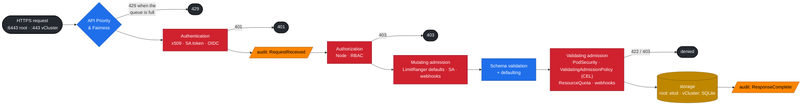
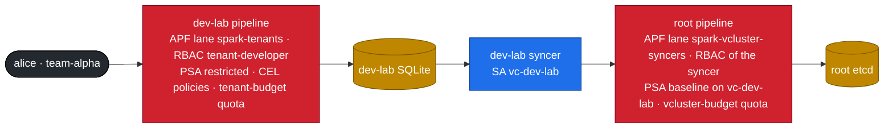

# Volume 02 — kube-apiserver Internals: AuthN, RBAC, Admission (CEL), API Priority & Fairness, Audit

> **Module 02 · Part I — Control plane** · Prev: [01 Core architecture](01-kubernetes-core-architecture.md) · Next: [03 etcd](03-etcd-database-deep-dive.md)

| | |
|---|---|
| **You will build** | Real users with client certificates, tenant RBAC, four in-process admission policies written in CEL, fair-queuing lanes for tenant traffic **and** for the vCluster syncers, Secret encryption you can prove in etcd, and an audit log you can query |
| **Hardware** | dgx-spark-01 (kubeadm root + two vClusters). Everything except the audit-log and etcd steps also works on the CI kind setup (`lab/tests/fake-gpu-node.sh` + two vClusters) |
| **Time** | 90 min |
| **Risk** | Low. Audit and encryption were configured at `kubeadm init` by 01 Ansible; nothing restarts |
| **Clusters** | `dev-lab` (users, RBAC, CEL, tenant APF) · `llms` (CEL, CI ServiceAccount) · `spark-root` (audit, encryption, syncer APF) |
| **Lab files** | [`kubeadm/audit-policy.yaml`](lab/kubeadm/audit-policy.yaml), 01 Ansible [`kubeadm-init.yaml.j2`](../01%20Ansible/lab/roles/kubeadm_cluster/templates/kubeadm-init.yaml.j2), [`manifests/dev-lab/10-tenancy/rbac.yaml`](lab/manifests/dev-lab/10-tenancy/rbac.yaml), [`manifests/common/15-admission/policies.yaml`](lab/manifests/common/15-admission/policies.yaml), [`manifests/dev-lab/16-apf/apf.yaml`](lab/manifests/dev-lab/16-apf/apf.yaml), [`manifests/root/16-apf/vcluster-syncers.yaml`](lab/manifests/root/16-apf/vcluster-syncers.yaml), [`scripts/make-user.sh`](lab/scripts/make-user.sh), [`tests/policy/`](lab/tests/policy/) |

---

## 1. Why this matters on a Spark

A single Spark shared by several teams is a multi-tenant platform. Every guardrail that keeps team alpha from starving, reading or breaking team beta is enforced **inside a request pipeline** in an API server. In this lab there are three API servers, so there are three pipelines — and a tenant's request crosses **two** of them: first its vCluster's (where the tenant's identity, RBAC and policies apply), then the root's (where the vCluster's syncer is the caller and the vCluster's budget applies). If you understand both, you can predict the exact error message a misbehaving request gets, which API server rejects it, and which log records it.

---

## 2. Architecture — the request pipeline (HLD)



The same pipeline runs twice for a tenant pod:



| Stage | Question it answers | Typical failure text |
|---|---|---|
| APF | "Is there capacity for *this kind* of caller right now?" | `429 Too Many Requests`, header `X-Kubernetes-PF-FlowSchema-UID` |
| AuthN | "Who are you?" (user + groups) | `401 Unauthorized` / `You must be logged in` |
| AuthZ | "May *who* do *verb* on *resource* in *namespace*?" | `forbidden: User "alice" cannot create resource "pods"… in the namespace "tenant-beta"` |
| Mutating admission | "Fill in or rewrite fields" | usually silent (LimitRanger adds defaults) |
| Validating admission | "Is the final object acceptable?" | `ValidatingAdmissionPolicy 'x' … denied request: …`, `violates PodSecurity "restricted:latest"`, `exceeded quota` |

When the **root** pipeline rejects a synced pod, the tenant doesn't get an error from `kubectl` — its request already succeeded in the vCluster. The rejection shows up as a sync error event on the pod inside the vCluster, and the pod stays `Pending` (Vol 27 §4, break/fix 02).

---

## 3. LLD

### 3.1 Identities in the lab

| Identity | Cluster | How it authenticates | Groups | Can do |
|---|---|---|---|---|
| `kubernetes-admin` (01 Ansible kubeconfig, context `spark-root`) | root | client cert from the kubeadm CA (`/etc/kubernetes/admin.conf`) | `kubeadm:cluster-admins` → bound to `cluster-admin` | everything on the root. Keep it off laptops you share. (`/etc/kubernetes/super-admin.conf` holds a `system:masters` cert for break-glass only) |
| vCluster admin (contexts `dev-lab`, `llms`) | each vCluster | client cert from **that vCluster's own CA** (exported Secret `vc-<name>`) | `system:masters` *inside the vCluster* | everything in that vCluster, nothing on the root |
| `alice` | dev-lab | client cert via dev-lab's CSR API ([`make-user.sh`](lab/scripts/make-user.sh)) | `team-alpha` (cert `O=`) | `spark-tenant-developer` in `tenant-alpha`, read nodes |
| `bob` | dev-lab | client cert | `team-beta` | same in `tenant-beta` |
| `llm-serving/ci-deployer` | llms | ServiceAccount token | `system:serviceaccounts:llm-serving` | `edit` in `llm-serving` only |
| `vc-dev-lab`, `vc-llms` syncers | root | ServiceAccount token in the vCluster's pod | `system:serviceaccounts:vc-dev-lab` | a Role in its own `vc-*` namespace (created by the chart) + read nodes/storage classes |

Each vCluster has its own CA: Alice's certificate means nothing to the root or to `llms`. That is the isolation you get for free.

### 3.2 RBAC design

| ClusterRole | Cluster | Verbs highlight | Bound where |
|---|---|---|---|
| `spark-tenant-developer` | dev-lab | full on pods/deployments/jobs/PVCs. Secrets **without `watch`**. **read-only** quota/limitrange. Read Kueue workloads | RoleBinding per tenant namespace |
| `spark-gpu-viewer` | dev-lab | get/list nodes (the synced Spark node), metrics | ClusterRoleBinding to both teams, so they can see GPU capacity |
| `edit` (built-in) | llms | namespace-scoped write | `ci-deployer` in `llm-serving` |
| vCluster Role (chart) | root | pods, services, PVCs, … in `vc-<name>` only | the syncer's ServiceAccount |

### 3.3 Admission policies (CEL, no webhook server)

The same four policies ([`common/15-admission`](lab/manifests/common/15-admission/policies.yaml)) run inside **both** vClusters, each enforced by that vCluster's API server:

| Policy | Binds to | Rule | Why on a Spark |
|---|---|---|---|
| `spark-no-latest-tag` | tenants, llm-serving, batch | image must have a tag or digest, and not `:latest` | reproducible rollbacks. Also avoids re-pulling a 10 GB NGC image |
| `spark-gpu-slice-limits` | `spark.lab/tenant=true` | `nvidia.com/gpu` ≤ 1 per container | dev-lab has 2 slices in total. One tenant must not take both |
| `spark-no-nvidia-env-bypass` | tenants | no `NVIDIA_VISIBLE_DEVICES`, `NVIDIA_DRIVER_CAPABILITIES` or `CUDA_VISIBLE_DEVICES` in env | with the nvidia default runtime, that env would grant GPU access without a quota-counted request — outside every budget |
| `spark-serving-needs-readiness` | `spark.lab/tier=serving` | Deployments/StatefulSets must have a `readinessProbe` | a vLLM pod takes minutes to load weights, and must not get traffic while it does |

Plus built-ins: **PodSecurity** `restricted` on tenant namespaces (`baseline` on serving, since NGC images run as root), **LimitRanger**, **ResourceQuota** — in each vCluster for its tenants, and again at the root for the `vc-*` namespaces (baseline/privileged PSA, LimitRange safety net, the vCluster budget).

### 3.4 API Priority & Fairness — two lanes, two layers

| Object | Cluster | Setting | Effect |
|---|---|---|---|
| PriorityLevel `spark-tenants` | dev-lab | `nominalConcurrencyShares: 10`, 16 queues, hand size 4 | Tenants share a small slice of dev-lab's API concurrency |
| FlowSchema `spark-tenants` | dev-lab | groups `team-alpha`, `team-beta`, `distinguisherMethod: ByUser`, precedence 900 | Fairness is **per user**. Alice's watch loop can't starve Bob |
| PriorityLevel `spark-vcluster-syncers` | root | `nominalConcurrencyShares: 30`, 8 queues, `lendablePercent: 50` | Everything the vClusters do reaches the root through this lane |
| FlowSchema `spark-vcluster-syncers` | root | ServiceAccounts in `vc-dev-lab` / `vc-llms`, `distinguisherMethod: ByNamespace`, precedence 800 | Fairness is **per vCluster**: a tenant loop in dev-lab can't crowd out llms, and neither can starve the kubelet or the GPU Operator |

### 3.5 Secret encryption and audit (root)

Both are flags kubeadm put on the root API server from the 01 Ansible config:

| Flag | File | What it does |
|---|---|---|
| `--encryption-provider-config` | `/etc/kubernetes/encryption/config.yaml` (key generated once, mode 0600) | Secrets are stored in etcd encrypted with AES-CBC (`k8s:enc:aescbc:v1:key1:` prefix). Back the key up in vault01's KV (01 Ansible Vol 19) — without it, an etcd backup's Secrets are unreadable |
| `--audit-policy-file`, `--audit-log-*` | [`audit-policy.yaml`](lab/kubeadm/audit-policy.yaml) → `/var/log/kubernetes/audit/audit.log`, rotated at 100 MB × 5 | Metadata for secrets/configmaps (never payloads), drops noisy reads, **RequestResponse** for every mutation in `vc-dev-lab`, `vc-llms`, `gpu-operator`, `platform-tools` |

The root audit log sees what reached the root: a tenant's pod appears as a **create by the syncer** (`system:serviceaccount:vc-dev-lab:vc-dev-lab`), not by Alice. Alice's own request is in dev-lab's API server. For a per-tenant audit trail, give each vCluster its own audit policy (§5 Step 7, last part).

---

## 4. Integrations

| With | How |
|---|---|
| vault01 (01 Ansible 00a, Vol 19) | Store the tenant kubeconfigs `make-user.sh` produces in vault01's KV mount, e.g. `kv/k8s/<cluster>/<user>` — outside `kv/spark-lab/*`, which Semaphore's AppRole can read — and the encryption key `/etc/kubernetes/encryption/config.yaml`. For long-lived automation, prefer Vault's Kubernetes secrets engine, which mints short-lived SA tokens |
| Loki / Alloy (01 Ansible Vol 23) | Ship `/var/log/kubernetes/audit/audit.log` with a `loki.source.file` block. Query `{job="k8s-audit"} \| json \| verb="delete"` |
| Kueue (Vol 05) | Tenants get read-only access to `workloads`, so they can see *why* their job is queued |
| CI (GitHub Actions) | `ci-deployer` token (llms) → `kubectl apply` into `llm-serving` only |

---

## 5. Lab

### Step 1 · Prove audit logging and Secret encryption (on the Spark)

```bash
cd "02 Kubernetes/lab"
sudo grep -E 'audit-|encryption-provider' /etc/kubernetes/manifests/kube-apiserver.yaml
kubectl --context spark-root -n default create secret generic enc-test --from-literal=password=hunter2
sudo ETCDCTL_API=3 etcdctl --endpoints=https://127.0.0.1:2379 --cacert=/etc/kubernetes/pki/etcd/ca.crt \
  --cert=/etc/kubernetes/pki/etcd/healthcheck-client.crt --key=/etc/kubernetes/pki/etcd/healthcheck-client.key \
  get /registry/secrets/default/enc-test --print-value-only | head -c 48 | od -c | head -3
```

Expected: the flags are there, and the stored value begins `k8s:enc:aescbc:v1:key1:` followed by ciphertext — `hunter2` appears nowhere.

Secrets created **before** encryption was switched on would still be stored in plaintext until they're written again. On this lab encryption was on from the first second, but the habit matters after any key change:

```bash
kubectl --context spark-root get secrets -A -o json | kubectl --context spark-root replace -f - >/dev/null && echo re-encrypted
```

### Step 2 · Apply tenancy, admission and APF

```bash
for d in 00-platform 10-tenancy 15-admission 16-apf; do kubectl --context dev-lab apply -k manifests/dev-lab/$d; done
for d in 00-platform 10-tenancy 15-admission; do kubectl --context llms apply -k manifests/llms/$d; done
kubectl --context spark-root apply -k manifests/root/16-apf
kubectl --context dev-lab get validatingadmissionpolicies
```

### Step 3 · Create real users (in dev-lab)

```bash
scripts/make-user.sh alice team-alpha          # signed by dev-lab's CA
scripts/make-user.sh bob   team-beta
export ALICE=$PWD/.cache/alice.kubeconfig
KUBECONFIG=$ALICE kubectl auth whoami
```

```text
ATTRIBUTE   VALUE
Username    alice
Groups      [team-alpha system:authenticated]
```

Now point Alice's certificate at the root:

```bash
KUBECONFIG=$ALICE kubectl --server https://192.168.0.100:6443 --insecure-skip-tls-verify get ns
# error: You must be logged in to the server (Unauthorized)
```

The root doesn't trust dev-lab's CA, so Alice isn't even a user there. That's a 401, not a 403.

### Step 4 · Probe RBAC before users hit it

```bash
kubectl --context dev-lab auth can-i --list -n tenant-alpha --as=alice --as-group=team-alpha | head -20
for v in "create pods -n tenant-alpha" "create pods -n tenant-beta" "update resourcequota -n tenant-alpha" \
         "watch secrets -n tenant-alpha" "list nodes"; do
  printf '%-40s %s\n' "$v" "$(kubectl --context dev-lab auth can-i $v --as=alice --as-group=team-alpha)"
done
```

Expected:

```text
create pods -n tenant-alpha              yes
create pods -n tenant-beta               no
update resourcequota -n tenant-alpha     no
watch secrets -n tenant-alpha            no
list nodes                               yes
```

Now as Alice for real:

```bash
KUBECONFIG=$ALICE kubectl -n tenant-beta get pods
# Error from server (Forbidden): pods is forbidden: User "alice" cannot list resource "pods" in API group "" in the namespace "tenant-beta"
```

And what can a vCluster's syncer do on the root?

```bash
kubectl --context spark-root auth can-i --list -n vc-dev-lab --as=system:serviceaccount:vc-dev-lab:vc-dev-lab | head
kubectl --context spark-root auth can-i create pods -n vc-llms --as=system:serviceaccount:vc-dev-lab:vc-dev-lab    # no
```

### Step 5 · Exercise the admission policies (server-side dry run)

```bash
scripts/verify.sh admission
```

```text
── admission (server-side dry-run inside each vCluster, nothing is created)
[PASS] allowed allow-digest-image (dev-lab)
[PASS] allowed allow-gpu-one-slice (dev-lab)
[PASS] allowed allow-serving-with-readiness (llms)
[PASS] denied  deny-gpu-two-slices (dev-lab)
[PASS] denied  deny-latest-tag (dev-lab)
[PASS] denied  deny-nvidia-env-bypass (dev-lab)
[PASS] denied  deny-over-limitrange (dev-lab)
[PASS] denied  deny-over-quota-memory (dev-lab)
[PASS] denied  deny-privileged-in-tenant (dev-lab)
[PASS] denied  deny-serving-without-readiness (llms)
[PASS] denied  deny-untagged-image (dev-lab)
```

Read one denial in full, so you can recognize it in a pipeline log:

```bash
kubectl --context dev-lab create --dry-run=server -f tests/policy/deny-gpu-two-slices.yaml
```

```text
The pods "pt-deny-gpu-two-slices" is invalid: : ValidatingAdmissionPolicy 'spark-gpu-slice-limits'
with binding 'spark-gpu-slice-limits' denied request: tenant containers may request at most 1 nvidia.com/gpu time-slice
```

The CEL behind it uses optional-field access, so pods without `resources` don't trip an error:

```yaml
- expression: >-
    object.spec.containers.all(c,
      quantity(c.?resources.?limits[?'nvidia.com/gpu'].orValue('0')).compareTo(quantity('1')) <= 0)
```

> **Seen `status.typeChecking.expressionWarnings: undefined field 'limits'`?** The type checker can't resolve `ResourceRequirements` maps on some versions. It's a warning, and the runtime result is correct. The dry-run tests above prove it. Keep a test fixture for every policy for exactly this reason.

### Step 6 · API Priority & Fairness under load — both layers

Generate tenant load as Alice (32 parallel LIST loops), and watch as admin in dev-lab *and* at the root:

```bash
# terminal A — Alice misbehaves
for i in $(seq 32); do (while true; do KUBECONFIG=$ALICE kubectl -n tenant-alpha get pods -o name >/dev/null 2>&1; done &) ; done

# terminal B — dev-lab's API server: the tenant lane fills up
watch -n2 "kubectl --context dev-lab get --raw /metrics | grep -E 'apiserver_flowcontrol_(current_inqueue_requests|rejected_requests_total|current_executing_requests)\{.*spark-tenants' "

# terminal C — Bob, and the root, are unaffected
time KUBECONFIG=.cache/bob.kubeconfig kubectl -n tenant-beta get pods
time kubectl --context spark-root get nodes
kubectl --context spark-root get --raw /debug/api_priority_and_fairness/dump_priority_levels | column -t -s, \
  | grep -E 'PriorityLevelName|spark-vcluster-syncers|global-default'

# stop the flood
pkill -f "kubectl -n tenant-alpha get pods"
```

Expected: in dev-lab, `current_inqueue_requests{priority_level="spark-tenants"}` climbs and some of Alice's calls may get `429`. Bob's call stays under ~100 ms (queues are shuffle-sharded per user). The root barely notices: LISTs of tenant pods are answered from dev-lab's own database. Now make the root notice — create and delete pods in a loop (each one is a syncer write to the root) and watch the `spark-vcluster-syncers` lane instead.

### Step 7 · Query the audit log

```bash
KUBECONFIG=$ALICE kubectl -n tenant-alpha run audit-demo --image=registry.k8s.io/pause:3.10 \
  --overrides='{"spec":{"securityContext":{"runAsNonRoot":true,"runAsUser":65532,"seccompProfile":{"type":"RuntimeDefault"}},"containers":[{"name":"audit-demo","image":"registry.k8s.io/pause:3.10","securityContext":{"allowPrivilegeEscalation":false,"capabilities":{"drop":["ALL"]}}}]}}'
sudo jq -c 'select(.objectRef.namespace=="vc-dev-lab" and .objectRef.resource=="pods" and .verb=="create")
  | {t:.requestReceivedTimestamp, user:.user.username, name:.objectRef.name, code:.responseStatus.code}' \
  /var/log/kubernetes/audit/audit.log | tail -3
```

```json
{"t":"2026-…","user":"system:serviceaccount:vc-dev-lab:vc-dev-lab","name":"audit-demo-x-tenant-alpha-x-dev-lab","code":201}
```

The root saw the **syncer** create the pod. To answer "which *person* did it?", you need dev-lab's own audit log. Exercise: add an audit policy to dev-lab — put `--audit-policy-file`/`--audit-log-path` in `controlPlane.distro.k8s.apiServer.extraArgs` of `vclusters/dev-lab.yaml`, mount the policy from a ConfigMap, `helm upgrade`, repeat the query against that log. Denied requests are logged too: `code: 403` for RBAC, and `code: 422` or `403` for admission.

---

## 6. Verify

```bash
scripts/verify.sh tenancy admission
```

Expected: `21 passed, 0 warnings, 0 failed`.

---

## 7. Troubleshooting

| Symptom | Stage | Diagnose | Fix |
|---|---|---|---|
| `401 Unauthorized` | AuthN | `kubectl auth whoami` fails. `openssl x509 -in .cache/alice.crt -noout -enddate -issuer` | Cert expired (7 days here) → re-run `make-user.sh`. Or the cert is from another cluster's CA (dev-lab user against the root/llms) |
| `403 … cannot list resource` | RBAC | `kubectl --context dev-lab auth can-i list pods -n X --as=alice --as-group=team-alpha` · `kubectl get rolebinding -n X -o wide` | Bind the ClusterRole in the right namespace **in the right cluster**. Check the **group** in the cert (`openssl x509 -noout -subject`) |
| Deployment created but 0 pods | Validating admission on the **pod** | `kubectl describe rs -l app=…` → `FailedCreate` | Fix the pod template (drill: `scripts/breakfix.sh inject 14`) |
| Pod created, stays `Pending`, no scheduler events | **root** admission refused the synced pod | events on the pod in the vCluster; `kubectl --context spark-root -n vc-<name> describe resourcequota` | Vol 27 §8; break/fix 02 |
| `violates PodSecurity "restricted:latest"` | PSA | message lists the missing fields | add `runAsNonRoot`, `seccompProfile`, `capabilities.drop: [ALL]`, `allowPrivilegeEscalation: false` |
| `failed calling webhook … context deadline exceeded` | Webhook admission | `kubectl get validatingwebhookconfigurations,mutatingwebhookconfigurations` in that cluster. Is the webhook's pod running? | Restore the webhook's backend (cert-manager, KServe, Kueue — in llms). For lab-only emergencies, set `failurePolicy: Ignore`. This is why the lab prefers CEL policies |
| `429 Too Many Requests` | APF | `apiserver_flowcontrol_rejected_requests_total` by `priority_level` (in the cluster that answered) | Fix the client (watch instead of poll, add backoff) or raise shares |
| Secrets readable in etcd | Encryption off | `sudo grep encryption-provider /etc/kubernetes/manifests/kube-apiserver.yaml` | 01 Ansible `kubeadm_cluster` writes the config and the flag; on an existing cluster run `kubeadm init phase control-plane apiserver --config /etc/kubernetes/kubeadm-config.yaml`, then re-encrypt (Step 1) |
| API server down after editing its manifest | bad flag / missing mount | `sudo crictl ps -a --name kube-apiserver`, `sudo crictl logs <id>` | revert the edit; every `--…-file` flag needs a matching `extraVolumes` mount |

---

## 8. Scale-out path

| Lab | Datacenter equivalent |
|---|---|
| x509 users via each cluster's CSR API | OIDC (Keycloak, Entra ID, Okta): `oidc-issuer-url` in the kubeadm `apiServer.extraArgs` *and* in each vCluster's `apiServer.extraArgs`, groups from IdP claims, no long-lived certs |
| 4 CEL policies per vCluster | A policy library (Kyverno or Gatekeeper, or CEL `ValidatingAdmissionPolicy` managed in Git) with audit mode first (`validationActions: [Audit, Warn]`), then Deny; root-level policies for what every vCluster must obey |
| One APF lane for tenants, one for syncers | Lanes per class (CI bots, operators, humans, each tenant cluster), sized from `apiserver_flowcontrol_*` history |
| Audit file on the node | Audit webhook backend → SIEM, retention per compliance policy, one stream per cluster |

---

## 9. Checklist

- [ ] I can predict which stage — and which of the two API servers — rejects a request from its error message.
- [ ] I created a user whose group comes from the certificate, bound it with RBAC, and showed it doesn't exist at the root.
- [ ] I can write a CEL policy that handles optional fields, and prove it with a dry-run fixture.
- [ ] I watched APF protect one user from another, and know which lane protects the root from the vClusters.
- [ ] I found the root's record of a tenant pod in the audit log and know why it names the syncer.
