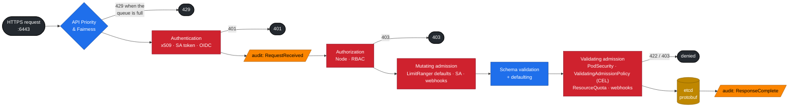

# Volume 02 — kube-apiserver Internals: AuthN, RBAC, Admission (CEL), API Priority & Fairness, Audit

> **Module 02 · Part I — Control plane** · Prev: [01 Core architecture](01-kubernetes-core-architecture.md) · Next: [03 etcd](03-etcd-database-deep-dive.md)

| | |
|---|---|
| **You will build** | Real users with client certificates, tenant RBAC, four in-process admission policies written in CEL, a fair-queuing lane for tenant traffic, and an audit log you can query |
| **Hardware** | spark-01 (k3s). Everything except the audit-log step also works on the fake-GPU kind cluster (`lab/tests/fake-gpu-node.sh`) |
| **Time** | 90 min |
| **Risk** | Low. `install-addons.sh k3s-config` restarts k3s (about 1 min API outage) |
| **Lab files** | [`k3s/20-k8s-lab.yaml`](lab/k3s/20-k8s-lab.yaml), [`k3s/audit-policy.yaml`](lab/k3s/audit-policy.yaml), [`manifests/10-tenancy/rbac.yaml`](lab/manifests/10-tenancy/rbac.yaml), [`manifests/15-admission/policies.yaml`](lab/manifests/15-admission/policies.yaml), [`manifests/16-apf/apf.yaml`](lab/manifests/16-apf/apf.yaml), [`scripts/make-user.sh`](lab/scripts/make-user.sh), [`tests/policy/`](lab/tests/policy/) |

---

## 1. Why this matters on a Spark

A single Spark shared by two teams is a multi-tenant cluster. Every guardrail that keeps team alpha from starving, reading or breaking team beta is enforced **inside one request pipeline** in the API server. If you understand that pipeline, you can predict the exact error message a misbehaving request gets, and which log records it.

---

## 2. Architecture — the request pipeline (HLD)



| Stage | Question it answers | Typical failure text |
|---|---|---|
| APF | "Is there capacity for *this kind* of caller right now?" | `429 Too Many Requests`, header `X-Kubernetes-PF-FlowSchema-UID` |
| AuthN | "Who are you?" (user + groups) | `401 Unauthorized` / `You must be logged in` |
| AuthZ | "May *who* do *verb* on *resource* in *namespace*?" | `forbidden: User "alice" cannot create resource "pods"… in the namespace "tenant-beta"` |
| Mutating admission | "Fill in or rewrite fields" | usually silent (LimitRanger adds defaults) |
| Validating admission | "Is the final object acceptable?" | `ValidatingAdmissionPolicy 'x' … denied request: …`, `violates PodSecurity "restricted:latest"`, `exceeded quota` |

---

## 3. LLD

### 3.1 Identities in the lab

| Identity | How it authenticates | Groups | Can do |
|---|---|---|---|
| `system:admin` (01 Ansible kubeconfig) | client cert from k3s CA | `system:masters` | everything. Keep it off laptops you share |
| `alice` | client cert via CSR API ([`make-user.sh`](lab/scripts/make-user.sh)) | `team-alpha` (cert `O=`) | `spark-tenant-developer` in `tenant-alpha`, read nodes |
| `bob` | client cert | `team-beta` | same in `tenant-beta` |
| `llm-serving/ci-deployer` | ServiceAccount token | `system:serviceaccounts:llm-serving` | `edit` in `llm-serving` only |

### 3.2 RBAC design

| ClusterRole | Verbs highlight | Bound where |
|---|---|---|
| `spark-tenant-developer` | full on pods/deployments/jobs/PVCs. Secrets **without `watch`**. **read-only** quota/limitrange. Read Kueue workloads | RoleBinding per tenant namespace |
| `spark-gpu-viewer` | get/list nodes, metrics | ClusterRoleBinding to both teams, so they can see GPU capacity |
| `edit` (built-in) | namespace-scoped write | `ci-deployer` in `llm-serving` |

### 3.3 Admission policies (CEL, no webhook server)

| Policy | Binds to | Rule | Why on a Spark |
|---|---|---|---|
| `spark-no-latest-tag` | tenants, llm-serving, batch | image must have a tag or digest, and not `:latest` | reproducible rollbacks. Also avoids re-pulling a 10 GB NGC image |
| `spark-gpu-slice-limits` | `spark.lab/tenant=true` | `nvidia.com/gpu` ≤ 1 per container | 4 slices total. One tenant must not take all of them |
| `spark-no-nvidia-env-bypass` | tenants | no `NVIDIA_VISIBLE_DEVICES`, `NVIDIA_DRIVER_CAPABILITIES` or `CUDA_VISIBLE_DEVICES` in env | with `default-runtime: nvidia`, that env would grant GPU access without a quota-counted request |
| `spark-serving-needs-readiness` | `spark.lab/tier=serving` | Deployments/StatefulSets must have a `readinessProbe` | a vLLM pod takes minutes to load weights, and must not get traffic while it does |

Plus built-ins: **PodSecurity** `restricted` on tenant namespaces (`baseline` on serving, since NGC images run as root), **LimitRanger**, **ResourceQuota**.

### 3.4 API Priority & Fairness

| Object | Setting | Effect |
|---|---|---|
| PriorityLevel `spark-tenants` | `nominalConcurrencyShares: 10`, 16 queues, hand size 4 | Tenants share a small slice of the API server's concurrency |
| FlowSchema `spark-tenants` | matches groups `team-alpha`, `team-beta`. `distinguisherMethod: ByUser` | Fairness is **per user**. Alice's watch loop can't starve Bob |
| precedence 900 | evaluated before `global-default` (9900) | tenants never land in the default lane |

### 3.5 Audit

`audit-policy.yaml` logs **Metadata** for secrets and configmaps (never payloads), drops noisy reads by nodes and system SAs, and logs **RequestResponse** for every mutation in tenant, serving and GPU-operator namespaces. The file is `/var/log/k3s/audit.log`, rotated at 100 MB × 5.

---

## 4. Integrations

| With | How |
|---|---|
| 01 Ansible Vault (Vol 19) | Store the tenant kubeconfigs `make-user.sh` produces in Vault KV `secret/spark/k8s/<user>`. For long-lived automation, prefer Vault's Kubernetes secrets engine, which mints short-lived SA tokens |
| Loki / Alloy (01 Ansible Vol 23) | Ship `/var/log/k3s/audit.log` with a `loki.source.file` block. Query `{job="k8s-audit"} \| json \| verb="delete"` |
| Kueue (Vol 05) | Tenants get read-only access to `workloads`, so they can see *why* their job is queued |
| CI (GitHub Actions) | `ci-deployer` token → `kubectl apply` into `llm-serving` only |

---

## 5. Lab

### Step 1 · Turn on audit logging and secrets encryption (on the Spark)

```bash
cd "02 Kubernetes/lab"
scripts/install-addons.sh k3s-config     # installs the drop-in + audit policy, restarts k3s
sudo k3s secrets-encrypt status
```

Expected: `Encryption Status: Enabled`, `Current Rotation Stage: start`, `Server Encryption Hashes: All hashes match`.

Secrets created **before** the switch are still stored in plaintext until they're written again. Rewrite them once:

```bash
kubectl get secrets -A -o json | kubectl replace -f - >/dev/null && echo re-encrypted
```

> The same restart also migrates the datastore to embedded etcd. That's [Volume 03](03-etcd-database-deep-dive.md)'s topic, and you'll see its logs now.

### Step 2 · Apply tenancy, admission and APF

```bash
kubectl apply -k manifests/00-platform
kubectl apply -k manifests/10-tenancy
kubectl apply -k manifests/15-admission
kubectl apply -k manifests/16-apf
kubectl get validatingadmissionpolicies
```

### Step 3 · Create real users

```bash
scripts/make-user.sh alice team-alpha
scripts/make-user.sh bob   team-beta
export ALICE=$PWD/.cache/alice.kubeconfig
KUBECONFIG=$ALICE kubectl auth whoami
```

```text
ATTRIBUTE   VALUE
Username    alice
Groups      [team-alpha system:authenticated]
```

### Step 4 · Probe RBAC before users hit it

```bash
kubectl auth can-i --list -n tenant-alpha --as=alice --as-group=team-alpha | head -20
for v in "create pods -n tenant-alpha" "create pods -n tenant-beta" "update resourcequota -n tenant-alpha" \
         "watch secrets -n tenant-alpha" "list nodes"; do
  printf '%-40s %s\n' "$v" "$(kubectl auth can-i $v --as=alice --as-group=team-alpha)"
done
```

Expected:

```text
create pods -n tenant-alpha              yes
create pods -n tenant-beta               no
update resourcequota -n tenant-alpha     no
watch secrets -n tenant-alpha            no
list nodes                               yes
```

Now as Alice for real:

```bash
KUBECONFIG=$ALICE kubectl -n tenant-beta get pods
# Error from server (Forbidden): pods is forbidden: User "alice" cannot list resource "pods" in API group "" in the namespace "tenant-beta"
```

### Step 5 · Exercise the admission policies (server-side dry run)

```bash
scripts/verify.sh admission
```

```text
── admission (server-side dry-run, nothing is created)
[PASS] allowed allow-digest-image
[PASS] allowed allow-gpu-one-slice
[PASS] allowed allow-serving-with-readiness
[PASS] denied  deny-gpu-two-slices
[PASS] denied  deny-latest-tag
[PASS] denied  deny-nvidia-env-bypass
[PASS] denied  deny-over-limitrange
[PASS] denied  deny-over-quota-memory
[PASS] denied  deny-privileged-in-tenant
[PASS] denied  deny-serving-without-readiness
[PASS] denied  deny-untagged-image
```

Read one denial in full, so you can recognize it in a pipeline log:

```bash
kubectl create --dry-run=server -f tests/policy/deny-gpu-two-slices.yaml
```

```text
The pods "pt-deny-gpu-two-slices" is invalid: : ValidatingAdmissionPolicy 'spark-gpu-slice-limits'
with binding 'spark-gpu-slice-limits' denied request: tenant containers may request at most 1 nvidia.com/gpu time-slice
```

The CEL behind it uses optional-field access, so pods without `resources` don't trip an error:

```yaml
- expression: >-
    object.spec.containers.all(c,
      quantity(c.?resources.?limits[?'nvidia.com/gpu'].orValue('0')).compareTo(quantity('1')) <= 0)
```

> **Seen `status.typeChecking.expressionWarnings: undefined field 'limits'`?** The type checker can't resolve `ResourceRequirements` maps on some versions (seen on k3s v1.32). It's a warning, and the runtime result is correct. The dry-run tests above prove it. Keep a test fixture for every policy for exactly this reason.

### Step 6 · API Priority & Fairness under load

Generate tenant load as Alice (32 parallel LIST loops), and watch as admin:

```bash
# terminal A — Alice misbehaves
for i in $(seq 32); do (while true; do KUBECONFIG=$ALICE kubectl -n tenant-alpha get pods -o name >/dev/null 2>&1; done &) ; done

# terminal B — admin view
watch -n2 "kubectl get --raw /metrics | grep -E 'apiserver_flowcontrol_(current_inqueue_requests|rejected_requests_total|current_executing_requests)\{.*spark-tenants' "
kubectl get --raw /debug/api_priority_and_fairness/dump_priority_levels | column -t -s, | grep -E 'PriorityLevelName|spark-tenants|global-default'

# terminal C — Bob and the system are unaffected
time KUBECONFIG=.cache/bob.kubeconfig kubectl -n tenant-beta get pods
time kubectl get nodes

# stop the flood
pkill -f "kubectl -n tenant-alpha get pods"
```

Expected: `current_inqueue_requests{priority_level="spark-tenants"}` climbs. Some of Alice's calls may get `429`. Bob's call and `kubectl get nodes` stay under ~100 ms, because the queues are shuffle-sharded per user.

### Step 7 · Query the audit log

```bash
KUBECONFIG=$ALICE kubectl -n tenant-alpha run audit-demo --image=registry.k8s.io/pause:3.10 \
  --overrides='{"spec":{"securityContext":{"runAsNonRoot":true,"runAsUser":65532,"seccompProfile":{"type":"RuntimeDefault"}},"containers":[{"name":"audit-demo","image":"registry.k8s.io/pause:3.10","securityContext":{"allowPrivilegeEscalation":false,"capabilities":{"drop":["ALL"]}}}]}}'
sudo jq -c 'select(.objectRef.namespace=="tenant-alpha" and .verb=="create")
  | {t:.requestReceivedTimestamp, user:.user.username, groups:.user.groups, res:.objectRef.resource, name:.objectRef.name, code:.responseStatus.code}' \
  /var/log/k3s/audit.log | tail -3
```

```json
{"t":"2026-…","user":"alice","groups":["team-alpha","system:authenticated"],"res":"pods","name":"audit-demo","code":201}
```

Denied requests are logged too: `code: 403` for RBAC, and `code: 422` or `403` for admission. This is how you answer "who tried to take two GPU slices?".

---

## 6. Verify

```bash
scripts/verify.sh tenancy admission
```

Expected: `20 passed, 0 warnings, 0 failed`.

---

## 7. Troubleshooting

| Symptom | Stage | Diagnose | Fix |
|---|---|---|---|
| `401 Unauthorized` | AuthN | `kubectl auth whoami` fails. `openssl x509 -in .cache/alice.crt -noout -enddate` | Cert expired (7 days here). Re-run `make-user.sh` |
| `403 … cannot list resource` | RBAC | `kubectl auth can-i list pods -n X --as=alice --as-group=team-alpha` · `kubectl get rolebinding -n X -o wide` | Bind the ClusterRole in the right namespace. Check the **group** in the cert (`openssl x509 -noout -subject`) |
| Deployment created but 0 pods | Validating admission on the **pod** | `kubectl describe rs -l app=…` → `FailedCreate` | Fix the pod template (drill: `scripts/breakfix.sh inject 14`) |
| `violates PodSecurity "restricted:latest"` | PSA | message lists the missing fields | add `runAsNonRoot`, `seccompProfile`, `capabilities.drop: [ALL]`, `allowPrivilegeEscalation: false` |
| `failed calling webhook … context deadline exceeded` | Webhook admission | `kubectl get validatingwebhookconfigurations,mutatingwebhookconfigurations`. Is the webhook's pod running? | Restore the webhook's backend (cert-manager, KServe, Kueue). For lab-only emergencies, set `failurePolicy: Ignore`. This is why the lab prefers CEL policies |
| `429 Too Many Requests` | APF | `apiserver_flowcontrol_rejected_requests_total` by `priority_level` | Fix the client (watch instead of poll, add backoff) or raise shares |
| Secrets readable in etcd | Encryption off | `sudo k3s secrets-encrypt status` | `k3s-config` drop-in. `sudo k3s secrets-encrypt rotate-keys` |

---

## 8. Scale-out path

| Lab | Datacenter equivalent |
|---|---|
| x509 users via CSR API | OIDC (Keycloak, Entra ID, Okta): `kube-apiserver-arg: oidc-issuer-url=…`, groups from IdP claims, no long-lived certs |
| 4 CEL policies | A policy library (Kyverno or Gatekeeper, or CEL `ValidatingAdmissionPolicy` managed in Git) with audit mode first (`validationActions: [Audit, Warn]`), then Deny |
| One APF lane for tenants | Lanes per class (CI bots, operators, humans), sized from `apiserver_flowcontrol_*` history |
| Audit file on the node | Audit webhook backend → SIEM, retention per compliance policy |

---

## 9. Checklist

- [ ] I can predict which stage rejects a request from its error message.
- [ ] I created a user whose group comes from the certificate and bound it with RBAC.
- [ ] I can write a CEL policy that handles optional fields, and prove it with a dry-run fixture.
- [ ] I watched APF protect one user from another.
- [ ] I found who created a pod in the audit log.
