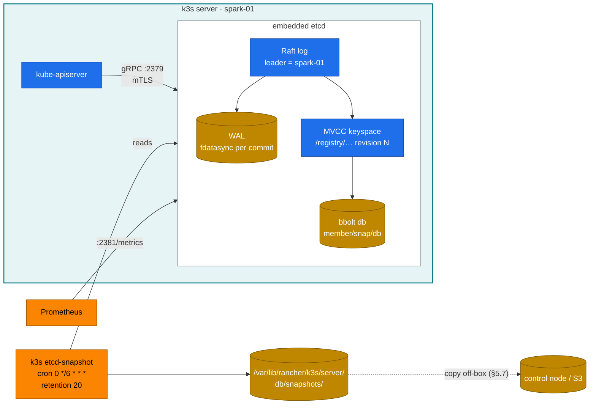
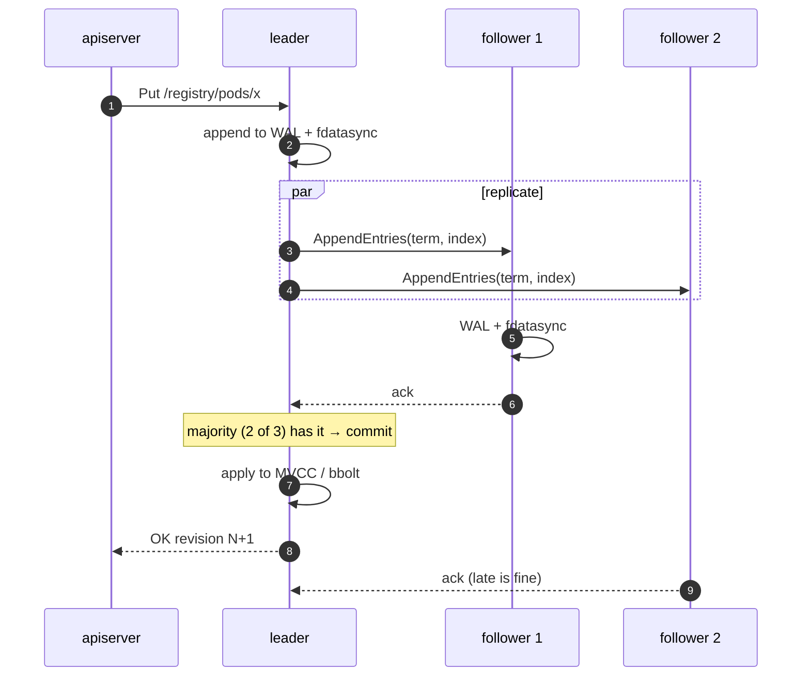
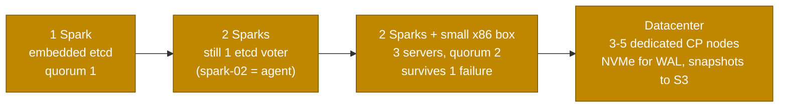

# Volume 03 — etcd Deep Dive: Raft, MVCC, Quotas, Backups & Disaster Recovery

> **Module 02 · Part I — Control plane** · Prev: [02 API server](02-kube-apiserver-internals.md) · Next: [04 Controllers](04-kube-controller-manager-and-controllers.md)

| | |
|---|---|
| **You will build** | k3s migrated from SQLite to embedded etcd with scheduled snapshots. A throw-away 3-member etcd where you break Raft on purpose: kill the leader, lose quorum, hit NOSPACE. And a tested restore of the real cluster |
| **Hardware** | spark-01 (Docker is already installed by 01 Ansible `container_runtime`) |
| **Time** | 2 h |
| **Risk** | **Medium.** The restore step rolls cluster state back. Snapshot first, and do it when nothing important is running |
| **Lab files** | [`k3s/20-k8s-lab.yaml`](lab/k3s/20-k8s-lab.yaml), [`etcd-sandbox/compose.yaml`](lab/etcd-sandbox/compose.yaml), [`scripts/etcd-sandbox.sh`](lab/scripts/etcd-sandbox.sh), [`scripts/etcd-drill.sh`](lab/scripts/etcd-drill.sh), [`manifests/95-observability/rules.yaml`](lab/manifests/95-observability/rules.yaml) |

---

## 1. Why this matters on a Spark

etcd is the cluster's only source of truth. If it's lost, every Deployment, Secret, quota and Kueue queue is gone. If it's slow, the API server is slow, leases expire, and controllers thrash. On a Spark it shares **one NVMe** with 60 GB model downloads, checkpoint writes and `fio`. That makes fsync latency, not capacity, the thing to watch.

| Datastore choice | When | This lab |
|---|---|---|
| SQLite via kine (k3s default) | single server, no HA ever | what 01 Ansible installs |
| **Embedded etcd** (`cluster-init: true`) | single server now, HA later. Snapshots and `etcdctl` tooling | **what we switch to** |
| External etcd / managed | large clusters, strict separation | datacenter (§8) |

---

## 2. Architecture — HLD



### 2.1 Raft in one picture



Quorum is ⌊n/2⌋+1. **1 member tolerates 0 failures, 2 members tolerate 0, and 3 tolerate 1.** Two Sparks don't give you HA etcd; you need a third voter (§8).

---

## 3. LLD

### 3.1 Paths, ports, flags (k3s)

| Item | Value |
|---|---|
| Data dir | `/var/lib/rancher/k3s/server/db/etcd/` (`member/wal`, `member/snap/db`) |
| Client / peer / metrics | `127.0.0.1:2379` · `:2380` · `:2381` (`etcd-expose-metrics: true`) |
| TLS for etcdctl | `/var/lib/rancher/k3s/server/tls/etcd/{server-ca.crt,client.crt,client.key}` |
| Snapshots | `/var/lib/rancher/k3s/server/db/snapshots/`, every 6 h, keep 20 |
| Backend quota | 2 GiB default. Raise with `etcd-arg: ["quota-backend-bytes=8589934592"]` if needed |
| Compaction | the API server compacts every 5 min (`--etcd-compaction-interval`). **Defrag is manual** |

### 3.2 Keyspace

| Prefix | Holds |
|---|---|
| `/registry/pods/<ns>/<name>` | Pods (protobuf, prefix `k8s\x00`) |
| `/registry/secrets/<ns>/<name>` | Secrets, encrypted: value starts `k8s:enc:aescbc:v1:` |
| `/registry/leases/kube-system/*` | leader election leases (written every ~2 s) |
| `/registry/events/…` | Events, with a 1 h TTL. Often the biggest churn |
| `/registry/apiextensions.k8s.io/customresourcedefinitions/…` | CRDs (Kueue, KEDA, Traefik, Prometheus…) |

### 3.3 Health targets on NVMe

| Metric | Healthy | Alarm (lab rule) |
|---|---|---|
| `etcd_disk_wal_fsync_duration_seconds` p99 | < 10 ms | > 50 ms for 10 min (`EtcdSlowFsync`) |
| `etcd_disk_backend_commit_duration_seconds` p99 | < 25 ms | > 100 ms |
| `etcd_mvcc_db_total_size_in_bytes / etcd_server_quota_backend_bytes` | < 50 % | > 80 % (`EtcdDbNearQuota`) |
| `etcd_server_leader_changes_seen_total` rate | 0 on a single member | any increase |

---

## 4. Integrations

| With | How |
|---|---|
| Vol 02 secrets encryption | Proven in §5.3 by reading the raw key |
| Prometheus (Vol 16) | `kubeEtcd.endpoints: [192.168.0.100]` port 2381 in [`addons/kube-prometheus-stack.yaml`](lab/addons/kube-prometheus-stack.yaml). Two alert rules in [`rules.yaml`](lab/manifests/95-observability/rules.yaml) |
| Off-box backup | §5.7 pulls snapshots + token + encryption config to the control node. In production use k3s's `etcd-s3-*` options (MinIO from module 08 works) |
| Storage module (08) | fsync latency is a storage QoS problem. The checkpoint-write patterns in 08 are what hurt etcd |

---

## 5. Lab

### 5.1 Migrate k3s to embedded etcd

If you ran Volume 02 step 1, this is done. Otherwise:

```bash
cd "02 Kubernetes/lab"
scripts/install-addons.sh k3s-config
sudo journalctl -u k3s --since -3m | grep -iE 'migrat|etcd' | head
sudo apt-get install -y etcd-client            # etcdctl (v3 API)
scripts/etcd-drill.sh status
```

Expected (abridged):

```text
+------------------+---------+----------+---------------------------+
|        ID        | STATUS  |   NAME   |        PEER ADDRS         |
| 3a1f…            | started | spark-01-… | https://192.168.0.100:2380 |
+----------------------------+---------+--------+---------+-----------+-----------+
|          ENDPOINT          | DB SIZE | IS LEADER | RAFT TERM | RAFT INDEX |
| https://127.0.0.1:2379     |  12 MB  |   true    |     2     |   48211    |
```

### 5.2 Measure the disk the way etcd uses it

etcd writes small records and fdatasyncs each one. Test exactly that on the filesystem that holds the WAL:

```bash
sudo mkdir -p /var/lib/rancher/k3s/fio-etcd && cd /var/lib/rancher/k3s/fio-etcd
sudo fio --name=etcd-wal --rw=write --ioengine=sync --fdatasync=1 --bs=2300 --size=22m --directory=.
cd - && sudo rm -rf /var/lib/rancher/k3s/fio-etcd
```

Read the `fsync/fdatasync/sync_file_range` section: **99.00th percentile should be well under 10 ms** (a healthy Gen4/Gen5 NVMe gives tens to hundreds of µs). Now run it again while `kubectl apply -f manifests/60-storage/fio-job.yaml` runs its sequential writes (Vol 11). The tail latency jumps. That's what happens to your API server during a checkpoint write.

### 5.3 Look inside the keyspace

```bash
E="sudo ETCDCTL_API=3 etcdctl --cacert=/var/lib/rancher/k3s/server/tls/etcd/server-ca.crt \
   --cert=/var/lib/rancher/k3s/server/tls/etcd/client.crt --key=/var/lib/rancher/k3s/server/tls/etcd/client.key"
$E get /registry --prefix --keys-only | awk -F/ 'NF>2 {print $3}' | sort | uniq -c | sort -rn | head -12

kubectl -n tenant-alpha create secret generic demo --from-literal=password=hunter2
$E get /registry/secrets/tenant-alpha/demo --print-value-only | head -c 64 | xxd | head -3
```

Expected: the value starts with `k8s:enc:aescbc:v1:aescbckey` and `hunter2` is nowhere in it. If you see the plaintext password, secrets encryption is off (Vol 02).

MVCC in action. Every write gets a new revision, and old revisions stay until compaction:

```bash
for i in 1 2 3; do kubectl -n tenant-alpha annotate secret demo rev=$i --overwrite >/dev/null; done
$E get /registry/secrets/tenant-alpha/demo -w json | jq '.kvs[0] | {create_revision, mod_revision, version}'
```

### 5.4 Break Raft on purpose (sandbox, not your cluster)

```bash
cd lab/etcd-sandbox && docker compose up -d && cd ..
scripts/etcd-sandbox.sh status
scripts/etcd-sandbox.sh kill-leader
scripts/etcd-sandbox.sh kill-two
```

Expected:

```text
[....] stopping leader e2
[PASS] new leader e1 after 1180 ms (election timeout 1000 ms)
OK
[PASS] writes still work with 2/3 members
Error: context deadline exceeded
[PASS] write failed: no quorum (expected)
[PASS] serializable (possibly stale) read still served locally
```

This is why a Kubernetes control plane with 1 of 3 etcd members left serves `kubectl get` from caches but can't create anything.

### 5.5 Hit the space quota and recover

```bash
scripts/etcd-sandbox.sh fill          # 32 MiB quota → NOSPACE
scripts/etcd-sandbox.sh recover-space # compact → defrag --cluster → alarm disarm
```

Expected at the end of `fill`: `memberID:… alarm:NOSPACE`, with writes failing with `etcdserver: mvcc: database space exceeded`. After recovery, `DB SIZE` drops and the alarm list is empty.

The same sequence on the real cluster, if `EtcdDbNearQuota` ever fires:

```bash
rev=$($E endpoint status -w json | jq '.[0].Status.header.revision')
$E compact "$rev" && $E defrag && $E alarm disarm
```

### 5.6 Snapshot and restore the real cluster

```bash
scripts/etcd-drill.sh snapshot
kubectl create namespace doomed-by-restore
scripts/etcd-drill.sh status | tail -3          # note the snapshot name
scripts/etcd-drill.sh restore drill-20260930-120000
kubectl get ns doomed-by-restore                 # NotFound: created after the snapshot
```

What `restore` does: stop k3s → `k3s server --cluster-reset --cluster-reset-restore-path=<file>` → start k3s. Running pods whose objects no longer exist are cleaned up by the kubelet within a minute.

> **Encrypted secrets:** the snapshot holds ciphertext. Restoring on a *new* machine also needs the encryption config (`/var/lib/rancher/k3s/server/cred/encryption-config.json`) and the server token (`/var/lib/rancher/k3s/server/token`). Back those up with the snapshot, into Vault (01 Ansible Vol 19).

### 5.7 Copy snapshots off the box

From the control node, pull everything a restore on *new* hardware needs (snapshots + server token + encryption config) in one tarball:

```bash
mkdir -p ~/spark-backups
ssh nvidia@192.168.0.100 'sudo tar czf - -C /var/lib/rancher/k3s/server db/snapshots token cred/encryption-config.json' \
  > ~/spark-backups/k3s-$(date +%F).tgz
tar tzf ~/spark-backups/k3s-$(date +%F).tgz | head
```

Treat that tarball like a password: it holds the key that decrypts every Secret. Encrypt it at rest, or store it in Vault.

---

## 6. Verify

| Check | Expected |
|---|---|
| `scripts/etcd-drill.sh status` | 1 member, `IS LEADER true`, empty alarm list, ≥ 1 snapshot |
| raw secret starts with `k8s:enc:` | yes |
| Prometheus `histogram_quantile(0.99, rate(etcd_disk_wal_fsync_duration_seconds_bucket[5m]))` | < 0.01 when idle |
| Restore drill | namespace created after the snapshot is gone |

---

## 7. Troubleshooting

| Symptom | Cause | Diagnose | Fix |
|---|---|---|---|
| All writes fail: `mvcc: database space exceeded` | Quota hit, NOSPACE alarm | `etcdctl alarm list`, `endpoint status` DB size | compact → defrag → `alarm disarm`. Find the churn (`--keys-only` counts). Often Events or a CRD in a hot loop (Vol 04) |
| API latency spikes, `apply request took too long` in k3s log | fsync slow | `EtcdSlowFsync`, §5.2 fio, `iostat -x 1` | Move bulk writers (checkpoints, fio, image pulls) off peak. `ionice -c3` on batch jobs |
| Leader changes on a single member | not normally possible. Clock jumps or process stalls | `journalctl -u k3s \| grep -i 'leader\|elect'` | check chrony (01 Ansible baseline), CPU starvation (system-reserved) |
| k3s won't start after restore: `bootstrap data already found and encrypted with different token` | token mismatch | compare `/var/lib/rancher/k3s/server/token` | restore the original token file |
| `etcdctl: context deadline exceeded` | wrong endpoint/certs | run with `--debug` | use the TLS paths from §3.1 |
| DB grows while object count doesn't | no defrag after compaction | `DB SIZE` vs `DB SIZE IN USE` (etcd ≥3.4 shows both in JSON) | `defrag` (it blocks the member briefly, so do it off-peak) |

---

## 8. Scale-out path



- **Don't make spark-02 a second server** with only two machines. A 2-member etcd *halves* your availability, because either member failing loses quorum.
- For real HA, the third voter can be any small Linux box (a NUC, or a VM on the control node) running `k3s server --server https://192.168.0.100:6443`, tainted `node-role.kubernetes.io/control-plane:NoSchedule`.
- Production: snapshots every hour to object storage (`etcd-s3: true`, `etcd-s3-bucket`), a quarterly restore rehearsal on a scratch cluster, and a 99th-percentile fsync SLO under 10 ms on dedicated disks.

---

## 9. Checklist

- [ ] I migrated k3s to etcd and have at least one off-box snapshot plus the token and encryption config.
- [ ] I measured fdatasync latency and saw it degrade under competing I/O.
- [ ] I saw an election, a quorum loss and a NOSPACE alarm in the sandbox, and recovered each.
- [ ] I restored the real cluster from a snapshot and know which files make that possible on a new machine.
