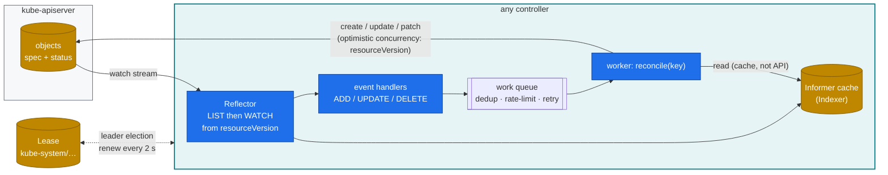

# Volume 04 — Controllers: Reconciliation Loops, Informers, Leader Election & Writing Your Own

> **Module 02 · Part I — Control plane** · Prev: [03 etcd](03-etcd-database-deep-dive.md) · Next: [05 Scheduler & batch](05-kube-scheduler-and-ai-batch-scheduling.md)

| | |
|---|---|
| **You will build** | Observed reconciliation (Deployment → ReplicaSet → Pod, quota status, garbage collection), plus a working controller in ~150 lines of dependency-free Python. It watches every GPU pod in the cluster and keeps a live "who holds which GB10 slice" ledger |
| **Hardware** | spark-01. The controller also runs on the fake-GPU kind cluster |
| **Time** | 90 min |
| **Risk** | None |
| **Lab files** | [`manifests/45-controller/slice_ledger.py`](lab/manifests/45-controller/slice_ledger.py), [`slice-ledger.yaml`](lab/manifests/45-controller/slice-ledger.yaml), [`manifests/50-workloads/tokenizer-indexed-job.yaml`](lab/manifests/50-workloads/tokenizer-indexed-job.yaml) |

---

## 1. Why this matters on a Spark

Everything "automatic" in Kubernetes is a controller. Replacing a crashed vLLM pod, holding a tenant to its 5 % budget, cleaning up a finished tokenizer Job, and admitting a gang of training pods (Kueue) all work this way. So does the GPU Operator itself: it's just a controller that happens to install drivers and device plugins. When one of them misbehaves, you debug it the same way every time. Ask: what does it watch, what does it compare, what does it write, and is it the leader?

---

## 2. Architecture — the reconcile pattern (HLD)



Three properties make this robust, and each one is a debugging clue:

1. **Level-triggered, not edge-triggered.** `reconcile(key)` looks at the *current* state and makes it right, whatever event arrived. Missing an event is harmless. The next resync fixes it.
2. **Idempotent writes.** Writing the same desired state twice changes nothing. A controller that writes on every loop is a *hot loop*, and it shows up as etcd churn (Vol 03) and API load (Vol 02 APF).
3. **One active leader.** Two copies of the same controller fighting over an object is the classic "flapping" bug. Leases prevent it.

---

## 3. LLD

### 3.1 Controllers you'll meet in this lab

| Controller | Runs in | Watches | Writes | Lab evidence |
|---|---|---|---|---|
| Deployment | kube-controller-manager | Deployments, ReplicaSets | ReplicaSets | `kubectl rollout history` |
| ReplicaSet | kube-controller-manager | ReplicaSets, Pods | Pods | `FailedCreate` events (quota, admission) |
| Job (+ Indexed) | kube-controller-manager | Jobs, Pods | Pods, Job status | `JOB_COMPLETION_INDEX`, `backoffLimitPerIndex` |
| ResourceQuota | kube-controller-manager | quota'd objects | `status.used` | `kubectl describe quota` |
| Garbage collector | kube-controller-manager | everything with `ownerReferences` | deletes | cascade vs orphan (§5.4) |
| Node lifecycle | kube-controller-manager | Nodes, Leases in `kube-node-lease` | taints `not-ready`/`unreachable` | Vol 19 |
| NVIDIA GPU Operator | `gpu-operator` ns | ClusterPolicy, Nodes | DaemonSets, labels | Vol 16 |
| Kueue | `kueue-system` ns | Jobs, Workloads, ClusterQueues | `suspend`, admission | Vol 05 |
| **slice-ledger** (ours) | `lab-tools` ns | Pods (all namespaces) | one ConfigMap | §5.5 |

### 3.2 Leases

| Lease | Namespace | Holder format | Renew / lease duration |
|---|---|---|---|
| `kube-controller-manager` | kube-system | `spark-01_<uuid>` | 2 s / 15 s |
| `kube-scheduler` | kube-system | `spark-01_<uuid>` | 2 s / 15 s |
| `spark-01` (node heartbeat) | kube-node-lease | `spark-01` | 10 s / 40 s |

### 3.3 slice-ledger design

| Concern | Choice |
|---|---|
| Informer | raw `LIST /api/v1/pods` + `WATCH ?resourceVersion=…&allowWatchBookmarks=true` |
| 410 Gone | re-LIST (the resourceVersion was compacted, Vol 03) |
| Desired state | ConfigMap `lab-tools/gpu-slice-ledger`, one key per node: `used/capacity` + holders |
| Idempotency | compares with last write, so there's no write when nothing changed |
| Resync | every 60 s, even with no events |
| RBAC | ClusterRole read pods. Role: create CMs + get/update **only** `gpu-slice-ledger` (`resourceNames`) |

---

## 4. Integrations

- **Kueue (Vol 05)** is the same pattern at production quality. It watches Jobs, keeps its own cache of quota usage, and flips `spec.suspend`.
- **The GPU Operator (Vol 16)** reconciles a single `ClusterPolicy` into about ten DaemonSets. When a DaemonSet is deleted by hand, it comes back. That's the controller doing its job.
- **Grafana (Vol 16)** can read the ledger ConfigMap indirectly: kube-state-metrics' `kube_pod_container_resource_requests{resource="nvidia_com_gpu"}` gives the same numbers. The ledger exists to *teach* the pattern.

---

## 5. Lab

### 5.1 Who is leader, and is it renewing?

```bash
kubectl -n kube-system get lease kube-controller-manager kube-scheduler \
  -o custom-columns=NAME:.metadata.name,HOLDER:.spec.holderIdentity,RENEWED:.spec.renewTime,DURATION:.spec.leaseDurationSeconds
watch -n1 "kubectl -n kube-system get lease kube-controller-manager -o jsonpath='{.spec.renewTime}'"
```

Expected: `renewTime` advances every ~2 s. If it stops for > 15 s, nothing that controller owns will reconcile.

### 5.2 Watch the Deployment → ReplicaSet → Pod chain react

```bash
kubectl apply -k manifests/30-networking          # echo Deployment (3 replicas) in lab-tools
kubectl -n lab-tools get deploy,rs,pod -l app=echo -o wide
kubectl -n lab-tools get events -w &              # leave running
POD=$(kubectl -n lab-tools get pod -l app=echo -o name | head -1)
kubectl -n lab-tools delete "$POD" --wait=false  # the ReplicaSet controller notices 2/3 and creates one
kubectl -n lab-tools set image deploy/echo echo=registry.k8s.io/e2e-test-images/agnhost:2.52
kubectl -n lab-tools rollout status deploy/echo
kubectl -n lab-tools get rs -l app=echo           # old RS scaled to 0, kept for rollback
kubectl -n lab-tools rollout undo deploy/echo
kill %1
```

Expected events: `SuccessfulCreate` from `replicaset-controller` within ~1 s of the delete, then `ScalingReplicaSet` pairs from `deployment-controller` during the rollout.

### 5.3 Quota controller: `status.used` is written by a controller, not admission

```bash
kubectl -n tenant-alpha describe resourcequota budget-5pct
kubectl apply -f manifests/50-workloads/tokenizer-indexed-job.yaml
kubectl -n tenant-alpha get pods -l job-name=tokenize-shards -w   # 2 at a time (parallelism)
kubectl -n tenant-alpha describe resourcequota budget-5pct | grep -E 'cpu|pods'
```

Expected while the job runs: `limits.cpu 800m/1`, `pods 2/10`. The **admission** plugin blocks a pod that *would* exceed `hard`. The **controller** recalculates `used` in the background. Kill the controller (it's in the k3s process, so you can't) and `used` goes stale, but admission still counts correctly because it charges the request inline.

Check the Indexed Job:

```bash
kubectl -n tenant-alpha logs -l job-name=tokenize-shards --prefix | sort
kubectl -n tenant-alpha get job tokenize-shards -o jsonpath='{.status.completedIndexes}{"\n"}'
```

```text
[pod/tokenize-shards-0-xxxxx/tok] shard=0 docs=20000 tokens=120000 sha=…
…
0-7
```

### 5.4 Garbage collection: cascade vs orphan

```bash
kubectl -n lab-tools get rs -l app=echo -o jsonpath='{.items[0].metadata.ownerReferences}' | jq
kubectl -n lab-tools delete deploy echo --cascade=orphan
kubectl -n lab-tools get rs,pod -l app=echo        # RS + pods still there, no owner now
kubectl apply -k manifests/30-networking           # new Deployment adopts the orphan RS by selector+hash
kubectl -n lab-tools get rs -l app=echo -o jsonpath='{.items[0].metadata.ownerReferences[0].name}{"\n"}'
```

Adoption is a controller feature, and a common surprise when two Deployments share a selector.

### 5.5 Run your own controller

```bash
kubectl apply -k manifests/45-controller
kubectl -n lab-tools logs deploy/slice-ledger -f &
kubectl apply -f manifests/70-gpu/gpu-smoke.yaml              # 1 slice in tenant-beta
kubectl apply -k manifests/70-gpu && kubectl -n lab-tools scale deploy gemm-contention --replicas=2   # NGC PyTorch ≈ 10 GB on first pull
kubectl -n lab-tools get cm gpu-slice-ledger -o jsonpath='{.data.spark-01}' | jq
```

Expected log and ledger:

```text
relist: 0 GPU pods, resourceVersion=81234
reconciled: spark-01=1/4
reconciled: spark-01=3/4
```

```json
{ "used": 3, "capacity": 4,
  "holders": ["lab-tools/gemm-contention-…-a (1, Running)", "lab-tools/gemm-contention-…-b (1, Running)",
              "tenant-beta/gpu-smoke (1, Running)"] }
```

Now test the three robustness properties:

```bash
# idempotency: no write when nothing changes → log stays quiet across resyncs
sleep 130; kubectl -n lab-tools logs deploy/slice-ledger --since=2m | grep -c reconciled   # 0

# level-triggered: edit the ConfigMap behind its back; the next event or resync repairs… only if it differs from *its* memory
kubectl -n lab-tools patch cm gpu-slice-ledger --type merge -p '{"data":{"spark-01":"tampered"}}'
kubectl -n lab-tools scale deploy gemm-contention --replicas=1   # any event → reconcile → rewrite
kubectl -n lab-tools get cm gpu-slice-ledger -o jsonpath='{.data.spark-01}' | jq .used

# least privilege: it can't touch other ConfigMaps
kubectl auth can-i update configmaps/other -n lab-tools --as=system:serviceaccount:lab-tools:slice-ledger   # no
kubectl -n lab-tools scale deploy gemm-contention --replicas=0; kill %1
```

> **Exercise:** the tamper test reveals a real bug. The controller compares against *its own last write*, not the live object, so a tamper survives until the next change. Fix it by reading the ConfigMap in `reconcile()` and comparing with that. This is exactly why client-go controllers compare against the informer cache of the object they own.

---

## 6. Verify

| Check | Expected |
|---|---|
| Lease `renewTime` age | < 5 s |
| Deleted pod replaced | new pod `Running` < 5 s later |
| Indexed Job | `completedIndexes: 0-7` |
| slice-ledger | ConfigMap `used` equals `kubectl get pods -A -o json \| jq '[.items[] \| select(.status.phase=="Running") \| .spec.containers[].resources.limits["nvidia.com/gpu"] // "0" \| tonumber] \| add'` |

---

## 7. Troubleshooting

| Symptom | Cause | Diagnose | Fix |
|---|---|---|---|
| Nothing reconciles: deleted pods not replaced, Jobs never finish | controller-manager not leader or stuck | Lease `renewTime` stale. `journalctl -u k3s \| grep -i 'leaderelection\|controller'` | restart k3s. Check CPU starvation of the k3s process |
| Object flips between two states every few seconds | two controllers own the same field (e.g. HPA **and** you both set `replicas`; KEDA **and** a GitOps tool) | `kubectl get <obj> -o yaml --show-managed-fields` shows two managers on the same field | give the field one owner (drop `replicas` from Git when an autoscaler owns it) |
| etcd churn, API latency up, events spam | hot loop: controller writes every reconcile | `apiserver_request_total{verb="PUT"}` by `resource`. Audit log grouped by `user.username` | make writes conditional (compare first), add backoff |
| Custom controller logs `410 Gone` repeatedly | watching from a compacted resourceVersion without re-listing | controller logs | re-LIST on 410 (slice_ledger does). Use bookmarks |
| `Operation cannot be fulfilled … the object has been modified` | optimistic-concurrency conflict | normal under contention | re-read and retry (client-go `RetryOnConflict`) |
| Finished Jobs pile up | no `ttlSecondsAfterFinished` | `kubectl get jobs -A` | set TTL (the tokenizer job uses 3600) |

---

## 8. Scale-out path

| Lab | At scale |
|---|---|
| 1 controller-manager inside k3s | 3 control-plane nodes, one leader, two hot standbys. Failover takes one lease duration (15 s) |
| Python stdlib controller | Go + controller-runtime (Kubebuilder) or Python kopf. Shared informers, metrics, `MaxConcurrentReconciles`, finalizers, and a CRD for its own desired state |
| ConfigMap ledger | A CRD `GpuSliceClaim` with a status subresource. Or use Kubernetes Dynamic Resource Allocation (DRA, Vol 05 §6), which makes GPU claims first-class objects |

---

## 9. Checklist

- [ ] I can find the leader of any built-in controller and tell whether it's healthy.
- [ ] I explained why deleting a Deployment with `--cascade=orphan` leaves pods running.
- [ ] My own controller survived a 410, ran idempotently, and used least-privilege RBAC.
- [ ] I fixed (or at least described) the tamper bug.
