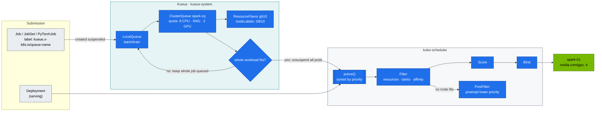
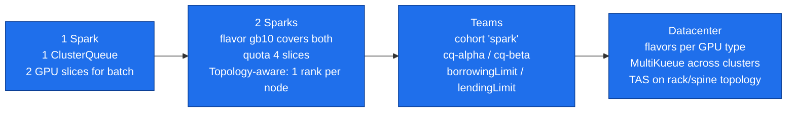

# Volume 05 — kube-scheduler & AI Batch Scheduling: Priorities, Preemption, Taints, Kueue Gangs, DRA

> **Module 02 · Part I — Control plane** · Prev: [04 Controllers](04-kube-controller-manager-and-controllers.md) · Next: [06 Networking](06-kubernetes-networking-deep-dive.md)

| | |
|---|---|
| **You will build** | A priority ladder that lets serving pods preempt experiments. A reproducible partial-gang deadlock on 4 GPU slices, the same workload fixed with Kueue all-or-nothing admission, and taint/affinity rules ready for a second Spark |
| **Hardware** | spark-01. Kueue parts also run on kind with `tests/fake-gpu-node.sh` (that's what CI does) |
| **Time** | 90 min |
| **Risk** | Low. Preemption kills *lab* pods on purpose |
| **Lab files** | [`manifests/00-platform/priorityclasses.yaml`](lab/manifests/00-platform/priorityclasses.yaml), [`manifests/20-scheduling/`](lab/manifests/20-scheduling/), [`tests/kueue-gang-test.sh`](lab/tests/kueue-gang-test.sh) |

---

## 1. Why this matters on a Spark

One GB10 split into 4 time-slices is a **tiny, contended resource**. The default scheduler places pods one at a time, first come first served. That's fine for web apps. It's wrong for:

- **Serving vs. experiments.** A notebook must not block the production endpoint → *priority + preemption*.
- **Distributed jobs.** A 2-rank job that gets only 1 slice holds it forever waiting for its peer → *gang admission (Kueue)*.
- **Shared capacity between teams.** "Team alpha may use 2 slices, more if idle" → *ClusterQueues, cohorts, borrowing*.

---

## 2. Architecture — HLD



**Division of labour:** Kueue decides *when* a workload may start (quota, fairness, gang). kube-scheduler decides *where* each pod goes (node fit, affinity). Kueue never binds pods to nodes.

---

## 3. LLD

### 3.1 Priority ladder

| PriorityClass | Value | preemptionPolicy | Used by |
|---|---|---|---|
| `spark-platform` | 100000 | PreemptLowerPriority | ingress, monitoring, node-probe |
| `spark-serving` | 50000 | PreemptLowerPriority | vLLM, Triton, SGLang |
| `spark-interactive` (**globalDefault**) | 20000 | PreemptLowerPriority | notebooks, dev pods |
| `spark-batch` | 10000 | **Never** | Kueue-admitted training |
| `spark-preemptible` | 1000 | **Never** | best-effort experiments |

`preemptionPolicy: Never` means *this pod never evicts others*. It can still **be** evicted by higher classes.

### 3.2 Kueue objects

| Object | Name | Key fields |
|---|---|---|
| ResourceFlavor | `gb10` | `nodeLabels: {nvidia.com/gpu.product: GB10}` (label from GFD) |
| ClusterQueue | `spark-cq` | `cpu 8`, `memory 64Gi`, `nvidia.com/gpu 2`, `BestEffortFIFO`, preempt `LowerPriority` within the queue |
| LocalQueue | `batch/train` | → `spark-cq` |
| WorkloadPriorityClass | `urgent` 1000, `routine` 100 | ordering *inside* Kueue, independent of pod PriorityClass |

Why only 2 GPU slices in the ClusterQueue? The other two stay free for serving (quota `llm-serving: 2`). The queue enforces the split; the scheduler alone can't.

### 3.3 Scheduler messages you must recognise

| Message | Meaning |
|---|---|
| `0/1 nodes are available: 1 Insufficient nvidia.com/gpu` | all slices allocated |
| `1 node(s) had untolerated taint {spark.lab/gpu: dedicated}` | missing toleration |
| `1 node(s) didn't match Pod's node affinity/selector` | label mismatch (GFD label missing?) |
| `preemption: 0/1 nodes are available: 1 No preemption victims found` | nothing of lower priority to evict |
| `Preempted by lab-tools/urgent on node spark-01` (event on the victim) | preemption happened |

---

## 4. Integrations

- **GPU Feature Discovery (Vol 16)** provides `nvidia.com/gpu.product=GB10`, `nvidia.com/gpu.compute.major=12`, … These are the labels ResourceFlavors and node affinity select on.
- **Distributed training (Vol 17)**: `manifests/80-distributed/base/ddp-job.yaml` carries `kueue.x-k8s.io/queue-name: train` and `suspend: true`. Kueue gangs both ranks.
- **Autoscaling (Vol 21)**: with a second Spark, Kueue's `ProvisioningRequest` or a cluster autoscaler can react to queued workloads. On bare metal, the "autoscaler" is you plugging in spark-02.

---

## 5. Lab

### 5.1 Install Kueue and the queues

```bash
cd "02 Kubernetes/lab"
scripts/install-addons.sh kueue
kubectl apply -k manifests/20-scheduling
kubectl get resourceflavors,clusterqueues
kubectl -n batch get localqueues
```

Expected: `spark-cq` with `PENDING WORKLOADS 0`, and `train` pointing at it.

### 5.2 See how the scheduler thinks

```bash
kubectl describe node spark-01 | sed -n '/Allocated resources/,/Events/p'
kubectl get pods -A -o custom-columns='NS:.metadata.namespace,POD:.metadata.name,PRIO:.spec.priorityClassName,GPU:.spec.containers[*].resources.limits.nvidia\.com/gpu' | awk '$4!="<none>"'
```

### 5.3 Priority and preemption

```bash
kubectl apply -f manifests/20-scheduling/preemption-demo.yaml
kubectl -n lab-tools get pods -l app=filler -o wide     # 4 Running, all slices used
kubectl -n lab-tools get pod urgent                      # Pending, then Running a few seconds later
kubectl -n lab-tools get events --field-selector reason=Preempted
```

Expected:

```text
Normal  Preempted  pod/filler-7c9…-k2x  Preempted by lab-tools/urgent on node spark-01
```

The filler Deployment immediately recreates its lost pod, which now sits `Pending` with `Insufficient nvidia.com/gpu`. Low priority waits, high priority runs. Clean up with `kubectl delete -f manifests/20-scheduling/preemption-demo.yaml`.

### 5.4 Reproduce the partial-gang deadlock (no Kueue)

```bash
kubectl apply -f manifests/20-scheduling/preemption-demo.yaml && kubectl -n lab-tools delete pod urgent
kubectl -n lab-tools scale deploy filler --replicas=2          # leave exactly 2 free slices
kubectl apply -f manifests/20-scheduling/no-kueue-deadlock.yaml
kubectl -n lab-tools get pods -l demo=deadlock -o wide
kubectl -n lab-tools logs -l demo=deadlock --prefix --tail=2
```

When the scheduler splits the slices 1 + 1 (repeat 2–3 times if it gives both to one job):

```text
job-x-0-…   1/1 Running   job-y-0-…   1/1 Running
job-x-1-…   0/1 Pending   job-y-1-…   0/1 Pending
[pod/job-x-0-…] rank 0 waiting for job-x-1.peers
[pod/job-y-0-…] rank 0 waiting for job-y-1.peers
```

Both jobs hold a slice and neither can progress. **This is the most expensive failure in AI clusters**: at datacenter scale, it's hundreds of GPUs idling. Clean up:

```bash
kubectl delete -f manifests/20-scheduling/no-kueue-deadlock.yaml -f manifests/20-scheduling/preemption-demo.yaml
```

### 5.5 Fix it with Kueue gang admission

```bash
kubectl apply -f manifests/20-scheduling/gang-demo-jobs.yaml
kubectl -n batch get workloads
kubectl get clusterqueue spark-cq -o jsonpath='{.status.flavorsUsage}' | jq
kubectl -n batch get jobs -o custom-columns=JOB:.metadata.name,SUSPENDED:.spec.suspend,ACTIVE:.status.active
```

Expected:

```text
NAME               QUEUE   RESERVED IN   ADMITTED   AGE
job-gang-a-8f2c1   train   spark-cq      True       6s
job-gang-b-1d9e0   train                              6s

JOB      SUSPENDED   ACTIVE
gang-a   false       2
gang-b   true        <none>
```

`gang-b` stays suspended, with **zero pods**, until `gang-a` finishes (~2 min). Then it's admitted whole. Same check, automated: `tests/kueue-gang-test.sh`.

Try priority inside the queue. While `gang-a` runs, submit a copy of `gang-b` labelled `urgent`. It jumps ahead of the queued `routine` job:

```bash
command -v yq >/dev/null || sudo sh -c 'wget -qO /usr/local/bin/yq https://github.com/mikefarah/yq/releases/download/v4.47.1/yq_linux_$(dpkg --print-architecture) && chmod +x /usr/local/bin/yq'
yq 'select(.metadata.name=="gang-b") | .metadata.name="gang-c" | .metadata.labels["kueue.x-k8s.io/priority-class"]="urgent"' \
  manifests/20-scheduling/gang-demo-jobs.yaml | kubectl apply -f -
kubectl -n batch get workloads -o custom-columns=NAME:.metadata.name,PRIORITY:.spec.priority,QUEUE:.spec.queueName
```

When `gang-a` completes, `gang-c` (priority 1000) is admitted before `gang-b` (100).

### 5.6 Taints and affinity (ready for spark-02)

```bash
kubectl taint node spark-01 spark.lab/gpu=dedicated:PreferNoSchedule
kubectl apply -f manifests/20-scheduling/taints-affinity.yaml
kubectl -n tenant-beta get pods -l app=affinity-demo -o wide
kubectl taint node spark-01 spark.lab/gpu-                # remove
```

With one node, both replicas land on spark-01 (the anti-affinity is *preferred*, not required). With spark-02 joined, they spread one per Spark. Change `preferred…` to `required…` and scale to 3 on two nodes, and the third stays Pending. That's the behaviour you want for HA serving.

---

## 6. Verify

```bash
tests/kueue-gang-test.sh
```

```text
workloads: gang-a=True gang-b=False
jobs: gang-a=false gang-b=true
PASS: one gang admitted whole, the other held whole (no partial start)
```

---

## 7. Troubleshooting

| Symptom | Cause | Diagnose | Fix |
|---|---|---|---|
| Job never starts, no pods, `suspend: true` | Kueue hasn't admitted it | `kubectl -n batch describe workload …` → `couldn't assign flavors … insufficient quota for nvidia.com/gpu in flavor gb10` | wait, lower the request, or raise `nominalQuota` |
| Workload `Inadmissible: LocalQueue train doesn't exist` | typo in `queue-name` label | `kubectl -n batch get localqueues` | fix the label |
| Job runs **without** Kueue although labelled | Kueue webhook missed it (Kueue installed after the Job, or namespace excluded by `manageJobsWithoutQueueName`) | `kubectl -n kueue-system logs deploy/kueue-controller-manager` | recreate the Job after Kueue is up |
| Pods Pending, `didn't match Pod's node affinity` | GFD labels missing (GPU Operator not healthy) | `kubectl get node spark-01 --show-labels \| tr , '\n' \| grep nvidia` | fix the GPU Operator (Vol 16) |
| Preemption doesn't happen | victim has **equal/higher** priority, or a PDB protects it (preemption respects PDBs as best effort) | `kubectl get pod -o jsonpath='{.spec.priority}'` | adjust classes. Remember `preemptionPolicy: Never` on the *preemptor* blocks it |
| Serving pod preempted by a notebook | notebook class ≥ serving class | `kubectl get pc` | serving must be the highest non-platform class |

Drill: `scripts/breakfix.sh inject 02` (GPU over-subscription) and `inject 13` (NoSchedule taint).

---

## 8. Scale-out path



- **Dynamic Resource Allocation (DRA)** is GA in Kubernetes 1.34. It replaces "count of `nvidia.com/gpu`" with `ResourceClaim`s that can express *which* GPU, sharing modes and device attributes. NVIDIA's DRA driver (`k8s-dra-driver-gpu`) is the path for it. Check its support matrix for GB10 before moving the lab off the device plugin.
- **Topology-aware scheduling (Kueue TAS)**: with 2 Sparks, label nodes `spark.lab/fabric=cx7-pair` so a 2-rank job lands on both ends of the same QSFP cable.

---

## 9. Checklist

- [ ] I watched a serving pod preempt a preemptible pod, and can explain `preemptionPolicy: Never`.
- [ ] I reproduced a partial-gang deadlock and explained why the default scheduler can't prevent it.
- [ ] Kueue held a whole job back instead of starting half of it.
- [ ] I know which labels my ResourceFlavor and affinities depend on, and who writes them.
