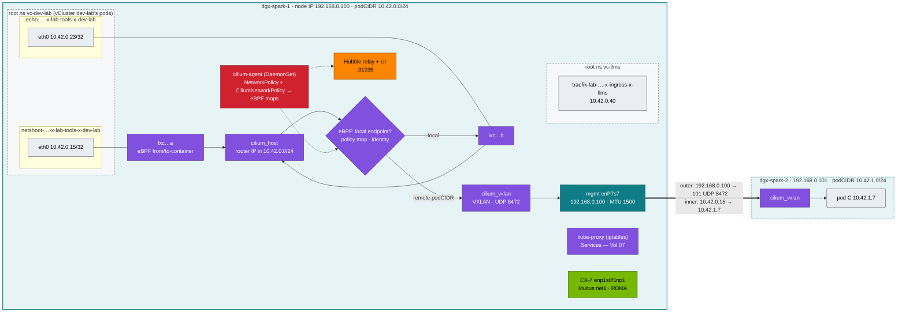

# Volume 06 — Kubernetes Networking Deep Dive: CNI, Cilium VXLAN & eBPF, NetworkPolicy & Secondary RDMA Networks

> **Module 02 · Part II — Networking** · Prev: [05 Scheduler](05-kube-scheduler-and-ai-batch-scheduling.md) · Next: [07 kube-proxy](07-kube-proxy-and-cluster-ip-mechanics.md) · The lab's shape: [27 Nested clusters](27-nested-clusters-with-vcluster.md)

| | |
|---|---|
| **You will build** | A packet-level map of the pod network on your Spark: pod netns → `eth0` → `lxc*` veth → Cilium's eBPF datapath → `cilium_host` / `cilium_vxlan` (VXLAN over the management LAN when dgx-spark-2 joins). You'll follow a pod that a tenant created *inside a vCluster* to the real root pod that carries its traffic, prove tenant NetworkPolicies and the root's `vcluster-boundary` policy with Hubble, and see where RDMA traffic *must not* go (the overlay) |
| **Hardware** | dgx-spark-1. §5.6 and §8 need dgx-spark-2 and the QSFP cable |
| **Time** | 90 min |
| **Risk** | Low. Breaking policies is scripted and reversible (`breakfix 06`) |
| **Clusters** | `spark-root` (Cilium, Hubble, the real pods, `netshoot-host`), `dev-lab` (netshoot, echo, the tenant probes), `llms` (serving policy, Traefik, `breakfix 06`) |
| **Lab files** | [`manifests/dev-lab/30-networking/`](lab/manifests/dev-lab/30-networking/), [`manifests/root/30-networking/netshoot-host.yaml`](lab/manifests/root/30-networking/netshoot-host.yaml), [`manifests/dev-lab/10-tenancy/networkpolicies.yaml`](lab/manifests/dev-lab/10-tenancy/networkpolicies.yaml), [`manifests/llms/10-tenancy/networkpolicies.yaml`](lab/manifests/llms/10-tenancy/networkpolicies.yaml), [`manifests/root/05-vclusters/cilium-policies.yaml`](lab/manifests/root/05-vclusters/cilium-policies.yaml), [`scripts/pod-netns.sh`](lab/scripts/pod-netns.sh), 01 Ansible [`roles/cilium`](../01%20Ansible/lab/roles/cilium/defaults/main.yml) |

---

## 1. Why this matters on a Spark

The Spark has three very different networks, and Kubernetes only knows about one of them by default:

| Network | Hardware | Carries | Kubernetes view |
|---|---|---|---|
| Management | 10 GbE RJ-45 `enP7s7`, 192.168.0.0/24 | SSH, API :6443, vCluster APIs and Traefik on MetalLB IPs (.111/.112/.115), image pulls, kubelet, **the Cilium VXLAN tunnel between Sparks** | node IP |
| **Pod overlay** | Cilium (eBPF) on every node; VXLAN between nodes on top of mgmt | pod ↔ pod, Services, DNS — for root pods **and** every vCluster pod | the pod network (10.42.0.0/16) |
| CX-7 fabric | 2× QSFP 200 GbE, `enp1s0f1np1` / `enP2p1s0f1np1`, RoCE | NCCL, NFS-RDMA, KV-cache transfer | **invisible**, unless you add it with Multus (`net1`) or `hostNetwork` |

The overlay is fine for HTTP. **It's the wrong path for NCCL**: VXLAN adds 50 bytes of header, bypasses RDMA, burns CPU, and in this lab it rides the 10 GbE management link, not the 200 GbE fabric. Vol 17 measures the gap.

There is one more thing to understand before any of it makes sense: **a vCluster has no network of its own.** When a tenant runs a pod in `dev-lab`, the vCluster syncer creates a real pod in the root namespace `vc-dev-lab`, and *that* pod gets a netns, an `lxc*` veth and a 10.42.x.y address from the root's Cilium. Every packet in this volume, tenant or platform, crosses the same root datapath.

---

## 2. Architecture — HLD



With one Spark, pod ↔ pod traffic never leaves the node: Cilium's eBPF program on the source `lxc*` looks up the destination in its endpoint map and redirects the packet straight to the destination's `lxc*`. There's no bridge and no VXLAN. With two Sparks, traffic for the other node's /24 goes into `cilium_vxlan` and out over the **management** NIC, because the 01 Ansible `kubeadm_cluster` role registers each node with its mgmt IP (`node-ip`) and Cilium tunnels between node IPs. The CX-7 stays free for RDMA.

---

## 3. LLD

### 3.1 Address plan

| Range | Purpose | Set by |
|---|---|---|
| 192.168.0.0/24 | management / node IPs (`dgx-spark-1` .100, `dgx-spark-2` .101) | 01 Ansible inventory |
| 192.168.0.110–119 | MetalLB L2 pool: .111 dev-lab API, .112 llms API, .115 Traefik in llms | 01 Ansible `roles/metallb` |
| 192.168.100.0/24, 192.168.101.0/24 | CX-7 point-to-point (one subnet per logical port), Multus NADs `cx7-a` / `cx7-b` | 01 Ansible `host_vars`, `playbooks/13-multus-rdma.yml` |
| **10.42.0.0/16** | pods, one /24 per node (`10.42.0.0/24` dgx-spark-1, `10.42.1.0/24` dgx-spark-2). Root pods and synced vCluster pods share it | kubeadm `podSubnet`; kube-controller-manager allocates `node.spec.podCIDR`; Cilium `ipam.mode=kubernetes` uses it |
| **10.43.0.0/16** | Service ClusterIPs — including every Service a vCluster syncs. Root DNS at **10.43.0.10** | kubeadm `serviceSubnet` |

A /24 holds 254 pod IPs; the kubelet's `maxPods: 200` (01 Ansible) stops the node first.

### 3.2 MTU budget

| Path | Underlay MTU | VXLAN overhead | What Cilium configures in the pod |
|---|---|---|---|
| pod ↔ pod, same node | — | none (eBPF redirect) | route MTU 1450 anyway — Cilium sizes for the worst path |
| pod ↔ pod across Sparks (mgmt 10 GbE) | 1500 | 50 | **route MTU 1450** (`eth0` itself may show 1500; look at `ip route`) |
| Multus `net1` on CX-7 | 9000 | none | 9000 (the NAD sets `mtu: 9000`) |

Cilium detects the MTU from the node's native device. If you raise the mgmt LAN to jumbo frames, restart the Cilium agents so new pods get the new value. Any mismatch between nodes gives the classic *small requests work, large responses hang* failure (§7).

### 3.3 CNI chain (kubeadm + Cilium)

| File / object | Content |
|---|---|
| `/etc/cni/net.d/05-cilium.conflist` | written by the Cilium agent; the plugin is `/opt/cni/bin/cilium-cni` |
| `/etc/cni/net.d/00-multus.conf` | only after `playbooks/13-multus-rdma.yml`: Multus (thick plugin) runs first and delegates `eth0` to Cilium, `net1` to macvlan. `cni.exclusive=false` is what lets the two coexist |
| ConfigMap `kube-system/cilium-config` | `routing-mode: tunnel`, `tunnel-protocol: vxlan`, `ipam: kubernetes`, `kube-proxy-replacement: "false"` |
| eBPF state | `/sys/fs/bpf/tc/globals/cilium_*` maps (endpoints, ipcache, policy, conntrack) |
| Interfaces | `cilium_host` / `cilium_net` (veth pair, the node's router IP in its podCIDR), `cilium_vxlan` (collect-metadata VXLAN, UDP 8472), one `lxc*` per pod |

Values: 01 Ansible [`roles/cilium/defaults/main.yml`](../01%20Ansible/lab/roles/cilium/defaults/main.yml) — Cilium 1.20.2, `kubeProxyReplacement: "false"` (kube-proxy keeps doing Services in iptables, Vol 07), Hubble relay + UI on NodePort **31235**.

### 3.4 CNI comparison (why the lab runs Cilium)

| | flannel | Calico | Cilium (this lab) |
|---|---|---|---|
| Datapath | Linux bridge + VXLAN | iptables/eBPF, BGP or VXLAN | eBPF on every veth, VXLAN or native routing |
| NetworkPolicy | none by itself (needs a policy add-on) | native, plus global policies | native + `CiliumNetworkPolicy` (L7, DNS-aware, **deny rules**) |
| Identity | IP addresses | IP addresses / labels in iptables sets | numeric security identity per label set, carried in the VXLAN header |
| Observability | tcpdump | flow logs (enterprise) | **Hubble** flow log with verdicts, CLI and UI |
| Fit for 1–2 Sparks | zero config | fine | most moving parts, but the deny rule the vCluster boundary needs and Hubble are worth it |
| Replaces kube-proxy | no | eBPF mode can | yes (`kubeProxyReplacement=true`) — **off here** on purpose |

### 3.5 Identity: how Cilium sees a vCluster pod

Cilium doesn't decide by IP. Each endpoint gets a **security identity**, a number derived from its labels, and policy is compiled into per-endpoint eBPF maps keyed by identity. For a pod synced from a vCluster, those labels are the root pod's labels:

| Label Cilium sees | Comes from | Who writes policy on it |
|---|---|---|
| `k8s:io.kubernetes.pod.namespace=vc-dev-lab` | the root namespace | the root admin (`vcluster-boundary`) |
| `k8s:app=echo` … | the tenant's own labels, copied by the syncer | the tenant, through a NetworkPolicy the syncer translates |
| `k8s:vcluster.loft.sh/namespace=lab-tools`, `vcluster.loft.sh/managed-by=dev-lab` | added by the syncer | used by the translated policies to tell inner namespaces apart |

That gives two layers of policy on one datapath:

| Layer | Written in | Enforced as |
|---|---|---|
| Tenant: `default-deny-ingress`, `allow-same-namespace` (dev-lab), `allow-ingress-and-same-namespace` (llms) | the vCluster, with plain NetworkPolicy | a translated NetworkPolicy in `vc-<name>` on the root (`…-x-<ns>-x-<vc>`), compiled by Cilium |
| Platform: `vcluster-boundary` | the root, `CiliumNetworkPolicy` in `vc-dev-lab` and `vc-llms` | allow from `observability` (Prometheus), **deny** from the other vCluster's namespace. `enableDefaultDeny: false` so it never switches a pod into default-deny on its own |

A deny always beats an allow in Cilium, so no tenant policy can reopen the boundary.

---

## 4. Integrations

- **Multus + RDMA (01 Ansible `playbooks/13-multus-rdma.yml`)** adds a *second* interface (`net1`) inside selected pods, attached to the CX-7 by macvlan, plus the `rdma/rdma_shared_cx7` resource. NADs are namespaced, so they're created in `platform-tools` and in `vc-llms` — where llms' `batch` pods really run. NCCL uses `net1`, HTTP stays on `eth0`. The NVIDIA Network Operator path is the alternative ([`manifests/root/85-network-operator`](lab/manifests/root/85-network-operator/nicclusterpolicy.yaml), Vol 16).
- **hostNetwork** is the zero-dependency alternative for 2-Spark NCCL ([`manifests/llms/80-distributed/two-spark`](lab/manifests/llms/80-distributed/two-spark/kustomization.yaml)). You lose pod network isolation, so reserve it for training pods in llms' `batch` namespace (PSA `privileged` inside llms, and `vc-llms` on the root).
- **NetworkPolicy + ingress (Vol 09)**: `llm-serving` in llms admits only the `ingress` namespace and itself. Prometheus on the root is let in by `vcluster-boundary`, not by the tenant. Break it with `breakfix 06`.
- **Services (Vol 07)**: Cilium moves packets between pod IPs; kube-proxy's iptables rules turn a ClusterIP into a pod IP *before* Cilium sees the packet.

---

## 5. Lab

All commands run from `02 Kubernetes/lab` with the lab kubeconfig. Steps that call `scripts/pod-netns.sh`, `nsenter` or `tcpdump` run **on the Spark** (they need `sudo crictl` and the host's network namespace).

### 5.1 Deploy the tools

```bash
cd "02 Kubernetes/lab"
export KUBECONFIG="$PWD/../../01 Ansible/lab/.cache/kubeconfig-spark-lab.yaml"
kubectl --context spark-root apply -k manifests/root/00-platform        # platform-tools namespace
kubectl --context spark-root apply -k manifests/root/30-networking      # netshoot-host (hostNetwork, NET_ADMIN)
kubectl --context dev-lab apply -k manifests/dev-lab/00-platform        # lab-tools, tenant-alpha, tenant-beta
kubectl --context dev-lab apply -k manifests/dev-lab/30-networking      # netshoot, echo ×3, dns-lab
kubectl --context dev-lab -n lab-tools get pods -o wide
kubectl --context spark-root -n vc-dev-lab get pods -o wide | grep -E 'echo|netshoot'
kubectl --context spark-root -n kube-system exec ds/cilium -c cilium-agent -- cilium-dbg status --brief
```

Expected: the same pod IPs in both listings — the second one with root names (`echo-…-x-lab-tools-x-dev-lab`). `cilium-dbg status --brief` prints `OK`. (If you installed the `cilium` CLI on your laptop, `cilium status --context spark-root` shows the same thing with more detail.)

### 5.2 Walk a pod's path

`pod-netns.sh <namespace> <pod> [context]` takes the pod's name *as the tenant sees it*. With a vCluster context it finds the root copy through the syncer's annotations, then walks that pod's netns:

```bash
ECHO=$(kubectl --context dev-lab -n lab-tools get pod -l app=echo -o jsonpath='{.items[0].metadata.name}')
scripts/pod-netns.sh lab-tools "$ECHO" dev-lab
```

Expected (abridged; names, indexes and addresses will differ — `10.42.0.147` stands for your node's `cilium_host` router IP):

```text
[....] dev-lab lab-tools/echo-5d8f7c9b4-k2x7q runs on the root as vc-dev-lab/echo-5d8f7c9b4-k2x7q-x-lab-tools-x-dev-lab
pod vc-dev-lab/echo-5d8f7c9b4-k2x7q-x-lab-tools-x-dev-lab  ip=10.42.0.23  container-pid=412233
── inside the pod netns
lo               UNKNOWN        127.0.0.1/8 ::1/128
eth0@if27        UP             10.42.0.23/32 fe80::…/64
default via 10.42.0.147 dev eth0 mtu 1450
10.42.0.147 dev eth0 scope link
── host side
eth0 (in pod) ⇄ lxc8c1e2f0a9b3d (on host, a Cilium lxc* veth), ifindex 27
lxc8c1e2f0a9b3d@if26  UP  …
cilium_host@cilium_net  UP  10.42.0.147/32 …
cilium_vxlan: <BROADCAST,MULTICAST,UP,LOWER_UP> mtu 1500 …
vxlan external … dstport 8472 …
── route the host uses to reach the pod
10.42.0.23 via 10.42.0.147 dev cilium_host src 10.42.0.147 uid 0
── Cilium's view of this endpoint (identity, policy)
ENDPOINT   POLICY (ingress)   POLICY (egress)   IDENTITY   LABELS (source:key[=value])   IPv6   IPv4         STATUS
1834       Disabled           Disabled          40213      k8s:app=echo                         10.42.0.23   ready
                                                           k8s:io.kubernetes.pod.namespace=vc-dev-lab
                                                           k8s:vcluster.loft.sh/namespace=lab-tools …
```

Read it top to bottom:

1. The pod's address is a **/32** and its only route is "everything via the router IP on `eth0`". There is no subnet on the link, so every packet, even to a neighbour pod, goes to the host side of the veth where Cilium's eBPF program (`from-container`) sees it.
2. The host has **no per-pod route** and no bridge. Everything for the local podCIDR goes to `cilium_host`, and the eBPF program there delivers it to the right `lxc*` by looking it up in the endpoint map.
3. The tenant's namespace (`lab-tools`) survives only as a label. To Cilium this is a pod in `vc-dev-lab`, which is exactly why the root can write one policy for the whole vCluster.
4. `POLICY (ingress) Disabled`: nothing selects this pod yet. `lab-tools` has no NetworkPolicy, so it is open. In §5.5 the tenant pods flip to `Enabled`.

### 5.3 Watch packets: Hubble and tcpdump

Ask Hubble first — it shows every flow Cilium handled, with the verdict:

```bash
ECHO_IP=$(kubectl --context dev-lab -n lab-tools get pod -l app=echo -o jsonpath='{.items[0].status.podIP}')
kubectl --context dev-lab -n lab-tools exec deploy/netshoot -- curl -s "$ECHO_IP:8080"; echo
kubectl --context spark-root -n kube-system exec ds/cilium -c cilium-agent -- \
  hubble observe --ip "$ECHO_IP" --port 8080 --last 6
```

Expected (abridged):

```text
… vc-dev-lab/netshoot-…-x-lab-tools-x-dev-lab:51842 (ID:40877) -> vc-dev-lab/echo-…-x-lab-tools-x-dev-lab:8080 (ID:40213) to-endpoint FORWARDED (TCP Flags: SYN)
… vc-dev-lab/echo-…:8080 (ID:40213) <> vc-dev-lab/netshoot-…:51842 (ID:40877) to-endpoint FORWARDED (TCP Flags: SYN, ACK)
… FORWARDED (TCP Flags: ACK, PSH)
```

Hubble talks in **root** names and identities: the tenant's `lab-tools/echo` is `vc-dev-lab/echo-…-x-lab-tools-x-dev-lab`. The same flows are in the Hubble UI at `http://192.168.0.100:31235` (namespace `vc-dev-lab`).

Now the raw packets, captured inside the echo pod's netns. `netshoot-host` on the root has `hostPID` and `SYS_ADMIN`, so it can enter any pod's network namespace with the `container-pid` from §5.2:

```bash
PID=412233        # container-pid printed by pod-netns.sh
kubectl --context spark-root -n platform-tools exec deploy/netshoot-host -- \
  nsenter -t "$PID" -n tcpdump -ni eth0 tcp port 8080 -c 6 &
sleep 2; kubectl --context dev-lab -n lab-tools exec deploy/netshoot -- curl -s "$ECHO_IP:8080"; echo
wait
```

You see the SYN/SYN-ACK/ACK and HTTP between two `10.42.0.x` addresses: no NAT, no encapsulation, even though both pods "live" in a vCluster. That's the Kubernetes network model's "every pod can reach every pod at its own IP" — provided by the root. (`sudo nsenter -t "$PID" -n tcpdump …` on the host does the same if DGX OS has `tcpdump` installed.)

### 5.4 Prove the MTU

```bash
kubectl --context dev-lab -n lab-tools exec deploy/netshoot -- ip link show eth0 | grep -o 'mtu [0-9]*'
kubectl --context dev-lab -n lab-tools exec deploy/netshoot -- ip route | grep -o 'mtu [0-9]*'
kubectl --context dev-lab -n lab-tools exec deploy/netshoot -- ping -c2 -M do -s 1422 "$ECHO_IP"   # 1422+28 = 1450 → OK
kubectl --context dev-lab -n lab-tools exec deploy/netshoot -- ping -c2 -M do -s 1423 "$ECHO_IP"   # → "message too long, mtu=1450"
```

With a 1500-byte management LAN, the route MTU is 1450 even for a neighbour on the same node: Cilium budgets for the VXLAN header on every pod route so a pod doesn't behave differently when dgx-spark-2 joins and the destination moves.

### 5.5 NetworkPolicies: prove isolation, then break it

Apply the tenant policies in both vClusters and the serving tier in llms:

```bash
kubectl --context dev-lab apply -k manifests/dev-lab/10-tenancy
kubectl --context llms apply -k manifests/llms/00-platform
kubectl --context llms apply -k manifests/llms/10-tenancy
scripts/install-addons.sh traefik                                   # Traefik CRDs + controller in llms (Vol 09)
kubectl --context llms apply -k manifests/llms/40-ingress           # mock-llm in llm-serving
kubectl --context spark-root apply -k manifests/root/05-vclusters   # vcluster-boundary (already there after install-addons.sh vclusters)
```

A throwaway client/server in each tenant of dev-lab (socat answers "ok" on :8080; PSA `restricted` needs the security context):

```bash
for ns in tenant-alpha tenant-beta; do
  kubectl --context dev-lab -n $ns run probe --image=nicolaka/netshoot:v0.13 --restart=Never \
    --overrides='{"spec":{"securityContext":{"runAsNonRoot":true,"runAsUser":65534,"seccompProfile":{"type":"RuntimeDefault"}},"containers":[{"name":"probe","image":"nicolaka/netshoot:v0.13","command":["socat","TCP-LISTEN:8080,fork,reuseaddr","SYSTEM:echo ok"],"securityContext":{"allowPrivilegeEscalation":false,"capabilities":{"drop":["ALL"]}},"resources":{"limits":{"cpu":"50m","memory":"64Mi"}}}]}}'
done
kubectl --context dev-lab -n tenant-alpha wait --for=condition=Ready pod/probe
kubectl --context dev-lab -n tenant-beta wait --for=condition=Ready pod/probe
A=$(kubectl --context dev-lab -n tenant-alpha get pod probe -o jsonpath='{.status.podIP}')
TRAEFIK_IP=$(kubectl --context llms -n ingress get pod -l app.kubernetes.io/name=traefik -o jsonpath='{.items[0].status.podIP}')
MOCK_IP=$(kubectl --context llms -n llm-serving get pod -l app=mock-llm -o jsonpath='{.items[0].status.podIP}')
```

Now the tests. Each line says which layer should decide:

```bash
# inside dev-lab — tenant policies (translated, enforced by Cilium)
kubectl --context dev-lab -n tenant-alpha exec probe -- nc -z -w3 "$A" 8080 && echo "same-namespace allowed ✔"
kubectl --context dev-lab -n tenant-beta  exec probe -- nc -z -w3 "$A" 8080 && echo "LEAK" || echo "blocked ✔ (beta → alpha, default-deny-ingress)"
kubectl --context dev-lab -n lab-tools exec deploy/netshoot -- nc -z -w3 "$A" 8080 && echo "LEAK" || echo "blocked ✔ (lab-tools → alpha)"
kubectl --context dev-lab -n tenant-alpha exec probe -- nslookup kubernetes.default >/dev/null && echo "DNS allowed ✔ (egress not restricted)"

# dev-lab → llms — the root's vcluster-boundary (ingress namespace has no tenant policy at all)
kubectl --context dev-lab -n lab-tools exec deploy/netshoot -- nc -z -w3 "$TRAEFIK_IP" 8000 && echo "LEAK" || echo "blocked ✔ (dev-lab → llms, vcluster-boundary)"
kubectl --context dev-lab -n lab-tools exec deploy/netshoot -- nc -z -w3 "$MOCK_IP" 8000 && echo "LEAK" || echo "blocked ✔ (dev-lab → llm-serving)"

# inside llms — the serving policy
kubectl --context llms -n llm-serving exec deploy/mock-llm-canary -- \
  python3 -c "import urllib.request;print(urllib.request.urlopen('http://mock-llm:8000/health',timeout=3).status)"   # 200: same namespace
```

There's no `mock-llm.llm-serving` name to try from dev-lab: each vCluster has its own DNS (Vol 08) and `llm-serving` doesn't exist there. The tenants can only reach each other by IP — and the boundary stops that.

**Where is it enforced?** Not in iptables any more:

```bash
sudo iptables-save | grep -c -i -E 'NWPLCY|POD-FW'                      # 0 — no policy chains
kubectl --context spark-root -n vc-dev-lab get networkpolicy            # default-deny-ingress-x-tenant-alpha-x-dev-lab …
kubectl --context spark-root -n vc-dev-lab get networkpolicy default-deny-ingress-x-tenant-alpha-x-dev-lab -o jsonpath='{.spec.podSelector}{"\n"}'
kubectl --context spark-root get ciliumnetworkpolicy -A                 # vcluster-boundary in vc-dev-lab and vc-llms
kubectl --context spark-root -n kube-system exec ds/cilium -c cilium-agent -- cilium-dbg endpoint list | grep -E 'POLICY|probe|tenant'
kubectl --context spark-root -n kube-system exec ds/cilium -c cilium-agent -- hubble observe --verdict DROPPED --last 10
```

The root copy of the tenant's policy has a **rewritten selector**: the tenant wrote `podSelector: {}` ("every pod in tenant-alpha"), the root copy selects by the syncer's `vcluster.loft.sh/…` labels so it matches only the tenant-alpha pods among everything in `vc-dev-lab` (the exact label keys depend on the vCluster release — read them with the jsonpath above). The probe endpoints now show `POLICY (ingress) Enabled`, and the drops show up in Hubble as `Policy denied` with the source and destination identities.

One more subtlety: Cilium by default lets the **node itself** (identity `reserved:host`) reach local pods, so kubelet probes keep working under default-deny. That's why `netshoot-host` (hostNetwork) is no good as a policy test client — use a pod.

Now run the drill:

```bash
scripts/breakfix.sh inject 06
curl -s -m5 -H 'Host: llm.lab.local' http://192.168.0.115/v1/models || echo "times out"   # from your laptop or the Spark
```

Serving becomes unreachable through Traefik. Diagnose it with the commands above (`kubectl --context llms -n llm-serving get netpol`, then Hubble on the root), fix it, then compare with `scripts/breakfix.sh answer 06`. `scripts/breakfix.sh reset 06` restores the original policies.

Clean up the probes: `kubectl --context dev-lab -n tenant-alpha delete pod probe; kubectl --context dev-lab -n tenant-beta delete pod probe`.

### 5.6 (2 Sparks) See VXLAN on the wire and compare with RDMA

```bash
# pods on both nodes: the root scheduler spreads dev-lab's pods across dgx-spark-1 and dgx-spark-2
kubectl --context dev-lab -n lab-tools scale deploy echo --replicas=4
kubectl --context dev-lab -n lab-tools get pods -l app=echo -o wide        # some on dgx-spark-2 (10.42.1.x)
# capture the *outer* packets on the management NIC (run on dgx-spark-1)
sudo tcpdump -ni enP7s7 udp port 8472 -c 4 -vv
kubectl --context spark-root -n kube-system exec ds/cilium -c cilium-agent -- cilium-dbg bpf tunnel list   # podCIDR → node IP
# overlay vs RDMA throughput: iperf3 between two netshoot pods vs ib_write_bw on the hosts (01 Ansible playbooks/11-rdma-perftest.yml)
kubectl --context dev-lab -n lab-tools scale deploy echo --replicas=3
```

Expected: outer packets `192.168.0.100.<port> > 192.168.0.101.8472: VXLAN, flags [I] (0x08), vni …` with the inner pod-to-pod packet inside. Cilium puts the source's **security identity** in the VNI field, so the receiving node enforces policy without looking up the remote pod's labels.

The gap is large. Pod-to-pod iperf3 over the overlay is capped by the 10 GbE management link (under ~9.4 Gb/s) and costs CPU for encapsulation, while `ib_write_bw` on the CX-7 gets **~185–195 Gb/s at near-zero CPU**. That is why distributed training uses `hostNetwork` or Multus `net1` (Vol 17), never `eth0`.

---

## 6. Verify

| Check | Command | Expected |
|---|---|---|
| Cilium healthy | `kubectl --context spark-root -n kube-system exec ds/cilium -c cilium-agent -- cilium-dbg status --brief` | `OK` |
| Pod route MTU | `ip route` in netshoot (dev-lab) | `mtu 1450` (1500 mgmt LAN) |
| Cross-tenant | beta → alpha `nc -z :8080` | times out |
| Cross-vCluster | dev-lab netshoot → Traefik pod IP :8000 | times out; Hubble shows `DROPPED` |
| Serving isolation | lab-tools → mock-llm pod IP | blocked; Traefik → mock-llm allowed (Vol 09 test) |
| Scripted | `scripts/verify.sh platform tenancy vclusters` | Cilium ready, default-deny policies present, `Cilium vCluster boundary policies` PASS |

---

## 7. Troubleshooting

| Symptom | Cause | Diagnose | Fix |
|---|---|---|---|
| `curl` of a small page works, big responses/`kubectl logs -f` hang | MTU mismatch (one node's mgmt NIC at 9000, the other at 1500, or a switch in between that drops jumbo frames) | `ping -M do -s <size>` sweep between pods; `ip link` on both nodes; `ip route` in a pod | same MTU on every node's mgmt NIC, then `kubectl --context spark-root -n kube-system rollout restart ds/cilium` and recreate pods |
| Pods on dgx-spark-2 can't reach dgx-spark-1 pods | UDP 8472 blocked between node IPs, or a node registered with the wrong `node-ip` | `cilium-dbg bpf tunnel list`, `kubectl --context spark-root get nodes -o wide` (INTERNAL-IP), `tcpdump -ni enP7s7 udp port 8472` on both | open UDP 8472 in ufw between nodes; fix `node-ip` in the kubeadm join config |
| New pods stuck `ContainerCreating`: `unable to allocate IP` / Cilium CNI errors | podCIDR exhausted, Cilium agent not ready, or the CNI config missing | `kubectl --context spark-root -n kube-system logs ds/cilium -c cilium-agent \| grep -i ipam`; `ls /etc/cni/net.d` | wait for / restart the agent; check `node.spec.podCIDR` is set |
| Pods get `net1` but no `eth0` traffic after installing Multus | Multus config ordering or Cilium installed with `cni.exclusive=true` (renames other configs) | `ls /etc/cni/net.d`; `kubectl --context spark-root -n kube-system logs ds/kube-multus-ds` | keep `cni.exclusive=false` (01 Ansible `roles/cilium`) |
| NetworkPolicy written in a vCluster has no effect | policy sync off, or the policy only exists inside the vCluster | `kubectl --context spark-root -n vc-<vc> get netpol` — is the `…-x-<ns>-x-<vc>` copy there? | `sync.toHost.networkPolicies.enabled: true` in `vclusters/<vc>.yaml`, `helm upgrade` |
| Everything blocked after adding one policy | a policy *selecting* a pod turns on default-deny for that direction | `kubectl --context <vc> get netpol -n X -o yaml`; Hubble `--verdict DROPPED` | add explicit allows (DNS egress too, if you restrict egress) |
| Prometheus can't scrape a tenant's pod | tenant default-deny, and the root allow missing | Hubble drops from `observability/prometheus-…` | apply `manifests/root/05-vclusters` (`vcluster-boundary` allows `observability`) |
| One vCluster can reach the other | `vcluster-boundary` missing in one namespace, or traffic was SNATed to the node IP on the way (identity `host`, not `vc-*`) | `kubectl --context spark-root get cnp -A`; Hubble shows the source identity | re-apply the boundary; for LB traffic, see Vol 07 §4 |
| NCCL slow between Sparks | traffic going over the overlay / mgmt 10 GbE | `NCCL_DEBUG=INFO` shows `NET/Socket` instead of `NET/IB` | hostNetwork or Multus + `NCCL_IB_HCA` (Vol 17) |

---

## 8. Scale-out path

| Lab | Datacenter |
|---|---|
| Cilium VXLAN on the mgmt LAN, one flat pod network | Cilium native routing with BGP to the ToRs (no encapsulation), or Calico BGP |
| kube-proxy in iptables mode, Cilium as CNI only | `kubeProxyReplacement=true`: eBPF socket-LB and Maglev, no per-Service iptables chains (Vol 07 §8) |
| 1 CX-7 cable, Multus macvlan for RDMA | Separate **frontend** (Ethernet, pods/storage) and **backend** (compute fabric: IB or Spectrum-X RoCE, rail-optimised) networks (Vol 18) |
| hostNetwork / Multus for NCCL | NVIDIA Network Operator: SR-IOV VFs or RDMA shared device plugin, `rdma/…` resources, per-rail `NetworkAttachmentDefinition`s |
| two `CiliumNetworkPolicy` objects for the vCluster boundary | `CiliumClusterwideNetworkPolicy` per tenant class, FQDN egress rules (only `huggingface.co`, `nvcr.io`), Hubble flows exported to Loki/SIEM |
| vClusters sharing one node's network | separate node pools (or clusters) per trust level; a vCluster can pin its pods with a node selector |

---

## 9. Checklist

- [ ] I traced a vCluster pod's `eth0` to its root pod, its `lxc*` veth, `cilium_host` and the route back.
- [ ] I read a flow in Hubble and know why it shows root names and numeric identities.
- [ ] I measured the pod route MTU and know where the 50 bytes go when dgx-spark-2 joins.
- [ ] I proved tenant isolation inside a vCluster *and* the root's boundary between vClusters, and diagnosed a policy that broke ingress.
- [ ] I can explain why NCCL must not use the pod overlay.
