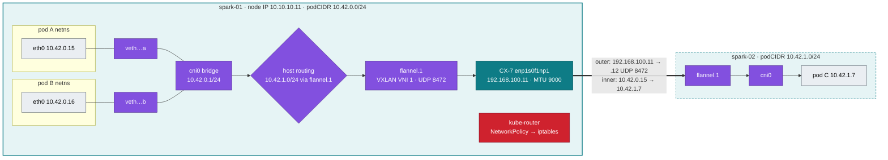

# Volume 06 — Kubernetes Networking Deep Dive: CNI, flannel VXLAN, NetworkPolicy & Secondary RDMA Networks

> **Module 02 · Part II — Networking** · Prev: [05 Scheduler](05-kube-scheduler-and-ai-batch-scheduling.md) · Next: [07 kube-proxy](07-kube-proxy-and-cluster-ip-mechanics.md)

| | |
|---|---|
| **You will build** | A packet-level map of the pod network on your Spark: netns → veth → `cni0` → `flannel.1` (VXLAN over the CX-7 link when spark-02 joins). You'll enforce and prove tenant NetworkPolicies, and see where RDMA traffic *must not* go (the overlay) |
| **Hardware** | spark-01. §5.6 and §8 need spark-02 and the QSFP cable |
| **Time** | 90 min |
| **Risk** | Low. Breaking policies is scripted and reversible (`breakfix 06`) |
| **Lab files** | [`manifests/30-networking/`](lab/manifests/30-networking/), [`manifests/10-tenancy/networkpolicies.yaml`](lab/manifests/10-tenancy/networkpolicies.yaml), [`scripts/pod-netns.sh`](lab/scripts/pod-netns.sh) |

---

## 1. Why this matters on a Spark

The Spark has three very different networks, and Kubernetes only knows about one of them by default:

| Network | Hardware | Carries | Kubernetes view |
|---|---|---|---|
| Management | 10 GbE RJ-45 `enP7s7`, 10.10.10.0/24 | SSH, API :6443, image pulls, kubelet | node IP |
| **Pod overlay** | flannel VXLAN on top of mgmt (1 Spark) or CX-7 (2 Sparks) | pod ↔ pod, Services, DNS | the pod network (10.42.0.0/16) |
| CX-7 fabric | 2× QSFP 200 GbE, `enp1s0f1np1` / `enP2p1s0f1np1`, RoCE | NCCL, NFS-RDMA, KV-cache transfer | **invisible**, unless you add it with Multus or `hostNetwork` |

The overlay is fine for HTTP. **It's the wrong path for NCCL**: VXLAN adds 50 bytes of header, bypasses RDMA, and burns CPU. Vol 17 measures the gap.

---

## 2. Architecture — HLD



With one Spark, pod ↔ pod traffic never leaves `cni0`, so there's no VXLAN. The 01 Ansible `k3s_cluster` role already sets `flannel-iface` to the first CX-7 interface when there are two Sparks, so the overlay rides the 200 GbE link.

---

## 3. LLD

### 3.1 Address plan

| Range | Purpose | Set by |
|---|---|---|
| 10.10.10.0/24 | management / node IPs | 01 Ansible `group_vars/all.yml` |
| 192.168.100.0/24, 192.168.101.0/24 | CX-7 point-to-point (one subnet per logical port) | 01 Ansible `host_vars` |
| **10.42.0.0/16** | pods, one /24 per node (`10.42.0.0/24` spark-01, `10.42.1.0/24` spark-02) | k3s `cluster-cidr` default |
| **10.43.0.0/16** | Service ClusterIPs. DNS at **10.43.0.10** | k3s `service-cidr` default |

### 3.2 MTU budget

| Underlay | Underlay MTU | VXLAN overhead | Pod MTU (flannel sets it) |
|---|---|---|---|
| mgmt 10 GbE (1 Spark) | 1500 | 50 | **1450** |
| CX-7 (2 Sparks) | 9000 | 50 | **8950** |

Any mismatch (e.g. one node's CX-7 left at 1500) gives the classic *small requests work, large responses hang* failure (§7).

### 3.3 CNI chain (k3s)

| File | Content |
|---|---|
| `/var/lib/rancher/k3s/agent/etc/cni/net.d/10-flannel.conflist` | `flannel` → `portmap` → `bandwidth` → `firewall` |
| `/run/flannel/subnet.env` | `FLANNEL_NETWORK=10.42.0.0/16`, `FLANNEL_SUBNET=10.42.0.1/24`, `FLANNEL_MTU=…` |
| CNI binaries | `/var/lib/rancher/k3s/data/current/bin/` |

### 3.4 CNI comparison (why the lab keeps flannel)

| | flannel (k3s default) | Calico | Cilium |
|---|---|---|---|
| Datapath | Linux bridge + VXLAN | iptables/eBPF, BGP or VXLAN | eBPF |
| NetworkPolicy | via k3s's embedded kube-router | native, plus global policies | native + L7 + DNS-aware |
| Observability | tcpdump | flow logs (enterprise) | Hubble |
| Fit for 1–2 Sparks | ✅ zero config | ok | best features, most moving parts |
| Replace it by | — | k3s `flannel-backend: none` + `disable-network-policy` | same |

---

## 4. Integrations

- **Multus + SR-IOV/RDMA (01 Ansible Vol 13, `playbooks/13-multus-rdma.yml`)** adds a *second* interface (`net1`) inside selected pods, attached to the CX-7. NCCL uses `net1`, and HTTP stays on `eth0`.
- **hostNetwork** is the zero-dependency alternative for 2-Spark NCCL (used in `manifests/80-distributed/two-spark`). You lose pod network isolation, so reserve it for training pods in `batch`.
- **NetworkPolicy + ingress (Vol 09)**: `llm-serving` admits only the `ingress` and `observability` namespaces. Break it with `breakfix 06`.

---

## 5. Lab

### 5.1 Deploy the tools

```bash
cd "02 Kubernetes/lab"
kubectl apply -k manifests/30-networking
kubectl -n lab-tools get pods -o wide
```

### 5.2 Walk a pod's path

```bash
scripts/pod-netns.sh lab-tools "$(kubectl -n lab-tools get pod -l app=echo -o jsonpath='{.items[0].metadata.name}')"
```

Expected (abridged):

```text
pod lab-tools/echo-5d…  ip=10.42.0.23  container-pid=412233
── inside the pod netns
lo      UNKNOWN  127.0.0.1/8
eth0@if27  UP    10.42.0.23/24
default via 10.42.0.1 dev eth0
10.42.0.0/24 dev eth0 proto kernel scope link src 10.42.0.23
10.42.0.0/16 via 10.42.0.1 dev eth0
── host side
eth0 (in pod) ⇄ veth8c1e2f0a (on host), ifindex 27
veth8c1e2f0a  UP  …  master cni0
flannel.1 … vxlan id 1 local 10.10.10.11 dev enP7s7 srcport 0 0 dstport 8472 … mtu 1450
── route the host uses to reach the pod
10.42.0.23 dev cni0 src 10.42.0.1
```

### 5.3 Watch packets on the bridge

```bash
ECHO_IP=$(kubectl -n lab-tools get pod -l app=echo -o jsonpath='{.items[0].status.podIP}')
sudo tcpdump -ni cni0 host "$ECHO_IP" and tcp port 8080 -c 6 &
kubectl -n lab-tools exec deploy/netshoot -- curl -s "$ECHO_IP:8080"; echo
wait
```

You see the SYN/SYN-ACK/ACK and HTTP between two `10.42.0.x` addresses: no NAT, no encapsulation. That's the Kubernetes network model's "every pod can reach every pod at its own IP".

### 5.4 Prove the MTU

```bash
kubectl -n lab-tools exec deploy/netshoot -- ip link show eth0 | grep -o 'mtu [0-9]*'
kubectl -n lab-tools exec deploy/netshoot -- ping -c2 -M do -s 1422 "$ECHO_IP"   # 1422+28 = 1450 → OK
kubectl -n lab-tools exec deploy/netshoot -- ping -c2 -M do -s 1423 "$ECHO_IP"   # → "message too long"
```

### 5.5 NetworkPolicies: prove isolation, then break it

```bash
kubectl apply -k manifests/10-tenancy
kubectl apply -k manifests/40-ingress          # mock-llm in llm-serving (needs Traefik CRDs → install-addons.sh traefik)
# a throwaway client/server in each tenant (socat answers "ok" on :8080; no capabilities needed)
for ns in tenant-alpha tenant-beta; do
  kubectl -n $ns run probe --image=nicolaka/netshoot:v0.13 --restart=Never \
    --overrides='{"spec":{"securityContext":{"runAsNonRoot":true,"runAsUser":65534,"seccompProfile":{"type":"RuntimeDefault"}},"containers":[{"name":"probe","image":"nicolaka/netshoot:v0.13","command":["socat","TCP-LISTEN:8080,fork,reuseaddr","SYSTEM:echo ok"],"securityContext":{"allowPrivilegeEscalation":false,"capabilities":{"drop":["ALL"]}},"resources":{"limits":{"cpu":"50m","memory":"64Mi"}}}]}}'
done
kubectl -n tenant-alpha wait --for=condition=Ready pod/probe; kubectl -n tenant-beta wait --for=condition=Ready pod/probe
A=$(kubectl -n tenant-alpha get pod probe -o jsonpath='{.status.podIP}')

kubectl -n tenant-alpha exec probe -- nc -z -w3 "$A" 8080 && echo "same-namespace allowed ✔"
kubectl -n tenant-beta exec probe -- nc -z -w3 "$A" 8080 && echo "LEAK" || echo "blocked ✔ (beta → alpha)"
kubectl -n tenant-alpha exec probe -- curl -s -m3 mock-llm.llm-serving:8000/health || echo "blocked ✔ (tenant → serving)"
kubectl -n lab-tools exec deploy/netshoot -- curl -s -m3 mock-llm.llm-serving:8000/health || echo "blocked ✔ (lab-tools → serving)"
kubectl -n tenant-alpha exec probe -- nslookup kubernetes.default >/dev/null && echo "DNS allowed ✔ (egress not restricted)"
```

Where is it enforced? In iptables, programmed by kube-router inside k3s:

```bash
sudo iptables -S | grep -E 'KUBE-NWPLCY|KUBE-POD-FW' | head
```

Now run the drill: `scripts/breakfix.sh inject 06`. Serving becomes unreachable from the ingress controller. Diagnose it with the commands above, fix it, then `scripts/breakfix.sh answer 06`.

### 5.6 (2 Sparks) See VXLAN on the wire and compare with RDMA

```bash
# pod on each node
kubectl -n lab-tools scale deploy echo --replicas=4
kubectl -n lab-tools get pods -l app=echo -o wide     # some on spark-02 (10.42.1.x)
# capture the *outer* packets on the CX-7
sudo tcpdump -ni enp1s0f1np1 udp port 8472 -c 4 -vv
# overlay vs RDMA throughput (iperf3 on pods vs ib_write_bw on hosts — 01 Ansible playbooks/11-rdma-perftest.yml)
```

Typical result on the 200 GbE link: pod-to-pod iperf3 over VXLAN gets **tens of Gb/s at high CPU**, while `ib_write_bw` gets **~185–195 Gb/s at near-zero CPU**. That gap is why distributed training uses `hostNetwork` or Multus (Vol 17).

---

## 6. Verify

| Check | Command | Expected |
|---|---|---|
| Pod MTU | `ip link show eth0` in netshoot | 1450 (1 Spark) / 8950 (2 Sparks on CX-7) |
| Cross-tenant | beta → alpha `nc -z :8080` | times out |
| Serving isolation | lab-tools → mock-llm | blocked; ingress → mock-llm allowed (Vol 09 test) |
| Scripted | `scripts/verify.sh tenancy` | NetworkPolicy checks PASS |

---

## 7. Troubleshooting

| Symptom | Cause | Diagnose | Fix |
|---|---|---|---|
| `curl` of a small page works, big responses/`kubectl logs -f` hang | MTU mismatch (one hop 1500, another expects 8950) | `ping -M do -s <size>` sweep. `ip link` on both nodes | same MTU on every CX-7 port (01 Ansible `cx7_fabric`), restart k3s to recompute flannel MTU |
| Pods on spark-02 can't reach spark-01 pods | UDP 8472 blocked, or flannel bound to the wrong iface | `ip -d link show flannel.1` (look at `local` IP), `tcpdump udp port 8472` on both | set `flannel-iface`, open UDP 8472 in ufw |
| New pods stuck `ContainerCreating`: `failed to allocate for range 0: no IP addresses available` | /24 exhausted (254 pods) or leaked IPs after a crash | `ls /var/lib/cni/networks/cbr0 \| wc -l` | delete stale files for dead containers, or restart k3s (it reconciles) |
| NetworkPolicy has no effect | the CNI doesn't enforce policies (e.g. flannel without kube-router, or `disable-network-policy`) | `sudo iptables -S \| grep -c KUBE-NWPLCY` = 0 | re-enable k3s network policy, or move to Calico/Cilium |
| Everything blocked after adding one policy | a policy *selecting* a pod turns on default-deny for that direction | `kubectl get netpol -n X -o yaml` | add explicit allows (DNS egress too, if you restrict egress) |
| NCCL slow between Sparks | traffic going over the overlay / mgmt 10 GbE | `NCCL_DEBUG=INFO` shows `NET/Socket` instead of `NET/IB` | hostNetwork or Multus + `NCCL_IB_HCA` (Vol 17) |

---

## 8. Scale-out path

| Lab | Datacenter |
|---|---|
| flannel VXLAN, one flat pod network | Calico BGP (no encapsulation, routes announced to ToRs) or Cilium eBPF with native routing |
| 1 CX-7 cable, pod overlay on it | Separate **frontend** (Ethernet, pods/storage) and **backend** (compute fabric: IB or Spectrum-X RoCE, rail-optimised) networks (Vol 18) |
| hostNetwork / Multus for NCCL | NVIDIA Network Operator: SR-IOV VFs or RDMA shared device plugin, `rdma/rdma_shared_device_a` resources, per-rail `NetworkAttachmentDefinition`s |
| kube-router policies | Cilium or Calico global policies plus FQDN egress rules (e.g. only `huggingface.co`, `nvcr.io`) |

---

## 9. Checklist

- [ ] I traced a pod's `eth0` to its host `veth`, the bridge and the route back.
- [ ] I measured the pod MTU and know what it becomes over the CX-7.
- [ ] I proved tenant isolation with NetworkPolicies and diagnosed a policy that broke ingress.
- [ ] I can explain why NCCL must not use the pod overlay.
