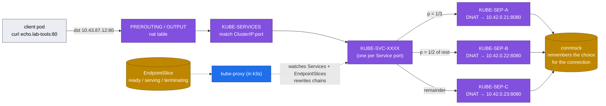

# Volume 07 — kube-proxy & ClusterIP Mechanics: iptables, EndpointSlices, conntrack, Headless Services

> **Module 02 · Part II — Networking** · Prev: [06 Networking](06-kubernetes-networking-deep-dive.md) · Next: [08 CoreDNS](08-coredns-and-service-discovery.md)

| | |
|---|---|
| **You will build** | The ability to read a Service's load-balancing rules straight out of iptables. You'll watch endpoints appear and disappear with readiness, see why rolling a model server can drop requests, and size conntrack for an inference gateway |
| **Hardware** | spark-01 |
| **Time** | 75 min |
| **Risk** | None |
| **Lab files** | [`manifests/30-networking/echo-service.yaml`](lab/manifests/30-networking/echo-service.yaml), [`scripts/svc-trace.sh`](lab/scripts/svc-trace.sh), [`k3s/20-k8s-lab.yaml`](lab/k3s/20-k8s-lab.yaml) (`conntrack-max-per-core`) |

---

## 1. Why this matters on a Spark

A ClusterIP such as `10.43.87.12` isn't bound to any interface. It exists only as NAT rules that kube-proxy writes into the kernel. Every request to `vllm.llm-serving:8000` gets DNAT'd to one ready pod, **once per connection**. That has consequences for LLM serving:

- **Long-lived HTTP/2 or keep-alive connections stick to one pod.** A gateway holding 8 keep-alive connections to 2 vLLM replicas may send all traffic to one.
- **Readiness decides membership.** A loading model that reports ready too early gets traffic and returns 503s.
- **Terminating pods keep their conntrack entries** until those connections close. Without a `preStop` delay, in-flight streams are cut.

---

## 2. Architecture — HLD



The probabilities cascade: with N endpoints, rule *i* matches with probability 1/(N−i+1). Each endpoint ends up with exactly 1/N of *new connections*.

---

## 3. LLD

### 3.1 Service types in the lab

| Service | Type | What kube-proxy / k3s does | Used for |
|---|---|---|---|
| `lab-tools/echo` | ClusterIP | `KUBE-SVC-*` DNAT chain | in-cluster clients |
| `lab-tools/echo-headless` | ClusterIP **None** | **nothing**. DNS returns pod IPs | StatefulSets, torchrun rendezvous, clients doing their own balancing |
| `ingress/traefik-lab` | LoadBalancer | NodePort chain + k3s **servicelb** DaemonSet binds `:80/:443` on the node | entry point |
| `llm-serving/vllm` | ClusterIP | same as echo | behind Traefik |

### 3.2 Modes

| Mode | Lookup cost | k3s | Notes |
|---|---|---|---|
| iptables (default) | O(n) rule walk per *new* connection | ✅ | fine for hundreds of Services |
| IPVS | O(1) hash | `kube-proxy-arg: proxy-mode=ipvs` | real LB algorithms (rr, lc, sh). Needs `ip_vs` modules |
| nftables | O(1) verdict maps | `proxy-mode=nftables` (GA in Kubernetes 1.33) | the future default. Check your k3s version |

### 3.3 Conntrack sizing

| Setting | Lab value | Why |
|---|---|---|
| `conntrack-max-per-core` | 65536 × 20 cores = **1,310,720** | an LLM gateway fanning out to many clients and backends |
| `nf_conntrack_tcp_timeout_established` | 86400 s (kernel default) | long SSE streams need it. Don't shorten it blindly |
| Alert | `ConntrackTableFilling` > 75 % | in [`rules.yaml`](lab/manifests/95-observability/rules.yaml) |

---

## 4. Integrations

- **Readiness → EndpointSlice → iptables.** The `readinessProbe` in every serving manifest (enforced by the Vol 02 policy) is what keeps half-loaded models out of the chain.
- **Ingress (Vol 09)**: Traefik doesn't use the ClusterIP. It watches EndpointSlices itself and balances **per request**. That's the fix for the "keep-alive sticks to one pod" problem.
- **torchrun (Vol 17)** uses the headless Service `ddp-workers` so `ddp-0.ddp-workers` resolves straight to rank 0's pod IP.

---

## 5. Lab

### 5.1 Read a Service out of iptables

```bash
cd "02 Kubernetes/lab"
kubectl apply -k manifests/30-networking
scripts/svc-trace.sh lab-tools echo
```

Expected (abridged):

```text
Service lab-tools/echo ClusterIP=10.43.87.12
NAME          ADDRESSTYPE   PORTS   ENDPOINTS                             AGE
echo-7xk2p    IPv4          8080    10.42.0.21,10.42.0.22,10.42.0.23      5m
── KUBE-SVC-QX4… (random-probability load balancing, top to bottom)
  -A KUBE-SVC-QX4… ! -s 10.42.0.0/16 -d 10.43.87.12/32 -p tcp --dport 80 -j KUBE-MARK-MASQ
  -A KUBE-SVC-QX4… -m statistic --mode random --probability 0.33333333349 -j KUBE-SEP-AAA…
  -A KUBE-SVC-QX4… -m statistic --mode random --probability 0.50000000000 -j KUBE-SEP-BBB…
  -A KUBE-SVC-QX4… -j KUBE-SEP-CCC…
── KUBE-SEP-AAA…
  -A KUBE-SEP-AAA… -s 10.42.0.21/32 -j KUBE-MARK-MASQ
  -A KUBE-SEP-AAA… -p tcp -j DNAT --to-destination 10.42.0.21:8080
```

### 5.2 Measure the distribution: new connections vs keep-alive

```bash
# new connection per request → ~even
kubectl -n lab-tools exec deploy/netshoot -- sh -c 'for i in $(seq 300); do curl -s echo; echo; done' | sort | uniq -c
# 30 requests in ONE curl invocation → one keep-alive connection → all on ONE pod
kubectl -n lab-tools exec deploy/netshoot -- sh -c 'curl -s -w "\n" $(for i in $(seq 30); do printf "http://echo/ "; done)' | sort | uniq -c
```

Expected: ≈100/100/100 for the first loop. For the second, **one** hostname 30 times. That's why an HTTP client pool in front of vLLM needs a real L7 balancer (Traefik, or the gateway in Vol 21), not just a ClusterIP.

### 5.3 Readiness controls membership

```bash
POD=$(kubectl -n lab-tools get pod -l app=echo -o jsonpath='{.items[0].metadata.name}')
kubectl -n lab-tools get endpointslices -l kubernetes.io/service-name=echo -o jsonpath='{range .items[0].endpoints[*]}{.targetRef.name}{" ready="}{.conditions.ready}{"\n"}{end}'
# make it fail readiness: agnhost serve-hostname has no toggle, so remove it from the Service via its label
kubectl -n lab-tools label pod "$POD" app=echo-quarantine --overwrite
scripts/svc-trace.sh lab-tools echo | grep -c 'DNAT'      # a NEW pod replaced it (RS wants 3) → still 3
kubectl -n lab-tools get pod "$POD" -o wide                # quarantined pod still running, out of rotation
kubectl -n lab-tools delete pod "$POD"
```

This is the **quarantine pattern**: relabel a misbehaving model server to take it out of traffic but keep it alive for debugging (`kubectl exec`, py-spy, nsys).

### 5.4 Headless Service: DNS instead of NAT

```bash
kubectl -n lab-tools exec deploy/netshoot -- dig +short echo.lab-tools.svc.cluster.local
kubectl -n lab-tools exec deploy/netshoot -- dig +short echo-headless.lab-tools.svc.cluster.local
sudo iptables-save -t nat | grep -c echo-headless          # 0 → kube-proxy ignores it
```

Expected: one ClusterIP for `echo`, three pod IPs for `echo-headless`.

### 5.5 Conntrack

```bash
sudo sysctl net.netfilter.nf_conntrack_max net.netfilter.nf_conntrack_count
sudo conntrack -L -p tcp --dport 8080 2>/dev/null | head -3
kubectl -n lab-tools exec deploy/netshoot -- sh -c 'for i in $(seq 2000); do curl -s -o /dev/null echo; done'
sudo conntrack -C
```

`nf_conntrack_max` should be ≥ 1,310,720 after the k3s drop-in. Each finished curl leaves a `TIME_WAIT` entry for ~120 s.

### 5.6 Graceful termination (no dropped streams)

The mock LLM streams 20 tokens/s. Start a long stream, delete the pod serving it, and see what the client gets:

```bash
kubectl apply -k manifests/40-ingress
kubectl -n llm-serving exec deploy/mock-llm-canary -- python3 - <<'PY' &
import json, urllib.request
req = urllib.request.Request("http://mock-llm:8000/v1/chat/completions", data=json.dumps({"stream": True, "max_tokens": 400}).encode())
n = 0
try:
    for line in urllib.request.urlopen(req):
        n += line.startswith(b"data:")
    print("stream completed, events:", n)
except Exception as e:
    print("stream CUT after", n, "events:", e)
PY
sleep 3; kubectl -n llm-serving delete pod -l app=mock-llm --wait=false; wait
```

With no `preStop` and a 30 s grace period, the Python server gets SIGTERM and exits immediately, so you'll see **stream CUT**. The production pattern (applied to vLLM in Vol 21):

```yaml
lifecycle:
  preStop:
    exec: {command: ["sleep", "15"]}   # let EndpointSlice removal propagate before SIGTERM
terminationGracePeriodSeconds: 120      # > longest expected generation
```

---

## 6. Verify

| Check | Expected |
|---|---|
| `svc-trace.sh lab-tools echo` | 3 `KUBE-SEP` chains with probabilities 0.333 / 0.5 / rest |
| 300 new connections | each pod ≈ 100 ± 20 |
| headless DNS | 3 A records |
| `conntrack -C` vs max | < 5 % in the lab |

---

## 7. Troubleshooting

| Symptom | Cause | Diagnose | Fix |
|---|---|---|---|
| `curl: (7) Failed to connect` to ClusterIP, pods fine | no ready endpoints (selector/port mismatch) | `kubectl get endpointslices -l kubernetes.io/service-name=X` | fix the selector/targetPort (drill `breakfix 08`) |
| 502/503 during rollouts | old pod killed while connections are open, or new pod ready too early | Traefik logs, `kubectl rollout status` timing | `preStop` sleep + startupProbe + `maxUnavailable: 0` |
| One replica hot, others idle | client keep-alive / HTTP/2 pinning | per-pod request metrics (`vllm:num_requests_running` by pod) | L7 balancing (Traefik, gateway), or shorter keep-alive on the client |
| Random new-connection drops at load | conntrack table full | `dmesg \| grep 'nf_conntrack: table full'` | raise `conntrack-max-per-core`, find the leak |
| NodePort works on the node, not from the LAN | host firewall (ufw) or `externalTrafficPolicy: Local` without a local pod | `sudo ufw status`, `kubectl get svc -o yaml` | open the port, or use `Cluster` |
| Service change takes seconds to apply | kube-proxy sync period / iptables-restore at scale | `kubeproxy_sync_proxy_rules_duration_seconds` | fine at lab scale. At DC scale use nftables/IPVS |

---

## 8. Scale-out path

| Lab | Datacenter |
|---|---|
| iptables mode, dozens of Services | nftables or IPVS mode, or Cilium kube-proxy replacement (eBPF socket-LB) |
| servicelb binds node ports | MetalLB (L2/BGP) or a hardware LB announcing VIPs |
| ClusterIP in front of model servers | L7 inference gateway that balances on KV-cache and queue signals (Gateway API Inference Extension, Vol 09 §8) |

---

## 9. Checklist

- [ ] I can find the DNAT rules for any Service and explain the probabilities.
- [ ] I showed that keep-alive defeats ClusterIP balancing.
- [ ] I used relabeling to quarantine a pod without killing it.
- [ ] I know the two settings that stop rollouts from cutting LLM streams.
