# Volume 07 — kube-proxy & ClusterIP Mechanics: iptables, EndpointSlices, conntrack, Headless Services

> **Module 02 · Part II — Networking** · Prev: [06 Networking](06-kubernetes-networking-deep-dive.md) · Next: [08 CoreDNS](08-coredns-and-service-discovery.md) · The lab's shape: [27 Nested clusters](27-nested-clusters-with-vcluster.md)

| | |
|---|---|
| **You will build** | The ability to read a Service's load-balancing rules straight out of the root's iptables — including Services a tenant created inside a vCluster, which reach the kernel as synced root Services. You'll watch endpoints appear and disappear with readiness, see why rolling a model server can drop requests, follow a MetalLB LoadBalancer IP to a pod, and size conntrack for an inference gateway |
| **Hardware** | dgx-spark-1 |
| **Time** | 75 min |
| **Risk** | None |
| **Clusters** | `spark-root` (kube-proxy, iptables, conntrack, MetalLB, the synced Services), `dev-lab` (echo Services), `llms` (mock-llm streams, Traefik LoadBalancer) |
| **Lab files** | [`manifests/dev-lab/30-networking/echo-service.yaml`](lab/manifests/dev-lab/30-networking/echo-service.yaml), [`scripts/svc-trace.sh`](lab/scripts/svc-trace.sh), [`manifests/root/30-networking/netshoot-host.yaml`](lab/manifests/root/30-networking/netshoot-host.yaml), [`addons/traefik-values.yaml`](lab/addons/traefik-values.yaml), 01 Ansible [`kubeadm-init.yaml.j2`](../01%20Ansible/lab/roles/kubeadm_cluster/templates/kubeadm-init.yaml.j2) (`KubeProxyConfiguration`: `mode: iptables`, `conntrack.maxPerCore`) |

---

## 1. Why this matters on a Spark

A ClusterIP such as `10.43.87.12` isn't bound to any interface. It exists only as NAT rules that kube-proxy writes into the kernel. Every request to `vllm.llm-serving:8000` gets DNAT'd to one ready pod, **once per connection**. That has consequences for LLM serving:

- **Long-lived HTTP/2 or keep-alive connections stick to one pod.** A gateway holding 8 keep-alive connections to 2 vLLM replicas may send all traffic to one.
- **Readiness decides membership.** A loading model that reports ready too early gets traffic and returns 503s.
- **Terminating pods keep their conntrack entries** until those connections close. Without a `preStop` delay, in-flight streams are cut.

In this lab there's a twist: there is exactly **one kube-proxy** — the root's DaemonSet in `kube-system`. A vCluster has an API server, controllers and DNS, but no kube-proxy and no kernel of its own. A Service a tenant creates in `dev-lab` or `llms` only works because the syncer copies it to the root, where it becomes an ordinary root Service with a ClusterIP from the root's 10.43.0.0/16, and the root's kube-proxy programs that IP.

Cilium is the CNI, but with `kubeProxyReplacement=false` (01 Ansible `roles/cilium`): Cilium moves packets between pod IPs, kube-proxy turns ClusterIPs into pod IPs in iptables. That split is what lets this volume read Services with `iptables-save`.

---

## 2. Architecture — HLD

```mermaid
flowchart LR
  subgraph VC["vCluster dev-lab (its own API server)"]
    VS["Service lab-tools/echo<br/>ClusterIP 10.43.87.12"]
    VES[("EndpointSlice echo-…<br/>(dev-lab's controller)")]
  end
  SY["dev-lab syncer"]
  subgraph ROOT["root cluster spark-root"]
    RS["Service vc-dev-lab/<br/>echo-x-lab-tools-x-dev-lab<br/>ClusterIP 10.43.87.12"]
    ES[("EndpointSlice<br/>ready / serving / terminating<br/>(root's controller)")]
    KP["kube-proxy DaemonSet<br/>mode: iptables"]
  end
  VS -- "sync toHost" --> SY --> RS
  RS --> ES
  C["client pod (dev-lab netshoot)<br/>curl echo:80"] -->|"dst 10.43.87.12:80"| PR["PREROUTING / OUTPUT<br/>nat table"]
  PR --> KS["KUBE-SERVICES<br/>match ClusterIP:port"]
  KS --> SVC["KUBE-SVC-XXXX<br/>(one per Service port)"]
  SVC -->|"p = 1/3"| SEP1["KUBE-SEP-A<br/>DNAT → 10.42.0.21:8080"]
  SVC -->|"p = 1/2 of rest"| SEP2["KUBE-SEP-B<br/>DNAT → 10.42.0.22:8080"]
  SVC -->|"remainder"| SEP3["KUBE-SEP-C<br/>DNAT → 10.42.0.23:8080"]
  SEP1 & SEP2 & SEP3 --> CT[("conntrack<br/>remembers the choice<br/>for the connection")]
  CT --> CIL["Cilium eBPF<br/>delivers to the pod's lxc*"]
  KP -. "watches root Services + EndpointSlices<br/>rewrites chains" .-> SVC
  ES -.-> KP
  classDef net fill:#8250df,stroke:#4c2889,color:#fff
  classDef ctrl fill:#1f6feb,stroke:#0b3d91,color:#fff
  classDef store fill:#bf8700,stroke:#7a5600,color:#fff
  classDef tenant fill:#eaeef2,stroke:#57606a,color:#000
  class PR,KS,SVC,SEP1,SEP2,SEP3,CIL net
  class KP,SY ctrl
  class CT,ES,VES store
  class C,VS tenant
  class RS net
  style VC fill:#f6f8fa,stroke:#57606a,stroke-dasharray:5 3
  style ROOT fill:#ffffff,stroke:#1f6feb
```



The probabilities cascade: with N endpoints, rule *i* matches with probability 1/(N−i+1). Each endpoint ends up with exactly 1/N of *new connections*.

There are **two EndpointSlice controllers** in the picture. dev-lab's controller-manager builds slices from the tenant's pods (they feed dev-lab's DNS, e.g. the headless Service in §5.4, and Traefik in llms). The root's controller builds slices for the synced Service from the real pods in `vc-dev-lab`. kube-proxy only ever reads the root's.

---

## 3. LLD

### 3.1 Service types in the lab

| Service (cluster) | On the root | Type | What the root does | Used for |
|---|---|---|---|---|
| `lab-tools/echo` (dev-lab) | `vc-dev-lab/echo-x-lab-tools-x-dev-lab` | ClusterIP | `KUBE-SVC-*` DNAT chain; same ClusterIP on both sides | in-cluster clients |
| `lab-tools/echo-headless` (dev-lab) | `…/echo-headless-x-lab-tools-x-dev-lab` | ClusterIP **None** | **nothing**. dev-lab's DNS returns pod IPs | StatefulSets, torchrun rendezvous, clients doing their own balancing |
| `ingress/traefik-lab` (llms) | `vc-llms/traefik-lab-x-ingress-x-llms` | LoadBalancer | MetalLB assigns **192.168.0.115** (annotation `metallb.io/loadBalancerIPs`), its speaker answers ARP on `enP7s7`; kube-proxy adds a `KUBE-EXT-*` chain for the LB IP | the llms API gateway (Vol 09) |
| vCluster API `dev-lab` / `llms` | `vc-dev-lab/dev-lab`, `vc-llms/llms` (created by the Helm chart, not synced) | LoadBalancer | MetalLB **.111** / **.112** | `kubectl --context dev-lab` / `llms` |
| `default/prometheus` (llms) | the root's own `observability/kps-prometheus` | ClusterIP | replicated *into* llms (`networking.replicateServices.fromHost`); one set of rules, two names | KEDA in llms queries the root's Prometheus |
| `llm-serving/vllm` (llms) | `vc-llms/vllm-x-llm-serving-x-llms` | ClusterIP | same as echo | behind Traefik |

The ClusterIP a tenant sees is a root address: the root API server allocates it from 10.43.0.0/16 when the syncer creates the host Service, and the vCluster's Service carries the same IP. That's why a pod can use the IP its own DNS returns even though the vCluster has no kube-proxy.

Every LoadBalancer Service counts against the root quota of its `vc-*` namespace: `services.loadbalancers` is 1 for dev-lab (its API) and 2 for llms (API + Traefik), and `services.nodeports` is 2 and 4 ([`manifests/root/05-vclusters/quotas.yaml`](lab/manifests/root/05-vclusters/quotas.yaml)). Why any NodePorts at all? A LoadBalancer Service allocates one NodePort per port by default and quota counts them — the vCluster API Service has two ports (https, kubelet), Traefik two (web, websecure). The small number still keeps tenants from publishing plain NodePort Services through the syncer.

### 3.2 Modes

| Mode | Lookup cost | This lab | Notes |
|---|---|---|---|
| **iptables** | O(n) rule walk per *new* connection | ✅ `mode: iptables` in the kubeadm `KubeProxyConfiguration` | fine for hundreds of Services; what this volume reads |
| IPVS | O(1) hash | `mode: ipvs` | real LB algorithms (rr, lc, sh). Needs `ip_vs` modules. Deprecated in favour of nftables upstream |
| nftables | O(1) verdict maps | `mode: nftables` (GA in Kubernetes 1.33) | the future default for kube-proxy |
| Cilium kube-proxy replacement | O(1) eBPF map lookup, at the socket for pod clients | Cilium `kubeProxyReplacement=true` + remove the kube-proxy DaemonSet | no `KUBE-*` chains at all; `cilium-dbg service list` instead. The usual production choice with Cilium |

Check what's running:

```bash
kubectl --context spark-root -n kube-system get cm kube-proxy -o jsonpath='{.data.config\.conf}' | grep -E '^mode|maxPerCore'
kubectl --context spark-root -n kube-system exec ds/cilium -c cilium-agent -- cilium-dbg status | grep -i KubeProxyReplacement
```

Expected: `mode: iptables`, `maxPerCore: 65536`, `KubeProxyReplacement: False`.

### 3.3 Conntrack sizing

| Setting | Lab value | Why |
|---|---|---|
| `conntrack.maxPerCore` (KubeProxyConfiguration) | 65536 × 20 cores = **1,310,720** | an LLM gateway fanning out to many clients and backends; kube-proxy writes `nf_conntrack_max` at start |
| `nf_conntrack_tcp_timeout_established` | 86400 s (kernel default) | long SSE streams need it. Don't shorten it blindly |
| Alert | `ConntrackTableFilling` > 75 % | in [`rules.yaml`](lab/manifests/root/95-observability/rules.yaml) |

There's one conntrack table per kernel. Every vCluster's connections, the root's, and Docker's on DGX OS share it.

---

## 4. Integrations

- **Readiness → EndpointSlice → iptables, across two clusters.** The root kubelet runs the `readinessProbe` (enforced on serving Deployments by the `spark-serving-needs-readiness` policy, Vol 02) and marks the *root* pod Ready. The root's EndpointSlice controller adds it to the synced Service's slice and kube-proxy adds a `KUBE-SEP`. The syncer copies the status back into the vCluster, whose own controller updates the tenant's slice. A half-loaded model stays out of the chain either way.
- **Ingress (Vol 09)**: Traefik runs inside llms, watches *llms'* EndpointSlices and connects to pod IPs directly, balancing **per request**. It never uses the ClusterIP — that's the fix for the "keep-alive sticks to one pod" problem. The pod IPs it gets are real root pod IPs, so this works through the vCluster.
- **LoadBalancer path and source IPs**: a request to `192.168.0.115` arrives on the mgmt NIC (MetalLB answered the ARP), hits `KUBE-SERVICES` → `KUBE-EXT-*` → `KUBE-SVC-*` and is DNAT'd to the Traefik pod. With the default `externalTrafficPolicy: Cluster`, kube-proxy also **masquerades** it, so Traefik sees the node's address, not your laptop's. The same happens to a pod that calls the LB IP from inside the cluster — which is why, to Cilium, that traffic comes from the node (identity `host`) and not from a `vc-*` namespace (Vol 06 §5.5, §5.7 here).
- **torchrun (Vol 17)** uses the headless Service `ddp-workers` in llms' `batch` namespace so `ddp-0.ddp-workers` resolves straight to rank 0's pod IP.

---

## 5. Lab

Run from `02 Kubernetes/lab` on the Spark (`svc-trace.sh` needs `sudo iptables-save` and `sudo conntrack`), with the lab kubeconfig exported:

```bash
cd "02 Kubernetes/lab"
export KUBECONFIG="$PWD/../../01 Ansible/lab/.cache/kubeconfig-spark-lab.yaml"
```

If DGX OS lacks `conntrack`, either `sudo apt install conntrack` or run the same commands in the root's `netshoot-host` (hostNetwork + NET_ADMIN): `kubectl --context spark-root -n platform-tools exec deploy/netshoot-host -- conntrack -C`.

### 5.1 Read a Service out of iptables

`svc-trace.sh <namespace> <service> [context]` takes the Service as the tenant sees it, then finds the root's chains by its ClusterIP:

```bash
kubectl --context dev-lab apply -k manifests/dev-lab/30-networking
scripts/svc-trace.sh lab-tools echo dev-lab
```

Expected (abridged):

```text
Service dev-lab lab-tools/echo ClusterIP=10.43.87.12
NAME         ADDRESSTYPE   PORTS   ENDPOINTS                          AGE
echo-7xk2p   IPv4          8080    10.42.0.21,10.42.0.22,10.42.0.23   5m
── root sees it as: vc-dev-lab/echo-x-lab-tools-x-dev-lab:http cluster IP
── KUBE-SVC-QX4… (random-probability load balancing, top to bottom)
  -A KUBE-SVC-QX4… -m comment --comment "vc-dev-lab/echo-x-lab-tools-x-dev-lab:http cluster IP" ! -s 10.42.0.0/16 -d 10.43.87.12/32 -p tcp --dport 80 -j KUBE-MARK-MASQ
  -A KUBE-SVC-QX4… -m comment --comment "vc-dev-lab/echo-x-lab-tools-x-dev-lab:http -> 10.42.0.21:8080" -m statistic --mode random --probability 0.33333333349 -j KUBE-SEP-AAA…
  -A KUBE-SVC-QX4… -m comment --comment "… -> 10.42.0.22:8080" -m statistic --mode random --probability 0.50000000000 -j KUBE-SEP-BBB…
  -A KUBE-SVC-QX4… -m comment --comment "… -> 10.42.0.23:8080" -j KUBE-SEP-CCC…
── KUBE-SEP-AAA…
  -A KUBE-SEP-AAA… -s 10.42.0.21/32 -j KUBE-MARK-MASQ
  -A KUBE-SEP-AAA… -p tcp -j DNAT --to-destination 10.42.0.21:8080
── conntrack entries to 10.43.87.12
```

The EndpointSlice printed first is **dev-lab's** (the tenant's view). The iptables rules were written from the **root's** slice for the synced Service. Compare the two:

```bash
kubectl --context spark-root -n vc-dev-lab get svc echo-x-lab-tools-x-dev-lab -o wide
kubectl --context spark-root -n vc-dev-lab get endpointslices -l kubernetes.io/service-name=echo-x-lab-tools-x-dev-lab -o wide
kubectl --context spark-root -n vc-dev-lab get svc echo-x-lab-tools-x-dev-lab -o jsonpath='{.spec.selector}{"\n"}'
```

Same ClusterIP, same three pod IPs. The selector on the root copy isn't the tenant's plain `app: echo`: the syncer rewrote it so it can only match pods synced from `lab-tools` in dev-lab, never a pod from another inner namespace that happens to use the same label.

### 5.2 Measure the distribution: new connections vs keep-alive

```bash
# new connection per request → ~even
kubectl --context dev-lab -n lab-tools exec deploy/netshoot -- sh -c 'for i in $(seq 300); do curl -s echo; echo; done' | sort | uniq -c
# 30 requests in ONE curl invocation → one keep-alive connection → all on ONE pod
kubectl --context dev-lab -n lab-tools exec deploy/netshoot -- sh -c 'curl -s -w "\n" $(for i in $(seq 30); do printf "http://echo/ "; done)' | sort | uniq -c
```

Expected: ≈100/100/100 for the first loop. For the second, **one** hostname 30 times. That's why an HTTP client pool in front of vLLM needs a real L7 balancer (Traefik, or the gateway in Vol 21), not just a ClusterIP.

### 5.3 Readiness controls membership

```bash
POD=$(kubectl --context dev-lab -n lab-tools get pod -l app=echo -o jsonpath='{.items[0].metadata.name}')
kubectl --context dev-lab -n lab-tools get endpointslices -l kubernetes.io/service-name=echo \
  -o jsonpath='{range .items[0].endpoints[*]}{.targetRef.name}{" ready="}{.conditions.ready}{"\n"}{end}'
# take it out of the Service: agnhost serve-hostname has no readiness toggle, so change its label
kubectl --context dev-lab -n lab-tools label pod "$POD" app=echo-quarantine --overwrite
sleep 5
scripts/svc-trace.sh lab-tools echo dev-lab | grep -c 'DNAT'     # a NEW pod replaced it (RS wants 3) → still 3
kubectl --context dev-lab -n lab-tools get pod "$POD" -o wide      # quarantined pod still running, out of rotation
kubectl --context dev-lab -n lab-tools delete pod "$POD"
```

Count the hops the label change took: dev-lab's API server → syncer → root pod's labels → root EndpointSlice controller → kube-proxy → iptables. A few seconds is normal; if the root rules never change, the syncer is the place to look (`kubectl --context spark-root -n vc-dev-lab logs statefulset/dev-lab | grep -i error`).

This is the **quarantine pattern**: relabel a misbehaving model server to take it out of traffic but keep it alive for debugging (`kubectl exec`, py-spy, nsys).

### 5.4 Headless Service: DNS instead of NAT

```bash
kubectl --context dev-lab -n lab-tools exec deploy/netshoot -- dig +short echo.lab-tools.svc.cluster.local
kubectl --context dev-lab -n lab-tools exec deploy/netshoot -- dig +short echo-headless.lab-tools.svc.cluster.local
kubectl --context spark-root -n vc-dev-lab get svc echo-headless-x-lab-tools-x-dev-lab   # CLUSTER-IP None
sudo iptables-save -t nat | grep -c echo-headless                                          # 0 → kube-proxy ignores it
```

Expected: one ClusterIP for `echo`, three pod IPs for `echo-headless`. The answers come from dev-lab's own CoreDNS (Vol 08), built from dev-lab's EndpointSlices; the root contributes nothing but the pod IPs.

### 5.5 Conntrack

```bash
sudo sysctl net.netfilter.nf_conntrack_max net.netfilter.nf_conntrack_count
ECHO_CIP=$(kubectl --context dev-lab -n lab-tools get svc echo -o jsonpath='{.spec.clusterIP}')
sudo conntrack -L -d "$ECHO_CIP" 2>/dev/null | head -3
kubectl --context dev-lab -n lab-tools exec deploy/netshoot -- sh -c 'for i in $(seq 2000); do curl -s -o /dev/null echo; done'
sudo conntrack -C
```

`nf_conntrack_max` should be ≥ 1,310,720, set by kube-proxy from `conntrack.maxPerCore`. The entries show the original destination (the ClusterIP) and the reply source (the pod IP) — the DNAT kube-proxy chose, remembered for the life of the connection. Each finished curl leaves a `TIME_WAIT` entry for ~120 s.

### 5.6 Graceful termination (no dropped streams)

The mock LLM streams 20 tokens/s. Start a long stream inside llms, delete the pod serving it, and see what the client gets:

```bash
kubectl --context llms apply -k manifests/llms/40-ingress
kubectl --context llms -n llm-serving exec deploy/mock-llm-canary -- python3 - <<'PY' &
import json, urllib.request
req = urllib.request.Request("http://mock-llm:8000/v1/chat/completions", data=json.dumps({"stream": True, "max_tokens": 400}).encode())
n = 0
try:
    for line in urllib.request.urlopen(req):
        n += line.startswith(b"data:")
    print("stream completed, events:", n)
except Exception as e:
    print("stream CUT after", n, "events:", e)
PY
sleep 3; kubectl --context llms -n llm-serving delete pod -l app=mock-llm --wait=false; wait
```

With no `preStop` and a 30 s grace period, the Python server gets SIGTERM and exits immediately, so you'll see **stream CUT**. The delete is a vCluster API call; the syncer deletes the root pod, the root kubelet sends SIGTERM, and the root EndpointSlice marks it `terminating` — all in parallel, which is why the pod can die before every client has stopped using it. The production pattern (applied to vLLM in Vol 21):

```yaml
lifecycle:
  preStop:
    exec: {command: ["sleep", "15"]}   # let EndpointSlice removal propagate before SIGTERM
terminationGracePeriodSeconds: 120      # > longest expected generation
```

### 5.7 The front door: a LoadBalancer IP, from outside and inside

```bash
kubectl --context llms -n ingress get svc traefik-lab                                     # EXTERNAL-IP 192.168.0.115
kubectl --context spark-root -n vc-llms get svc traefik-lab-x-ingress-x-llms               # the synced copy MetalLB serves
kubectl --context spark-root -n metallb-system logs -l app.kubernetes.io/component=speaker --tail=50 | grep -i 192.168.0.115
sudo iptables-save -t nat | grep -E '192.168.0.115|KUBE-EXT' | head
# on your laptop, after one request to .115: `ip neigh show 192.168.0.115` (or `arp -n`) lists the Spark's mgmt MAC
```

The `KUBE-EXT-*` chain marks the packet for masquerade before jumping to the same `KUBE-SVC-*` a ClusterIP would use. Now call the front door from *inside* dev-lab and ask Hubble who Cilium thinks the caller is:

```bash
kubectl --context dev-lab -n lab-tools exec deploy/netshoot -- curl -s -m3 -o /dev/null -w '%{http_code}\n' -H 'Host: llm.lab.local' http://192.168.0.115/v1/models
kubectl --context spark-root -n kube-system exec ds/cilium -c cilium-agent -- hubble observe --namespace vc-llms --port 8000 --last 5
```

Predict first, then check. Pod → Traefik pod IP was dropped by `vcluster-boundary` in Vol 06. Through the LB IP the packet is masqueraded on the node before Cilium delivers it, so Hubble shows the source as the node (`host` / the node's router IP), not `vc-dev-lab/…` — and the boundary, which denies the `vc-dev-lab` identity, doesn't match. The public front door stays public; the private pod IPs stay private. If your result differs, the Hubble line tells you which identity Cilium used.

---

## 6. Verify

| Check | Expected |
|---|---|
| `svc-trace.sh lab-tools echo dev-lab` | root name `vc-dev-lab/echo-x-lab-tools-x-dev-lab`, 3 `KUBE-SEP` chains with probabilities 0.333 / 0.5 / rest |
| ClusterIP in dev-lab vs on the root | identical |
| 300 new connections | each pod ≈ 100 ± 20 |
| headless DNS | 3 A records; 0 iptables rules |
| `conntrack -C` vs max | < 5 % in the lab |
| `scripts/verify.sh platform` | `kube-proxy present (iptables mode, Volume 07)` PASS |
| `scripts/verify.sh ingress` | `Traefik LoadBalancer IP 192.168.0.115 (MetalLB on the root)` PASS |

---

## 7. Troubleshooting

| Symptom | Cause | Diagnose | Fix |
|---|---|---|---|
| `curl: (7) Failed to connect` to ClusterIP, pods fine | no ready endpoints (selector/port mismatch) | `kubectl --context <vc> -n X get endpointslices -l kubernetes.io/service-name=Y` | fix the selector/targetPort (drill `breakfix 08`, llms) |
| Service exists in the vCluster but `svc-trace.sh` finds no `KUBE-SVC` chain | the Service wasn't synced, or kube-proxy isn't in iptables mode | `kubectl --context spark-root -n vc-<vc> get svc \| grep <name>`; syncer logs; `kube-proxy` ConfigMap `mode` | fix the sync error (often a root quota or admission refusal in `vc-<vc>`); `scripts/verify.sh platform` |
| LoadBalancer Service stays `<pending>` | MetalLB pool exhausted / IP not in the pool, or the root quota refused the synced copy | `kubectl --context spark-root -n metallb-system get ipaddresspool`; `kubectl --context spark-root -n vc-<vc> describe resourcequota vcluster-budget` | free an IP from 192.168.0.110–119; `services.loadbalancers` allows 1 (dev-lab) / 2 (llms) |
| `exceeded quota: vcluster-budget … services.nodeports` on a LoadBalancer | a LoadBalancer Service allocates NodePorts by default, and the root quota only has room for the API and Traefik ones | the syncer's event on the vCluster Service | `spec.allocateLoadBalancerNodePorts: false` (MetalLB L2 doesn't need NodePorts) |
| 502/503 during rollouts | old pod killed while connections are open, or new pod ready too early | Traefik logs, `kubectl --context llms rollout status` timing | `preStop` sleep + startupProbe + `maxUnavailable: 0` |
| One replica hot, others idle | client keep-alive / HTTP/2 pinning | per-pod request metrics (`vllm:num_requests_running` by `vpod`) | L7 balancing (Traefik, gateway), or shorter keep-alive on the client |
| Random new-connection drops at load | conntrack table full (shared by every cluster on the node) | `dmesg \| grep 'nf_conntrack: table full'` | raise `conntrack.maxPerCore`, find the leak |
| Client IPs all look like the node in Traefik logs | masquerade with `externalTrafficPolicy: Cluster` | Traefik access log `ClientHost` | `externalTrafficPolicy: Local` on the Traefik Service (one node: no downside) |
| Service change takes seconds to apply | sync path (vCluster → syncer → root) plus kube-proxy's iptables-restore | syncer logs; `kubeproxy_sync_proxy_rules_duration_seconds` | fine at lab scale. At DC scale use nftables or Cilium kube-proxy replacement |

---

## 8. Scale-out path

| Lab | Datacenter |
|---|---|
| iptables mode, dozens of Services | nftables mode, or Cilium kube-proxy replacement (eBPF socket-LB, Maglev consistent hashing, DSR) |
| MetalLB L2: one node answers ARP for each IP | MetalLB BGP or Cilium BGP announcing VIPs to the ToRs (ECMP across nodes), or a hardware LB |
| one kube-proxy serving three API servers' Services | the same, at fleet scale: virtual clusters add Services, not datapaths — watch rule count and sync time |
| ClusterIP in front of model servers | L7 inference gateway that balances on KV-cache and queue signals (Gateway API Inference Extension, Vol 09 §8) |

---

## 9. Checklist

- [ ] I can find the DNAT rules for any Service — including one created inside a vCluster — and explain the probabilities.
- [ ] I can explain why a vCluster's Service works without a kube-proxy of its own, and which EndpointSlice kube-proxy reads.
- [ ] I showed that keep-alive defeats ClusterIP balancing.
- [ ] I used relabeling to quarantine a pod without killing it, and counted the hops the change took.
- [ ] I followed 192.168.0.115 from ARP to a Traefik pod and know why the caller's IP is lost.
- [ ] I know the two settings that stop rollouts from cutting LLM streams.
