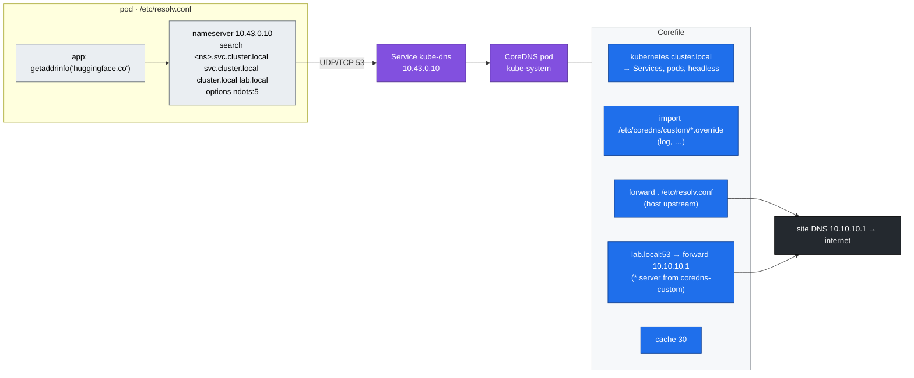

# Volume 08 — CoreDNS & Service Discovery: Records, the `ndots:5` Tax, Custom Zones, DNS Failures

> **Module 02 · Part II — Networking** · Prev: [07 kube-proxy](07-kube-proxy-and-cluster-ip-mechanics.md) · Next: [09 Ingress & Gateway API](09-ingress-controllers-and-gateway-api.md)

| | |
|---|---|
| **You will build** | A measured before/after of DNS query amplification for model downloads and external APIs, query logging through k3s's `coredns-custom` hook, a forward zone for `lab.local`, and a rehearsed cluster-wide DNS outage |
| **Hardware** | spark-01 |
| **Time** | 60 min |
| **Risk** | Low. The outage drill (`breakfix 07`) breaks name resolution for ~5 min |
| **Lab files** | [`manifests/30-networking/dns-lab.yaml`](lab/manifests/30-networking/dns-lab.yaml), [`coredns-custom.yaml`](lab/manifests/30-networking/coredns-custom.yaml), [`manifests/30-networking/echo-service.yaml`](lab/manifests/30-networking/echo-service.yaml) |

---

## 1. Why this matters on a Spark

Model servers resolve names constantly: `huggingface.co` and `cdn-lfs.hf.co` at startup, `nvcr.io` for pulls, `qdrant.llm-serving` on every RAG call, and the rendezvous host for torchrun. With the Kubernetes default `ndots:5`, any name with fewer than five dots is first tried against every search domain. **One lookup of `huggingface.co` costs 6–8 extra queries** (3–4 search domains × A + AAAA) before the real answer. On a busy gateway, that's most of CoreDNS's load, and every one of those queries is also a conntrack entry (Vol 07).

---

## 2. Architecture — HLD



---

## 3. LLD

### 3.1 Record types you'll use

| Query | Answer | Example |
|---|---|---|
| `svc.ns.svc.cluster.local` A | ClusterIP | `vllm.llm-serving.svc.cluster.local → 10.43.x.y` |
| headless `svc.ns.svc.cluster.local` A | every ready pod IP | `echo-headless.lab-tools… → 3 IPs` |
| `pod-hostname.subdomain.ns.svc.cluster.local` A | that pod | `ddp-0.ddp-workers.batch.svc.cluster.local` (Vol 17) |
| `qdrant-0.qdrant-headless.llm-serving.svc.cluster.local` | StatefulSet pod | Vol 10 |
| `_http._tcp.echo.lab-tools.svc.cluster.local` SRV | port + target | named ports |

### 3.2 Query amplification with `ndots:5`

For `huggingface.co` (1 dot < 5) from a pod in `tenant-alpha`:

| # | Name tried | Result |
|---|---|---|
| 1-2 | `huggingface.co.tenant-alpha.svc.cluster.local` A/AAAA | NXDOMAIN |
| 3-4 | `huggingface.co.svc.cluster.local` | NXDOMAIN |
| 5-6 | `huggingface.co.cluster.local` | NXDOMAIN |
| 7-8 | `huggingface.co.lab.local`, only if the host's resolv.conf has `search lab.local` | NXDOMAIN (forwarded upstream!) |
| 9-10 | `huggingface.co` | ✅ |

Three fixes, in order of preference:

| Fix | Where | Trade-off |
|---|---|---|
| Use FQDNs with a trailing dot: `huggingface.co.` | app config / env | zero cost. Some HTTP libraries mishandle the dot in `Host:` |
| `dnsConfig.options: ndots: "1"` | pod spec (as in `dns-ndots1`) | short in-cluster names (`qdrant`) still work via search. `qdrant.llm-serving` needs `.svc` |
| NodeLocal DNSCache | DaemonSet on every node | caches on the node, avoids conntrack for UDP. Worth it at DC scale |

### 3.3 k3s specifics

| Item | Value |
|---|---|
| Corefile | ConfigMap `kube-system/coredns` (managed by k3s, reset on restart). **Don't edit it.** |
| Your changes | ConfigMap `kube-system/coredns-custom`: keys `*.override` go *inside* the `.:53` block, keys `*.server` add blocks |
| Upstream | k3s points CoreDNS at `/run/systemd/resolve/resolv.conf` on Ubuntu, not `127.0.0.53` (which would loop) |
| Cluster DNS IP | `10.43.0.10` (`cluster-dns`) |

---

## 4. Integrations

- **01 Ansible site DNS (`dns_servers: [10.10.10.1, …]`)**: the `lab.local` forward zone lets pods resolve `spark-02.lab.local` and your NAS by name.
- **Model downloads (Vol 21, modules 03–06)**: set `HF_ENDPOINT`/`HF_HUB_*` and any registry mirrors as FQDNs.
- **Prometheus (Vol 16)**: CoreDNS exposes `coredns_dns_requests_total{type}` and `coredns_dns_responses_total{rcode}`. An NXDOMAIN ratio > 50 % is the ndots tax showing up in a graph.

---

## 5. Lab

### 5.1 Inspect a pod's resolver

```bash
cd "02 Kubernetes/lab"
kubectl apply -k manifests/30-networking
kubectl -n lab-tools exec dns-default -- cat /etc/resolv.conf
kubectl -n lab-tools exec dns-ndots1  -- cat /etc/resolv.conf
kubectl -n kube-system get cm coredns -o jsonpath='{.data.Corefile}'
```

### 5.2 Turn on query logging and add the `lab.local` zone

```bash
kubectl apply -f manifests/30-networking/coredns-custom.yaml
kubectl -n kube-system rollout restart deploy coredns && kubectl -n kube-system rollout status deploy coredns
kubectl -n kube-system logs deploy/coredns -f --tail=0 > /tmp/coredns.log &
```

### 5.3 Measure the amplification

```bash
for p in dns-default dns-ndots1; do
  : > /tmp/coredns.log; sleep 1
  kubectl -n lab-tools exec $p -- sh -c 'getent ahosts huggingface.co >/dev/null'
  sleep 2; echo "$p: $(grep -c 'huggingface' /tmp/coredns.log) queries"; grep huggingface /tmp/coredns.log | awk '{print $6, $7, $9}' | head -12
done
kill %1
```

Expected:

```text
dns-default: 10 queries        # 8 if your host has no 'search lab.local'
"AAAA IN huggingface.co.lab-tools.svc.cluster.local. NXDOMAIN
"A IN huggingface.co.lab-tools.svc.cluster.local. NXDOMAIN
…
"A IN huggingface.co. NOERROR
dns-ndots1: 2 queries
"A IN huggingface.co. NOERROR
"AAAA IN huggingface.co. NOERROR
```

Time it too:

```bash
for p in dns-default dns-ndots1; do
  kubectl -n lab-tools exec $p -- sh -c 'time (for i in $(seq 50); do getent ahosts huggingface.co >/dev/null; done)' 2>&1 | grep real | sed "s/^/$p /"
done
```

### 5.4 Service discovery records

```bash
kubectl -n lab-tools exec deploy/netshoot -- dig +short echo.lab-tools.svc.cluster.local
kubectl -n lab-tools exec deploy/netshoot -- dig +short echo-headless.lab-tools.svc.cluster.local
kubectl -n lab-tools exec deploy/netshoot -- dig +short SRV _http._tcp.echo.lab-tools.svc.cluster.local
kubectl -n lab-tools exec deploy/netshoot -- dig +short spark-02.lab.local       # via the lab.local forward zone
```

### 5.5 Outage drill

```bash
scripts/breakfix.sh inject 07
kubectl -n lab-tools exec deploy/netshoot -- curl -s -m3 http://echo.lab-tools || echo "name lookup failed"
kubectl -n lab-tools exec deploy/netshoot -- curl -s -m3 "http://$(kubectl -n lab-tools get svc echo -o jsonpath='{.spec.clusterIP}')"   # by IP → works
# diagnose and fix it yourself; then:
scripts/breakfix.sh answer 07
```

The key triage move: **try by IP**. If the IP works and the name doesn't, it's DNS, not networking.

Turn query logging off when you're done (it's chatty):

```bash
kubectl -n kube-system patch cm coredns-custom --type json -p '[{"op":"remove","path":"/data/log.override"}]'
kubectl -n kube-system rollout restart deploy coredns
```

---

## 6. Verify

| Check | Expected |
|---|---|
| `dns-default` query count for one external lookup | 8–10 |
| `dns-ndots1` query count | 2 |
| headless lookup | 3 A records |
| `coredns_dns_responses_total{rcode="NXDOMAIN"}` rate | drops after you apply `ndots: "1"` to hot clients |

---

## 7. Troubleshooting

| Symptom | Cause | Diagnose | Fix |
|---|---|---|---|
| `Could not resolve host`, everything by name fails | CoreDNS down / 0 replicas / NetworkPolicy blocks egress to kube-system | `kubectl -n kube-system get deploy coredns`. Try by IP | restore CoreDNS. Allow UDP/TCP 53 to `kube-system` in egress policies |
| CoreDNS `CrashLoopBackOff`, log `Loop … detected` | upstream is a local stub (127.0.0.53) forwarding back to itself | `kubectl -n kube-system logs deploy/coredns` | point k3s at the real resolv.conf (`resolv-conf: /run/systemd/resolve/resolv.conf`) |
| Intermittent `EAI_AGAIN` / 5 s stalls in Python | UDP conntrack race on parallel A+AAAA queries | `conntrack -S` `insert_failed` counter rises | `single-request-reopen` option (in `dns-ndots1`), NodeLocal DNSCache |
| Slow first request to HF/NGC, fast afterwards | ndots amplification + cold cache | §5.3 | trailing dots / `ndots:1` |
| `ddp-0.ddp-workers…` NXDOMAIN at job start | pod not Ready yet and Service lacks `publishNotReadyAddresses` | `dig` from another pod | set `publishNotReadyAddresses: true` on rendezvous Services (the lab's does) |
| Custom zone ignored | edited `coredns` instead of `coredns-custom` (k3s overwrote it) | compare ConfigMaps | use `coredns-custom` keys ending `.override` / `.server` |

---

## 8. Scale-out path

| Lab | Datacenter |
|---|---|
| 1 CoreDNS replica | ≥ 2 replicas with anti-affinity, HPA or cluster-proportional-autoscaler |
| query logging on demand | CoreDNS metrics + sampled logs to Loki |
| `ndots` per pod | NodeLocal DNSCache everywhere, plus an admission policy that sets `ndots:2` on serving namespaces |
| forward zone to site DNS | split-horizon DNS, ExternalDNS publishing Ingress hosts |

---

## 9. Checklist

- [ ] I measured how many queries one external lookup costs with `ndots:5`, and with `ndots:1`.
- [ ] I added a zone and query logging the k3s way, without editing the managed Corefile.
- [ ] I resolved a Service, a headless Service, an SRV record and a StatefulSet pod by name.
- [ ] I can tell a DNS outage from a network outage in one command.
