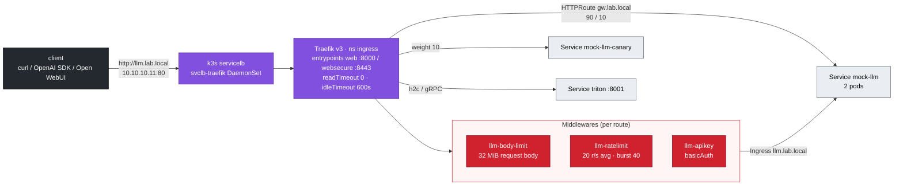
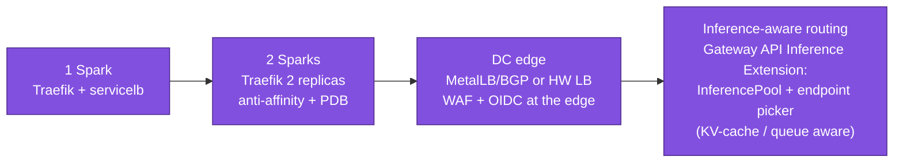

# Volume 09 — Ingress & Gateway API for LLM APIs: Streaming, Limits, Auth, Canaries, TLS, gRPC

> **Module 02 · Part II — Networking** · Prev: [08 CoreDNS](08-coredns-and-service-discovery.md) · Next: [10 Workload controllers](10-advanced-workload-controllers.md)

| | |
|---|---|
| **You will build** | Traefik v3 as both Ingress controller and Gateway API implementation in front of an OpenAI-compatible endpoint. You'll prove token streaming isn't buffered, add body-size limits, rate limits and API-key auth, run a 90/10 canary with an `HTTPRoute`, terminate TLS and route gRPC to Triton. The mock LLM makes all of it GPU-free |
| **Hardware** | spark-01 (servicelb binds :80/:443 on 10.10.10.11). Your laptop is the client |
| **Time** | 90 min |
| **Risk** | Low |
| **Lab files** | [`addons/traefik.yaml`](lab/addons/traefik.yaml), [`manifests/40-ingress/`](lab/manifests/40-ingress/) (`mock_llm.py`, `middlewares.yaml`, `ingress.yaml`, `gateway-routes.yaml`), [`breakfix/08`](lab/breakfix/08-selector-typo.yaml), [`breakfix/09`](lab/breakfix/09-buffered-stream.yaml) |

---

## 1. Why this matters on a Spark

LLM traffic breaks web-app assumptions:

| Web default | LLM reality | What breaks |
|---|---|---|
| responses in < 1 s | a long generation streams for minutes | proxy `readTimeout` 60 s cuts the stream (504) |
| small bodies | RAG prompts and base64 images run to megabytes | `413 Request Entity Too Large` |
| buffering responses is harmless | SSE tokens must flush one by one | the user waits 40 s then gets everything at once (drill 09) |
| round-robin per connection | clients keep connections alive | one replica hot, others idle (Vol 07) |

> **Controller choice.** k3s ships Traefik; the 01 Ansible lab disabled the bundled copy so this volume installs a pinned one. The community **ingress-nginx** controller has been retired (best-effort maintenance ended March 2026), so new platforms should use Gateway API implementations (Traefik, Envoy Gateway, Cilium, NGINX Gateway Fabric).

---

## 2. Architecture — HLD



### 2.1 Ingress vs Gateway API

| | Ingress | Gateway API |
|---|---|---|
| Roles | one object does everything | `GatewayClass` (infra) → `Gateway` (platform team) → `HTTPRoute` (app team) |
| Traffic split / canary | controller-specific annotations | `backendRefs[].weight`, portable |
| Timeouts | annotations | `rules[].timeouts.request` |
| gRPC | annotations / `appProtocol` | `GRPCRoute` |
| Cross-namespace | no | `ReferenceGrant` |
| Status | minimal | per-route `Accepted` / `ResolvedRefs` conditions: *debuggable* |

---

## 3. LLD

| Item | Value |
|---|---|
| Traefik chart / app | 34.4.1 / v3.3.x (`versions.env`) |
| Namespace | `ingress` |
| Entrypoints | `web` 8000→80, `websecure` 8443→443, `traefik` 8080 (dashboard, internal) |
| Transport timeouts | `readTimeout: 0s`, `writeTimeout: 0s`, `idleTimeout: 600s` on web and websecure |
| Gateway | `ingress/lab-gateway`, listener `web` :8000 HTTP, `namespacePolicy: All` |
| Hostnames | `llm.lab.local` (Ingress), `gw.lab.local` (HTTPRoute) → add both to your laptop's `/etc/hosts` as `10.10.10.11` |
| Metrics | ServiceMonitor `release: kps` → `traefik_service_*` (KEDA uses these in Vol 21) |
| Priority | platform (keep ingress alive under memory pressure) |

---

## 4. Integrations

- **NetworkPolicy (Vol 06)**: `llm-serving` admits the `ingress` namespace. Without that allow, you get 504s (drill 06).
- **KEDA (Vol 21)**: scales `mock-llm` on `traefik_service_open_connections`.
- **Vault (01 Ansible Vol 19)**: the `llm-api-users` htpasswd Secret and TLS keys belong in Vault KV, synced by Vault Agent or External Secrets.
- **Open WebUI / LiteLLM (modules 03, 04)**: point them at `http://llm.lab.local/v1`.

---

## 5. Lab

### 5.1 Install and check Traefik and the Gateway

```bash
cd "02 Kubernetes/lab"
scripts/install-addons.sh traefik
kubectl -n ingress get pods,svc
kubectl get gatewayclass,gateway -A
```

Expected: `svc/traefik-lab` `LoadBalancer` with `EXTERNAL-IP 10.10.10.11`. GatewayClass `traefik` `ACCEPTED True`. Gateway `lab-gateway` `PROGRAMMED True`.

### 5.2 Deploy the mock API behind Ingress and HTTPRoute

```bash
kubectl apply -k manifests/40-ingress
kubectl -n llm-serving get pods,ingress,httproute
kubectl -n llm-serving get httproute llm-gw -o jsonpath='{range .status.parents[0].conditions[*]}{.type}={.status} {end}{"\n"}'
echo "10.10.10.11 llm.lab.local gw.lab.local" | sudo tee -a /etc/hosts     # on your laptop
curl -s http://llm.lab.local/v1/models | jq
```

Expected: `Accepted=True ResolvedRefs=True`, and `{"object":"list","data":[{"id":"mock-llm",…}]}`.

### 5.3 Prove streaming isn't buffered

```bash
curl -sN -o /dev/null -w 'TTFB %{time_starttransfer}s  total %{time_total}s\n' \
  http://llm.lab.local/v1/chat/completions -d '{"stream":true,"max_tokens":100}'
curl -sN http://llm.lab.local/v1/chat/completions -d '{"stream":true,"max_tokens":8}' | ts '%.s'   # moreutils ts
```

Expected: **TTFB ≈ 0.05 s, total ≈ 5 s** (100 tokens at 20 tok/s), and timestamps 50 ms apart. Now the broken version:

```bash
scripts/breakfix.sh inject 09
echo "10.10.10.11 bf09.lab.local" | sudo tee -a /etc/hosts
curl -sN -o /dev/null -w 'TTFB %{time_starttransfer}s  total %{time_total}s\n' \
  http://bf09.lab.local/v1/chat/completions -d '{"stream":true,"max_tokens":100}'
scripts/breakfix.sh reset 09
```

Expected with the buffering middleware: **TTFB ≈ total ≈ 5 s**. TTFB equal to total is the signature of a buffering proxy.

### 5.4 Long generations don't time out

```bash
time curl -sN http://llm.lab.local/v1/chat/completions -d '{"stream":true,"max_tokens":2000}' | tail -1
```

2000 tokens at 20 tok/s = 100 s, past the old 60 s default. Expected: ends with `data: [DONE]`. Set `readTimeout: 60s` in `addons/traefik.yaml`, re-apply, and watch it fail at 60 s. That's the #1 support ticket for self-hosted LLM APIs.

### 5.5 Body limit and rate limit

```bash
head -c 40000000 /dev/zero | tr '\0' 'a' | jq -Rs '{messages:[{role:"user",content:.}]}' > /tmp/big.json
curl -s -o /dev/null -w '%{http_code}\n' http://llm.lab.local/v1/chat/completions --data-binary @/tmp/big.json   # 413

seq 200 | xargs -P50 -I{} curl -s -o /dev/null -w '%{http_code}\n' http://llm.lab.local/v1/models | sort | uniq -c
```

Expected: `413`, then a mix of `200` and `429`. Roughly the burst (40) plus 20/s get through, and the rest are rejected.

### 5.6 API-key auth (basicAuth as a simple key)

```bash
htpasswd -nbB team-alpha "$(openssl rand -hex 16 | tee /tmp/alpha.key)" > /tmp/users
kubectl -n llm-serving create secret generic llm-api-users --from-file=users=/tmp/users
kubectl -n llm-serving annotate ingress llm --overwrite \
  traefik.ingress.kubernetes.io/router.middlewares=llm-serving-llm-body-limit@kubernetescrd,llm-serving-llm-ratelimit@kubernetescrd,llm-serving-llm-apikey@kubernetescrd
curl -s -o /dev/null -w '%{http_code}\n' http://llm.lab.local/v1/models                               # 401
curl -s -u "team-alpha:$(cat /tmp/alpha.key)" http://llm.lab.local/v1/models | jq -r '.data[0].id'   # mock-llm
```

For OpenAI SDKs that only send `Authorization: Bearer`, use LiteLLM (module 03) or Traefik's ForwardAuth to an auth service. basicAuth here teaches the middleware chain.

### 5.7 Canary with Gateway API weights

```bash
for i in $(seq 200); do curl -s http://gw.lab.local/v1/models | jq -r '.data[0].id'; done | sort | uniq -c
```

Expected: ≈ `180 mock-llm` / `20 mock-llm-canary`. Promote by editing the weights in `gateway-routes.yaml` (90/10 → 50/50 → 0/100) and re-applying. Every step is a Git diff.

### 5.8 TLS

```bash
openssl req -x509 -newkey ec -pkeyopt ec_paramgen_curve:prime256v1 -nodes -days 365 \
  -subj "/CN=llm.lab.local" -addext "subjectAltName=DNS:llm.lab.local" -keyout /tmp/tls.key -out /tmp/tls.crt
kubectl -n llm-serving create secret tls llm-tls --cert=/tmp/tls.crt --key=/tmp/tls.key
kubectl -n llm-serving patch ingress llm --type merge -p '{"spec":{"tls":[{"hosts":["llm.lab.local"],"secretName":"llm-tls"}]}}'
kubectl -n llm-serving annotate ingress llm traefik.ingress.kubernetes.io/router.entrypoints=web,websecure --overwrite
curl -s --cacert /tmp/tls.crt https://llm.lab.local/v1/models | jq -r '.data[0].id'
```

In production, cert-manager issues and renews these (`scripts/install-addons.sh kserve` installs cert-manager).

### 5.9 gRPC to Triton (after Vol 22)

The Triton Service declares `appProtocol: kubernetes.io/h2c` on port 8001, so Traefik speaks cleartext HTTP/2 to it:

```yaml
apiVersion: gateway.networking.k8s.io/v1
kind: GRPCRoute
metadata: {name: triton, namespace: llm-serving}
spec:
  parentRefs: [{name: lab-gateway, namespace: ingress}]
  hostnames: ["triton.lab.local"]
  rules:
    - backendRefs: [{name: triton, port: 8001}]
```

(`GRPCRoute` is in the Gateway API standard channel since v1.1. The lab pins v1.2.1.)

---

## 6. Verify

```bash
scripts/verify.sh ingress
```

```text
── ingress
[PASS] Traefik LoadBalancer IP 10.10.10.11
[PASS] Ingress llm.lab.local/v1/models → 200
[PASS] SSE streaming through ingress (11 events)
[PASS] Gateway API HTTPRoute gw.lab.local → 200
```

---

## 7. Troubleshooting

| Symptom | Cause | Diagnose | Fix |
|---|---|---|---|
| `404 page not found` (Traefik) | no router matched: wrong Host header or ingressClass | `curl -v -H 'Host: …'`, Traefik dashboard `kubectl -n ingress port-forward deploy/traefik-lab 8080` → `/dashboard/` | fix host/path/`ingressClassName: traefik` |
| `503 no available server` | Service has no ready endpoints | `kubectl get endpointslices -l kubernetes.io/service-name=…` | drill 08: selector/port mismatch. Or readiness failing |
| `504 Gateway Timeout` after exactly N s | timeout on entrypoint, route or client | which N? 60 → Traefik `readTimeout`. 600 → HTTPRoute `timeouts.request`. Other → client | raise where it cuts |
| Stream arrives all at once | response buffering (middleware, compression, another proxy in front) | TTFB ≈ total (§5.3) | remove response buffering. Set `X-Accel-Buffering: no` for NGINX hops |
| `413` | body limit | Traefik access log | raise `maxRequestBodyBytes` deliberately |
| `429` for everyone | rate limit keyed on the servicelb/NAT IP, not the client | Traefik logs `ClientHost` | `ipStrategy.depth` / trust `X-Forwarded-For` from a known proxy |
| HTTPRoute `Accepted=False NotAllowedByListeners` | listener `namespacePolicy` excludes the route's namespace | `kubectl describe httproute` | `namespacePolicy: All` or `Selector` |
| gRPC `UNAVAILABLE: … protocol error` | proxy spoke HTTP/1.1 to the backend | Service port `appProtocol` | `kubernetes.io/h2c` |

---

## 8. Scale-out path



The **Gateway API Inference Extension** adds `InferencePool` / `InferenceModel` objects and an *endpoint picker* that chooses the model-server replica by queue depth and KV-cache hit (prefix affinity). It's the production answer to "round-robin is wrong for LLMs", and the natural next step after Vol 24.

---

## 9. Checklist

- [ ] I proved streaming isn't buffered by comparing TTFB and total time.
- [ ] A 100-second generation completes through the proxy.
- [ ] I can add body limits, rate limits and auth as middlewares without touching the app.
- [ ] I ran a weighted canary with an `HTTPRoute` and read its status conditions.
