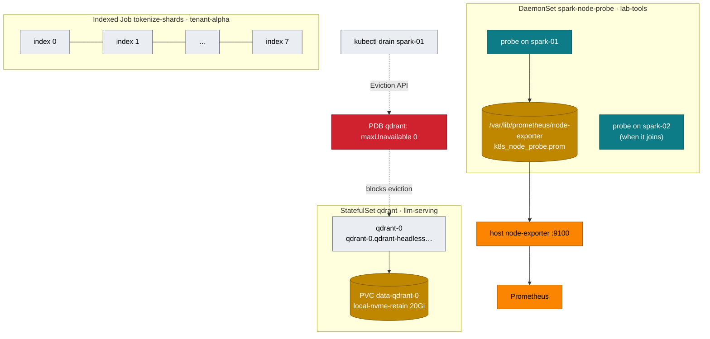

# Volume 10 — Workload Controllers for AI: StatefulSets, DaemonSets, Indexed Jobs & Disruption Budgets

> **Module 02 · Part III — Workloads, storage, tenancy** · Prev: [09 Ingress](09-ingress-controllers-and-gateway-api.md) · Next: [11 Storage & CSI](11-storage-csi-and-high-performance-volumes.md)

| | |
|---|---|
| **You will build** | A Qdrant vector database as a StatefulSet whose data survives pod deletion, a per-node GPU/UMA probe DaemonSet feeding Prometheus, a sharded tokenizer as an Indexed Job with per-shard retries and a corrupt-shard rehearsal, and PodDisruptionBudgets that make `kubectl drain` safe |
| **Hardware** | spark-01 |
| **Time** | 90 min |
| **Risk** | Low |
| **Lab files** | [`manifests/50-workloads/`](lab/manifests/50-workloads/) (`qdrant-statefulset.yaml`, `node-probe-daemonset.yaml`, `tokenizer-indexed-job.yaml`), [`breakfix/`](lab/breakfix/) scenario 11 |

---

## 1. Why this matters on a Spark

A Deployment assumes pods are interchangeable cattle. Much of an AI platform isn't:

| Need | Controller | Example on the Spark |
|---|---|---|
| stable name + own disk, ordered start | **StatefulSet** | Qdrant, Milvus, Redis, Postgres for LiteLLM, etcd for Ray |
| exactly one per node | **DaemonSet** | GPU probes, dcgm-exporter, log shippers, NCCL/RDMA device plugins |
| N pieces of finite work | **Job** / **Indexed Job** | tokenization, embedding a corpus, eval sweeps, checkpoint conversion |
| don't let maintenance kill the only copy | **PodDisruptionBudget** | 1-replica vector DB, 2-replica model server |

---

## 2. Architecture — HLD



---

## 3. LLD

### 3.1 Qdrant StatefulSet

| Field | Value | Why |
|---|---|---|
| `serviceName` | `qdrant-headless` (`publishNotReadyAddresses: true`) | stable DNS per pod. Peers must find each other before they're ready |
| image | `qdrant/qdrant:v1.13.4-unprivileged`, UID 1000 | runs non-root |
| `volumeClaimTemplates` | `data`, `local-nvme-retain`, 20 Gi | PVC `data-qdrant-0` follows the pod forever |
| `persistentVolumeClaimRetentionPolicy` | `Retain` on delete and on scale-down | deleting the StatefulSet never deletes vectors |
| `updateStrategy.rollingUpdate.partition` | 0 | raise it to canary a new version on the highest ordinal only |
| probes | `/readyz`, `/livez` | |
| PDB | `maxUnavailable: 0` | one replica = only copy. Drain must stop |

### 3.2 Node probe DaemonSet

| Field | Value |
|---|---|
| namespace | `lab-tools` (privileged PSA: hostPath) |
| `nodeSelector` | `nvidia.com/gpu.product: GB10` |
| tolerations | `operator: Exists` (runs on cordoned/tainted GPU nodes too) |
| GPU access | env `NVIDIA_VISIBLE_DEVICES=all`: *observe* without consuming a slice |
| output | `spark_probe_gpu_temp_celsius`, `spark_probe_mem_available_bytes` via the host textfile dir the 01 Ansible `gpu_telemetry` role created |
| priority | `spark-platform` |

### 3.3 Tokenizer Indexed Job

| Field | Value | Effect |
|---|---|---|
| `completions` / `parallelism` | 8 / 2 | 8 shards, 2 at a time (800m of tenant-alpha's 1 CPU) |
| `completionMode` | Indexed | `$JOB_COMPLETION_INDEX` = shard id |
| `backoffLimitPerIndex` | 2 | a flaky shard retries on its own |
| `maxFailedIndexes` | 1 | more than 1 bad shard → stop the whole job early |
| `podFailurePolicy` | exit 42 → `FailIndex` | corrupt input: don't waste retries |
| `ttlSecondsAfterFinished` | 3600 | garbage-collected an hour later |

---

## 4. Integrations

- **Storage (Vol 11)**: `local-nvme-retain` puts Qdrant's data at `/data/k8s/retain/llm-serving/data-qdrant-0` on the NVMe. Easy to back up, easy to find.
- **RAG (modules 03 and 04)**: their retrieval services use `http://qdrant.llm-serving:6333` from this StatefulSet.
- **Observability (Vol 16)**: the probe metrics appear next to the 01 Ansible `spark_gpu_*` metrics, and the Grafana dashboard uses both.
- **Kueue (Vol 05)**: the tokenizer job can be queued too. Add `kueue.x-k8s.io/queue-name` and move it to `batch`.

---

## 5. Lab

### 5.1 StatefulSet: identity and data survive the pod

```bash
cd "02 Kubernetes/lab"
scripts/install-addons.sh storage
kubectl apply -k manifests/50-workloads
kubectl -n llm-serving rollout status sts/qdrant
kubectl -n llm-serving get pod qdrant-0 -o wide; kubectl -n llm-serving get pvc
```

Write some vectors:

```bash
kubectl -n llm-serving port-forward svc/qdrant 6333 &
curl -s -X PUT localhost:6333/collections/spark -H 'Content-Type: application/json' \
  -d '{"vectors":{"size":4,"distance":"Cosine"}}' | jq .status
curl -s -X PUT 'localhost:6333/collections/spark/points?wait=true' -H 'Content-Type: application/json' -d '{"points":[
  {"id":1,"vector":[0.9,0.1,0.1,0.0],"payload":{"doc":"GB10 has 128 GB unified memory"}},
  {"id":2,"vector":[0.1,0.9,0.0,0.1],"payload":{"doc":"CX-7 links two Sparks at 200 GbE"}}]}' | jq .status
curl -s localhost:6333/collections/spark | jq '.result.points_count'
```

Kill the pod and check that the same identity and data come back:

```bash
kubectl -n llm-serving delete pod qdrant-0
kubectl -n llm-serving wait --for=condition=Ready pod/qdrant-0 --timeout=120s
kubectl -n llm-serving port-forward svc/qdrant 6333 & sleep 2
curl -s localhost:6333/collections/spark | jq '.result.points_count'        # 2
sudo ls /data/k8s/retain/llm-serving/data-qdrant-0/collections/             # on the Spark: spark
kill %1 %2 2>/dev/null
```

### 5.2 Canary a StatefulSet update with `partition`

With one replica, `partition: 1` means *no pod updates*. That's useful for staging a new image spec without rolling it:

```bash
kubectl -n llm-serving patch sts qdrant -p '{"spec":{"updateStrategy":{"rollingUpdate":{"partition":1}}}}'
kubectl -n llm-serving set image sts/qdrant qdrant=qdrant/qdrant:v1.13.5-unprivileged
kubectl -n llm-serving get pod qdrant-0 -o jsonpath='{.spec.containers[0].image}{"\n"}'   # still v1.13.4
kubectl -n llm-serving get sts qdrant -o jsonpath='{.status.currentRevision} → {.status.updateRevision}{"\n"}'
# roll back the staged change
kubectl -n llm-serving rollout undo sts/qdrant
kubectl -n llm-serving patch sts qdrant -p '{"spec":{"updateStrategy":{"rollingUpdate":{"partition":0}}}}'
```

With 3 replicas (3 nodes), `partition: 2` updates only `qdrant-2`. Watch it, then lower the partition step by step.

### 5.3 DaemonSet: one probe per GPU node

```bash
kubectl -n lab-tools get ds spark-node-probe
cat /var/lib/prometheus/node-exporter/k8s_node_probe.prom       # on the Spark
curl -s localhost:9100/metrics | grep spark_probe_               # host node-exporter picked it up
```

```text
spark_probe_gpu_temp_celsius{node="spark-01"} 41
spark_probe_mem_available_bytes{node="spark-01"} 9.87e+10
```

Cordon the node and confirm the probe keeps running (it tolerates everything):

```bash
kubectl cordon spark-01; kubectl -n lab-tools rollout restart ds spark-node-probe
kubectl -n lab-tools get pods -l app=spark-node-probe; kubectl uncordon spark-01
```

### 5.4 Indexed Job: shards, per-index retries, corrupt input

```bash
kubectl apply -f manifests/50-workloads/tokenizer-indexed-job.yaml
kubectl -n tenant-alpha get pods -l job-name=tokenize-shards -w          # 2 at a time
kubectl -n tenant-alpha get job tokenize-shards -o jsonpath='{.status.completedIndexes}{"\n"}'   # 0-7
kubectl -n tenant-alpha delete job tokenize-shards
```

Rehearse a corrupt shard:

```bash
kubectl apply -f manifests/50-workloads/tokenizer-indexed-job.yaml --dry-run=client -o json \
 | jq '.spec.template.spec.containers[0].env[0].value="3"' | kubectl apply -f -
kubectl -n tenant-alpha wait --for=condition=Failed job/tokenize-shards --timeout=5m
kubectl -n tenant-alpha get job tokenize-shards -o jsonpath='completed={.status.completedIndexes} failed={.status.failedIndexes}{"\n"}'
kubectl -n tenant-alpha get pods -l job-name=tokenize-shards,batch.kubernetes.io/job-completion-index=3
```

Expected:

```text
completed=0-2,4-7 failed=3
tokenize-shards-3-…   0/1   Error   0   …        ← exactly one pod: FailIndex skipped the retries
```

Re-run *only* shard 3 after fixing the data. Launch a Job with `completions: 8` and a `JOB_COMPLETION_INDEX`-aware skip list, or a one-off pod with `JOB_COMPLETION_INDEX=3`.

### 5.5 PDBs and drain

```bash
kubectl get pdb -A
kubectl drain spark-01 --ignore-daemonsets --delete-emptydir-data --dry-run=server 2>&1 | tail -5
```

Expected:

```text
evicting pod llm-serving/qdrant-0 (dry run)
error when evicting pods/"qdrant-0" -n "llm-serving" (will retry after 5s): Cannot evict pod as it would violate the pod's disruption budget.
```

This is working as designed. It's also `breakfix 11`. The runbook for planned maintenance on a single-replica store: **snapshot → scale to 0 (or delete the PDB) → drain → maintain → uncordon → restore**:

```bash
curl -s -X POST localhost:6333/collections/spark/snapshots | jq -r .result.name    # via port-forward
kubectl -n llm-serving scale sts qdrant --replicas=0
kubectl drain spark-01 --ignore-daemonsets --delete-emptydir-data     # really, on maintenance day
```

The 01 Ansible `node_drain` role (`playbooks/21-emergency-drain.yml`) automates the full cordon → capture → stop → reboot → validate → return sequence.

---

## 6. Verify

| Check | Expected |
|---|---|
| `points_count` after deleting `qdrant-0` | 2 |
| DaemonSet `DESIRED = READY` | 1 (2 with spark-02) |
| `completedIndexes` of a clean run | `0-7` |
| corrupt-shard run | `failedIndexes: 3`, one pod for index 3 |
| drain dry-run | blocked by `qdrant` PDB |

---

## 7. Troubleshooting

| Symptom | Cause | Diagnose | Fix |
|---|---|---|---|
| StatefulSet stuck at `qdrant-0` Pending | PVC can't bind (StorageClass missing or node-affinity of an old PV) | `kubectl describe pvc data-qdrant-0` | create the SC (`install-addons.sh storage`). Delete a stale PV only if you mean to lose data |
| Rolling update stuck on the highest ordinal | new pod never Ready (bad image/config), and OrderedReady waits forever | `kubectl rollout status sts/…`, pod events | fix the spec, then **delete the stuck pod** (StatefulSets don't auto-replace a broken new revision) |
| Data "lost" after `kubectl delete sts` | you also deleted PVCs, or reclaimPolicy was Delete | `kubectl get pv` | use `local-nvme-retain` + retention policy Retain (as in the lab) |
| DaemonSet `DESIRED 0` | nodeSelector label missing (GFD not running) | `kubectl get nodes -L nvidia.com/gpu.product` | fix labels / GPU Operator |
| Job `BackoffLimitExceeded` | one bad shard exhausted a job-wide `backoffLimit` | `kubectl describe job` | `backoffLimitPerIndex` + `podFailurePolicy` |
| Drain hangs forever | PDB `ALLOWED DISRUPTIONS 0` | `kubectl get pdb -A` | follow the maintenance runbook. `--disable-eviction` bypasses PDBs, and you then own the outage |

---

## 8. Scale-out path

| Lab | Production |
|---|---|
| Qdrant ×1, `maxUnavailable: 0` | Qdrant ×3 with replication factor 2, `maxUnavailable: 1`, anti-affinity across nodes/racks, scheduled snapshots to S3 |
| node probe DaemonSet | dcgm-exporter + node-feature-discovery + NVIDIA health checks (GPU Operator), NPD (node-problem-detector) |
| Indexed Job on one node | JobSet / Kueue with many nodes. Ray Data or Spark for truly large corpora (module 05 NeMo Curator) |

---

## 9. Checklist

- [ ] I killed `qdrant-0` and got the same name, the same PVC and the same vectors back.
- [ ] I staged a StatefulSet update with `partition` without restarting anything.
- [ ] My DaemonSet runs on cordoned nodes and feeds Prometheus through the host textfile collector.
- [ ] I rehearsed a corrupt shard and saw `FailIndex` skip pointless retries.
- [ ] I know the maintenance runbook for a single-replica stateful service.
