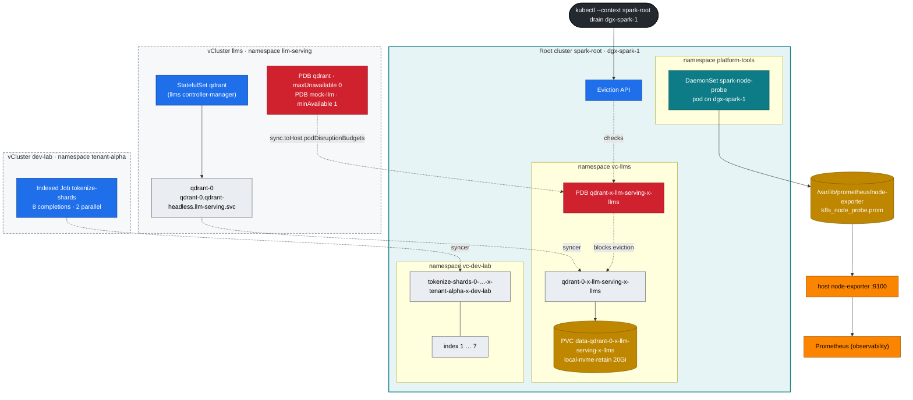

# Volume 10 — Workload Controllers for AI: StatefulSets, DaemonSets, Indexed Jobs & Disruption Budgets

> **Module 02 · Part III — Workloads, storage, tenancy** · Prev: [09 Ingress](09-ingress-controllers-and-gateway-api.md) · Next: [11 Storage & CSI](11-storage-csi-and-high-performance-volumes.md) · The lab's shape: [27 Nested clusters](27-nested-clusters-with-vcluster.md)

| | |
|---|---|
| **You will build** | A Qdrant vector database as a StatefulSet whose data survives pod deletion, a per-node GPU/UMA probe DaemonSet feeding Prometheus, a sharded tokenizer as an Indexed Job with per-shard retries and a corrupt-shard rehearsal, and PodDisruptionBudgets — written inside a vCluster — that make a root `kubectl drain` safe |
| **Hardware** | dgx-spark-1 |
| **Time** | 90 min |
| **Risk** | Low. §5.5 drains only with `--dry-run=server`; a real drain of the only node stops all three clusters' workloads |
| **Clusters** | `llms` (Qdrant + PDBs), `dev-lab` (tokenizer Job), `spark-root` (node probe, the drain, and where every pod really runs) |
| **Lab files** | [`manifests/llms/50-workloads/qdrant-statefulset.yaml`](lab/manifests/llms/50-workloads/qdrant-statefulset.yaml), [`manifests/root/50-workloads/node-probe-daemonset.yaml`](lab/manifests/root/50-workloads/node-probe-daemonset.yaml), [`manifests/dev-lab/50-workloads/tokenizer-indexed-job.yaml`](lab/manifests/dev-lab/50-workloads/tokenizer-indexed-job.yaml), [`vclusters/llms.yaml`](lab/vclusters/llms.yaml) (`sync.toHost.podDisruptionBudgets`), `scripts/breakfix.sh` scenario 11 |

---

## 1. Why this matters on a Spark

A Deployment assumes pods are interchangeable cattle. Much of an AI platform isn't:

| Need | Controller | Example on the Spark |
|---|---|---|
| stable name + own disk, ordered start | **StatefulSet** | Qdrant, Milvus, Redis, Postgres for LiteLLM, etcd for Ray — and each vCluster's own control plane (`llms-0`, `dev-lab-0`) |
| exactly one per node | **DaemonSet** | GPU probes, dcgm-exporter, log shippers, Cilium, NCCL/RDMA device plugins |
| N pieces of finite work | **Job** / **Indexed Job** | tokenization, embedding a corpus, eval sweeps, checkpoint conversion |
| don't let maintenance kill the only copy | **PodDisruptionBudget** | 1-replica vector DB, 2-replica model server |

### 1.1 Which cluster runs which controller

The nesting changes *where* each controller lives, and that's worth getting straight before the lab:

| Object | Its controller runs in | What reaches the root |
|---|---|---|
| StatefulSet `qdrant` (llms) | llms's controller-manager | the pod `qdrant-0` and the PVC `data-qdrant-0`, renamed (§3.4) |
| Indexed Job `tokenize-shards` (dev-lab) | dev-lab's controller-manager | one pod per running index |
| DaemonSet `spark-node-probe` | the **root's** controller-manager | — (it is a root object) |
| PDBs `qdrant`, `mock-llm` (llms) | written in llms, **synced to the root** | translated PDBs in `vc-llms`, enforced by the root's Eviction API |

StatefulSets, Jobs and DaemonSets are *not* synced: only their pods go down. A PDB is different, because the thing that respects it — the Eviction API that `kubectl drain` calls — belongs to the cluster that owns the node. That's the root. So the PDB has to be there too.

---

## 2. Architecture — HLD



---

## 3. LLD

### 3.1 Qdrant StatefulSet (inside llms)

| Field | Value | Why |
|---|---|---|
| namespace | `llm-serving` in vCluster `llms` | counts against `serving-budget` (2500m · 36 Gi · 400 Gi) and the root `vcluster-budget` on `vc-llms` |
| `serviceName` | `qdrant-headless` (`publishNotReadyAddresses: true`) | stable DNS per pod, answered by **llms's own CoreDNS**. Peers must find each other before they're ready |
| image | `qdrant/qdrant:v1.13.4-unprivileged`, UID 1000 | runs non-root; passes PSA `baseline` (llm-serving) and the root's `privileged` on `vc-llms` |
| resources | requests 250m · 1 Gi, limit 2 Gi | Burstable; the memory limit is what the root quota counts |
| `volumeClaimTemplates` | `data`, `local-nvme-retain`, 20 Gi | PVC `data-qdrant-0` follows the pod forever |
| `persistentVolumeClaimRetentionPolicy` | `Retain` on delete and on scale-down | deleting the StatefulSet never deletes vectors |
| `updateStrategy.rollingUpdate.partition` | 0 | raise it to canary a new version on the highest ordinal only |
| probes | `/readyz`, `/livez` | |
| PDB `qdrant` | `maxUnavailable: 0` | one replica = only copy. Drain must stop |
| PDB `mock-llm` | `minAvailable: 1` | the 2-replica mock API (Vol 09) keeps one pod through a drain |

### 3.2 Node probe DaemonSet (root)

| Field | Value |
|---|---|
| namespace | `platform-tools` on the **root** (PSA `privileged`: hostPath). `vc-dev-lab` enforces `baseline`, which forbids hostPath, so node-level tools can't live in a vCluster here |
| `nodeSelector` | `spark.lab/gpu: gb10` (set by the 01 Ansible `kubeadm_cluster` role's kubelet node labels; lab-owned, so GFD's `-SHARED` renaming can't break it) |
| tolerations | `operator: Exists` (runs on cordoned/tainted GPU nodes too) |
| GPU access | env `NVIDIA_VISIBLE_DEVICES=all`: *observe* without consuming one of the 15 slices — it works because containerd's default runtime is `nvidia` (Vol 14 §3) |
| output | `spark_probe_gpu_temp_celsius`, `spark_probe_mem_available_bytes` into the host textfile dir the 01 Ansible `gpu_telemetry` role created |
| priority | `spark-platform` |
| resources | 10m · 16 Mi request, 64 Mi limit |

### 3.3 Tokenizer Indexed Job (inside dev-lab)

| Field | Value | Effect |
|---|---|---|
| namespace | `tenant-alpha` in vCluster `dev-lab` | quota `tenant-budget`: 500m CPU (requests *and* limits), 2 Gi |
| `completions` / `parallelism` | 8 / 2 | 8 shards, 2 at a time: 2 × 200m = 400m of tenant-alpha's 500m. A third would not fit (§5.4) |
| `completionMode` | Indexed | `$JOB_COMPLETION_INDEX` = shard id |
| `backoffLimitPerIndex` | 2 | a flaky shard retries on its own |
| `maxFailedIndexes` | 1 | more than 1 bad shard → stop the whole job early |
| `podFailurePolicy` | exit 42 → `FailIndex` | corrupt input: don't waste retries |
| `ttlSecondsAfterFinished` | 3600 | garbage-collected an hour later — by dev-lab's TTL controller |

### 3.4 Names on both sides

| Inside the vCluster | On the root (`kubectl --context spark-root`) |
|---|---|
| `llms` · `llm-serving/qdrant-0` | `vc-llms/qdrant-0-x-llm-serving-x-llms` |
| `llms` · PVC `llm-serving/data-qdrant-0` | PVC `vc-llms/data-qdrant-0-x-llm-serving-x-llms` → PV with hostPath `/data/k8s/retain/vc-llms/data-qdrant-0-x-llm-serving-x-llms` |
| `llms` · PDB `llm-serving/qdrant` | PDB `vc-llms/qdrant-x-llm-serving-x-llms` |
| `llms` · StatefulSet `qdrant` | *nothing* — `kubectl --context spark-root -n vc-llms get sts` shows only `llms` (the vCluster's own control plane) |
| `dev-lab` · Job `tenant-alpha/tokenize-shards` | *nothing* — only its pods, in `vc-dev-lab` |

Long names are shortened with a hash, so find a host copy through the annotations `vcluster.loft.sh/object-name` and `vcluster.loft.sh/object-namespace` (that's what `scripts/lib.sh` `host_pod` does) rather than by building the string.

---

## 4. Integrations

- **Storage (Vol 11)**: `local-nvme-retain` comes from the root (synced into llms with `sync.fromHost.storageClasses`). Qdrant's data ends up at `/data/k8s/retain/vc-llms/data-qdrant-0-x-llm-serving-x-llms` on the NVMe — the path uses the *root* namespace and PVC name, because the root's provisioner is the one that created it.
- **RAG (modules 03 and 04)**: their retrieval services use `http://qdrant.llm-serving:6333` — a name that only resolves inside llms. From dev-lab the root's Cilium `vcluster-boundary` policy drops the connection anyway.
- **Observability (Vol 16)**: the probe metrics appear next to the 01 Ansible `spark_gpu_*` metrics (scraped through `observability/spark-host-exporters`), and the Grafana dashboard uses both.
- **Kueue (Vol 05)**: the tokenizer job can be queued too — in llms, not dev-lab (Kueue is installed only there). Add `kueue.x-k8s.io/queue-name: train` and move it to `batch`.
- **01 Ansible**: `playbooks/21-emergency-drain.yml` (role `node_drain`) automates cordon → capture → stop → reboot → validate → return for a root node.

---

## 5. Lab

All commands run from `02 Kubernetes/lab` with `KUBECONFIG` set to the lab file:

```bash
cd "02 Kubernetes/lab"
export KUBECONFIG="$PWD/../../01 Ansible/lab/.cache/kubeconfig-spark-lab.yaml"
scripts/install-addons.sh storage          # once: local-path + local-nvme classes on the root
kubectl --context llms get sc              # the root's classes, seen from inside llms
```

### 5.1 StatefulSet: identity and data survive the pod

```bash
kubectl --context llms apply -k manifests/llms/00-platform
kubectl --context llms apply -k manifests/llms/10-tenancy
kubectl --context llms apply -k manifests/llms/50-workloads
kubectl --context llms -n llm-serving rollout status sts/qdrant
kubectl --context llms -n llm-serving get pod qdrant-0 -o wide
kubectl --context llms -n llm-serving get pvc
```

Now look at the same thing from the root:

```bash
kubectl --context spark-root -n vc-llms get sts                       # only 'llms' — qdrant's controller isn't here
kubectl --context spark-root -n vc-llms get pods,pvc | grep qdrant
kubectl --context spark-root -n vc-llms get pod qdrant-0-x-llm-serving-x-llms \
  -o jsonpath='{.metadata.annotations.vcluster\.loft\.sh/object-name}{"  "}{.status.podIP}{"\n"}'
```

Expected: `qdrant-0` and the same pod IP you saw in llms. The pod IP and the node are real; the name is a translation.

Write some vectors (port-forward goes through llms's API server to the root pod):

```bash
kubectl --context llms -n llm-serving port-forward svc/qdrant 6333 &
sleep 2
curl -s -X PUT localhost:6333/collections/spark -H 'Content-Type: application/json' \
  -d '{"vectors":{"size":4,"distance":"Cosine"}}' | jq .status
curl -s -X PUT 'localhost:6333/collections/spark/points?wait=true' -H 'Content-Type: application/json' -d '{"points":[
  {"id":1,"vector":[0.9,0.1,0.1,0.0],"payload":{"doc":"GB10 shares one unified memory pool between CPU and GPU"}},
  {"id":2,"vector":[0.1,0.9,0.0,0.1],"payload":{"doc":"CX-7 links two Sparks at 200 GbE"}}]}' | jq .status
curl -s localhost:6333/collections/spark | jq '.result.points_count'
kill %1
```

Kill the pod and check that the same identity and data come back:

```bash
kubectl --context llms -n llm-serving delete pod qdrant-0
kubectl --context llms -n llm-serving wait --for=condition=Ready pod/qdrant-0 --timeout=120s
kubectl --context llms -n llm-serving port-forward svc/qdrant 6333 & sleep 2
curl -s localhost:6333/collections/spark | jq '.result.points_count'        # 2
kill %1
sudo ls /data/k8s/retain/vc-llms/data-qdrant-0-x-llm-serving-x-llms/collections/   # on the Spark: spark
```

Who recreated `qdrant-0`? llms's StatefulSet controller, which saw its pod disappear. The root never knew a StatefulSet was involved — it just got a new pod from the syncer, with the same name and the same PVC, and the root scheduler put it back on dgx-spark-1 because that's where the local PV lives.

### 5.2 Canary a StatefulSet update with `partition`

With one replica, `partition: 1` means *no pod updates*. That's useful for staging a new image spec without rolling it:

```bash
kubectl --context llms -n llm-serving patch sts qdrant -p '{"spec":{"updateStrategy":{"rollingUpdate":{"partition":1}}}}'
kubectl --context llms -n llm-serving set image sts/qdrant qdrant=qdrant/qdrant:v1.13.5-unprivileged
kubectl --context llms -n llm-serving get pod qdrant-0 -o jsonpath='{.spec.containers[0].image}{"\n"}'   # still v1.13.4
kubectl --context llms -n llm-serving get sts qdrant -o jsonpath='{.status.currentRevision} → {.status.updateRevision}{"\n"}'
# roll back the staged change
kubectl --context llms -n llm-serving rollout undo sts/qdrant
kubectl --context llms -n llm-serving patch sts qdrant -p '{"spec":{"updateStrategy":{"rollingUpdate":{"partition":0}}}}'
```

The ControllerRevisions behind `currentRevision`/`updateRevision` live in llms's SQLite, not in the root's etcd: `kubectl --context spark-root -n vc-llms get controllerrevisions` shows only the vCluster's own. With 3 replicas (3 nodes), `partition: 2` updates only `qdrant-2`. Watch it, then lower the partition step by step.

### 5.3 DaemonSet: one probe per GPU node (root)

```bash
kubectl --context spark-root apply -k manifests/root/00-platform
kubectl --context spark-root apply -k manifests/root/50-workloads
kubectl --context spark-root -n platform-tools get ds spark-node-probe
cat /var/lib/prometheus/node-exporter/k8s_node_probe.prom       # on the Spark
curl -s localhost:9100/metrics | grep spark_probe_               # host node-exporter picked it up
```

```text
spark_probe_gpu_temp_celsius{node="dgx-spark-1"} 41
spark_probe_mem_available_bytes{node="dgx-spark-1"} 9.87e+10
```

`DESIRED` is the number of nodes labelled `spark.lab/gpu=gb10` — 1 now, 2 when dgx-spark-2 joins as a root worker. Both vClusters see the same nodes (`sync.fromHost.nodes`), so a DaemonSet written *inside* a vCluster would also get one pod per node; the reason this one lives on the root is the hostPath it needs, not the node count.

Cordon the node and confirm the probe keeps running (it tolerates everything). On a one-node lab, a cordon stops new pods in **all three clusters**, so uncordon straight away:

```bash
kubectl --context spark-root cordon dgx-spark-1
kubectl --context spark-root -n platform-tools rollout restart ds spark-node-probe
kubectl --context spark-root -n platform-tools rollout status ds spark-node-probe --timeout=60s
kubectl --context spark-root -n platform-tools get pods -l app=spark-node-probe
kubectl --context spark-root uncordon dgx-spark-1
```

The DaemonSet pod comes back on a cordoned node because the DaemonSet controller adds a toleration for `node.kubernetes.io/unschedulable` to every pod it creates, and `operator: Exists` covers any other taint.

### 5.4 Indexed Job: shards, per-index retries, corrupt input (dev-lab)

```bash
kubectl --context dev-lab apply -k manifests/dev-lab/00-platform
kubectl --context dev-lab apply -k manifests/dev-lab/10-tenancy
kubectl --context dev-lab apply -f manifests/dev-lab/50-workloads/tokenizer-indexed-job.yaml
kubectl --context dev-lab -n tenant-alpha get pods -l job-name=tokenize-shards -w          # 2 at a time
```

While it runs, push it past the tenant budget — parallelism is mutable on a running Job:

```bash
kubectl --context dev-lab -n tenant-alpha patch job tokenize-shards --type merge -p '{"spec":{"parallelism":3}}'
kubectl --context dev-lab -n tenant-alpha get events --field-selector involvedObject.kind=Job | grep -i quota | tail -2
```

Expected: `FailedCreate … exceeded quota: tenant-budget, requested: limits.cpu=200m,requests.cpu=200m, used: limits.cpu=400m,requests.cpu=400m, limited: limits.cpu=500m,requests.cpu=500m`. The refusal comes from **dev-lab's own API server**: the third pod never exists anywhere, so the root sees nothing. The Job keeps running at 2 and retries the third pod as shards finish.

```bash
kubectl --context dev-lab -n tenant-alpha wait --for=condition=Complete job/tokenize-shards --timeout=5m
kubectl --context dev-lab -n tenant-alpha get job tokenize-shards -o jsonpath='{.status.completedIndexes}{"\n"}'   # 0-7
kubectl --context spark-root -n vc-dev-lab get pods | grep tokenize-shards       # the finished host copies
kubectl --context dev-lab -n tenant-alpha delete job tokenize-shards
```

Rehearse a corrupt shard:

```bash
kubectl --context dev-lab apply -f manifests/dev-lab/50-workloads/tokenizer-indexed-job.yaml --dry-run=client -o json \
 | jq '.spec.template.spec.containers[0].env[0].value="3"' | kubectl --context dev-lab apply -f -
kubectl --context dev-lab -n tenant-alpha wait --for=condition=Failed job/tokenize-shards --timeout=5m
kubectl --context dev-lab -n tenant-alpha get job tokenize-shards -o jsonpath='completed={.status.completedIndexes} failed={.status.failedIndexes}{"\n"}'
kubectl --context dev-lab -n tenant-alpha get pods -l job-name=tokenize-shards,batch.kubernetes.io/job-completion-index=3
```

Expected:

```text
completed=0-2,4-7 failed=3
tokenize-shards-3-…   0/1   Error   0   …        ← exactly one pod: FailIndex skipped the retries
```

The job is marked `Failed` only after the remaining indexes have finished (one failed index is within `maxFailedIndexes: 1`), so the `wait` can take a minute. Re-run *only* shard 3 after fixing the data: launch a Job with `completions: 8` and a `JOB_COMPLETION_INDEX`-aware skip list, or a one-off pod with `JOB_COMPLETION_INDEX=3`. Clean up with `kubectl --context dev-lab -n tenant-alpha delete job tokenize-shards`.

### 5.5 PDBs and drain — across the nesting

The PDBs were written in llms. Find them on the root:

```bash
kubectl --context llms -n llm-serving get pdb
kubectl --context spark-root get pdb -A
```

Expected on the root, among any platform PDBs:

```text
NAMESPACE   NAME                             MIN AVAILABLE   MAX UNAVAILABLE   ALLOWED DISRUPTIONS
vc-llms     mock-llm-x-llm-serving-x-llms    1               N/A               1
vc-llms     qdrant-x-llm-serving-x-llms      N/A             0                 0
```

(`mock-llm` appears once Vol 09's `llms/40-ingress` is applied.) The syncer copied them because [`vclusters/llms.yaml`](lab/vclusters/llms.yaml) sets `sync.toHost.podDisruptionBudgets.enabled: true`, and rewrote their selectors to match the host copies of the pods. Now ask the root what a drain would do:

```bash
scripts/breakfix.sh inject 11          # (re)applies llms/50-workloads and prints the drain command
kubectl --context spark-root drain dgx-spark-1 --ignore-daemonsets --delete-emptydir-data --dry-run=server 2>&1 | grep -E 'qdrant|llms-0|dev-lab-0|disruption'
```

Expected:

```text
evicting pod vc-llms/qdrant-0-x-llm-serving-x-llms (server dry run)
error when evicting pods/"qdrant-0-x-llm-serving-x-llms" -n "vc-llms" (will retry after 5s): Cannot evict pod as it would violate the pod's disruption budget.
evicting pod vc-llms/llms-0 (server dry run)
evicting pod vc-dev-lab/dev-lab-0 (server dry run)
```

Three things to read out of that:

1. **The block is correct.** One replica, `maxUnavailable: 0` → zero allowed disruptions. Without PDB sync the root would have no idea the pod mattered and would evict a tenant's only copy of its data. That's exactly why the sync is switched on.
2. **The vCluster control planes are evictable.** `llms-0` and `dev-lab-0` are ordinary StatefulSet pods on the root. A real drain takes both tenant API servers down; tenant pods that are already running are root pods and live on until they are evicted too. The root's own control plane is different: static pods are mirror pods, which `drain` skips.
3. **One node is every cluster's only node.** Draining dgx-spark-1 for real is a full outage of all three clusters. With dgx-spark-2 joined, the same drain moves pods instead of stopping them, and the PDBs decide the pace.

`scripts/breakfix.sh hint 11` / `answer 11` walk the same diagnosis. The runbook for planned maintenance on a single-replica store: **snapshot → scale to 0 (or delete the PDB) → drain → maintain → uncordon → restore**:

```bash
kubectl --context llms -n llm-serving port-forward svc/qdrant 6333 & sleep 2
curl -s -X POST localhost:6333/collections/spark/snapshots | jq -r .result.name
kill %1
kubectl --context llms -n llm-serving scale sts qdrant --replicas=0
kubectl --context spark-root drain dgx-spark-1 --ignore-daemonsets --delete-emptydir-data     # really, on maintenance day
# … maintain, reboot …
kubectl --context spark-root uncordon dgx-spark-1
kubectl --context llms -n llm-serving scale sts qdrant --replicas=1
```

Note who does what: the *tenant* (llms admin) scales Qdrant; the *platform* (root admin) drains. In a real organisation that's two teams, and the PDB is their contract. The snapshot lands in the pod's `emptyDir` at `/qdrant/snapshots`, so copy it out (`kubectl --context llms -n llm-serving cp`) before you scale to 0.

---

## 6. Verify

| Check | Expected |
|---|---|
| `points_count` after deleting `qdrant-0` | 2 |
| `kubectl --context spark-root -n vc-llms get sts` | only `llms` |
| DaemonSet `DESIRED = READY` | 1 (2 with dgx-spark-2) |
| tokenizer at `parallelism: 3` | `FailedCreate … exceeded quota: tenant-budget` in dev-lab, still 2 pods running |
| `completedIndexes` of a clean run | `0-7` |
| corrupt-shard run | `failedIndexes: 3`, one pod for index 3 |
| `kubectl --context spark-root get pdb -A` | `qdrant-x-llm-serving-x-llms` in `vc-llms` |
| drain dry-run | blocked by that PDB |

---

## 7. Troubleshooting

| Symptom | Cause | Diagnose | Fix |
|---|---|---|---|
| StatefulSet stuck at `qdrant-0` Pending | PVC can't bind (StorageClass missing on the root, or node-affinity of an old PV) | `kubectl --context llms -n llm-serving describe pvc data-qdrant-0` (events copied from the root PVC) | `scripts/install-addons.sh storage`. Delete a stale PV on the root only if you mean to lose data |
| `qdrant-0` Pending in llms with a sync error, no scheduler events | root quota on `vc-llms` spent (memory or `requests.storage`) | `kubectl --context spark-root -n vc-llms describe resourcequota vcluster-budget` | free capacity in llms or resize the vCluster (Vol 27 §6.5) |
| Rolling update stuck on the highest ordinal | new pod never Ready (bad image/config), and OrderedReady waits forever | `kubectl --context llms -n llm-serving rollout status sts/qdrant`, pod events | fix the spec, then **delete the stuck pod** (StatefulSets don't auto-replace a broken new revision) |
| Data "lost" after `kubectl delete sts` | you also deleted PVCs, or reclaimPolicy was Delete | `kubectl --context spark-root get pv \| grep qdrant` | use `local-nvme-retain` + retention policy Retain (as in the lab) |
| DaemonSet `DESIRED 0` | nodeSelector label missing (node joined without the role's kubelet labels) | `kubectl --context spark-root get nodes -L spark.lab/gpu` | re-run `05-kubernetes.yml`, or `kubectl --context spark-root label node dgx-spark-1 spark.lab/gpu=gb10` |
| DaemonSet pod rejected by PSA | applied into a `baseline` namespace (e.g. a vCluster) | the `FailedCreate` event names `hostPath` | node-level tools go in root `platform-tools` |
| Job creates fewer pods than `parallelism` | tenant quota inside dev-lab | `kubectl --context dev-lab -n tenant-alpha get events` → `exceeded quota: tenant-budget` | lower parallelism or requests; the quota is the platform team's (dev-lab/10-tenancy) |
| Job `BackoffLimitExceeded` | one bad shard exhausted a job-wide `backoffLimit` | `kubectl --context dev-lab -n tenant-alpha describe job tokenize-shards` | `backoffLimitPerIndex` + `podFailurePolicy` |
| Root drain ignores a tenant PDB | PDB sync off in that vCluster's values | `kubectl --context spark-root -n vc-<name> get pdb` is empty | `sync.toHost.podDisruptionBudgets.enabled: true`, `helm upgrade` |
| Drain hangs forever | PDB `ALLOWED DISRUPTIONS 0` | `kubectl --context spark-root get pdb -A` | follow the maintenance runbook. `--disable-eviction` bypasses PDBs, and you then own the outage |

---

## 8. Scale-out path

| Lab | Production |
|---|---|
| Qdrant ×1, `maxUnavailable: 0` | Qdrant ×3 with replication factor 2, `maxUnavailable: 1`, anti-affinity across nodes/racks, scheduled snapshots to S3 |
| tenant PDBs synced into one root | the same contract between tenant and platform teams; drains automated by the platform and paced by PDBs |
| node probe DaemonSet | dcgm-exporter + node-feature-discovery + NVIDIA health checks (GPU Operator), NPD (node-problem-detector) |
| one root node, every drain is an outage | ≥ 2 worker nodes, so a drain moves vCluster control planes and tenant pods instead of stopping them |
| Indexed Job on one node | JobSet / Kueue with many nodes. Ray Data or Spark for truly large corpora (module 05 NeMo Curator) |

---

## 9. Checklist

- [ ] I killed `qdrant-0` and got the same name, the same PVC and the same vectors back — and found its host copy, PVC and directory on the root.
- [ ] I can say which cluster's controller owns a StatefulSet, a Job, a DaemonSet and a PDB in this lab.
- [ ] I staged a StatefulSet update with `partition` without restarting anything.
- [ ] My DaemonSet runs on cordoned nodes and feeds Prometheus through the host textfile collector.
- [ ] I watched a tenant quota cap a Job's parallelism, and rehearsed a corrupt shard with `FailIndex`.
- [ ] I can explain why tenant PDBs must be synced to the root, and what a drain of the only node does to all three clusters.
