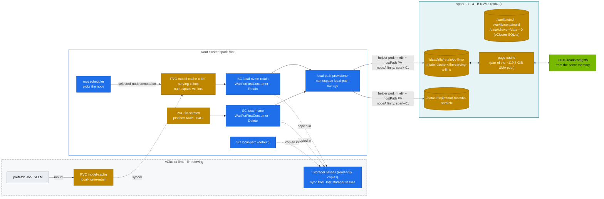

# Volume 11 — Storage for AI on Kubernetes: local-path on NVMe, WaitForFirstConsumer, Model Caches, fio, UMA & Page Cache

> **Module 02 · Part III — Workloads, storage, tenancy** · Prev: [10 Workload controllers](10-advanced-workload-controllers.md) · Next: [12 Multi-tenancy & cgroups](12-multi-tenancy-resource-quotas-and-cgroups.md) · The lab's shape: [27 Nested clusters](27-nested-clusters-with-vcluster.md)

| | |
|---|---|
| **You will build** | A storage tier the root cluster owns and both vClusters consume: local-path-provisioner on the Spark's NVMe with two extra StorageClasses (scratch/Delete and models/Retain), a shared `model-cache` PVC in llms pre-filled by a prefetch Job, an in-pod fio benchmark with AI-shaped I/O profiles, and a measured view of what the page cache does to unified memory when you load a model |
| **Hardware** | spark-01 (4 TB NVMe on the Founders Edition). §8 needs spark-02 |
| **Time** | 90 min |
| **Risk** | Low. fio writes 16 GiB of scratch data (deleted afterwards) |
| **Clusters** | `spark-root` (provisioner, StorageClasses, real PVs, fio), `llms` (model cache, prefetch), `dev-lab` (Retain vs Delete) |
| **Lab files** | [`addons/local-path-nvme.yaml`](lab/addons/local-path-nvme.yaml), [`addons/local-path-config-patch.yaml`](lab/addons/local-path-config-patch.yaml), `scripts/install-addons.sh storage`, [`manifests/llms/60-storage/`](lab/manifests/llms/60-storage) (`pvcs.yaml`, `model-prefetch-job.yaml`), [`manifests/root/60-storage/fio-job.yaml`](lab/manifests/root/60-storage/fio-job.yaml), [`vclusters/llms.yaml`](lab/vclusters/llms.yaml) (`sync.fromHost.storageClasses`), [`scripts/uma-watch.sh`](lab/scripts/uma-watch.sh) |

---

## 1. Why this matters on a Spark

Every model server's start time is dominated by one number: **how fast can N gigabytes of weights get from disk into (unified) memory?** And every training job's resilience depends on how fast it can write a checkpoint without stalling etcd (Vol 03). On the Spark:

- **One NVMe** holds DGX OS, container images (containerd for Kubernetes *and* Docker), the root's etcd data and WAL (`/var/lib/etcd`), both vClusters' SQLite databases, model weights and checkpoints. Isolation is by directory and I/O priority, not by device.
- **Unified memory** means the page cache and the GPU compete for the same pool — about 119.7 GiB visible of the 128 GB installed. Reading a 60 GB checkpoint through the page cache can briefly need 60 GB of cache *plus* 60 GB of model. NVIDIA's Spark guidance is to drop caches before loading big models, and `scripts/uma-watch.sh` shows why.
- **GPUDirect Storage** matters less here than on a discrete-GPU server. GDS avoids a CPU "bounce buffer" copy across PCIe into HBM, and on GB10 there's no separate HBM to copy into. O_DIRECT loaders and avoiding double-buffering in the page cache give the gains (module 08 goes deeper).
- **Storage is a root service.** A vCluster has no CSI driver, no provisioner and no PVs of its own. Tenants pick a class the root offers; their PVC is copied to the root, and the root's provisioner makes the directory. That gives one place to manage disks — and one more layer of quota (§3.4).

---

## 2. Architecture — HLD



---

## 3. LLD

### 3.1 StorageClasses (root, offered to both vClusters)

| Class | Provisioner | Binding | Reclaim | Path pattern (root names) | Use |
|---|---|---|---|---|---|
| `local-path` (default) | rancher.io/local-path | WFFC | Delete | `/data/k8s/pvc-<uid>_<ns>_<pvc>` | anything unspecified |
| `local-nvme` | same | WFFC | **Delete** | `/data/k8s/<ns>/<pvc>` | scratch, Prometheus, fio, vCluster SQLite |
| `local-nvme-retain` | same | WFFC | **Retain** | `/data/k8s/retain/<ns>/<pvc>` | model weights, vector DBs |

kubeadm ships no storage at all (K3s used to bundle local-path). `scripts/install-addons.sh storage` installs local-path-provisioner `$LOCAL_PATH_VERSION` from `versions.env` into namespace `local-path-storage`, merge-patches its ConfigMap to root everything at `/data/k8s`, applies the two `local-nvme*` classes and marks `local-path` as the default.

`<ns>` and `<pvc>` are the **root's** names. For a PVC from a vCluster, that's `vc-<vcluster>` and `<pvc>-x-<namespace>-x-<vcluster>`, so llms's `model-cache` lands at `/data/k8s/retain/vc-llms/model-cache-x-llm-serving-x-llms`. Readable, and it tells you which vCluster and namespace own every directory on the disk.

**Why WaitForFirstConsumer?** A local volume lives on one node. Binding at PVC creation (Immediate) could pick a node where the pod can't run (e.g. no free GPU slice). WFFC waits for the scheduler to choose the node, then provisions the volume there. With vClusters, "the scheduler" is the **root's**: it sets `volume.kubernetes.io/selected-node` on the root copy of the PVC when it places the root copy of the pod. Tenants see the result, not the mechanism.

**Capacity isn't enforced.** local-path creates a directory. `resources.requests.storage` counts against ResourceQuotas (Vol 12), but nothing stops the pod writing 2 TB. Use ext4/XFS project quotas or a real CSI driver for hard limits (§8).

### 3.2 AI I/O profiles (fio)

| Job | Pattern | Stands for |
|---|---|---|
| `weights-seqread-1m` | sequential read, 1 MiB, QD32 × 4 | loading safetensors |
| `checkpoint-seqwrite-1m` | sequential write, 1 MiB | saving a checkpoint |
| `dataloader-randread-128k` | random read, 128 KiB, QD64 × 4 | shuffled WebDataset shards |
| `small-randread-4k` | random read, 4 KiB, QD128 × 4 | metadata, tokenizer files, many small files |

All use `direct=1` to measure the device, not the page cache. The Job runs on the root in `platform-tools` and requests 4 CPUs — more than the whole llms vCluster's CPU budget, which is exactly why benchmarks are a platform job.

### 3.3 Paths & facts

| Item | Value |
|---|---|
| Provisioner | Deployment `local-path-storage/local-path-provisioner` (root) |
| Provisioner config | ConfigMap `local-path-storage/local-path-config` (`nodePathMap` → `/data/k8s`) |
| Image store | `/var/lib/containerd` — containerd from DGX OS, shared with Docker (Kubernetes images in containerd namespace `k8s.io`, Docker's in `moby`). `sudo crictl images` lists the Kubernetes ones |
| Root etcd | `/var/lib/etcd` (stacked, static pod); snapshots in `/var/lib/etcd-snapshots` |
| vCluster backing stores | PVC `data-<name>-0` (5 Gi, `local-nvme`) → `/data/k8s/vc-<name>/data-<name>-0` |
| kubelet disk eviction | 01 Ansible `kubeadm_cluster_eviction_hard`: `nodefs.available<10%`, `nodefs.inodesFree<5%`, `imagefs.available<15%` → image GC, then pod eviction |

### 3.4 Storage quota applies twice

| Layer | Object | `requests.storage` | Also counts |
|---|---|---|---|
| inside llms | ResourceQuota `llm-serving/serving-budget` | 400 Gi | only PVCs in `llm-serving` |
| root | ResourceQuota `vc-llms/vcluster-budget` | 500 Gi | **every** PVC of the vCluster: its own `data-llms-0` (5 Gi), Qdrant's `data-qdrant-0` (20 Gi), `model-cache`, anything in `batch` |
| inside dev-lab | `tenant-budget` per tenant | 100 Gi (+ LimitRange max 50 Gi per PVC) | |
| root | `vc-dev-lab/vcluster-budget` | 300 Gi | `data-dev-lab-0` (5 Gi) and all tenant PVCs |

A PVC has to fit **both**. The inner refusal comes from the vCluster's API server, so the PVC is never created. The root refusal comes later: the PVC exists in the vCluster but stays `Pending`, and the syncer reports that the root quota refused its copy. §5.1 checks both before anything is created.

---

## 4. Integrations

- **Serving (Vol 21, 23, 24)** mounts `model-cache` at `/models` with `HF_HOME=/models/hf`. The prefetch Job fills it once. vLLM, SGLang and the P/D pair all read it — all inside llms, in `llm-serving`.
- **Workloads (Vol 10)**: Qdrant's `volumeClaimTemplates` use `local-nvme-retain` the same way.
- **01 Ansible NFS-over-RDMA (`playbooks/09-nfs-rdma.yml`)** exports `/srv/models` from spark-01 to spark-02. For 2 Sparks, back the model cache with a static NFS PV (§8) so both nodes share one copy.
- **Module 08 Storage** benchmarks the same NVMe with deeper tools (GDS, `gdsio`, MinIO, JuiceFS).
- **etcd (Vol 03)**: run §5.4 while watching `etcd_disk_wal_fsync_duration_seconds` to see checkpoint-sized writes hurt the root control plane — and with it both vClusters, whose syncers write through it.

---

## 5. Lab

All commands run from `02 Kubernetes/lab` with `KUBECONFIG` set to the lab file:

```bash
cd "02 Kubernetes/lab"
export KUBECONFIG="$PWD/../../01 Ansible/lab/.cache/kubeconfig-spark-lab.yaml"
```

### 5.1 StorageClasses, the WFFC lifecycle, and the double quota

```bash
sudo mkdir -p /data/k8s            # on the Spark (the 01 Ansible vclusters role already did)
scripts/install-addons.sh storage
kubectl --context spark-root get sc
kubectl --context spark-root -n local-path-storage get cm local-path-config -o jsonpath='{.data.config\.json}{"\n"}'
kubectl --context llms get sc       # the same three classes, copied in
```

Expected: `local-path (default)`, `local-nvme`, `local-nvme-retain` on the root; the same names in llms. They are copies: the root owns the real objects, and a change to a class is made on the root.

Before creating the model cache, let both API servers check it. A server-side dry run runs quota admission without persisting anything:

```bash
kubectl --context llms apply -k manifests/llms/10-tenancy
kubectl --context llms apply -k manifests/llms/60-storage --dry-run=server
kubectl --context llms -n llm-serving describe resourcequota serving-budget | grep storage
kubectl --context spark-root -n vc-llms describe resourcequota vcluster-budget | grep storage
```

Do the arithmetic yourself: the PVC's request must be ≤ what's left of `serving-budget` (400 Gi) *and* ≤ what's left of the root's 500 Gi after the vCluster's own 5 Gi PVC and Qdrant's 20 Gi. `model-cache` asks for 300 Gi: 300 + 20 (Qdrant) fits the 400 Gi inner ceiling, and 5 + 300 + 20 + 20 (`ckpt` in `batch`) fits the root's 500 Gi — and 300 Gi still holds a few quantised 70B-class checkpoints. Change the size and the dry run tells you which layer says no (`exceeded quota: serving-budget, …` is the inner one; a root refusal shows up as a syncer event). Then:

```bash
kubectl --context llms apply -k manifests/llms/60-storage
kubectl --context llms -n llm-serving get pvc model-cache
kubectl --context llms -n llm-serving describe pvc model-cache | tail -3
kubectl --context spark-root -n vc-llms get pvc | grep model-cache
```

Expected: `model-cache  Pending  …  local-nvme-retain` on both sides, with event `WaitForFirstConsumer: waiting for first consumer to be created before binding`. **Pending is correct here.** The root copy exists, but no PV yet: nothing will be provisioned until a pod that uses it is scheduled.

### 5.2 Prefetch the model (binds the PVC)

```bash
kubectl --context llms -n llm-serving create secret generic hf-token --from-literal=token="$HF_TOKEN" 2>/dev/null || true
kubectl --context llms apply -f manifests/llms/60-storage/model-prefetch-job.yaml
kubectl --context llms -n llm-serving logs -f job/model-prefetch
kubectl --context llms -n llm-serving get pvc model-cache
```

Follow the binding to the disk on the root, where the real PV lives:

```bash
HPVC=model-cache-x-llm-serving-x-llms
kubectl --context spark-root -n vc-llms get pvc $HPVC \
  -o jsonpath='{.metadata.annotations.volume\.kubernetes\.io/selected-node}{"\n"}'
PV=$(kubectl --context spark-root -n vc-llms get pvc $HPVC -o jsonpath='{.spec.volumeName}')
kubectl --context spark-root get pv "$PV" -o jsonpath='{.spec.hostPath.path}{"  "}{.spec.persistentVolumeReclaimPolicy}{"  "}{.spec.nodeAffinity.required.nodeSelectorTerms[0].matchExpressions[0].values}{"\n"}'
```

Expected:

```text
downloaded Qwen/Qwen2.5-0.5B-Instruct@main in 9s
model-cache   Bound   pvc-…   …   RWO   local-nvme-retain
spark-01
/data/k8s/retain/vc-llms/model-cache-x-llm-serving-x-llms  Retain  ["spark-01"]
```

The download time is illustrative. `kubectl --context llms get pv` may show a PV object too, but that's a stand-in the syncer keeps so the claim looks bound inside the vCluster; the authoritative PV, with the hostPath and node affinity, is the root's. To fetch a larger model for modules 03–06, edit `MODEL` and re-run (delete the finished Job first).

### 5.3 Retain vs Delete (dev-lab)

```bash
kubectl --context dev-lab apply -k manifests/dev-lab/00-platform
kubectl --context dev-lab apply -k manifests/dev-lab/10-tenancy
kubectl --context dev-lab -n lab-tools apply -f - <<'EOF'
apiVersion: v1
kind: PersistentVolumeClaim
metadata: {name: throwaway}
spec: {storageClassName: local-nvme, accessModes: [ReadWriteOnce], resources: {requests: {storage: 1Gi}}}
---
apiVersion: v1
kind: Pod
metadata: {name: writer}
spec:
  containers: [{name: w, image: busybox:1.37, command: ["sh","-c","echo hello > /d/f && sleep 5"], volumeMounts: [{name: d, mountPath: /d}], resources: {limits: {memory: 64Mi}}}]
  restartPolicy: Never
  volumes: [{name: d, persistentVolumeClaim: {claimName: throwaway}}]
EOF
kubectl --context dev-lab -n lab-tools wait --for=jsonpath='{.status.phase}'=Succeeded pod/writer --timeout=120s
sudo ls /data/k8s/vc-dev-lab/throwaway-x-lab-tools-x-dev-lab                 # on the Spark: f
kubectl --context dev-lab -n lab-tools delete pod writer
kubectl --context dev-lab -n lab-tools delete pvc throwaway
sleep 10; sudo ls /data/k8s/vc-dev-lab/throwaway-x-lab-tools-x-dev-lab 2>&1 # gone (Delete)
```

Deleting the PVC in dev-lab deletes its root copy; the root PV's reclaim policy then decides what happens to the directory. Do the same with `model-cache` and the directory and the root PV (`Released`) survive. To re-use a Released PV, clear its `claimRef` — a root operation, since the PV is the root's:

```bash
kubectl --context spark-root patch pv <pv-name> --type json -p '[{"op":"remove","path":"/spec/claimRef"}]'
```

A recreated claim in llms can then bind to it again (same class, compatible size and access mode — check with `kubectl --context spark-root get pv` that it took the old PV and not a fresh one). That's how you keep 60 GB of weights across a vCluster rebuild.

### 5.4 Measure the NVMe from inside a pod (root)

```bash
kubectl --context spark-root apply -k manifests/root/00-platform
kubectl --context spark-root apply -f manifests/root/60-storage/fio-job.yaml
kubectl --context spark-root -n platform-tools logs -f job/fio-ai | grep -E '^\S+: \(groupid|READ:|WRITE:|lat \(usec\): min.*avg|clat percentiles'
```

Pull the JSON summary. The job wrote `/scratch/result.all` (human-readable text plus one JSON document; the `sed` cuts out the JSON) into the PVC directory on the host. This PVC is a root object, so the path uses its own namespace and name:

```bash
sudo sed -n '/^{/,/^}/p' /data/k8s/platform-tools/fio-scratch/result.all | jq -r '.jobs[] | [.jobname, (.read.bw_bytes/1e9|tostring+" GB/s rd"), (.write.bw_bytes/1e9|tostring+" GB/s wr"), (.read.iops|floor|tostring+" rIOPS"), ((.read.clat_ns.percentile["99.000000"] // 0)/1000|floor|tostring+" µs p99")] | @tsv'
```

Record your numbers. They're your baseline for everything in modules 03–08. As a rough guide for a PCIe Gen4/Gen5 NVMe: several GB/s sequential, hundreds of thousands of 4K random IOPS. **Any 99th-percentile latency in milliseconds under this load means something else is hammering the disk.** While the write phase runs, watch the root's etcd in Grafana (or `kubectl --context spark-root -n kube-system logs etcd-spark-01 | grep -i 'slow fdatasync'`): the same NVMe carries the WAL.

Clean up: `kubectl --context spark-root delete -f manifests/root/60-storage/fio-job.yaml`.

### 5.5 What loading a model does to unified memory

`uma-watch.sh` takes the vCluster pod's name and context, finds its host copy, and prints the host pool next to that pod's cgroup:

```bash
# terminal A (on the Spark): watch the pool while vLLM (Vol 21) loads
POD=$(kubectl --context llms -n llm-serving get pod -l app=vllm -o jsonpath='{.items[0].metadata.name}')
scripts/uma-watch.sh llm-serving "$POD" llms 2
# terminal B: restart vLLM once with a warm cache, once after dropping it
kubectl --context llms -n llm-serving rollout restart deploy/vllm
sudo sh -c 'sync; echo 3 > /proc/sys/vm/drop_caches'; kubectl --context llms -n llm-serving rollout restart deploy/vllm
```

The restart creates a new pod, so re-run terminal A with the new name once it's scheduled. Watch the `Cached` column climb by roughly the model size while `MemAvailable` falls by about twice that during load. The page cache is reclaimable, and it isn't charged to anyone's quota: neither llms's 48 Gi budget nor any pod limit sees it. A CUDA allocation that arrives while the cache is full can still fail before the kernel reclaims. The 01 Ansible `playbooks/24-uma-relief.yml -e uma_drop_caches=true` automates the cache drop for big-model starts.

---

## 6. Verify

```bash
scripts/verify.sh storage
```

```text
── storage
[PASS] StorageClass local-path (root)
[PASS] StorageClass local-nvme (root)
[PASS] StorageClass local-nvme-retain (root)
[PASS] llms sees the root StorageClasses (sync.fromHost.storageClasses)
[PASS] model-cache Bound (llms)
```

| Check | Expected |
|---|---|
| 3 StorageClasses on the root, same 3 in llms and dev-lab | `local-path`, `local-nvme`, `local-nvme-retain` |
| `model-cache` | `Bound` in llms; root PV hostPath `/data/k8s/retain/vc-llms/model-cache-x-llm-serving-x-llms`, Retain |
| fio `weights-seqread-1m` | multi-GB/s. Save the JSON as your baseline |

---

## 7. Troubleshooting

| Symptom | Cause | Diagnose | Fix |
|---|---|---|---|
| PVC `Pending` forever **with** a pod using it | StorageClass missing/typo, provisioner down | `kubectl --context <v> describe pvc` (drill `breakfix 12`), `kubectl --context spark-root -n local-path-storage logs deploy/local-path-provisioner` | fix the SC name (PVC spec is immutable → recreate) |
| PVC `Pending` and no pod yet | WFFC | event `waiting for first consumer` | expected. Create the pod |
| `exceeded quota: serving-budget, requested: requests.storage=…` on apply | the PVC is larger than the inner ceiling | `kubectl --context llms -n llm-serving describe resourcequota serving-budget` | shrink the claim; the inner quota is the llms admin's |
| PVC exists in the vCluster but `Pending` with a sync error mentioning `vcluster-budget` | the root's storage budget for the whole vCluster is spent | `kubectl --context spark-root -n vc-<name> describe resourcequota vcluster-budget` | delete unused PVCs (Released Retain PVs don't count; their claims did) or resize the vCluster |
| `kubectl get sc` in a vCluster is empty | `sync.fromHost.storageClasses` off | `vclusters/<name>.yaml` | enable, `helm upgrade` |
| Pod `Pending`: `volume node affinity conflict` | local PV lives on another node (spark-02 joined) | `kubectl --context spark-root get pv <pv> -o yaml` → `nodeAffinity` | schedule to that node, or use shared storage (NFS, §8) |
| `MountVolume.SetUp failed … permission denied` | non-root pod on a root-owned dir | `sudo ls -ln /data/k8s/…` | `fsGroup` in the pod securityContext (as in the prefetch Job) |
| Pods evicted, `The node was low on resource: ephemeral-storage` | images + emptyDirs + logs fill `/` | `df -h /`, `sudo crictl images`, `docker system df` | `sudo crictl rmi --prune`, `docker image prune`, set `emptyDir.sizeLimit`, move models to PVCs |
| Model load 5× slower than fio says | cold page cache + small-file layout / network FS | `iostat -x 1` during load | prefetch, safetensors, O_DIRECT-capable loaders |
| CUDA OOM during load despite "enough" memory | page cache holding the previous copy of the weights | `uma-watch.sh`, `free -g` | drop caches before the load. Leave headroom in `--gpu-memory-utilization` |

---

## 8. Scale-out path

| Lab | 2 Sparks | Datacenter |
|---|---|---|
| local-path, one node | static NFS PV from `/srv/models` on spark-01 (NFS over RDMA, 01 Ansible `playbooks/09-nfs-rdma.yml`). `ReadOnlyMany` for weights | parallel FS (Weka, VAST, Lustre, GPFS) via CSI. Module 08 |
| no capacity enforcement | XFS project quotas | CSI with real quotas + snapshots (`VolumeSnapshot`) |
| prefetch Job per model | same, run once on the NFS server | model registry + node-local cache DaemonSet (e.g. Fluid/Alluxio, KServe LocalModelCache) |
| storage owned by one root, consumed by vClusters | same split | the same split at scale: a platform team runs CSI, tenant clusters only see classes |

### 8.1 Shared model store for two Sparks

When spark-02 joins the root as a worker, a `local-nvme-retain` PV pins every model server to spark-01. The fix is a volume both nodes can mount. 01 Ansible's `nfs_rdma` role exports `/srv/models` from spark-01 over NFSv4.2 on RDMA (port 20049) across the CX-7 link (`192.168.100.11`), and installs the client side on spark-02.

The PV is a **root** object — tenants can't create PVs — and a vCluster can't name a root PV directly (`spec.volumeName` inside the vCluster refers to its own objects). So match by class: the root offers a class with no provisioner, the platform team creates the PV in that class, and a tenant claim in that class binds to it.

```yaml
# on the root: kubectl --context spark-root apply -f -
apiVersion: storage.k8s.io/v1
kind: StorageClass
metadata: {name: nfs-models}
provisioner: kubernetes.io/no-provisioner      # static PVs only
volumeBindingMode: Immediate
reclaimPolicy: Retain
---
apiVersion: v1
kind: PersistentVolume
metadata: {name: models-nfs}
spec:
  storageClassName: nfs-models
  capacity: {storage: 2Ti}
  accessModes: [ReadOnlyMany]
  persistentVolumeReclaimPolicy: Retain
  mountOptions: [nfsvers=4.2, proto=rdma, port=20049, ro]
  nfs: {server: 192.168.100.11, path: /srv/models}
```

```yaml
# inside llms: kubectl --context llms apply -f -
apiVersion: v1
kind: PersistentVolumeClaim
metadata: {name: models-shared, namespace: llm-serving}
spec:
  storageClassName: nfs-models                 # copied in by sync.fromHost.storageClasses
  accessModes: [ReadOnlyMany]
  resources: {requests: {storage: 100Gi}}
```

The claim's root copy binds to `models-nfs`, and every kubelet that runs a pod using it mounts the export itself — so both nodes need the NFS client and the `rpcrdma` module (the role handles that). Note the quota detail: `requests.storage` counts the **claim's** 100 Gi, not the PV's 2 Ti, against `serving-budget` and the root budget. Write the model once from spark-01 (a prefetch Job on a read-write claim, or directly into `/srv/models`), then serve it read-only from both nodes. With only one Spark, the role's TCP fallback works the same way — just drop `proto=rdma,port=20049`.

---

## 9. Checklist

- [ ] I can explain why a local PVC is Pending until a pod exists, and who decides the node when the PVC came from a vCluster.
- [ ] I found a vCluster PVC's root copy, its PV and its directory on the NVMe.
- [ ] I checked a claim against both storage quotas with a server-side dry run.
- [ ] My model weights live on a Retain volume that survives PVC deletion.
- [ ] I have a saved fio baseline for my NVMe with AI-shaped profiles.
- [ ] I watched the page cache and a model load compete for unified memory.
