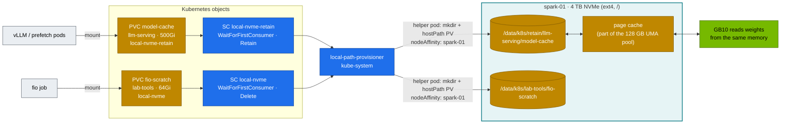

# Volume 11 — Storage for AI on Kubernetes: local-path on NVMe, WaitForFirstConsumer, Model Caches, fio, UMA & Page Cache

> **Module 02 · Part III — Workloads, storage, tenancy** · Prev: [10 Workload controllers](10-advanced-workload-controllers.md) · Next: [12 Multi-tenancy & cgroups](12-multi-tenancy-resource-quotas-and-cgroups.md)

| | |
|---|---|
| **You will build** | Two StorageClasses on the Spark's NVMe (scratch/Delete and models/Retain), a shared `model-cache` PVC pre-filled by a prefetch Job, an in-pod fio benchmark with AI-shaped I/O profiles, and a measured view of what the page cache does to unified memory when you load a model |
| **Hardware** | spark-01 (4 TB NVMe on the Founders Edition) |
| **Time** | 90 min |
| **Risk** | Low. fio writes 16 GiB of scratch data (deleted afterwards) |
| **Lab files** | [`addons/local-path-nvme.yaml`](lab/addons/local-path-nvme.yaml), [`k3s/20-k8s-lab.yaml`](lab/k3s/20-k8s-lab.yaml) (`default-local-storage-path`), [`manifests/60-storage/`](lab/manifests/60-storage/) (`pvcs.yaml`, `model-prefetch-job.yaml`, `fio-job.yaml`), [`scripts/uma-watch.sh`](lab/scripts/uma-watch.sh) |

---

## 1. Why this matters on a Spark

Every model server's start time is dominated by one number: **how fast can N gigabytes of weights get from disk into (unified) memory?** And every training job's resilience depends on how fast it can write a checkpoint without stalling etcd (Vol 03). On the Spark:

- **One NVMe** holds the OS, container images, the etcd WAL, model weights and checkpoints. Isolation is by directory and I/O priority, not by device.
- **Unified memory** means the page cache and the GPU compete for the same 128 GB. Reading a 60 GB checkpoint through the page cache can briefly need 60 GB of cache *plus* 60 GB of model. NVIDIA's Spark guidance is to drop caches before loading big models, and `scripts/uma-watch.sh` shows why.
- **GPUDirect Storage** matters less here than on a discrete-GPU server. GDS avoids a CPU "bounce buffer" copy across PCIe into HBM, and on GB10 there's no separate HBM to copy into. O_DIRECT loaders and avoiding double-buffering in the page cache give the gains (module 08 goes deeper).

---

## 2. Architecture — HLD



---

## 3. LLD

### 3.1 StorageClasses

| Class | Provisioner | Binding | Reclaim | Path pattern | Use |
|---|---|---|---|---|---|
| `local-path` (k3s default) | rancher.io/local-path | WFFC | Delete | `/data/k8s/pvc-<uid>_<ns>_<pvc>` | anything unspecified |
| `local-nvme` | same | WFFC | **Delete** | `/data/k8s/<ns>/<pvc>` | scratch, Prometheus, fio |
| `local-nvme-retain` | same | WFFC | **Retain** | `/data/k8s/retain/<ns>/<pvc>` | model weights, vector DBs |

**Why WaitForFirstConsumer?** A local volume lives on one node. Binding at PVC creation (Immediate) could pick a node where the pod can't run (e.g. no free GPU slice). WFFC waits for the scheduler to choose the node, then provisions the volume there.

**Capacity isn't enforced.** local-path creates a directory. `resources.requests.storage` counts against the namespace's ResourceQuota (Vol 12), but nothing stops the pod writing 2 TB. Use ext4/XFS project quotas or a real CSI driver for hard limits (§8).

### 3.2 AI I/O profiles (fio)

| Job | Pattern | Stands for |
|---|---|---|
| `weights-seqread-1m` | sequential read, 1 MiB, QD32 × 4 | loading safetensors |
| `checkpoint-seqwrite-1m` | sequential write, 1 MiB | saving a checkpoint |
| `dataloader-randread-128k` | random read, 128 KiB, QD64 × 4 | shuffled WebDataset shards |
| `small-randread-4k` | random read, 4 KiB, QD128 × 4 | metadata, tokenizer files, many small files |

All use `direct=1` to measure the device, not the page cache.

### 3.3 Paths & facts

| Item | Value |
|---|---|
| Provisioner config | ConfigMap `kube-system/local-path-config` (managed by k3s) |
| Root | `/data/k8s` (k3s `default-local-storage-path`) |
| Image store | `/var/lib/rancher/k3s/agent/containerd` (same NVMe) |
| kubelet disk eviction | defaults `nodefs.available<10%`, `imagefs.available<15%` → image GC then pod eviction |

---

## 4. Integrations

- **Serving (Vol 21, 23, 24)** mounts `model-cache` at `/models` with `HF_HOME=/models/hf`. The prefetch Job fills it once. vLLM, SGLang and the P/D pair all read it.
- **01 Ansible NFS-over-RDMA (Vol 15, `playbooks/09-nfs-rdma.yml`)** exports `/srv/models` from spark-01 to spark-02. For 2 Sparks, back `model-cache` with a static NFS PV (§8) so both nodes share one copy.
- **Module 08 Storage** benchmarks the same NVMe with deeper tools (GDS, `gdsio`, MinIO, JuiceFS).
- **etcd (Vol 03)**: run §5.5 while watching `etcd_disk_wal_fsync_duration_seconds` to see checkpoint writes hurt the control plane.

---

## 5. Lab

### 5.1 StorageClasses and the WFFC lifecycle

```bash
cd "02 Kubernetes/lab"
sudo mkdir -p /data/k8s            # on the Spark (install-addons.sh k3s-config already did)
scripts/install-addons.sh storage
kubectl get sc
kubectl apply -k manifests/60-storage
kubectl -n llm-serving get pvc model-cache
```

Expected: `model-cache  Pending  …  local-nvme-retain`, with event `WaitForFirstConsumer: waiting for first consumer to be created before binding`. **Pending is correct here.**

### 5.2 Prefetch the model (binds the PVC)

```bash
kubectl -n llm-serving create secret generic hf-token --from-literal=token="$HF_TOKEN" 2>/dev/null || true
kubectl apply -f manifests/60-storage/model-prefetch-job.yaml
kubectl -n llm-serving logs -f job/model-prefetch
kubectl -n llm-serving get pvc model-cache
kubectl get pv "$(kubectl -n llm-serving get pvc model-cache -o jsonpath='{.spec.volumeName}')" -o jsonpath='{.spec.hostPath.path}{"  "}{.spec.persistentVolumeReclaimPolicy}{"  "}{.spec.nodeAffinity.required.nodeSelectorTerms[0].matchExpressions[0].values}{"\n"}'
```

Expected:

```text
downloaded Qwen/Qwen2.5-0.5B-Instruct in 9s
model-cache   Bound   pvc-…   500Gi   RWO   local-nvme-retain
/data/k8s/retain/llm-serving/model-cache  Retain  ["spark-01"]
```

To fetch a larger model for modules 03–06, edit `MODEL` and re-run.

### 5.3 Retain vs Delete

```bash
kubectl -n lab-tools apply -f - <<'EOF'
apiVersion: v1
kind: PersistentVolumeClaim
metadata: {name: throwaway}
spec: {storageClassName: local-nvme, accessModes: [ReadWriteOnce], resources: {requests: {storage: 1Gi}}}
---
apiVersion: v1
kind: Pod
metadata: {name: writer}
spec:
  containers: [{name: w, image: busybox:1.37, command: ["sh","-c","echo hello > /d/f && sleep 5"], volumeMounts: [{name: d, mountPath: /d}], resources: {limits: {memory: 32Mi}}}]
  restartPolicy: Never
  volumes: [{name: d, persistentVolumeClaim: {claimName: throwaway}}]
EOF
kubectl -n lab-tools wait --for=jsonpath='{.status.phase}'=Succeeded pod/writer --timeout=120s
ls /data/k8s/lab-tools/throwaway                                     # on the Spark: f
kubectl -n lab-tools delete pod writer; kubectl -n lab-tools delete pvc throwaway
sleep 10; ls /data/k8s/lab-tools/throwaway 2>&1                     # gone (Delete)
```

Do the same with `model-cache`, and the directory and PV (`Released`) survive. To re-use a Released PV, clear its `claimRef`:

```bash
kubectl patch pv <pv-name> --type json -p '[{"op":"remove","path":"/spec/claimRef"}]'
```

### 5.4 Measure the NVMe from inside a pod

```bash
kubectl apply -f manifests/60-storage/fio-job.yaml
kubectl -n lab-tools logs -f job/fio-ai | grep -E '^\S+: \(groupid|READ:|WRITE:|lat \(usec\): min.*avg|clat percentiles' 
```

Pull the JSON summary. The job wrote `/scratch/result.all` (human-readable text plus one JSON document; the `sed` cuts out the JSON) into the PVC directory on the host:

```bash
sudo sed -n '/^{/,/^}/p' /data/k8s/lab-tools/fio-scratch/result.all | jq -r '.jobs[] | [.jobname, (.read.bw_bytes/1e9|tostring+" GB/s rd"), (.write.bw_bytes/1e9|tostring+" GB/s wr"), (.read.iops|floor|tostring+" rIOPS"), ((.read.clat_ns.percentile["99.000000"] // 0)/1000|floor|tostring+" µs p99")] | @tsv'
```

Record your numbers. They're your baseline for everything in modules 03–08. As a rough guide for a PCIe Gen4/Gen5 NVMe: several GB/s sequential, hundreds of thousands of 4K random IOPS. **Any 99th-percentile latency in milliseconds under this load means something else is hammering the disk.**

Clean up: `kubectl delete -f manifests/60-storage/fio-job.yaml`.

### 5.5 What loading a model does to unified memory

```bash
# terminal A (on the Spark): watch the pool
scripts/uma-watch.sh llm-serving "$(kubectl -n llm-serving get pod -l app=vllm -o jsonpath='{.items[0].metadata.name}')" 2
# terminal B: restart vLLM (Vol 21) once with a warm cache, once after dropping it
kubectl -n llm-serving rollout restart deploy/vllm
sudo sh -c 'sync; echo 3 > /proc/sys/vm/drop_caches'; kubectl -n llm-serving rollout restart deploy/vllm
```

Watch the `Cached` column climb by roughly the model size while `MemAvailable` falls by about twice that during load. The page cache is reclaimable, but a CUDA allocation that arrives while the cache is full can still fail before the kernel reclaims. The 01 Ansible `playbooks/24-uma-relief.yml` automates the cache drop for big-model starts.

---

## 6. Verify

```bash
scripts/verify.sh storage
```

| Check | Expected |
|---|---|
| 3 StorageClasses | `local-path`, `local-nvme`, `local-nvme-retain` |
| `model-cache` | `Bound`, hostPath under `/data/k8s/retain/…`, Retain |
| fio `weights-seqread-1m` | multi-GB/s. Save the JSON as your baseline |

---

## 7. Troubleshooting

| Symptom | Cause | Diagnose | Fix |
|---|---|---|---|
| PVC `Pending` forever **with** a pod using it | StorageClass missing/typo, provisioner down | `kubectl describe pvc` (drill `breakfix 12`), `kubectl -n kube-system logs deploy/local-path-provisioner` | fix the SC name (PVC spec is immutable → recreate) |
| PVC `Pending` and no pod yet | WFFC | event `waiting for first consumer` | expected. Create the pod |
| Pod `Pending`: `volume node affinity conflict` | local PV lives on another node | PV `nodeAffinity` | schedule to that node, or use shared storage (NFS) |
| `MountVolume.SetUp failed … permission denied` | non-root pod on a root-owned dir | `ls -ln /data/k8s/…` | `fsGroup` in the pod securityContext (as in the prefetch Job) |
| Pods evicted, `The node was low on resource: ephemeral-storage` | images + emptyDirs + logs fill `/` | `df -h /`, `sudo k3s crictl images` | `sudo k3s crictl rmi --prune`, set `emptyDir.sizeLimit`, move models to PVCs |
| Model load 5× slower than fio says | cold page cache + small-file layout / network FS | `iostat -x 1` during load | prefetch, safetensors, O_DIRECT-capable loaders |
| CUDA OOM during load despite "enough" memory | page cache holding the previous copy of the weights | `uma-watch.sh`, `free -g` | drop caches before the load. Leave headroom in `--gpu-memory-utilization` |

---

## 8. Scale-out path

| Lab | 2 Sparks | Datacenter |
|---|---|---|
| local-path, one node | static NFS PV from `/srv/models` on spark-01 (NFS over RDMA, 01 Ansible Vol 15). `ReadOnlyMany` for weights | parallel FS (Weka, VAST, Lustre, GPFS) via CSI. Module 08 |
| no capacity enforcement | XFS project quotas | CSI with real quotas + snapshots (`VolumeSnapshot`) |
| prefetch Job per model | same, run once on the NFS server | model registry + node-local cache DaemonSet (e.g. Fluid/Alluxio, KServe LocalModelCache) |

Static NFS PV for two Sparks:

```yaml
apiVersion: v1
kind: PersistentVolume
metadata: {name: models-nfs}
spec:
  capacity: {storage: 2Ti}
  accessModes: [ReadOnlyMany]
  persistentVolumeReclaimPolicy: Retain
  mountOptions: [nfsvers=4.2, proto=rdma, port=20049, ro]
  nfs: {server: 192.168.100.11, path: /srv/models}
```

---

## 9. Checklist

- [ ] I can explain why a local PVC is Pending until a pod exists, and why that's good.
- [ ] My model weights live on a Retain volume that survives PVC deletion.
- [ ] I have a saved fio baseline for my NVMe with AI-shaped profiles.
- [ ] I watched the page cache and a model load compete for unified memory.
