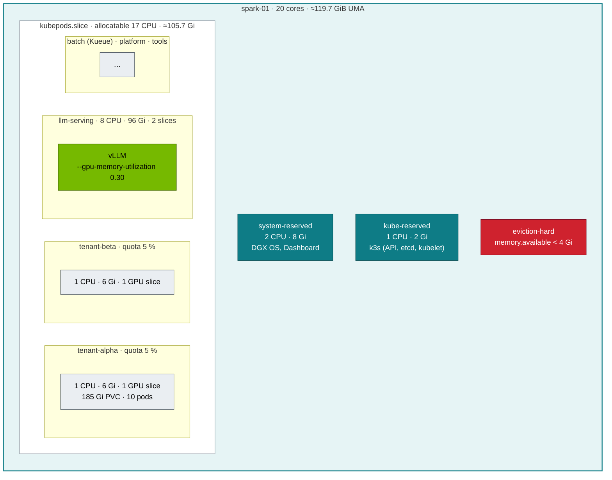

# Volume 12 — Multi-Tenancy on One Spark: Quotas, LimitRanges, QoS, cgroups v2 & the Unified-Memory Question

> **Module 02 · Part III — Workloads, storage, tenancy** · Prev: [11 Storage](11-storage-csi-and-high-performance-volumes.md) · Next: [13 NVIDIA hardware & drivers](13-nvidia-hardware-and-driver-stack.md)

| | |
|---|---|
| **You will build** | Two tenants with hard 5 % budgets (CPU, memory, GPU slices, storage, object counts). You'll trace Kubernetes requests and limits to cgroup v2 files, reproduce CPU throttling and OOM kills, and run the experiment that decides how you protect a unified-memory node: *is CUDA memory charged to the pod?* |
| **Hardware** | spark-01 |
| **Time** | 90 min |
| **Risk** | Low. The OOM and UMA experiments are bounded by limits and `restartPolicy: Never` |
| **Lab files** | [`manifests/10-tenancy/`](lab/manifests/10-tenancy/) (`quotas.yaml`, `limitranges.yaml`, `experiments/`), [`scripts/cgroup-inspect.sh`](lab/scripts/cgroup-inspect.sh), [`scripts/uma-watch.sh`](lab/scripts/uma-watch.sh), [`breakfix/01`](lab/breakfix/01-quota-exceeded.yaml), [`04`](lab/breakfix/04-oomkilled.yaml), [`15`](lab/breakfix/15-uma-pressure.yaml) |

---

## 1. Why this matters on a Spark

There are two layers of protection, and they fail differently:

| Layer | Enforced by | When it acts | Failure you'll see |
|---|---|---|---|
| **Budget** (ResourceQuota, LimitRange) | API server admission | at object creation | `exceeded quota`, `maximum cpu usage per Container is 1` |
| **Runtime** (cgroups v2) | Linux kernel | while the process runs | CPU throttling (slow, no error), `OOMKilled` (exit 137) |
| **Node** (kubelet eviction) | kubelet | when the node runs low | `Evicted: The node was low on resource: memory` |

On a UMA machine there's a fourth, awkward question: **CUDA allocations come from the same RAM, but are they counted in the pod's cgroup?** The answer decides whether pod memory limits protect the node from a greedy model server. §5.5 measures it on your DGX OS release instead of assuming.

---

## 2. Architecture — HLD



---

## 3. LLD

### 3.1 The 5 % budget, computed from real capacity

| Resource | Node capacity | 5 % | Quota key(s) | LimitRange (per container) |
|---|---|---|---|---|
| CPU | 20 cores | **1 core** | `requests.cpu: 1`, `limits.cpu: 1` | default 250m / 100m request, max 1 |
| Memory | 128 GB (≈119.7 GiB visible) | **6 Gi** (≈6.4 GB) | `requests.memory`, `limits.memory: 6Gi` | default 512Mi / 256Mi, max 6Gi |
| GPU | 1 GB10 → 4 time-slices | **1 slice** | `requests.nvidia.com/gpu: 1` | (policy: ≤ 1, Vol 02) |
| Storage | ≈3.7 TiB | **185 Gi** | `requests.storage`, `persistentvolumeclaims: 5` | PVC max 100Gi |
| Objects | — | — | `pods: 10`, `services.loadbalancers: 0`, `services.nodeports: 0` | — |

Because the quota lists `limits.cpu` and `requests.memory`, **every** container must declare them. The LimitRange fills in defaults so `kubectl run` still works.

### 3.2 Requests/limits → cgroup v2

| Kubernetes | cgroup v2 file | Semantics |
|---|---|---|
| `limits.cpu: 500m` | `cpu.max = 50000 100000` | 50 ms of CPU per 100 ms period. Hard cap → **throttling** |
| `requests.cpu: 100m` | `cpu.weight` (shares = m×1024/1000 → weight = 1+((shares−2)×9999)/262142) | relative share under contention only |
| `limits.memory: 256Mi` | `memory.max = 268435456` | hard. Exceeding it → kernel OOM kill in the cgroup |
| `requests.memory` | none on the pod cgroup | scheduling + eviction ranking only |
| no limits | `cpu.max = max`, `memory.max = max` | bounded only by the parent `kubepods` slice |

### 3.3 QoS classes

| Class | Rule | `oom_score_adj` | Evicted |
|---|---|---|---|
| Guaranteed | requests = limits for CPU **and** memory, every container | −997 | last |
| Burstable | anything in between | 2 … 999 (by request size) | middle |
| BestEffort | no requests/limits at all | 1000 | first |

Serving pods in this lab are Burstable on purpose (memory limit > request), because weights plus KV cache vary. Make them Guaranteed once you've measured their peak.

---

## 4. Integrations

- **Admission (Vol 02)**: the quota admission plugin and the CEL GPU policy together keep tenants inside their slice.
- **Kueue (Vol 05)**: namespaces with quotas *and* a ClusterQueue double-count. Keep batch tenants in `batch` (Kueue-governed) and interactive tenants in `tenant-*` (quota-governed).
- **Grafana (Vol 16)**: the *Tenancy* row plots `kube_resourcequota{type="used"}` against `hard`, plus the top-5 throttled containers.
- **01 Ansible (`k3s_cluster_kubelet_args`)** owns system-reserved, kube-reserved and eviction thresholds. Change them there, not by hand.

---

## 5. Lab

### 5.1 Budgets in action

```bash
cd "02 Kubernetes/lab"
kubectl apply -k manifests/00-platform && kubectl apply -k manifests/10-tenancy
kubectl -n tenant-alpha describe resourcequota budget-5pct
scripts/breakfix.sh inject 01
kubectl -n tenant-alpha get deploy bf01-big                     # 2/3
kubectl -n tenant-alpha describe rs -l app=bf01 | grep -A2 FailedCreate
scripts/breakfix.sh reset 01
```

Expected: `exceeded quota: budget-5pct, requested: limits.cpu=500m, used: limits.cpu=1, limited: limits.cpu=1`.

### 5.2 Read the cgroups behind each QoS class

```bash
kubectl apply -f manifests/10-tenancy/experiments/qos-trio.yaml
for p in guaranteed burstable besteffort; do sudo scripts/cgroup-inspect.sh lab-tools qos-$p | sed -n '1,8p'; echo; done
```

Expected (key lines):

```text
pod lab-tools/qos-guaranteed … qos=Guaranteed
  cpu.max                50000 100000
  memory.max             268435456
    pid 81234 oom_score_adj=-997  /pause
pod lab-tools/qos-burstable … qos=Burstable
  cpu.max                max 100000
  memory.max             536870912
pod lab-tools/qos-besteffort … qos=BestEffort
  cpu.max                max 100000
  memory.max             max
    pid 81301 oom_score_adj=1000  /pause
```

### 5.3 CPU throttling: slow with no error

```bash
kubectl apply -f manifests/10-tenancy/experiments/cpu-throttle.yaml
sleep 30; sudo scripts/cgroup-inspect.sh lab-tools cpu-throttle | grep -A3 'cpu.stat'
kubectl top pod -n lab-tools cpu-throttle 2>/dev/null || true
```

Expected: `nr_throttled` close to `nr_periods` and `throttled_usec` growing ~800 ms per second (4 threads want 4 cores, the limit gives 0.2). In Grafana: *CPU throttling (top 5)*. **Throttling is the #1 hidden cause of slow tokenizers and data loaders.** Their CPU limit is far below their thread count.

### 5.4 Memory limit → OOMKilled

```bash
scripts/breakfix.sh inject 04
sleep 20; kubectl -n lab-tools get pod bf04-oom
kubectl -n lab-tools get pod bf04-oom -o jsonpath='{.status.containerStatuses[0].lastState.terminated}{"\n"}' | jq
sudo scripts/cgroup-inspect.sh lab-tools bf04-oom | grep -A6 memory.events
scripts/breakfix.sh reset 04
```

Expected: `"reason":"OOMKilled","exitCode":137`, and `oom_kill` > 0 in `memory.events`.

### 5.5 The UMA question: is CUDA memory charged to the pod?

```bash
kubectl apply -f manifests/10-tenancy/experiments/uma-cgroup-experiment.yaml
kubectl -n lab-tools logs -f uma-cgroup-experiment
# in parallel, on the Spark:
scripts/uma-watch.sh lab-tools uma-cgroup-experiment 1
```

Two possible outcomes:

| Log | Meaning | How you protect the node |
|---|---|---|
| `start: … 0.3 GiB` → pod `OOMKilled` around 4 GiB | CUDA memory **is** charged to the pod cgroup | pod memory limits are a real GPU-memory guardrail. Size them as weights + KV cache + overhead |
| `allocated 16 GiB … memory.current=0.6 GiB` → `survived` | CUDA memory **isn't** charged (driver-owned pages) | pod limits don't bound GPU use. Rely on engine flags (`--gpu-memory-utilization`, `--mem-fraction-static`), the `SparkUMAPressure` alert, PriorityClasses and eviction |

**Record your result in the lab log**, with the driver version (`nvidia-smi --query-gpu=driver_version --format=csv,noheader`). Re-run it after every DGX OS or driver upgrade. The rest of this module is written to be safe under either outcome. That's why every serving manifest sets both a pod memory limit *and* an engine memory fraction.

```bash
kubectl delete -f manifests/10-tenancy/experiments/ --ignore-not-found
```

### 5.6 (Optional, risky) Node-level pressure

```bash
scripts/breakfix.sh inject 15      # asks for confirmation; self-terminates after 150 s
kubectl describe node spark-01 | grep -A8 Conditions
kubectl get events -A --field-selector reason=Evicted
```

Watch which pods the kubelet evicts first: BestEffort and preemptible go before serving and platform.

---

## 6. Verify

```bash
scripts/verify.sh tenancy
```

| Check | Expected |
|---|---|
| quota `limits.cpu` | `1` in both tenants |
| QoS trio | `oom_score_adj` −997 / (2…999) / 1000 |
| throttle pod | `nr_throttled / nr_periods` > 0.9 |
| UMA experiment | outcome recorded with the driver version |

---

## 7. Troubleshooting

| Symptom | Cause | Diagnose | Fix |
|---|---|---|---|
| `must specify limits.cpu` / `requests.memory` on create | quota covers it and there's no LimitRange default | `kubectl describe limitrange -n X` | add the LimitRange (lab has one) or set resources |
| Some replicas never appear | quota exhausted | ReplicaSet `FailedCreate` events | raise the quota / shrink requests (drill 01) |
| Job 5× slower than on the laptop, no errors | CPU throttling | `cgroup-inspect.sh` → `nr_throttled` | raise the CPU limit or remove it (keep the request). Match thread count (`OMP_NUM_THREADS`, `torch.set_num_threads`) to the limit |
| `OOMKilled` (137) | container exceeded `memory.max` | `lastState.terminated`, `memory.events` | raise the limit to measured peak + 20 %, or fix the leak |
| `Evicted … low on resource: memory` | node-level pressure | node Conditions, `memory.available` | find the greedy pod (`uma-watch.sh`), lower engine memory fractions, drop page cache |
| CUDA `out of memory` with plenty of pod limit left | UMA pool exhausted by *other* consumers (page cache, other pods) | `free -g`, `SparkUMAPressure` | headroom policy: sum of engine fractions ≤ 70 % |

---

## 8. Scale-out path

| Lab | Datacenter |
|---|---|
| 5 % static quotas per namespace | Hierarchical quotas (HNC) or Capsule tenants. Quotas generated from a tenant catalog in Git |
| time-slicing, no GPU memory isolation | MIG (H100/B200) for hard isolation, or DRA with GPU partitioning (§Vol 05). **GB10 has no MIG** |
| namespace tenancy on one cluster | virtual clusters (vcluster) for teams that need cluster-admin, or separate clusters for untrusted tenants |
| engine flags as the GPU-memory guardrail | the same, plus admission policies that *require* those flags on serving images |

---

## 9. Checklist

- [ ] I derived the 5 % numbers from the node's real capacity and allocatable.
- [ ] I can map any `resources:` block to `cpu.max`, `cpu.weight` and `memory.max`.
- [ ] I reproduced throttling and an OOM kill, and diagnosed both from the cgroup.
- [ ] I measured whether CUDA memory counts against the pod on *my* driver, and wrote it down.
