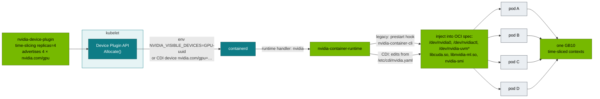

# Volume 14 — NVIDIA Container Toolkit, CDI & GPU Sharing on GB10: Time-Slicing, MPS, (no) MIG

> **Module 02 · Part IV — NVIDIA platform** · Prev: [13 Hardware & drivers](13-nvidia-hardware-and-driver-stack.md) · Next: [15 DGX Spark datacenter simulation](15-dgx-spark-datacenter-simulation-lab.md)

| | |
|---|---|
| **You will build** | A clear picture of how a GPU gets into a container (runtime hook vs CDI). You'll measure what time-slicing actually gives four tenants on one GB10, and close the "GPU leak" where pods that asked for no GPU still get one |
| **Hardware** | spark-01 |
| **Time** | 75 min |
| **Risk** | Low. §5.5 (runtime hardening) restarts k3s |
| **Lab files** | [`manifests/70-gpu/gemm-bench.yaml`](lab/manifests/70-gpu/gemm-bench.yaml), [`gemm-solo.yaml`](lab/manifests/70-gpu/gemm-solo.yaml), [`breakfix/10-gpu-leak.yaml`](lab/breakfix/10-gpu-leak.yaml), [`manifests/15-admission/policies.yaml`](lab/manifests/15-admission/policies.yaml) |

---

## 1. Why this matters on a Spark

One GPU, several tenants. The sharing mechanism decides **isolation** (can one tenant crash or starve another?), **accounting** (does the quota mean anything?) and **performance** (what does each tenant actually get?). GB10 has no MIG, so the realistic options are time-slicing and MPS. The lab runs time-slicing with 4 replicas, which the 01 Ansible `gpu_operator` role configured.

| | Time-slicing (lab) | MPS | MIG | Whole GPU |
|---|---|---|---|---|
| On GB10 | ✅ | device-plugin MPS mode (validate on your stack) | ❌ | ✅ (replicas: 1) |
| Compute isolation | none, context switched | shared SMs, optional % cap | hardware | n/a |
| Memory isolation | **none** (and UMA shares with the OS) | per-client limit | hardware | n/a |
| Fault isolation | none. One Xid can hit all | none | yes | n/a |
| Best for | dev pods, small services, CI | many small inference processes | multi-tenant prod on datacenter GPUs | one big model |

---

## 2. Architecture — HLD



**The leak (breakfix 10).** With `default-runtime: nvidia`, every container goes through `nvidia-container-runtime`. Any image that sets `NVIDIA_VISIBLE_DEVICES=all` (every CUDA base image does) gets the GPU injected, even though it never asked the device plugin and the quota never counted it.

---

## 3. LLD

### 3.1 Files and settings

| Item | Location | Lab value |
|---|---|---|
| Toolkit config | `/etc/nvidia-container-runtime/config.toml` | set by DGX OS / 01 Ansible `container_runtime` |
| CDI spec | `/etc/cdi/nvidia.yaml` (`nvidia-ctk cdi generate`) | regenerated by 01 Ansible when the driver changes |
| containerd runtime | `/var/lib/rancher/k3s/agent/etc/containerd/config.toml` | `default_runtime_name = "nvidia"` (01 Ansible default) |
| RuntimeClass | `nvidia` | created by k3s |
| Time-slicing | ConfigMap `gpu-operator/time-slicing-config` | `replicas: 4`, `failRequestsGreaterThanOne: true` |

### 3.2 Hardened mode (recommended once you're comfortable)

| Setting | Default lab | Hardened |
|---|---|---|
| k3s `default-runtime` | `nvidia` | **unset** (runc). GPU pods set `runtimeClassName: nvidia` |
| toolkit `accept-nvidia-visible-devices-envvar-when-unprivileged` | true | **false** |
| device plugin `deviceListStrategy` | `envvar` | **`volume-mounts`** or `cdi-cri` |
| Admission | CEL policy forbids `NVIDIA_*` env in tenants | same, plus require `runtimeClassName: nvidia` only with a GPU request |

---

## 4. Integrations

- **01 Ansible**: `k3s_cluster_default_runtime_nvidia` and `gpu_operator_timeslice_replicas` are the two knobs. Change them there and re-run playbooks 05/06. Don't hand-edit nodes.
- **Admission (Vol 02)**: `spark-no-nvidia-env-bypass` stops explicit env bypasses in tenant namespaces. The hardened runtime closes the implicit one.
- **Kueue / quotas (Vol 05, 12)** count `nvidia.com/gpu` requests. The leak is exactly the GPU use they *don't* see.

---

## 5. Lab

### 5.1 Inspect the toolkit and CDI on the host

```bash
ssh nvidia@192.168.0.100
nvidia-ctk --version
sudo nvidia-ctk cdi list
grep -nE 'default_runtime_name|runtimes.nvidia|BinaryName' /var/lib/rancher/k3s/agent/etc/containerd/config.toml
grep -nE 'accept-nvidia-visible-devices|mode' /etc/nvidia-container-runtime/config.toml
```

Expected: CDI devices `nvidia.com/gpu=0`, `nvidia.com/gpu=GPU-<uuid>`, `nvidia.com/gpu=all`, and the `nvidia` runtime pointing at `/usr/bin/nvidia-container-runtime`.

Run a container through CDI without Kubernetes (Docker 25+ understands CDI):

```bash
docker run --rm --device nvidia.com/gpu=all nvcr.io/nvidia/cuda:13.0.1-base-ubuntu24.04 nvidia-smi -L
```

### 5.2 See what the device plugin hands a pod

```bash
cd "02 Kubernetes/lab"
kubectl apply -f manifests/70-gpu/gpu-smoke.yaml
POD_CID=$(kubectl -n tenant-beta get pod gpu-smoke -o jsonpath='{.status.containerStatuses[0].containerID}' | sed 's|.*://||')
sudo k3s crictl inspect "$POD_CID" | jq -r '.info.config.envs[] | select(.key|startswith("NVIDIA")) | "\(.key)=\(.value)"'
sudo k3s crictl inspect "$POD_CID" | jq -r '.info.runtimeSpec.linux.devices[]?.path'
```

### 5.3 Measure time-slicing: 1 → 2 → 4 tenants

```bash
kubectl apply -k manifests/70-gpu
for n in 1 2 4; do
  kubectl -n lab-tools scale deploy gemm-contention --replicas=$n
  kubectl -n lab-tools rollout status deploy gemm-contention --timeout=15m >/dev/null
  sleep 60
  echo "== $n pod(s)"
  kubectl -n lab-tools logs -l app=gemm-contention --tail=1 --prefix | sed -E 's/.*"tflops": ([0-9.]+).*/\1/' | awk -v n=$n '{s+=$1; print "  pod", NR, $1, "TFLOPS"} END {print "  aggregate", s, "TFLOPS  (per pod ≈", s/n, ")"}'
done
kubectl -n lab-tools scale deploy gemm-contention --replicas=0
```

What to expect, with your baseline B from Vol 13:

| Pods | Per pod | Aggregate |
|---|---|---|
| 1 | ≈ B | ≈ B |
| 2 | ≈ B/2 | ≈ B (minus switch overhead) |
| 4 | ≈ B/4 | ≈ B, or a bit lower |

**Time-slicing adds no capacity.** It shares one GPU fairly and costs some context-switch overhead. Four `nvidia.com/gpu` slices doesn't mean four GPUs. It means four tickets to one GPU.

### 5.4 Reproduce and understand the leak

```bash
scripts/breakfix.sh inject 10
sleep 15; kubectl -n lab-tools logs bf10-leak     # GPU 0: NVIDIA GB10 … although it requested nothing
kubectl -n lab-tools get pod bf10-leak -o jsonpath='{.spec.containers[0].resources}{"\n"}'
scripts/breakfix.sh answer 10; scripts/breakfix.sh reset 10
```

### 5.5 (Optional) Harden the runtime

Via 01 Ansible, so it's reproducible:

```bash
cd "../../01 Ansible/lab"
ansible-playbook playbooks/05-k3s.yml -e k3s_cluster_default_runtime_nvidia=false
cd "../../02 Kubernetes/lab"
scripts/breakfix.sh inject 10; sleep 15; kubectl -n lab-tools logs bf10-leak   # now: nvidia-smi not found / no devices
scripts/breakfix.sh reset 10
kubectl apply -f manifests/70-gpu/gpu-smoke.yaml && sleep 20 && kubectl -n tenant-beta logs gpu-smoke   # still works: runtimeClassName: nvidia
```

After hardening, **every GPU pod must set `runtimeClassName: nvidia`**. `gpu-smoke.yaml` does. Other lab manifests rely on the default runtime, so add the field to them (the GPU Operator's own pods are fine because the operator sets it).

---

## 6. Verify

| Check | Expected |
|---|---|
| `nvidia-ctk cdi list` | `nvidia.com/gpu=all` present |
| allocatable | `nvidia.com/gpu: 4` |
| contention table | aggregate ≈ baseline, per-pod ≈ baseline/N |
| hardened mode | `bf10-leak` no longer sees the GPU, `gpu-smoke` still does |

---

## 7. Troubleshooting

| Symptom | Cause | Diagnose | Fix |
|---|---|---|---|
| `could not select device driver "" with capabilities: [[gpu]]` (docker) | Docker not configured for the NVIDIA runtime | `docker info \| grep -i runtime` | `sudo nvidia-ctk runtime configure --runtime=docker && sudo systemctl restart docker` |
| `unresolvable CDI devices nvidia.com/gpu=…` | stale CDI spec after a driver upgrade | `nvidia-ctk cdi list` vs `nvidia-smi -L` UUID | `sudo nvidia-ctk cdi generate --output=/etc/cdi/nvidia.yaml` (01 Ansible does this) |
| allocatable `nvidia.com/gpu: 1` instead of 4 | time-slicing ConfigMap not applied or wrong key | `kubectl -n gpu-operator get cm time-slicing-config -o yaml`, device-plugin logs | fix and restart the device-plugin DaemonSet |
| Pod asks for 2 GPUs → `UnexpectedAdmissionError` | `failRequestsGreaterThanOne: true` | pod events | request 1 (2 slices of one GPU are not 2 GPUs) |
| Tenant's pod is slow at random times | another tenant's kernels share the GPU | `nvidia-smi` process list on the host. Grafana *GPU slices in use* | Kueue/priorities, or a dedicated time window |
| Pod sees GPU without requesting | the leak | §5.4 | hardened mode §5.5 |

---

## 8. Scale-out path

| Spark | Datacenter |
|---|---|
| time-slicing ×4 | MIG on H100/B200 (hardware isolation) for multi-tenant inference. Whole GPUs for training |
| envvar device list | CDI everywhere (`cdi-cri`), no default nvidia runtime |
| device plugin integer counts | DRA (`ResourceClaim`s) with the NVIDIA DRA driver: sharing strategies and MIG profiles as claim parameters |
| vGPU? | vGPU is for VMs (virtual desktops, VM-per-tenant clouds). For containers on bare metal, the stack above is simpler and faster, and there's no hypervisor tax |

---

## 9. Checklist

- [ ] I can explain both injection paths (legacy hook and CDI) and find their config files.
- [ ] I measured that 4 time-slices share one GPU's throughput rather than multiplying it.
- [ ] I reproduced the GPU leak and know the two changes that close it.
- [ ] I know which sharing modes GB10 supports and which it doesn't.
