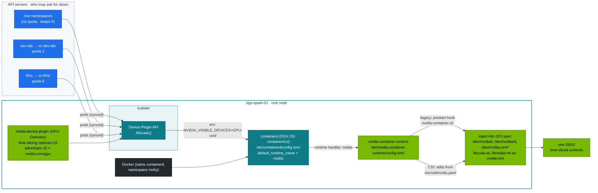

# Volume 14 — NVIDIA Container Toolkit, CDI & GPU Sharing on GB10: Time-Slicing, MPS, (no) MIG

> **Module 02 · Part IV — NVIDIA platform** · Prev: [13 Hardware & drivers](13-nvidia-hardware-and-driver-stack.md) · Next: [15 DGX Spark datacenter simulation](15-dgx-spark-datacenter-simulation-lab.md) · The lab's shape: [27 Nested clusters](27-nested-clusters-with-vcluster.md)

| | |
|---|---|
| **You will build** | A clear picture of how a GPU gets into a container on the root's containerd (runtime hook vs CDI), and how one GB10 becomes 15 time-slices split 5 / 2 / 8 between the root and the two vClusters. You'll measure what time-slicing actually gives several pods on one GB10, and close the "GPU leak" where pods that asked for no GPU — in any cluster — still get one |
| **Hardware** | dgx-spark-01 |
| **Time** | 75 min |
| **Risk** | Low. §5.5 (runtime hardening) restarts containerd, which Docker shares |
| **Clusters** | `spark-root` (containerd, device plugin, RuntimeClass, the benchmark in `platform-tools`), `dev-lab` (`gpu-smoke`, the leak) |
| **Lab files** | [`manifests/root/70-gpu/`](lab/manifests/root/70-gpu) (`gemm-bench.yaml`, `gemm-solo.yaml`, `gemm_bench.py`), [`manifests/dev-lab/70-gpu/gpu-smoke.yaml`](lab/manifests/dev-lab/70-gpu/gpu-smoke.yaml), [`manifests/common/runtimeclass/`](lab/manifests/common/runtimeclass), [`breakfix/10-gpu-leak.yaml`](lab/breakfix/10-gpu-leak.yaml), [`manifests/common/15-admission/policies.yaml`](lab/manifests/common/15-admission/policies.yaml), 01 Ansible [`roles/kubeadm_cluster/tasks/containerd.yml`](../01%20Ansible/lab/roles/kubeadm_cluster/tasks/containerd.yml), [`roles/gpu_operator`](../01%20Ansible/lab/roles/gpu_operator/defaults/main.yml) |

---

## 1. Why this matters on a Spark

One GPU, three clusters, several tenants. The sharing mechanism decides **isolation** (can one tenant crash or starve another?), **accounting** (does the quota mean anything?) and **performance** (what does each tenant actually get?). GB10 has no MIG, so the realistic options are time-slicing and MPS. The lab runs time-slicing with **15 replicas**, which the 01 Ansible `gpu_operator` role configured, and splits them with root quotas: the root keeps 5, `dev-lab` gets 2, `llms` gets 8.

| | Time-slicing (lab) | MPS | MIG | Whole GPU |
|---|---|---|---|---|
| On GB10 | ✅ | device-plugin MPS mode (validate on your stack) | ❌ | ✅ (replicas: 1) |
| Compute isolation | none, context switched | shared SMs, optional % cap | hardware | n/a |
| Memory isolation | **none** (and UMA shares with the OS) | per-client limit | hardware | n/a |
| Fault isolation | none. One Xid can hit all | none | yes | n/a |
| Best for | dev pods, small services, CI | many small inference processes | multi-tenant prod on datacenter GPUs | one big model |

The vClusters add no GPU machinery of their own. A tenant pod that asks for `nvidia.com/gpu: 1` inside llms is synced to the root, scheduled by the root scheduler against the root node's 15 slices, and started by the root's kubelet and containerd. Everything in this volume happens on the root.

---

## 2. Architecture — HLD



**The split is admission, not hardware.** The device plugin knows nothing about vClusters: it advertises 15 identical slices on the node. The 5 / 2 / 8 split exists only as `requests.nvidia.com/gpu` in the root quotas on `vc-dev-lab` and `vc-llms` (the root's own namespaces are unlimited, so "root keeps 5" means "whatever the vClusters can't take").

**The leak (breakfix 10).** With `default_runtime_name = "nvidia"`, every container on the node goes through `nvidia-container-runtime`. Any image that sets `NVIDIA_VISIBLE_DEVICES=all` (every CUDA base image does) gets the GPU injected, even though it never asked the device plugin — so neither the vCluster's quota nor the root scheduler counted it. Docker containers on the same box are the same story, without any Kubernetes accounting at all.

---

## 3. LLD

### 3.1 Files and settings

| Item | Location | Lab value |
|---|---|---|
| containerd | `containerd.io` from DGX OS, shared with Docker; config **`/etc/containerd/config.toml`** | regenerated once by 01 Ansible `kubeadm_cluster` (CRI plugin enabled, original kept as `config.toml.dgxos-orig`), `SystemdCgroup = true` |
| containerd NVIDIA runtime | same file, written by `nvidia-ctk runtime configure --runtime=containerd --set-as-default` | runtime `nvidia` → `nvidia-container-runtime`, `default_runtime_name = "nvidia"` (role default `kubeadm_cluster_default_runtime_nvidia: true`) |
| crictl | `/etc/crictl.yaml` → `unix:///run/containerd/containerd.sock` | use `sudo crictl …` |
| Toolkit config | `/etc/nvidia-container-runtime/config.toml` | DGX OS defaults, converged by 01 Ansible `container_runtime` |
| CDI spec | `/etc/cdi/nvidia.yaml` (`nvidia-ctk cdi generate`) | regenerated by 01 Ansible `container_runtime` when the driver changes; used by Docker (`features.cdi: true`) |
| GPU Operator | Helm values in 01 Ansible `roles/gpu_operator` | `driver.enabled=false`, `toolkit.enabled=false`, `cdi.enabled=false` — DGX OS owns them |
| RuntimeClass `nvidia` (root) | created by the GPU Operator | handler `nvidia` |
| RuntimeClass `nvidia` (dev-lab, llms) | [`manifests/common/runtimeclass/`](lab/manifests/common/runtimeclass), applied by each vCluster's `00-platform` | same name and handler |
| Time-slicing | ConfigMap `gpu-operator/time-slicing-config` | `replicas: 15`, `renameByDefault: false`, `failRequestsGreaterThanOne: true` |

**Why a RuntimeClass inside each vCluster?** A vCluster has its own API server, and it validates `runtimeClassName` against its *own* objects: a pod naming `nvidia` is rejected there if no RuntimeClass `nvidia` exists in the vCluster. The copy only has to exist; the synced pod carries the name to the root, and the root's containerd resolves handler `nvidia` from `/etc/containerd/config.toml`.

### 3.2 Hardened mode (recommended once you're comfortable)

| Setting | Default lab | Hardened |
|---|---|---|
| containerd `default_runtime_name` | `nvidia` | **`runc`**. GPU pods set `runtimeClassName: nvidia` (in every vCluster too) |
| toolkit `accept-nvidia-visible-devices-envvar-when-unprivileged` | true | **false** |
| device plugin `deviceListStrategy` | `envvar` | **`volume-mounts`** or `cdi-cri` |
| Admission | CEL policy forbids `NVIDIA_*` env in tenant namespaces | same, plus require `runtimeClassName: nvidia` only with a GPU request |

---

## 4. Integrations

- **01 Ansible**: `kubeadm_cluster_default_runtime_nvidia` (role `kubeadm_cluster`) and `gpu_operator_timeslice_replicas` (role `gpu_operator`) are the two knobs; the vCluster split is `requests.nvidia.com/gpu` in [`manifests/root/05-vclusters/quotas.yaml`](lab/manifests/root/05-vclusters/quotas.yaml). Change the slice count and the quotas together and keep `tests/budget_check.py` green.
- **Admission (Vol 02)**: `spark-no-nvidia-env-bypass` stops explicit env bypasses in tenant namespaces (inside each vCluster). The hardened runtime closes the implicit one.
- **Kueue / quotas (Vol 05, 12)** count `nvidia.com/gpu` requests. The leak is exactly the GPU use they *don't* see — and so is the slice ledger in `platform-tools` (Vol 04).
- **Vol 13** gives the single-slice baseline B that §5.3 compares against.

---

## 5. Lab

All `kubectl` commands run from `02 Kubernetes/lab` with `KUBECONFIG` set to the lab file:

```bash
cd "02 Kubernetes/lab"
export KUBECONFIG="$PWD/../../01 Ansible/lab/.cache/kubeconfig-spark-lab.yaml"
```

### 5.1 Inspect the toolkit, containerd and CDI on the host

```bash
ssh nvidia@192.168.0.100
nvidia-ctk --version
sudo nvidia-ctk cdi list
grep -nE 'default_runtime_name|runtimes.\W?nvidia|BinaryName|SystemdCgroup' /etc/containerd/config.toml
grep -nE 'accept-nvidia-visible-devices|mode' /etc/nvidia-container-runtime/config.toml
cat /etc/crictl.yaml
sudo crictl info | jq '.config.containerd.defaultRuntimeName // .config.containerd.default_runtime_name'
sudo ctr namespaces ls        # k8s.io (kubelet) and moby (Docker) on one containerd
```

Expected: CDI devices `nvidia.com/gpu=0`, `nvidia.com/gpu=GPU-<uuid>`, `nvidia.com/gpu=all`; an `nvidia` runtime whose `BinaryName` is `/usr/bin/nvidia-container-runtime`; `SystemdCgroup = true`; and `nvidia` as the default runtime. The exact TOML section names depend on the containerd major version DGX OS ships, which is why the `grep` matches the keys, not the headers.

Run a container through CDI without Kubernetes (Docker 25+ understands CDI):

```bash
docker run --rm --device nvidia.com/gpu=all nvcr.io/nvidia/cuda:13.0.1-base-ubuntu24.04 nvidia-smi -L
```

That container used one of nobody's 15 slices: Docker talks to the same containerd and the same GB10, entirely outside Kubernetes.

### 5.2 See what the device plugin hands a pod — from a vCluster

```bash
kubectl --context spark-root get node dgx-spark-01 -o jsonpath='{.status.allocatable.nvidia\.com/gpu}{"\n"}'   # 15
kubectl --context spark-root get runtimeclass nvidia
kubectl --context dev-lab get runtimeclass nvidia || kubectl --context dev-lab apply -k manifests/dev-lab/00-platform
kubectl --context dev-lab apply -f manifests/dev-lab/70-gpu/gpu-smoke.yaml
kubectl --context dev-lab -n tenant-beta wait --for=jsonpath='{.status.phase}'=Succeeded pod/gpu-smoke --timeout=180s
kubectl --context dev-lab -n tenant-beta logs gpu-smoke
```

Now find the container on the node. `gpu-smoke` is a dev-lab pod; its root copy is `gpu-smoke-x-tenant-beta-x-dev-lab` in `vc-dev-lab`, and that's the pod containerd knows:

```bash
HPOD=gpu-smoke-x-tenant-beta-x-dev-lab
POD_CID=$(kubectl --context spark-root -n vc-dev-lab get pod $HPOD -o jsonpath='{.status.containerStatuses[0].containerID}' | sed 's|.*://||')
sudo crictl inspect "$POD_CID" | jq -r '.info.config.envs[] | select(.key|startswith("NVIDIA")) | "\(.key)=\(.value)"'
sudo crictl inspect "$POD_CID" | jq '{hooks: (.info.runtimeSpec.hooks | keys? // []), devices: [.info.runtimeSpec.linux.devices[]?.path]}'
sudo crictl inspectp "$(sudo crictl inspect "$POD_CID" | jq -r .info.sandboxID)" | jq -r .info.runtimeHandler      # nvidia
```

Expected: `NVIDIA_VISIBLE_DEVICES=GPU-<uuid>` — the device plugin's `Allocate()` answer for one slice, which is the UUID of the one GB10 (every slice is the same GPU) — and either a prestart hook (legacy injection) or `/dev/nvidia*` device entries (CDI injection), depending on the toolkit's `mode`. The sandbox's runtime handler is `nvidia` because `gpu-smoke` sets `runtimeClassName: nvidia` — the RuntimeClass the pod named inside dev-lab.

```bash
kubectl --context dev-lab -n tenant-beta delete pod gpu-smoke
```

### 5.3 Measure time-slicing: 1 → 2 → 4 pods

The contention Deployment runs on the root in `platform-tools`: GPU benchmarking is a platform job, and the root has no quota that would stop it at a vCluster's 2 slices.

```bash
kubectl --context spark-root apply -k manifests/root/00-platform
kubectl --context spark-root apply -k manifests/root/70-gpu
for n in 1 2 4; do
  kubectl --context spark-root -n platform-tools scale deploy gemm-contention --replicas=$n
  kubectl --context spark-root -n platform-tools rollout status deploy gemm-contention --timeout=15m >/dev/null
  sleep 60
  echo "== $n pod(s)"
  kubectl --context spark-root -n platform-tools logs -l app=gemm-contention --tail=1 --prefix | sed -E 's/.*"tflops": ([0-9.]+).*/\1/' | awk -v n=$n '{s+=$1; print "  pod", NR, $1, "TFLOPS"} END {print "  aggregate", s, "TFLOPS  (per pod ≈", s/n, ")"}'
done
kubectl --context spark-root -n platform-tools scale deploy gemm-contention --replicas=0
```

What to expect, with your baseline B from Vol 13:

| Pods | Per pod | Aggregate |
|---|---|---|
| 1 | ≈ B | ≈ B |
| 2 | ≈ B/2 | ≈ B (minus switch overhead) |
| 4 | ≈ B/4 | ≈ B, or a bit lower |

**Time-slicing adds no capacity.** It shares one GPU fairly and costs some context-switch overhead. Fifteen `nvidia.com/gpu` slices don't mean fifteen GPUs. They mean fifteen tickets to one GPU — and the split gives llms 8 tickets, not 8/15 of the GPU's throughput. If llms runs one busy model server and dev-lab runs one, each gets about half while they're both computing, whatever the quota says. While the loop runs, `kubectl --context spark-root -n platform-tools get cm gpu-slice-ledger -o yaml` (Vol 04) shows the slices in use across all three clusters.

### 5.4 Reproduce and understand the leak

```bash
scripts/breakfix.sh inject 10
sleep 15; kubectl --context dev-lab -n lab-tools logs bf10-leak     # GPU 0: NVIDIA GB10 … although it requested nothing
kubectl --context dev-lab -n lab-tools get pod bf10-leak -o jsonpath='{.spec.runtimeClassName} {.spec.containers[0].resources}{"\n"}'
kubectl --context spark-root -n vc-dev-lab describe resourcequota vcluster-budget | grep gpu   # not counted
POD_CID=$(kubectl --context spark-root -n vc-dev-lab get pod bf10-leak-x-lab-tools-x-dev-lab -o jsonpath='{.status.containerStatuses[0].containerID}' | sed 's|.*://||')
sudo crictl inspectp "$(sudo crictl inspect "$POD_CID" | jq -r .info.sandboxID)" | jq -r '.info.runtimeHandler // "(default)"'
scripts/breakfix.sh answer 10; scripts/breakfix.sh reset 10
```

The pod names no RuntimeClass and requests no GPU, so its sandbox runs on containerd's **default** runtime — which is `nvidia`. The image's own `NVIDIA_VISIBLE_DEVICES=all` does the rest. dev-lab's quota, the root scheduler and the slice ledger never saw a GPU request.

### 5.5 (Optional) Harden the runtime

Switch containerd's default back to `runc`, so only pods that name `runtimeClassName: nvidia` go through the NVIDIA runtime. The 01 Ansible role writes the default when it *registers* the runtime, and doesn't remove it from an existing config — so on a running node make the change by hand, and set the role variable so a rebuild keeps it:

```bash
# on the Spark
sudo cp /etc/containerd/config.toml /etc/containerd/config.toml.pre-hardening
sudo sed -i -E 's/(default_runtime_name\s*=\s*)"nvidia"/\1"runc"/' /etc/containerd/config.toml
grep -n default_runtime_name /etc/containerd/config.toml
sudo systemctl restart containerd           # running containers keep running; Docker reconnects
sudo crictl info | jq '.config.containerd.defaultRuntimeName // .config.containerd.default_runtime_name'
# for rebuilds: inventory or -e kubeadm_cluster_default_runtime_nvidia=false (01 Ansible playbooks/05-kubernetes.yml)
```

```bash
scripts/breakfix.sh inject 10; sleep 15; kubectl --context dev-lab -n lab-tools logs bf10-leak   # now: nvidia-smi not found / no devices
scripts/breakfix.sh reset 10
kubectl --context dev-lab apply -f manifests/dev-lab/70-gpu/gpu-smoke.yaml && sleep 20 && kubectl --context dev-lab -n tenant-beta logs gpu-smoke   # still works: runtimeClassName: nvidia
kubectl --context dev-lab -n tenant-beta delete pod gpu-smoke
```

After hardening, **every GPU pod must set `runtimeClassName: nvidia`**, in whichever cluster it's written. `gpu-smoke.yaml` does. The other lab manifests (the GEMM benchmarks, the UMA experiment, the node probe, the llms serving and training manifests) rely on the default runtime, so add the field to them. The GPU Operator's own pods are fine because the operator sets it. To undo: restore `config.toml.pre-hardening` and restart containerd.

---

## 6. Verify

```bash
scripts/verify.sh gpu
```

```text
── gpu
[PASS] GB10 node: dgx-spark-01
[PASS] allocatable nvidia.com/gpu=15 (root 5 · dev-lab 2 · llms 8)
[PASS] operator-validator Running
[....] gpu-smoke from INSIDE dev-lab (tenant-beta → syncer → root scheduler → nvidia runtime)
[PASS] gpu-smoke: GPU 0: NVIDIA GB10 (UUID: GPU-…)
```

| Check | Expected |
|---|---|
| `sudo nvidia-ctk cdi list` | `nvidia.com/gpu=all` present |
| allocatable | `nvidia.com/gpu: 15` |
| root quotas | `requests.nvidia.com/gpu` 2 on `vc-dev-lab`, 8 on `vc-llms` |
| RuntimeClass `nvidia` | on the root and in both vClusters |
| contention table | aggregate ≈ baseline, per-pod ≈ baseline/N |
| hardened mode | `bf10-leak` no longer sees the GPU, `gpu-smoke` still does |

---

## 7. Troubleshooting

| Symptom | Cause | Diagnose | Fix |
|---|---|---|---|
| `could not select device driver "" with capabilities: [[gpu]]` (docker) | Docker not configured for the NVIDIA runtime | `docker info \| grep -i runtime` | `sudo nvidia-ctk runtime configure --runtime=docker && sudo systemctl restart docker` |
| kubelet: `container runtime is down` / CRI errors after a DGX OS update | the update restored containerd's stock config with the CRI plugin disabled | `grep disabled_plugins /etc/containerd/config.toml` | re-run 01 Ansible `playbooks/05-kubernetes.yml` (it regenerates the config and re-registers the runtime) |
| `unresolvable CDI devices nvidia.com/gpu=…` | stale CDI spec after a driver upgrade | `nvidia-ctk cdi list` vs `nvidia-smi -L` UUID | `sudo nvidia-ctk cdi generate --output=/etc/cdi/nvidia.yaml` (01 Ansible does this) |
| `runtimeclass "nvidia" not found` in a vCluster | the vCluster has no RuntimeClass copy | `kubectl --context <v> get runtimeclass` | `kubectl --context <v> apply -k manifests/<v>/00-platform` |
| `no runtime for "nvidia" is configured` on the root | runtime not registered in `/etc/containerd/config.toml` | `grep -n nvidia /etc/containerd/config.toml` | `sudo nvidia-ctk runtime configure --runtime=containerd` + restart containerd, or re-run playbook 05 |
| allocatable `nvidia.com/gpu: 1` instead of 15 | time-slicing ConfigMap not applied or wrong key | `kubectl --context spark-root -n gpu-operator get cm time-slicing-config -o yaml`, device-plugin logs | fix and restart the device-plugin DaemonSet (or re-run playbook 06) |
| Pod Pending in a vCluster, no scheduler events, slices free on the node | that vCluster's root GPU quota is spent | `kubectl --context spark-root -n vc-<v> describe resourcequota vcluster-budget` | by design (break/fix 02); move slices between vClusters in `manifests/root/05-vclusters/quotas.yaml` |
| Pod asks for 2 GPUs → `UnexpectedAdmissionError` | `failRequestsGreaterThanOne: true` | pod events | request 1 (2 slices of one GPU are not 2 GPUs) |
| Tenant's pod is slow at random times | another tenant's (or another cluster's) kernels share the GPU | `nvidia-smi` process list on the host. Grafana *GPU slices in use* | Kueue/priorities, or a dedicated time window |
| Pod sees GPU without requesting | the leak | §5.4 | hardened mode §5.5 |

---

## 8. Scale-out path

| Spark | Datacenter |
|---|---|
| time-slicing ×15, split by root quotas | MIG on H100/B200 (hardware isolation) for multi-tenant inference. Whole GPUs for training |
| envvar device list, nvidia default runtime | CDI everywhere (`cdi-cri`), no default nvidia runtime |
| device plugin integer counts | DRA (`ResourceClaim`s) with the NVIDIA DRA driver: sharing strategies and MIG profiles as claim parameters |
| one node's slices shared by every vCluster | GPU node pools per tenant cluster (vCluster node selectors / dedicated nodes), so "8 slices" can become "these 8 GPUs" |
| vGPU? | vGPU is for VMs (virtual desktops, VM-per-tenant clouds). For containers on bare metal, the stack above is simpler and faster, and there's no hypervisor tax |

---

## 9. Checklist

- [ ] I can explain both injection paths (legacy hook and CDI) and find their config files — including the one containerd that Kubernetes and Docker share.
- [ ] I can say why each vCluster needs its own RuntimeClass object, and where its handler is resolved.
- [ ] I measured that time-slices share one GPU's throughput rather than multiplying it, and know the 5 / 2 / 8 split is a quota, not a partition.
- [ ] I reproduced the GPU leak from inside a vCluster and know the two changes that close it.
- [ ] I know which sharing modes GB10 supports and which it doesn't.
