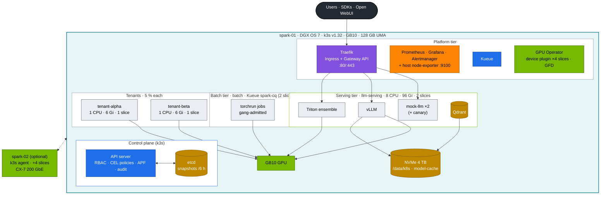
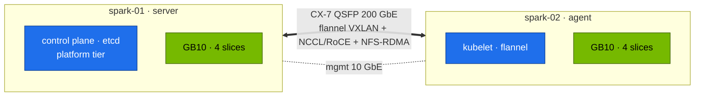

# Volume 15 — The DGX Spark Datacenter Simulation: End-to-End Build, Gates & Day-2 Operations

> **Module 02 · Part IV — NVIDIA platform** · Prev: [14 Container Toolkit & GPU sharing](14-nvidia-container-toolkit-and-gpu-virtualization.md) · Next: [16 GPU & Network Operators](16-nvidia-gpu-operator-and-network-operator.md) · Short path: [00 step-by-step](00-kubernetes-step-by-step-guide.md)

| | |
|---|---|
| **You will build** | The whole "AI datacenter in a box" on one Spark: platform, two budgeted tenants, a serving tier behind an API gateway, a gang-scheduled batch tier, observability, backups and a scripted verification gate after every layer. Everything is designed to add spark-02 without rework |
| **Hardware** | 1 DGX Spark (2 optional) · control node (laptop or spark-01) |
| **Time** | 4–6 h the first time, ~45 min once practised |
| **Risk** | Medium. Restarts k3s once (etcd migration) |
| **Lab files** | the whole [`lab/`](lab/README.md) directory |

---

## 1. What "datacenter-like" means on one box

The goal isn't scale. It's the **same shape and the same failure modes** as a production GPU platform, small enough to break and rebuild in an afternoon.

| Datacenter concept | Simulated here by | Volume |
|---|---|---|
| Control plane with HA datastore + backups | k3s embedded etcd, 6-hourly snapshots, off-box copy, restore drill | 03 |
| Identity, RBAC, admission policy, audit | x509/CSR users, tenant ClusterRoles, 4 CEL policies, PSA, audit log | 02 |
| Tenants with budgets | `tenant-alpha`/`tenant-beta` at 5 % each, GPU-slice limits | 12 |
| Shared GPU pool with scheduling policy | 4 time-slices, PriorityClasses, Kueue ClusterQueue | 05, 14 |
| Serving tier behind an API gateway | Traefik (Ingress + Gateway API), mock OpenAI API, vLLM/Triton/SGLang | 09, 21–23 |
| Batch/training tier | `batch` namespace, Kueue gangs, torchrun Indexed Jobs | 05, 17 |
| Storage tiers | NVMe local PVs (Delete/Retain), model cache, NFS for 2 nodes | 11 |
| Observability & alerting | kube-prometheus-stack + host exporters + Grafana dashboard + alerts | 16 |
| Change safety | server-side dry runs, CI on kind with fake GPUs, break/fix drills | 19, 20 |

---

## 2. HLD — the whole picture



---

## 3. LLD — the master tables

### 3.1 Network & ports

| Endpoint | Address | Notes |
|---|---|---|
| API server | `https://10.10.10.11:6443` | kubeconfig from 01 Ansible `.cache/` |
| Traefik | `10.10.10.11:80`, `:443` | hosts `llm.lab.local`, `gw.lab.local` in your laptop's `/etc/hosts` |
| Grafana (kps) | `http://10.10.10.11:32000` | admin / from Vault |
| Host Grafana (01 Ansible) | `http://10.10.10.11:3000` | node/GPU view that survives a k8s outage |
| Pod CIDR / Service CIDR / DNS | 10.42.0.0/16 · 10.43.0.0/16 · 10.43.0.10 | k3s defaults |
| CX-7 | 192.168.100.0/24, 192.168.101.0/24 | only with spark-02 |

### 3.2 Namespaces, budgets and policies

| Namespace | PSA | Quota | Admission policies | Priority |
|---|---|---|---|---|
| `tenant-alpha`, `tenant-beta` | restricted | 1 CPU · 6 Gi · 1 slice · 185 Gi · 10 pods | no-latest, ≤1 slice, no NVIDIA env | interactive |
| `llm-serving` | baseline | 8 CPU req · 96 Gi lim · 2 slices · 1 Ti | no-latest, readiness required | serving |
| `batch` | baseline | Kueue `spark-cq`: 8 CPU · 64 Gi · 2 slices | no-latest | batch |
| `lab-tools` | privileged | none (instructor namespace) | — | mixed |
| `ingress`, `observability` | baseline / privileged | none | — | platform |

### 3.3 Capacity plan (one Spark)

| Consumer | CPU | Memory (UMA) | GPU slices |
|---|---|---|---|
| system + kube reserved | 3 | 10 Gi | — |
| platform (Traefik, kps, Kueue, operators) | ~1.5 | ~8 Gi | — |
| serving (vLLM 0.30 util + Triton) | 6–8 | 40–60 Gi (engine-bounded) | 2 |
| batch | ≤ 8 | ≤ 64 Gi (queue-bounded) | ≤ 2 |
| tenants | 2 | 12 Gi | 2 |
| **headroom for page cache & spikes** | — | **≥ 20 Gi** | — |

Serving + batch + tenants can oversubscribe the 4 slices by design. Kueue and priorities decide who waits.

---

## 4. Build order with gates

Each step ends with a **gate**: a command that must pass before you continue. When a gate fails, stop and fix it. Later layers hide earlier faults.


### Step 0 · Toolchain (control node)

```bash
git clone https://github.com/cloudone365/technical-depth.git && cd "technical-depth/02 Kubernetes/lab"
pip install yamllint shellcheck-py pyyaml     # plus kubectl, kubeconform, promtool (see CI workflow)
tests/run-local-checks.sh
```

**Gate:** `ALL LOCAL CHECKS PASSED`.

### Step 1 · Base platform (01 Ansible)

```bash
cd "../../01 Ansible/lab"
ansible-playbook playbooks/05-k3s.yml && ansible-playbook playbooks/06-gpu-operator.yml
export KUBECONFIG=$PWD/.cache/kubeconfig-spark-lab.yaml
cd "../../02 Kubernetes/lab" && scripts/preflight.sh
```

**Gate:** preflight `0 failed`. `allocatable nvidia.com/gpu=4`.

### Step 2 · Control plane hardening

```bash
scripts/install-addons.sh k3s-config
kubectl get secrets -A -o json | kubectl replace -f - >/dev/null
scripts/etcd-drill.sh status && scripts/etcd-drill.sh snapshot
```

**Gate:** 1 etcd member, leader, no alarms, ≥ 1 snapshot. `sudo k3s secrets-encrypt status` shows Enabled.

### Step 3 · Platform add-ons

```bash
scripts/install-addons.sh all          # storage traefik kps kueue keda
kubectl get pods -A | grep -vE 'Running|Completed|^NAMESPACE' || echo 'all pods Running/Completed'
```

**Gate:** no pods outside `Running/Completed`. Grafana answers on :32000.

### Step 4–5 · Tenancy, policies and workloads

```bash
scripts/apply-lab.sh
scripts/verify.sh platform tenancy admission storage
```

**Gate:** all PASS.

### Step 6 · GPU

```bash
scripts/verify.sh gpu
kubectl apply -f manifests/70-gpu/gemm-solo.yaml && kubectl -n lab-tools logs -f job/gemm-solo
```

**Gate:** gpu-smoke PASS. Baseline TFLOPS recorded.

### Step 7 · Serving

```bash
kubectl apply -f manifests/60-storage/model-prefetch-job.yaml && kubectl -n llm-serving wait --for=condition=complete job/model-prefetch --timeout=30m
kubectl apply -k manifests/90-serving/vllm && kubectl -n llm-serving rollout status deploy/vllm --timeout=30m
scripts/verify.sh ingress serving
```

**Gate:** `vLLM answered a chat completion`. Streaming PASS through ingress.

### Step 8 · Batch

```bash
tests/kueue-gang-test.sh
kubectl apply -k manifests/80-distributed/base && kubectl -n batch logs -f -l job-name=ddp --prefix
```

**Gate:** gang test PASS. DDP prints `correctness OK`.

### Step 9 · Operations

```bash
kubectl apply -k manifests/95-observability
scripts/verify.sh observability
scripts/collect-diag.sh                     # know how to produce a bundle before you need one
scripts/breakfix.sh list                    # then do at least three drills (Vol 19/20)
```

**Gate:** `verify.sh` all PASS. Dashboard *Spark · Kubernetes* shows data in every row.

---

## 5. Integrations across modules

| Module | Uses this platform for |
|---|---|
| 01 Ansible | builds the base (k3s, GPU Operator, Vault, NFS, telemetry) and owns node-level config |
| 03 DeepSeek · 04 Qwen · 05 NeMo · 06 Gemma | overlays on `90-serving` (model, engine flags, quantisation), RAG on Qdrant, fine-tuning Jobs in `batch` |
| 07 Nvidia | profiling (nsys/ncu) inside `lab-tools` pods on the same GPU |
| 08 Storage | benchmarks and caches behind `model-cache` and checkpoint PVCs |

---

## 6. Verify (full gate)

```bash
scripts/verify.sh
```

```text
── platform …
── tenancy …
── admission …
── gpu …
── ingress …
── storage …
── serving …
── observability …

41 passed, 0 warnings, 0 failed
```

(The exact count grows as you deploy more of the optional layers.)

---

## 7. Day-2 operations

| Task | Frequency | How |
|---|---|---|
| etcd snapshot off-box | daily | Vol 03 §5.7 tarball to the control node |
| Restore rehearsal | monthly | `scripts/etcd-drill.sh restore …` on a quiet day |
| Version review | monthly | `versions.env` vs upstream releases. Test in CI (kind) first |
| k3s upgrade | per release | 01 Ansible `k3s_cluster_version` bump → `05-k3s.yml` → `scripts/verify.sh` |
| DGX OS / driver upgrade | per NVIDIA release | 01 Ansible `17-dgxos-upgrade.yml` (drain → upgrade → validate) → Vol 12 UMA experiment again |
| Capacity review | weekly | Grafana *Tenancy* + *UMA* rows. `PodsPendingOnGPU` alert history |
| Drills | weekly | one `breakfix` scenario, timed |

---

## 8. Troubleshooting the build

| Gate fails at | Most common cause | Fix |
|---|---|---|
| 1 | GPU Operator validator not Running | 01 Ansible Vol 17 troubleshooting. Driver/toolkit on host first |
| 2 | k3s won't restart after the drop-in | `journalctl -u k3s -n 100`. Typo in YAML → `python3 -c 'import yaml,sys; yaml.safe_load(open(sys.argv[1]))' /etc/rancher/k3s/config.yaml.d/20-k8s-lab.yaml`, fix or remove the drop-in, restart |
| 3 | `helm-install-*` Job failing | `kubectl -n kube-system logs job/helm-install-<name>`: repo unreachable (proxy/DNS) or bad `valuesContent` |
| 4 | admission tests fail | a policy binding namespace label missing → re-apply `00-platform` |
| 6 | gpu-smoke Pending | slices taken → `kubectl get pods -A` with GPU requests. Scale down demos |
| 7 | vLLM never Ready | `kubectl logs deploy/vllm`: model download, wrong image arch, `--gpu-memory-utilization` too high for free UMA (Vol 21 §9) |
| 8 | DDP hangs | Kueue not installed → both jobs started partially (Vol 05). NCCL on 1 node needs `BACKEND=gloo` |

---

## 9. Scale-out path: adding spark-02



1. Cable the QSFP ports. Run 01 Ansible `02-fabric.yml` (CX-7 addressing, MTU 9000) and `11-rdma-perftest.yml` (≥ 180 Gb/s gate).
2. Uncomment `spark-02` in the inventory and run `05-k3s.yml` (agent join, flannel on CX-7) and `06-gpu-operator.yml`.
3. `kubectl get nodes` → 2 Ready. Allocatable totals 8 slices. Raise `spark-cq` GPU quota to 4.
4. Serve weights from NFS (Vol 11 §8) instead of per-node local PVs.
5. Run `manifests/80-distributed/two-spark` (NCCL over RoCE, Vol 17).
6. The control plane still has one etcd voter. For real HA you need a third server (Vol 03 §8).

---

## 10. Checklist

- [ ] Every gate passed in order, and I know which volume to open when one fails.
- [ ] I can rebuild the whole platform from `lab/` in under an hour.
- [ ] Backups and a restore rehearsal exist, not just the backups.
- [ ] I have a written plan (and the inventory change ready) for spark-02.
