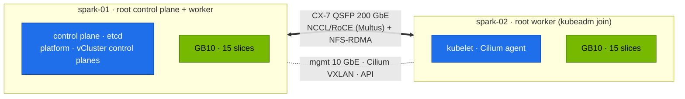

# Volume 15 — The DGX Spark Datacenter Simulation: End-to-End Build, Gates & Day-2 Operations

> **Module 02 · Part IV — NVIDIA platform** · Prev: [14 Container Toolkit & GPU sharing](14-nvidia-container-toolkit-and-gpu-virtualization.md) · Next: [16 GPU & Network Operators](16-nvidia-gpu-operator-and-network-operator.md) · Short path: [00 step-by-step](00-kubernetes-step-by-step-guide.md) · The shape: [27 Nested clusters](27-nested-clusters-with-vcluster.md)

| | |
|---|---|
| **You will build** | The whole "AI datacenter in a box" on one Spark: a kubeadm **root cluster** that owns the hardware, two **vClusters** with hard budgets (`dev-lab` for tenants, `llms` for serving and training), a serving tier behind an API gateway, a gang-scheduled batch tier, observability across all three clusters, backups and a scripted verification gate after every layer. Everything is designed to add spark-02 without rework |
| **Hardware** | 1 DGX Spark (2 optional) · control node (laptop or spark-01) |
| **Time** | 4–6 h the first time, ~45 min once practised |
| **Risk** | Medium. Everything is rebuildable: `01 Ansible playbooks/99-reset-kubernetes.yml` wipes Kubernetes, playbooks 05 → 06 → 06b rebuild it |
| **Lab files** | the whole [`lab/`](lab/README.md) directory |

---

## 1. What "datacenter-like" means on one box

The goal isn't scale. It's the **same shape and the same failure modes** as a production GPU platform, small enough to break and rebuild in an afternoon.

| Datacenter concept | Simulated here by | Volume |
|---|---|---|
| Platform cluster run by a platform team | kubeadm root cluster: static-pod control plane, Cilium, MetalLB, GPU Operator, observability | 01, 16 |
| Separate clusters per team, upgraded independently | vCluster `dev-lab` and `llms`, each with its own API server and admins | 27 |
| Hard budgets per cluster | root ResourceQuotas on `vc-dev-lab` (2 CPU · 8 Gi · 2 slices) and `vc-llms` (4 CPU · 48 Gi · 8 slices) | 12, 27 |
| Control plane with backed-up datastore | stacked etcd, 6-hourly snapshots, off-box copy, restore drill; vCluster SQLite on PVCs | 03 |
| Identity, RBAC, admission policy, audit | per-cluster x509 users, tenant ClusterRoles, 4 CEL policies, PSA, root audit log | 02 |
| Teams with budgets inside a cluster | `tenant-alpha` / `tenant-beta` in dev-lab (500m · 2 Gi · 1 slice each) | 12 |
| Shared GPU pool with scheduling policy | 15 time-slices, one root scheduler, PriorityClasses, Kueue in llms | 05, 14 |
| Serving tier behind an API gateway | Traefik in llms on `192.168.0.115` (Ingress + Gateway API), mock OpenAI API, vLLM/Triton/SGLang | 09, 21–23 |
| Batch/training tier | `batch` namespace in llms, Kueue gangs, torchrun Indexed Jobs | 05, 17 |
| Storage tiers | NVMe local PVs (Delete/Retain) offered to both vClusters, model cache, NFS for 2 nodes | 11 |
| Observability & alerting | one kube-prometheus-stack on the root that also scrapes the vClusters' workloads | 16 |
| Change safety | server-side dry runs, CI on kind with the same root + 2 vClusters, break/fix drills | 19, 20 |

---

## 2. HLD — the whole picture

```mermaid
flowchart TB
  USER(["Users · SDKs · Open WebUI"]) --> EDGE
  ADMIN(["Platform admin · kubectl<br/>contexts spark-root · dev-lab · llms"])
  subgraph SPARK["spark-01 · DGX OS 7 · GB10 · 128 GB UMA"]
    direction TB
    subgraph ROOT["Root cluster · kubeadm v1.36 · master + worker"]
      direction TB
      subgraph CP["Control plane (static pods)"]
        direction LR
        API["API server<br/>RBAC · APF · audit · encryption"]
        ETCD[("etcd<br/>snapshots /6 h")]
      end
      subgraph PLATFORM["Platform tier · root keeps 14 CPU · ~64 GiB · 5 slices"]
        direction LR
        NET["Cilium + kube-proxy<br/>MetalLB .110–.119"]
        OBS["Prometheus · Grafana · Alertmanager<br/>+ host node-exporter :9100"]
        GPUOP["GPU Operator<br/>device plugin ×15 slices · GFD"]
        PT["platform-tools<br/>ledger · probes · benchmarks"]
      end
      subgraph DEV["vc-dev-lab · vCluster dev-lab (.111) · 2 CPU · 8 Gi · 2 slices"]
        direction LR
        TA["tenant-alpha<br/>500m · 2 Gi · 1 slice"]
        TB["tenant-beta<br/>500m · 2 Gi · 1 slice"]
        LT["lab-tools<br/>netshoot · echo · drills"]
      end
      subgraph LLM["vc-llms · vCluster llms (.112) · 4 CPU · 48 Gi · 8 slices"]
        direction LR
        EDGE["Traefik .115<br/>Ingress + Gateway API"]
        SERVE["llm-serving<br/>mock-llm · vLLM · Triton · Qdrant"]
        BATCH["batch<br/>Kueue spark-cq · torchrun"]
      end
    end
    NVME[("NVMe 4 TB<br/>/data/k8s · model-cache")]
    GB10["GB10 GPU"]
  end
  S2["spark-02 (optional)<br/>root worker · +15 slices<br/>CX-7 200 GbE"]
  ADMIN --> API
  EDGE --> SERVE
  SERVE & BATCH & TA & TB & PT --> GB10
  SERVE --> NVME
  API <--> ETCD
  DEV & LLM -. "syncer → root API" .-> API
  SPARK <-.-> S2
  classDef ctrl fill:#1f6feb,stroke:#0b3d91,color:#fff
  classDef net fill:#8250df,stroke:#4c2889,color:#fff
  classDef gpu fill:#76b900,stroke:#3d6000,color:#000
  classDef store fill:#bf8700,stroke:#7a5600,color:#fff
  classDef obs fill:#fb8500,stroke:#9a5200,color:#000
  classDef tenant fill:#eaeef2,stroke:#57606a,color:#000
  classDef ext fill:#24292f,stroke:#000,color:#fff
  class API ctrl
  class EDGE,NET net
  class GB10,GPUOP,S2 gpu
  class ETCD,NVME store
  class OBS obs
  class SERVE,BATCH,TA,TB,LT,PT tenant
  class USER,ADMIN ext
  style SPARK fill:#e6f4f5,stroke:#0e7c86,stroke-width:2px
  style ROOT fill:#ffffff,stroke:#1f6feb
  style PLATFORM fill:#ffffff,stroke:#8c959f
  style CP fill:#ffffff,stroke:#1f6feb
  style DEV fill:#f6f8fa,stroke:#57606a,stroke-dasharray:5 3
  style LLM fill:#f6f8fa,stroke:#57606a,stroke-dasharray:5 3
```



---

## 3. LLD — the master tables

### 3.1 Network & ports

| Endpoint | Address | Notes |
|---|---|---|
| Root API server (`spark-root`) | `https://192.168.0.100:6443` | kubeconfig from 01 Ansible `.cache/kubeconfig-spark-lab.yaml` |
| dev-lab API (`dev-lab`) | `https://192.168.0.111:443` | MetalLB IP of the vCluster's Service; same kubeconfig |
| llms API (`llms`) | `https://192.168.0.112:443` | same |
| llms gateway (Traefik) | `192.168.0.115:80`, `:443` | hosts `llm.lab.local`, `gw.lab.local` in your laptop's `/etc/hosts` |
| Grafana (kps) | `http://192.168.0.100:32000` | admin / from Vault |
| Hubble UI | `http://192.168.0.100:31235` | Cilium flow visibility |
| Host Grafana (01 Ansible) | `http://192.168.0.100:3000` | node/GPU view that survives a Kubernetes outage |
| Pod CIDR / Service CIDR / DNS | 10.42.0.0/16 · 10.43.0.0/16 · 10.43.0.10 | set in the kubeadm config; vCluster Services get root ClusterIPs |
| MetalLB pool | 192.168.0.110–119 | reserve in your router's DHCP |
| CX-7 | 192.168.100.0/24, 192.168.101.0/24 | only with spark-02 |

### 3.2 Namespaces, budgets and policies

| Cluster · namespace | PSA | Budget | Admission policies | Priority |
|---|---|---|---|---|
| root · `vc-dev-lab` | baseline | **2 CPU req · 8 Gi · 2 slices · 300 Gi · 1 LB** | — (Cilium boundary, APF lane) | — |
| root · `vc-llms` | privileged (warn: baseline) | **4 CPU req · 48 Gi · 8 slices · 500 Gi · 2 LB** | — (Cilium boundary, APF lane) | — |
| root · `platform-tools` | privileged | none (platform team) | — | platform / preemptible |
| root · `observability`, `gpu-operator`, `metallb-system` | privileged | none | — | platform |
| dev-lab · `tenant-alpha`, `tenant-beta` | restricted | 500m · 2 Gi · 1 slice · 100 Gi · 10 pods | no-latest, ≤1 slice, no NVIDIA env | interactive |
| dev-lab · `lab-tools` | baseline | none inside (the root caps it) | — | mixed |
| llms · `llm-serving` | baseline | 2.5 CPU req · 36 Gi lim · 6 slices · 400 Gi | no-latest, readiness required | serving |
| llms · `batch` | privileged (warn: baseline). RDMA needs hostNetwork/IPC_LOCK | Kueue `spark-cq`: 2 CPU · 24 Gi · 4 slices | no-latest | batch |
| llms · `ingress` | baseline | none inside | — | platform |

### 3.3 Capacity plan (one Spark)

| Consumer | CPU | Memory (UMA) | GPU slices |
|---|---|---|---|
| system + kube reserved (kubelet) | 3 | 10 Gi | — |
| root platform (Cilium, MetalLB, kps, metrics-server, GPU Operator) | ~2 | ~8 Gi | — |
| root headroom (platform-tools jobs, growth) | ~9 | ~46 GiB | 5 |
| vCluster dev-lab (control plane ~0.3 CPU · 0.5–1 Gi included) | 2 | 8 Gi | 2 |
| vCluster llms (control plane, Traefik, Kueue, KEDA included) | 4 | 48 Gi | 8 |
| **total** | **20** | **~119.7 GiB** | **15** |

Inside llms, serving + batch can oversubscribe its 8 slices and 48 Gi by design: the root quota, Kueue and priorities decide who waits. `tests/budget_check.py` keeps these numbers honest.

---

## 4. Build order with gates

Each step ends with a **gate**: a command that must pass before you continue. When a gate fails, stop and fix it. Later layers hide earlier faults.

```mermaid
flowchart LR
  G0["0 · Toolchain<br/>run-local-checks"] --> G1["1 · Root<br/>01 Ansible kubeadm + Cilium + MetalLB + GPU Op"]
  G1 --> G2["2 · Control plane<br/>etcd · audit · encryption"]
  G2 --> G3["3 · Platform + vClusters<br/>storage · metrics · kps · dev-lab · llms"]
  G3 --> G4["4 · Tenancy<br/>ns · quotas · RBAC · CEL · APF · netpol"]
  G4 --> G5["5 · Workloads<br/>networking · Traefik · Qdrant · probes"]
  G5 --> G6["6 · GPU<br/>smoke · baseline · contention"]
  G6 --> G7["7 · Serving<br/>vLLM · Triton"]
  G7 --> G8["8 · Batch<br/>Kueue gangs · DDP"]
  G8 --> G9["9 · Ops<br/>backups · drills · dashboard"]
  classDef ctrl fill:#1f6feb,stroke:#0b3d91,color:#fff
  classDef gpu fill:#76b900,stroke:#3d6000,color:#000
  class G0,G1,G2,G3,G4,G5,G9 ctrl
  class G6,G7,G8 gpu
```



### Step 0 · Toolchain (control node)

```bash
git clone https://github.com/cloudone365/technical-depth.git && cd "technical-depth/02 Kubernetes/lab"
pip install yamllint shellcheck-py pyyaml     # plus kubectl, helm, kubeconform, promtool (see CI workflow)
tests/run-local-checks.sh
```

**Gate:** `ALL LOCAL CHECKS PASSED`.

### Step 1 · Root cluster (01 Ansible)

```bash
cd "../../01 Ansible/lab"
ansible-playbook playbooks/05-kubernetes.yml && ansible-playbook playbooks/06-gpu-operator.yml
export KUBECONFIG=$PWD/.cache/kubeconfig-spark-lab.yaml
cd "../../02 Kubernetes/lab" && scripts/preflight.sh
```

**Gate:** preflight `0 failed`. `allocatable nvidia.com/gpu=15`. No control-plane taint.

### Step 2 · Control plane hardening

```bash
kubectl --context spark-root get secrets -A -o json | kubectl --context spark-root replace -f - >/dev/null
scripts/etcd-drill.sh status && scripts/etcd-drill.sh snapshot
systemctl list-timers etcd-snapshot.timer
```

**Gate:** 1 etcd member, leader, no alarms, ≥ 1 snapshot, timer scheduled. Secrets in etcd start with `k8s:enc:aescbc:v1:` (Vol 02 §5 Step 1).

### Step 3 · Platform add-ons and vClusters

```bash
scripts/install-addons.sh all          # root: storage metrics-server kps vclusters · llms: traefik kueue keda
kubectl --context spark-root get pods -A | grep -vE 'Running|Completed|^NAMESPACE' || echo 'root: all pods Running/Completed'
scripts/verify.sh vclusters
```

**Gate:** no root pods outside `Running/Completed`. Both vClusters answer and show their budgets. Grafana answers on :32000.

### Step 4–5 · Tenancy, policies and workloads

```bash
scripts/apply-lab.sh                   # root → dev-lab → llms
scripts/verify.sh platform vclusters tenancy admission storage
```

**Gate:** all PASS.

### Step 6 · GPU

```bash
scripts/verify.sh gpu                  # gpu-smoke from inside dev-lab
kubectl --context spark-root apply -f manifests/root/70-gpu/gemm-solo.yaml
kubectl --context spark-root -n platform-tools logs -f job/gemm-solo
```

**Gate:** gpu-smoke PASS. Baseline TFLOPS recorded.

### Step 7 · Serving

```bash
kubectl --context llms apply -f manifests/llms/60-storage/model-prefetch-job.yaml
kubectl --context llms -n llm-serving wait --for=condition=complete job/model-prefetch --timeout=30m
kubectl --context llms apply -k manifests/llms/90-serving/vllm
kubectl --context llms -n llm-serving rollout status deploy/vllm --timeout=30m
scripts/verify.sh ingress serving
```

**Gate:** `vLLM answered a chat completion`. Streaming PASS through `192.168.0.115`.

### Step 8 · Batch

```bash
tests/kueue-gang-test.sh
kubectl --context llms apply -k manifests/llms/80-distributed/base
kubectl --context llms -n batch logs -f -l job-name=ddp --prefix
```

**Gate:** gang test PASS. DDP prints `correctness OK`.

### Step 9 · Operations

```bash
kubectl --context spark-root apply -k manifests/root/95-observability
scripts/verify.sh observability
scripts/collect-diag.sh                     # know how to produce a bundle before you need one
scripts/breakfix.sh list                    # then do at least three drills (Vol 19/20)
```

**Gate:** `verify.sh` all PASS. Dashboard *Spark · Kubernetes* shows data in every row, including `vcluster="llms"` serving metrics.

---

## 5. Integrations across modules

| Module | Uses this platform for |
|---|---|
| 01 Ansible | builds the base (kubeadm root, Cilium, MetalLB, GPU Operator, the vClusters, Vault, NFS, telemetry) and owns node-level config |
| 03 DeepSeek · 04 Qwen · 05 NeMo · 06 Gemma | overlays on `llms/90-serving` (model, engine flags, quantisation), RAG on Qdrant, fine-tuning Jobs in llms `batch` — sized to the llms budget |
| 07 Nvidia | profiling (nsys/ncu) in root `platform-tools` pods on the same GPU |
| 08 Storage | benchmarks and caches behind `model-cache` and checkpoint PVCs (real PVs on the root) |

---

## 6. Verify (full gate)

```bash
scripts/verify.sh
```

```text
── platform (root, context spark-root) …
── vclusters …
── tenancy (inside dev-lab) …
── admission (server-side dry-run inside each vCluster, nothing is created) …
── gpu …
── ingress (Traefik inside llms) …
── storage …
── serving (inside llms) …
── observability (root) …

58 passed, 0 warnings, 0 failed
```

(The exact count grows as you deploy more of the optional layers.)

---

## 7. Day-2 operations

| Task | Frequency | How |
|---|---|---|
| etcd snapshot off-box | daily | copy `/var/lib/etcd-snapshots/` to the control node (Vol 03 §5.7) |
| vCluster backup | weekly | scale the control plane to 0, tar its PVC directory (Vol 27 §6.7) |
| Restore rehearsal | monthly | `scripts/etcd-drill.sh restore …` on a quiet day; one vCluster PVC restore |
| Version review | monthly | `versions.env` vs upstream releases. Test in CI (kind + 2 vClusters) first |
| Kubernetes upgrade | per minor release | 01 Ansible `kubeadm_cluster_version` → `kubeadm upgrade plan/apply` (Vol 01 §8) → `scripts/verify.sh`; vCluster supports host 1.34–1.36 |
| vCluster upgrade | per release | bump `VCLUSTER_VERSION`, `helm upgrade` dev-lab first, then llms (Vol 27) |
| DGX OS / driver upgrade | per NVIDIA release | 01 Ansible `17-dgxos-upgrade.yml` (drain → upgrade → validate) → Vol 12 UMA experiment again |
| Capacity review | weekly | Grafana *vCluster CPU/memory used / hard* panels. `VClusterQuotaNearlyExhausted`, `PodsPendingOnGPU` history; resize with one `kubectl patch` (Vol 27 §6.5) |
| Drills | weekly | one `breakfix` scenario, timed |

---

## 8. Troubleshooting the build

| Gate fails at | Most common cause | Fix |
|---|---|---|
| 1 | `kubeadm init` preflight errors (swap, port 6443 busy) | an old k3s is still there → `99-reset-kubernetes.yml -e reset_remove_k3s=true`; swap → the role turns it off, check `/etc/fstab` |
| 1 | node `NotReady` | Cilium not running: `kubectl --context spark-root -n kube-system logs ds/cilium`; leftover CNI files from an earlier cluster → reset playbook |
| 1 | GPU Operator validator not Running | 01 Ansible Vol 17 troubleshooting. containerd must have the `nvidia` runtime (`grep nvidia /etc/containerd/config.toml`) |
| 2 | no etcd snapshot | `systemctl status etcd-snapshot.service`; `etcdctl` version must match the etcd image (role downloads it) |
| 3 | a vCluster never Ready | its PVC Pending → storage not installed first; `kubectl --context spark-root -n vc-<name> describe pod <name>-0` |
| 3 | `context dev-lab` unreachable | MetalLB didn't assign `.111` (pool, `services.loadbalancers` quota) → Vol 27 §8 |
| 4 | admission tests fail | a policy binding namespace label missing → re-apply `<vcluster>/00-platform` |
| 6 | gpu-smoke Pending with no events | dev-lab's 2 slices are in use → drill 02 explains it; scale down demos |
| 7 | vLLM never Ready | `kubectl --context llms logs deploy/vllm`: model download, wrong image arch, `--gpu-memory-utilization` too high for free UMA, or the llms 48 Gi budget spent by another engine (Vol 21 §9) |
| 8 | DDP hangs | Kueue not installed in llms → both jobs started partially (Vol 05). NCCL on 1 node needs `BACKEND=gloo` |

---

## 9. Scale-out path: adding spark-02



1. Cable the QSFP ports. Run 01 Ansible `02-fabric.yml` (CX-7 addressing, MTU 9000) and `11-rdma-perftest.yml` (≥ 180 Gb/s gate).
2. Uncomment `spark-02` under `k8s_workers` in the inventory and run `05-kubernetes.yml` (kubeadm join, Cilium agent) and `06-gpu-operator.yml`.
3. `kubectl --context spark-root get nodes` → 2 Ready, 30 slices allocatable. Both vClusters see the new node at once (node sync). Raise the root budgets you want to grow (`root/05-vclusters/quotas.yaml`, then `tests/budget_check.py` with `SPARK` doubled) and `spark-cq`.
4. Serve weights from NFS (Vol 11 §8) instead of per-node local PVs.
5. Run `manifests/llms/80-distributed/two-spark` (NCCL over RoCE, Vol 17).
6. The root control plane still has one etcd voter. For real HA you need three control-plane nodes (Vol 03 §8).

---

## 10. Checklist

- [ ] Every gate passed in order, and I know which volume to open when one fails.
- [ ] I can say which of the three clusters any object lives in — and find a vCluster pod's real copy on the root.
- [ ] I can rebuild the whole platform from `lab/` (reset → 05 → 06 → 06b → `install-addons.sh all` → `apply-lab.sh`) in under an hour.
- [ ] Backups and a restore rehearsal exist for etcd **and** for a vCluster, not just the backups.
- [ ] I have a written plan (and the inventory change ready) for spark-02.
