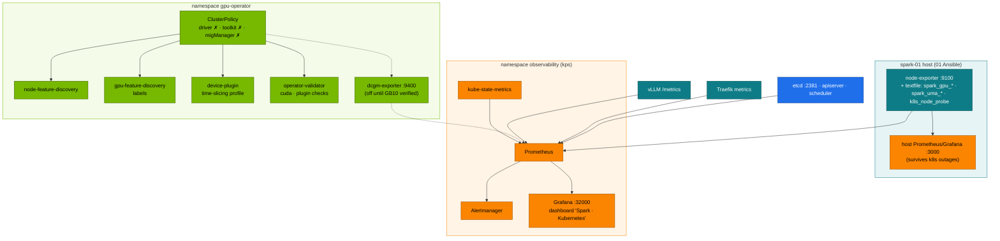

# Volume 16 — NVIDIA GPU Operator, Network Operator & GPU Observability

> **Module 02 · Part IV — NVIDIA platform** · Prev: [15 Datacenter simulation](15-dgx-spark-datacenter-simulation-lab.md) · Next: [17 Distributed training & NCCL](17-distributed-ai-training-and-nccl.md)

| | |
|---|---|
| **You will build** | Operational command of the GPU Operator that 01 Ansible installed: read its ClusterPolicy, switch device-plugin profiles per node, and read the validator. You'll add kube-prometheus-stack with host exporters, alert rules and a *Spark · Kubernetes* dashboard, and prepare the Network Operator for RDMA pod networking on 2 Sparks |
| **Hardware** | spark-01. §5.6 needs spark-02 |
| **Time** | 90 min |
| **Risk** | Low. Profile switches restart the device plugin (GPU pods keep running) |
| **Lab files** | [`addons/kube-prometheus-stack.yaml`](lab/addons/kube-prometheus-stack.yaml), [`addons/dcgm-exporter-values.md`](lab/addons/dcgm-exporter-values.md), [`manifests/95-observability/`](lab/manifests/95-observability/), [`manifests/85-network-operator/`](lab/manifests/85-network-operator/) |

---

## 1. Why this matters on a Spark

The GPU Operator is a controller (Vol 04) that turns one `ClusterPolicy` into a set of DaemonSets: feature discovery, device plugin, validator, optionally DCGM and exporters. On DGX OS it runs in **host-driver mode**: DGX OS owns the driver and container toolkit, and the operator must never install its own. Knowing which component does what tells you where to look when `nvidia.com/gpu` goes to 0.

Observability here is built to answer three questions, fast:

1. **Is the GPU healthy?** Temperature, power, clocks, throttling, Xid. Host exporters own this.
2. **Is the unified memory pool safe?** MemAvailable, page cache, MemoryPressure.
3. **Are users getting service?** Queue depth, TTFT and token latency (vLLM), pending GPU pods.

---

## 2. Architecture — HLD



**Two Prometheuses on purpose.** The 01 Ansible host stack watches the *node* and keeps working when Kubernetes is broken. kps watches the *cluster*. Both scrape the same node-exporter.

---

## 3. LLD

### 3.1 GPU Operator in host-driver mode (01 Ansible `gpu_operator` role)

| Component | State | Why |
|---|---|---|
| `driver`, `toolkit` | **disabled** | DGX OS owns them. Two owners would fight on every update |
| `devicePlugin` | on, config `time-slicing-config`, `default: any` → 4 replicas | Vol 14 |
| `gfd`, `nfd` | on | labels for selectors, Kueue flavors |
| `validator` | on | Ansible gate waits for it |
| `migManager` | off | no MIG on GB10 |
| `dcgmExporter` | off by default | enable after `dcgmi discovery -l` lists GB10 |
| chart | v25.3.0 (latest is v26.x). Upgrade via 01 Ansible `gpu_operator_chart_version` after reading the release notes |

### 3.2 Device-plugin profiles (per node)

| Profile key in `time-slicing-config` | Effect | Select with |
|---|---|---|
| `any` (default) | 4 time-slices | nothing |
| `whole-gpu` (you add it in §5.3) | 1 exclusive GPU | `kubectl label node spark-01 nvidia.com/device-plugin.config=whole-gpu` |

### 3.3 Alert rules ([`rules.yaml`](lab/manifests/95-observability/rules.yaml))

| Alert | Expression (short) | Severity |
|---|---|---|
| `SparkUMAPressure` | MemAvailable/MemTotal < 10 % for 2 m | warning |
| `SparkNodeMemoryPressureCondition` | node condition MemoryPressure | critical |
| `TenantQuotaNearlyExhausted` | used/hard > 90 % in tenant namespaces | info |
| `PodsPendingOnGPU` | GPU-requesting pods Pending > 10 m | warning |
| `VLLMQueueBacklog` / `VLLMKVCacheFull` | waiting > 32 / KV cache > 95 % | warning |
| `EtcdSlowFsync` / `EtcdDbNearQuota` | fsync p99 > 50 ms / DB > 80 % | warning / critical |
| `ConntrackTableFilling` | > 75 % | warning |
| recording rules | `spark:vllm_ttft_p95_seconds`, `spark:vllm_tpot_p95_seconds` | — |

### 3.4 Dashboard rows

| Row | Panels |
|---|---|
| Unified memory & GB10 | UMA available · GPU temp · power · Xid 24 h · slices in use · pending GPU pods · UMA vs page cache · utilisation · clocks/throttle |
| Tenancy | CPU and memory used vs hard per namespace · top-5 throttled containers |
| Serving SLOs | TTFT p95 · TPOT p95 · queue and KV cache |
| Control plane | etcd fsync p99 · API p99 (mutating) · APF rejected/queued |

The dashboard is *generated* by [`gen_dashboard.py`](lab/manifests/95-observability/gen_dashboard.py), and CI fails if the JSON drifts from the generator.

---

## 4. Integrations

- **01 Ansible Vol 09 (telemetry)**: provides `spark_gpu_*` and `spark_uma_*` metrics, and the `SparkGpuMetricsStale` rule for a textfile collector that stops updating.
- **01 Ansible Vol 17**: owns the operator's Helm values. Change replicas/profiles there, then re-run `06-gpu-operator.yml`.
- **KEDA (Vol 21)** reads Prometheus. The same metrics drive autoscaling and alerts.
- **Alertmanager → your pager**: add a receiver (Slack, e-mail, Webex webhook) in the kps values.

---

## 5. Lab

### 5.1 Read the operator's state

```bash
kubectl get clusterpolicies.nvidia.com -o jsonpath='{.items[0].status.state}{"\n"}'
kubectl -n gpu-operator get ds,pods -o wide
kubectl get clusterpolicies.nvidia.com cluster-policy -o json | jq '.spec | {driver: .driver.enabled, toolkit: .toolkit.enabled, mig: .migManager.enabled, dcgmExporter: .dcgmExporter.enabled, devicePlugin: .devicePlugin.config}'
kubectl -n gpu-operator logs -l app=nvidia-operator-validator -c nvidia-operator-validator --tail=5
```

Expected: `ready`, and `{"driver":false,"toolkit":false,"mig":false,"dcgmExporter":false,"devicePlugin":{"name":"time-slicing-config","default":"any"}}`.

### 5.2 Labels GFD wrote

```bash
kubectl get node spark-01 -o json | jq -r '.metadata.labels | to_entries[] | select(.key|startswith("nvidia.com/")) | "\(.key)=\(.value)"' | sort
```

### 5.3 Switch a node to "whole GPU" and back

```bash
kubectl -n gpu-operator patch cm time-slicing-config --type merge -p '{"data":{"whole-gpu":"version: v1\nflags:\n  migStrategy: none\n"}}'
kubectl label node spark-01 nvidia.com/device-plugin.config=whole-gpu --overwrite
sleep 45; kubectl get node spark-01 -o jsonpath='{.status.allocatable.nvidia\.com/gpu}{"  "}{.metadata.labels.nvidia\.com/gpu\.replicas}{"\n"}'   # 1  1
kubectl label node spark-01 nvidia.com/device-plugin.config-                                                                                      # back to default
sleep 45; kubectl get node spark-01 -o jsonpath='{.status.allocatable.nvidia\.com/gpu}{"\n"}'                                                  # 4
```

Use `whole-gpu` for a benchmark or a big single-model run, when you want no one else on the GPU. Running pods keep their allocation. New pods see the new count.

> The ConfigMap is owned by the 01 Ansible `gpu_operator` role. A later run of `06-gpu-operator.yml` rewrites it without your `whole-gpu` key. To make the profile permanent, add it to the role's time-slicing ConfigMap task.

### 5.4 Observability stack

```bash
cd "02 Kubernetes/lab"
scripts/install-addons.sh kps
kubectl apply -k manifests/95-observability
kubectl -n observability get prometheus,alertmanager,servicemonitors,prometheusrules
kubectl -n observability port-forward svc/kps-prometheus 9090 &
curl -s 'localhost:9090/api/v1/targets?state=active' | jq -r '.data.activeTargets[] | "\(.labels.job)  \(.health)"' | sort | uniq -c
```

Expected targets `up`: apiserver, kubelet, kube-state-metrics, coredns, etcd (via :2381), `spark-host-exporters`, traefik, and vLLM once deployed.

Open Grafana at `http://10.10.10.11:32000` → dashboard **Spark · Kubernetes**. Generate some signal and watch each row respond:

```bash
kubectl -n lab-tools scale deploy gemm-contention --replicas=2      # GPU util, slices in use
kubectl apply -f manifests/10-tenancy/experiments/cpu-throttle.yaml # throttling panel
scripts/breakfix.sh inject 02                                       # pending GPU pods; alert after 10 min
```

Check that an alert fires end to end:

```bash
curl -s localhost:9090/api/v1/alerts | jq -r '.data.alerts[] | "\(.labels.alertname) \(.state)"'
scripts/breakfix.sh reset 02; kubectl -n lab-tools scale deploy gemm-contention --replicas=0
kubectl delete -f manifests/10-tenancy/experiments/cpu-throttle.yaml; kill %1
```

### 5.5 DCGM exporter (when supported)

```bash
ssh nvidia@10.10.10.11 'dcgmi discovery -l'        # must list GB10
cd "../../01 Ansible/lab" && ansible-playbook playbooks/06-gpu-operator.yml -e gpu_operator_dcgm_exporter=true
kubectl -n gpu-operator port-forward ds/nvidia-dcgm-exporter 9400 & sleep 2
curl -s localhost:9400/metrics | grep -E '^DCGM_FI_DEV_(GPU_UTIL|GPU_TEMP|POWER_USAGE)' | head
```

If `dcgmi` doesn't list the GB10 on your DGX OS release, keep it off. The textfile metrics cover the same panels.

### 5.6 (2 Sparks) Network Operator for RDMA pod networking

```bash
helm repo add nvidia https://helm.ngc.nvidia.com/nvidia && helm repo update
helm install network-operator nvidia/network-operator -n nvidia-network-operator --create-namespace \
  --version 25.4.0 --set nfd.enabled=false --wait            # NFD already runs via the GPU Operator
kubectl apply -f manifests/85-network-operator/nicclusterpolicy.yaml
kubectl get nicclusterpolicy nic-cluster-policy -o jsonpath='{.status.state}{"\n"}'     # ready
kubectl get node -o json | jq '.items[] | {name: .metadata.name, rdma: .status.allocatable["rdma/rdma_shared_cx7"]}'
kubectl apply -f manifests/85-network-operator/rdma-test-pod.yaml && sleep 60 && kubectl -n batch logs rdma-test
```

Expected: allocatable `rdma/rdma_shared_cx7: 16` per Spark. Inside the pod you'll see `net1` with `192.168.100.1xx` and `rocep1s0f1` in `ibv_devices`. Vol 17 uses this path for NCCL, as the alternative to `hostNetwork`.

---

## 6. Verify

```bash
scripts/verify.sh gpu observability
```

| Check | Expected |
|---|---|
| ClusterPolicy state | `ready` |
| Profile switch | allocatable 4 → 1 → 4 |
| Prometheus targets | ≥ 5 `up`, including `spark-host-exporters` |
| Dashboard | every row has data after §5.4 |
| An alert | `PodsPendingOnGPU` reaches `firing` during drill 02 |

---

## 7. Troubleshooting

| Symptom | Cause | Diagnose | Fix |
|---|---|---|---|
| ClusterPolicy `notReady` | a component DaemonSet not ready | `kubectl -n gpu-operator get pods` → the failing one's logs | most often the validator: host driver/toolkit problem (Vol 13/14) |
| allocatable `nvidia.com/gpu` 0 or missing | device plugin crashed / wrong config key | `kubectl -n gpu-operator logs ds/nvidia-device-plugin-daemonset` | fix the ConfigMap (YAML inside YAML: indentation!), delete the plugin pod |
| GFD labels missing | GFD not running or NFD disabled | `kubectl -n gpu-operator get pods -l app=gpu-feature-discovery` | re-enable NFD |
| Operator tries to install a driver | values drift (`driver.enabled` true) | ClusterPolicy spec | re-run 01 Ansible `06-gpu-operator.yml` (the source of truth) |
| Prometheus target `spark-host-exporters` down | host node-exporter stopped or the node IP changed | `curl 10.10.10.11:9100/metrics` | `systemctl status prometheus-node-exporter`. Update the EndpointSlice |
| Two node-exporters fight for :9100 | kps `nodeExporter.enabled` left true | pod in CrashLoop, `bind: address already in use` | keep it false (lab values) |
| Grafana empty panels | wrong datasource variable / metric names from a different exporter version | Explore → run the panel query | regenerate the dashboard, check metric names |
| NicClusterPolicy not ready | DOCA/MOFED on the host missing or mismatched | `kubectl -n nvidia-network-operator logs …` | DGX OS provides the host driver. Never enable `ofedDriver` on Sparks |

---

## 8. Scale-out path

| Lab | Datacenter |
|---|---|
| host-driver mode | same on DGX OS / BCM. Operator-managed precompiled drivers on generic OS images |
| time-slicing profile per node | MIG profiles via `mig.config` labels (MIG Manager) on H100/B200 nodes, time-slicing on dev nodes |
| textfile + optional DCGM | DCGM everywhere + DCGM health checks + NVIDIA Health Monitoring, feeding node remediation |
| one kps | Prometheus per cluster → Thanos/Mimir, long retention, SLO burn-rate alerts |
| Network Operator for 1 link | SR-IOV + GPUDirect RDMA per rail, NVIDIA IPAM, `spectrum-x` or IB configurations (Vol 18) |

---

## 9. Checklist

- [ ] I can list what the GPU Operator runs on DGX OS and what it deliberately doesn't.
- [ ] I switched a node between 4 slices and 1 whole GPU without touching Helm.
- [ ] Prometheus scrapes host, cluster, etcd, ingress and serving metrics, and I saw an alert fire.
- [ ] I know when to enable DCGM exporter on GB10 and how to check.
