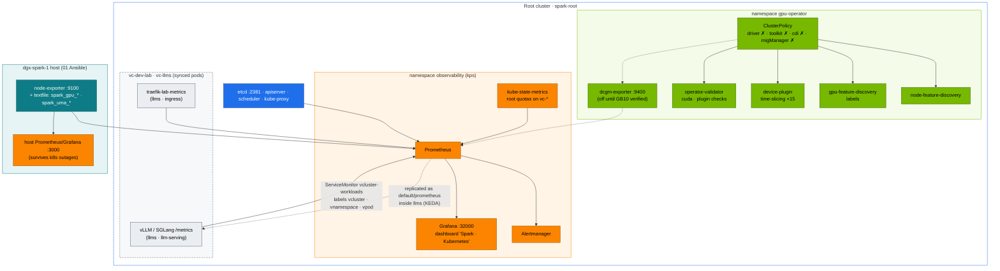

# Volume 16 — NVIDIA GPU Operator, Network Operator & GPU Observability

> **Module 02 · Part IV — NVIDIA platform** · Prev: [15 Datacenter simulation](15-dgx-spark-datacenter-simulation-lab.md) · Next: [17 Distributed training & NCCL](17-distributed-ai-training-and-nccl.md)

| | |
|---|---|
| **You will build** | Operational command of the GPU Operator that 01 Ansible installed on the root cluster: read its ClusterPolicy, switch device-plugin profiles per node and see both vClusters follow, and read the validator. You'll run kube-prometheus-stack on the root with host exporters, alert rules, a *Spark · Kubernetes* dashboard and one ServiceMonitor that reaches into the vClusters, and prepare the Network Operator for RDMA pod networking on 2 Sparks |
| **Clusters** | `spark-root` (GPU Operator, Network Operator, observability, `platform-tools` load) · `dev-lab` (`gpu-smoke`, break/fix 02) · `llms` (the RDMA test pod, serving metrics) |
| **Hardware** | dgx-spark-1. §5.6 needs dgx-spark-2 |
| **Time** | 90 min |
| **Risk** | Low. Profile switches restart the device plugin (GPU pods keep running) |
| **Lab files** | [`addons/kube-prometheus-stack-values.yaml`](lab/addons/kube-prometheus-stack-values.yaml), [`addons/dcgm-exporter-values.md`](lab/addons/dcgm-exporter-values.md), [`manifests/root/95-observability/`](lab/manifests/root/95-observability/), [`manifests/root/70-gpu/`](lab/manifests/root/70-gpu/), [`manifests/dev-lab/70-gpu/gpu-smoke.yaml`](lab/manifests/dev-lab/70-gpu/gpu-smoke.yaml), [`manifests/root/85-network-operator/`](lab/manifests/root/85-network-operator/), [`manifests/llms/85-network-operator/`](lab/manifests/llms/85-network-operator/), 01 Ansible [`roles/gpu_operator`](../01%20Ansible/lab/roles/gpu_operator) |

---

## 1. Why this matters on a Spark

The GPU Operator is a controller (Vol 04) that turns one `ClusterPolicy` into a set of DaemonSets: feature discovery, device plugin, validator, optionally DCGM and exporters. On DGX OS it runs in **host-driver mode**: DGX OS owns the driver and container toolkit, and the operator must never install its own. Knowing which component does what tells you where to look when `nvidia.com/gpu` goes to 0.

In this lab the operator is a **root-only** concern. The vClusters run no device plugin, no NFD and no GFD: they see the root's node as it is (labels, `allocatable nvidia.com/gpu: 15`) through node sync, and their GPU pods are scheduled by the root scheduler and handed a slice by the root's device plugin. One operator serves three clusters; one bad ConfigMap breaks GPUs in all of them.

Observability is built to answer three questions, fast:

1. **Is the GPU healthy?** Temperature, power, clocks, throttling, Xid. Host exporters own this.
2. **Is the unified memory pool safe?** MemAvailable, page cache, MemoryPressure.
3. **Are users getting service?** Queue depth, TTFT and token latency (vLLM inside `llms`), vCluster budgets, pending GPU pods.

---

## 2. Architecture — HLD



**Two Prometheuses on purpose.** The 01 Ansible host stack watches the *node* and keeps working when Kubernetes is broken. kps watches the *clusters*. Both scrape the same node-exporter.

**One kps for three clusters.** Tenants can't run a Prometheus Operator inside a vCluster (and it couldn't see the root's metrics anyway). The platform team scrapes the vClusters' workloads from the root, where their pods really run, and hands the result back into `llms` as the Service `default/prometheus` for KEDA (Vol 21).

---

## 3. LLD

### 3.1 GPU Operator in host-driver mode (01 Ansible `gpu_operator` role)

| Component | State | Why |
|---|---|---|
| `driver`, `toolkit` | **disabled** | DGX OS owns them. Two owners would fight on every update |
| `cdi` | **disabled** | on by default since operator v25.10; this lab injects GPUs through the `nvidia` runtime that the kubeadm role set as containerd's default (`nvidia-ctk runtime configure --set-as-default`) |
| `operator.defaultRuntime` | `containerd` | the root uses DGX OS's `containerd.io` (shared with Docker) |
| `devicePlugin` | on, config `time-slicing-config`, `default: any` → **15 replicas**, `failRequestsGreaterThanOne: true` | Vol 14. A pod asking for 2 slices is refused: 2 slices of one GPU are not 2 GPUs |
| `gfd`, `nfd` | on | labels for selectors and Kueue's `gb10` ResourceFlavor (synced into both vClusters) |
| `validator` | on | the Ansible role waits for it, then asserts every node advertises 15 |
| `migManager` | off | no MIG on GB10 |
| `dcgmExporter` | off by default | enable after `dcgmi discovery -l` lists GB10 |
| chart | `v26.7.1` (`GPU_OPERATOR_VERSION` in `versions.env`). Upgrade via 01 Ansible `gpu_operator_chart_version` after reading the release notes |

### 3.2 Device-plugin profiles (per node) and the budgets on top

| Profile key in `time-slicing-config` | Effect | Select with |
|---|---|---|
| `any` (default) | 15 time-slices | nothing |
| `whole-gpu` (you add it in §5.3) | 1 exclusive GPU | `kubectl --context spark-root label node dgx-spark-1 nvidia.com/device-plugin.config=whole-gpu` |

The 15 slices are split by **root ResourceQuotas**, not by the device plugin:

| Who | Slices | Enforced by |
|---|---|---|
| vCluster `dev-lab` | 2 | `vc-dev-lab/vcluster-budget` `requests.nvidia.com/gpu: 2` |
| vCluster `llms` | 8 | `vc-llms/vcluster-budget` `requests.nvidia.com/gpu: 8` |
| root (`platform-tools` benchmarks, probes) | 5 | **nothing** — the root has no quota on itself. It's a convention the platform team keeps |

A profile switch changes the supply; the quotas don't move. After a switch to `whole-gpu` the budgets still say 2 + 8, but only one GPU exists, and the scheduler's `Insufficient nvidia.com/gpu` becomes the binding limit (§5.3).

### 3.3 Alert rules ([`rules.yaml`](lab/manifests/root/95-observability/rules.yaml))

| Alert | Expression (short) | Severity |
|---|---|---|
| `SparkUMAPressure` | MemAvailable/MemTotal < 10 % for 2 m | warning |
| `SparkNodeMemoryPressureCondition` | node condition MemoryPressure | critical |
| `VClusterQuotaNearlyExhausted` | used/hard > 90 % of a root `vcluster-budget` (`vc-*`) for 10 m | info |
| `PodsPendingOnGPU` | GPU-requesting pods Pending **on the root** > 10 m | warning |
| `VLLMQueueBacklog` / `VLLMKVCacheFull` | waiting > 32 / KV cache > 95 %, by `vcluster`, `vnamespace` | warning |
| `EtcdSlowFsync` / `EtcdDbNearQuota` | fsync p99 > 50 ms / DB > 80 % | warning / critical |
| `ConntrackTableFilling` | > 75 % | warning |
| recording rules | `spark:vllm_ttft_p95_seconds`, `spark:vllm_tpot_p95_seconds` | — |

Two of these see the nesting differently. `VClusterQuotaNearlyExhausted` reads the root quotas, so it fires when a *whole vCluster* is nearly full; quotas *inside* a vCluster (`tenant-budget`, `serving-budget`) are invisible to the root's kube-state-metrics. `PodsPendingOnGPU` only sees pods that exist on the root. A pod that the root quota refused never got there: it waits inside its vCluster with a sync error. That's break/fix 02, and §5.4 shows that the right alert for it is the quota one.

### 3.4 Scraping inside the vClusters ([`vcluster-workloads.yaml`](lab/manifests/root/95-observability/vcluster-workloads.yaml))

| Step | What happens |
|---|---|
| select | `namespaceSelector: [vc-llms, vc-dev-lab]`, every Service |
| keep | only Services whose `vcluster.loft.sh/object-name` annotation is a model server (`vllm`, `vllm-prefill`, `vllm-decode`, `sglang`, `qwen-small-predictor` on port `http`) or `triton` / `traefik-lab-metrics` (port `metrics`) |
| relabel | `vcluster` ← `vc-(.*)` of the root namespace · `vnamespace` ← `object-namespace` · `vservice` ← `object-name` (Service) · `vpod` ← `object-name` (Pod) |
| network | tenant NetworkPolicies are synced to `vc-llms` and enforced by Cilium. The root's `vcluster-boundary` CiliumNetworkPolicy allows ingress from `observability`, and Cilium allows are a union, so the scrape gets through |

Queries then read like the tenant thinks: `vllm:num_requests_waiting{vcluster="llms", vnamespace="llm-serving"}`. The `namespace` and `pod` labels keep the root names (`vc-llms`, `vllm-…-x-llm-serving-x-llms`).

### 3.5 Dashboard rows

| Row | Panels |
|---|---|
| Unified memory & GB10 (host exporters) | UMA available · GPU temp · power · Xid 24 h · slices in use · pending GPU pods · UMA vs page cache · utilisation · clocks/throttle |
| Tenancy | vCluster CPU used / hard (root quotas) · vCluster memory used / hard (root quotas) · top-5 throttled containers |
| Serving SLOs (vLLM) | TTFT p95 · TPOT p95 (by `vcluster/vnamespace`) · queue and KV cache |
| Control plane | etcd fsync p99 · API p99 (mutating) · APF rejected/queued (shows the root's `spark-vcluster-syncers` lane) |

The dashboard is *generated* by [`gen_dashboard.py`](lab/manifests/root/95-observability/gen_dashboard.py), and CI fails if the JSON drifts from the generator.

---

## 4. Integrations

- **01 Ansible Vol 09 (telemetry)**: provides `spark_gpu_*` and `spark_uma_*` metrics, and the `SparkGpuMetricsStale` rule for a textfile collector that stops updating.
- **01 Ansible Vol 17**: owns the operator's Helm values and the time-slicing ConfigMap. Change replicas/profiles there, then re-run `06-gpu-operator.yml`. If you change the slice count, change the root quotas in `manifests/root/05-vclusters/quotas.yaml` too and run `python3 tests/budget_check.py` — it reads the slice count straight from the role's defaults.
- **01 Ansible `13-multus-rdma.yml`** is the lighter alternative to the Network Operator in §5.6 (Multus thick v4.3.0 + RDMA shared device plugin + NADs `cx7-a`/`cx7-b` in `platform-tools` and `vc-llms`). Use one of the two, not both.
- **KEDA (Vol 21)** inside `llms` reads the root's Prometheus through `default/prometheus`. The same metrics drive autoscaling and alerts.
- **Alertmanager → your pager**: add a receiver (Slack, e-mail, Webex webhook) in the kps values.

---

## 5. Lab

```bash
export KUBECONFIG="$PWD/01 Ansible/lab/.cache/kubeconfig-spark-lab.yaml"   # spark-root, dev-lab, llms
cd "02 Kubernetes/lab"
```

### 5.1 Read the operator's state

```bash
kubectl --context spark-root get clusterpolicies.nvidia.com -o jsonpath='{.items[0].status.state}{"\n"}'
kubectl --context spark-root -n gpu-operator get ds,pods -o wide
kubectl --context spark-root get clusterpolicies.nvidia.com cluster-policy -o json \
  | jq '.spec | {driver: .driver.enabled, toolkit: .toolkit.enabled, cdi: .cdi.enabled, mig: .migManager.enabled, dcgmExporter: .dcgmExporter.enabled, devicePlugin: .devicePlugin.config}'
kubectl --context spark-root -n gpu-operator logs -l app=nvidia-operator-validator -c nvidia-operator-validator --tail=5
kubectl --context spark-root -n gpu-operator get cm time-slicing-config -o jsonpath='{.data.any}{"\n"}'
```

Expected: `ready`; `{"driver":false,"toolkit":false,"cdi":false,"mig":false,"dcgmExporter":false,"devicePlugin":{"name":"time-slicing-config","default":"any"}}`; and a profile with `replicas: 15` and `failRequestsGreaterThanOne: true`.

Now look for the operator from inside a vCluster:

```bash
kubectl --context dev-lab get ns gpu-operator                     # NotFound — the operator is root-only
kubectl --context dev-lab get node dgx-spark-1 -o jsonpath='{.status.allocatable.nvidia\.com/gpu}{"\n"}'   # 15
kubectl --context dev-lab get runtimeclass nvidia                 # from manifests/common/runtimeclass
```

The tenant sees the *result* (15 allocatable slices, GFD labels, a RuntimeClass) without any of the machinery.

### 5.2 Labels GFD wrote — and who can use them

```bash
kubectl --context spark-root get node dgx-spark-1 -o json \
  | jq -r '.metadata.labels | to_entries[] | select(.key|startswith("nvidia.com/")) | "\(.key)=\(.value)"' | sort
kubectl --context llms get node dgx-spark-1 --show-labels | tr ',' '\n' | grep -c '^nvidia.com/'
```

Both commands count the same labels: node sync copies them into `llms`, which is why Kueue's ResourceFlavor `gb10` (`nodeLabels: spark.lab/gpu: gb10`) works inside a vCluster that has no GFD.

Then prove the full chain from a tenant namespace:

```bash
scripts/verify.sh gpu          # applies manifests/dev-lab/70-gpu/gpu-smoke.yaml in dev-lab/tenant-beta
```

Expected: `[PASS] allocatable nvidia.com/gpu=15 (root 5 · dev-lab 2 · llms 8)`, `[PASS] operator-validator Running`, and `[PASS] gpu-smoke: GPU 0: NVIDIA GB10 (UUID: GPU-…)`. That pod went dev-lab API → syncer → root quota → root scheduler → device plugin → nvidia runtime.

### 5.3 Switch a node to "whole GPU" and back

```bash
kubectl --context spark-root -n gpu-operator patch cm time-slicing-config --type merge \
  -p '{"data":{"whole-gpu":"version: v1\nflags:\n  migStrategy: none\n"}}'
kubectl --context spark-root label node dgx-spark-1 nvidia.com/device-plugin.config=whole-gpu --overwrite
sleep 45
kubectl --context spark-root get node dgx-spark-1 -o jsonpath='{.status.allocatable.nvidia\.com/gpu}{"  "}{.metadata.labels.nvidia\.com/gpu\.replicas}{"\n"}'   # 1  1
kubectl --context llms get node dgx-spark-1 -o jsonpath='{.status.allocatable.nvidia\.com/gpu}{"\n"}'                                                    # 1 — node sync
kubectl --context spark-root -n vc-llms get resourcequota vcluster-budget -o jsonpath='{.spec.hard.requests\.nvidia\.com/gpu}{"\n"}'                   # still 8
```

Run a benchmark on the whole GPU, then switch back:

```bash
kubectl --context spark-root -n platform-tools delete job gemm-solo --ignore-not-found
kubectl --context spark-root apply -k manifests/root/70-gpu        # the gemm-bench ConfigMap
kubectl --context spark-root apply -f manifests/root/70-gpu/gemm-solo.yaml
kubectl --context spark-root -n platform-tools logs -f job/gemm-solo
kubectl --context spark-root label node dgx-spark-1 nvidia.com/device-plugin.config-                                                                      # back to default
sleep 45; kubectl --context spark-root get node dgx-spark-1 -o jsonpath='{.status.allocatable.nvidia\.com/gpu}{"\n"}'                                     # 15
```

Use `whole-gpu` for a benchmark or a big single-model run, when you want no one else on the GPU. Running pods keep their allocation. New pods see the new count — in every cluster at once. While the node advertises 1, the vCluster budgets (2 and 8) are promises the hardware can't keep: the first GPU pod wins and every other one, in any cluster, gets `0/1 nodes are available: 1 Insufficient nvidia.com/gpu` from the root scheduler. Quotas cap demand; they never create supply.

> The ConfigMap is owned by the 01 Ansible `gpu_operator` role. A later run of `06-gpu-operator.yml` rewrites it without your `whole-gpu` key. To make the profile permanent, add it to the role's time-slicing ConfigMap task.

### 5.4 Observability stack

```bash
scripts/install-addons.sh kps
kubectl --context spark-root apply -k manifests/root/95-observability
kubectl --context spark-root -n observability get prometheus,alertmanager,servicemonitors,prometheusrules
kubectl --context spark-root -n observability port-forward svc/kps-prometheus 9090 &
curl -s 'localhost:9090/api/v1/targets?state=active' | jq -r '.data.activeTargets[] | "\(.labels.job)  \(.health)"' | sort | uniq -c
curl -s 'localhost:9090/api/v1/query' --data-urlencode 'query=up{vcluster!=""}' | jq -r '.data.result[] | "\(.metric.vcluster)/\(.metric.vnamespace)/\(.metric.vservice)  \(.value[1])"'
```

Expected targets `up`: apiserver, kubelet, kube-state-metrics, coredns, kube-proxy, etcd (via :2381), controller-manager, scheduler, `spark-host-exporters`, and — once Traefik and a model server run in `llms` — `traefik-lab-metrics` and `vllm` with `vcluster="llms"`. If the second query is empty, Traefik isn't installed yet (`scripts/install-addons.sh traefik`).

Check what `llms` sees of the root's Prometheus:

```bash
kubectl --context llms -n default get svc prometheus                  # replicated from observability/kps-prometheus
kubectl --context llms -n batch run promq --rm -i --restart=Never --image=nicolaka/netshoot:v0.13 \
  -- curl -s 'http://prometheus.default:9090/api/v1/query?query=up' | head -c 200; echo
```

Open Grafana at `http://192.168.0.100:32000` → dashboard **Spark · Kubernetes**. Generate some signal and watch each row respond:

```bash
kubectl --context spark-root -n platform-tools scale deploy gemm-contention --replicas=2   # GPU util, slices in use
kubectl --context spark-root apply -f manifests/root/12-cgroups/cpu-throttle.yaml         # throttling panel
scripts/breakfix.sh inject 02                                                             # dev-lab asks for 6 slices, has 2
```

Watch the alerts for 10–12 minutes:

```bash
curl -s localhost:9090/api/v1/alerts | jq -r '.data.alerts[] | "\(.labels.alertname) \(.labels.namespace // "") \(.state)"'
```

Expected: `VClusterQuotaNearlyExhausted vc-dev-lab firing` (the `requests.nvidia.com/gpu` budget is at 2/2) — and **no** `PodsPendingOnGPU`. The four Pending bf02 pods exist only in dev-lab's API server; the root's kube-state-metrics never saw them. Now make the root itself run out of slices, which is what `PodsPendingOnGPU` is for:

```bash
scripts/breakfix.sh reset 02
USED=$(kubectl --context spark-root get pods -A -o json | jq '[.items[] | select(.spec.nodeName != null and (.status.phase=="Running" or .status.phase=="Pending")) | .spec.containers[].resources.limits["nvidia.com/gpu"] // "0" | tonumber] | add')
kubectl --context spark-root -n platform-tools create deployment slice-hog --replicas=$((15 - USED + 1)) \
  --image=nvcr.io/nvidia/cuda:13.0.1-base-ubuntu24.04 -- sleep infinity
kubectl --context spark-root -n platform-tools set resources deploy slice-hog --limits=nvidia.com/gpu=1,memory=32Mi --requests=cpu=10m
kubectl --context spark-root -n platform-tools get pods -l app=slice-hog | grep -c Pending        # 1
```

`platform-tools` has no quota, so the root can take every slice — including the ones dev-lab and llms are "budgeted". The root's 5 slices are a convention, not a control. After 10 minutes `PodsPendingOnGPU` fires for `platform-tools`. Clean up:

```bash
kubectl --context spark-root -n platform-tools delete deploy slice-hog
kubectl --context spark-root -n platform-tools scale deploy gemm-contention --replicas=0
kubectl --context spark-root delete -f manifests/root/12-cgroups/cpu-throttle.yaml; kill %1
```

### 5.5 DCGM exporter (when supported)

```bash
ssh nvidia@192.168.0.100 'dcgmi discovery -l'        # must list GB10
# Semaphore: run template "06 GPU Operator" with extra variables {"gpu_operator_dcgm_exporter": true}
# (break-glass CLI: cd "../../01 Ansible/lab" && ansible-playbook playbooks/06-gpu-operator.yml -l dgx-spark-1,localhost -K -e gpu_operator_dcgm_exporter=true)
kubectl --context spark-root -n gpu-operator port-forward ds/nvidia-dcgm-exporter 9400 & sleep 2
curl -s localhost:9400/metrics | grep -E '^DCGM_FI_DEV_(GPU_UTIL|GPU_TEMP|POWER_USAGE)' | head; kill %1
```

If `dcgmi` doesn't list the GB10 on your DGX OS release, keep it off. The textfile metrics cover the same panels. Note that DCGM's per-pod attribution (`pod`, `namespace` labels) uses root names: a dev-lab pod shows up as `…-x-lab-tools-x-dev-lab` in `vc-dev-lab`.

### 5.6 (2 Sparks) Network Operator for RDMA pod networking

Prerequisites: dgx-spark-2 joined the root (Vol 15 §9), 01 Ansible `02-fabric.yml` and `11-rdma-perftest.yml` passed, and **01 Ansible `13-multus-rdma.yml` not applied** (both install Multus and an RDMA device plugin).

```bash
helm repo add nvidia https://helm.ngc.nvidia.com/nvidia && helm repo update
helm search repo nvidia/network-operator -l | head -3          # pick a release and pin it
NETOP_VERSION=<chosen chart version>
helm --kube-context spark-root install network-operator nvidia/network-operator -n nvidia-network-operator --create-namespace \
  --version "$NETOP_VERSION" --set nfd.enabled=false --wait      # NFD already runs via the GPU Operator
kubectl --context spark-root apply -f manifests/root/85-network-operator/nicclusterpolicy.yaml
kubectl --context spark-root get nicclusterpolicy nic-cluster-policy -o jsonpath='{.status.state}{"\n"}'     # ready
kubectl --context spark-root get node -o json | jq '.items[] | {name: .metadata.name, rdma: .status.allocatable["rdma/rdma_shared_cx7"]}'
kubectl --context spark-root -n vc-llms get network-attachment-definitions          # cx7-rdma, rendered from the MacvlanNetwork
```

The `MacvlanNetwork` names `networkNamespace: vc-llms` on purpose. Multus runs on the root and looks up a NetworkAttachmentDefinition in the namespace of the pod it is wiring — and an `llms` pod's real namespace is `vc-llms`. The pod's `k8s.v1.cni.cncf.io/networks: cx7-rdma` annotation passes through the syncer unchanged:

```bash
kubectl --context llms apply -f manifests/llms/85-network-operator/rdma-test-pod.yaml
kubectl --context llms -n batch wait --for=condition=Ready pod/rdma-test --timeout=5m
kubectl --context llms -n batch logs rdma-test
kubectl --context spark-root -n vc-llms get pod rdma-test-x-batch-x-llms \
  -o jsonpath='{.metadata.annotations.k8s\.v1\.cni\.cncf\.io/network-status}{"\n"}' | jq -r '.[] | "\(.interface // "eth0")  \(.ips)"'
kubectl --context llms -n batch delete pod rdma-test
```

Expected: allocatable `rdma/rdma_shared_cx7: 16` per Spark (`rdmaHcaMax: 16`). Inside the pod you'll see `eth0` (Cilium, `10.42.x.x`), `net1` with an address from `192.168.100.100–199` (whereabouts), and the RoCE device(s) in `ibv_devices`. The `network-status` annotation on the root copy is written by Multus and lists both interfaces. The pod's 500m CPU and 4 Gi count against `llms`'s root budget like any other. Vol 17 uses this path for NCCL as the alternative to `hostNetwork`.

---

## 6. Verify

```bash
scripts/verify.sh gpu observability
```

| Check | Expected |
|---|---|
| ClusterPolicy state | `ready`, driver/toolkit/cdi disabled |
| `gpu-smoke` from dev-lab | `PASS`, prints the GB10 |
| Profile switch | allocatable 15 → 1 → 15, seen identically in `spark-root` and `llms` |
| Prometheus targets | ≥ 5 `up`, including `spark-host-exporters`; ≥ 1 with a `vcluster` label once Traefik/vLLM run in `llms` |
| Alerts | `VClusterQuotaNearlyExhausted` fires for `vc-dev-lab` during drill 02; `PodsPendingOnGPU` fires only for root-level shortage (`slice-hog`) |
| Dashboard | every row has data after §5.4 |

---

## 7. Troubleshooting

| Symptom | Cause | Diagnose | Fix |
|---|---|---|---|
| ClusterPolicy `notReady` | a component DaemonSet not ready | `kubectl --context spark-root -n gpu-operator get pods` → the failing one's logs | most often the validator: host driver/toolkit problem, or containerd lost the `nvidia` runtime (`grep -n nvidia /etc/containerd/config.toml`, Vol 13/14) |
| allocatable `nvidia.com/gpu` 0 or missing | device plugin crashed / wrong config key | `kubectl --context spark-root -n gpu-operator logs ds/nvidia-device-plugin-daemonset` | fix the ConfigMap (YAML inside YAML: indentation!), delete the plugin pod |
| Allocatable is 15 on the root but 0/stale in a vCluster | node sync lagging or the vCluster control plane down | `kubectl --context spark-root -n vc-<name> logs <name>-0 -c syncer --tail=50` | restart the vCluster pod; `scripts/verify.sh vclusters` |
| GPU pod in a vCluster `Pending`, no events | root quota on `vc-<name>` spent, not the GPU | `kubectl --context spark-root -n vc-<name> describe resourcequota vcluster-budget` | break/fix 02, Vol 27 §8 |
| Pod asking `nvidia.com/gpu: 2` fails with `UnexpectedAdmissionError` | `failRequestsGreaterThanOne: true` | pod status message | by design: request 1 slice (tenants are also stopped earlier by CEL `spark-gpu-slice-limits`) |
| GFD labels missing | GFD not running or NFD disabled | `kubectl --context spark-root -n gpu-operator get pods -l app=gpu-feature-discovery` | re-enable NFD |
| Operator tries to install a driver | values drift (`driver.enabled` true) | ClusterPolicy spec | re-run 01 Ansible `06-gpu-operator.yml` (the source of truth) |
| Prometheus target `spark-host-exporters` down | host node-exporter stopped or the node IP changed | `curl 192.168.0.100:9100/metrics` | `systemctl status prometheus-node-exporter`. Update the EndpointSlice |
| No `vcluster=…` targets | Service not in the keep-regex, wrong port name, or a policy drop | `kubectl --context spark-root -n vc-llms get svc --show-labels`; `kubectl --context spark-root -n kube-system exec ds/cilium -- hubble observe --from-namespace observability --verdict DROPPED --last 20` | name the port `http`/`metrics`; re-apply `root/05-vclusters` (the boundary policy allows `observability`) |
| KEDA in `llms` can't reach Prometheus | `default/prometheus` not replicated | `kubectl --context llms -n default get svc prometheus` | check `observability/kps-prometheus` exists on the root, then restart the vCluster pod so the syncer re-reads `networking.replicateServices`: `kubectl --context spark-root -n vc-llms delete pod llms-0` |
| Two node-exporters fight for :9100 | kps `nodeExporter.enabled` left true | pod in CrashLoop, `bind: address already in use` | keep it false (lab values) |
| Grafana empty panels | wrong datasource variable / metric names from a different exporter version | Explore → run the panel query | regenerate the dashboard, check metric names |
| NicClusterPolicy not ready | DOCA/MOFED on the host missing or mismatched; Multus from `13-multus-rdma.yml` already present | `kubectl --context spark-root -n nvidia-network-operator logs …`; `kubectl --context spark-root -n kube-system get ds kube-multus-ds` | DGX OS provides the host driver — never enable `ofedDriver` on Sparks; use one Multus installer |
| `rdma-test` stuck `ContainerCreating`, `cx7-rdma not found` | NAD in the wrong namespace | `kubectl --context spark-root get net-attach-def -A` | it must be in `vc-llms` (the pod's root namespace), not `batch` |

---

## 8. Scale-out path

| Lab | Datacenter |
|---|---|
| host-driver mode | same on DGX OS / BCM. Operator-managed precompiled drivers on generic OS images |
| time-slicing profile per node, budgets per vCluster | MIG profiles via `mig.config` labels (MIG Manager) on H100/B200 nodes, time-slicing on dev nodes; per-team quotas or Kueue cohorts on top |
| textfile + optional DCGM | DCGM everywhere + DCGM health checks + NVIDIA Health Monitoring, feeding node remediation |
| one kps on the root scraping into vClusters | Prometheus per cluster → Thanos/Mimir, long retention, SLO burn-rate alerts; tenant-facing views via label-based multi-tenancy |
| Network Operator for 1 link, NAD per tenant namespace | SR-IOV + GPUDirect RDMA per rail, NVIDIA IPAM, `spectrum-x` or IB configurations (Vol 18) |

---

## 9. Checklist

- [ ] I can list what the GPU Operator runs on DGX OS and what it deliberately doesn't (driver, toolkit, CDI, MIG).
- [ ] I switched a node between 15 slices and 1 whole GPU without touching Helm, and saw both vClusters follow while their quotas stayed put.
- [ ] I can explain why drill 02 fires `VClusterQuotaNearlyExhausted` but not `PodsPendingOnGPU`.
- [ ] Prometheus scrapes host, root control plane, etcd, ingress and serving metrics with `vcluster`/`vnamespace` labels.
- [ ] I know when to enable DCGM exporter on GB10 and how to check.
- [ ] (2 Sparks) I know why the RDMA NetworkAttachmentDefinition lives in `vc-llms`.
