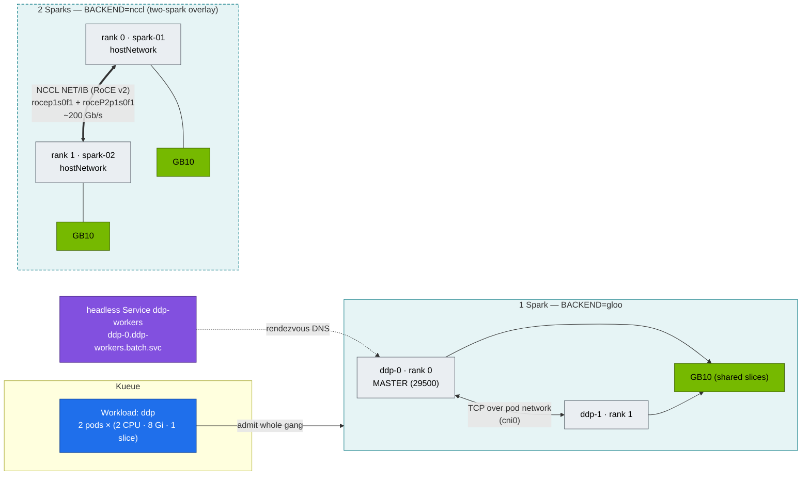

# Volume 17 — Distributed Training on Kubernetes: torchrun, NCCL, RoCE over CX-7 & Hang Diagnosis

> **Module 02 · Part V — Distributed AI & diagnostics** · Prev: [16 GPU & Network Operators](16-nvidia-gpu-operator-and-network-operator.md) · Next: [18 SuperPOD fabrics](18-large-scale-superpod-and-network-fabrics.md)

| | |
|---|---|
| **You will build** | A torchrun job that needs no training operator: an Indexed Job, a headless Service and Kueue gang admission. You'll run an all-reduce bandwidth sweep that uses `gloo` on one Spark and NCCL over RoCE on two, and a repeatable procedure for the two classic failures: the silent hang and the straggler |
| **Hardware** | spark-01 (§5.1–5.4). spark-02 + QSFP cable for §5.5 |
| **Time** | 90 min |
| **Risk** | Low |
| **Lab files** | [`manifests/80-distributed/base/`](lab/manifests/80-distributed/base/) (`allreduce_bench.py`, `ddp-job.yaml`), [`two-spark/`](lab/manifests/80-distributed/two-spark/kustomization.yaml), [`manifests/85-network-operator/`](lab/manifests/85-network-operator/) |

---

## 1. Why this matters on a Spark

A single Spark trains and fine-tunes models up to its memory limit. Two Sparks joined by the CX-7 cable are a real 2-node distributed system, the smallest one that shows every production failure mode: rendezvous, NCCL transport selection, RDMA configuration, stragglers and hangs.

### 1.1 The memory equation that decides single vs multi-node

Training memory ≈ weights + gradients + optimizer state + activations. For mixed precision with Adam:

| Method | Bytes per parameter (approx.) | 7B model | 32B model | Fits in one Spark (≈110 GiB usable)? |
|---|---|---|---|---|
| Full fine-tune, BF16 + FP32 Adam | ~16 | ~112 GB + activations | ~512 GB | 7B: no (borderline without activations). 32B: no |
| Full fine-tune, 8-bit Adam | ~10 | ~70 GB | ~320 GB | 7B: yes. 32B: no |
| LoRA on BF16 base | ~2 (+ small adapter) | ~15 GB | ~65 GB | yes / yes |
| QLoRA on 4-bit base | ~0.6 (+ adapter) | ~5 GB | ~20 GB | yes / yes |

Two Sparks with FSDP/ZeRO-3 shard weights, gradients and optimizer state, which roughly halves the per-node figure (modules 03 and 05 go deep).

---

## 2. Architecture — HLD



**Why `gloo` on one Spark?** NCCL requires one distinct GPU per rank. Two ranks on two time-slices of the *same* GB10 fail with `Duplicate GPU detected`. On one Spark you learn the orchestration with gloo, and on two you get the real NCCL path.

---

## 3. LLD

### 3.1 Job wiring

| Piece | Value | Purpose |
|---|---|---|
| Job | `completionMode: Indexed`, `completions=parallelism=2`, `backoffLimit: 0` | rank = `JOB_COMPLETION_INDEX`. Any failure fails the job (no half-restarted ranks) |
| Pod DNS | `subdomain: ddp-workers` → `ddp-<i>.ddp-workers.batch.svc.cluster.local` | stable rendezvous address |
| Service | headless, `publishNotReadyAddresses: true` | rank 1 can resolve rank 0 before readiness |
| Kueue | `queue-name: train`, `suspend: true` | both ranks or neither (Vol 05) |
| `/dev/shm` | `emptyDir: {medium: Memory, sizeLimit: 2Gi}` | NCCL/gloo and DataLoader workers use shared memory. The 64 MiB default breaks them |
| `TORCH_NCCL_ASYNC_ERROR_HANDLING=1` | turns a hung collective into an exception after the timeout | hangs become failures you can see |

### 3.2 NCCL environment (two-spark overlay)

| Variable | Value | Why |
|---|---|---|
| `NCCL_SOCKET_IFNAME` | `enp1s0f1np1` | bootstrap/OOB over the CX-7, not the 10 GbE |
| `NCCL_IB_HCA` | `rocep1s0f1,roceP2p1s0f1` | both logical halves of the QSFP port (see 01 Ansible host_vars) |
| `NCCL_IB_GID_INDEX` | `3` | RoCE v2 IPv4 GID (`show_gids` to confirm) |
| `NCCL_DEBUG` | `INFO` (then `WARN`) | shows the chosen transport: `NET/IB` good, `NET/Socket` bad |
| pod | `hostNetwork: true`, `ClusterFirstWithHostNet`, required anti-affinity | sees RoCE devices, one rank per Spark |

Alternative to `hostNetwork`: Network Operator + `rdma/rdma_shared_cx7` + macvlan `net1` (Vol 16 §5.6). Set `NCCL_SOCKET_IFNAME=net1`.

### 3.3 Bus bandwidth

`busbw = algbw × 2(n−1)/n` for all-reduce, where algbw = bytes / time. For n = 2, busbw = algbw. That's the number to compare against the link's line rate (200 Gb/s ≈ 25 GB/s).

---

## 4. Integrations

- **01 Ansible `10-nccl-test.yml` / `11-rdma-perftest.yml`** give the **host baseline** (`ib_write_bw`, `all_reduce_perf`) with no Kubernetes. If the pod result is much lower than the host result, the gap is in the pod setup: network path, `/dev/shm`, `IPC_LOCK` or GID.
- **Kueue (Vol 05)** gangs the ranks. **Storage (Vol 11)** holds checkpoints. **Vol 26** covers elastic/fault-tolerant torchrun.
- **Modules 03/05/06** replace `allreduce_bench.py` with real FSDP/DeepSpeed/Megatron jobs on the same wiring.

---

## 5. Lab

### 5.1 One Spark: gang-admitted 2-rank job with gloo

```bash
cd "02 Kubernetes/lab"
kubectl apply -k manifests/20-scheduling          # Kueue queues (Vol 05)
kubectl apply -k manifests/80-distributed/base
kubectl -n batch get workloads; kubectl -n batch get pods -l job-name=ddp -o wide
kubectl -n batch logs -f -l job-name=ddp --prefix --max-log-requests=2
```

Expected (rank 0; the numbers are illustrative):

```text
backend=gloo world=2 device=cpu
      size   time_ms  algbw_GB/s  busbw_GB/s
   1048576      0.61        1.72        1.72
   …
1073741824    312.40        3.44        3.44
correctness OK: sum(1..2) = 3.0
```

gloo moves CPU tensors over TCP through the pod network. The numbers measure *that* path, not the GPU.

### 5.2 See NCCL refuse duplicate GPUs

```bash
kubectl -n batch delete job ddp
kubectl kustomize manifests/80-distributed/base | sed 's/value: gloo/value: nccl/' | kubectl apply -f -
kubectl -n batch logs -l job-name=ddp --prefix | grep -iE 'duplicate|error' | head -3
kubectl -n batch delete job ddp
```

Expected: `ncclInvalidUsage … Duplicate GPU detected : rank 1 and rank 0 both on CUDA device …`. **One rank per physical GPU** is a hard NCCL rule, and time-slicing doesn't change it.

### 5.3 Rendezvous and gang behaviour

```bash
# no Kueue queue label → rank 1 may be scheduled late; watch rank 0 wait in rendezvous
kubectl kustomize manifests/80-distributed/base | yq 'with(select(.kind=="Job"); del(.metadata.labels["kueue.x-k8s.io/queue-name"]) | .spec.suspend = false)' | kubectl apply -f -
kubectl -n lab-tools scale deploy gemm-contention --replicas=3     # leave only 1 free slice
kubectl -n batch get pods -l job-name=ddp                           # ddp-0 Running, ddp-1 Pending
kubectl -n batch logs -l job-name=ddp --prefix --tail=3            # rank 0 waiting on c10d rendezvous
kubectl -n lab-tools scale deploy gemm-contention --replicas=0; kubectl -n batch delete job ddp
```

That's the partial-gang deadlock of Vol 05, as it looks in a real training job. The Kueue label is the fix.

### 5.4 Diagnose a hang and a straggler

Simulate a straggler: add a sleep to rank 1 only.

```bash
kubectl -n batch delete job ddp --ignore-not-found
kubectl kustomize manifests/80-distributed/base | yq 'with(select(.kind=="Job");
  .spec.template.spec.containers[0].args[0] += " & if [ \"$JOB_COMPLETION_INDEX\" = 1 ]; then sleep 20; pkill -STOP -f \"allreduce_bench[.]py$\"; sleep 90; pkill -CONT -f \"allreduce_bench[.]py$\"; fi; wait")' \
  | kubectl apply -f -
kubectl -n batch logs -f -l job-name=ddp --prefix
```

After 20 s, rank 1's Python processes freeze (SIGSTOP) for 90 s. The pattern `allreduce_bench[.]py$` matches torchrun and its worker but not the wrapping shell, whose command line doesn't *end* in `.py`. Rank 0's all-reduce timings jump from milliseconds to ~90 s for one step, **with no error**. That's what a straggler (thermal throttle, noisy neighbour, bad link) looks like from the healthy rank.

The hang triage sequence:

```bash
R0=$(kubectl -n batch get pod -l job-name=ddp,batch.kubernetes.io/job-completion-index=0 -o name)
R1=$(kubectl -n batch get pod -l job-name=ddp,batch.kubernetes.io/job-completion-index=1 -o name)
kubectl -n batch exec "$R0" -- sh -c 'pip install -q py-spy && py-spy dump --pid $(pgrep -f "python.*allreduce_bench" | tail -1)'
kubectl -n batch exec "$R1" -- sh -c 'for p in $(pgrep -f allreduce_bench); do grep State /proc/$p/status; done'
```

| Evidence | Reading |
|---|---|
| all ranks in `all_reduce` / `ncclKernel` | collective waiting for a peer. Find the rank that *isn't* there |
| one rank in dataloader / I/O / `T (stopped)` | that rank is the straggler |
| `NCCL WARN … Timeout` then `ProcessGroupNCCL … watchdog` after `TORCH_NCCL_ASYNC_ERROR_HANDLING` | hang converted to an error. Check that rank's node |

### 5.5 Two Sparks: NCCL over RoCE

Prerequisites: spark-02 joined (Vol 15 §9), 01 Ansible `11-rdma-perftest.yml` ≥ 180 Gb/s, Kueue `spark-cq` GPU quota raised to 4.

```bash
kubectl apply -k manifests/80-distributed/two-spark
kubectl -n batch get pods -l job-name=ddp -o wide          # one on spark-01, one on spark-02
kubectl -n batch logs -l job-name=ddp --prefix | grep -E 'NCCL INFO (NET/|Using network|Channel 00)|busbw|correctness' | head -20
```

Look for:

```text
NCCL INFO NET/IB : Using [0]rocep1s0f1:1/RoCE [1]roceP2p1s0f1:1/RoCE ; OOB enp1s0f1np1:192.168.100.11<0>
NCCL INFO Using network IB
…
1073741824     48.9       21.96       21.96
correctness OK: sum(1..2) = 2+1 = 3.0
```

A large-message busbw in the low twenties of GB/s means you're close to line rate. If you see `NET/Socket` or single-digit GB/s, go to §7.

---

## 6. Verify

| Check | Expected |
|---|---|
| gloo job | `correctness OK`, both ranks admitted together |
| NCCL on one GPU | `Duplicate GPU detected` (by design) |
| 2 Sparks | `Using network IB`, busbw at 1 GiB ≥ 80 % of the 01 Ansible host baseline |

---

## 7. Troubleshooting

| Symptom | Cause | Diagnose | Fix |
|---|---|---|---|
| rank 0 waits forever at start | rank 1 not scheduled (no gang) or can't resolve master | `kubectl get pods -o wide`. `getent hosts ddp-0.ddp-workers.batch.svc.cluster.local` from rank 1 | Kueue label. `publishNotReadyAddresses` on the headless Service |
| `Duplicate GPU detected` | two ranks on one GPU | NCCL log | 1 rank per GPU. gloo for single-GPU tests |
| `NET/Socket` instead of `NET/IB` | RDMA devices not visible in the pod | `ibv_devices` inside the pod | hostNetwork or Network Operator. `NCCL_IB_HCA` names |
| `ibv_create_qp failed` / `Cannot allocate memory` | no `IPC_LOCK` / memlock limit | pod securityContext | add `IPC_LOCK` (batch namespace is privileged for this) |
| NCCL connects then very slow | wrong GID index (RoCE v1 vs v2), MTU mismatch, only one of the two logical ports used | `show_gids`, `ip link` MTU on both, NCCL log channel list | `NCCL_IB_GID_INDEX=3`, MTU 9000 both ends, list both HCAs |
| `Bus error` / DataLoader crash | `/dev/shm` too small | `df -h /dev/shm` in the pod | memory-backed emptyDir (the lab sets 2 Gi) |
| Job restarts one rank only | `backoffLimit > 0` with non-elastic torchrun | job events | `backoffLimit: 0` + restart the whole job, or elastic torchrun (Vol 26) |

---

## 8. Scale-out path

| Lab | Datacenter |
|---|---|
| Indexed Job + headless Service | JobSet / Kubeflow Trainer (`TrainJob`) / MPI Operator: same wiring, more features |
| 2 ranks, 1 link | 8 GPUs/node over NVLink (NCCL `P2P/NVLS`) + 8 rails of 400 Gb/s IB/RoCE between nodes (Vol 18) |
| hostNetwork RoCE | SR-IOV VFs per rail, GPUDirect RDMA, topology-aware placement (Kueue TAS), SHARP in-network reductions |
| gloo on one GPU | not needed. Real GPUs per rank |

---

## 9. Checklist

- [ ] I launched a gang-admitted 2-rank torchrun job with no training operator.
- [ ] I can explain why NCCL refuses two ranks on one time-sliced GPU.
- [ ] I produced and diagnosed a straggler from the healthy rank's point of view.
- [ ] (2 Sparks) NCCL reports `NET/IB` over both CX-7 halves, near line rate.
