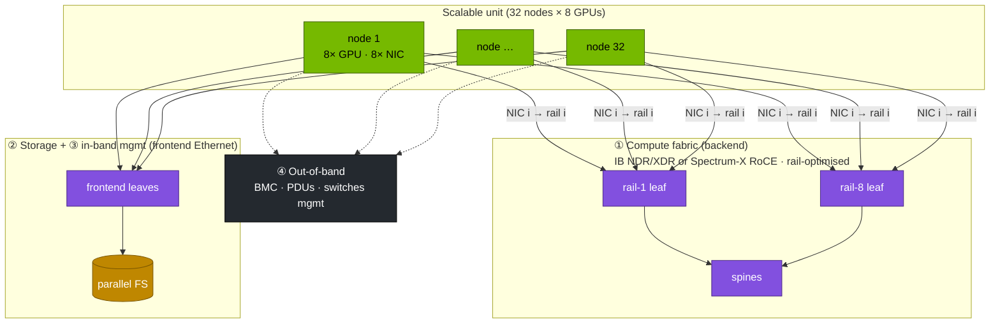
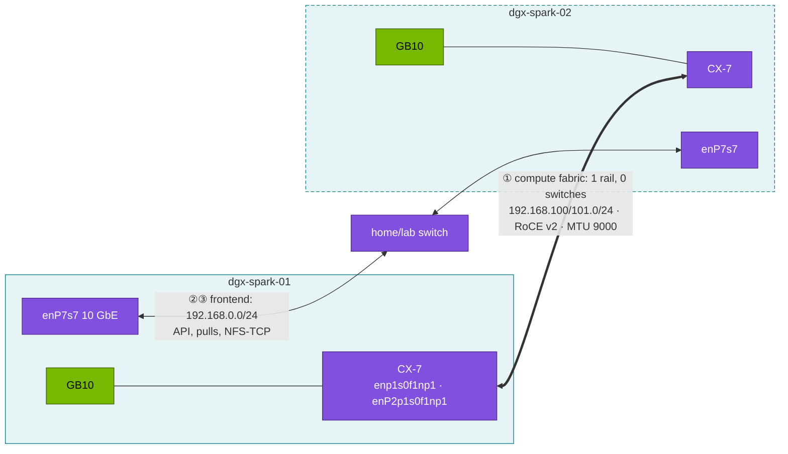
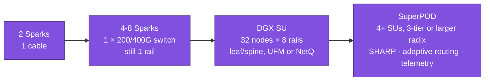

# Volume 18 — From Two Sparks to a SuperPOD: Fabrics, Rails, RoCE vs InfiniBand, and Fabric Health

> **Module 02 · Part V — Distributed AI & diagnostics** · Prev: [17 Distributed training](17-distributed-ai-training-and-nccl.md) · Next: [19 Diagnostics playbook](19-cluster-diagnostics-and-failure-scenarios.md)

| | |
|---|---|
| **You will build** | A working model of datacenter AI fabrics anchored in hardware you can touch: the two-Spark CX-7 link as a "one-rail, zero-switch" fabric. You'll read and interpret NIC counters, simulate a degraded link and watch NCCL react, and size a rail-optimised fat tree with a calculator |
| **Clusters** | mostly the hosts and the cable. `spark-root` (nodes, conditions, taints, dgx-spark-02 as a worker) · `llms` (the NCCL job in `batch`, §5.3–5.4) |
| **Hardware** | 1 Spark for §5.1–5.2 and §5.5. 2 Sparks + QSFP cable for §5.3–5.4 |
| **Time** | 75 min |
| **Risk** | Low. §5.4 takes one logical CX-7 port down for a minute |
| **Lab files** | [`scripts/fabric_calc.py`](lab/scripts/fabric_calc.py), [`manifests/llms/80-distributed/two-spark/`](lab/manifests/llms/80-distributed/two-spark/kustomization.yaml). 01 Ansible `playbooks/02-fabric.yml`, `11-rdma-perftest.yml`, `12b-roce-qos.yml` |

---

## 1. Why this matters on a Spark

You won't cable 1,000 GPUs at home. You *will* meet every concept in a SuperPOD on your two Sparks:

| SuperPOD concept | On two Sparks |
|---|---|
| Compute (backend) fabric, 400–800 Gb/s per GPU | the QSFP cable, 200 Gb/s, RoCE v2 |
| Rails (GPU *i* of every node on the same leaf) | 1 GPU/node → 1 rail |
| Frontend network (storage, management, users) | the 10 GbE `enP7s7` |
| Out-of-band management (BMC) | none on the Spark. The 01 Ansible Redfish lab simulates it |
| Lossless Ethernet (PFC/ECN) or InfiniBand credit flow control | RoCE QoS settings from 01 Ansible `12b-roce-qos.yml` |
| Link flaps, symbol errors, degraded lanes | `ethtool -S` counters, a downed logical port |
| Frontend vs backend inside Kubernetes | pod network = Cilium VXLAN over `enP7s7`; a second pod interface `net1` on the CX-7 via Multus (Vol 16 §5.6) or `hostNetwork` |
| Many tenants on one shared fabric | both vClusters' pods run on the root's nodes and share the same NICs and cable; the fabric is a **root** concern no tenant can see or configure |
| Fabric-aware admission (health gates, topology) | a node condition or taint on the root, synced into both vClusters; the root scheduler enforces it for everyone |

---

## 2. Architecture — HLD

### 2.1 The four networks of an AI datacenter



### 2.2 The same shape at lab scale



---

## 3. LLD

### 3.1 Why "rail-optimised"

In a node with 8 GPUs and 8 NICs, NIC *i* sits next to GPU *i* (same PCIe switch). If NIC *i* of every node plugs into the same **rail leaf**, then the dominant collective traffic (GPU *i* ↔ GPU *i* across nodes, in ring/tree all-reduce) crosses **one switch hop**. Cross-rail traffic moves over NVLink inside the node first (NCCL PXN), then onto the right rail.

### 3.2 Sizing (from `fabric_calc.py`)

| Design | Nodes × GPUs | Radix | Leaves | Spines | Cables | Bisection |
|---|---|---|---|---|---|---|
| Two Sparks | 2 × 1 | — | 0 | 0 | 1 | 0.2 Tb/s |
| 1 scalable unit | 32 × 8 | 64 | 8 | 4 | 512 | 51.2 Tb/s |
| 4 SUs (127 nodes) | 127 × 8 | 64 | 32 | 16 | 2,040 | 203 Tb/s |

### 3.3 InfiniBand vs Spectrum-X Ethernet (RoCE)

| | InfiniBand (Quantum-2/X800) | Spectrum-X Ethernet (RoCE v2) | Spark CX-7 link |
|---|---|---|---|
| Losslessness | credit-based, built in | PFC + ECN (+ adaptive routing, congestion control in SuperNIC/switch) | PFC/ECN optional on a direct cable |
| Management | Subnet Manager (UFM/opensm) | standard Ethernet + NetQ/Cumulus | none (point-to-point) |
| Addressing | LID/GUID, IPoIB optional | IP + GID (RoCE v2 = UDP/4791) | IP + GID index 3 |
| Ops skills | specialised | Ethernet teams feel at home | — |
| NCCL | `NET/IB` | `NET/IB` (verbs over RoCE) | `NET/IB` |

### 3.4 Counters that matter

| Counter (`ethtool -S <if>`) | Means | Healthy |
|---|---|---|
| `rx_crc_errors_phy`, `rx_symbol_err_phy` | bad cable/optic/lane | 0 and not increasing |
| `rx_discards_phy`, `rx_out_of_buffer` | NIC or host couldn't keep up | ~0 |
| `rx_pause_ctrl_phy` / `tx_pause_ctrl_phy` | PFC pause frames | small. A storm means congestion or misconfig |
| `np_cnp_sent` / `rp_cnp_handled` | ECN/DCQCN congestion notifications | present under heavy load, not at idle |
| `link_down_events_phy` | flaps | 0 |

### 3.5 Where the fabric sits in the nested design

| Layer | Owns | Sees the fabric as |
|---|---|---|
| hosts (01 Ansible) | netplan, MTU, GIDs, PFC/ECN, perftest gate | netdevs `enp1s0f1np1`, `enP2p1s0f1np1`; RDMA devices `rocep1s0f1`, `roceP2p1s0f1` |
| root cluster (`spark-root`) | nodes, Multus / Network Operator, NADs (in `platform-tools`, `vc-llms`), RDMA device plugin, node conditions and taints | allocatable `rdma/rdma_shared_cx7`, node labels, `net1` attachments |
| vCluster `llms` | the training Job, Kueue, its PSA (`batch` privileged) | a node list (synced) and a resource name to request — nothing else |
| vCluster `dev-lab` | nothing on the fabric | it could request the resource, but its PSA (`baseline` on `vc-dev-lab`) forbids `hostNetwork` and `IPC_LOCK` |

A tenant can't tell a degraded rail from a slow job. The platform team's health check (§5.5) has to turn fabric state into something the shared scheduler acts on.

---

## 4. Integrations

- **01 Ansible** owns the link: `cx7_fabric` role (netplan, MTU, GIDs), `12b-roce-qos.yml` (PFC/ECN trust, DSCP), `11-rdma-perftest.yml` (the ≥ 180 Gb/s gate).
- **Vol 17** puts NCCL on this link from inside the `llms` vCluster. **Vol 16 §5.6** can hand it to pods via the Network Operator (NAD in `vc-llms`).
- **Module 07 Nvidia** (NVLink/NVSwitch, Quantum/Spectrum, UFM) and **module 08 Storage** (RoCE for storage traffic) go deeper on the same fabric ideas.

---

## 5. Lab

### 5.1 Inventory the CX-7 (1 Spark)

```bash
ssh nvidia@192.168.0.100
ibdev2netdev                               # rocep1s0f1 port 1 ==> enp1s0f1np1 (Up) …
for i in enp1s0f1np1 enP2p1s0f1np1; do ethtool $i | grep -E 'Speed|Link detected'; ip -br link show $i; done
rdma link show
sudo lspci -d 15b3: -nn                    # Mellanox/NVIDIA devices and PCIe IDs
```

Note that one physical QSFP cage shows up as **two** netdevs and two RDMA devices, one per PCIe root. You need both to reach 200 Gb/s (01 Ansible Vol 11 explains why).

### 5.2 Size real fabrics

```bash
cd "02 Kubernetes/lab"
python3 scripts/fabric_calc.py --nodes 2 --gpus 1 --radix 2 --link-gbps 200
python3 scripts/fabric_calc.py --nodes 32 --gpus 8 --radix 64 --link-gbps 400
python3 scripts/fabric_calc.py --nodes 127 --gpus 8 --radix 64 --link-gbps 400
python3 scripts/fabric_calc.py --nodes 64 --gpus 8 --radix 128 --link-gbps 800   # next-gen radix/speed
```

Exercise: how many optical transceivers does the 127-node design need, if every node↔leaf and leaf↔spine link is optical with one transceiver per end? (Answer: `cables × 2`.)

### 5.3 (2 Sparks) Baseline and counters

```bash
cd "../../01 Ansible/lab" && ansible-playbook playbooks/11-rdma-perftest.yml     # host RDMA baseline
ssh nvidia@192.168.0.100 'ethtool -S enp1s0f1np1 | grep -E "crc|symbol|discard|pause|cnp|link_down" | grep -v ": 0$"'
```

Then run the NCCL job (Vol 17 §5.5) and diff the counters before and after. PFC pause counters rising only during the run, and discards staying at 0, is healthy lossless behaviour.

### 5.4 (2 Sparks) Degrade the fabric and watch NCCL

```bash
# take ONE logical half down on dgx-spark-02 for the duration of a run
ssh nvidia@192.168.0.101 'sudo ip link set enP2p1s0f1np1 down'
kubectl --context llms delete -k manifests/llms/80-distributed/two-spark --ignore-not-found
kubectl --context llms apply -k manifests/llms/80-distributed/two-spark
kubectl --context llms -n batch logs -l job-name=ddp --prefix | grep -E 'NET/IB|busbw|1073741824|WARN' | head
ssh nvidia@192.168.0.101 'sudo ip link set enP2p1s0f1np1 up'
kubectl --context llms delete -k manifests/llms/80-distributed/two-spark
```

Expected: NCCL warns about the missing HCA or uses only one device, and large-message busbw drops to roughly **half**. That's the signature of a degraded rail or a half-seated cable. It's also why fabric health checks run *before* a job is admitted in large clusters.

### 5.5 Build a fabric health check

A pre-flight any scheduler could call before admitting a multi-node job:

```bash
cat > /tmp/fabric-health.sh <<'EOF'
#!/usr/bin/env bash
# exit 0 = healthy; non-zero = do not schedule distributed jobs here
fail=0
for i in enp1s0f1np1 enP2p1s0f1np1; do
  [[ $(cat /sys/class/net/$i/operstate) == up ]] || { echo "$i down"; fail=1; }
  [[ $(cat /sys/class/net/$i/mtu) == 9000 ]] || { echo "$i mtu $(cat /sys/class/net/$i/mtu)"; fail=1; }
  errs=$(ethtool -S $i | awk -F: '/crc_errors_phy|symbol_err_phy|link_down_events_phy/ {s+=$2} END {print s+0}')
  [[ $errs -eq 0 ]] || { echo "$i error counters=$errs"; fail=1; }
done
exit $fail
EOF
chmod +x /tmp/fabric-health.sh && /tmp/fabric-health.sh && echo HEALTHY
```

In Kubernetes, this becomes a node-problem-detector custom plugin on the **root**. A failing check sets a node condition, and a taint keeps distributed jobs away. Simulate the outcome by hand:

```bash
kubectl --context spark-root taint node dgx-spark-02 spark.lab/fabric=degraded:NoSchedule
kubectl --context llms describe node dgx-spark-02 | grep -i taint          # synced into the vCluster
kubectl --context llms apply -k manifests/llms/80-distributed/two-spark
kubectl --context llms -n batch get pods -l job-name=ddp -o wide       # rank 1 Pending: untolerated taint
kubectl --context llms delete -k manifests/llms/80-distributed/two-spark
kubectl --context spark-root taint node dgx-spark-02 spark.lab/fabric-
```

The tenant sees the reason in its own events (`1 node(s) had untolerated taint {spark.lab/fabric: degraded}`) without any access to the fabric. Note the scope: a taint stops *every* new pod on that node, in every cluster — break/fix 13 shows that blast radius on one node. A production check would use a dedicated taint that only distributed jobs care about, or a node label that the training ResourceFlavor selects on. The 01 Ansible `spark_validate` role runs the same checks at the host level.

---

## 6. Verify

| Check | Expected |
|---|---|
| `ibdev2netdev` | both RDMA devices `Up` (with the cable connected) |
| host RDMA baseline | ≥ 180 Gb/s (01 Ansible gate) |
| NCCL busbw with one half down | ≈ 50 % of normal |
| `fabric-health.sh` | `HEALTHY` with both halves up. Fails with one down |

---

## 7. Troubleshooting

| Symptom | Likely cause | Check | Fix |
|---|---|---|---|
| Link `Up` but ~100 Gb/s | only one logical half in use | NCCL log device list, `rdma link` | list both HCAs. Both IPs configured |
| CRC/symbol errors increasing | cable/optic/dirty connector | `ethtool -S` twice, 60 s apart | reseat, clean, replace the DAC/AOC |
| Throughput collapses under load, pause counters huge | PFC storm / mismatched QoS | `rx_pause_ctrl_phy`, `mlnx_qos -i <if>` | align trust mode + PFC priority both ends (01 Ansible `12b-roce-qos.yml`) |
| RDMA works host-to-host, NCCL in pods uses sockets | pod can't see RDMA devices | `kubectl --context llms -n batch exec <pod> -- ibv_devices` | hostNetwork / Network Operator; the NAD must be in `vc-llms` (Vol 16 §5.6, Vol 17 §3.3) |
| Link flaps | thermal/power, bad cable | `link_down_events_phy`, `dmesg \| grep mlx5` | replace the cable. Check airflow |

---

## 8. Scale-out path



Design rules that carry over unchanged from your two Sparks: MTU and QoS identical end to end, both halves of every NIC in use, counters watched continuously, fabric health checked before admission, and the host RDMA baseline recorded for every link.

---

## 9. Checklist

- [ ] I can name the four networks of an AI datacenter and the lab equivalent of each.
- [ ] I sized a 32-node and a 127-node rail-optimised fabric and can explain leaf/spine counts.
- [ ] I read CX-7 counters and know which ones mean "bad cable" vs "congestion".
- [ ] I degraded a link on purpose and saw NCCL bandwidth halve.
- [ ] I can say which fabric facts a vCluster tenant can see (node taints, labels, a resource name) and which only the root can.
