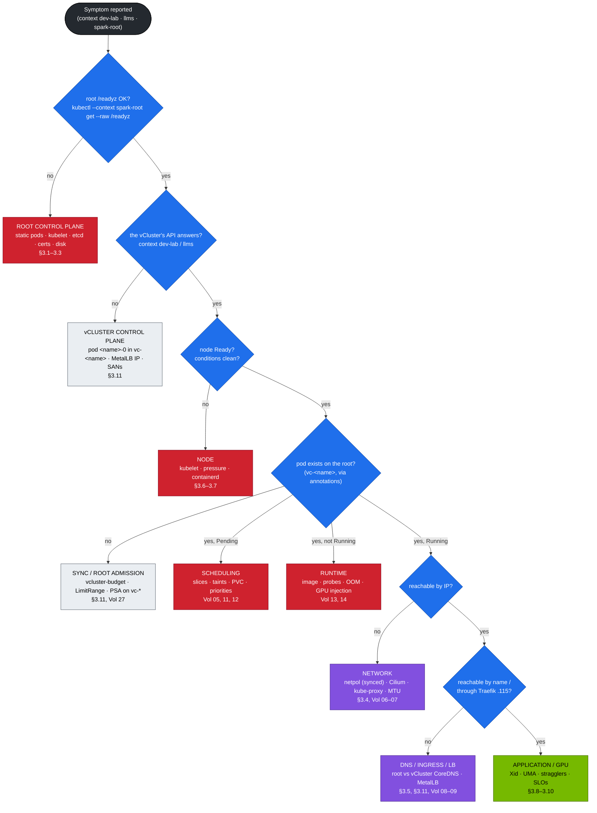

# Volume 19 — Cluster Diagnostics & Failure Playbook for a DGX Spark Kubernetes Platform

> **Module 02 · Part V — Distributed AI & diagnostics** · Prev: [18 Fabrics](18-large-scale-superpod-and-network-fabrics.md) · Next: [20 Workbook](20-hands-on-practice-exercises-workbook.md)

| | |
|---|---|
| **You will build** | A triage method you can follow under pressure across three API servers, a support bundle, runbooks for the failures that actually happen on a Spark (static-pod control plane, etcd, kubeadm certificates, Cilium, DNS, GPU/Xid, unified memory, stragglers) and for the ones the nesting adds (syncer down, root quota refusing a synced pod, MetalLB pool exhausted), and fifteen injectable drills to practise them |
| **Clusters** | all three: `spark-root` (control plane, node, GPU, budgets), `dev-lab` and `llms` (tenant symptoms). Every drill names the cluster it breaks |
| **Hardware** | dgx-spark-1 |
| **Time** | 2 h (plus drills over time) |
| **Risk** | Drills are reversible. BF-15 (UMA pressure) and the etcd restore are the only risky ones, and both ask first |
| **Lab files** | [`scripts/breakfix.sh`](lab/scripts/breakfix.sh), [`breakfix/`](lab/breakfix/), [`scripts/collect-diag.sh`](lab/scripts/collect-diag.sh), [`scripts/verify.sh`](lab/scripts/verify.sh), [`scripts/etcd-drill.sh`](lab/scripts/etcd-drill.sh), [`scripts/lib.sh`](lab/scripts/lib.sh) (`host_pod`), [`manifests/root/95-observability/rules.yaml`](lab/manifests/root/95-observability/rules.yaml) |

---

## 1. The triage method

Work **outside-in** and **top-down**. Prove each layer before blaming the next. In this lab there is a question before all the others: **which cluster reported the symptom, and which cluster owns the layer that failed?** A tenant sees a Pending pod in `dev-lab`; the cause is almost always one level down, on the root.



The `Q3` box is the one that's new compared with a single cluster. A vCluster pod has two copies: the one the tenant sees and the one the root runs (`<pod>-x-<namespace>-x-<vcluster>` in `vc-<vcluster>`, Vol 27 §3.4). If the root copy doesn't exist, no amount of scheduler or kubelet debugging will help.

**Always first:**

```bash
export KUBECONFIG="$PWD/01 Ansible/lab/.cache/kubeconfig-spark-lab.yaml"
cd "02 Kubernetes/lab"
scripts/verify.sh                   # which layer is red, in which cluster?
scripts/collect-diag.sh             # freeze the evidence before you change anything (run it ON the Spark for host facts)
kubectl --context spark-root get events -A --sort-by=.lastTimestamp | tail -30
kubectl --context <dev-lab|llms> get events -A --sort-by=.lastTimestamp | tail -30
```

[`collect-diag.sh`](lab/scripts/collect-diag.sh) writes `diag-<timestamp>.tar.gz` with three parts:

| Part | Contents |
|---|---|
| `root/` | version, nodes (+ describe), all pods, events, every ResourceQuota/LimitRange, NetworkPolicies **and** CiliumNetworkPolicies, `/readyz?verbose`, APF rejected/in-queue metrics, and a describe + logs (+ previous logs) of every pod in `kube-system`, `gpu-operator`, `metallb-system`, `observability`, `platform-tools`, `vc-dev-lab`, `vc-llms` (or the root namespaces you pass as arguments) |
| `dev-lab/`, `llms/` | pods, events, quotas, ValidatingAdmissionPolicies/Bindings, and per-namespace dumps — or a `<context>-UNREACHABLE.txt` marker if that API server didn't answer |
| host (when run on the Spark) | `/proc/meminfo`, `nvidia-smi -q`, 2 h of `journalctl -u kubelet -u containerd`, `crictl ps -a`, `dmesg` filtered for Xid/NVRM/OOM/NVMe, conntrack count |

---

## 2. Evidence map: where each layer writes its story

| Layer | Primary evidence | Command |
|---|---|---|
| Static-pod control plane | kubelet journal, container logs, pod log files | `sudo journalctl -u kubelet --since -30m -p warning` · `sudo crictl ps -a --name 'kube-apiserver\|etcd'` · `sudo crictl logs <id>` · `sudo ls /var/log/pods/ \| grep kube-system_` |
| API decisions (root) | audit log | `sudo jq -c 'select(.responseStatus.code>=400) \| [.user.username,.verb,.objectRef.namespace,.objectRef.resource,.responseStatus.code]' /var/log/kubernetes/audit/audit.log \| tail` |
| API decisions (vCluster) | the vCluster's own API server | `kubectl --context spark-root -n vc-llms logs llms-0 -c syncer --since=30m` |
| etcd (root only) | endpoint status, alarms, metrics | `scripts/etcd-drill.sh status` |
| Sync (vCluster → root) | syncer log, events on the virtual pod | `kubectl --context spark-root -n vc-<v> logs <v>-0 -c syncer --since=30m \| grep -iE 'error\|forbidden\|quota'` |
| Root admission of synced pods | the virtual pod's events, root quota | `kubectl --context <v> -n <ns> describe pod <p>` · `kubectl --context spark-root -n vc-<v> describe resourcequota vcluster-budget` |
| Scheduling | pod events (the root scheduler; copied into the vCluster) | `kubectl --context <ctx> describe pod` → Events |
| Controllers | object events, `.status.conditions` | `kubectl --context <ctx> describe rs/job/deploy` |
| Containers | logs (current + previous), lastState | `kubectl --context <ctx> logs --previous`, `-o jsonpath='{.status.containerStatuses}'` |
| Node | conditions, kubelet, dmesg | `kubectl --context spark-root describe node`, `sudo dmesg -T` |
| Pod network | Cilium agent, Hubble flows | `kubectl --context spark-root -n kube-system exec ds/cilium -- cilium-dbg status --brief` · `… -- hubble observe --verdict DROPPED --last 20` |
| GPU | Xid, nvidia-smi, validator | `sudo dmesg -T \| grep -i xid`, `nvidia-smi -q`, `kubectl --context spark-root -n gpu-operator get pods` |
| Metrics / alerts | Prometheus, Grafana | dashboard *Spark · Kubernetes* (root kps, `vcluster` labels for tenant workloads) |

Finding the root copy of a vCluster pod is a step you'll do constantly. The lab's scripts do it through vCluster's annotations (`host_pod` in `lib.sh`); by hand:

```bash
kubectl --context spark-root -n vc-llms get pods \
  -o custom-columns=ROOT:.metadata.name,VNS:.metadata.annotations.vcluster\\.loft\\.sh/object-namespace,VPOD:.metadata.annotations.vcluster\\.loft\\.sh/object-name
```

---

## 3. Runbooks

### 3.1 API server unreachable

kubeadm runs the control plane as static pods: the **kubelet** reads `/etc/kubernetes/manifests/*.yaml` and starts them through containerd. There is no `kube-apiserver.service` to check.

| Step | Command | Look for |
|---|---|---|
| kubelet up? | `systemctl status kubelet` · `sudo journalctl -u kubelet -n 200 --no-pager` | kubelet itself crashing (bad `/var/lib/kubelet/config.yaml`, containerd socket missing), or `static pod` errors |
| apiserver container? | `sudo crictl ps -a --name kube-apiserver` · `sudo crictl logs $(sudo crictl ps -a -q --name kube-apiserver \| head -1)` | `Exited` with a restart count; the last lines name the bad flag, the cert, or `connection refused 127.0.0.1:2379` (→ etcd, §3.2) |
| the files | `sudo ls -la /etc/kubernetes/manifests/` · `sudo ls /var/log/pods/ \| grep kube-system_kube-apiserver` | a stray file (the kubelet runs **every** non-hidden file in that directory — a `kube-apiserver.yaml.bak` is a second apiserver fighting for :6443) |
| disk full? | `df -h / /var/lib/etcd /var/lib/containerd /var/log` | 100 % → etcd and containerd fail; audit logs grow fast at `RequestResponse` |
| memory? | `free -g`, `sudo dmesg -T \| grep -i oom` | control-plane process OOM-killed under UMA pressure (§3.7) |

Fixes: free disk (`sudo crictl rmi --prune`, old etcd snapshots in `/var/lib/etcd-snapshots`, rotated audit logs); revert the last edit to a manifest (keep backups **outside** `/etc/kubernetes/manifests`); restore etcd (Vol 03 §5.6) as a last resort.

What the vClusters do meanwhile: their own API servers keep answering (`kubectl --context dev-lab get pods` works, from SQLite), but their syncers can't reach the root. Existing pods keep running; new pods stay Pending inside the vCluster, and status stops updating. A tenant reports "my pods are stuck" while the root is down — always check `Q0` first.

### 3.2 etcd: NOSPACE or slow

```bash
sudo etcdctl --endpoints=https://127.0.0.1:2379 --cacert=/etc/kubernetes/pki/etcd/ca.crt \
  --cert=/etc/kubernetes/pki/etcd/healthcheck-client.crt --key=/etc/kubernetes/pki/etcd/healthcheck-client.key \
  endpoint status -w table
scripts/etcd-drill.sh status        # same flags: members, DB size, alarms, latest snapshots, timer
sudo crictl logs --tail 50 $(sudo crictl ps -q --name '^etcd$')
```

`mvcc: database space exceeded` → compact → defrag → `alarm disarm` (Vol 03 §5.5). Slow fsync (`EtcdSlowFsync`, `apply request took too long` in the etcd log) → find the competing writer (`sudo iotop -oa`: checkpoint jobs, fio in `platform-tools`, model downloads to `/data/k8s`). Rehearse NOSPACE in the sandbox, never on the root: `scripts/etcd-sandbox.sh fill`.

Remember what etcd *doesn't* hold: the vClusters' objects live in SQLite on their PVCs (`data-dev-lab-0`, `data-llms-0` under `/data/k8s`). A vCluster whose API server logs `database is locked` or `disk I/O error` has a storage problem on its PVC, not an etcd problem. A root etcd restore doesn't roll vClusters back (Vol 27 §6.7).

### 3.3 Certificates

kubeadm issues 1-year leaf certificates (10-year CAs) and renews them automatically on every `kubeadm upgrade apply`. A cluster that is never upgraded for a year eventually serves expired certs. The kubelet's client certificate rotates itself.

```bash
sudo kubeadm certs check-expiration
sudo kubeadm certs renew all                     # planned renewal
# the static pods only load new certs when they restart: move the manifests out and back
sudo mkdir -p /etc/kubernetes/manifests.off && sudo mv /etc/kubernetes/manifests/*.yaml /etc/kubernetes/manifests.off/
sleep 20 && sudo mv /etc/kubernetes/manifests.off/*.yaml /etc/kubernetes/manifests/
until kubectl --context spark-root get --raw /readyz >/dev/null 2>&1; do sleep 3; done; echo root back
```

`admin.conf` was renewed too: re-fetch the kubeconfig with 01 Ansible `05-kubernetes.yml` (then `06b-vclusters.yml`, which merges the vCluster contexts into the same file). Users made with `make-user.sh … spark-root` keep working until their own cert expires; they were signed by the CA, which didn't change.

The vClusters have their own CAs and certificates, generated by vCluster at install. An `x509` error against `192.168.0.111`/`.112` is usually a missing SAN (Vol 27 §8), occasionally expiry:

```bash
echo | openssl s_client -connect 192.168.0.112:443 2>/dev/null | openssl x509 -noout -enddate -ext subjectAltName
```

### 3.4 Pod network partition

Symptoms: pods Running, same-node traffic OK, cross-node traffic fails (2 Sparks), or everything fails after a reboot or a reset.

```bash
kubectl --context spark-root -n kube-system exec ds/cilium -- cilium-dbg status --brief
kubectl --context spark-root -n kube-system exec ds/cilium -- cilium-dbg status | grep -E 'KubeProxyReplacement|Routing|IPAM'
ip -d link show cilium_vxlan; ip -br addr show cilium_host
sudo ls /etc/cni/net.d/                                     # 05-cilium.conflist (+ 00-multus.conf if 13-multus-rdma ran)
sudo iptables -S FORWARD | head; sysctl net.ipv4.ip_forward
sudo tcpdump -ni enP7s7 udp port 8472 -c 5                  # VXLAN between Sparks (mgmt network)
kubectl --context spark-root -n kube-system exec ds/cilium -- hubble observe --verdict DROPPED --last 20
```

Usual causes: `ip_forward=0` after a hardening change; ufw blocking 8472/udp between the Sparks; MTU mismatch on the VXLAN path; **leftover CNI configs** from an earlier cluster (flannel files from an old k3s install in `/etc/cni/net.d` win by sort order — run 01 Ansible `99-reset-kubernetes.yml -e reset_remove_k3s=true`). Hubble `DROPPED` with `Policy denied` is not a partition: it's a NetworkPolicy, possibly one a tenant wrote inside a vCluster and the syncer copied to `vc-*` (break/fix 06), or the root's `vcluster-boundary` doing its job between `vc-dev-lab` and `vc-llms`.

### 3.5 DNS

There are three CoreDNS instances: the root's (`kube-system/coredns`, `10.43.0.10`) for root pods, and one inside each vCluster for its tenants. Find out which one the failing pod uses before you touch anything:

```bash
kubectl --context <ctx> -n <ns> exec <pod> -- cat /etc/resolv.conf     # nameserver = root 10.43.0.10, or a vCluster DNS Service IP
kubectl --context spark-root -n kube-system get deploy coredns; kubectl --context spark-root -n kube-system logs deploy/coredns --tail=20
kubectl --context llms -n kube-system get pods                          # the vCluster's own CoreDNS (runs on the root in vc-llms)
```

Then try by IP, then by name (Vol 08 §5.5). Common faults: replicas at 0 (break/fix 07), a syntax error in an edited Corefile (`root/30-networking/coredns-corefile.yaml` — kubeadm has no `coredns-custom` import), upstream loops. Break/fix 07 shows the uneven blast radius: the root's CoreDNS down breaks platform pods at once, while cluster names inside a vCluster keep resolving through that vCluster's own CoreDNS.

### 3.6 Node NotReady

```bash
kubectl --context spark-root describe node dgx-spark-1 | sed -n '/Conditions/,/Addresses/p'
sudo journalctl -u kubelet | grep -iE 'PLEG|not ready|runtime|eviction' | tail
sudo crictl info | jq '.status.conditions'
sudo systemctl status containerd --no-pager | head -5
```

`PLEG is not healthy` means containerd is slow or stuck. Often it's disk I/O saturation, or thousands of dead containers (`sudo crictl rm $(sudo crictl ps -a -q --state exited)`). The root's containerd is DGX OS's `containerd.io`, shared with Docker: Kubernetes containers live in containerd namespace `k8s.io`, Docker's in `moby` (`sudo ctr -n k8s.io containers ls | wc -l`). A Docker workload that fills `/var/lib/containerd` takes the node down too.

One node, three clusters: when dgx-spark-1 is NotReady, both vClusters show it NotReady as well (node sync), and the root's node controller starts tainting it (`node.kubernetes.io/not-ready`). Fix the root; the vClusters follow.

### 3.7 Unified-memory pressure (the Spark-specific one)

| Signal | Where |
|---|---|
| `SparkUMAPressure`, `SparkNodeMemoryPressureCondition` alerts | Alertmanager (root kps) |
| `MemAvailable` low, `Cached` high | `scripts/uma-watch.sh <ns> <pod> [context]`, Grafana UMA row |
| CUDA OOM in serving logs while pods are under their limits | `kubectl --context llms -n llm-serving logs deploy/vllm` |
| `Evicted` events — in every cluster | `kubectl --context spark-root get events -A --field-selector reason=Evicted` (and the same with `--context dev-lab`, `--context llms`) |

The vCluster memory budgets are quotas, not reservations: they cap what each vCluster may *ask for*, and protect nothing against a root pod (or a host process, or the page cache) that eats the pool. The kubelet evicts by QoS and usage once `memory.available < 4Gi` (the 01 Ansible `evictionHard`), and it doesn't care which cluster a pod came from.

Order of actions: (1) stop or scale down `spark-preemptible` and `spark-batch` work (root `platform-tools`, `llms` `batch`), (2) drop page cache (`sync; echo 3 | sudo tee /proc/sys/vm/drop_caches`, or 01 Ansible `24-uma-relief.yml`), (3) lower engine memory fractions (`--gpu-memory-utilization`), (4) revisit the capacity plan (Vol 15 §3.3). Drill: BF-15.

### 3.8 GPU errors (Xid)

```bash
sudo dmesg -T | grep -iE 'NVRM: Xid' | tail
nvidia-smi -q | sed -n '/Clocks Event Reasons/,/Sync Boost/p'
kubectl --context spark-root -n gpu-operator get pods; kubectl --context spark-root get node dgx-spark-1 -o jsonpath='{.status.allocatable.nvidia\.com/gpu}{"\n"}'
```

| Xid | Meaning | Usually | Action |
|---|---|---|---|
| 13 | Graphics engine exception | application bug (bad kernel, OOB access) | fix the app. Node OK |
| 31 | GPU memory page fault | application (illegal address) | fix the app. Run compute-sanitizer (module 07) |
| 43 | GPU stopped processing | app fault or driver | restart the pod. If it recurs without app changes → driver |
| 45 | preemptive cleanup | follows other errors / killed contexts | look at the *preceding* Xid |
| 48 / 94 / 95 | ECC errors (contained/uncontained) | hardware memory | drain. Reboot if uncontained. Repeated → RMA |
| 62 / 109 | internal micro-controller / context-switch timeout | driver/firmware, occasionally app | collect `nvidia-bug-report.sh`, update DGX OS |
| 79 | GPU has fallen off the bus | hardware/power/thermal | drain + power cycle. Repeated → RMA |
| 119 / 120 | GSP RPC timeout / GSP error | firmware/driver | reboot. Update DGX OS. Report |
| 74 | NVLink error | not applicable to GB10 (no external NVLink) | — |

Which tenant triggered it? Xid lines usually carry the PID of the process that owned the GPU context. `sudo cat /proc/<PID>/cgroup` shows its kubepods path, which contains the pod UID (with `_` instead of `-`); `kubectl --context spark-root get pods -A -o custom-columns=NS:.metadata.namespace,NAME:.metadata.name,UID:.metadata.uid | grep <uid>` then gives the root name — and `vc-llms` / `-x-<ns>-x-<vcluster>` tell you whose it was.

Drain procedure: 01 Ansible `playbooks/21-emergency-drain.yml` (cordon → capture → stop → reboot → validate → return). A root drain evicts vCluster pods too, and respects their PDBs (synced to `vc-*`, break/fix 11).

### 3.9 Stragglers and hangs (distributed jobs)

From Vol 17 §5.4: all ranks stuck in a collective means find the absent rank. A rank that is `Pending` inside `llms` with a quota event isn't hung — the gang never formed (Vol 17 §5.3). Per-rank step-time spread above ~10 % means a straggler. Check that rank's CPU throttling (`scripts/cgroup-inspect.sh batch <pod> llms`, Vol 12), its GPU clocks (`nvidia-smi -q -d PERFORMANCE`), its NIC counters (Vol 18) and its data loader.

### 3.10 Serving SLO breaches

| Symptom | Metric (labels `vcluster`, `vnamespace`, `vpod` from `vcluster-workloads`) | Cause |
|---|---|---|
| TTFT p95 up, queue up | `vllm:num_requests_waiting`, `spark:vllm_ttft_p95_seconds` | load > capacity. Scale (if the `llms` budget allows), or lower `max-num-seqs` to protect latency |
| TPOT up | `spark:vllm_tpot_p95_seconds` | GPU contention (other slices busy — possibly another cluster's), thermal throttling |
| KV cache ~100 %, preemptions | `vllm:kv_cache_usage_perc` (`vllm:gpu_cache_usage_perc` on older releases) | context lengths grew. Raise utilisation or lower `max-model-len` |
| 5xx at ingress | Traefik metrics (`traefik-lab-metrics` in `llms`) | readiness flaps, timeouts, empty EndpointSlices (Vol 09, break/fix 08) |
| HPA/KEDA doesn't scale | `kubectl --context llms -n llm-serving describe scaledobject` | `default/prometheus` missing in `llms`, or new replicas refused by the root quota |

### 3.11 vCluster-specific failures

| Failure | Symptom (tenant side) | Evidence (root side) | Fix |
|---|---|---|---|
| **Syncer / vCluster control plane down** | `kubectl --context dev-lab …` times out or `connection refused`; existing pods keep serving | `kubectl --context spark-root -n vc-dev-lab get pods` → `dev-lab-0` not Running (OOMKilled at its memory limit, PVC Pending, evicted) · `kubectl --context spark-root -n vc-dev-lab logs dev-lab-0 -c syncer --previous` | fix the cause (memory limit in `vclusters/<name>.yaml`, storage), then `kubectl --context spark-root -n vc-dev-lab delete pod dev-lab-0`. Tenant pods are root pods: they survive, but nobody can change them until it's back |
| **Root quota rejects a synced pod** | pod `Pending` in the vCluster with **no scheduler events**; a syncer warning naming `vcluster-budget` | the pod is absent from `vc-<name>`; `kubectl --context spark-root -n vc-<name> describe resourcequota vcluster-budget` shows the resource at its hard limit; `VClusterQuotaNearlyExhausted` | free budget inside the vCluster, queue with Kueue (llms), or resize (Vol 27 §6.5). Drill: BF-02 |
| **Root LimitRange / PSA rejects a synced pod** | same "Pending, no events"; the warning says `maximum memory usage per Container is 8Gi` or `violates PodSecurity` | root LimitRange `vcluster-defaults` (`max` 8 Gi in dev-lab, 40 Gi in llms), PSA labels on `vc-*` | right-size the container; RDMA/hostNetwork work belongs in `llms` (privileged), not `dev-lab` (baseline) |
| **MetalLB pool exhausted** | a LoadBalancer Service stays `<pending>`; `kubectl --context <v>` for a *new* vCluster never works | `kubectl --context spark-root get svc -A --field-selector spec.type=LoadBalancer` (10 addresses, `.110–.119`); `kubectl --context spark-root -n metallb-system logs -l app.kubernetes.io/component=controller \| grep -i alloc`; `kubectl --context spark-root get ipaddresspool -n metallb-system lab-pool -o yaml` | delete an unused LB Service, or grow the pool in 01 Ansible `metallb_pool_addresses` (and reserve it in DHCP); pin new vCluster IPs with `metallb.io/loadBalancerIPs` |
| **`services.loadbalancers` quota** | tenant's LoadBalancer Service rejected | root quota allows 1 (dev-lab: its API) / 2 (llms: API + Traefik) | by design; tenants publish through Traefik in `llms`, not their own LBs |
| **Node sync / StorageClass sync stale** | tenant sees an old node state, or no StorageClass | syncer log; `kubectl --context <v> get nodes,sc` vs root | restart `<v>-0`; check `sync.fromHost` in `vclusters/<name>.yaml` |
| **SQLite PVC full** | vCluster API errors on writes, `database or disk is full` in the syncer log | `kubectl --context spark-root -n vc-<v> exec <v>-0 -c syncer -- df -h /data` | grow the PVC (5 Gi in the lab values) or clean up churny objects (Events, old Jobs) |

---

## 4. The drill catalogue

These are exactly the scenarios in [`scripts/breakfix.sh`](lab/scripts/breakfix.sh) (`scripts/breakfix.sh list`). **Cluster** is the context the fault is injected into — and where the symptom first shows; the cause may sit one layer down.

| # | Cluster | Scenario (`breakfix.sh` title) | Layer | Inject | Primary diagnosis |
|---|---|---|---|---|---|
| 01 | dev-lab | Quota: only some replicas start | admission (inner quota) | `breakfix.sh inject 01` | ReplicaSet events in `tenant-alpha`: `tenant-budget` — dev-lab's own API server refused |
| 02 | dev-lab | Pending in the vCluster, nothing on the root | sync / root admission | 02 | syncer event `vcluster-budget` on the virtual pod; pod absent from `vc-dev-lab` |
| 03 | dev-lab | Image pull failure | runtime | 03 | pod events (`manifest unknown`), copied from the root pod |
| 04 | dev-lab | OOMKilled | runtime | 04 | `lastState.terminated`; `memory.events` via `cgroup-inspect.sh lab-tools bf04-oom dev-lab` |
| 05 | llms | Liveness probe kills a slow-loading model | runtime | 05 | probe events in `llm-serving`; missing startupProbe |
| 06 | llms | NetworkPolicy blocks the ingress controller | network | 06 | `kubectl --context llms -n llm-serving get netpol`; Hubble `DROPPED` on the root |
| 07 | spark-root | Root cluster DNS down | DNS | 07 | root CoreDNS 0/0; by IP vs by name from `platform-tools/netshoot-host` vs dev-lab `netshoot` |
| 08 | llms | Service with no endpoints | network | 08 | empty EndpointSlice for `bf08-api` (selector typo) |
| 09 | llms | Streaming arrives in one blob | ingress | 09 | TTFB ≈ total; Traefik buffering middleware |
| 10 | dev-lab | GPU visible to a pod that didn't ask for one | GPU runtime | 10 | default runtime `nvidia` + image `NVIDIA_VISIBLE_DEVICES=all`; quota doesn't count it |
| 11 | spark-root | Drain blocked by a PodDisruptionBudget | ops | 11 | `kubectl --context spark-root get pdb -A` → qdrant's PDB, written in `llms`, synced to `vc-llms` |
| 12 | dev-lab | PVC stuck Pending | storage | 12 | PVC events: StorageClass `fast-nvme` not found; `kubectl --context dev-lab get sc` |
| 13 | spark-root | Node tainted NoSchedule | scheduling | 13 | `kubectl --context spark-root describe node \| grep -i taint` — all three clusters stop |
| 14 | dev-lab | Deployment creates no pods | admission (CEL) | 14 | ReplicaSet `FailedCreate`: `spark-no-latest-tag` in `tenant-beta` |
| 15 | spark-root | Unified-memory pressure (RISKY) | node/GPU | 15 | node `MemoryPressure`, evictions in every cluster |

Two of these (02 and 11) only exist because of the nesting, and three (07, 13, 15) are injected into the root but felt in every cluster. Practise them until "which cluster?" is a reflex.

How to drill properly: have someone else inject (or pick a random number), **time yourself**, write down the first command that showed the cause, then `answer` to compare. Reset with `scripts/breakfix.sh reset all`.

---

## 5. Lab

```bash
scripts/breakfix.sh list
n=$(printf '%02d' $(( (RANDOM % 14) + 1 ))); echo "drill $n"; scripts/breakfix.sh inject "$n"   # 01–14; 15 only on purpose
# … diagnose using §1 and §3 only …
scripts/breakfix.sh hint "$n"; scripts/breakfix.sh answer "$n"; scripts/breakfix.sh reset "$n"
scripts/collect-diag.sh && tar tzf diag-*.tar.gz | head -40
```

Then rehearse the three vCluster-specific failures that `breakfix.sh` doesn't script.

**Syncer down** (dev-lab's control plane):

```bash
kubectl --context dev-lab -n lab-tools get pods                         # works
kubectl --context spark-root -n vc-dev-lab scale statefulset dev-lab --replicas=0
kubectl --context dev-lab -n lab-tools get pods --request-timeout=5s    # fails: no API server
kubectl --context spark-root -n vc-dev-lab get pods | grep -- '-x-lab-tools-x-dev-lab'   # tenant pods still Running
scripts/collect-diag.sh >/dev/null && tar tzf diag-*.tar.gz | grep UNREACHABLE         # the bundle records it
kubectl --context spark-root -n vc-dev-lab scale statefulset dev-lab --replicas=1
kubectl --context spark-root -n vc-dev-lab rollout status statefulset dev-lab --timeout=5m
```

**Root quota rejects a synced pod:** BF-02, then confirm both halves of the evidence:

```bash
scripts/breakfix.sh inject 02
P=$(kubectl --context dev-lab -n lab-tools get pods -l app=bf02 --field-selector=status.phase=Pending -o name | head -1)
kubectl --context dev-lab -n lab-tools describe "$P" | tail -4
kubectl --context spark-root -n vc-dev-lab get pods | grep -c bf02       # 2 — only the admitted ones exist on the root
scripts/breakfix.sh reset 02
```

**MetalLB pool exhausted:** count what's left, then fill it from the root (the vCluster quotas would stop a tenant before the pool ran out):

```bash
kubectl --context spark-root get svc -A --field-selector spec.type=LoadBalancer \
  -o custom-columns=NS:.metadata.namespace,NAME:.metadata.name,IP:.status.loadBalancer.ingress[0].ip
FREE=$((10 - $(kubectl --context spark-root get svc -A --field-selector spec.type=LoadBalancer --no-headers | wc -l)))
for i in $(seq 1 $((FREE + 1))); do
  kubectl --context spark-root -n platform-tools create service loadbalancer lb-fill-$i --tcp=80:80 >/dev/null
done
kubectl --context spark-root -n platform-tools get svc | grep lb-fill | grep -c '<pending>'      # 1
kubectl --context spark-root -n platform-tools describe svc lb-fill-$((FREE + 1)) | tail -3
kubectl --context spark-root -n platform-tools delete svc $(kubectl --context spark-root -n platform-tools get svc -o name | grep lb-fill | sed 's#service/##')
```

The last Service waits with a MetalLB allocation-failure event. If that had been a third vCluster's API Service, its context would simply never connect — the `context … unreachable` row of Vol 27 §8.

---

## 6. Verify

| Check | Expected |
|---|---|
| `collect-diag.sh` | tarball with `root/` (nodes, events, quotas, CNPs, readyz, APF, per-namespace describes/logs), `dev-lab/`, `llms/` (or an UNREACHABLE marker), and host files (meminfo, nvidia-smi, kubelet/containerd journal, crictl, filtered dmesg) |
| 5 drills done | each fixed within 10 min, first diagnostic command recorded, at least one from each cluster |
| vCluster failures | syncer-down, quota-reject and pool-exhausted rehearsed; you named the cluster that owned each |
| `breakfix.sh reset all` then `verify.sh` | all PASS |

---

## 7. Anti-patterns

| Don't | Because | Instead |
|---|---|---|
| restart the kubelet / reboot as step 1 | destroys evidence (previous logs, dmesg, stuck state) and restarts the control plane and every vCluster at once | `collect-diag.sh` first |
| debug only from the context that reported the symptom | half the causes live one layer down (root quota, root scheduler, node) | follow §1: find the root copy, read the root's events |
| `kubectl delete pod` in a loop | the controller recreates the same broken pod | read events/lastState, fix the spec |
| edit synced objects on the root (`vc-*`) | the syncer owns them and puts the virtual spec back | change the object inside the vCluster |
| leave backups in `/etc/kubernetes/manifests` | the kubelet runs every file there | keep copies elsewhere |
| raise every limit "to be safe" | hides leaks and breaks the UMA budget; the root quota refuses it anyway | measure, then size (Vol 12) |
| disable NetworkPolicies / admission to "test" | you'll forget to re-enable them | server-side dry-run tests (`scripts/apply-lab.sh --dry-run`), targeted exceptions |

---

## 8. Scale-out path

At scale, the same runbooks get automated. Node-problem-detector sets conditions, a remediation controller cordons and drains, DCGM diagnostics gate re-admission, and alerts link straight to runbooks. The `runbook` annotation on `SparkUMAPressure` points at §3.7 here. With many tenant clusters, the platform team also alerts on syncer health and root-quota saturation per vCluster — the two failures tenants can't diagnose themselves.

---

## 9. Checklist

- [ ] I can walk the triage tree from any symptom to the right layer **and the right cluster** in under two minutes.
- [ ] I can find a vCluster pod's root copy, its syncer log and its root quota without looking up the commands.
- [ ] I can diagnose a static-pod control-plane failure with `journalctl -u kubelet`, `crictl` and `/var/log/pods`, and renew kubeadm certificates.
- [ ] I know the Spark-specific failure (UMA pressure) and its order of actions.
- [ ] I can read an Xid and decide app vs node vs hardware.
- [ ] I've done at least five drills and recorded my times.
