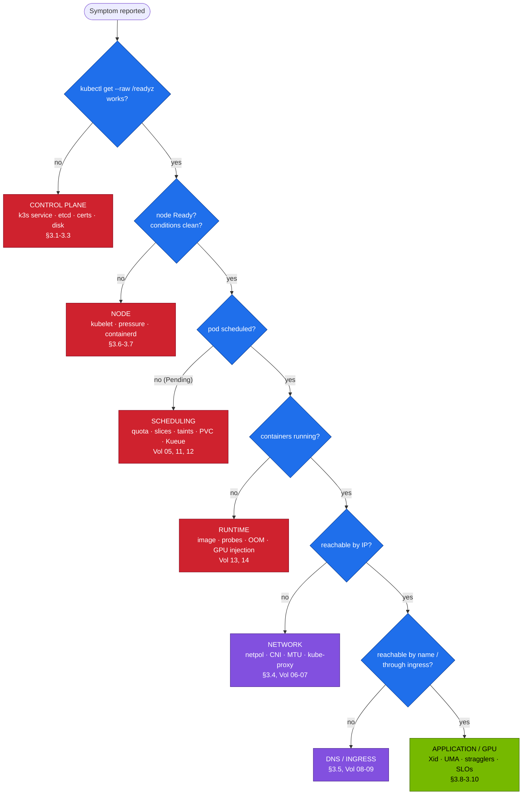

# Volume 19 — Cluster Diagnostics & Failure Playbook for a DGX Spark Kubernetes Platform

> **Module 02 · Part V — Distributed AI & diagnostics** · Prev: [18 Fabrics](18-large-scale-superpod-and-network-fabrics.md) · Next: [20 Workbook](20-hands-on-practice-exercises-workbook.md)

| | |
|---|---|
| **You will build** | A triage method you can follow under pressure, a support bundle, runbooks for the failures that actually happen on a Spark (control plane, certificates, network, DNS, GPU/Xid, unified memory, stragglers), and fifteen injectable drills to practise them |
| **Hardware** | spark-01 |
| **Time** | 2 h (plus drills over time) |
| **Risk** | Drills are reversible. BF-15 (UMA pressure) and the etcd restore are the only risky ones, and both ask first |
| **Lab files** | [`scripts/breakfix.sh`](lab/scripts/breakfix.sh), [`breakfix/`](lab/breakfix/), [`scripts/collect-diag.sh`](lab/scripts/collect-diag.sh), [`scripts/verify.sh`](lab/scripts/verify.sh), [`scripts/etcd-drill.sh`](lab/scripts/etcd-drill.sh), [`manifests/95-observability/rules.yaml`](lab/manifests/95-observability/rules.yaml) |

---

## 1. The triage method

Work **outside-in** and **top-down**. Prove each layer before blaming the next.



**Always first:**

```bash
cd "02 Kubernetes/lab"
scripts/verify.sh                   # which layer is red?
scripts/collect-diag.sh             # freeze the evidence before you change anything
kubectl get events -A --sort-by=.lastTimestamp | tail -30
```

---

## 2. Evidence map: where each layer writes its story

| Layer | Primary evidence | Command |
|---|---|---|
| k3s / control plane | journal | `sudo journalctl -u k3s --since -30m -p warning` |
| API decisions | audit log | `sudo jq -c 'select(.responseStatus.code>=400)' /var/log/k3s/audit.log \| tail` |
| etcd | endpoint status, alarms, metrics | `scripts/etcd-drill.sh status` |
| Scheduling | pod events | `kubectl describe pod` → Events |
| Controllers | object events, `.status.conditions` | `kubectl describe rs/job/deploy` |
| Containers | logs (current + previous), lastState | `kubectl logs --previous`, `-o jsonpath='{.status.containerStatuses}'` |
| Node | conditions, kubelet, dmesg | `kubectl describe node`, `sudo dmesg -T` |
| GPU | Xid, nvidia-smi, validator | `sudo dmesg -T \| grep -i xid`, `nvidia-smi -q` |
| Metrics / alerts | Prometheus, Grafana | dashboard *Spark · Kubernetes* |

---

## 3. Runbooks

### 3.1 API server unreachable

| Step | Command | Look for |
|---|---|---|
| service up? | `systemctl status k3s` | crash loop, `failed to start` |
| why? | `sudo journalctl -u k3s -n 200 --no-pager` | etcd errors, cert errors, `address already in use`, bad config YAML |
| disk full? | `df -h / /var/lib/rancher` | 100 % → etcd and containerd fail |
| memory? | `free -g`, `dmesg \| grep -i oom` | k3s OOM-killed under UMA pressure |

Fixes: free disk (`sudo k3s crictl rmi --prune`, old snapshots), fix the drop-in YAML, restore etcd (Vol 03 §5.6) as a last resort.

### 3.2 etcd: NOSPACE or slow

`mvcc: database space exceeded` → compact → defrag → disarm (Vol 03 §5.5). Slow fsync → find the competing writer (`sudo iotop -oa`, checkpoint jobs, fio). Rehearse it in the sandbox: `scripts/etcd-sandbox.sh fill`.

### 3.3 Certificates

k3s issues 1-year leaf certificates and renews any within 90 days of expiry **when k3s restarts**. A server that never restarts for a year eventually serves an expired cert.

```bash
sudo k3s certificate check --output table 2>/dev/null || \
  for c in /var/lib/rancher/k3s/server/tls/*.crt; do printf '%-60s %s\n' "$c" "$(openssl x509 -enddate -noout -in "$c" | cut -d= -f2)"; done
sudo k3s certificate rotate && sudo systemctl restart k3s       # planned rotation
```

Then re-fetch kubeconfigs (01 Ansible `05-k3s.yml`) and re-issue `make-user.sh` certs.

### 3.4 Pod network partition

Symptoms: pods Running, same-node traffic OK, cross-node traffic fails (2 Sparks), or everything fails after a reboot.

```bash
ip -d link show flannel.1; cat /run/flannel/subnet.env
sudo iptables -S FORWARD | head; sysctl net.ipv4.ip_forward
sudo tcpdump -ni enp1s0f1np1 udp port 8472 -c 5
```

Usual causes: `ip_forward=0` after a hardening change, ufw blocking 8472/udp, MTU mismatch, flannel bound to the wrong interface (Vol 06).

### 3.5 DNS

Try by IP, then by name (Vol 08 §5.5). CoreDNS replicas, `coredns-custom` syntax errors (`kubectl -n kube-system logs deploy/coredns`), upstream loops.

### 3.6 Node NotReady

```bash
kubectl describe node spark-01 | sed -n '/Conditions/,/Addresses/p'
sudo journalctl -u k3s | grep -iE 'PLEG|not ready|runtime' | tail
sudo k3s crictl info | jq '.status.conditions'
```

`PLEG is not healthy` means containerd is slow or stuck. Often it's disk I/O saturation, or thousands of dead containers (`sudo k3s crictl rm $(sudo k3s crictl ps -a -q --state exited)`).

### 3.7 Unified-memory pressure (the Spark-specific one)

| Signal | Where |
|---|---|
| `SparkUMAPressure`, `SparkNodeMemoryPressureCondition` alerts | Alertmanager |
| `MemAvailable` low, `Cached` high | `scripts/uma-watch.sh`, Grafana UMA row |
| CUDA OOM in serving logs while pods are under their limits | `kubectl logs deploy/vllm` |
| `Evicted` events | `kubectl get events -A --field-selector reason=Evicted` |

Order of actions: (1) stop or scale down preemptible and batch work, (2) drop page cache (`sync; echo 3 > /proc/sys/vm/drop_caches`, or 01 Ansible `24-uma-relief.yml`), (3) lower engine memory fractions, (4) revisit the capacity plan (Vol 15 §3.3). Drill: BF-15.

### 3.8 GPU errors (Xid)

```bash
sudo dmesg -T | grep -iE 'NVRM: Xid' | tail
nvidia-smi -q | sed -n '/Clocks Event Reasons/,/Sync Boost/p'
```

| Xid | Meaning | Usually | Action |
|---|---|---|---|
| 13 | Graphics engine exception | application bug (bad kernel, OOB access) | fix the app. Node OK |
| 31 | GPU memory page fault | application (illegal address) | fix the app. Run compute-sanitizer (module 07) |
| 43 | GPU stopped processing | app fault or driver | restart the pod. If it recurs without app changes → driver |
| 45 | preemptive cleanup | follows other errors / killed contexts | look at the *preceding* Xid |
| 48 / 94 / 95 | ECC errors (contained/uncontained) | hardware memory | drain. Reboot if uncontained. Repeated → RMA |
| 62 / 109 | internal micro-controller / context-switch timeout | driver/firmware, occasionally app | collect `nvidia-bug-report.sh`, update DGX OS |
| 79 | GPU has fallen off the bus | hardware/power/thermal | drain + power cycle. Repeated → RMA |
| 119 / 120 | GSP RPC timeout / GSP error | firmware/driver | reboot. Update DGX OS. Report |
| 74 | NVLink error | not applicable to GB10 (no external NVLink) | — |

Drain procedure: 01 Ansible `playbooks/21-emergency-drain.yml` (cordon → capture → stop → reboot → validate → return).

### 3.9 Stragglers and hangs (distributed jobs)

From Vol 17 §5.4: all ranks stuck in a collective means find the absent rank. Per-rank step-time spread above ~10 % means a straggler. Check that rank's node for throttling (`nvidia-smi -q -d PERFORMANCE`), its NIC counters (Vol 18) and its data loader (CPU throttling, Vol 12).

### 3.10 Serving SLO breaches

| Symptom | Metric | Cause |
|---|---|---|
| TTFT p95 up, queue up | `vllm:num_requests_waiting` | load > capacity. Scale, or lower `max-num-seqs` to protect latency |
| TPOT up | `spark:vllm_tpot_p95_seconds` | GPU contention (other slices busy), thermal throttling |
| KV cache ~100 %, preemptions | `vllm:gpu_cache_usage_perc` | context lengths grew. Raise utilisation or lower `max-model-len` |
| 5xx at ingress | Traefik metrics | readiness flaps, timeouts (Vol 09) |

---

## 4. The drill catalogue

| # | Scenario | Layer | Inject | Primary diagnosis |
|---|---|---|---|---|
| 01 | quota: only some replicas | scheduling/admission | `breakfix.sh inject 01` | RS events |
| 02 | GPU slices exhausted | scheduling | 02 | pod events + node allocated |
| 03 | image pull failure | runtime | 03 | pod events |
| 04 | OOMKilled | runtime | 04 | lastState + memory.events |
| 05 | liveness kills slow model | runtime | 05 | probe events |
| 06 | NetworkPolicy blocks ingress | network | 06 | netpol list, curl from ingress ns |
| 07 | cluster DNS down | DNS | 07 | IP vs name test |
| 08 | Service with no endpoints | network | 08 | EndpointSlice |
| 09 | streaming buffered | ingress | 09 | TTFB ≈ total |
| 10 | GPU leak without request | GPU runtime | 10 | runtime + env |
| 11 | drain blocked by PDB | ops | 11 | `get pdb` |
| 12 | PVC stuck Pending | storage | 12 | PVC events |
| 13 | node tainted NoSchedule | scheduling | 13 | node taints |
| 14 | deployment creates no pods | admission | 14 | RS events (CEL) |
| 15 | UMA pressure (risky) | node/GPU | 15 | node conditions, evictions |

How to drill properly: have someone else inject (or pick a random number), **time yourself**, write down the first command that showed the cause, then `answer` to compare. Reset with `scripts/breakfix.sh reset all`.

---

## 5. Lab

```bash
scripts/breakfix.sh list
n=$(printf '%02d' $(( (RANDOM % 14) + 1 ))); echo "drill $n"; scripts/breakfix.sh inject "$n"
# … diagnose using §1 and §3 only …
scripts/breakfix.sh hint "$n"; scripts/breakfix.sh answer "$n"; scripts/breakfix.sh reset "$n"
scripts/collect-diag.sh && tar tzf diag-*.tar.gz | head
```

---

## 6. Verify

| Check | Expected |
|---|---|
| `collect-diag.sh` | tarball with nodes, events, quotas, admission, per-namespace describes/logs, meminfo, nvidia-smi, filtered dmesg |
| 5 drills done | each fixed within 10 min, first diagnostic command recorded |
| `breakfix.sh reset all` then `verify.sh` | all PASS |

---

## 7. Anti-patterns

| Don't | Because | Instead |
|---|---|---|
| restart k3s / reboot as step 1 | destroys evidence (previous logs, dmesg, stuck state) | `collect-diag.sh` first |
| `kubectl delete pod` in a loop | the controller recreates the same broken pod | read events/lastState, fix the spec |
| raise every limit "to be safe" | hides leaks and breaks the UMA budget | measure, then size (Vol 12) |
| disable NetworkPolicies / admission to "test" | you'll forget to re-enable them | server-side dry-run tests, targeted exceptions |

---

## 8. Scale-out path

At scale, the same runbooks get automated. Node-problem-detector sets conditions, a remediation controller cordons and drains, DCGM diagnostics gate re-admission, and alerts link straight to runbooks. The `runbook` annotation on each lab alert points here.

---

## 9. Checklist

- [ ] I can walk the triage tree from any symptom to the right layer in under two minutes.
- [ ] I know the Spark-specific failure (UMA pressure) and its order of actions.
- [ ] I can read an Xid and decide app vs node vs hardware.
- [ ] I've done at least five drills and recorded my times.
