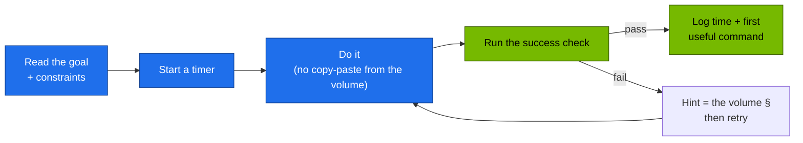

# Volume 20 — Hands-On Workbook: 20 Production Challenges on the Spark Platform

> **Module 02 · Part V — Distributed AI & diagnostics** · Prev: [19 Diagnostics](19-cluster-diagnostics-and-failure-scenarios.md) · Next: [21 vLLM serving](21-vllm-high-throughput-llm-serving.md)

| | |
|---|---|
| **You will build** | Proof that you can operate the platform without the volumes open. Twenty timed challenges, each with a goal, constraints, a success check you can run, and a pointer to the volume with the answer |
| **Hardware** | spark-01 (ex. 17 optional needs spark-02) |
| **Time** | 6–8 h total. Do 2–3 per session |
| **Risk** | as per the referenced volume |
| **Lab files** | all of [`lab/`](lab/README.md) |

---

## 0. How to use this workbook



Start from a clean, verified platform:

```bash
cd "02 Kubernetes/lab"
tests/run-local-checks.sh && scripts/verify.sh && scripts/breakfix.sh reset all
```

Progress log (copy into your notes):

| # | Challenge | Target time | Your time | First useful command |
|---|---|---|---|---|
| 01–20 | … | … | | |

---

## Part A — Control plane

### Ex 01 · Namespaces and cgroups of a running pod (20 min)
**Goal:** for `lab-tools/echo`, print its PID on the host, its network namespace inode, its cgroup path and its `cpu.max`.
**Constraints:** host shell only (`nsenter`, `/proc`, `crictl`). No `kubectl exec`.
**Success check:** `sudo ls -l /proc/<pid>/ns/net` inode equals the one inside the pod (`kubectl exec … -- readlink /proc/1/ns/net`).
**Answer:** [Vol 01 §5.5](01-kubernetes-core-architecture.md), [Vol 12 §5.2](12-multi-tenancy-resource-quotas-and-cgroups.md), `scripts/cgroup-inspect.sh`.

### Ex 02 · Read a raw key from etcd (15 min)
**Goal:** show the etcd key for Secret `tenant-alpha/demo` and prove it's encrypted.
**Success check:** the value starts with `k8s:enc:aescbc:v1:`.
**Answer:** [Vol 03 §5.3](03-etcd-database-deep-dive.md).

### Ex 03 · APF lane for a noisy CI bot (30 min)
**Goal:** create ServiceAccount `llm-serving/ci-deployer` its own PriorityLevel (`nominalConcurrencyShares: 5`) and FlowSchema, then prove its LIST flood doesn't slow `kubectl get nodes`.
**Success check:** `apiserver_flowcontrol_current_inqueue_requests{priority_level="<yours>"}` > 0 during the flood. Admin `get nodes` stays < 200 ms.
**Answer:** [Vol 02 §3.4, §5.6](02-kube-apiserver-internals.md).

### Ex 04 · RBAC for a read-only auditor (20 min)
**Goal:** user `carol` (group `auditors`) can `get/list/watch` everything in `tenant-*` except Secrets, and can read nodes.
**Success check:** `kubectl auth can-i list secrets -n tenant-alpha --as=carol --as-group=auditors` → `no`. `list pods` → `yes`.
**Answer:** [Vol 02 §5.3–5.4](02-kube-apiserver-internals.md).

### Ex 05 · Write and prove a new CEL policy (30 min)
**Goal:** in `llm-serving`, every container must set `resources.limits.memory`.
**Success check:** add `tests/policy/deny-serving-no-memory-limit.yaml` (expect deny) and `allow-…` (expect allow). `scripts/verify.sh admission` passes with your new fixtures.
**Answer:** [Vol 02 §5.5](02-kube-apiserver-internals.md).

### Ex 06 · Trace a reconciliation cascade (20 min)
**Goal:** scale `lab-tools/echo` from 3 to 5 and list, in order, every controller that wrote an object and every event emitted.
**Success check:** your list names deployment-controller → replicaset-controller → default-scheduler → kubelet.
**Answer:** [Vol 04 §5.2](04-kube-controller-manager-and-controllers.md).

## Part B — Scheduling

### Ex 07 · Dedicated GPU node (20 min)
**Goal:** taint spark-01 `spark.lab/gpu=dedicated:PreferNoSchedule`, deploy `affinity-demo`, then remove the taint.
**Success check:** `affinity-demo` pods Running with the toleration visible in their spec.
**Answer:** [Vol 05 §5.6](05-kube-scheduler-and-ai-batch-scheduling.md).

### Ex 08 · Gang scheduling with Kueue (30 min)
**Goal:** reproduce the partial-gang deadlock without Kueue, then run the same workload through `batch/train`.
**Success check:** `tests/kueue-gang-test.sh` → `PASS`.
**Answer:** [Vol 05 §5.4–5.5](05-kube-scheduler-and-ai-batch-scheduling.md).

## Part C — Networking

### Ex 09 · veth to bridge to route (20 min)
**Goal:** for a netshoot pod, identify its host veth and capture its traffic on that veth while it curls `echo`.
**Success check:** `tcpdump -ni <veth>` shows the SYN to a `10.42.x.x:8080` address.
**Answer:** [Vol 06 §5.2–5.3](06-kubernetes-networking-deep-dive.md).

### Ex 10 · iptables for a ClusterIP (20 min)
**Goal:** from `iptables-save` alone, predict which pod IPs back `lab-tools/echo`, with each one's probability.
**Success check:** matches `kubectl get endpointslices -l kubernetes.io/service-name=echo`.
**Answer:** [Vol 07 §5.1](07-kube-proxy-and-cluster-ip-mechanics.md).

### Ex 11 · Fix the ndots tax for a model server (25 min)
**Goal:** patch `mock-llm` so an external lookup produces 2 CoreDNS queries instead of ~10.
**Success check:** CoreDNS log line count from §5.3 of Vol 08.
**Answer:** [Vol 08 §3.2, §5.3](08-coredns-and-service-discovery.md).

### Ex 12 · Streaming through the gateway (25 min)
**Goal:** add a new HTTPRoute `api.lab.local` → `mock-llm` with a 900 s request timeout, and prove a 1,000-token stream isn't buffered.
**Success check:** `curl -w '%{time_starttransfer} %{time_total}'` shows TTFB < 0.5 s and total ≈ 50 s.
**Answer:** [Vol 09 §5.3–5.4, §5.7](09-ingress-controllers-and-gateway-api.md).

## Part D — Workloads & storage

### Ex 13 · Stateful vector DB survives (25 min)
**Goal:** insert 100 points into Qdrant, delete `qdrant-0`, then delete the whole StatefulSet (keep PVCs), re-apply it, and count the points.
**Success check:** `points_count == 100` after both deletions.
**Answer:** [Vol 10 §5.1](10-advanced-workload-controllers.md).

### Ex 14 · Sharded preprocessing with a bad shard (25 min)
**Goal:** run the tokenizer with `BAD_SHARD=5`, then re-process only shard 5 after "fixing" it.
**Success check:** first run `failedIndexes: 5`. Second run completes index 5 only.
**Answer:** [Vol 10 §5.4](10-advanced-workload-controllers.md).

### Ex 15 · NVMe baseline and a Retain volume (30 min)
**Goal:** run the fio profiles, save the JSON summary, create a Retain PVC, write a file, delete the PVC and re-bind the PV to a new PVC.
**Success check:** the file is readable from the new PVC.
**Answer:** [Vol 11 §5.3–5.4](11-storage-csi-and-high-performance-volumes.md).

### Ex 16 · Tenant budget from first principles (30 min)
**Goal:** create `tenant-gamma` with a **10 %** budget computed from `kubectl get node -o json` (not hard-coded), with a LimitRange, NetworkPolicies and a RoleBinding for `team-gamma`.
**Success check:** `scripts/verify.sh tenancy` still passes, and a 3-replica × 1-CPU Deployment in gamma gets exactly 2 pods.
**Answer:** [Vol 12 §3.1](12-multi-tenancy-resource-quotas-and-cgroups.md).

## Part E — GPU

### Ex 17 · CDI and the GPU leak (25 min)
**Goal:** regenerate the CDI spec, then demonstrate and close the GPU leak (BF-10) using the hardened runtime settings.
**Success check:** after hardening, `bf10-leak` can't see the GPU and `gpu-smoke` still can.
**Answer:** [Vol 14 §5.1, §5.4–5.5](14-nvidia-container-toolkit-and-gpu-virtualization.md).

### Ex 18 · Device-plugin profile per node (20 min)
**Goal:** switch spark-01 to `whole-gpu`, show allocatable 1, run `gemm-solo`, then switch back.
**Success check:** allocatable goes 4 → 1 → 4. GEMM TFLOPS equals your baseline.
**Answer:** [Vol 16 §5.3](16-nvidia-gpu-operator-and-network-operator.md).

### Ex 19 · Multi-tenant GPU contention report (40 min)
**Goal:** produce a table of per-pod and aggregate TFLOPS for 1, 2, 3 and 4 concurrent pods, plus p95 TTFT of `mock-llm` measured at the same time.
**Success check:** aggregate stays within ~10 % of the single-pod baseline. You can explain why.
**Answer:** [Vol 14 §5.3](14-nvidia-container-toolkit-and-gpu-virtualization.md).

## Part F — Disaster recovery

### Ex 20 · Full etcd restore under time pressure (45 min)
**Goal:** snapshot, create three "doomed" objects (a namespace, a ConfigMap, a Kueue LocalQueue), restore, and prove all three are gone while everything else works.
**Success check:** `scripts/verify.sh` all PASS after the restore. The three objects are absent.
**Answer:** [Vol 03 §5.6](03-etcd-database-deep-dive.md).

---

## Capstone — the 60-minute rebuild

Tear down the 02 layer (keep 01 Ansible's base), then rebuild to green:

```bash
for d in 95-observability 90-serving/vllm 80-distributed/base 70-gpu 50-workloads 45-controller 40-ingress 30-networking 20-scheduling 16-apf 15-admission 10-tenancy; do
  kubectl delete -k manifests/$d --ignore-not-found --wait=false; done
kubectl delete -k manifests/00-platform --wait=true
# start the clock
scripts/apply-lab.sh && scripts/verify.sh
```

**Pass:** `0 failed` within 60 minutes, including one drill of your choice fixed along the way.

---

## CI: the workbook for your laptop

Everything that doesn't need a GPU is checked on every PR by [`.github/workflows/k8s-lab-ci.yml`](../.github/workflows/k8s-lab-ci.yml). It runs lint, kubeconform, promtool and shellcheck, then builds a kind cluster, fakes a GB10 with `tests/fake-gpu-node.sh`, applies the lab, runs the admission fixtures and the Kueue gang test. Run the same on a laptop with kind:

```bash
kind create cluster --name spark-sim --image kindest/node:v1.32.2
tests/fake-gpu-node.sh
API=1 tests/run-local-checks.sh
```
