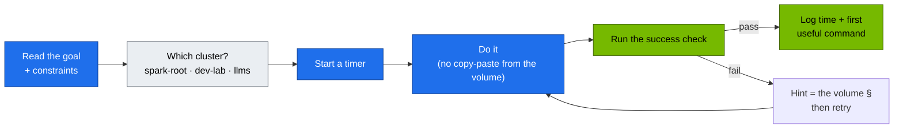

# Volume 20 — Hands-On Workbook: 20 Production Challenges on the Spark Platform

> **Module 02 · Part V — Distributed AI & diagnostics** · Prev: [19 Diagnostics](19-cluster-diagnostics-and-failure-scenarios.md) · Next: [21 vLLM serving](21-vllm-high-throughput-llm-serving.md)

| | |
|---|---|
| **You will build** | Proof that you can operate the platform without the volumes open. Twenty timed challenges, each with a goal, constraints, a success check you can run, and a pointer to the volume with the answer |
| **Clusters** | all three. Each exercise says which: `spark-root` (node, platform, budgets), `dev-lab` (tenants, `lab-tools`), `llms` (serving, batch, Traefik, Kueue) |
| **Hardware** | spark-01 |
| **Time** | 6–8 h total. Do 2–3 per session |
| **Risk** | as per the referenced volume. Ex 20 restores root etcd |
| **Lab files** | all of [`lab/`](lab/README.md) |

---

## 0. How to use this workbook



Start from a clean, verified platform:

```bash
export KUBECONFIG="$PWD/01 Ansible/lab/.cache/kubeconfig-spark-lab.yaml"   # contexts spark-root, dev-lab, llms
cd "02 Kubernetes/lab"
tests/run-local-checks.sh && scripts/verify.sh && scripts/breakfix.sh reset all
```

Rules of the game: every `kubectl` and `helm` command you type names its context (`--context` / `--kube-context`). Half of these exercises are about knowing which one.

Progress log (copy into your notes):

| # | Challenge | Cluster(s) | Target time | Your time | First useful command |
|---|---|---|---|---|---|
| 01–20 | … | … | … | | |

---

## Part A — Control plane

### Ex 01 · Namespaces and cgroups of a vCluster pod (20 min)
**Cluster:** dev-lab → root host.
**Goal:** for the `netshoot` pod in dev-lab's `lab-tools`, print its name on the root, its PID on the host, its network namespace inode, its cgroup path and its `cpu.max`.
**Constraints:** `kubectl --context spark-root get` to find the root name, then host shell only (`crictl`, `nsenter`, `/proc`). No `kubectl exec`, no lab scripts.
**Success check:** `sudo ls -l /proc/<pid>/ns/net` inode equals the one inside the pod (`kubectl --context dev-lab -n lab-tools exec deploy/netshoot -- readlink /proc/1/ns/net`). Then compare your answer with `scripts/cgroup-inspect.sh lab-tools <pod> dev-lab` and `scripts/pod-netns.sh lab-tools <pod> dev-lab`.
**Answer:** [Vol 01 §5 Step 5](01-kubernetes-core-architecture.md), [Vol 27 §3.4](27-nested-clusters-with-vcluster.md), [Vol 12 §5.2](12-multi-tenancy-resource-quotas-and-cgroups.md).

### Ex 02 · Read a raw key from etcd — and find a key that isn't there (15 min)
**Cluster:** spark-root (etcd), dev-lab.
**Goal:** show the etcd key for Secret `platform-tools/demo` and prove it's encrypted. Then create Secret `tenant-alpha/demo` in dev-lab and explain why `/registry/secrets/tenant-alpha/demo` doesn't exist in root etcd.
**Success check:** the root value starts with `k8s:enc:aescbc:v1:key1:`. `etcdctl get --prefix --keys-only /registry/secrets/ | grep tenant-alpha` prints nothing, and you can say where the tenant Secret lives and when a copy of it would appear on the root.
**Answer:** [Vol 03 §5.3](03-etcd-database-deep-dive.md), [Vol 02 §3.5](02-kube-apiserver-internals.md), [Vol 27 §3.3](27-nested-clusters-with-vcluster.md).

### Ex 03 · APF lane for a noisy CI bot (30 min)
**Cluster:** dev-lab.
**Goal:** give ServiceAccount `lab-tools/ci-deployer` its own PriorityLevelConfiguration (`nominalConcurrencyShares: 5`) and FlowSchema in dev-lab, next to the tenant lane from `manifests/dev-lab/16-apf`, then prove its LIST flood doesn't slow an admin's `kubectl --context dev-lab get nodes`.
**Success check:** `kubectl --context dev-lab get --raw /metrics | grep 'apiserver_flowcontrol_current_inqueue_requests{.*priority_level="<yours>"'` > 0 during the flood. Admin `get nodes` stays < 200 ms. Bonus: show that the root's `spark-vcluster-syncers` lane (`manifests/root/16-apf`) is untouched — the flood never reached the root API server.
**Answer:** [Vol 02 §3.4, §5 Step 6](02-kube-apiserver-internals.md).

### Ex 04 · RBAC for a read-only auditor (20 min)
**Cluster:** dev-lab.
**Goal:** user `carol` (group `auditors`) can `get/list/watch` everything in `tenant-*` except Secrets, and can read nodes. Issue her certificate with `scripts/make-user.sh carol auditors`.
**Success check:** `kubectl --context dev-lab auth can-i list secrets -n tenant-alpha --as=carol --as-group=auditors` → `no`. `list pods` → `yes`. `kubectl --context spark-root auth can-i list pods -n vc-dev-lab --as=carol --as-group=auditors` → `no` (dev-lab's RBAC means nothing to the root).
**Answer:** [Vol 02 §5 Step 3–4](02-kube-apiserver-internals.md).

### Ex 05 · Write and prove a new CEL policy (30 min)
**Cluster:** llms (the policy file is shared with dev-lab).
**Goal:** in `llm-serving`, every container must set `resources.limits.memory`. Add it to `manifests/common/15-admission/policies.yaml` with a binding that selects `spark.lab/tier: serving`.
**Success check:** add `tests/policy/deny-serving-no-memory-limit.yaml` (`# expect: deny`, `# cluster: llms`) and an `allow-…` fixture (`# expect: allow`). After `kubectl --context llms apply -k manifests/llms/15-admission`, `scripts/verify.sh admission` passes with your new fixtures. Then explain why the root's LimitRange on `vc-llms` would have filled in a limit anyway — and why the policy is still worth having.
**Answer:** [Vol 02 §5 Step 5](02-kube-apiserver-internals.md), [Vol 12 §3.3](12-multi-tenancy-resource-quotas-and-cgroups.md).

### Ex 06 · Trace a reconciliation cascade across two control planes (20 min)
**Cluster:** dev-lab, spark-root.
**Goal:** scale dev-lab's `lab-tools/echo` from 3 to 5 and list, in order, every controller that wrote an object and every event emitted — in both clusters.
**Success check:** your list names deployment-controller → replicaset-controller (dev-lab's controller-manager) → the vCluster syncer → default-scheduler (root) → kubelet, and says which API server each write went to.
**Answer:** [Vol 04 §5.2, §5.6](04-kube-controller-manager-and-controllers.md), [Vol 27 §4](27-nested-clusters-with-vcluster.md).

## Part B — Scheduling

### Ex 07 · Dedicated GPU node (20 min)
**Cluster:** spark-root (taint), dev-lab (workload).
**Goal:** taint spark-01 `spark.lab/dedicated=gpu:PreferNoSchedule` on the root, deploy `affinity-demo` from `manifests/dev-lab/20-scheduling/taints-affinity.yaml` in dev-lab, then remove the taint.
**Success check:** `affinity-demo` pods Running in `tenant-beta`, with the toleration visible in the virtual pod's spec **and** in its root copy in `vc-dev-lab`; `kubectl --context dev-lab describe node spark-01` showed the taint while it was set.
**Answer:** [Vol 05 §5.6](05-kube-scheduler-and-ai-batch-scheduling.md).

### Ex 08 · Gang scheduling with Kueue (30 min)
**Cluster:** dev-lab (deadlock), llms (Kueue).
**Goal:** reproduce the partial-gang deadlock without Kueue (`manifests/dev-lab/20-scheduling/no-kueue-deadlock.yaml`), then run gangs through `batch/train` in llms. Bonus: reproduce "Kueue admitted, root refused" from Vol 17 §5.3.
**Success check:** `tests/kueue-gang-test.sh` → `PASS`. For the bonus, you can point at the syncer event that names `vcluster-budget`.
**Answer:** [Vol 05 §5.4–5.5](05-kube-scheduler-and-ai-batch-scheduling.md), [Vol 17 §5.3](17-distributed-ai-training-and-nccl.md).

## Part C — Networking

### Ex 09 · veth to Cilium to pod (20 min)
**Cluster:** dev-lab → root host.
**Goal:** for dev-lab's `lab-tools/netshoot` pod, identify its `lxc*` host veth on the root and capture its traffic on that veth while it curls `echo`.
**Success check:** `sudo tcpdump -ni <lxc…> tcp port 8080` shows the SYN to a `10.42.x.x:8080` address (after kube-proxy translated the ClusterIP), and `kubectl --context spark-root -n kube-system exec ds/cilium -- hubble observe --from-pod vc-dev-lab/<root name> --last 5` shows the same flow.
**Answer:** [Vol 06 §5.2–5.3](06-kubernetes-networking-deep-dive.md), `scripts/pod-netns.sh lab-tools <pod> dev-lab`.

### Ex 10 · iptables for a ClusterIP (20 min)
**Cluster:** dev-lab Service, root kube-proxy.
**Goal:** from `sudo iptables-save` on the Spark alone, predict which pod IPs back dev-lab's `lab-tools/echo`, with each one's probability.
**Success check:** matches `kubectl --context dev-lab -n lab-tools get endpointslices -l kubernetes.io/service-name=echo`. You can explain why a Service that exists only in dev-lab's API has rules in the *root's* iptables (same ClusterIP on both sides).
**Answer:** [Vol 07 §5.1](07-kube-proxy-and-cluster-ip-mechanics.md), `scripts/svc-trace.sh lab-tools echo dev-lab`.

### Ex 11 · Fix the ndots tax for a model server (25 min)
**Cluster:** llms (pod), root host (capture).
**Goal:** patch llms's `llm-serving/mock-llm` (`dnsConfig.options ndots: "1"`) so an external lookup produces 2 DNS queries instead of ~10.
**Success check:** on the Spark, capture on the mock-llm pod's host veth (`sudo tcpdump -nli <lxc…> udp dst port 53`) while `kubectl --context llms -n llm-serving exec deploy/mock-llm -- python3 -c "import socket; socket.getaddrinfo('huggingface.co', 443)"` runs: ≤ 2 queries after the patch. Say which CoreDNS answered them (llms's own, not the root's).
**Answer:** [Vol 08 §3.2, §5.3](08-coredns-and-service-discovery.md).

### Ex 12 · Streaming through the gateway (25 min)
**Cluster:** llms.
**Goal:** add a new HTTPRoute `api.lab.local` → `mock-llm` on Traefik's Gateway in llms with a 900 s request timeout, and prove a 1,000-token stream through `192.168.0.115` isn't buffered.
**Success check:** `curl -s -o /dev/null -w '%{time_starttransfer} %{time_total}\n' -H 'Host: api.lab.local' http://192.168.0.115/v1/chat/completions -d '{"stream":true,"max_tokens":1000}'` shows TTFB < 0.5 s and total ≈ 50 s.
**Answer:** [Vol 09 §5.3–5.4, §5.7](09-ingress-controllers-and-gateway-api.md).

## Part D — Workloads & storage

### Ex 13 · Stateful vector DB survives (25 min)
**Cluster:** llms.
**Goal:** insert 100 points into Qdrant (`llm-serving/qdrant`), delete `qdrant-0`, then delete the whole StatefulSet (keep PVCs), re-apply `manifests/llms/50-workloads`, and count the points.
**Success check:** `points_count == 100` after both deletions. You can name the root PV that held the data and its directory under `/data/k8s/vc-llms/`.
**Answer:** [Vol 10 §5.1](10-advanced-workload-controllers.md), [Vol 10 §3.4](10-advanced-workload-controllers.md).

### Ex 14 · Sharded preprocessing with a bad shard (25 min)
**Cluster:** dev-lab.
**Goal:** run `tenant-alpha/tokenize-shards` (`manifests/dev-lab/50-workloads/tokenizer-indexed-job.yaml`) with `BAD_SHARD=5`, then re-process only shard 5 after "fixing" it.
**Success check:** first run `failedIndexes: "5"`. Second run completes index 5 only. Every pod fit inside `tenant-alpha`'s 500m / 2 Gi budget.
**Answer:** [Vol 10 §5.4](10-advanced-workload-controllers.md).

### Ex 15 · NVMe baseline and a Retain volume (30 min)
**Cluster:** spark-root (fio, PV), dev-lab (claim).
**Goal:** run the fio profiles (`manifests/root/60-storage/fio-job.yaml` in `platform-tools`) and save the JSON summary. Then in dev-lab create a `local-nvme-retain` PVC, write a file, delete the PVC, and re-bind the `Released` root PV to a new dev-lab PVC.
**Success check:** the file is readable from the new PVC. You can say which step needed `--context spark-root` and why a dev-lab tenant couldn't do it.
**Answer:** [Vol 11 §5.3–5.4](11-storage-csi-and-high-performance-volumes.md).

### Ex 16 · Tenant budget from first principles (30 min)
**Cluster:** dev-lab (tenant), spark-root (the number it's computed from).
**Goal:** create `tenant-gamma` in dev-lab with a budget of **25 %** of dev-lab's root budget, computed from `kubectl --context spark-root -n vc-dev-lab get resourcequota vcluster-budget -o json` (not hard-coded), with a LimitRange, NetworkPolicies and a RoleBinding for `team-gamma`.
**Success check:** `scripts/verify.sh tenancy` still passes, and a 3-replica Deployment of 250m-CPU pods in gamma gets exactly 2 pods. Then explain why alpha + beta + gamma (1.5 CPU) don't reserve anything on the root.
**Answer:** [Vol 12 §3.2](12-multi-tenancy-resource-quotas-and-cgroups.md), [Vol 27 §5](27-nested-clusters-with-vcluster.md).

## Part E — GPU

### Ex 17 · CDI and the GPU leak (25 min)
**Cluster:** spark-root host (runtime), dev-lab (pods).
**Goal:** generate the CDI spec on the host (`nvidia-ctk cdi generate`) and compare it with what the GPU Operator uses (CDI off), then demonstrate and close the GPU leak (BF-10, dev-lab) using the hardened runtime settings.
**Success check:** after hardening, `bf10-leak` can't see the GPU, `scripts/verify.sh gpu` (gpu-smoke with `runtimeClassName: nvidia`) still passes, and you can explain why dev-lab's GPU quota never counted the leaking pod.
**Answer:** [Vol 14 §5.1, §5.4–5.5](14-nvidia-container-toolkit-and-gpu-virtualization.md).

### Ex 18 · Device-plugin profile per node (20 min)
**Cluster:** spark-root (switch, benchmark), llms (observe).
**Goal:** switch spark-01 to `whole-gpu`, show allocatable 1 on the root **and** in llms, run `gemm-solo` in `platform-tools`, then switch back.
**Success check:** allocatable goes 15 → 1 → 15 in both contexts while `vc-llms`'s quota keeps saying 8. GEMM TFLOPS equals your baseline.
**Answer:** [Vol 16 §5.3](16-nvidia-gpu-operator-and-network-operator.md).

### Ex 19 · Multi-tenant GPU contention report (40 min)
**Cluster:** spark-root (`gemm-contention`), llms (`mock-llm`).
**Goal:** produce a table of per-pod and aggregate TFLOPS for 1, 2, 3 and 4 concurrent `platform-tools/gemm-contention` pods, plus p95 TTFT of llms's `mock-llm` (through `192.168.0.115`) measured at the same time.
**Success check:** aggregate stays within ~10 % of the single-pod baseline. You can explain why — and why the vCluster budgets can't prevent this contention.
**Answer:** [Vol 14 §5.3](14-nvidia-container-toolkit-and-gpu-virtualization.md).

## Part F — Disaster recovery

### Ex 20 · Full etcd restore under time pressure (45 min)
**Cluster:** spark-root (etcd), llms.
**Goal:** snapshot (`scripts/etcd-drill.sh snapshot`), then create three "doomed" objects: a root namespace, a ConfigMap in `platform-tools`, and a Kueue LocalQueue in llms's `batch`. Restore the snapshot (`scripts/etcd-drill.sh restore <file>`).
**Success check:** `scripts/verify.sh` all PASS after the restore. The two root objects are gone; the LocalQueue is **still there**, and you can explain why (llms keeps its state in SQLite on its PVC) and how you would have rolled it back too.
**Answer:** [Vol 03 §5.6, §5.8](03-etcd-database-deep-dive.md), [Vol 27 §6.7](27-nested-clusters-with-vcluster.md).

---

## Capstone — the 60-minute rebuild

Tear down the 02 layer — the root's lab objects and the whole `dev-lab` vCluster — keeping 01 Ansible's base (kubeadm root, Cilium, MetalLB, GPU Operator), the add-ons (storage, metrics-server, kps) and `llms`'s model cache. Then rebuild to green:

```bash
# root lab layers (never delete root/00-platform or root/05-vclusters: they hold observability and the vc-* namespaces)
for d in 95-observability 70-gpu 50-workloads 45-controller 30-networking 16-apf; do
  kubectl --context spark-root delete -k manifests/root/$d --ignore-not-found --wait=false; done
# llms lab layers (keep 00-platform: the ingress namespace holds Traefik; keep 60-storage: model-cache)
for d in 20-scheduling 50-workloads 40-ingress 15-admission 10-tenancy; do
  kubectl --context llms delete -k manifests/llms/$d --ignore-not-found --wait=false; done
# the whole dev-lab vCluster: control plane, SQLite, every synced object
helm --kube-context spark-root uninstall dev-lab -n vc-dev-lab
kubectl --context spark-root delete namespace vc-dev-lab --wait=true
# start the clock
kubectl --context spark-root apply -k manifests/root/05-vclusters      # vc-dev-lab namespace, budget, LimitRange, boundary policy
scripts/install-addons.sh vclusters                                    # reinstalls dev-lab (llms: no-op upgrade), re-merges contexts
scripts/apply-lab.sh && scripts/verify.sh
```

**Pass:** `0 failed` within 60 minutes, including one drill of your choice fixed along the way. Note what the rebuild cost you: dev-lab has a new CA, so every `make-user.sh` certificate for dev-lab must be re-issued.

---

## CI: the workbook for your laptop

Everything that doesn't need a GPU is checked on every PR by [`.github/workflows/k8s-lab-ci.yml`](../.github/workflows/k8s-lab-ci.yml). It runs lint, kubeconform, promtool and shellcheck, then builds the same shape on kind: kind plays the root (context `spark-root`, a fake GB10 with 15 slices from `tests/fake-gpu-node.sh`), the two vClusters come from `vclusters/*.yaml` (ClusterIP + port-forward instead of MetalLB), Kueue runs inside `llms`, and it applies the lab to all three clusters, runs the budget, tenancy and admission checks and the Kueue gang test. Run the same on a laptop:

```bash
kind create cluster --name spark-sim --image kindest/node:v1.34.0
kubectl config rename-context kind-spark-sim spark-root
tests/fake-gpu-node.sh
# then the vCluster + CRD steps of the workflow's "kind" job, and:
API=1 tests/run-local-checks.sh
tests/kueue-gang-test.sh
```

The workflow file is the reference for the steps in between (Cilium/Prometheus CRDs on the root, `helm --kube-context spark-root upgrade --install` of each vCluster with `controlPlane.service.spec.type=ClusterIP`, port-forwards, `scripts/merge-vcluster-kubeconfig.sh`).
