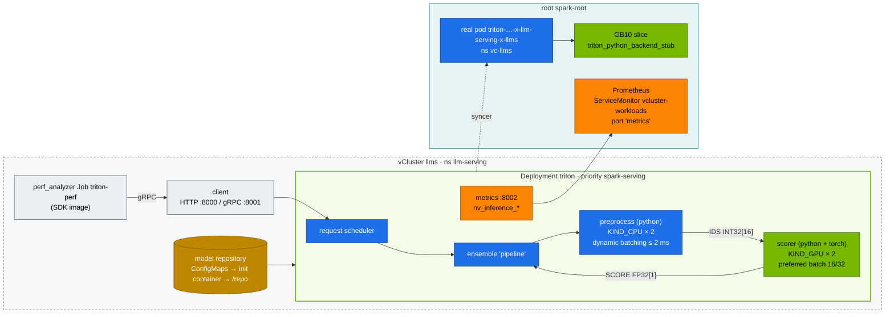

# Step 21 · NVIDIA Triton Inference Server on the Spark: Model Repository, Ensembles, Dynamic Batching, perf_analyzer

> **02 Kubernetes · Part VII — LLM serving · Step 21 of 28** · ← [Step 20 · vLLM](20-vllm-high-throughput-llm-serving.md) · [All steps](00-kubernetes-step-by-step-guide.md) · [Step 22 · SGLang, TensorRT-LLM & KServe](22-llm-inference-alternatives-and-kserve.md) →

| | |
|---|---|
| **You will build** | A Triton deployment inside the `llms` vCluster serving a two-step **ensemble** (tokenise on CPU → score on the GB10), fed from a GitOps-friendly model repository. You'll measure dynamic batching with Triton's own metrics (scraped by the root's Prometheus), load-test it with `perf_analyzer` over gRPC, and find Triton's GPU process on the root |
| **Hardware** | dgx-spark-1 |
| **Time** | 75 min |
| **Risk** | Low. Triton's 12 Gi limit doesn't fit `llm-serving` next to vLLM's 32 Gi: park vLLM first (Step 20 §9) |
| **Clusters** | `llms` (Triton, the perf Job, the `serving-budget` quota) · `spark-root` (the real pod, `nvidia-smi`, Prometheus) |
| **Lab files** | [`manifests/llms/90-serving/triton/`](lab/manifests/llms/90-serving/triton/) (`triton.yaml`, `kustomization.yaml`, `model_repository/{preprocess,scorer,pipeline}`), [`manifests/root/95-observability/vcluster-workloads.yaml`](lab/manifests/root/95-observability/vcluster-workloads.yaml) |

---

## 1. Why this matters on a Spark

vLLM is an LLM engine. Triton is a **general inference server**: many models, many frameworks (TensorRT, TensorRT-LLM, ONNX Runtime, PyTorch, Python, FIL), one process, one API, one metrics endpoint. A realistic AI service needs both. Picture the chat model in vLLM or TensorRT-LLM, with embeddings, rerankers, classifiers, guardrail models and pre/post-processing in Triton.

| Triton feature | What it solves |
|---|---|
| Model repository + versions | declarative deploys, A/B by version, hot reload |
| Dynamic batching | many small requests → one efficient GPU batch |
| Instance groups | N copies of a model per GPU (or CPU) for concurrency |
| Ensembles / BLS | multi-step pipelines server-side, no client round trips |
| HTTP/REST + gRPC (KServe v2 protocol) | same API for every model |

On one Spark, Triton is also the *cheap* engine: the lab's toy pipeline needs 4 Gi requested / 12 Gi limit and one slice, against vLLM's 32 Gi. That's why it can share `llm-serving` with the mocks and Qdrant, but not with a 32 Gi LLM engine.

---

## 2. Architecture — HLD



---

## 3. LLD

### 3.1 Repository layout

```text
/repo
├── preprocess/            config.pbtxt   1/model.py   # TEXT (BYTES) → IDS (INT32[16])
├── scorer/                config.pbtxt   1/model.py   # IDS → SCORE (FP32[1]), torch on cuda
└── pipeline/              config.pbtxt   1/           # ensemble: preprocess → scorer
```

In the lab, the files are kustomize-generated ConfigMaps (`triton-preprocess`, `triton-scorer`, `triton-pipeline`), which the `layout` init container copies into an `emptyDir`. ConfigMaps are synced to the root like everything a pod mounts, so the kubelet that mounts them is the root's. In production the repository lives on a PVC, S3 or GCS (`--model-repository=s3://…`), and models are TensorRT engines or ONNX files.

### 3.2 Key config

| Model | `max_batch_size` | Batching | Instances | Why |
|---|---|---|---|---|
| preprocess | 64 | `max_queue_delay_microseconds: 2000` | 2 × CPU | cheap Python. Batches amortise per-call overhead |
| scorer | 64 | `preferred_batch_size: [16, 32]`, 2 ms | 2 × GPU 0 | GEMM efficiency needs batches. 2 instances overlap H2D and compute |
| pipeline | 64 | ensemble scheduling | — | one client call, two model hops |

`gpus: [ 0 ]` is the only GPU the container sees: the device plugin hands the pod one time-slice of the GB10, and both scorer instances share it.

### 3.3 Ports & metrics

| Port | Protocol | Notes |
|---|---|---|
| 8000 | HTTP/REST (KServe v2) | `/v2/health/ready`, `/v2/models/<m>/infer`, `/v2/repository/index` |
| 8001 | gRPC | Service `appProtocol: kubernetes.io/h2c` (Step 11 §5.9) |
| 8002 | Prometheus | `nv_inference_request_success`, `nv_inference_count`, `nv_inference_exec_count`, `nv_inference_queue_duration_us`, `nv_inference_compute_infer_duration_us` |

**Average batch size = `nv_inference_count / nv_inference_exec_count`.** That's the number that proves dynamic batching works. The root's ServiceMonitor scrapes the `metrics` port of the synced `triton` Service and labels the series `vcluster="llms"`, `vnamespace="llm-serving"`, so the same ratio works as a PromQL query on the root.

### 3.4 Budget

| | CPU request | Memory limit | Slices |
|---|---|---|---|
| `triton` (init container `layout`: 50m / 64 Mi, counted as the max with the main container) | 1 | 12 Gi | 1 |
| `triton-perf` Job (created suspended) | 500m | 2 Gi | 0 |
| always-on in `llm-serving` (mocks, Qdrant) | 400m | 2.4 Gi | 0 |
| **total** against `serving-budget` (2.5 CPU · 36 Gi · 6) | 1.9 | 16.4 Gi | 1 |

With vLLM's 1.5 CPU / 32 Gi on top, both CPU and memory overflow — hence the swap in §5.1.

---

## 4. Integrations

- **Image choice:** `tritonserver:25.09-pyt-python-py3` ships PyTorch for the Python backend (the scorer uses `torch.cuda`). The plain `-py3` image would fall back to CPU. The SDK image `-py3-sdk` carries `perf_analyzer`.
- **TensorRT-LLM backend (modules 03–06)**: the same Deployment with the `-trtllm-python-py3` image and an engine built for sm_121 — and a 32 Gi-class memory limit, so it competes for the same §9 slot as vLLM.
- **Guardrails / RAG (module 05)**: rerankers and embedding models are natural Triton tenants next to vLLM; on one Spark that means a bigger `serving-budget` or a smaller engine.
- **Gateway (Step 11 §5.9)**: Traefik inside llms routes gRPC to Triton with a `GRPCRoute`.

---

## 5. Lab

```bash
cd "02 Kubernetes/lab"
export KUBECONFIG="$PWD/../../01 Ansible/lab/.cache/kubeconfig-spark-lab.yaml"
```

### 5.1 Make room, then deploy

```bash
# park vLLM (Step 20 §9) — KEDA-safe
kubectl --context llms -n llm-serving annotate scaledobject vllm autoscaling.keda.sh/paused-replicas=0 --overwrite \
  || kubectl --context llms -n llm-serving scale deploy vllm --replicas=0
kubectl --context llms apply -k manifests/llms/90-serving/triton
kubectl --context llms -n llm-serving logs deploy/triton -c layout
kubectl --context llms -n llm-serving rollout status deploy/triton --timeout=15m     # first pull ≈ 15 GB
kubectl --context llms -n llm-serving logs deploy/triton | grep -E 'successfully loaded|READY|Started'
```

Expected:

```text
| Model      | Version | Status |
| pipeline   | 1       | READY  |
| preprocess | 1       | READY  |
| scorer     | 1       | READY  |
I… Started GRPCInferenceService at 0.0.0.0:8001
I… Started HTTPService at 0.0.0.0:8000
I… Started Metrics Service at 0.0.0.0:8002
```

If the rollout never starts, look for `exceeded quota: serving-budget` in `kubectl --context llms -n llm-serving get events` — vLLM is still there.

### 5.2 Talk to it

```bash
kubectl --context llms -n llm-serving port-forward svc/triton 8000 8002 &
curl -s localhost:8000/v2/health/ready -o /dev/null -w '%{http_code}\n'           # 200
curl -s -X POST localhost:8000/v2/repository/index | jq -c '.[]'
curl -s localhost:8000/v2/models/pipeline/config | jq '.ensemble_scheduling.step[].model_name'
curl -s -X POST localhost:8000/v2/models/pipeline/infer -H 'Content-Type: application/json' -d '{
  "inputs":[{"name":"TEXT","shape":[2,1],"datatype":"BYTES","data":["unified memory on the spark","two sparks over cx7"]}]}' | jq '.outputs[0]'
```

Expected: `{"name":"SCORE","datatype":"FP32","shape":[2,1],"data":[0.5…,0.4…]}`.

Confirm the scorer really runs on the GPU, and that the GPU process belongs to the root pod the syncer created:

```bash
ssh dgxadmin@192.168.0.100 'for p in $(nvidia-smi --query-compute-apps=pid --format=csv,noheader); do
  echo "$p $(cat /proc/$p/comm) $(grep -o "pod[0-9a-f_-]*" /proc/$p/cgroup | head -1)"; done'
kubectl --context spark-root -n vc-llms get pods -o custom-columns=UID:.metadata.uid,NAME:.metadata.name | grep triton
```

Expected: `triton_python_backend_stub` processes whose cgroup contains `pod<uid>` (dashes become underscores under the systemd cgroup driver) with the UID of `triton-…-x-llm-serving-x-llms`. The llms API server has its own UID for the virtual pod; the kernel only knows the root's.

### 5.3 Load test and batching efficiency

```bash
before=$(curl -s localhost:8002/metrics | awk '/^nv_inference_(count|exec_count)\{model="scorer"/ {print $2}' | paste -sd' ')
kubectl --context llms -n llm-serving patch job triton-perf -p '{"spec":{"suspend":false}}'
kubectl --context llms -n llm-serving logs -f job/triton-perf | grep -E 'Concurrency|Throughput|p99 latency'
after=$(curl -s localhost:8002/metrics | awk '/^nv_inference_(count|exec_count)\{model="scorer"/ {print $2}' | paste -sd' ')
echo "$before | $after" | awk '{printf "scorer average batch size during the test: %.1f\n", ($4-$1)/($5-$2)}'
```

The same number from the root's Prometheus (`kubectl --context spark-root -n observability port-forward svc/kps-prometheus 9090 &`):

```promql
sum(rate(nv_inference_count{vcluster="llms", model="scorer"}[5m]))
  / sum(rate(nv_inference_exec_count{vcluster="llms", model="scorer"}[5m]))
```

Expected shape: throughput rises with concurrency until the GPU or Python stub saturates, and **average batch size climbs well above 1**. Now set `max_queue_delay_microseconds: 0` in `model_repository/scorer/config.pbtxt`, then re-apply and restart (the init container only copies the repository at start):

```bash
kubectl --context llms -n llm-serving delete job triton-perf
kubectl --context llms apply -k manifests/llms/90-serving/triton
kubectl --context llms -n llm-serving rollout restart deploy/triton && kubectl --context llms -n llm-serving rollout status deploy/triton
```

and repeat. Batch size falls towards 1, and throughput at high concurrency falls with it. That's the latency/throughput trade dynamic batching makes. The re-apply creates `triton-perf` suspended again, ready for the next run.

### 5.4 Instance groups

Change `count: 2` → `count: 1` for `scorer`, re-apply and restart as above, and repeat §5.3. With one instance, compute can't overlap with the Python stub's CPU work, and p99 latency rises at the same concurrency.

### 5.5 gRPC: east-west and through the gateway

Inside llms, straight to the Service (east-west, routed by the root's kube-proxy):

```bash
kubectl --context llms -n llm-serving run grpc-test --rm -it --restart=Never --image=nvcr.io/nvidia/tritonserver:25.09-py3-sdk -- \
  perf_analyzer -m pipeline -u triton:8001 -i grpc --string-data "hello spark" --concurrency-range 4
```

The pod has no `resources`, so the llm-serving LimitRange gives it 50m / 512 Mi — enough for the client, and it keeps the quota happy. Through Traefik: add the `GRPCRoute` from Step 11 §5.9 (host `triton.lab.local`), then from a laptop with Docker:

```bash
docker run --rm --network host --add-host triton.lab.local:192.168.0.115 nvcr.io/nvidia/tritonserver:25.09-py3-sdk \
  perf_analyzer -m pipeline -u triton.lab.local:80 -i grpc --string-data "hello spark" --concurrency-range 4
```

Compare p99 latency between the two: the difference is the gateway hop (laptop → MetalLB `.115` → Traefik pod → Triton pod, all on the same Spark).

### 5.6 Clean up

```bash
kubectl --context llms delete -k manifests/llms/90-serving/triton
kubectl --context llms -n llm-serving annotate scaledobject vllm autoscaling.keda.sh/paused-replicas- \
  || kubectl --context llms -n llm-serving scale deploy vllm --replicas=1
```

---

## 6. Verify

| Check | Expected |
|---|---|
| `/v2/health/ready` | 200 |
| repository index | 3 models `READY` |
| inference | 2 scores returned for 2 inputs |
| average scorer batch size under load | > 1 (typically several), same from `/metrics` and from the root's Prometheus |
| `nvidia-smi` on the Spark | Triton Python stub listed as a GPU process, in the cgroup of the root pod |
| `serving-budget` | Triton fits only with vLLM parked |

---

## 7. Troubleshooting

| Symptom | Cause | Diagnose | Fix |
|---|---|---|---|
| Deployment 0/1, `exceeded quota: serving-budget` | vLLM (or SGLang/KServe) still in `llm-serving` | `kubectl --context llms -n llm-serving describe resourcequota serving-budget` | park the engine (Step 20 §9) |
| `failed to load 'scorer' … ModuleNotFoundError: torch` | image without PyTorch | model load log | `-pyt-python-py3` image (lab default). The code falls back to CPU otherwise |
| model `UNAVAILABLE: Invalid argument: … dims` | config dims don't match the tensors the model returns | `/v2/models/<m>/config` | fix `config.pbtxt`. Remember `max_batch_size > 0` adds an implicit batch dim |
| ensemble error `unable to find … output` | step `output_map` key mismatch | `pipeline/config.pbtxt` | the map key is the *model's* tensor name, the value is the ensemble-internal name |
| config change has no effect | ConfigMap updated but the init container ran before | `kubectl --context llms -n llm-serving logs deploy/triton -c layout` | `rollout restart deploy/triton` |
| gRPC `UNAVAILABLE` via Traefik | h2c not negotiated | Service `appProtocol` | `kubernetes.io/h2c` |
| batch size stays 1 | `max_queue_delay` 0, or clients too slow to overlap | metrics ratio | allow 1–5 ms delay. Raise client concurrency |
| pod Ready but model not | readiness checks server, not model | `/v2/models/pipeline/ready` | use a model-level readiness endpoint in the probe for single-model servers |
| no `nv_inference_*` series in Prometheus | Service port not named `metrics`, or Triton not in the ServiceMonitor's keep-list | `kubectl --context spark-root -n vc-llms get svc -o yaml \| grep -A3 object-name` | keep the port name; the regex in `vcluster-workloads.yaml` matches `triton` |

---

## 8. Scale-out path

| Lab | Datacenter |
|---|---|
| Python toy models | TensorRT engines, ONNX, TensorRT-LLM, FIL for trees |
| ConfigMap repository | S3/GCS repository, `--model-control-mode=explicit` + load API from CI |
| 1 pod, one slice, one engine at a time in `llm-serving` | replicas behind the gateway, sized per pool. KServe `InferenceService` with the Triton runtime (Step 22). NVIDIA NIM containers package Triton/TRT-LLM per model |
| manual perf_analyzer | Model Analyzer sweeps (instances × batch sizes × precisions) in CI |

---

## 9. Checklist

- [ ] I can lay out a Triton repository and explain every field in a `config.pbtxt`.
- [ ] My ensemble runs CPU and GPU steps server-side in one call.
- [ ] I proved dynamic batching with `nv_inference_count / nv_inference_exec_count`, locally and in the root's Prometheus.
- [ ] I traced Triton's GPU process on the Spark back to the root pod — and the virtual pod in llms.
- [ ] I know when to put a model in Triton rather than vLLM, and what it costs in the llms budget.
