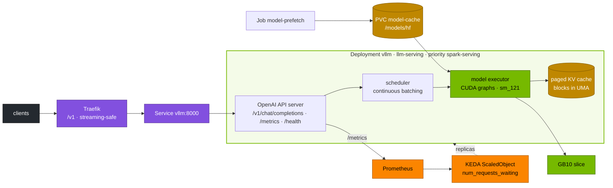

# Volume 21 — vLLM on Kubernetes on a DGX Spark: KV-Cache Budgeting, Probes, Autoscaling & Load Testing

> **Module 02 · Part VI — Serving** · Prev: [20 Workbook](20-hands-on-practice-exercises-workbook.md) · Next: [22 Triton](22-nvidia-triton-inference-server.md)

| | |
|---|---|
| **You will build** | A production-shaped vLLM Deployment: shared model cache, startup/readiness/liveness probes, graceful drain, UMA-aware memory flags, metrics and alerts, queue-depth autoscaling with KEDA, and a repeatable benchmark that gives you TTFT/TPOT/throughput for your GB10 |
| **Hardware** | spark-01 |
| **Time** | 90 min |
| **Risk** | Low. The model uses ~36 GiB of UMA at `--gpu-memory-utilization 0.30` |
| **Lab files** | [`manifests/90-serving/vllm/`](lab/manifests/90-serving/vllm/) (`vllm.yaml`, `vllm-bench.yaml`), [`manifests/60-storage/model-prefetch-job.yaml`](lab/manifests/60-storage/model-prefetch-job.yaml), [`manifests/90-serving/autoscaling.yaml`](lab/manifests/90-serving/autoscaling.yaml), [`manifests/95-observability/rules.yaml`](lab/manifests/95-observability/rules.yaml) |

---

## 1. Why this matters on a Spark

vLLM's throughput comes from **PagedAttention** (the KV cache is paged in fixed blocks, like virtual memory, so it doesn't fragment) and **continuous batching** (new requests join the running batch at every decode step). On a Spark there's one extra rule: `--gpu-memory-utilization` is a fraction of the **whole unified pool** (≈119.7 GiB), the same memory the OS, k3s, page cache and other pods use. On a discrete GPU, 0.90 is normal. Here, 0.90 would starve the whole machine.

| Flag | What it controls | Lab value | Rule of thumb on a Spark |
|---|---|---|---|
| `--gpu-memory-utilization` | weights + activations + KV cache ≤ fraction × total | 0.30 | sum over all engines ≤ 0.70 |
| `--max-model-len` | longest context per sequence | 8192 | only what users need. KV grows linearly |
| `--max-num-seqs` | concurrent sequences in the batch | 64 | lower → better latency, higher → throughput |
| `--enable-prefix-caching` | reuse KV for shared prefixes (system prompts, RAG templates) | on | almost always on |
| `--download-dir` / `HF_HOME` | where weights live | `/models/hf` (PVC) | never inside the container layer |

---

## 2. Architecture — HLD



---

## 3. LLD

### 3.1 KV-cache math

Per token, per sequence: `2 (K and V) × layers × kv_heads × head_dim × bytes_per_element`.

| Model | Layers | KV heads | Head dim | KV / token (BF16) | 8K context, 1 seq | 64 seqs × 2K tokens |
|---|---|---|---|---|---|---|
| Qwen2.5-0.5B-Instruct (lab smoke) | 24 | 2 | 64 | **12 KiB** | 96 MiB | 1.5 GiB |
| Qwen2.5-7B-Instruct | 28 | 4 | 128 | **56 KiB** | 448 MiB | 7 GiB |
| Llama-3.1-8B-Instruct | 32 | 8 | 128 | **128 KiB** | 1 GiB | 16 GiB |
| Qwen2.5-32B-Instruct | 64 | 8 | 128 | **256 KiB** | 2 GiB | 32 GiB |

Budget at `--gpu-memory-utilization 0.30` ≈ 36 GiB: the 0.5B model (≈1 GiB weights) leaves ~34 GiB for KV, which is huge. A 32B model in BF16 (~64 GiB weights) doesn't fit at all. Use FP8 or AWQ-INT4 (~17–35 GiB) and raise the fraction deliberately (modules 03/04). vLLM logs the exact figure at startup: `# GPU blocks: N` / `KV cache size: … tokens`.

### 3.2 Probes and lifecycle

| Mechanism | Setting | Protects against |
|---|---|---|
| `startupProbe` | `/health`, 10 s × 180 = 30 min | killing a pod that's still downloading or compiling (drill BF-05) |
| `readinessProbe` | `/health`, 5 s | routing to a loading or overloaded pod |
| `livenessProbe` | `/health`, 15 s × 4 | a wedged engine |
| `preStop: sleep 15` + `terminationGracePeriodSeconds: 120` | — | cutting in-flight streams on rollout (Vol 07 §5.6) |
| `strategy: Recreate` | — | two copies of the model in UMA during a rollout |
| `/dev/shm` 8 Gi | memory-backed emptyDir | tensor-parallel and worker IPC |

### 3.3 Metrics you'll use

| Metric | Meaning |
|---|---|
| `vllm:num_requests_running` / `vllm:num_requests_waiting` | batch size / queue depth. **Scale on waiting** |
| `vllm:kv_cache_usage_perc` (older: `gpu_cache_usage_perc`) | KV-cache fill. Near 1.0 → preemptions |
| `vllm:num_preemptions` | sequences evicted and recomputed |
| `vllm:time_to_first_token_seconds` | TTFT histogram (prefill + queue) |
| `vllm:inter_token_latency_seconds` (older: `time_per_output_token_seconds`) | decode speed per token |
| `vllm:prompt_tokens` / `vllm:generation_tokens` | token throughput counters |

The lab's rules use `A or B` so they work with both metric generations.

---

## 4. Integrations

- **Storage (Vol 11)**: the prefetch Job fills `model-cache`, and vLLM starts from local NVMe.
- **Ingress (Vol 09)**: point the Ingress at `vllm:8000` instead of `mock-llm` once you've proven the path with the mock.
- **Autoscaling**: KEDA reads Prometheus. On one GB10, extra replicas mostly add *queueing* capacity, not compute. `maxReplicaCount: 1` until spark-02 joins.
- **Modules 03–06**: each model family is a kustomize-style variation of this Deployment (model, quantisation, engine flags, chat template).

---

## 5. Lab

### 5.1 Prefetch weights, then deploy

```bash
cd "02 Kubernetes/lab"
kubectl -n llm-serving create secret generic hf-token --from-literal=token="${HF_TOKEN:-none}" --dry-run=client -o yaml | kubectl apply -f -
kubectl apply -f manifests/60-storage/model-prefetch-job.yaml
kubectl -n llm-serving wait --for=condition=complete job/model-prefetch --timeout=30m
sudo sh -c 'sync; echo 3 > /proc/sys/vm/drop_caches'      # on the Spark: start the load with a clean page cache
kubectl apply -k manifests/90-serving/vllm
kubectl -n llm-serving logs -f deploy/vllm | grep -E 'Loading|weights|KV cache|blocks|CUDA graph|Uvicorn|ERROR'
```

Expected log landmarks:

```text
INFO … Loading weights took 1.9 seconds
INFO … Model loading took 0.93 GiB and 3.1 seconds
INFO … Available KV cache memory: 33.4 GiB
INFO … GPU KV cache size: 2,918,000 tokens
INFO … Capturing CUDA graphs … took 12 seconds
INFO:     Uvicorn running on http://0.0.0.0:8000
```

(Numbers are illustrative. Note yours.)

### 5.2 First request (streaming)

```bash
kubectl -n llm-serving port-forward svc/vllm 8000 &
curl -s localhost:8000/v1/models | jq -r '.data[].id'
curl -sN localhost:8000/v1/chat/completions -H 'Content-Type: application/json' -d '{
  "model":"qwen2.5-0.5b","stream":true,"max_tokens":64,
  "messages":[{"role":"user","content":"In one sentence: what is unified memory on the DGX Spark?"}]}' \
  | sed -n 's/^data: //p' | grep -v DONE | jq -rj '.choices[0].delta.content // empty'; echo
```

### 5.3 Watch UMA during load and restart

```bash
scripts/uma-watch.sh llm-serving "$(kubectl -n llm-serving get pod -l app=vllm -o jsonpath='{.items[0].metadata.name}')" 2
```

While it runs, restart the Deployment in another terminal (`kubectl -n llm-serving rollout restart deploy/vllm`). `Recreate` frees the old pod's memory before the new one allocates. Change the strategy to `RollingUpdate` and repeat, and MemAvailable dips by roughly *two* engines' worth.

### 5.4 Graceful rollout with streams in flight

```bash
( for i in $(seq 5); do curl -sN localhost:8000/v1/chat/completions -H 'Content-Type: application/json' \
   -d '{"model":"qwen2.5-0.5b","stream":true,"max_tokens":1500,"messages":[{"role":"user","content":"Count slowly."}]}' \
   | tail -1 & done; wait ) &
sleep 3; kubectl -n llm-serving rollout restart deploy/vllm; wait
```

Expected: each stream ends with `data: [DONE]`. The preStop sleep and 120 s grace let running generations finish before SIGTERM. Streams longer than 120 s would still be cut, so size the grace to your longest generation.

### 5.5 Benchmark

```bash
kubectl apply -f manifests/90-serving/vllm/vllm-bench.yaml
kubectl -n llm-serving logs -f job/vllm-bench
```

Record, per concurrency (1 / 8 / 32): **output token throughput**, **mean and P99 TTFT**, **mean and P99 TPOT/ITL**. The shape to expect:

| Concurrency | Throughput | TTFT | TPOT |
|---|---|---|---|
| 1 | lowest | lowest | lowest |
| 8 | ~5–7× higher | slightly up | slightly up |
| 32 | highest (continuous batching) | up (queueing, prefill contention) | up |

Now repeat with `gemm-contention` at 2 replicas (Vol 14). The drop is what a noisy GPU neighbour costs your SLO.

### 5.6 Observability and alerts

```bash
curl -s localhost:8000/metrics | grep -E '^vllm:(num_requests_(running|waiting)|kv_cache_usage_perc|gpu_cache_usage_perc|num_preemptions)' | head
kubectl apply -k manifests/95-observability
```

In Grafana, row *Serving SLOs*: TTFT p95, TPOT p95, queue and KV cache. Force a `VLLMQueueBacklog` alert by running the benchmark at concurrency 256 with `--max-num-seqs=16`.

### 5.7 Queue-depth autoscaling (KEDA)

```bash
scripts/install-addons.sh keda
kubectl apply -f manifests/90-serving/autoscaling.yaml
kubectl -n llm-serving get scaledobject,hpa
```

With `maxReplicaCount: 1`, the vLLM ScaledObject only shows the metric (`kubectl get hpa -w` → current/target). The `mock-llm` ScaledObject really scales on in-flight connections at Traefik:

```bash
seq 400 | xargs -P64 -I{} curl -sN -o /dev/null http://llm.lab.local/v1/chat/completions -d '{"stream":true,"max_tokens":200}' &
kubectl -n llm-serving get deploy mock-llm -w        # 2 → up to 6, back after cooldown
```

---

## 6. Verify

```bash
scripts/verify.sh serving
```

| Check | Expected |
|---|---|
| `vLLM answered a chat completion` | PASS |
| startup log | `KV cache size` line recorded |
| rollout with 5 streams | 5 × `[DONE]` |
| benchmark | table for c = 1/8/32 saved |
| KEDA | `mock-llm` scales out under load and back after the cooldown |

---

## 7. Troubleshooting

| Symptom | Cause | Diagnose | Fix |
|---|---|---|---|
| `ValueError: … memory … is less than the model` / CUDA OOM at startup | fraction too small for weights + activations, **or** UMA already used by others | log line with requested vs available. `free -g` | raise the fraction carefully, drop page cache, scale down neighbours, quantise |
| `No available memory for the cache blocks` | weights fit, no room for KV | startup log | raise the fraction, or lower `--max-model-len` |
| Pod `OOMKilled` (137) | pod memory limit < CPU-side peak (tokenizer, CUDA graphs, host buffers) | `kubectl describe pod`, Vol 12 §5.5 result | raise the limit to measured peak + 20 % |
| Restarts during first start | liveness fires before load completes | events `Liveness probe failed` | startupProbe (as in the lab) |
| `no kernel image is available` | wheel/image without sm_121 | image tag | NGC vLLM image for DGX Spark / arm64 |
| High TTFT, low GPU use | queueing in front (ingress rate limit) or prefill-heavy prompts | `num_requests_waiting` vs running | raise `max-num-seqs`, chunked prefill (default in recent vLLM), prefix caching |
| Tokens arrive in bursts | buffering proxy | TTFB ≈ total (Vol 09 §5.3) | remove response buffering |
| `KV cache usage` ~1.0 and preemptions rising | too many long sequences | `vllm:num_preemptions` | lower `max-num-seqs`/`max-model-len`, or add capacity |

---

## 8. Scale-out path

| Lab | 2 Sparks | Datacenter |
|---|---|---|
| 1 replica, 1 slice | 2 replicas (one per Spark) behind Traefik, weights on NFS, KEDA `maxReplicaCount: 2` | many replicas, prefix/KV-aware routing (Gateway API Inference Extension, llm-d) |
| single-GPU model | tensor/pipeline parallel across the CX-7 (`--tensor-parallel-size 2` with Ray, or `--pipeline-parallel-size 2`) for models that don't fit one Spark | TP within NVLink domains, PP/EP across nodes, disaggregated prefill/decode (Vol 24) |
| KEDA on queue depth | same | + SLO-based scaling and admission control |

---

## 9. Checklist

- [ ] I can compute KV bytes per token for any model from its config and turn that into a context/concurrency budget.
- [ ] My vLLM pod starts from a pre-filled cache, drains gracefully, and never runs two copies during a rollout.
- [ ] I have TTFT/TPOT/throughput numbers for three concurrency levels, with and without a GPU neighbour.
- [ ] Alerts and autoscaling key off queue depth, not GPU utilisation.
