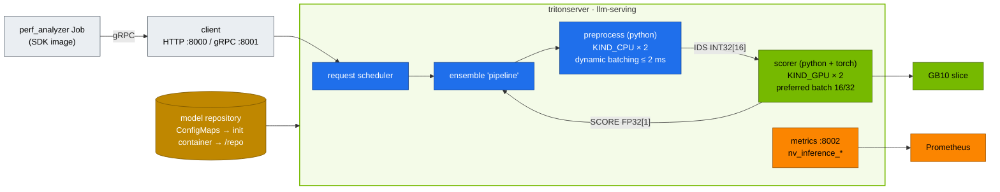

# Volume 22 — NVIDIA Triton Inference Server on the Spark: Model Repository, Ensembles, Dynamic Batching, perf_analyzer

> **Module 02 · Part VI — Serving** · Prev: [21 vLLM](21-vllm-high-throughput-llm-serving.md) · Next: [23 Alternatives & KServe](23-llm-inference-alternatives-and-kserve.md)

| | |
|---|---|
| **You will build** | A Triton deployment serving a two-step **ensemble** (tokenise on CPU → score on the GB10), fed from a GitOps-friendly model repository. You'll measure dynamic batching with Triton's own metrics, and load-test it with `perf_analyzer` over gRPC |
| **Hardware** | spark-01 |
| **Time** | 75 min |
| **Risk** | Low |
| **Lab files** | [`manifests/90-serving/triton/`](lab/manifests/90-serving/triton/) (`triton.yaml`, `model_repository/{preprocess,scorer,pipeline}`) |

---

## 1. Why this matters on a Spark

vLLM is an LLM engine. Triton is a **general inference server**: many models, many frameworks (TensorRT, TensorRT-LLM, ONNX Runtime, PyTorch, Python, FIL), one process, one API, one metrics endpoint. A realistic AI service needs both. Picture the chat model in vLLM or TensorRT-LLM, with embeddings, rerankers, classifiers, guardrail models and pre/post-processing in Triton.

| Triton feature | What it solves |
|---|---|
| Model repository + versions | declarative deploys, A/B by version, hot reload |
| Dynamic batching | many small requests → one efficient GPU batch |
| Instance groups | N copies of a model per GPU (or CPU) for concurrency |
| Ensembles / BLS | multi-step pipelines server-side, no client round trips |
| HTTP/REST + gRPC (KServe v2 protocol) | same API for every model |

---

## 2. Architecture — HLD



---

## 3. LLD

### 3.1 Repository layout

```text
/repo
├── preprocess/            config.pbtxt   1/model.py   # TEXT (BYTES) → IDS (INT32[16])
├── scorer/                config.pbtxt   1/model.py   # IDS → SCORE (FP32[1]), torch on cuda
└── pipeline/              config.pbtxt   1/           # ensemble: preprocess → scorer
```

In the lab, the files are kustomize-generated ConfigMaps, which an init container lays out into an `emptyDir`. In production the repository lives on a PVC, S3 or GCS (`--model-repository=s3://…`), and models are TensorRT engines or ONNX files.

### 3.2 Key config

| Model | `max_batch_size` | Batching | Instances | Why |
|---|---|---|---|---|
| preprocess | 64 | `max_queue_delay_microseconds: 2000` | 2 × CPU | cheap Python. Batches amortise per-call overhead |
| scorer | 64 | `preferred_batch_size: [16, 32]`, 2 ms | 2 × GPU 0 | GEMM efficiency needs batches. 2 instances overlap H2D and compute |
| pipeline | 64 | ensemble scheduling | — | one client call, two model hops |

### 3.3 Ports & metrics

| Port | Protocol | Notes |
|---|---|---|
| 8000 | HTTP/REST (KServe v2) | `/v2/health/ready`, `/v2/models/<m>/infer`, `/v2/repository/index` |
| 8001 | gRPC | Service `appProtocol: kubernetes.io/h2c` (Vol 09 §5.9) |
| 8002 | Prometheus | `nv_inference_request_success`, `nv_inference_count`, `nv_inference_exec_count`, `nv_inference_queue_duration_us`, `nv_inference_compute_infer_duration_us` |

**Average batch size = `nv_inference_count / nv_inference_exec_count`.** That's the number that proves dynamic batching works.

---

## 4. Integrations

- **Image choice:** `tritonserver:25.09-pyt-python-py3` ships PyTorch for the Python backend (the scorer uses `torch.cuda`). The plain `-py3` image would fall back to CPU. The SDK image `-py3-sdk` carries `perf_analyzer`.
- **TensorRT-LLM backend (modules 03–06)**: the same Deployment with the `-trtllm-python-py3` image and an engine built for sm_121.
- **Guardrails / RAG (module 05)**: rerankers and embedding models are natural Triton tenants next to vLLM.

---

## 5. Lab

### 5.1 Deploy

```bash
cd "02 Kubernetes/lab"
kubectl apply -k manifests/90-serving/triton
kubectl -n llm-serving logs deploy/triton -c layout
kubectl -n llm-serving rollout status deploy/triton --timeout=15m     # first pull ≈ 15 GB
kubectl -n llm-serving logs deploy/triton | grep -E 'successfully loaded|READY|Started'
```

Expected:

```text
| Model      | Version | Status |
| pipeline   | 1       | READY  |
| preprocess | 1       | READY  |
| scorer     | 1       | READY  |
I… Started GRPCInferenceService at 0.0.0.0:8001
I… Started HTTPService at 0.0.0.0:8000
I… Started Metrics Service at 0.0.0.0:8002
```

### 5.2 Talk to it

```bash
kubectl -n llm-serving port-forward svc/triton 8000 8002 &
curl -s localhost:8000/v2/health/ready -o /dev/null -w '%{http_code}\n'           # 200
curl -s -X POST localhost:8000/v2/repository/index | jq -c '.[]'
curl -s localhost:8000/v2/models/pipeline/config | jq '.ensemble_scheduling.step[].model_name'
curl -s -X POST localhost:8000/v2/models/pipeline/infer -H 'Content-Type: application/json' -d '{
  "inputs":[{"name":"TEXT","shape":[2,1],"datatype":"BYTES","data":["unified memory on the spark","two sparks over cx7"]}]}' | jq '.outputs[0]'
```

Expected: `{"name":"SCORE","datatype":"FP32","shape":[2,1],"data":[0.5…,0.4…]}`.

Confirm the scorer really runs on the GPU:

```bash
ssh nvidia@10.10.10.11 nvidia-smi --query-compute-apps=pid,process_name --format=csv   # a triton_python_backend_stub process
```

### 5.3 Load test and batching efficiency

```bash
before=$(curl -s localhost:8002/metrics | awk '/^nv_inference_(count|exec_count)\{model="scorer"/ {print $2}' | paste -sd' ')
kubectl -n llm-serving patch job triton-perf -p '{"spec":{"suspend":false}}'
kubectl -n llm-serving logs -f job/triton-perf | grep -E 'Concurrency|Throughput|p99 latency'
after=$(curl -s localhost:8002/metrics | awk '/^nv_inference_(count|exec_count)\{model="scorer"/ {print $2}' | paste -sd' ')
echo "$before | $after" | awk '{printf "scorer average batch size during the test: %.1f\n", ($4-$1)/($5-$2)}'
```

Expected shape: throughput rises with concurrency until the GPU or Python stub saturates, and **average batch size climbs well above 1**. Now set `max_queue_delay_microseconds: 0` in the scorer config, re-apply and repeat. Batch size falls towards 1, and throughput at high concurrency falls with it. That's the latency/throughput trade dynamic batching makes.

### 5.4 Instance groups

Change `count: 2` → `count: 1` for `scorer`, re-apply (`kubectl apply -k …` then `kubectl -n llm-serving rollout restart deploy/triton`), and repeat §5.3. With one instance, compute can't overlap with the Python stub's CPU work, and p99 latency rises at the same concurrency.

### 5.5 gRPC through the gateway

Add the `GRPCRoute` from Vol 09 §5.9, then from your laptop:

```bash
kubectl -n llm-serving run grpc-test --rm -it --restart=Never --image=nvcr.io/nvidia/tritonserver:25.09-py3-sdk -- \
  perf_analyzer -m pipeline -u triton:8001 -i grpc --string-data "hello spark" --concurrency-range 4
```

---

## 6. Verify

| Check | Expected |
|---|---|
| `/v2/health/ready` | 200 |
| repository index | 3 models `READY` |
| inference | 2 scores returned for 2 inputs |
| average scorer batch size under load | > 1 (typically several) |
| `nvidia-smi` on host | Triton Python stub listed as a GPU process |

---

## 7. Troubleshooting

| Symptom | Cause | Diagnose | Fix |
|---|---|---|---|
| `failed to load 'scorer' … ModuleNotFoundError: torch` | image without PyTorch | model load log | `-pyt-python-py3` image (lab default). The code falls back to CPU otherwise |
| model `UNAVAILABLE: Invalid argument: … dims` | config dims don't match the tensors the model returns | `/v2/models/<m>/config` | fix `config.pbtxt`. Remember `max_batch_size > 0` adds an implicit batch dim |
| ensemble error `unable to find … output` | step `output_map` key mismatch | `pipeline/config.pbtxt` | the map key is the *model's* tensor name, the value is the ensemble-internal name |
| gRPC `UNAVAILABLE` via Traefik | h2c not negotiated | Service `appProtocol` | `kubernetes.io/h2c` |
| batch size stays 1 | `max_queue_delay` 0, or clients too slow to overlap | metrics ratio | allow 1–5 ms delay. Raise client concurrency |
| pod Ready but model not | readiness checks server, not model | `/v2/models/pipeline/ready` | use a model-level readiness endpoint in the probe for single-model servers |

---

## 8. Scale-out path

| Lab | Datacenter |
|---|---|
| Python toy models | TensorRT engines, ONNX, TensorRT-LLM, FIL for trees |
| ConfigMap repository | S3/GCS repository, `--model-control-mode=explicit` + load API from CI |
| 1 pod | replicas behind the gateway. KServe `InferenceService` with the Triton runtime (Vol 23). NVIDIA NIM containers package Triton/TRT-LLM per model |
| manual perf_analyzer | Model Analyzer sweeps (instances × batch sizes × precisions) in CI |

---

## 9. Checklist

- [ ] I can lay out a Triton repository and explain every field in a `config.pbtxt`.
- [ ] My ensemble runs CPU and GPU steps server-side in one call.
- [ ] I proved dynamic batching with `nv_inference_count / nv_inference_exec_count`.
- [ ] I know when to put a model in Triton rather than vLLM.
