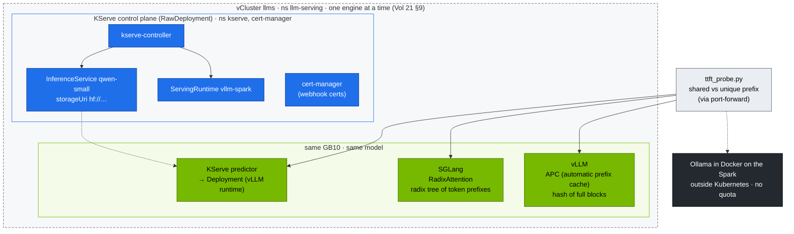

# Volume 23 — Choosing an Inference Engine & Platform: SGLang, TensorRT-LLM, llama.cpp/Ollama, KServe

> **Module 02 · Part VI — Serving** · Prev: [22 Triton](22-nvidia-triton-inference-server.md) · Next: [24 Disaggregated prefill/decode](24-disaggregated-prefill-and-decode-serving.md) · The lab's shape: [27 Nested clusters](27-nested-clusters-with-vcluster.md)

| | |
|---|---|
| **You will build** | SGLang side by side with vLLM on the same model and hardware, a measured prefix-cache speed-up with a portable TTFT probe, the same model served through **KServe** in RawDeployment mode — an operator with CRDs and webhooks installed only in the `llms` vCluster — and a decision matrix grounded in your own numbers |
| **Hardware** | spark-01. Engines run one at a time (`llm-serving` budget, Vol 21 §9) |
| **Time** | 90 min |
| **Risk** | Low. KServe installs cert-manager and webhooks — inside llms only; the root and dev-lab never see them |
| **Clusters** | `llms` (vLLM, SGLang, cert-manager, KServe and its CRDs) · `spark-root` (the real pods, the root quota, and — for Ollama — the host outside every quota) |
| **Lab files** | [`manifests/llms/90-serving/sglang/`](lab/manifests/llms/90-serving/sglang/sglang.yaml), [`manifests/llms/90-serving/kserve/`](lab/manifests/llms/90-serving/kserve/inferenceservice.yaml), [`scripts/ttft_probe.py`](lab/scripts/ttft_probe.py), [`scripts/install-addons.sh`](lab/scripts/install-addons.sh) `kserve` |

---

## 1. The engine landscape (as of the lab's pinned versions)

| Engine | Strength | Weakness | On a Spark |
|---|---|---|---|
| **vLLM** | broadest model support, PagedAttention, continuous batching, OpenAI API, huge community | tuning surface is large | NGC `nvcr.io/nvidia/vllm` for arm64/sm_121 (Vol 21) |
| **SGLang** | RadixAttention (automatic prefix reuse across requests), fast structured/JSON output, strong for agents and multi-turn | fewer exotic models | `lmsysorg/sglang:spark` build |
| **TensorRT-LLM** | peak performance: compiled engines, FP8/FP4 kernels, in-flight batching | build step per model/GPU/precision. Less flexible | via Triton TRT-LLM backend or `trtllm-serve` (modules 03–06) |
| **llama.cpp / Ollama** | GGUF quantisation, tiny footprint, trivial UX | lower throughput under concurrency, fewer serving features | great for dev boxes and single users. Ollama ships arm64 + CUDA |
| **Hugging Face TGI** | mature, simple | development has slowed relative to vLLM/SGLang (check upstream status) | not used in this lab |
| **NVIDIA NIM** | pre-built, validated containers per model (TRT-LLM/vLLM inside) + OpenAI API | licence/entitlement, fixed model list | check the NIM catalogue for DGX Spark support per model |

Platforms around the engines:

| Platform | Adds | Lab |
|---|---|---|
| plain Deployment + Service + Ingress | nothing, which is the point | Vol 21 |
| **KServe** (RawDeployment) | `InferenceService` CRD, runtimes, storage initializers, canary, autoscaling hooks | §5.4 |
| Ray Serve / KubeRay | Python-native composition, multi-node TP/PP with Ray | module 03 (DeepSeek multi-node) |
| llm-d / Dynamo | distributed, KV-aware, disaggregated serving at scale | Vol 24 §8 |

### 1.1 Why KServe lives in a vCluster here

KServe is the kind of add-on that shows why the lab nests clusters: it brings cluster-scoped CRDs (`InferenceService`, `ServingRuntime`, `ClusterServingRuntime`…), mutating and validating webhooks, and a hard dependency on cert-manager — another set of CRDs and webhooks. In one shared cluster, every team gets them, every upgrade is everyone's. Here `scripts/install-addons.sh kserve` installs both into **llms only**:

| Object | Exists in | Why |
|---|---|---|
| KServe + cert-manager CRDs, webhooks, controllers | llms API server (SQLite) | CRDs are never synced; the root's API server doesn't know `InferenceService` |
| controller *pods* (`kserve`, `cert-manager` namespaces) | root namespace `vc-llms` | they're ordinary pods → counted in the llms `vcluster-budget` |
| the predictor Deployment KServe generates | llms | a Deployment, like vLLM's — only its pods are synced |

The webhooks are called by the llms API server, which reaches the webhook Services by their ClusterIP — routed by the root's kube-proxy to pods in `vc-llms`.

---

## 2. Architecture — HLD



### 2.1 Prefix caching: why it matters for agents and RAG

Every request in a RAG or agent workflow repeats the same long system prompt, tool schema and few-shot examples. With prefix caching, the KV for that shared prefix is computed **once** and reused, so TTFT drops from "prefill the whole prompt" to "prefill only the new part".

| | vLLM APC | SGLang RadixAttention |
|---|---|---|
| Granularity | full KV blocks (e.g. 16 tokens), hash-matched | any token prefix, radix tree |
| Eviction | LRU of free blocks | LRU of tree nodes |
| Best at | identical prefixes | branching conversations, tree-of-thought, many partial overlaps |

---

## 3. LLD

| Setting | vLLM | SGLang | KServe (vllm-spark runtime) |
|---|---|---|---|
| memory flag | `--gpu-memory-utilization=0.20` | `--mem-fraction-static=0.20` | `--gpu-memory-utilization=0.20` |
| pod resources | 1500m · 12 Gi req / 32 Gi limit · 1 slice | same | same (in the `ServingRuntime`) |
| replicas | 1 (KEDA, Vol 21 §5.7) | 0 in the manifest — scale to 1 when vLLM is parked | `minReplicas: 1`, `maxReplicas: 1` |
| port | 8000 | 30000 | 8080 (container) → Service `qwen-small-predictor` 80 |
| health | `/health` | `/health` | KServe-managed probe on the predictor |
| metrics | `/metrics` (`vllm:*`) | `/metrics` with `--enable-metrics` (`sglang:*`) | runtime's own (`vllm:*`) |
| weights | PVC `model-cache` | PVC `model-cache` | storage-initializer downloads to an emptyDir (`hf://`) |

All three ask for the same 32 Gi limit, so each takes the single engine slot in `llm-serving` (Vol 21 §9). The root ServiceMonitor already keeps `vllm`, `sglang` and `qwen-small-predictor` Services, so whichever runs shows up in Prometheus with `vcluster="llms"`.

---

## 4. Integrations

- **llms budget (Vol 21 §9):** never run vLLM, SGLang and KServe's vLLM at once — `serving-budget` refuses the second one. Park vLLM with the KEDA pause annotation; SGLang starts at `replicas: 0`.
- **Gateway (Vol 09):** add an `HTTPRoute` rule per engine (`/sglang/v1` → `sglang:30000`) to A/B engines behind one hostname on `192.168.0.115`.
- **Admission (Vol 02):** `llm-serving` is labelled `spark.lab/tier: serving`, so the CEL policy `spark-serving-needs-readiness` applies to every Deployment there — including the one KServe generates. That is why the `vllm-spark` ServingRuntime carries its own startup and readiness probes: KServe copies them into the predictor Deployment.
- **Modules 03/04** use SGLang for DeepSeek/Qwen structured output and tool calling. The probe here is their baseline.

---

## 5. Lab

```bash
cd "02 Kubernetes/lab"
export KUBECONFIG="$PWD/../../01 Ansible/lab/.cache/kubeconfig-spark-lab.yaml"
```

### 5.1 Baseline: vLLM prefix-cache effect

```bash
kubectl --context llms -n llm-serving rollout status deploy/vllm          # from Vol 21
kubectl --context llms -n llm-serving port-forward svc/vllm 8000 &
python3 scripts/ttft_probe.py --url http://localhost:8000 --model qwen2.5-0.5b -n 10
kill %1
```

Record `shared prefix median`, `unique prefix median` and the speed-up.

### 5.2 Swap to SGLang

```bash
kubectl --context llms -n llm-serving annotate scaledobject vllm autoscaling.keda.sh/paused-replicas=0 --overwrite \
  || kubectl --context llms -n llm-serving scale deploy vllm --replicas=0
kubectl --context llms apply -k manifests/llms/90-serving/sglang
kubectl --context llms -n llm-serving scale deploy sglang --replicas=1
kubectl --context llms -n llm-serving rollout status deploy/sglang --timeout=30m
kubectl --context llms -n llm-serving logs deploy/sglang | grep -E 'max_total_num_tokens|Uvicorn|ready|ERROR'
kubectl --context llms -n llm-serving port-forward svc/sglang 30000 &
python3 scripts/ttft_probe.py --url http://localhost:30000 --model qwen2.5-0.5b -n 10
curl -s localhost:30000/metrics | grep -E '^sglang:(cache_hit_rate|num_running_reqs|gen_throughput)' ; kill %1
```

If SGLang stays at 0/1 with `exceeded quota: serving-budget`, vLLM's pod hadn't gone yet — `kubectl --context llms -n llm-serving get pods -l app=vllm`. Re-applying `manifests/llms/90-serving/sglang` later resets it to `replicas: 0`; that's deliberate.

### 5.3 Structured output (JSON schema)

Both engines accept OpenAI-style `response_format` with a JSON schema:

```bash
kubectl --context llms -n llm-serving port-forward svc/sglang 30000 &
curl -s localhost:30000/v1/chat/completions -H 'Content-Type: application/json' -d '{
 "model":"qwen2.5-0.5b","max_tokens":128,
 "messages":[{"role":"user","content":"Describe the DGX Spark GPU."}],
 "response_format":{"type":"json_schema","json_schema":{"name":"gpu","schema":{
   "type":"object","properties":{"name":{"type":"string"},"memory_gb":{"type":"integer"},"unified":{"type":"boolean"}},
   "required":["name","memory_gb","unified"]}}}}' | jq -r '.choices[0].message.content' | jq .
kill %1
```

Expected: valid JSON with exactly those three keys, **every time**. The engine constrains decoding to the schema. That's the foundation for tool calling (modules 03/04/06).

### 5.4 The same model through KServe (RawDeployment)

```bash
kubectl --context llms -n llm-serving scale deploy sglang --replicas=0
scripts/install-addons.sh kserve                      # cert-manager + KServe + cluster runtimes inside llms, RawDeployment default
kubectl --context llms get crd | grep -E 'kserve|cert-manager' | wc -l       # a dozen or more
kubectl --context spark-root get crd | grep -cE 'kserve|cert-manager'        # 0 — the root never heard of them
kubectl --context spark-root -n vc-llms get pods | grep -E 'kserve|cert-manager'   # but their pods run here
kubectl --context llms apply -k manifests/llms/90-serving/kserve
kubectl --context llms -n llm-serving get inferenceservice qwen-small -w      # READY True
kubectl --context llms -n llm-serving get deploy,svc,hpa -l serving.kserve.io/inferenceservice=qwen-small
kubectl --context llms -n llm-serving port-forward svc/qwen-small-predictor 8080:80 &
curl -s localhost:8080/v1/models | jq -r '.data[].id'
python3 scripts/ttft_probe.py --url http://localhost:8080 --model qwen-small -n 5; kill %1
```

What KServe generated for you: a Deployment with a storage-initializer init container (it downloads `hf://Qwen/Qwen2.5-0.5B-Instruct` to `/mnt/models`), a Service and — depending on min/max replicas — an HPA. Compare it with your hand-written Vol 21 manifest. Deleting the `InferenceService` removes all of it. Look at the root once more: `kubectl --context spark-root -n vc-llms get pods | grep qwen-small` — there's the predictor pod, and nothing else of KServe's object model.

The cost of the operator is visible too: compare `kubectl --context spark-root -n vc-llms describe resourcequota vcluster-budget` before and after the install. cert-manager's and KServe's controllers are charged to the llms budget, not to the platform.

### 5.5 (Optional) GGUF with Ollama, outside Kubernetes

For a quick single-user comparison on the host (DGX OS ships Docker, which shares containerd with the kubelet but not its accounting):

```bash
ssh nvidia@192.168.0.100
docker run -d --gpus=all -p 11434:11434 -v ollama:/root/.ollama --name ollama ollama/ollama
docker exec ollama ollama run qwen2.5:0.5b "One sentence about unified memory."
python3 scripts/ttft_probe.py --url http://localhost:11434 --model qwen2.5:0.5b -n 5   # Ollama speaks the OpenAI API at /v1
docker rm -f ollama
```

(Run the probe from a checkout of the repo on the Spark, or point `--url` at `http://192.168.0.100:11434` from the laptop.) Notice what this container is *not* part of: no vCluster, no ResourceQuota, no slice from the device plugin, no PriorityClass. It eats UMA and GPU time from the root's headroom and nothing in Kubernetes sees it — exactly why the lab keeps engines inside the clusters.

### 5.6 Fill in your decision matrix

| | vLLM | SGLang | KServe+vLLM | Ollama |
|---|---|---|---|---|
| cold TTFT (ms) | | | | |
| shared-prefix TTFT (ms) | | | | |
| throughput @32 (tok/s, `vllm bench serve` against each) | | | | |
| JSON-schema reliability | | | | |
| ops effort (1–5) | | | | |
| llms budget used (CPU · Gi · slices) | | | | n/a (outside) |

### 5.7 Back to the baseline

```bash
kubectl --context llms delete -k manifests/llms/90-serving/kserve
kubectl --context llms -n llm-serving annotate scaledobject vllm autoscaling.keda.sh/paused-replicas- \
  || kubectl --context llms -n llm-serving scale deploy vllm --replicas=1
```

---

## 6. Verify

| Check | Expected |
|---|---|
| prefix-cache speed-up (vLLM and SGLang) | shared-prefix TTFT clearly below unique-prefix TTFT |
| JSON-schema output | parses, has all required keys |
| `inferenceservice/qwen-small` | `READY True`, `/v1/models` lists `qwen-small` |
| KServe CRDs | present in llms, absent on the root |
| `serving-budget` | only one 32 Gi engine at a time |

---

## 7. Troubleshooting

| Symptom | Cause | Diagnose | Fix |
|---|---|---|---|
| SGLang/predictor 0/1, `exceeded quota: serving-budget` | another engine still holds the slot | `kubectl --context llms -n llm-serving describe resourcequota serving-budget` | park the other engine (Vol 21 §9) |
| vLLM comes back by itself after `scale --replicas=0` | KEDA's HPA enforces `minReplicaCount: 1` | `kubectl --context llms -n llm-serving get hpa` | use the `paused-replicas` annotation |
| SGLang OOM at start | another engine (any cluster) still holds UMA | `kubectl --context spark-root get pods -A -o wide`, `free -g` on the Spark | scale the other engine to 0, drop caches |
| SGLang image `exec format error` / no sm_121 kernels | wrong tag | image manifest | use the Spark build tag. Check release notes |
| no prefix speed-up | prefix caching off, or the prompt isn't *identical* (timestamps, request IDs in the system prompt) | engine flags, prompt diff | move variable content *after* the shared prefix |
| `InferenceService` not Ready: storage-initializer error | HF download blocked / no token for gated models | `kubectl --context llms -n llm-serving logs <pod> -c storage-initializer` | HF token secret + `serviceAccount` with the secret. Or `pvc://model-cache/…` storageUri |
| predictor Deployment denied: `serving workloads must define a readinessProbe` | a ServingRuntime without a readiness probe (yours, or one you edited) and `llm-serving` enforces one | `kubectl --context llms -n llm-serving get events` | keep the `readinessProbe` (`/health` on 8080) on the `ServingRuntime` container, as `vllm-spark` has |
| KServe webhook errors on apply | cert-manager not ready | `kubectl --context llms -n cert-manager get pods` | wait for cert-manager, then re-apply |
| cert-manager/KServe pods Pending with no scheduler events | the llms root budget is spent | `kubectl --context spark-root -n vc-llms describe resourcequota vcluster-budget` | park an engine or resize llms (Vol 27 §6.5) |
| Ollama slow under concurrency | single-request-optimised engine | ttft_probe with parallel clients | use vLLM/SGLang for shared services |

---

## 8. Scale-out path

| Lab | Datacenter |
|---|---|
| one engine at a time on one GPU | an engine per model pool. Heterogeneous pools (TRT-LLM for top traffic, vLLM for long tail) |
| KServe RawDeployment inside one vCluster | KServe with LLMInferenceService / llm-d integration, or NVIDIA Dynamo, for disaggregated, KV-aware routing — one serving cluster per team, operators upgraded per cluster |
| manual matrix | continuous benchmark in CI (same prompts, same SLOs) gating engine/image upgrades |

---

## 9. Checklist

- [ ] I measured prefix-cache benefit on two engines with the same probe.
- [ ] I produced schema-valid JSON reliably through constrained decoding.
- [ ] I deployed the same model as a hand-written Deployment and as a KServe `InferenceService`, and can explain the difference.
- [ ] I can show which KServe objects exist in llms, which exist on the root, and which budget pays for the operator.
- [ ] My engine choice is backed by numbers from my Spark.
