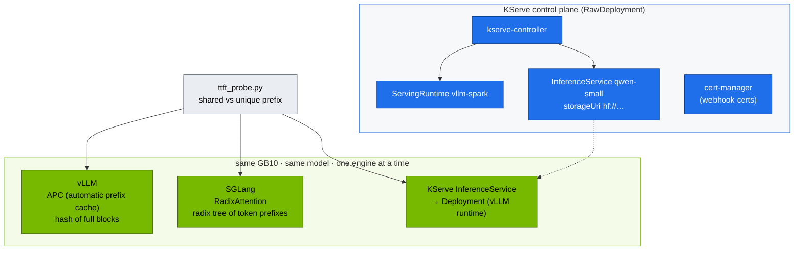

# Volume 23 — Choosing an Inference Engine & Platform: SGLang, TensorRT-LLM, llama.cpp/Ollama, KServe

> **Module 02 · Part VI — Serving** · Prev: [22 Triton](22-nvidia-triton-inference-server.md) · Next: [24 Disaggregated prefill/decode](24-disaggregated-prefill-and-decode-serving.md)

| | |
|---|---|
| **You will build** | SGLang side by side with vLLM on the same model and hardware, a measured prefix-cache speed-up with a portable TTFT probe, the same model served through **KServe** in RawDeployment mode, and a decision matrix grounded in your own numbers |
| **Hardware** | spark-01. Engines run one at a time (UMA budget) |
| **Time** | 90 min |
| **Risk** | Low. KServe installs cert-manager and webhooks |
| **Lab files** | [`manifests/90-serving/sglang/`](lab/manifests/90-serving/sglang/sglang.yaml), [`kserve/`](lab/manifests/90-serving/kserve/inferenceservice.yaml), [`scripts/ttft_probe.py`](lab/scripts/ttft_probe.py), [`scripts/install-addons.sh`](lab/scripts/install-addons.sh) `kserve` |

---

## 1. The engine landscape (as of the lab's pinned versions)

| Engine | Strength | Weakness | On a Spark |
|---|---|---|---|
| **vLLM** | broadest model support, PagedAttention, continuous batching, OpenAI API, huge community | tuning surface is large | NGC `nvcr.io/nvidia/vllm` for arm64/sm_121 (Vol 21) |
| **SGLang** | RadixAttention (automatic prefix reuse across requests), fast structured/JSON output, strong for agents and multi-turn | fewer exotic models | `lmsysorg/sglang:spark` build |
| **TensorRT-LLM** | peak performance: compiled engines, FP8/FP4 kernels, in-flight batching | build step per model/GPU/precision. Less flexible | via Triton TRT-LLM backend or `trtllm-serve` (modules 03–06) |
| **llama.cpp / Ollama** | GGUF quantisation, tiny footprint, trivial UX | lower throughput under concurrency, fewer serving features | great for dev boxes and single users. Ollama ships arm64 + CUDA |
| **Hugging Face TGI** | mature, simple | development has slowed relative to vLLM/SGLang (check upstream status) | not used in this lab |
| **NVIDIA NIM** | pre-built, validated containers per model (TRT-LLM/vLLM inside) + OpenAI API | licence/entitlement, fixed model list | check the NIM catalogue for DGX Spark support per model |

Platforms around the engines:

| Platform | Adds | Lab |
|---|---|---|
| plain Deployment + Service + Ingress | nothing, which is the point | Vol 21 |
| **KServe** (RawDeployment) | `InferenceService` CRD, runtimes, storage initializers, canary, autoscaling hooks | §5.4 |
| Ray Serve / KubeRay | Python-native composition, multi-node TP/PP with Ray | module 03 (DeepSeek multi-node) |
| llm-d / Dynamo | distributed, KV-aware, disaggregated serving at scale | Vol 24 §8 |

---

## 2. Architecture — HLD



### 2.1 Prefix caching: why it matters for agents and RAG

Every request in a RAG or agent workflow repeats the same long system prompt, tool schema and few-shot examples. With prefix caching, the KV for that shared prefix is computed **once** and reused, so TTFT drops from "prefill the whole prompt" to "prefill only the new part".

| | vLLM APC | SGLang RadixAttention |
|---|---|---|
| Granularity | full KV blocks (e.g. 16 tokens), hash-matched | any token prefix, radix tree |
| Eviction | LRU of free blocks | LRU of tree nodes |
| Best at | identical prefixes | branching conversations, tree-of-thought, many partial overlaps |

---

## 3. LLD

| Setting | vLLM | SGLang | KServe (vllm-spark runtime) |
|---|---|---|---|
| memory flag | `--gpu-memory-utilization=0.30` | `--mem-fraction-static=0.30` | `--gpu-memory-utilization=0.25` |
| port | 8000 | 30000 | 8080 (container) → Service 80 |
| health | `/health` | `/health` | `/v1/models` via KServe readiness |
| metrics | `/metrics` (`vllm:*`) | `/metrics` with `--enable-metrics` (`sglang:*`) | runtime's own |
| weights | PVC `model-cache` | PVC `model-cache` | storage-initializer downloads to an emptyDir (`hf://`) |

---

## 4. Integrations

- **UMA budget:** never run vLLM, SGLang and KServe's vLLM at once. The manifests start SGLang at `replicas: 0`. Scale one down before scaling another up.
- **Gateway (Vol 09):** add an `HTTPRoute` rule per engine (`/sglang/v1` → `sglang:30000`) to A/B engines behind one hostname.
- **Modules 03/04** use SGLang for DeepSeek/Qwen structured output and tool calling. The probe here is their baseline.

---

## 5. Lab

### 5.1 Baseline: vLLM prefix-cache effect

```bash
cd "02 Kubernetes/lab"
kubectl -n llm-serving port-forward svc/vllm 8000 &
python3 scripts/ttft_probe.py --url http://localhost:8000 --model qwen2.5-0.5b -n 10
kill %1
```

Record `shared prefix median`, `unique prefix median` and the speed-up.

### 5.2 Swap to SGLang

```bash
kubectl -n llm-serving scale deploy vllm --replicas=0
kubectl apply -k manifests/90-serving/sglang
kubectl -n llm-serving scale deploy sglang --replicas=1
kubectl -n llm-serving rollout status deploy/sglang --timeout=30m
kubectl -n llm-serving logs deploy/sglang | grep -E 'max_total_num_tokens|Uvicorn|ready|ERROR'
kubectl -n llm-serving port-forward svc/sglang 30000 &
python3 scripts/ttft_probe.py --url http://localhost:30000 --model qwen2.5-0.5b -n 10
curl -s localhost:30000/metrics | grep -E '^sglang:(cache_hit_rate|num_running_reqs|gen_throughput)' ; kill %1
```

### 5.3 Structured output (JSON schema)

Both engines accept OpenAI-style `response_format` with a JSON schema:

```bash
kubectl -n llm-serving port-forward svc/sglang 30000 &
curl -s localhost:30000/v1/chat/completions -H 'Content-Type: application/json' -d '{
 "model":"qwen2.5-0.5b","max_tokens":128,
 "messages":[{"role":"user","content":"Describe the DGX Spark GPU."}],
 "response_format":{"type":"json_schema","json_schema":{"name":"gpu","schema":{
   "type":"object","properties":{"name":{"type":"string"},"memory_gb":{"type":"integer"},"unified":{"type":"boolean"}},
   "required":["name","memory_gb","unified"]}}}}' | jq -r '.choices[0].message.content' | jq .
kill %1
```

Expected: valid JSON with exactly those three keys, **every time**. The engine constrains decoding to the schema. That's the foundation for tool calling (modules 03/04/06).

### 5.4 The same model through KServe (RawDeployment)

```bash
kubectl -n llm-serving scale deploy sglang --replicas=0
scripts/install-addons.sh kserve                      # cert-manager + KServe + cluster runtimes, RawDeployment default
kubectl apply -k manifests/90-serving/kserve
kubectl -n llm-serving get inferenceservice qwen-small -w      # READY True
kubectl -n llm-serving get deploy,svc,hpa -l serving.kserve.io/inferenceservice=qwen-small
kubectl -n llm-serving port-forward svc/qwen-small-predictor 8080:80 &
curl -s localhost:8080/v1/models | jq -r '.data[].id'
python3 scripts/ttft_probe.py --url http://localhost:8080 --model qwen-small -n 5; kill %1
```

What KServe generated for you: a Deployment with a storage-initializer init container (it downloads `hf://Qwen/Qwen2.5-0.5B-Instruct` to `/mnt/models`), a Service and an HPA. Compare it with your hand-written Vol 21 manifest. Deleting the `InferenceService` removes all of it.

### 5.5 (Optional) GGUF with Ollama, outside Kubernetes

For a quick single-user comparison on the host:

```bash
docker run -d --gpus=all -p 11434:11434 -v ollama:/root/.ollama --name ollama ollama/ollama
docker exec ollama ollama run qwen2.5:0.5b "One sentence about unified memory."
python3 scripts/ttft_probe.py --url http://localhost:11434 --model qwen2.5:0.5b -n 5   # Ollama speaks the OpenAI API at /v1
docker rm -f ollama
```

### 5.6 Fill in your decision matrix

| | vLLM | SGLang | KServe+vLLM | Ollama |
|---|---|---|---|---|
| cold TTFT (ms) | | | | |
| shared-prefix TTFT (ms) | | | | |
| throughput @32 (tok/s, `vllm bench serve` against each) | | | | |
| JSON-schema reliability | | | | |
| ops effort (1–5) | | | | |

---

## 6. Verify

| Check | Expected |
|---|---|
| prefix-cache speed-up (vLLM and SGLang) | shared-prefix TTFT clearly below unique-prefix TTFT |
| JSON-schema output | parses, has all required keys |
| `inferenceservice/qwen-small` | `READY True`, `/v1/models` lists `qwen-small` |

---

## 7. Troubleshooting

| Symptom | Cause | Diagnose | Fix |
|---|---|---|---|
| SGLang OOM at start | another engine still holds UMA | `kubectl -n llm-serving get pods`, `free -g` | scale the other engine to 0, drop caches |
| SGLang image `exec format error` / no sm_121 kernels | wrong tag | image manifest | use the Spark build tag. Check release notes |
| no prefix speed-up | prefix caching off, or the prompt isn't *identical* (timestamps, request IDs in the system prompt) | engine flags, prompt diff | move variable content *after* the shared prefix |
| `InferenceService` not Ready: storage-initializer error | HF download blocked / no token for gated models | `kubectl logs <pod> -c storage-initializer` | HF token secret + `serviceAccount` with the secret. Or `pvc://model-cache/…` storageUri |
| KServe webhook errors on apply | cert-manager not ready | `kubectl -n cert-manager get pods` | wait for cert-manager, then re-apply |
| Ollama slow under concurrency | single-request-optimised engine | ttft_probe with parallel clients | use vLLM/SGLang for shared services |

---

## 8. Scale-out path

| Lab | Datacenter |
|---|---|
| one engine at a time on one GPU | an engine per model pool. Heterogeneous pools (TRT-LLM for top traffic, vLLM for long tail) |
| KServe RawDeployment | KServe with LLMInferenceService / llm-d integration, or NVIDIA Dynamo, for disaggregated, KV-aware routing |
| manual matrix | continuous benchmark in CI (same prompts, same SLOs) gating engine/image upgrades |

---

## 9. Checklist

- [ ] I measured prefix-cache benefit on two engines with the same probe.
- [ ] I produced schema-valid JSON reliably through constrained decoding.
- [ ] I deployed the same model as a hand-written Deployment and as a KServe `InferenceService`, and can explain the difference.
- [ ] My engine choice is backed by numbers from my Spark.
