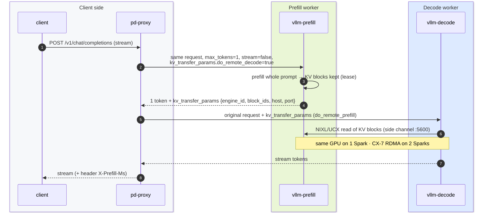
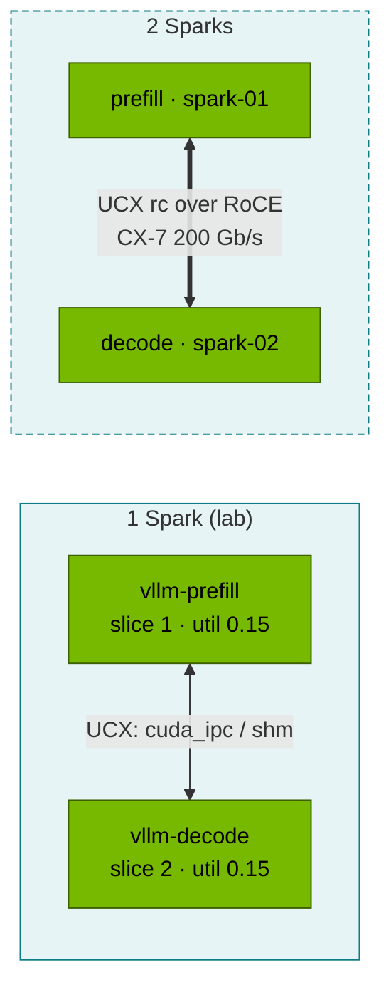

# Volume 24 — Disaggregated Prefill & Decode: KV-Cache Transfer with vLLM + NIXL, Routing, and When It Pays Off

> **Module 02 · Part VI — Serving** · Prev: [23 Alternatives & KServe](23-llm-inference-alternatives-and-kserve.md) · Next: [25 Hyperscaler silicon](25-hyperscaler-silicon-and-compilers.md)

| | |
|---|---|
| **You will build** | A working prefill/decode (P/D) split: two vLLM instances with the NIXL KV connector and a small proxy that routes each request prefill → decode. You'll see the KV handoff in logs and headers, plus a transfer-time model that tells you when disaggregation is worth it. On two Sparks, the KV cache moves over the CX-7 |
| **Hardware** | spark-01 (both roles share the GB10 via 2 slices: mechanics, not speed). 2 Sparks for §5.5 |
| **Time** | 90 min |
| **Risk** | Medium-low. Experimental feature: pin versions, and verify `import nixl` in your image first |
| **Lab files** | [`manifests/90-serving/pd-disagg/`](lab/manifests/90-serving/pd-disagg/) (`pd.yaml`, `pd_proxy.py`) |

---

## 1. Why this matters

LLM inference has two phases with opposite hardware appetites:

| | Prefill | Decode |
|---|---|---|
| Work | process the whole prompt in parallel | one token per step per sequence |
| Bound by | **compute** (big GEMMs) | **memory bandwidth** (read all weights + KV each step) |
| Latency metric | TTFT | TPOT / inter-token latency |
| Batch behaviour | a few long prompts saturate the GPU | many sequences needed to use the GPU |

In one engine, a burst of long prompts stalls every in-flight decode (TPOT spikes), and a crowd of decoders delays new prefills (TTFT spikes). **Disaggregation** runs them on separate workers sized and scaled independently, at the cost of moving the prompt's KV cache from P to D.

---

## 2. Architecture — HLD





---

## 3. LLD

### 3.1 Components

| Object | Key settings |
|---|---|
| `vllm-prefill`, `vllm-decode` Deployments | `--kv-transfer-config={"kv_connector":"NixlConnector","kv_role":"kv_both"}`, `--enforce-eager`, `--gpu-memory-utilization=0.15` each, `VLLM_NIXL_SIDE_CHANNEL_HOST=<podIP>`, port 5600, `UCX_TLS=all` |
| `pd-proxy` | stdlib Python (`pd_proxy.py`): prefill with `max_tokens=1` → copy `kv_transfer_params` → decode, streaming passthrough, `X-Prefill-Ms` header |
| Services | `vllm-prefill:8000`, `vllm-decode:8000`, `pd-proxy:8000` |

### 3.2 KV-transfer time model

KV bytes for a prompt = prompt tokens × KV bytes/token (Vol 21 §3.1). Transfer time ≈ bytes / effective bandwidth.

| Model | Prompt | KV size | CX-7 RDMA (~22 GB/s eff.) | 10 GbE TCP (~1.1 GB/s) | Same GPU (UMA copy) |
|---|---|---|---|---|---|
| Qwen2.5-0.5B | 4K tokens | 48 MiB | ~2 ms | ~45 ms | < 1 ms |
| Qwen2.5-7B | 4K | 224 MiB | ~10 ms | ~210 ms | ~1 ms |
| Llama-3.1-8B | 32K | 4 GiB | ~195 ms | ~3.9 s | ~15 ms |

**Rule:** disaggregation pays off when the TTFT/TPOT interference you remove is larger than the transfer you add. That means long prompts, strict TPOT SLOs, and a fast interconnect. Over the 10 GbE management network, it rarely pays off.

---

## 4. Integrations

- **Vol 21** supplies the model cache and monitoring. Both P and D export `vllm:*` metrics, and the dashboard's TTFT comes from prefill, TPOT from decode.
- **Vol 16/17**: on two Sparks, UCX needs the RDMA devices in the pods (Network Operator `rdma/rdma_shared_cx7` + `IPC_LOCK`, or hostNetwork) and `UCX_NET_DEVICES=rocep1s0f1:1,roceP2p1s0f1:1`.
- **Vol 09 §8**: at scale, the proxy's job moves into the gateway (Gateway API Inference Extension / llm-d / Dynamo routers), which also pick decode workers by KV-cache locality.

---

## 5. Lab

### 5.1 Pre-flight: does the image have NIXL?

```bash
cd "02 Kubernetes/lab"
kubectl -n llm-serving scale deploy vllm sglang --replicas=0 2>/dev/null
kubectl -n llm-serving run nixl-check --rm -i --restart=Never --image=nvcr.io/nvidia/vllm:25.09-py3 -- \
  python3 -c "import nixl, vllm; print('nixl OK, vllm', vllm.__version__)"
```

If `import nixl` fails, use a newer NGC vLLM tag that bundles it, or build a thin image `FROM nvcr.io/nvidia/vllm:<tag>` with `RUN pip install nixl` (and pin it).

### 5.2 Deploy P, D and the proxy

```bash
kubectl apply -k manifests/90-serving/pd-disagg
kubectl -n llm-serving rollout status deploy/vllm-prefill --timeout=30m
kubectl -n llm-serving rollout status deploy/vllm-decode --timeout=30m
kubectl -n llm-serving logs deploy/vllm-prefill | grep -iE 'nixl|kv_transfer|connector' | head
```

Expected: both engines log that the `NixlConnector` initialised (role `kv_both`) with a side-channel port.

### 5.3 Send traffic through the proxy

```bash
kubectl -n llm-serving port-forward svc/pd-proxy 8000 &
curl -sN -D /tmp/h localhost:8000/v1/chat/completions -H 'Content-Type: application/json' -d '{
  "model":"Qwen/Qwen2.5-0.5B-Instruct","stream":true,"max_tokens":64,
  "messages":[{"role":"user","content":"Explain prefill vs decode in two sentences."}]}' \
  | sed -n 's/^data: //p' | grep -v DONE | jq -rj '.choices[0].delta.content // empty'; echo
grep -i x-prefill-ms /tmp/h
kubectl -n llm-serving logs deploy/vllm-decode --since=1m | grep -iE 'nixl|remote|transfer' | tail -5
```

Evidence of a real handoff: the decode log shows remote-prefill/NIXL read activity for the request, and the prefill log shows a request with `max_tokens=1`. The proxy header reports how long prefill took.

### 5.4 Compare with a monolithic engine under mixed load

```bash
python3 scripts/ttft_probe.py --url http://localhost:8000 --model Qwen/Qwen2.5-0.5B-Instruct -n 10      # through P/D
kill %1
kubectl delete -k manifests/90-serving/pd-disagg
kubectl -n llm-serving scale deploy vllm --replicas=1 && kubectl -n llm-serving rollout status deploy/vllm
kubectl -n llm-serving port-forward svc/vllm 8000 &
python3 scripts/ttft_probe.py --url http://localhost:8000 --model qwen2.5-0.5b -n 10; kill %1
```

On one GB10 expect **no latency win**, and possibly a small loss: both roles share the same compute, and the proxy adds a hop. That's the honest result, and it's the point. Disaggregation is an *interference* fix for separate hardware. Write down both numbers. §5.5 is where the architecture starts to make sense.

### 5.5 (2 Sparks) Prefill on spark-01, decode on spark-02

Add to the prefill Deployment `nodeSelector: {kubernetes.io/hostname: spark-01}`, to decode `spark-02`, plus on both:

```yaml
        env:
          - {name: UCX_NET_DEVICES, value: "rocep1s0f1:1,roceP2p1s0f1:1"}
          - {name: UCX_TLS, value: "rc,cuda_copy,cuda_ipc"}
        securityContext: {capabilities: {add: [IPC_LOCK]}}
        resources: {limits: {rdma/rdma_shared_cx7: "1"}}     # Network Operator (Vol 16 §5.6)
```

Then run a prefill-heavy mix (long prompts, short outputs) against both setups with `vllm bench serve --random-input-len 8192 --random-output-len 64`. Now decode TPOT stays flat while prefill runs on the other Spark.

---

## 6. Verify

| Check | Expected |
|---|---|
| `import nixl` in the image | OK |
| proxy response | streamed tokens + `X-Prefill-Ms` header |
| decode log | NIXL/remote-prefill activity per request |
| written result | P/D vs monolithic TTFT on 1 Spark (and on 2 if available) |

---

## 7. Troubleshooting

| Symptom | Cause | Diagnose | Fix |
|---|---|---|---|
| decode recomputes the prompt (slow, no NIXL logs) | `kv_transfer_params` not forwarded, or prefill returned none | proxy logic, prefill response JSON | proxy must copy `kv_transfer_params` from the prefill response |
| `NIXL handshake failed / timeout` | side-channel host/port unreachable | `VLLM_NIXL_SIDE_CHANNEL_HOST` = pod IP, containerPort 5600, NetworkPolicy | allow 5600 between the two Deployments (same namespace is allowed in the lab) |
| UCX errors `no usable transports` | UCX can't find RDMA/cuda transports | `UCX_LOG_LEVEL=info` | set `UCX_TLS`, give pods RDMA devices + `IPC_LOCK` |
| KV blocks freed before decode reads them | lease too short under load | prefill log `lease expired` | `kv_connector_extra_config.kv_lease_duration` |
| OOM when both start | two engines × fraction > free UMA | `free -g` | 0.15 each (lab), scale other engines to 0 |

---

## 8. Scale-out path

| Lab | Datacenter |
|---|---|
| 1 P + 1 D, stdlib proxy | xP + yD pools sized from traffic mix (prefill-heavy RAG vs decode-heavy chat), KV-aware router (llm-d, NVIDIA Dynamo, Gateway API Inference Extension) |
| UCX over one CX-7 link | NIXL over IB/RoCE rails, GPUDirect RDMA, KV offload tiers (CPU memory → NVMe → remote, e.g. LMCache) |
| manual comparison | SLO-driven autoscaling per pool (TTFT for P, TPOT for D) |

---

## 9. Checklist

- [ ] I can explain why prefill and decode interfere, and which metric each one hurts.
- [ ] I ran a P/D split and found evidence of the KV handoff in logs and headers.
- [ ] I can estimate KV-transfer time for any model/prompt/link and decide whether P/D pays off.
- [ ] I have an honest one-Spark result, and a plan for the two-Spark experiment.
