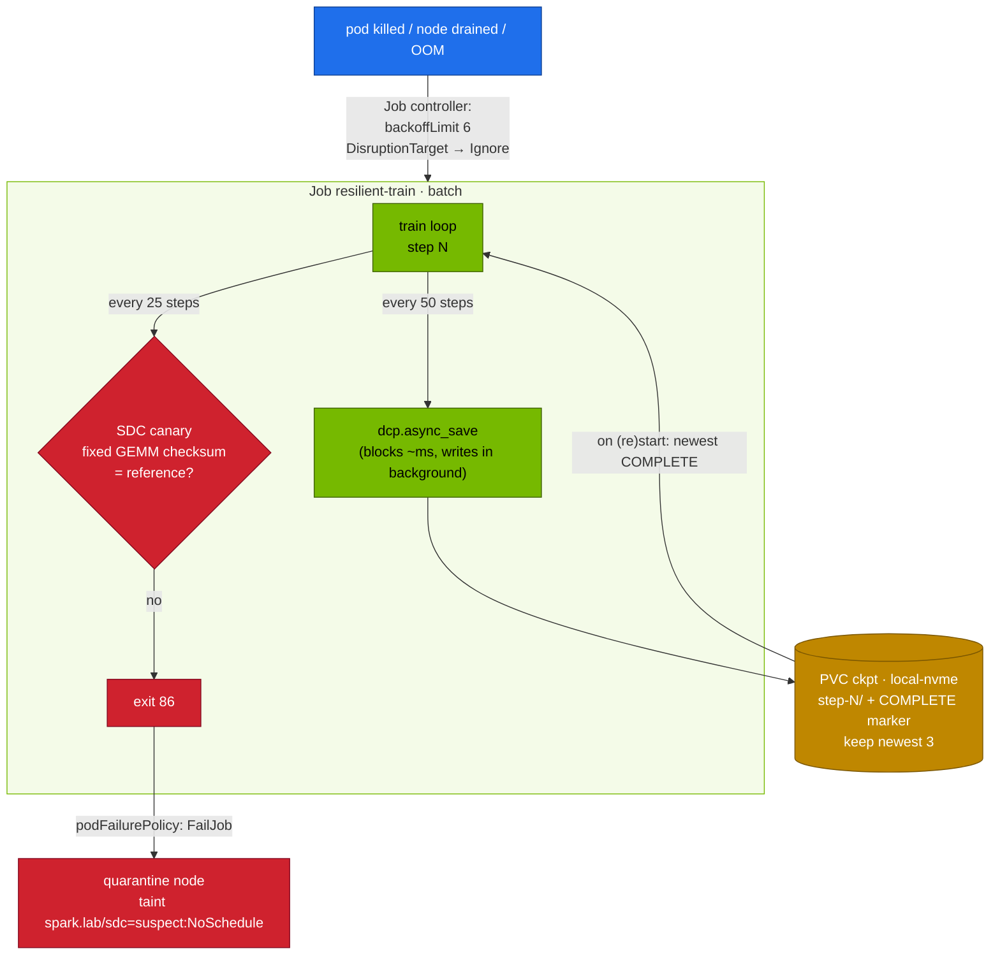

# Volume 26 — Resilience at Scale, Practised Small: Failure Math, Async Checkpoints, SDC Canaries, Quarantine

> **Module 02 · Part VII — Hyperscale** · Prev: [25 Accelerators & compilers](25-hyperscaler-silicon-and-compilers.md) · Up: [Module README](README.md)

| | |
|---|---|
| **You will build** | The operating model hyperscalers use to keep 10k–100k-GPU jobs productive, rehearsed on one Spark. You'll have a failure-rate and checkpoint-interval calculator, a training Job that survives pod kills by resuming from **async** distributed checkpoints, a **silent-data-corruption canary** that fails fast, and node quarantine by taint |
| **Hardware** | spark-01 |
| **Time** | 75 min |
| **Risk** | Low |
| **Lab files** | [`scripts/mtbf_calc.py`](lab/scripts/mtbf_calc.py), [`manifests/80-distributed/resilient/`](lab/manifests/80-distributed/resilient/) (`train_resilient.py`, `resilient-job.yaml`) |

---

## 1. Why this matters

At scale, failure is the normal state. With independent failures, cluster MTBF = component MTBF / N:

```bash
cd "02 Kubernetes/lab"
python3 scripts/mtbf_calc.py --gpus 2      --gpu-mtbf-h 50000
python3 scripts/mtbf_calc.py --gpus 16384  --ckpt-s 60 --restart-s 600
python3 scripts/mtbf_calc.py --gpus 100000 --ckpt-s 60 --restart-s 600
```

| GPUs | Cluster MTBF | Interruptions/day | Optimal ckpt interval | Goodput (60 s ckpt) | Goodput (6 s async ckpt) |
|---|---|---|---|---|---|
| 2 (your Sparks) | ~25,000 h | ~0 | — | ~100 % | ~100 % |
| 16,384 | ~3 h | ~8 | ~19 min | ~84 % | ~91 % |
| 100,000 | ~0.5 h | ~48 | ~8 min | ~41 % | ~59 % |

(The 16k row matches the order of magnitude reported publicly for frontier training runs: several unexpected interruptions per day.) Two levers dominate: **make checkpoints cheap and non-blocking**, and **make recovery fast and automatic**. Both are rehearsed below.

### 1.1 Failure taxonomy (what actually stops big jobs)

| Class | Examples | Detection | Response |
|---|---|---|---|
| GPU hardware | ECC/Xid 48/94/95/79, fallen off bus, thermal | dmesg Xid, DCGM | drain, replace, restart job from checkpoint |
| Network | link flaps, symbol errors, degraded rails | NIC counters, NCCL timeouts | fabric health gate, reroute, drain node |
| Host / software | kernel panic, OOM, driver hang, filesystem stalls | node NotReady, watchdogs | reboot / reimage, restart job |
| **Silent data corruption** | a GPU returns wrong numbers without errors | canaries, loss spikes, cross-replica checksums | quarantine the node, roll back to a good checkpoint |
| Stragglers | throttling, noisy neighbours | per-rank step-time spread | cordon, replace with a hot spare |

---

## 2. Architecture — HLD



---

## 3. LLD

| Mechanism | Implementation in the lab | At scale |
|---|---|---|
| Checkpoint format | `torch.distributed.checkpoint` (DCP): sharded, reshardable | same (Megatron/FSDP/TorchTitan all use DCP-style) |
| Non-blocking save | `dcp.async_save` → wait for the previous save before starting the next | + staging to pinned host memory, multi-tier (local NVMe → object store) |
| Atomicity | `COMPLETE` marker written only after the save finishes. Resume only from marked dirs | same, or manifest/metadata commit |
| Retention | keep newest 3 complete | tiered: frequent local, sparse remote |
| Resume | newest `step-*/COMPLETE` on start | + elastic re-sharding when world size changes |
| Retry policy | `backoffLimit: 6`. `DisruptionTarget` (drain/preemption) **ignored** | job-level restarts without rescheduling (hot spares) |
| SDC | deterministic FP32 GEMM checksum vs reference, every 25 steps → exit 86 → `FailJob` | per-node burn-in, cross-replica gradient checksums, loss-spike detectors |
| Quarantine | manual taint (§5.4). The Vol 04 controller pattern can automate it | remediation controllers + DCGM diag before re-admission |

---

## 4. Integrations

- **Storage (Vol 11, module 08)**: checkpoint PVC on `local-nvme`. Watch etcd fsync (Vol 03) while checkpoints write.
- **Kueue (Vol 05)**: `DisruptionTarget` pods (preempted by Kueue or drained) don't burn retries.
- **Controllers (Vol 04)**: turn §5.4's manual quarantine into a controller that watches Jobs failing with exit 86.
- **01 Ansible `node_drain` / `spark_validate`**: the drain → validate → return loop for a quarantined node.

---

## 5. Lab

### 5.1 Start the resilient job

```bash
kubectl apply -k manifests/80-distributed/resilient
kubectl -n batch logs -f job/resilient-train
```

```text
canary reference recorded: 4ecd9864353a5b02
step 25 loss … canary 4ecd9864353a5b02 OK
step 50 checkpoint started (blocking 31 ms)
…
```

The **blocking** time is what the training loop pays per checkpoint. With async save it's milliseconds. The write itself continues in the background.

### 5.2 Kill it mid-run and watch it resume

```bash
sleep 20; kubectl -n batch delete pod -l job-name=resilient-train --wait=false
kubectl -n batch get pods -l job-name=resilient-train -w          # a new pod starts (backoffLimit)
kubectl -n batch logs -f job/resilient-train | grep -E 'RESUMED|DONE'
ls /data/k8s/batch/ckpt/                                            # on the Spark: newest 3 step-* + canary.json
```

Expected: `RESUMED from /ckpt/step-100 at step 100` (or whichever was the newest *complete* checkpoint), then `DONE at step 400`. Lost work per failure ≤ one checkpoint interval.

### 5.3 A drain doesn't count as a failure

```bash
kubectl -n batch delete job resilient-train; kubectl apply -k manifests/80-distributed/resilient
sleep 30
kubectl drain spark-01 --ignore-daemonsets --delete-emptydir-data --pod-selector=job-name=resilient-train --timeout=60s
kubectl -n batch get job resilient-train -o jsonpath='failed={.status.failed} {"\n"}'   # 0: DisruptionTarget ignored
kubectl uncordon spark-01
```

### 5.4 Simulate silent data corruption → fail fast → quarantine

Corrupt the stored reference (a stand-in for the GPU computing a different answer):

```bash
ssh nvidia@10.10.10.11 "echo '{\"sha\": \"deadbeefdeadbeef\"}' | sudo tee /data/k8s/batch/ckpt/canary.json"
kubectl -n batch delete job resilient-train; kubectl apply -k manifests/80-distributed/resilient
kubectl -n batch logs -f job/resilient-train | grep -E 'canary|SDC'
kubectl -n batch get job resilient-train -o jsonpath='{.status.conditions[?(@.type=="Failed")].reason}{"\n"}'   # PodFailurePolicy
```

Expected: `SDC SUSPECTED` at the first canary, exit 86, and the Job fails **immediately** with reason `PodFailurePolicy`. There are no retries, because retrying on a lying GPU makes things worse. Quarantine the node and record why:

```bash
kubectl taint node spark-01 spark.lab/sdc=suspect:NoSchedule
kubectl annotate node spark-01 spark.lab/quarantine-reason="canary mismatch job resilient-train $(date -Is)"
# after investigation (DCGM diag / vendor) — and restoring the real reference:
ssh nvidia@10.10.10.11 'sudo rm /data/k8s/batch/ckpt/canary.json'
kubectl taint node spark-01 spark.lab/sdc-; kubectl annotate node spark-01 spark.lab/quarantine-reason-
```

With one node, the taint blocks *all* new scheduling. That's what quarantine means, and why large clusters keep **hot spares** so a job restarts instantly on a replacement node.

### 5.5 Size your own checkpoint policy

Measure the blocking time from §5.1 logs and your restart time (pod kill → `RESUMED` line), then:

```bash
python3 scripts/mtbf_calc.py --gpus 2 --ckpt-s 0.05 --restart-s 90
python3 scripts/mtbf_calc.py --gpus 4096 --ckpt-s 0.05 --restart-s 90
```

---

## 6. Verify

| Check | Expected |
|---|---|
| async save blocking time | tens of ms |
| pod kill | `RESUMED from … step-N`, then `DONE at step 400` |
| drain | Job `failed=0` |
| SDC drill | Job `Failed` with reason `PodFailurePolicy` after one pod |
| checkpoint dir | exactly 3 `step-*` directories + `canary.json` |

---

## 7. Troubleshooting

| Symptom | Cause | Fix |
|---|---|---|
| resume picks a half-written checkpoint | no completion marker | only trust `COMPLETE` (as the script does) |
| checkpoints fill the disk | no retention | keep-N pruning of complete checkpoints. Alert on PVC usage |
| each restart burns retries during maintenance | `DisruptionTarget` not ignored | `podFailurePolicy` rule (lab) |
| resumed loss jumps | optimizer/RNG/dataloader state not saved | save optimizer + step (lab), plus RNG and dataloader position in real jobs |
| async save slows training anyway | NVMe saturated / page cache pressure on UMA | smaller or less frequent checkpoints. `ionice`. Watch `SparkUMAPressure` |

---

## 8. Scale-out path

| Lab | Hyperscale |
|---|---|
| single-rank DCP to local NVMe | sharded DCP from thousands of ranks → local NVMe → object store. Checkpoint every few minutes |
| pod-level retries | in-place job restart with hot-spare nodes (seconds, not minutes). Elastic torchrun / TorchFT for membership changes |
| one GEMM canary | burn-in + periodic canaries on every node, cross-replica checksums, automated quarantine and vendor RMA pipeline |
| manual taint | remediation controllers (NPD conditions → taint → drain → diag → return) |

---

## 9. Checklist

- [ ] I can estimate cluster MTBF, optimal checkpoint interval and goodput for any GPU count.
- [ ] My training job survives pod kills and drains, and resumes from the newest *complete* checkpoint.
- [ ] My SDC canary makes the job fail fast instead of retrying.
- [ ] I know what quarantine means operationally, and why hot spares exist.
