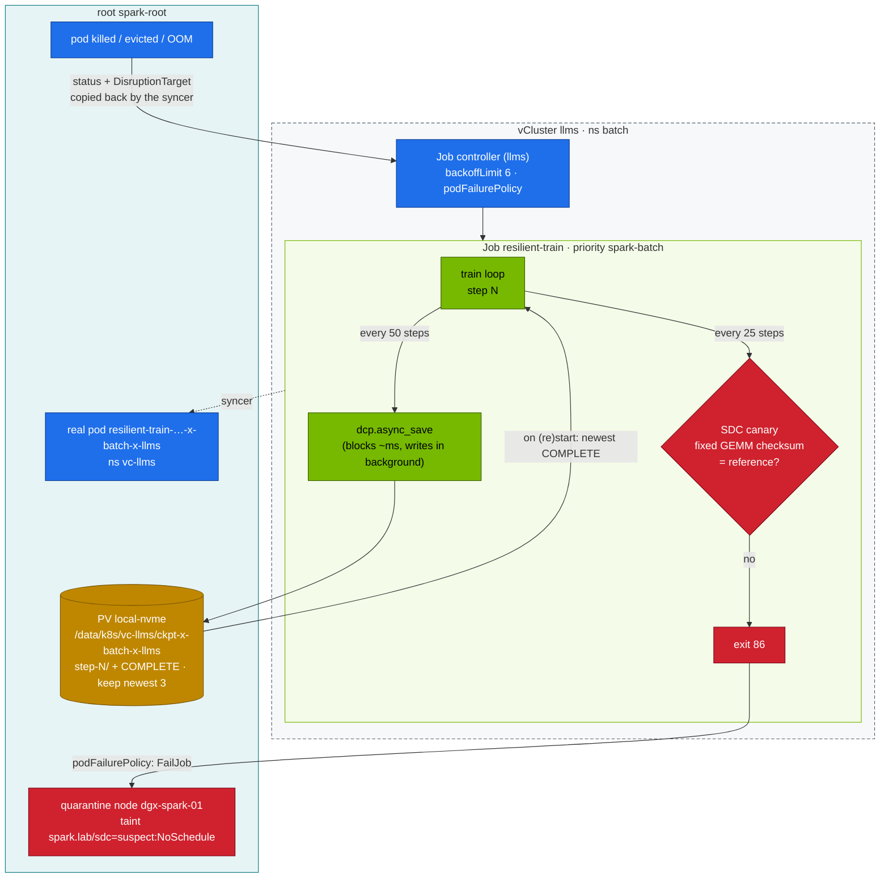

# Volume 26 — Resilience at Scale, Practised Small: Failure Math, Async Checkpoints, SDC Canaries, Quarantine

> **Module 02 · Part VII — Hyperscale** · Prev: [25 Accelerators & compilers](25-hyperscaler-silicon-and-compilers.md) · Next: [27 Nested clusters](27-nested-clusters-with-vcluster.md) · Up: [Module README](README.md)

| | |
|---|---|
| **You will build** | The operating model hyperscalers use to keep 10k–100k-GPU jobs productive, rehearsed on one Spark. You'll have a failure-rate and checkpoint-interval calculator, a training Job in the `llms` vCluster that survives pod kills by resuming from **async** distributed checkpoints, a **silent-data-corruption canary** that fails fast, and node quarantine by taint — on the root, where the real node lives |
| **Hardware** | dgx-spark-01 |
| **Time** | 75 min |
| **Risk** | Low. §5.4 taints the only node: nothing new schedules in any of the three clusters until you remove it |
| **Clusters** | `llms` (the Job, its retry policy, the checkpoint PVC) · `spark-root` (the real pod, the eviction, the node taint, the checkpoint directory on the NVMe) |
| **Lab files** | [`scripts/mtbf_calc.py`](lab/scripts/mtbf_calc.py), [`manifests/llms/80-distributed/resilient/`](lab/manifests/llms/80-distributed/resilient/) (`train_resilient.py`, `resilient-job.yaml`, `kustomization.yaml`) |

---

## 1. Why this matters

At scale, failure is the normal state. With independent failures, cluster MTBF = component MTBF / N:

```bash
cd "02 Kubernetes/lab"
python3 scripts/mtbf_calc.py --gpus 2      --gpu-mtbf-h 50000
python3 scripts/mtbf_calc.py --gpus 16384  --ckpt-s 60 --restart-s 600
python3 scripts/mtbf_calc.py --gpus 100000 --ckpt-s 60 --restart-s 600
```

| GPUs | Cluster MTBF | Interruptions/day | Optimal ckpt interval | Goodput (60 s ckpt) | Goodput (6 s async ckpt) |
|---|---|---|---|---|---|
| 2 (your Sparks) | ~25,000 h | ~0 | — | ~100 % | ~100 % |
| 16,384 | ~3 h | ~8 | ~19 min | ~84 % | ~91 % |
| 100,000 | ~0.5 h | ~48 | ~8 min | ~41 % | ~59 % |

(The 16k row matches the order of magnitude reported publicly for frontier training runs: several unexpected interruptions per day.) Two levers dominate: **make checkpoints cheap and non-blocking**, and **make recovery fast and automatic**. Both are rehearsed below.

### 1.1 Failure taxonomy (what actually stops big jobs)

| Class | Examples | Detection | Response |
|---|---|---|---|
| GPU hardware | ECC/Xid 48/94/95/79, fallen off bus, thermal | dmesg Xid, DCGM | drain, replace, restart job from checkpoint |
| Network | link flaps, symbol errors, degraded rails | NIC counters, NCCL timeouts | fabric health gate, reroute, drain node |
| Host / software | kernel panic, OOM, driver hang, filesystem stalls | node NotReady, watchdogs | reboot / reimage, restart job |
| **Silent data corruption** | a GPU returns wrong numbers without errors | canaries, loss spikes, cross-replica checksums | quarantine the node, roll back to a good checkpoint |
| Stragglers | throttling, noisy neighbours | per-rank step-time spread | cordon, replace with a hot spare |
| Control plane | API server or etcd down, a tenant cluster's control plane restarting | API errors, controller lag | running pods keep running; recovery waits for the controllers |

The last row is the one nesting makes concrete: if the llms control plane restarts, the training pod keeps running on the root (it's a root pod), but nothing in llms can *react* — no retry, no new pod — until llms is back.

### 1.2 Who reacts to what

| Event | Detected by | Reaction happens in |
|---|---|---|
| training process exits (kill, OOM, exit 86) | the root's kubelet | pod status → syncer → **llms**' Job controller applies `podFailurePolicy` / `backoffLimit` |
| eviction / drain | the root's API server (adds `DisruptionTarget`) | the same: the condition travels back with the pod status |
| node quarantine | you, on the **root** (nodes are only real there) | the root scheduler stops placing pods — for every cluster |

---

## 2. Architecture — HLD



---

## 3. LLD

| Mechanism | Implementation in the lab | At scale |
|---|---|---|
| Checkpoint format | `torch.distributed.checkpoint` (DCP): sharded, reshardable | same (Megatron/FSDP/TorchTitan all use DCP-style) |
| Non-blocking save | `dcp.async_save` → wait for the previous save before starting the next | + staging to pinned host memory, multi-tier (local NVMe → object store) |
| Atomicity | `COMPLETE` marker written only after the save finishes. Resume only from marked dirs | same, or manifest/metadata commit |
| Retention | keep newest 3 complete | tiered: frequent local, sparse remote |
| Resume | newest `step-*/COMPLETE` on start | + elastic re-sharding when world size changes |
| Retry policy | `backoffLimit: 6`. `DisruptionTarget` (drain/preemption) **ignored** | job-level restarts without rescheduling (hot spares) |
| SDC | deterministic FP32 GEMM checksum vs reference, every 25 steps → exit 86 → `FailJob` | per-node burn-in, cross-replica gradient checksums, loss-spike detectors |
| Quarantine | manual taint on the root node (§5.4). The Vol 04 controller pattern can automate it | remediation controllers + DCGM diag before re-admission |

| Resources (from `resilient-job.yaml`) | Value | Charged to |
|---|---|---|
| Job pod | 1 CPU · 6 Gi req / 12 Gi limit · 1 slice, `spark-batch` | `batch` LimitRange (inside llms), then the root `vcluster-budget` on `vc-llms` |
| PVC `ckpt` | 20 Gi, `local-nvme` (Delete) | `vcluster-budget` `requests.storage` |
| Kueue | the Job has no `kueue.x-k8s.io/queue-name` label, so Kueue leaves it alone | add `queue-name: train` to run it under `spark-cq` (Vol 05) |

`spark-batch` has `preemptionPolicy: Never`: the job waits for capacity instead of evicting anyone. With vLLM running (Vol 21) the llms budget may not have 1 CPU / 12 Gi left; the pod then sits Pending in llms with no scheduler events — the root refused it.

---

## 4. Integrations

- **Storage (Vol 11, module 08)**: checkpoint PVC on `local-nvme`, created by the root's provisioner under the *root* names. Watch the root's etcd fsync (Vol 03) while checkpoints write — same NVMe.
- **Kueue (Vol 05)**: `DisruptionTarget` pods (preempted by Kueue or evicted on the root) don't burn retries.
- **Controllers (Vol 04)**: turn §5.4's manual quarantine into a controller on the root that watches for Jobs failing with exit 86 — it has to read the vClusters' Jobs (through their APIs) or the synced pods' exit codes (on the root).
- **Disruption budgets (Vol 10)**: a root `kubectl drain` evicts pods from both vClusters and respects their PDBs (synced to the root).
- **01 Ansible `node_drain` / `spark_validate`**: the drain → validate → return loop for a quarantined node.

---

## 5. Lab

```bash
cd "02 Kubernetes/lab"
export KUBECONFIG="$PWD/../../01 Ansible/lab/.cache/kubeconfig-spark-lab.yaml"
kubectl --context spark-root -n vc-llms describe resourcequota vcluster-budget | grep -E 'requests.cpu|limits.memory|gpu'
```

If less than 1 CPU / 12 Gi is free, park vLLM for this volume (Vol 21 §9).

### 5.1 Start the resilient job

```bash
kubectl --context llms apply -k manifests/llms/80-distributed/resilient
kubectl --context llms -n batch logs -f job/resilient-train
```

```text
canary reference recorded: 4ecd9864353a5b02
step 25 loss … canary 4ecd9864353a5b02 OK
step 50 checkpoint started (blocking 31 ms)
…
```

The **blocking** time is what the training loop pays per checkpoint. With async save it's milliseconds. The write itself continues in the background. Find where the bytes really go:

```bash
kubectl --context llms -n batch get pvc ckpt                                   # Bound, local-nvme
kubectl --context spark-root -n vc-llms get pvc ckpt-x-batch-x-llms -o jsonpath='{.spec.volumeName}{"\n"}'
ssh nvidia@192.168.0.100 'ls /data/k8s/vc-llms/ckpt-x-batch-x-llms/'           # step-* + canary.json
```

### 5.2 Kill it mid-run and watch it resume

```bash
sleep 20; kubectl --context llms -n batch delete pod -l job-name=resilient-train --wait=false
kubectl --context llms -n batch get pods -l job-name=resilient-train -w          # a new pod starts (backoffLimit)
kubectl --context llms -n batch logs -f job/resilient-train | grep -E 'RESUMED|DONE'
```

Expected: `RESUMED from /ckpt/step-100 at step 100` (or whichever was the newest *complete* checkpoint), then `DONE at step 400`. Lost work per failure ≤ one checkpoint interval. The replacement pod was created by llms's Job controller; the root only saw one pod disappear and another arrive from the syncer.

### 5.3 An eviction doesn't count as a failure

A `kubectl drain` is, per pod, a call to the Eviction API — on the **root**, because that's where nodes and the real pods are. Draining the only node would evict all three clusters' workloads, so evict just the training pod, exactly as drain would:

```bash
kubectl --context llms -n batch delete job resilient-train; kubectl --context llms apply -k manifests/llms/80-distributed/resilient
sleep 30
VPOD=$(kubectl --context llms -n batch get pod -l job-name=resilient-train -o jsonpath='{.items[0].metadata.name}')
HPOD=$(kubectl --context spark-root -n vc-llms get pods --no-headers \
  -o custom-columns=N:.metadata.name,V:.metadata.annotations.vcluster\\.loft\\.sh/object-name | awk -v v="$VPOD" '$2==v{print $1}')
echo "$VPOD → $HPOD"
kubectl --context spark-root create --raw "/api/v1/namespaces/vc-llms/pods/$HPOD/eviction" -f - <<EOF
{"apiVersion":"policy/v1","kind":"Eviction","metadata":{"name":"$HPOD","namespace":"vc-llms"}}
EOF
kubectl --context llms -n batch get job resilient-train -o jsonpath='failed={.status.failed} {"\n"}'   # 0: DisruptionTarget ignored
```

The root's API server marks the evicted pod with the `DisruptionTarget` condition; the syncer copies the status back to the virtual pod; llms's Job controller reads the condition and applies the `Ignore` rule. Three components in two clusters, one retry policy. To see what a real drain would take with it: `kubectl --context spark-root drain dgx-spark-01 --ignore-daemonsets --delete-emptydir-data --dry-run=server`.

### 5.4 Simulate silent data corruption → fail fast → quarantine

Corrupt the stored reference (a stand-in for the GPU computing a different answer):

```bash
kubectl --context llms -n batch delete job resilient-train
ssh nvidia@192.168.0.100 "echo '{\"sha\": \"deadbeefdeadbeef\"}' | sudo tee /data/k8s/vc-llms/ckpt-x-batch-x-llms/canary.json"
kubectl --context llms apply -k manifests/llms/80-distributed/resilient
kubectl --context llms -n batch logs -f job/resilient-train | grep -E 'canary|SDC'
kubectl --context llms -n batch get job resilient-train -o jsonpath='{.status.conditions[?(@.type=="Failed")].reason}{"\n"}'   # PodFailurePolicy
```

Expected: `SDC SUSPECTED` at the first canary, exit 86, and the Job fails **immediately** with reason `PodFailurePolicy`. There are no retries, because retrying on a lying GPU makes things worse. Quarantine the node — on the root — and record why:

```bash
kubectl --context spark-root taint node dgx-spark-01 spark.lab/sdc=suspect:NoSchedule
kubectl --context spark-root annotate node dgx-spark-01 spark.lab/quarantine-reason="canary mismatch job llms/batch/resilient-train $(date -Is)"
kubectl --context llms get node dgx-spark-01 -o jsonpath='{.spec.taints}{"\n"}'      # tenants see the quarantine
kubectl --context dev-lab get node dgx-spark-01 -o jsonpath='{.spec.taints}{"\n"}'   # so does the other vCluster
```

Both vClusters show the taint because they sync the real node from the root. Neither can lift it: the virtual node is a copy, and edits to it are not written back to the root. With one node, the taint blocks *all* new scheduling in all three clusters — including a restarting vCluster control plane — while running pods carry on. That's what quarantine means, and why large clusters keep **hot spares** so a job restarts instantly on a replacement node.

After investigation (DCGM diag / vendor) — and restoring the real reference:

```bash
ssh nvidia@192.168.0.100 'sudo rm /data/k8s/vc-llms/ckpt-x-batch-x-llms/canary.json'
kubectl --context spark-root taint node dgx-spark-01 spark.lab/sdc-
kubectl --context spark-root annotate node dgx-spark-01 spark.lab/quarantine-reason-
```

### 5.5 Size your own checkpoint policy

Measure the blocking time from §5.1 logs and your restart time (pod kill → `RESUMED` line), then:

```bash
python3 scripts/mtbf_calc.py --gpus 2 --ckpt-s 0.05 --restart-s 90
python3 scripts/mtbf_calc.py --gpus 4096 --ckpt-s 0.05 --restart-s 90
```

Your restart time includes two hops a bare-metal cluster doesn't have: the syncer creating the root pod, and the status copy back. Compare it with a pod deleted in `platform-tools` on the root to see how much they add.

### 5.6 Clean up

```bash
kubectl --context llms delete -k manifests/llms/80-distributed/resilient    # Job + PVC (local-nvme deletes the directory)
```

---

## 6. Verify

| Check | Expected |
|---|---|
| async save blocking time | tens of ms |
| pod kill | `RESUMED from … step-N`, then `DONE at step 400` |
| root eviction | Job `failed=0` |
| SDC drill | Job `Failed` with reason `PodFailurePolicy` after one pod |
| quarantine | taint on the root node, visible from llms and dev-lab, removed afterwards |
| checkpoint dir | exactly 3 `step-*` directories + `canary.json` under `/data/k8s/vc-llms/ckpt-x-batch-x-llms` |

---

## 7. Troubleshooting

| Symptom | Cause | Fix |
|---|---|---|
| Job pod Pending in llms, no scheduler events | root `vcluster-budget` on `vc-llms` spent (an engine holds 32 Gi) | park vLLM (Vol 21 §9) or wait — `spark-batch` never preempts |
| Job pod Pending with `untolerated taint {spark.lab/sdc: suspect}` | the quarantine from §5.4 is still on | remove it on the root |
| resume picks a half-written checkpoint | no completion marker | only trust `COMPLETE` (as the script does) |
| checkpoints fill the disk | no retention | keep-N pruning of complete checkpoints. Alert on PVC usage |
| each restart burns retries during maintenance | `DisruptionTarget` not ignored, or the condition didn't reach the virtual pod | `podFailurePolicy` rule (lab); `kubectl --context llms -n batch get pod -o jsonpath='{..conditions}'` |
| eviction returns `429 Too Many Requests` | a PDB covers the pod (synced from a vCluster) | expected behaviour of drain (Vol 10 §5.5) |
| `ls /data/k8s/...` finds nothing | the PV directory uses the root's names | `kubectl --context spark-root get pv <volumeName> -o jsonpath='{.spec.hostPath.path}'` |
| resumed loss jumps | optimizer/RNG/dataloader state not saved | save optimizer + step (lab), plus RNG and dataloader position in real jobs |
| async save slows training anyway | NVMe saturated / page cache pressure on UMA | smaller or less frequent checkpoints. `ionice`. Watch `SparkUMAPressure` |

---

## 8. Scale-out path

| Lab | Hyperscale |
|---|---|
| single-rank DCP to local NVMe | sharded DCP from thousands of ranks → local NVMe → object store. Checkpoint every few minutes |
| pod-level retries by a tenant cluster's Job controller | in-place job restart with hot-spare nodes (seconds, not minutes). Elastic torchrun / TorchFT for membership changes |
| one GEMM canary | burn-in + periodic canaries on every node, cross-replica checksums, automated quarantine and vendor RMA pipeline |
| manual taint on the root | remediation controllers on the cluster that owns the nodes (NPD conditions → taint → drain → diag → return); tenant clusters only see the result |
| one node = quarantine stops everything | dgx-spark-02 joins the root (01 Ansible `k8s_workers`): a quarantined Spark leaves the other schedulable for both vClusters |

---

## 9. Checklist

- [ ] I can estimate cluster MTBF, optimal checkpoint interval and goodput for any GPU count.
- [ ] My training job survives pod kills and root evictions, and resumes from the newest *complete* checkpoint.
- [ ] I can say which cluster detects a failure and which one reacts to it.
- [ ] My SDC canary makes the job fail fast instead of retrying.
- [ ] I know what quarantine means operationally — on the root, for every cluster — and why hot spares exist.
