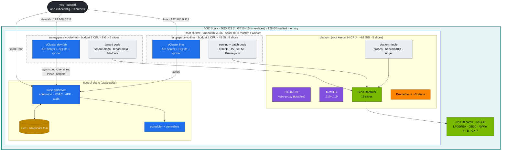
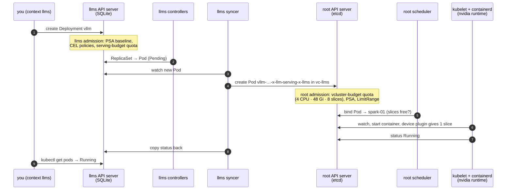

# Volume 27 — Nested Clusters on One DGX Spark: a kubeadm Root and Two vClusters

> **Module 02 · Part III — Workloads, storage, tenancy** · Prev: [26 Resilience at scale](26-ultra-scale-cluster-resilience-and-fault-tolerance.md) · Next: [Production MLOps](production-mlops.md) · Short path: [00 step-by-step](00-kubernetes-step-by-step-guide.md) · Whole picture: [15 Datacenter simulation](15-dgx-spark-datacenter-simulation-lab.md)

| | |
|---|---|
| **You will build** | The lab's shape: a **root** Kubernetes cluster (kubeadm, one node that is master *and* worker) that owns the Spark's hardware, and two **virtual clusters** inside it — `dev-lab` and `llms` — each with its own API server, its own budget and its own tenants |
| **Hardware** | 1 DGX Spark (a second one later joins the root as a worker) |
| **Time** | 1 h to build and explore, then it is the stage for every other volume |
| **Risk** | Low. A vCluster can be deleted and recreated in a minute; `01 Ansible playbooks/99-reset-kubernetes.yml` wipes everything |
| **Lab files** | [`lab/vclusters/`](lab/vclusters), [`lab/manifests/root/05-vclusters/`](lab/manifests/root/05-vclusters), `scripts/install-addons.sh vclusters`, 01 Ansible [`roles/vclusters`](../01%20Ansible/lab/roles/vclusters) |

---

## 1. Why nest clusters on one box

One Spark can only be one *node*. But a datacenter has *several clusters*: a platform cluster, a dev cluster, a production inference cluster, each owned by a different team, upgraded on its own schedule and broken without breaking the others. Namespaces can't give you that. Nested clusters can.

| What you want to practise | Namespaces in one cluster | Root + vClusters (this lab) |
|---|---|---|
| A team is cluster-admin of "its" cluster | no — CRDs, webhooks, ClusterRoles are global | yes, inside its vCluster |
| Install an operator only for one team (KServe, Kueue, cert-manager) | clashes with everyone | install it in that vCluster |
| Break the control plane and recover | breaks the whole lab | break `dev-lab`; `llms` and the root keep running |
| Multi-cluster GitOps, promotion dev → prod | one destination | three destinations (production-mlops) |
| Hard per-team budgets | namespace quotas | a root quota per vCluster **plus** tenant quotas inside |
| Real nodes, drains, node failure | yes | **only at the root** (a vCluster has no nodes of its own) |

### 1.1 Root on kubeadm, inner clusters on vCluster

| Layer | Distribution | Why |
|---|---|---|
| Root | **upstream Kubernetes with kubeadm** v1.36 | Same components and operations as production: static-pod control plane, etcd you snapshot and restore, `kubeadm upgrade`, kubelet config. Matches CKA/CKS and NVIDIA's GPU Operator docs |
| Inner | **vCluster** v0.37, standard Kubernetes distro, SQLite backing store | A full API server + controller-manager in **one pod**, data in SQLite on a 5 Gi PVC — no etcd to run. Created and deleted in a minute |

> **What happened to K3s inside?** vCluster changed its default distro from K3s to standard Kubernetes in v0.20 and **removed K3s support in v0.33**. Supported vCluster releases (0.34–0.37) run the standard distro only — which keeps what K3s offered here (a light, single-binary-style control plane) because the API server stores its data in an embedded SQLite database, just as K3s did. The lab therefore runs *Kubernetes in Kubernetes*: kubeadm outside, vCluster's Kubernetes inside.

---

## 2. HLD — the whole picture



The two dashed boxes are **ordinary root namespaces**. Everything a vCluster runs — its own control plane and every tenant pod — is a real pod in that namespace, counted against that namespace's root quota and scheduled by the **root's** scheduler onto the Spark.

---

## 3. LLD — the master tables

### 3.1 Clusters, contexts, endpoints

| Context | What it is | API endpoint | Runs |
|---|---|---|---|
| `spark-root` | kubeadm root cluster | `https://192.168.0.100:6443` | control plane, Cilium, MetalLB, GPU Operator, storage, metrics-server, kube-prometheus-stack, Argo CD, `platform-tools` |
| `dev-lab` | vCluster #1 in host namespace `vc-dev-lab` | `https://192.168.0.111:443` (MetalLB) | `tenant-alpha`, `tenant-beta`, `lab-tools` |
| `llms` | vCluster #2 in host namespace `vc-llms` | `https://192.168.0.112:443` (MetalLB) | `llm-serving`, `batch`, `ingress` (Traefik on `192.168.0.115`), Kueue, KEDA, KServe |

All three contexts live in one file, `01 Ansible/lab/.cache/kubeconfig-spark-lab.yaml`, which every lab script uses. Reserve `192.168.0.110–119` in your router's DHCP settings.

### 3.2 Budgets

| | CPU (requests) | Memory (requests = limits) | GPU time-slices | Storage |
|---|---|---|---|---|
| Spark total | 20 | ~119.7 GiB visible (128 GB) | 15 | ~3.7 TiB |
| vCluster `dev-lab` | **2** | **8 Gi** | **2** | 300 Gi |
| vCluster `llms` | **4** | **48 Gi** | **8** | 500 Gi |
| root keeps | 14 | ~64 GiB | 5 | the rest |

Defined in [`manifests/root/05-vclusters/quotas.yaml`](lab/manifests/root/05-vclusters/quotas.yaml) and checked against the GPU Operator's slice count and the MetalLB pool by [`tests/budget_check.py`](lab/tests/budget_check.py). Three rules shape these numbers:

- **CPU is capped on requests only.** A vCluster is guaranteed its share and may burst into idle CPU.
- **Memory is capped on requests *and* limits.** On a unified-memory box, memory is GPU memory too, so overcommit here is how model servers die.
- **GPU slices are time-slices, not GPUs.** All 15 share one GB10 and its memory (Volume 14). `llms` getting 8 slices means up to 8 GPU pods at once, not 8× the GPU.

The root's 14 CPUs and ~64 GiB are not idle: about 3 CPU / 10 GiB are reserved for DGX OS and Kubernetes (`systemReserved` + `kubeReserved`), and ~2 CPU / 8 GiB run the platform. The rest is headroom for platform jobs (benchmarks in `platform-tools`) and for growing the vClusters.

### 3.3 What a vCluster syncs

| Direction | Resources ([`vclusters/*.yaml`](lab/vclusters)) | Effect |
|---|---|---|
| vCluster → root | Pods, Services, Endpoints, PVCs, ConfigMaps, Secrets (default) | the workload really runs on the root |
| vCluster → root | **NetworkPolicies** | tenant policies are enforced by Cilium on the node |
| vCluster → root | **PriorityClasses** | the root scheduler can rank tenant pods (and preempt across vClusters — Volume 05) |
| vCluster → root | **PodDisruptionBudgets** | a root `kubectl drain` respects tenant PDBs (break/fix 11) |
| root → vCluster | **Nodes** (real, all) | tenants see the GB10 labels, 15 allocatable slices, taints |
| root → vCluster | **StorageClasses** | `local-path`, `local-nvme`, `local-nvme-retain` (read-only) |
| root → vCluster (llms) | Service `observability/kps-prometheus` as `default/prometheus` | KEDA queries the root's Prometheus |
| root → vCluster | metrics-server proxy | `kubectl top` and HPAs inside |
| not synced | Deployments, Jobs, CRDs, Ingresses, RBAC | these stay inside the vCluster; only their pods go down |

### 3.4 Names on the root

The syncer renames objects so two vClusters (or two namespaces) can't collide in one root namespace:

```text
inside llms:   llm-serving / vllm-7c9d5b6f4-x2k8p
on the root:   vc-llms     / vllm-7c9d5b6f4-x2k8p-x-llm-serving-x-llms
annotations:   vcluster.loft.sh/object-name=vllm-7c9d5b6f4-x2k8p
               vcluster.loft.sh/object-namespace=llm-serving
```

Services keep the same ClusterIP on both sides. Long names are shortened with a hash, so scripts find a pod's host copy through the annotations, not by building the name ([`scripts/lib.sh`](lab/scripts/lib.sh) `host_pod`).

---

## 4. Communication flow: one pod, three API servers

What happens when a tenant runs `kubectl --context llms apply -f vllm.yaml`:



The tenant's view stops at step 3. Steps 5–9 are the platform's, and the first place a problem shows up is often the **root's** admission in step 5: if the vCluster's budget is spent, the root refuses the pod and it stays `Pending` inside the vCluster with a sync error and *no scheduler events at all*. That one symptom (break/fix 02) is the most useful thing to recognise in this design.

---

## 5. Two layers of every control

| Control | Inside a vCluster (its own API server) | At the root | Volume |
|---|---|---|---|
| ResourceQuota | per-tenant ceilings (`tenant-budget`, `serving-budget`, Kueue `spark-cq`) | **the hard cap of the whole vCluster** (`vcluster-budget`) | 12 |
| Admission | PSA labels, 4 CEL policies (`common/15-admission`) | PSA on `vc-*`, LimitRange safety net | 02 |
| API fairness | APF lane for tenant users (`dev-lab/16-apf`) | APF lane for the **syncers**, by namespace (`root/16-apf`) | 02 |
| Network | tenant NetworkPolicies | Cilium `vcluster-boundary`: Prometheus may scrape, the two vClusters can't talk to each other | 06 |
| Scheduling | Kueue (llms), PriorityClasses | **one scheduler** for everything; preemption crosses vClusters | 05 |
| Audit | the vCluster's own API server | root audit log sees the syncer's writes in `vc-*` | 02 |
| Backup | SQLite on the vCluster's PVC | etcd snapshots (do **not** contain vCluster state) | 03 |

Inner quotas are ceilings, not reservations: `tenant-alpha` + `tenant-beta` + `lab-tools` may add up to more than `dev-lab`'s budget. Whoever asks first gets it; the next pod is refused by the root.

---

## 6. Step-by-step lab

### 6.1 Build it

Either path gives the same result. The vCluster definitions live once, in the 02 lab; Ansible applies those files.

```bash
# A — 01 Ansible (root cluster, GPU Operator, then the vClusters)
cd "01 Ansible/lab"
ansible-playbook playbooks/05-kubernetes.yml playbooks/06-gpu-operator.yml playbooks/06b-vclusters.yml
export KUBECONFIG=$PWD/.cache/kubeconfig-spark-lab.yaml

# B — the 02 lab scripts (after 05 + 06)
cd "02 Kubernetes/lab"
scripts/install-addons.sh storage
scripts/install-addons.sh metrics-server
scripts/install-addons.sh kps
scripts/install-addons.sh vclusters
```

**Gate:** `kubectl config get-contexts` lists `spark-root`, `dev-lab`, `llms`; `scripts/verify.sh vclusters` all PASS.

### 6.2 Look around

```bash
kubectl --context spark-root get nodes                    # 1 node: control plane + worker
kubectl --context dev-lab get nodes -L spark.lab/gpu,nvidia.com/gpu.product
kubectl --context dev-lab get node spark-01 -o jsonpath='{.status.allocatable.nvidia\.com/gpu}{"\n"}'   # 15
kubectl --context spark-root -n vc-dev-lab get pods        # dev-lab-0 = the whole vCluster control plane
kubectl --context dev-lab get ns                           # its own world
kubectl --context spark-root get ns | grep -c tenant       # 0 — tenants don't exist at the root
```

The node shows 15 slices inside `dev-lab` even though `dev-lab` may only use 2: nodes are synced as they are, budgets are enforced by quota.

### 6.3 Follow one pod through both clusters

```bash
kubectl --context dev-lab apply -k manifests/dev-lab/30-networking
kubectl --context dev-lab -n lab-tools get pods -o wide
kubectl --context spark-root -n vc-dev-lab get pods \
  -o custom-columns=ROOT-NAME:.metadata.name,VIRTUAL:.metadata.annotations.vcluster\\.loft\\.sh/object-name,IP:.status.podIP
kubectl --context dev-lab -n lab-tools get svc echo -o jsonpath='{.spec.clusterIP}{"\n"}'
kubectl --context spark-root -n vc-dev-lab get svc -o wide | grep echo      # same ClusterIP
```

Same pod IPs, same ClusterIPs: the network is the root's (Cilium, kube-proxy). Only the names and the API differ.

### 6.4 Spend a budget

```bash
scripts/breakfix.sh inject 02              # 6 pods × 1 slice in dev-lab (budget: 2)
kubectl --context dev-lab -n lab-tools get pods -l app=bf02          # 2 Running, 4 Pending
kubectl --context dev-lab -n lab-tools describe pod <a-pending-one> | tail -5
kubectl --context spark-root -n vc-dev-lab describe resourcequota vcluster-budget
scripts/breakfix.sh reset 02
```

The Pending pods have **no scheduler events** — the root never saw them.

### 6.5 Resize a vCluster

A vCluster's size is its root quota. No reinstall, no restart:

```bash
kubectl --context spark-root -n vc-llms patch resourcequota vcluster-budget --type merge \
  -p '{"spec":{"hard":{"requests.cpu":"6","requests.memory":"64Gi","limits.memory":"64Gi","requests.nvidia.com/gpu":"10"}}}'
kubectl --context spark-root -n vc-llms describe resourcequota vcluster-budget
```

Then make it permanent in `manifests/root/05-vclusters/quotas.yaml` (and the LimitRange `max` if single pods need to grow) and run `python3 tests/budget_check.py` — it fails if the vClusters together promise more than the Spark has. Shrinking works the same way, but doesn't evict running pods; it only blocks new ones until usage drops below the new limit.

### 6.6 Add a third vCluster (exercise)

1. Copy `vclusters/dev-lab.yaml` to `vclusters/train.yaml`; change the IP to `192.168.0.113` (in `annotations`, `extraSANs`, `exportKubeConfig.server`) and the context to `train`.
2. Add namespace `vc-train`, a `vcluster-budget` and a `vcluster-defaults` LimitRange to `manifests/root/05-vclusters` (take the CPU/memory/slices from the root's 14 / ~64 GiB / 5).
3. `kubectl --context spark-root apply -k manifests/root/05-vclusters`
4. `helm --kube-context spark-root upgrade --install train loft/vcluster --version $VCLUSTER_VERSION -n vc-train -f vclusters/train.yaml --wait`
5. `scripts/merge-vcluster-kubeconfig.sh train vc-train`
6. Add `vc-train` to `tests/budget_check.py`'s view by running it — then fix whatever it reports.

### 6.7 Back up and restore a vCluster

A root etcd snapshot does **not** contain a vCluster's objects: they live in SQLite on the vCluster's PVC, which `local-nvme` keeps at `/data/k8s/vc-<name>/<pvc>` on the Spark.

```bash
kubectl --context spark-root -n vc-dev-lab get pvc                      # data-dev-lab-0
kubectl --context spark-root -n vc-dev-lab scale statefulset dev-lab --replicas=0
sudo tar czf ~/dev-lab-$(date +%F).tgz -C /data/k8s/vc-dev-lab data-dev-lab-0
kubectl --context spark-root -n vc-dev-lab scale statefulset dev-lab --replicas=1
```

While the control plane is scaled to 0, tenant pods keep running (they are root pods); only the dev-lab API is gone. Restore = scale to 0, replace the directory, scale to 1. Newer `vcluster` CLIs also have `vcluster snapshot` — check `vcluster snapshot --help` for your version.

---

## 7. Verify

```bash
scripts/verify.sh vclusters
```

```text
── vclusters
[PASS] dev-lab control plane Running in vc-dev-lab
[PASS] dev-lab API answers (https://192.168.0.111:443)
[PASS] dev-lab root budget: 2 8Gi 2 (CPU · memory · GPU slices)
[PASS] dev-lab sees 1 real node(s) (sync.fromHost.nodes)
[PASS] dev-lab RuntimeClass nvidia
[PASS] llms control plane Running in vc-llms
[PASS] llms API answers (https://192.168.0.112:443)
[PASS] llms root budget: 4 48Gi 8 (CPU · memory · GPU slices)
[PASS] llms sees 1 real node(s) (sync.fromHost.nodes)
[PASS] llms RuntimeClass nvidia
[PASS] Cilium vCluster boundary policies
```

---

## 8. Troubleshooting

| Symptom | Likely cause | Check / fix |
|---|---|---|
| Pod `Pending` in a vCluster, **no** scheduler events | root quota on `vc-<name>` spent | `kubectl --context spark-root -n vc-<name> describe resourcequota vcluster-budget`; resize (§6.5) or free capacity |
| Pod `Pending` with `Insufficient nvidia.com/gpu` | all 15 slices in use across the Spark | root scheduler event; `kubectl --context spark-root get cm -n platform-tools gpu-slice-ledger -o yaml` |
| `context dev-lab` times out | control-plane pod not Running, or MetalLB didn't give `.111` | `kubectl --context spark-root -n vc-dev-lab get pods,svc`; `kubectl --context spark-root -n metallb-system logs -l app.kubernetes.io/component=speaker` |
| x509 error on `https://192.168.0.11x` | IP missing from `proxy.extraSANs` | fix `vclusters/<name>.yaml`, `helm upgrade` |
| `services.loadbalancers` quota exceeded | a tenant created a LoadBalancer Service | the root budget allows 1 (dev-lab) / 2 (llms) — by design |
| `runtimeclass "nvidia" not found` inside a vCluster | `00-platform` not applied in that vCluster | `kubectl --context <v> apply -k manifests/<v>/00-platform` |
| PVC `Pending` inside a vCluster | StorageClass name typo; root provisioner down | events are copied from the root PVC; `kubectl --context spark-root -n local-path-storage logs deploy/local-path-provisioner` |
| A BestEffort pod is rejected | the root memory quota requires memory limits | by design — a vCluster can't run BestEffort pods (Volume 12) |
| vCluster objects gone after an etcd restore? | they aren't — only root objects roll back | §6.7; restore the vCluster's PVC if you need its state rolled back too |

---

## 9. Scale-out and limits

- **spark-02** joins the *root* as a worker (01 Ansible `k8s_workers`). Both vClusters see the new node immediately (node sync) and the root scheduler spreads their pods. Budgets don't grow by themselves — raise the root quotas.
- **Control-plane HA**: each vCluster runs one control-plane replica with SQLite. For HA, vCluster supports several replicas with an embedded or external etcd; the root needs three control-plane nodes first (Volume 03 §8).
- **Hard isolation**: vClusters share the node, the kernel and the GPU. For tenants you don't trust, use separate nodes (a vCluster can pin its pods with a node selector) or separate physical clusters.
- **More clusters**: each extra vCluster costs ~0.3 CPU and ~0.5–1.5 Gi for its control plane, taken from its own budget.

---

## 10. Checklist

- [ ] I can draw the three API servers and say which one each lab volume talks to.
- [ ] I can explain why a pod can be Pending in a vCluster with no scheduler events — and find the root quota that caused it.
- [ ] I resized a vCluster with one `kubectl patch` and kept `budget_check.py` green.
- [ ] I backed up a vCluster's PVC and know that etcd snapshots don't cover it.
