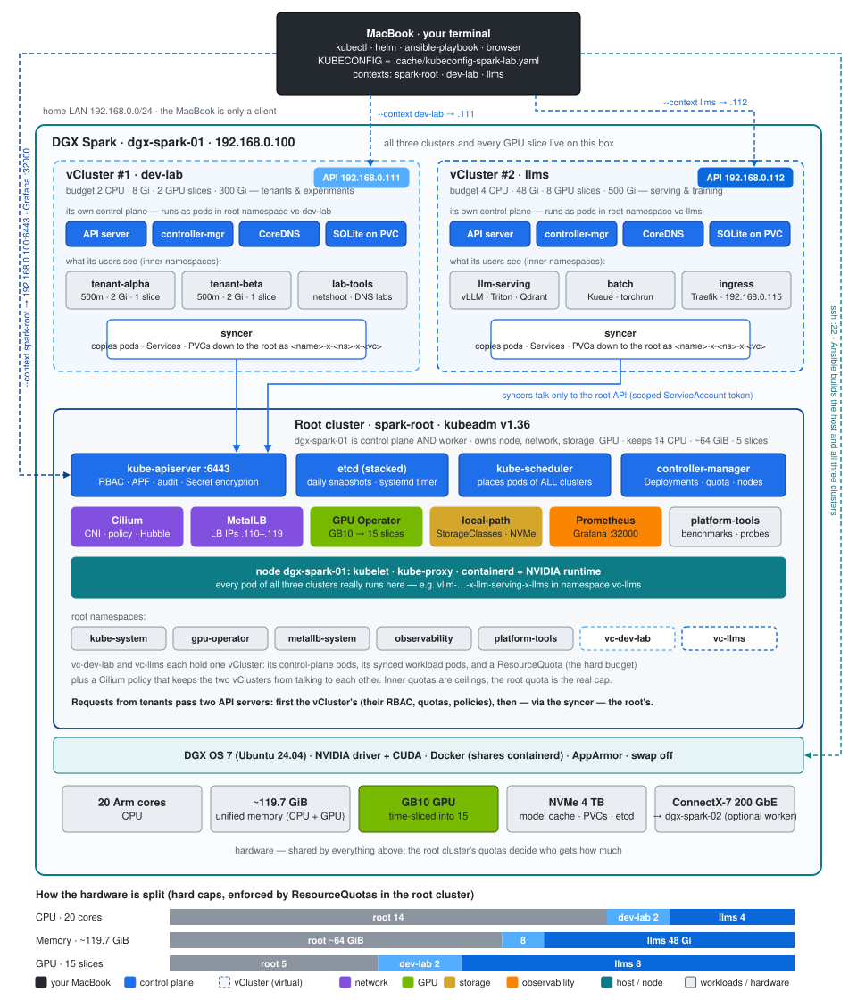
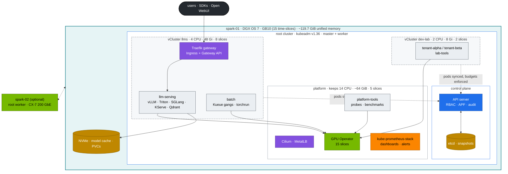
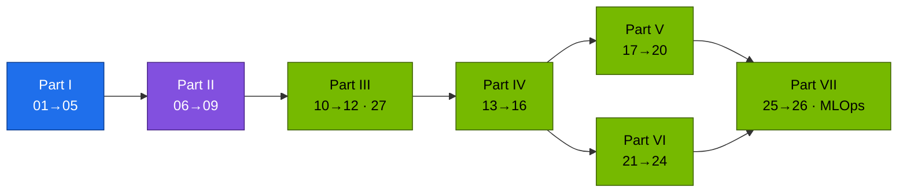

# Module 02 — Kubernetes for AI Infrastructure on NVIDIA DGX Spark

Twenty-seven practical volumes that turn one DGX Spark into a small but complete **AI datacenter platform**. The [01 Ansible](../01%20Ansible/README.md) lab builds a **root Kubernetes cluster with kubeadm** — the Spark is its control plane *and* its worker — and two **virtual clusters** inside it: `dev-lab` for tenants and experiments, `llms` for model serving and training. On top of that you build a hardened control plane, budgeted tenants, GPU sharing, gang-scheduled training, an LLM API gateway, vLLM/Triton/SGLang serving, observability, drills and GitOps. Every volume follows the same shape: **HLD → LLD → integrations → step-by-step lab → verification with expected output → troubleshooting → scale-out path**. Every command runs against the files in [`lab/`](lab/README.md), and every volume says which of the three clusters it uses.

**Start here:** [00 · Step-by-step guide](00-kubernetes-step-by-step-guide.md) (shortest correct path) · [27 · Nested clusters](27-nested-clusters-with-vcluster.md) (the lab's shape) · [15 · Datacenter simulation](15-dgx-spark-datacenter-simulation-lab.md) (the whole picture) · [`lab/README.md`](lab/README.md)

---

## The lab in one picture: three clusters nested on one Spark

Read it from the outside in:

1. **Your MacBook is the terminal, nothing more.** It holds the tools (`kubectl`, `helm`, `ansible-playbook`, a browser) and one kubeconfig with three contexts. No Kubernetes component runs on it; it reaches the Spark over the home LAN — Ansible over SSH, `kubectl` to three API endpoints, a browser to Grafana and the LLM gateway.
2. **The DGX Spark is the whole datacenter.** Every cluster, pod and GPU slice lives on this one box. DGX OS provides the driver, CUDA, containerd and Docker; swap is off.
3. **The root cluster (`spark-root`) is the platform.** kubeadm installs a real control plane — API server, etcd, scheduler, controller-manager — and the Spark is also its only worker. It owns everything physical: the node and its kubelet/containerd, the network (Cilium, MetalLB), storage, the GPU (GPU Operator → 15 time-slices) and observability. Reach it at `192.168.0.100:6443` with `--context spark-root`.
4. **Inside it, two virtual clusters.** `dev-lab` (`192.168.0.111`) and `llms` (`192.168.0.112`) each have their own API server, controller-manager, CoreDNS and datastore — so their users get their own namespaces, RBAC, CRDs and policies — but those run as ordinary pods in the root namespaces `vc-dev-lab` and `vc-llms`. They have no nodes of their own.
5. **The syncer is the bridge.** When you create a pod in `llms`, the llms API server stores it and the llms syncer copies it to the root (`vllm-…-x-llm-serving-x-llms` in `vc-llms`). From there the **root** scheduler places it, the root kubelet starts it in containerd, Cilium wires its network and the GPU Operator's device plugin hands it a slice.
6. **Budgets are enforced at the root.** A ResourceQuota on `vc-dev-lab` (2 CPU · 8 Gi · 2 slices) and `vc-llms` (4 CPU · 48 Gi · 8 slices) caps each vCluster as a whole; quotas inside a vCluster only divide its share among its own teams. The root keeps the rest (14 CPU · ~64 GiB · 5 slices) for the platform.

So a tenant's request crosses **two** API servers — the vCluster's (who are you, what may you do, does it fit your team's quota) and then, through the syncer, the root's (does it fit the vCluster's budget, which node, which GPU). [Volume 27](27-nested-clusters-with-vcluster.md) walks one pod through every hop; [Volume 15](15-dgx-spark-datacenter-simulation-lab.md) builds the whole thing in order with a check after each stage.

## Platform at a glance

**Diagram colour key** (all volumes): blue = control plane · teal = host/node · green = GPU · purple = network · amber = storage · orange = observability · red = security/policy · black = external · grey = tenant workload.

---

## Curriculum

### Part I — Control plane

| # | Volume | You build |
|---|---|---|
| 01 | [Core architecture & pod lifecycle](01-kubernetes-core-architecture.md) | read the kubeadm control plane, trace one `kubectl apply` through API → scheduler → kubelet → containerd → nvidia runtime — and through a vCluster |
| 02 | [API server: AuthN, RBAC, CEL admission, APF, audit](02-kube-apiserver-internals.md) | x509 users per cluster, 4 CEL policies with dry-run fixtures, fair-queuing lanes for tenants and syncers, audit queries |
| 03 | [etcd: Raft, MVCC, quotas, backup & restore](03-etcd-database-deep-dive.md) | kubeadm's stacked etcd, SQLite in the vClusters, 3-member sandbox (elections, quorum loss, NOSPACE), restore drill |
| 04 | [Controllers & writing your own](04-kube-controller-manager-and-controllers.md) | reconciliation cascades, GC, a dependency-free GPU-slice ledger controller |
| 05 | [Scheduler, priorities, Kueue gangs, DRA](05-kube-scheduler-and-ai-batch-scheduling.md) | preemption ladder, a reproduced partial-gang deadlock, Kueue fix |

### Part II — Networking

| # | Volume | You build |
|---|---|---|
| 06 | [CNI with Cilium, VXLAN, NetworkPolicy, RDMA networks](06-kubernetes-networking-deep-dive.md) | packet path map, MTU proof, tenant isolation, the vCluster boundary, Hubble |
| 07 | [kube-proxy, ClusterIP, conntrack, headless](07-kube-proxy-and-cluster-ip-mechanics.md) | iptables reading, keep-alive pinning, graceful stream draining |
| 08 | [CoreDNS & the ndots tax](08-coredns-and-service-discovery.md) | measured query amplification, custom zones, outage drill |
| 09 | [Ingress & Gateway API for LLM APIs](09-ingress-controllers-and-gateway-api.md) | unbuffered streaming, limits, auth, canary, TLS, gRPC |

### Part III — Workloads, storage, tenancy

| # | Volume | You build |
|---|---|---|
| 10 | [StatefulSets, DaemonSets, Indexed Jobs, PDBs](10-advanced-workload-controllers.md) | Qdrant with durable data, GPU probe DaemonSet, sharded tokenizer, safe drains |
| 11 | [Storage on NVMe, model caches, fio, page cache vs UMA](11-storage-csi-and-high-performance-volumes.md) | Retain/Delete classes, prefetch Job, AI-shaped fio baseline |
| 12 | [Quotas, QoS, cgroups v2 & the UMA question](12-multi-tenancy-resource-quotas-and-cgroups.md) | two-layer budgets (root + tenant), throttling/OOM reproduced, *is CUDA memory charged to the pod?* |
| 27 | [**Nested clusters: kubeadm root + two vClusters**](27-nested-clusters-with-vcluster.md) | the lab's shape: budgets, sync, names, the pod's path through three API servers, resize/add/back up a vCluster |

### Part IV — NVIDIA platform

| # | Volume | You build |
|---|---|---|
| 13 | [GB10 hardware & driver stack](13-nvidia-hardware-and-driver-stack.md) | host/pod inventory, GEMM baseline, arch/CUDA triage |
| 14 | [Container Toolkit, CDI, time-slicing, the GPU leak](14-nvidia-container-toolkit-and-gpu-virtualization.md) | contention table, leak closed |
| 15 | [**DGX Spark datacenter simulation (end-to-end)**](15-dgx-spark-datacenter-simulation-lab.md) | the whole platform — root, both vClusters, gates, capacity plan, day-2 ops, spark-02 plan |
| 16 | [GPU Operator, Network Operator & observability](16-nvidia-gpu-operator-and-network-operator.md) | per-node profiles, kps + host exporters, alerts, RDMA pod networking |

### Part V — Distributed AI & diagnostics

| # | Volume | You build |
|---|---|---|
| 17 | [Distributed training & NCCL](17-distributed-ai-training-and-nccl.md) | operator-free torchrun, gloo vs NCCL, straggler/hang triage, RoCE over CX-7 |
| 18 | [From two Sparks to a SuperPOD](18-large-scale-superpod-and-network-fabrics.md) | NIC counters, degraded-link experiment, fat-tree calculator |
| 19 | [Diagnostics & failure playbook](19-cluster-diagnostics-and-failure-scenarios.md) | triage tree, runbooks, Xid matrix, 15 drills |
| 20 | [Hands-on workbook (20 challenges + capstone)](20-hands-on-practice-exercises-workbook.md) | timed challenges, 60-minute rebuild |

### Part VI — Serving

| # | Volume | You build |
|---|---|---|
| 21 | [vLLM on Kubernetes](21-vllm-high-throughput-llm-serving.md) | KV-cache budgeting, probes, graceful rollouts, benchmarks, KEDA |
| 22 | [Triton Inference Server](22-nvidia-triton-inference-server.md) | CPU→GPU ensemble, measured dynamic batching, perf_analyzer |
| 23 | [SGLang, TensorRT-LLM, Ollama, KServe](23-llm-inference-alternatives-and-kserve.md) | prefix-cache probe on two engines, JSON-schema output, KServe RawDeployment |
| 24 | [Disaggregated prefill/decode](24-disaggregated-prefill-and-decode-serving.md) | vLLM + NIXL P/D split, KV-transfer time model |

### Part VII — Hyperscale

| # | Volume | You build |
|---|---|---|
| 25 | [Accelerators & compilers (GPU, TPU, Trainium)](25-hyperscaler-silicon-and-compilers.md) | eager vs `torch.compile` on GB10, generated kernels, cross-cloud pod specs |
| 26 | [Resilience at scale, practised small](26-ultra-scale-cluster-resilience-and-fault-tolerance.md) | MTBF/goodput calculator, async-checkpoint resume, SDC canary, quarantine |
| — | [Production MLOps: GitOps, CI, promotion, rollback](production-mlops.md) | Argo CD app-of-apps, drift correction, model promotion |

---

## Learning order

---

## Reference lab

| Item | Value |
|---|---|
| Nodes | spark-01 `192.168.0.100` (kubeadm control plane + worker). Optional spark-02 `192.168.0.101` (worker) |
| Clusters (contexts) | `spark-root` (kubeadm) · `dev-lab` (vCluster, `https://192.168.0.111`) · `llms` (vCluster, `https://192.168.0.112`) — one kubeconfig: `01 Ansible/lab/.cache/kubeconfig-spark-lab.yaml` |
| Budgets | dev-lab 2 CPU · 8 Gi · 2 slices · 300 Gi — llms 4 CPU · 48 Gi · 8 slices · 500 Gi — root keeps 14 CPU · ~64 GiB · 5 slices ([Vol 27](27-nested-clusters-with-vcluster.md)) |
| CX-7 | `192.168.100.0/24` + `192.168.101.0/24`, MTU 9000 |
| Pods / Services / DNS | `10.42.0.0/16` / `10.43.0.0/16` / `10.43.0.10` (Cilium VXLAN, kube-proxy iptables) |
| LoadBalancer IPs | MetalLB `192.168.0.110–119`: dev-lab API `.111`, llms API `.112`, llms gateway (Traefik) `.115` |
| Entry points | root API `:6443` · Grafana `:32000` · Hubble UI `:31235` · llms gateway `192.168.0.115:80` |
| GPU | GB10, compute capability 12.1, 15 time-slices, no MIG |
| Versions | [`lab/versions.env`](lab/versions.env) (Kubernetes v1.36.5, Cilium 1.20.2, vCluster 0.37.1, GPU Operator v26.7.1, Kueue v0.13.4, Traefik chart 34.4.1, kps 70.4.2, NGC 25.09 images) |

## How this module was verified

Without a Spark attached, the lab was applied with **server-side dry-run against real Kubernetes 1.36 API servers** standing in for the root and the two vClusters, carrying the Cilium, Kueue, Gateway API, Traefik, Prometheus Operator and KEDA CRDs: every layer applies, the tenancy checks and the 11 allow/deny admission fixtures pass, and all 39 pod templates are admitted in their target cluster. Both vCluster values files validate against the vCluster 0.37.1 chart schema and the Traefik values against its chart schema; [`tests/budget_check.py`](lab/tests/budget_check.py) proves the budgets fit the Spark. The Python tools (mock OpenAI server, P/D proxy, slice-ledger controller, checkpoint/resume trainer, calculators) were run for real, and all Mermaid diagrams were rendered. CI ([`k8s-lab-ci.yml`](../.github/workflows/k8s-lab-ci.yml)) repeats the static checks, then builds the same shape on kind — kind as the root with a fake GB10, plus vCluster `dev-lab` and `llms` from the lab's own values — applies the lab to all three, runs the fixtures and the Kueue gang test on every PR. GPU-dependent results (TFLOPS, TTFT, NCCL bandwidth, the UMA cgroup experiment) are marked in the volumes as **"record yours"**. Those are the numbers to measure on your Spark.
