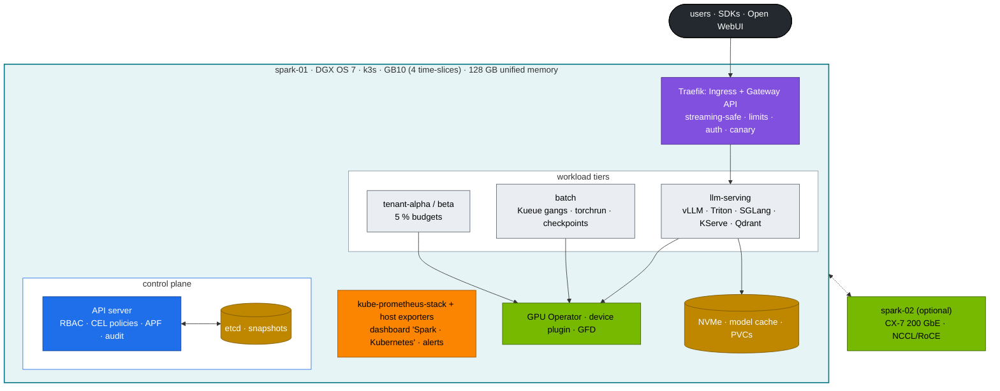
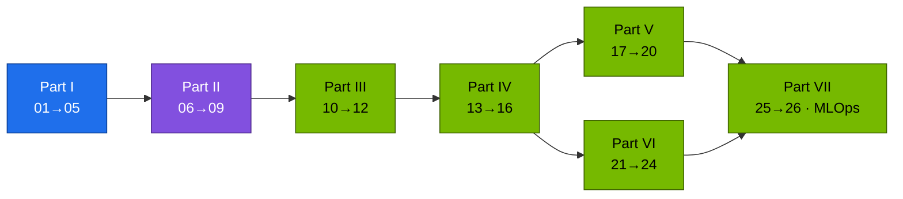

# Module 02 — Kubernetes for AI Infrastructure on NVIDIA DGX Spark

Twenty-six practical volumes that turn the k3s cluster built by [01 Ansible](../01%20Ansible/README.md) into a small but complete **AI datacenter platform**: a hardened control plane, budgeted tenants, GPU sharing, gang-scheduled training, an LLM API gateway, vLLM/Triton/SGLang serving, observability, drills and GitOps. Every volume follows the same shape: **HLD → LLD → integrations → step-by-step lab → verification with expected output → troubleshooting → scale-out path**. Every command runs against the files in [`lab/`](lab/README.md).

**Start here:** [00 · Step-by-step guide](00-kubernetes-step-by-step-guide.md) (shortest correct path) · [15 · Datacenter simulation](15-dgx-spark-datacenter-simulation-lab.md) (the whole picture) · [`lab/README.md`](lab/README.md)

---

## Platform at a glance

**Diagram colour key** (all volumes): blue = control plane · teal = host/node · green = GPU · purple = network · amber = storage · orange = observability · red = security/policy · black = external · grey = tenant workload.

---

## Curriculum

### Part I — Control plane

| # | Volume | You build |
|---|---|---|
| 01 | [Core architecture & pod lifecycle](01-kubernetes-core-architecture.md) | trace one `kubectl apply` through API → scheduler → kubelet → containerd → nvidia runtime |
| 02 | [API server: AuthN, RBAC, CEL admission, APF, audit](02-kube-apiserver-internals.md) | x509 users, 4 CEL policies with dry-run fixtures, a fair-queuing lane, audit queries |
| 03 | [etcd: Raft, MVCC, quotas, backup & restore](03-etcd-database-deep-dive.md) | SQLite → etcd migration, 3-member sandbox (elections, quorum loss, NOSPACE), restore drill |
| 04 | [Controllers & writing your own](04-kube-controller-manager-and-controllers.md) | reconciliation cascades, GC, a dependency-free GPU-slice ledger controller |
| 05 | [Scheduler, priorities, Kueue gangs, DRA](05-kube-scheduler-and-ai-batch-scheduling.md) | preemption ladder, a reproduced partial-gang deadlock, Kueue fix |

### Part II — Networking

| # | Volume | You build |
|---|---|---|
| 06 | [CNI, flannel VXLAN, NetworkPolicy, RDMA networks](06-kubernetes-networking-deep-dive.md) | packet path map, MTU proof, tenant isolation |
| 07 | [kube-proxy, ClusterIP, conntrack, headless](07-kube-proxy-and-cluster-ip-mechanics.md) | iptables reading, keep-alive pinning, graceful stream draining |
| 08 | [CoreDNS & the ndots tax](08-coredns-and-service-discovery.md) | measured query amplification, custom zones, outage drill |
| 09 | [Ingress & Gateway API for LLM APIs](09-ingress-controllers-and-gateway-api.md) | unbuffered streaming, limits, auth, canary, TLS, gRPC |

### Part III — Workloads, storage, tenancy

| # | Volume | You build |
|---|---|---|
| 10 | [StatefulSets, DaemonSets, Indexed Jobs, PDBs](10-advanced-workload-controllers.md) | Qdrant with durable data, GPU probe DaemonSet, sharded tokenizer, safe drains |
| 11 | [Storage on NVMe, model caches, fio, page cache vs UMA](11-storage-csi-and-high-performance-volumes.md) | Retain/Delete classes, prefetch Job, AI-shaped fio baseline |
| 12 | [Quotas, QoS, cgroups v2 & the UMA question](12-multi-tenancy-resource-quotas-and-cgroups.md) | 5 % budgets, throttling/OOM reproduced, *is CUDA memory charged to the pod?* |

### Part IV — NVIDIA platform

| # | Volume | You build |
|---|---|---|
| 13 | [GB10 hardware & driver stack](13-nvidia-hardware-and-driver-stack.md) | host/pod inventory, GEMM baseline, arch/CUDA triage |
| 14 | [Container Toolkit, CDI, time-slicing, the GPU leak](14-nvidia-container-toolkit-and-gpu-virtualization.md) | contention table, leak closed |
| 15 | [**DGX Spark datacenter simulation (end-to-end)**](15-dgx-spark-datacenter-simulation-lab.md) | the whole platform with gates, capacity plan, day-2 ops, spark-02 plan |
| 16 | [GPU Operator, Network Operator & observability](16-nvidia-gpu-operator-and-network-operator.md) | per-node profiles, kps + host exporters, alerts, RDMA pod networking |

### Part V — Distributed AI & diagnostics

| # | Volume | You build |
|---|---|---|
| 17 | [Distributed training & NCCL](17-distributed-ai-training-and-nccl.md) | operator-free torchrun, gloo vs NCCL, straggler/hang triage, RoCE over CX-7 |
| 18 | [From two Sparks to a SuperPOD](18-large-scale-superpod-and-network-fabrics.md) | NIC counters, degraded-link experiment, fat-tree calculator |
| 19 | [Diagnostics & failure playbook](19-cluster-diagnostics-and-failure-scenarios.md) | triage tree, runbooks, Xid matrix, 15 drills |
| 20 | [Hands-on workbook (20 challenges + capstone)](20-hands-on-practice-exercises-workbook.md) | timed challenges, 60-minute rebuild |

### Part VI — Serving

| # | Volume | You build |
|---|---|---|
| 21 | [vLLM on Kubernetes](21-vllm-high-throughput-llm-serving.md) | KV-cache budgeting, probes, graceful rollouts, benchmarks, KEDA |
| 22 | [Triton Inference Server](22-nvidia-triton-inference-server.md) | CPU→GPU ensemble, measured dynamic batching, perf_analyzer |
| 23 | [SGLang, TensorRT-LLM, Ollama, KServe](23-llm-inference-alternatives-and-kserve.md) | prefix-cache probe on two engines, JSON-schema output, KServe RawDeployment |
| 24 | [Disaggregated prefill/decode](24-disaggregated-prefill-and-decode-serving.md) | vLLM + NIXL P/D split, KV-transfer time model |

### Part VII — Hyperscale

| # | Volume | You build |
|---|---|---|
| 25 | [Accelerators & compilers (GPU, TPU, Trainium)](25-hyperscaler-silicon-and-compilers.md) | eager vs `torch.compile` on GB10, generated kernels, cross-cloud pod specs |
| 26 | [Resilience at scale, practised small](26-ultra-scale-cluster-resilience-and-fault-tolerance.md) | MTBF/goodput calculator, async-checkpoint resume, SDC canary, quarantine |
| — | [Production MLOps: GitOps, CI, promotion, rollback](production-mlops.md) | Argo CD app-of-apps, drift correction, model promotion |

---

## Learning order

---

## Reference lab

| Item | Value |
|---|---|
| Nodes | spark-01 `10.10.10.11` (k3s server). Optional spark-02 `10.10.10.12` (agent) |
| CX-7 | `192.168.100.0/24` + `192.168.101.0/24`, MTU 9000 |
| Pods / Services / DNS | `10.42.0.0/16` / `10.43.0.0/16` / `10.43.0.10` |
| Entry points | API `:6443` · Traefik `:80/:443` · Grafana `:32000` (kps), `:3000` (host) |
| GPU | GB10, compute capability 12.1, 4 time-slices, no MIG |
| Versions | [`lab/versions.env`](lab/versions.env) (k3s v1.32.5+k3s1, GPU Operator v25.3.0, Kueue v0.13.4, Traefik chart 34.4.1, kps 70.4.2, NGC 25.09 images) |

## How this module was verified

Without a Spark attached, every manifest was applied with **server-side dry-run against a real Kubernetes 1.32 API server** carrying the Kueue, Gateway API, Traefik, Prometheus Operator, KEDA, KServe, Network Operator and Argo CD CRDs. The admission policies were exercised by 11 allow/deny fixtures. The Python tools (mock OpenAI server, P/D proxy, slice-ledger controller against a live API with RBAC, checkpoint/resume trainer, calculators) were run for real, and all Mermaid diagrams were rendered. CI ([`k8s-lab-ci.yml`](../.github/workflows/k8s-lab-ci.yml)) repeats the static checks, then builds a kind cluster with a fake GB10 node, applies the lab, runs the fixtures and the Kueue gang test on every PR. GPU-dependent results (TFLOPS, TTFT, NCCL bandwidth, the UMA cgroup experiment) are marked in the volumes as **"record yours"**. Those are the numbers to measure on your Spark.
