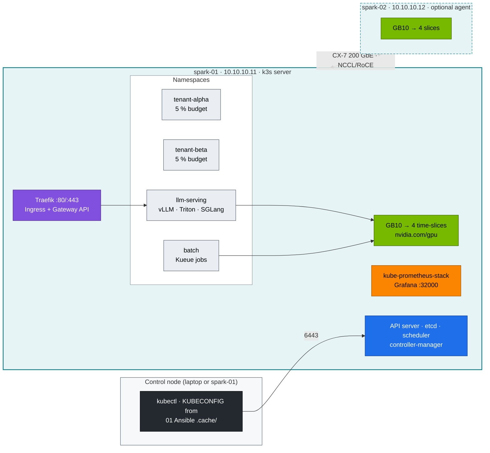

# DGX Spark Kubernetes Lab — runnable companion to Module 02

Everything the 26 volumes teach, as manifests, scripts and drills you apply to the
k3s cluster that the [01 Ansible lab](../../01%20Ansible/lab/README.md) builds on
one DGX Spark (a second Spark is optional). Every code block in the volumes is
taken from this directory.

```
lab/
├── versions.env                 # every pinned version, in one place
├── k3s/                         # k3s drop-in: embedded etcd, audit log, secrets encryption   (Vol 01-03, 15)
├── addons/                      # HelmChart CRs (k3s helm-controller) + StorageClasses       (Vol 09, 11, 16)
├── manifests/
│   ├── 00-platform/             # namespaces, PSA labels, PriorityClasses                     (Vol 05, 12)
│   ├── 10-tenancy/              # 5 % quotas, LimitRanges, RBAC, NetworkPolicies               (Vol 02, 06, 12)
│   ├── 15-admission/            # ValidatingAdmissionPolicies (CEL)                            (Vol 02)
│   ├── 16-apf/                  # API Priority & Fairness for tenants                          (Vol 02)
│   ├── 20-scheduling/           # Kueue flavors/queues, gang demo, taints & affinity           (Vol 05)
│   ├── 30-networking/           # netshoot, echo + headless Service, ndots lab, CoreDNS custom (Vol 06-08)
│   ├── 40-ingress/              # mock OpenAI API, Traefik middlewares, Ingress, HTTPRoute     (Vol 09)
│   ├── 50-workloads/            # Qdrant StatefulSet, node-probe DaemonSet, Indexed Job, PDBs  (Vol 10)
│   ├── 60-storage/              # model-cache PVC, fio AI profiles                             (Vol 11)
│   ├── 70-gpu/                  # gpu-smoke, GEMM benchmark, time-slice contention             (Vol 13-16)
│   ├── 80-distributed/          # torchrun all-reduce job (1 Spark: gloo · 2 Sparks: NCCL/RoCE) (Vol 17)
│   ├── 90-serving/              # vLLM, Triton ensemble, SGLang, KServe, prefill/decode split  (Vol 21-24)
│   └── 95-observability/        # host-exporter scrape, alert rules, Grafana dashboard         (Vol 16, 19)
├── scripts/                     # preflight, install-addons, apply-lab, verify, breakfix, diag, etcd drill,
│                                #   cgroup/netns/iptables inspectors, make-user, uma-watch
├── breakfix/                    # 15 fault-injection scenarios                                  (Vol 19, 20)
└── tests/                       # local checks, admission fixtures, fake-GPU node, Kueue gang test (CI)
```

## Topology



**Diagram colour key (used in every volume):** blue = control plane · teal = node/host ·
green = GPU · purple = network · amber = storage · orange = observability · red = security ·
black = external/user · grey = tenant workload.

## Quick start

```bash
# 0. The 01 Ansible lab has built k3s + GPU Operator (playbooks 05 and 06).
cd "02 Kubernetes/lab"
tests/run-local-checks.sh                   # proves your toolchain, no Spark needed

# 1. On the Spark
scripts/preflight.sh                        # arch, GB10, cgroup v2, k3s, allocatable GPUs
scripts/install-addons.sh k3s-config        # etcd + audit + secrets encryption (restarts k3s)
scripts/install-addons.sh all               # storage, traefik, kps, kueue, keda
scripts/apply-lab.sh                        # namespaces → tenancy → admission → … → observability
scripts/verify.sh                           # PASS/WARN/FAIL for every layer
```

Then follow the volumes in order, or jump straight into the drills:

```bash
scripts/breakfix.sh list
scripts/breakfix.sh inject 06     # diagnose it, fix it, `scripts/breakfix.sh answer 06` if stuck
```

## No Spark yet?

Almost everything except CUDA runs on any Kubernetes ≥ 1.30. `tests/fake-gpu-node.sh`
makes a CPU-only node advertise `nvidia.com/gpu: 4` and GB10 labels, so the quota,
admission, Kueue and scheduling labs work on kind or a VM. CI does exactly that on every PR.

## Versions

See [`versions.env`](versions.env). Re-check them before a fresh build. NGC image tags in
particular move monthly, and a DGX Spark needs **arm64** images built for **sm_121**.
