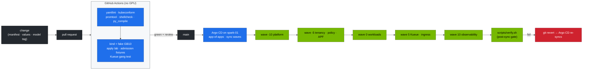

# Production MLOps on the Spark Platform — GitOps, CI, Promotion, Rollback

> **Module 02 · companion** · builds on [15 Datacenter simulation](15-dgx-spark-datacenter-simulation-lab.md), [20 Workbook](20-hands-on-practice-exercises-workbook.md), [21 vLLM](21-vllm-high-throughput-llm-serving.md)

| | |
|---|---|
| **You will build** | Git as the only way to change the platform: CI validates every change without a GPU, Argo CD syncs the lab layers to the Spark in dependency order, models and engines are promoted through canaries, and a rollback is `git revert` |
| **Hardware** | spark-01 + a GitHub fork of this repo |
| **Time** | 60 min |
| **Lab files** | [`gitops/applications.yaml`](lab/gitops/applications.yaml), [`.github/workflows/k8s-lab-ci.yml`](../.github/workflows/k8s-lab-ci.yml), [`versions.env`](lab/versions.env) |

---

## 1. The delivery pipeline



| Concern | Lab mechanism | Where |
|---|---|---|
| Validation | static + kind-with-fake-GPU CI | `k8s-lab-ci.yml`, `tests/` |
| Desired state | Git, one Argo CD Application per layer | `gitops/applications.yaml` |
| Ordering | sync waves (-10 → 10). CRD-dependent layers last | annotations |
| Drift | `selfHeal: true`: manual `kubectl edit` is reverted within minutes | Argo CD |
| Secrets | never in Git. Vault (01 Ansible Vol 19) → Kubernetes Secrets (Vault Agent / External Secrets) | `hf-token`, `llm-api-users`, TLS |
| Versions | one file | `versions.env` |
| Progressive delivery | HTTPRoute weights (90/10 → 50/50 → 0/100) | Vol 09 §5.7 |
| Rollback | `git revert` → auto-sync | Argo CD |

---

## 2. Lab

### 2.1 Install Argo CD on the Spark

```bash
kubectl create namespace argocd
kubectl apply -n argocd --server-side -f https://raw.githubusercontent.com/argoproj/argo-cd/v3.1.8/manifests/install.yaml
kubectl -n argocd rollout status deploy/argocd-server --timeout=5m
kubectl -n argocd get secret argocd-initial-admin-secret -o jsonpath='{.data.password}' | base64 -d; echo
kubectl -n argocd port-forward svc/argocd-server 8443:443 &      # https://localhost:8443  (admin / above)
```

### 2.2 Point it at your fork and sync

```bash
cd "02 Kubernetes/lab"
sed -i 's|github.com/cloudone365/technical-depth.git|github.com/<you>/technical-depth.git|' gitops/applications.yaml   # your fork
kubectl apply -n argocd -f gitops/applications.yaml
kubectl -n argocd get applications -o custom-columns=APP:.metadata.name,WAVE:.metadata.annotations.argocd\.argoproj\.io/sync-wave,SYNC:.status.sync.status,HEALTH:.status.health.status
```

Expected after a few minutes: every app `Synced` / `Healthy`. `spark-20-scheduling` and `spark-40-ingress` report `Degraded` or `Missing` until Kueue and Traefik are installed (`scripts/install-addons.sh`). The add-ons stay outside Argo CD in this lab because they're HelmChart CRs managed by k3s. Moving them in is §4.

### 2.3 Watch drift correction

```bash
kubectl -n tenant-alpha patch resourcequota budget-5pct --type merge -p '{"spec":{"hard":{"limits.cpu":"4"}}}'
kubectl -n argocd get application spark-10-tenancy -o jsonpath='{.status.sync.status}{"\n"}'   # OutOfSync, then Synced
kubectl -n tenant-alpha get resourcequota budget-5pct -o jsonpath='{.spec.hard.limits\.cpu}{"\n"}'  # back to 1
```

> **Drills vs GitOps:** with `selfHeal: true`, Argo CD "fixes" most `breakfix.sh` injections by itself within minutes, which spoils the exercise. Pause it first: `kubectl -n argocd patch application <app> --type merge -p '{"spec":{"syncPolicy":{"automated":null}}}'`, then re-apply `gitops/applications.yaml` afterwards.

### 2.4 A change the right way: raise tenant-beta's GPU slices

1. Branch, then edit `manifests/10-tenancy/quotas.yaml` (`requests.nvidia.com/gpu: "2"` in tenant-beta).
2. Add a policy fixture if behaviour changes (Vol 02 §5.5).
3. Push and open a PR. CI runs `tests/run-local-checks.sh` and the kind job.
4. Merge. Argo CD syncs wave -5, then run `scripts/verify.sh tenancy` as the post-sync gate.
5. To roll back, `git revert <sha>` and push.

### 2.5 Promote a new model or engine version

| Step | Change in Git | Gate |
|---|---|---|
| prefetch | `model-prefetch-job.yaml` `MODEL=` new revision | Job completes |
| canary | a second Deployment (e.g. `vllm-canary`) + HTTPRoute weight 10 | `vllm bench serve` (Vol 21 §5.5) + TTFT/TPOT alerts quiet for 1 h |
| ramp | weights 50/50, then 0/100 | same |
| cleanup | delete the old Deployment | `verify.sh serving` |

Pin every image by tag (the admission policy forbids `:latest`). For immutable promotion, pin by digest (`image@sha256:…`), which the policy allows.

---

## 3. Checklist for a production-ready change

- [ ] Change is in Git. No `kubectl edit` survives (Argo CD self-heals).
- [ ] CI green: static checks + kind apply + admission fixtures + gang test.
- [ ] Secrets referenced, not committed.
- [ ] Versions updated in `versions.env` and in the manifests.
- [ ] Post-sync `scripts/verify.sh` green. Dashboards and alerts checked.
- [ ] Rollback path tested (revert, sync, verify).

---

## 4. Scale-out path

| Lab | Production |
|---|---|
| one cluster, one Argo CD | Argo CD ApplicationSets across clusters (spark pair, staging, prod), or Flux |
| add-ons via k3s HelmChart | add-ons as Argo CD Helm Applications with pinned chart versions |
| kind + fake GPU in CI | + a self-hosted arm64 GPU runner (a Spark) for smoke tests on real hardware (the 01 Ansible CI shows the pattern) |
| manual canary steps | Argo Rollouts / Flagger with Prometheus analysis on TTFT/TPOT/error rate |
| model files by HF revision | model registry (MLflow, NGC private registry, Hugging Face revisions pinned by commit hash) |
