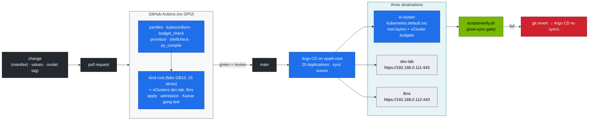

# Production MLOps on the Spark Platform — GitOps, CI, Promotion, Rollback

> **Module 02 · companion** · Prev: [27 Nested clusters](27-nested-clusters-with-vcluster.md) · builds on [15 Datacenter simulation](15-dgx-spark-datacenter-simulation-lab.md), [20 Workbook](20-hands-on-practice-exercises-workbook.md), [21 vLLM](21-vllm-high-throughput-llm-serving.md)

| | |
|---|---|
| **You will build** | Git as the only way to change the platform: CI validates every change without a GPU (on kind, with the same root + two vClusters shape), one Argo CD on the root syncs the lab layers to **three clusters** in dependency order, models and engines are promoted through canaries, and a rollback is `git revert` |
| **Hardware** | dgx-spark-01 + a GitHub fork of this repo |
| **Time** | 60 min |
| **Clusters** | `spark-root` (Argo CD in `argocd`, the root layers, the vCluster budgets) · `dev-lab` and `llms` (Argo CD destinations, reached on their MetalLB API IPs `.111` / `.112`) |
| **Lab files** | [`gitops/applications.yaml`](lab/gitops/applications.yaml), [`scripts/argocd-register-vclusters.sh`](lab/scripts/argocd-register-vclusters.sh), [`scripts/install-addons.sh`](lab/scripts/install-addons.sh) `argocd`, [`.github/workflows/k8s-lab-ci.yml`](../.github/workflows/k8s-lab-ci.yml), [`tests/`](lab/tests/), [`versions.env`](lab/versions.env) |

---

## 1. The delivery pipeline



| Concern | Lab mechanism | Where |
|---|---|---|
| Validation | static checks + `budget_check.py` (the vClusters' budgets add up, inner ceilings fit their vCluster) + kind-with-fake-GPU CI that builds the root and both vClusters | `k8s-lab-ci.yml`, `tests/` |
| Desired state | Git, one Argo CD Application per `manifests/<cluster>/<layer>` | `gitops/applications.yaml` |
| Destinations | the root (`in-cluster`) and two vClusters registered as clusters | `scripts/argocd-register-vclusters.sh` |
| Ordering | sync waves (-10 → 10): root platform → vCluster budgets → in-vCluster platform → policy → workloads. CRD-dependent layers last | annotations |
| Drift | `selfHeal: true`: a manual `kubectl edit` in any of the three clusters is reverted within minutes | Argo CD |
| Safety | `prune: false` on namespaces, budgets and storage layers; the vClusters themselves (Helm releases) are **not** Argo CD apps | `applications.yaml` |
| Secrets | never in Git. Vault (01 Ansible Vol 19) → Kubernetes Secrets (Vault Agent / External Secrets) | `hf-token`, `llm-api-users`, TLS |
| Versions | one file | `versions.env` |
| Progressive delivery | HTTPRoute weights (90/10 → 50/50 → 0/100) on Traefik inside llms | Vol 09 §5.7 |
| Rollback | `git revert` → auto-sync | Argo CD |

### 1.1 The Applications

| Wave | Root (`in-cluster`) | dev-lab (`.111`) | llms (`.112`) |
|---|---|---|---|
| -10 | `spark-root-00-platform` | | |
| -9 | `spark-root-05-vclusters` (namespaces, quotas, LimitRanges, Cilium boundary) | | |
| -8 | | `spark-dev-lab-00-platform` | `spark-llms-00-platform` |
| -5 | `spark-root-16-apf` | `spark-dev-lab-10-tenancy`, `-15-admission`, `-16-apf` | `spark-llms-10-tenancy`, `-15-admission` |
| 0 | `spark-root-30-networking`, `-45-controller`, `-50-workloads`, `-70-gpu` | `spark-dev-lab-30-networking` | `spark-llms-60-storage` |
| 5 | | | `spark-llms-40-ingress`, `-50-workloads`, `-20-scheduling` |
| 10 | `spark-root-95-observability` | | |

Not in Git-driven sync on purpose: the vCluster Helm releases (an Application that can prune a whole vCluster is one typo away from deleting it — 01 Ansible `roles/vclusters` or `install-addons.sh vclusters` own them), the add-ons (`install-addons.sh`), and the labs you change by hand while learning (`root/12-cgroups`, `llms/80-distributed`, `llms/90-serving` — whose `vllm.yaml` also carries a placeholder `hf-token` Secret that GitOps would keep overwriting).

### 1.2 How Argo CD reaches a vCluster

Argo CD runs in the root's `argocd` namespace. For dev-lab and llms it's an ordinary external cluster: a `cluster` Secret holding the vCluster's API URL and the client certificate vCluster exported into Secret `vc-<name>` in `vc-<name>`. The script writes exactly what `argocd cluster add` would, without needing the `argocd` CLI. The traffic goes Argo CD pod → `192.168.0.11x:443` → (the root's kube-proxy turns the LoadBalancer IP into the vCluster pod) → the vCluster API server. Two consequences:

- Argo CD's watches and applies load the **vCluster's** API server (in its budget, behind its APF), not the root's. What reaches the root is the syncer's traffic, in the `spark-vcluster-syncers` APF lane.
- Objects Argo CD creates in a vCluster carry its tracking annotation *inside* the vCluster. Their synced copies on the root are owned by the syncer, so the root-side `spark-root-*` apps never fight over them.

---

## 2. Lab

```bash
cd "02 Kubernetes/lab"
export KUBECONFIG="$PWD/../../01 Ansible/lab/.cache/kubeconfig-spark-lab.yaml"
```

### 2.1 Install Argo CD on the root and register the vClusters

```bash
scripts/install-addons.sh argocd                       # Argo CD (versions.env ARGOCD_VERSION) into argocd on spark-root
scripts/argocd-register-vclusters.sh                   # cluster Secrets for dev-lab and llms
kubectl --context spark-root -n argocd get secret -l argocd.argoproj.io/secret-type=cluster \
  -o custom-columns=NAME:.metadata.name,SERVER:.data.server
kubectl --context spark-root -n argocd get secret argocd-initial-admin-secret -o jsonpath='{.data.password}' | base64 -d; echo
kubectl --context spark-root -n argocd port-forward svc/argocd-server 8443:443 &      # https://localhost:8443  (admin / above)
```

The `SERVER` column is base64; `echo <value> | base64 -d` shows `https://192.168.0.111:443` and `https://192.168.0.112:443`. In the UI, *Settings → Clusters* lists `in-cluster`, `dev-lab` and `llms`.

### 2.2 Point it at your fork and sync

```bash
sed -i 's|github.com/cloudone365/technical-depth.git|github.com/<you>/technical-depth.git|' gitops/applications.yaml   # your fork
kubectl --context spark-root apply -n argocd -f gitops/applications.yaml
kubectl --context spark-root -n argocd get applications \
  -o custom-columns=APP:.metadata.name,DEST:.spec.destination.server,WAVE:.metadata.annotations.argocd\\.argoproj\\.io/sync-wave,SYNC:.status.sync.status,HEALTH:.status.health.status
```

Expected after a few minutes: every app `Synced` / `Healthy`. `spark-llms-40-ingress` and `spark-llms-20-scheduling` report `SyncFailed`/`Missing` until Traefik and Kueue are installed **inside llms** (`scripts/install-addons.sh traefik`, `kueue`) — the CRDs they need exist only in that vCluster. `spark-root-95-observability` needs kube-prometheus-stack's CRDs on the root (`install-addons.sh kps`).

Applied like this, the Applications all start at once, and the sync waves don't order them — waves order resources *within one sync*. The `retry` block (5 tries, backoff to 3 min) is what lets a layer whose namespace doesn't exist yet succeed on a later try. For real ordering, sync `applications.yaml` itself from a parent **app-of-apps**:

```bash
kubectl --context spark-root apply -n argocd -f - <<'YAML'
apiVersion: argoproj.io/v1alpha1
kind: Application
metadata: {name: spark-app-of-apps, namespace: argocd}
spec:
  project: default
  source:
    repoURL: https://github.com/<you>/technical-depth.git
    targetRevision: main
    path: "02 Kubernetes/lab/gitops"
  destination: {server: https://kubernetes.default.svc, namespace: argocd}
  syncPolicy: {automated: {prune: false, selfHeal: true}}
YAML
```

Now the parent applies the children wave by wave. Argo CD waits for a child to be *healthy* before the next wave only if the Application health check is enabled in `argocd-cm` (`resource.customizations` for `argoproj.io/Application`, see the Argo CD app-of-apps docs).

### 2.3 Watch drift correction — in a vCluster

```bash
kubectl --context dev-lab -n tenant-alpha patch resourcequota tenant-budget --type merge -p '{"spec":{"hard":{"limits.cpu":"4"}}}'
kubectl --context spark-root -n argocd get application spark-dev-lab-10-tenancy -o jsonpath='{.status.sync.status}{"\n"}'   # OutOfSync, then Synced
kubectl --context dev-lab -n tenant-alpha get resourcequota tenant-budget -o jsonpath='{.spec.hard.limits\.cpu}{"\n"}'   # back to 500m
```

Argo CD on the root noticed a change inside dev-lab's own API server and reverted it there. Even during those minutes, tenant-alpha could never have used 4 CPU: the root's `vcluster-budget` caps all of dev-lab at 2. Drift inside a vCluster is a policy problem; drift on the root (`spark-root-05-vclusters`) is a capacity problem — try the same patch on `vc-llms`'s `vcluster-budget` and watch it revert too. From now on, resizing a vCluster (Vol 27 §6.5) is a Git change.

> **Drills vs GitOps:** with `selfHeal: true`, Argo CD "fixes" most `breakfix.sh` injections by itself within minutes, which spoils the exercise. Pause the app first: `kubectl --context spark-root -n argocd patch application <app> --type merge -p '{"spec":{"syncPolicy":{"automated":null}}}'`, then re-apply `gitops/applications.yaml` afterwards (`kubectl --context spark-root apply -n argocd -f gitops/applications.yaml`).

### 2.4 A change the right way: raise tenant-beta's GPU slices

1. Branch, then edit `manifests/dev-lab/10-tenancy/quotas.yaml` (`requests.nvidia.com/gpu: "2"` in tenant-beta).
2. Run `python3 tests/budget_check.py`: an inner ceiling of 2 fits dev-lab's 2 slices; `"3"` would fail (`tenant-beta GPU ceiling > vc-dev-lab budget`). The two tenants' ceilings may add up to more than the vCluster — they're ceilings, not reservations.
3. Add a policy fixture if behaviour changes (Vol 02 §5 Step 5).
4. Push and open a PR. CI runs `tests/run-local-checks.sh` and the kind job (root + both vClusters).
5. Merge. Argo CD syncs `spark-dev-lab-10-tenancy`; run `scripts/verify.sh tenancy` as the post-sync gate.
6. To roll back, `git revert <sha>` and push.

### 2.5 Promote a new model or engine version

| Step | Change in Git | Gate |
|---|---|---|
| budget | does the canary fit? Two 32 Gi engines don't fit `llm-serving` (Vol 21 §9): raise `serving-budget` and the llms `vcluster-budget` in the same PR, or canary a smaller engine | `budget_check.py` in CI |
| prefetch | `model-prefetch-job.yaml` `MODEL=`/`REVISION=` new revision (in llms) | Job completes |
| canary | a second Deployment (e.g. `vllm-canary`) + HTTPRoute weight 10 on `lab-gateway` | `vllm bench serve` (Vol 21 §5.5) + TTFT/TPOT alerts quiet for 1 h, filtered by `vcluster="llms"` |
| ramp | weights 50/50, then 0/100 | same |
| cleanup | delete the old Deployment, shrink the budgets back | `verify.sh serving` |

Pin every image by tag (the admission policy forbids `:latest`). For immutable promotion, pin by digest (`image@sha256:…`), which the policy allows.

---

## 3. Checklist for a production-ready change

- [ ] Change is in Git. No `kubectl edit` survives in any of the three clusters (Argo CD self-heals).
- [ ] CI green: static checks + `budget_check.py` + kind apply on root and both vClusters + admission fixtures + gang test.
- [ ] Secrets referenced, not committed.
- [ ] Versions updated in `versions.env` and in the manifests.
- [ ] Capacity changes touch both layers: the tenant ceiling inside the vCluster and the vCluster's root budget.
- [ ] Post-sync `scripts/verify.sh` green. Dashboards and alerts checked.
- [ ] Rollback path tested (revert, sync, verify).

---

## 4. Scale-out path

| Lab | Production |
|---|---|
| one Argo CD on the root, three destinations | Argo CD ApplicationSets with a cluster generator (one template per layer, every registered cluster: spark pair, staging, prod), or Flux per cluster |
| vClusters registered by a script | vCluster Platform or Cluster API creating clusters and registering them with Argo CD in the same pipeline |
| add-ons via `install-addons.sh` | add-ons as Argo CD Helm Applications with pinned chart versions, destination = the vCluster that needs them (Kueue, KEDA, KServe → llms) |
| kind + fake GPU in CI | + a self-hosted arm64 GPU runner (a Spark) for smoke tests on real hardware (the 01 Ansible CI shows the pattern) |
| manual canary steps | Argo Rollouts / Flagger with Prometheus analysis on TTFT/TPOT/error rate |
| model files by HF revision | model registry (MLflow, NGC private registry, Hugging Face revisions pinned by commit hash) |
