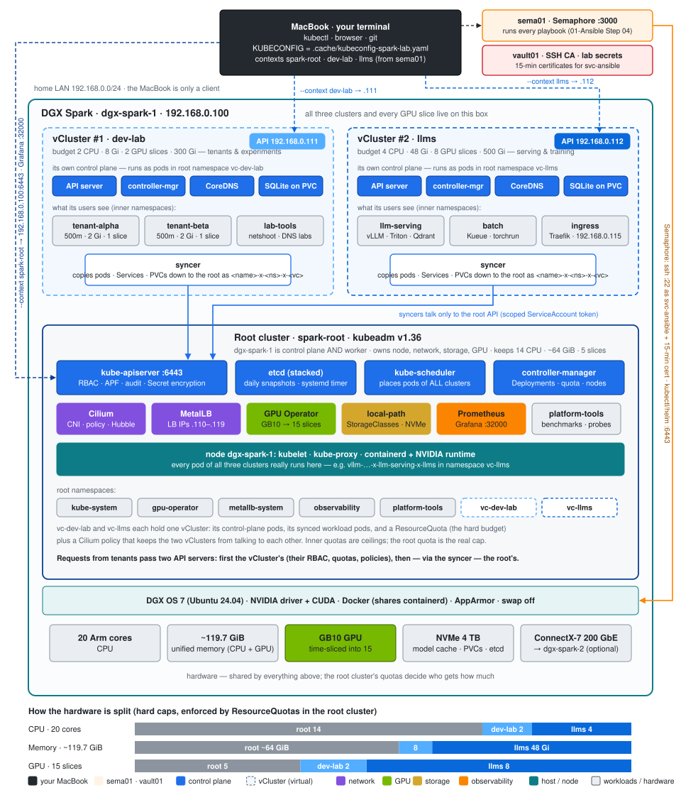
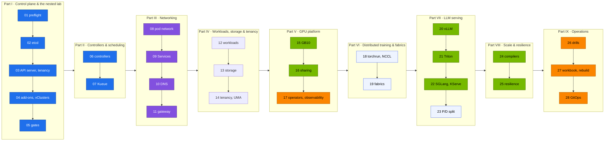

# Step 00 · Kubernetes Step-by-Step Guide

> **02-Kubernetes · Step 00 of 28** · Start here · [Module overview](README.md) · [Step 01 · Kubernetes core architecture](01-kubernetes-core-architecture.md) →

This page is the build order for the whole module. Each section below is one step, links the document that explains it, and says what to run and how you know the step is done. Work through them in order. The documents carry the same numbers as the steps: Step 13 is `13-….md`.

**What you build.** On the Ansible-built root cluster: a hardened control plane, budgeted tenants and real users, your own controller, Kueue gangs, the pod network, Services and DNS traced through the nesting, an LLM API gateway, stateful and batch workloads, a model cache, GPU sharing with measured contention, observability, distributed training, vLLM/Triton/SGLang/KServe serving, a prefill/decode split, checkpoint-resume and SDC drills, the failure playbook, a timed rebuild and GitOps across all three clusters.

**Prerequisite.** The [01-Ansible step-by-step guide](../01-Ansible/00-ansible-step-by-step-guide.md) through Step 20: the kubeadm root cluster with Cilium and MetalLB ([01-Ansible Step 19](../01-Ansible/19-kubernetes-kubeadm-root-cluster-and-vclusters.md)), the GPU Operator with 15 time-slices and the two vClusters ([01-Ansible Step 20](../01-Ansible/20-nvidia-gpu-operator-and-time-slicing.md)), run as the Semaphore templates `05 Kubernetes` → `06 GPU Operator` → `06b vClusters` on sema01 ([01-Ansible Step 04](../01-Ansible/04-dgx-spark-as-semaphore-target.md)). The kubeconfig with all three contexts comes to your MacBook with `01-Ansible/lab/tools/fetch-kubeconfig.sh sema01`.

**Three clusters, one kubeconfig.** Every command names its context ([lab README](lab/README.md#which-cluster-am-i-talking-to)):

| Context | What it is | Who uses it |
|---|---|---|
| `spark-root` | kubeadm root, `https://192.168.0.100:6443`: the node, etcd, Cilium, MetalLB, storage, GPU Operator, observability | platform team |
| `dev-lab` | vCluster #1, `https://192.168.0.111`, root namespace `vc-dev-lab`: 2 CPU · 8 Gi · 2 GPU slices | tenants and labs |
| `llms` | vCluster #2, `https://192.168.0.112`, root namespace `vc-llms`: 12 CPU · 88 Gi · 11 GPU slices | serving and training |



**How to read a step.** Commands run from `02-Kubernetes/lab` on your MacBook unless the step says **on the Spark** (anything with `sudo`, `etcdctl`, `crictl` or `nvidia-smi`; copy the kubeconfig there as in [Step 02 §5](02-etcd-database-deep-dive.md)). Anything that rebuilds the base cluster is a **Semaphore template** in project `spark-lab`; its `ansible-playbook playbooks/NN-….yml -l dgx-spark-1,localhost -K` form from `01-Ansible/lab` is the **break-glass** path when sema01 is down. Template numbers are code and don't follow the step numbers: **Step 05** is a document, **`05 Kubernetes`** is a template.

**One Spark or two?** Everything works on one. Steps marked **(2×)** have an optional part that needs `dgx-spark-2` and the QSFP cable.

**Two engines side by side; memory is the real limit.** `serving-budget` in llms (80 Gi of limits) holds two of the lab's 32 Gi engines, or vLLM next to Triton or the prefill/decode pair. What decides is unified memory: the `--gpu-memory-utilization` values of all models running at the same time should add up to ≲ 0.70 (about 84 GiB of the ~119.7 GiB pool, [Step 20 §2](20-vllm-high-throughput-llm-serving.md)). From Step 20 on, vLLM runs under KEDA; when a bigger model would push the sum over, **park** vLLM by pausing its ScaledObject (`autoscaling.keda.sh/paused-replicas=0`), not by scaling the Deployment, which KEDA's `minReplicaCount: 1` would undo ([Step 20 §9](20-vllm-high-throughput-llm-serving.md)).

**The Spark is your playground.** Every step can be undone: `scripts/breakfix.sh reset all` for drills, and for a full rebuild the Semaphore templates `99 Reset Kubernetes` (extra variable `reset_confirm: RESET`) → `05 Kubernetes` → `06 GPU Operator` → `06b vClusters`, then `fetch-kubeconfig.sh sema01` again. Semaphore and Vault live outside the Spark, so nothing you break here can take them with it. Breaking things on purpose is part of the course.

---

## Before Step 01 · Toolchain on your MacBook (20 min)

Your MacBook is a `kubectl` client and nothing more. Install the tools, fetch the kubeconfig and prove the lab files are sane ([Step 27 §CI](27-hands-on-practice-exercises-workbook.md#ci-the-workbook-for-your-laptop) runs the same checks in CI):

```bash
cd "technical-depth/02-Kubernetes/lab"
pip install yamllint shellcheck-py pyyaml
# kubectl, helm, kubeconform, promtool, mikefarah yq: versions in versions.env / the CI workflow
"../../01-Ansible/lab/tools/fetch-kubeconfig.sh" sema01    # kubeconfig from sema01's state volume → 01-Ansible/lab/.cache/ (re-run after 05/06b)
export KUBECONFIG="$PWD/../../01-Ansible/lab/.cache/kubeconfig-spark-lab.yaml"
kubectl config get-contexts -o name
tests/run-local-checks.sh
```

✅ **Done when** `kubectl config get-contexts` lists `spark-root`, `dev-lab` and `llms`, and `tests/run-local-checks.sh` prints `ALL LOCAL CHECKS PASSED` (including `budget check OK`: the vCluster budgets fit the Spark).

---

## Progress

Times are rough working times on one Spark, not counting reading.

| Step | Document | What you do | Time | Done when |
|---|---|---|---|---|
| **Part I** | **Control plane & the nested lab** | | | |
| 01 | [Kubernetes core architecture](01-kubernetes-core-architecture.md) | Preflight, static pods, trace one pod | 30 min | `scripts/preflight.sh` 0 failed |
| 02 | [etcd database deep dive](02-etcd-database-deep-dive.md) | Member status, snapshot, Raft sandbox | 45 min | A snapshot in `/var/lib/etcd-snapshots`; sandbox quorum loss seen |
| 03 | [kube-apiserver internals](03-kube-apiserver-internals.md) | Encryption + audit proof, tenancy, users, CEL, APF | 60 min | `verify.sh tenancy admission` → `21 passed, 0 failed` |
| 04 | [Nested clusters with vCluster](04-nested-clusters-with-vcluster.md) | Root add-ons, vClusters (re)installed, budgets | 40 min | Three contexts; both root budgets correct |
| 05 | [DGX Spark datacenter simulation lab](05-dgx-spark-datacenter-simulation-lab.md) | Build order and gates for the whole platform | 30 min | `verify.sh platform vclusters` 0 failed |
| **Part II** | **Controllers & scheduling** | | | |
| 06 | [kube-controller-manager & controllers](06-kube-controller-manager-and-controllers.md) | Reconciliation chains, your own controller | 30 min | `gpu-slice-ledger` ConfigMap per vCluster |
| 07 | [kube-scheduler & AI batch scheduling](07-kube-scheduler-and-ai-batch-scheduling.md) | Priorities, preemption, Kueue gangs in llms | 40 min | Gang test `PASS` |
| **Part III** | **Networking** | | | |
| 08 | [Kubernetes networking deep dive](08-kubernetes-networking-deep-dive.md) | Walk a pod's path, NetworkPolicy drill | 40 min | Drill 06 fixed |
| 09 | [kube-proxy & ClusterIP mechanics](09-kube-proxy-and-cluster-ip-mechanics.md) | Read a dev-lab Service in the root's iptables | 30 min | KUBE-SEP probabilities explained |
| 10 | [CoreDNS & service discovery](10-coredns-and-service-discovery.md) | Query logging, `lab.local`, the ndots tax | 30 min | ≈10 vs 2 queries measured |
| 11 | [Ingress controllers & Gateway API](11-ingress-controllers-and-gateway-api.md) | Traefik in llms, streaming, canary | 40 min | Streaming PASS, canary ≈ 90/10 |
| **Part IV** | **Workloads, storage & tenancy** | | | |
| 12 | [Advanced workload controllers](12-advanced-workload-controllers.md) | Qdrant, node-probe DaemonSet, Indexed Job | 40 min | `completedIndexes: 0-7` |
| 13 | [Storage, CSI & high-performance volumes](13-storage-csi-and-high-performance-volumes.md) | Model-cache PVC, prefetch, fio | 40 min | `model-cache` Bound on Retain |
| 14 | [Multi-tenancy, resource quotas & cgroups](14-multi-tenancy-resource-quotas-and-cgroups.md) | Two budget layers, QoS, the UMA experiment | 45 min | UMA result recorded with driver version |
| **Part V** | **GPU platform** | | | |
| 15 | [NVIDIA hardware & driver stack](15-nvidia-hardware-and-driver-stack.md) | Host and node inventory, GEMM baseline | 30 min | Baseline TFLOPS recorded |
| 16 | [NVIDIA Container Toolkit & GPU virtualization](16-nvidia-container-toolkit-and-gpu-virtualization.md) | CDI, 1 → 4 pod contention, the GPU leak | 45 min | Contention table; leak explained |
| 17 | [NVIDIA GPU Operator & Network Operator](17-nvidia-gpu-operator-and-network-operator.md) | Operator state, dashboards, alerts | 40 min | Every dashboard row has data |
| **Part VI** | **Distributed training & fabrics** | | | |
| 18 | [Distributed AI training & NCCL](18-distributed-ai-training-and-nccl.md) | Gang-admitted torchrun; (2×) NCCL over RoCE | 45 min | `correctness OK` |
| 19 | [Large-scale SuperPOD & network fabrics](19-large-scale-superpod-and-network-fabrics.md) | CX-7 inventory, fabric sizing; (2×) counters | 30 min | Your own fabric sizing |
| **Part VII** | **LLM serving** | | | |
| 20 | [vLLM high-throughput LLM serving](20-vllm-high-throughput-llm-serving.md) | Deploy, benchmark, KEDA autoscaling | 60 min | Chat completion + benchmark table |
| 21 | [NVIDIA Triton Inference Server](21-nvidia-triton-inference-server.md) | Park vLLM, Triton ensemble, batching | 45 min | Batch size > 1 under load |
| 22 | [LLM inference alternatives & KServe](22-llm-inference-alternatives-and-kserve.md) | Prefix-cache probe, KServe in llms | 60 min | Prefix-cache speed-up on two engines |
| 23 | [Disaggregated prefill & decode serving](23-disaggregated-prefill-and-decode-serving.md) | vLLM + NIXL P/D behind a proxy | 45 min | `X-Prefill-Ms` header |
| **Part VIII** | **Scale & resilience** | | | |
| 24 | [Hyperscaler silicon & compilers](24-hyperscaler-silicon-and-compilers.md) | Eager vs `torch.compile` on GB10 | 30 min | Three timings recorded |
| 25 | [Ultra-scale cluster resilience & fault tolerance](25-ultra-scale-cluster-resilience-and-fault-tolerance.md) | Checkpoint resume, SDC canary, quarantine | 45 min | `RESUMED`; SDC fails fast |
| **Part IX** | **Operations** | | | |
| 26 | [Cluster diagnostics & failure scenarios](26-cluster-diagnostics-and-failure-scenarios.md) | Timed drills, diag bundle, vCluster failures | 2 h | 5 drills fixed unaided |
| 27 | [Hands-on practice exercises workbook](27-hands-on-practice-exercises-workbook.md) | 20 challenges, the 60-minute rebuild | a weekend | `verify.sh` `0 failed` after the rebuild |
| 28 | [Production MLOps & GitOps](28-production-mlops-and-gitops.md) | Argo CD across all three clusters | 60 min | Apps Synced/Healthy |

## Overview



Blue: control plane. Purple: network. Green: GPU and serving. Orange: observability and operations. Light blue: has an optional **(2×)** part for `dgx-spark-2`; with one Spark, do the single-node part and move on.

---

# Part I · Control plane & the nested lab

## Step 01 · Kubernetes core architecture → [document](01-kubernetes-core-architecture.md)

**On the Spark**, from a checkout of this repo in `02-Kubernetes/lab` (Step 01 §5 Task 1–2):

```bash
scripts/preflight.sh
ls /etc/kubernetes/manifests/
sudo crictl ps --name 'kube-|etcd' -o table
```

Then follow one pod through the API server, scheduler, kubelet, containerd and the nvidia runtime, in both a vCluster and the root (Step 01 §5 Task 4–7).

✅ **Done when** preflight reports 0 failed: kubelet and containerd active, no control-plane taint, Cilium ready, `allocatable nvidia.com/gpu=15`, GB10 compute capability 12.1, and both vClusters answer (`06b vClusters` ran in 01-Ansible Step 20). You can name the four static pods and who restarts them.

## Step 02 · etcd database deep dive → [document](02-etcd-database-deep-dive.md)

**On the Spark.** The 01-Ansible `kubeadm_cluster` role installed an etcd snapshot timer. Prove it, then break Raft where it's safe: in the three-member Docker sandbox, never the root (Step 02 §5.1, §5.4, §5.6).

```bash
scripts/etcd-drill.sh status && scripts/etcd-drill.sh snapshot
scripts/etcd-sandbox.sh up
scripts/etcd-sandbox.sh kill-leader
scripts/etcd-sandbox.sh kill-two
```

✅ **Done when** `etcd-drill.sh status` shows 1 member and no alarms, a fresh snapshot sits in `/var/lib/etcd-snapshots`, and the sandbox printed a new leader after `kill-leader` and `write failed: no quorum (expected)` after `kill-two`.

## Step 03 · kube-apiserver internals → [document](03-kube-apiserver-internals.md)

**On the Spark**, prove the audit policy and Secret encryption the `kubeadm_cluster` role switched on (Step 03 §5 Task 1):

```bash
kubectl --context spark-root get secrets -A -o json | kubectl --context spark-root replace -f - >/dev/null   # re-encrypt old Secrets
kubectl --context spark-root -n default create secret generic enc-test --from-literal=k=v
sudo ETCDCTL_API=3 etcdctl --endpoints=https://127.0.0.1:2379 --cacert=/etc/kubernetes/pki/etcd/ca.crt \
  --cert=/etc/kubernetes/pki/etcd/healthcheck-client.crt --key=/etc/kubernetes/pki/etcd/healthcheck-client.key \
  get /registry/secrets/default/enc-test --print-value-only | head -c 40; echo
sudo tail -2 /var/log/kubernetes/audit/audit.log
```

Then tenancy, admission, fairness and real users (Step 03 §5 Task 2–7):

```bash
scripts/apply-lab.sh root                  # platform namespaces, vCluster budgets, syncer APF lane, …
for d in 00-platform 10-tenancy 15-admission 16-apf; do kubectl --context dev-lab apply -k manifests/dev-lab/$d; done
for d in 00-platform 10-tenancy 15-admission; do kubectl --context llms apply -k manifests/llms/$d; done
scripts/make-user.sh alice team-alpha && scripts/make-user.sh bob team-beta       # users of dev-lab
scripts/verify.sh tenancy admission
```

✅ **Done when** the stored Secret starts with `k8s:enc:aescbc:v1:key1`, the audit log grows, and `verify.sh tenancy admission` reports `21 passed, 0 failed`, including `team-alpha has no rights on the root`.

## Step 04 · Nested clusters with vCluster → [document](04-nested-clusters-with-vcluster.md)

Install the root's add-ons and (re)install the vClusters (Step 04 §6.1). `install-addons.sh vclusters` does what the Semaphore template `06b vClusters` does, with `helm upgrade --install`, so it's safe to re-run:

```bash
scripts/install-addons.sh storage
scripts/install-addons.sh metrics-server
scripts/install-addons.sh kps
scripts/install-addons.sh vclusters
kubectl config get-contexts
scripts/verify.sh vclusters
```

Then look around, follow one pod through both clusters and spend a budget (Step 04 §6.2–6.4).

✅ **Done when** the contexts are `spark-root`, `dev-lab` and `llms`, `verify.sh vclusters` prints `dev-lab root budget: 2 8Gi 2` and `llms root budget: 12 88Gi 11`, and Grafana answers on `http://192.168.0.100:32000`.

## Step 05 · DGX Spark datacenter simulation lab → [document](05-dgx-spark-datacenter-simulation-lab.md)

Study the whole platform before building it out: the master tables, the capacity plan and the build order with a gate after each stage (Step 05 §3–4). The rest of this guide follows that order. Run the gates you can already pass:

```bash
scripts/verify.sh platform vclusters
```

`scripts/verify.sh` with no arguments is the full gate (Step 05 §6). Re-run it at the end of each Part: the sections for the layers you haven't built yet fail until you get there.

✅ **Done when** the `platform` and `vclusters` sections report 0 failed and you can say which step builds each remaining `verify.sh` section (tenancy, admission, gpu, ingress, storage, serving, observability).

---

# Part II · Controllers & scheduling

## Step 06 · kube-controller-manager & controllers → [document](06-kube-controller-manager-and-controllers.md)

Watch three controller-managers on one node, then run your own controller on the root (Step 06 §5):

```bash
kubectl --context dev-lab apply -k manifests/dev-lab/30-networking
kubectl --context spark-root apply -k manifests/root/45-controller
kubectl --context spark-root -n platform-tools logs deploy/slice-ledger
```

✅ **Done when** the log shows `relist: … GPU pods` and the `gpu-slice-ledger` ConfigMap has a `by-namespace` key with `vc-dev-lab` and `vc-llms`.

## Step 07 · kube-scheduler & AI batch scheduling → [document](07-kube-scheduler-and-ai-batch-scheduling.md)

Kueue runs inside llms. Reproduce the partial-gang deadlock without it in dev-lab, then fix it with gang admission (Step 07 §5.4–5.5):

```bash
scripts/install-addons.sh kueue                       # inside llms
kubectl --context llms apply -k manifests/llms/20-scheduling
tests/kueue-gang-test.sh
```

✅ **Done when** the test prints `PASS: one gang admitted whole, the other held whole` and you have watched a preemption on the root (Step 07 §5.3).

---

# Part III · Networking

## Step 08 · Kubernetes networking deep dive → [document](08-kubernetes-networking-deep-dive.md)

```bash
pod=$(kubectl --context dev-lab -n lab-tools get pod -l app=echo -o jsonpath='{.items[0].metadata.name}')
scripts/pod-netns.sh lab-tools "$pod" dev-lab         # finds the pod's real copy on the root
scripts/breakfix.sh inject 06                         # fix it, then: scripts/breakfix.sh answer 06
```

(2×) See VXLAN on the wire between the two Sparks (Step 08 §5.6).

✅ **Done when** you can name the `lxc*` veth, `cilium_host`, `cilium_vxlan` and the MTU, and the vCluster pod's name on the root, and drill 06 is fixed.

## Step 09 · kube-proxy & ClusterIP mechanics → [document](09-kube-proxy-and-cluster-ip-mechanics.md)

A dev-lab Service is programmed by the **root's** kube-proxy (Step 09 §5.1):

```bash
scripts/svc-trace.sh lab-tools echo dev-lab
```

✅ **Done when** you can explain the KUBE-SEP probabilities, and keep-alive pinning and graceful termination behave as Step 09 §5.2 and §5.6 predict.

## Step 10 · CoreDNS & service discovery → [document](10-coredns-and-service-discovery.md)

Turn on query logging and the `lab.local` zone on the root, then measure the ndots tax in dev-lab's own CoreDNS (Step 10 §5.2–5.3):

```bash
kubectl --context spark-root apply -f manifests/root/30-networking/coredns-corefile.yaml
```

✅ **Done when** you have measured the query counts for a short name vs a trailing-dot name (≈10 vs 2) and run the outage drill (Step 10 §5.5).

## Step 11 · Ingress controllers & Gateway API → [document](11-ingress-controllers-and-gateway-api.md)

```bash
scripts/install-addons.sh traefik                     # inside llms → 192.168.0.115
kubectl --context llms apply -k manifests/llms/40-ingress
echo "192.168.0.115 llm.lab.local gw.lab.local" | sudo tee -a /etc/hosts      # on your MacBook
scripts/verify.sh ingress
```

✅ **Done when** the streaming check passes, the HTTPRoute answers 200 and the canary splits ≈ 90/10.

---

# Part IV · Workloads, storage & tenancy

## Step 12 · Advanced workload controllers → [document](12-advanced-workload-controllers.md)

```bash
kubectl --context llms apply -k manifests/llms/50-workloads
kubectl --context dev-lab apply -f manifests/dev-lab/50-workloads/tokenizer-indexed-job.yaml
kubectl --context spark-root apply -k manifests/root/50-workloads
```

✅ **Done when** Qdrant's data survives pod deletion, the Indexed Job reports `completedIndexes: 0-7`, and there is one node-probe pod per Spark.

## Step 13 · Storage, CSI & high-performance volumes → [document](13-storage-csi-and-high-performance-volumes.md)

```bash
kubectl --context llms apply -k manifests/llms/60-storage
kubectl --context llms apply -f manifests/llms/60-storage/model-prefetch-job.yaml
kubectl --context spark-root apply -f manifests/root/60-storage/fio-job.yaml
```

✅ **Done when** `model-cache` is Bound on a Retain class (a real PV under `/data/k8s/retain/vc-llms/…`) and your fio baseline is saved.

## Step 14 · Multi-tenancy, resource quotas & cgroups → [document](14-multi-tenancy-resource-quotas-and-cgroups.md)

The tenancy you applied in Step 03, now under load. Both budget layers first (Step 14 §5.1), then QoS, throttling and the UMA question:

```bash
kubectl --context spark-root -n vc-dev-lab describe resourcequota vcluster-budget
kubectl --context dev-lab -n tenant-alpha describe resourcequota tenant-budget
kubectl --context spark-root apply -f manifests/root/12-cgroups/qos-trio.yaml -f manifests/root/12-cgroups/cpu-throttle.yaml
kubectl --context spark-root apply -f manifests/root/12-cgroups/uma-cgroup-experiment.yaml
kubectl --context spark-root -n platform-tools logs -f uma-cgroup-experiment
scripts/breakfix.sh inject 02                         # a vCluster budget, spent
```

✅ **Done when** your QoS / `oom_score_adj` table is filled in, the **UMA experiment result is recorded with the driver version**, and you can explain why the bf02 pods have no scheduler events.

---

# Part V · GPU platform

## Step 15 · NVIDIA hardware & driver stack → [document](15-nvidia-hardware-and-driver-stack.md)

**On the Spark** `nvidia-smi` and the host inventory (Step 15 §5.1), then the node as each cluster sees it and a single-slice baseline on the root (§5.2–5.4):

```bash
kubectl --context llms get node dgx-spark-1 -L spark.lab/gpu,nvidia.com/gpu.product,nvidia.com/gpu.replicas
kubectl --context spark-root apply -k manifests/root/70-gpu
kubectl --context spark-root apply -f manifests/root/70-gpu/gemm-solo.yaml
kubectl --context spark-root -n platform-tools logs -f job/gemm-solo
```

✅ **Done when** compute capability is `12.1`, allocatable `nvidia.com/gpu` is `15` on the root and in both vClusters, and the `gemm-solo` TFLOPS figure is recorded as your baseline.

## Step 16 · NVIDIA Container Toolkit & GPU virtualization → [document](16-nvidia-container-toolkit-and-gpu-virtualization.md)

```bash
kubectl --context spark-root -n platform-tools scale deploy gemm-contention --replicas=4      # Step 16 §5.3 table
scripts/verify.sh gpu                                  # gpu-smoke from inside dev-lab
scripts/breakfix.sh inject 10                          # the GPU leak
```

Scale `gemm-contention` back to 0 when the table is done.

✅ **Done when** aggregate throughput under 4-way contention ≈ the Step 15 baseline, `gpu-smoke` passes through the vCluster, and you can explain the leak (hardening is optional, Step 16 §5.5).

## Step 17 · NVIDIA GPU Operator & Network Operator → [document](17-nvidia-gpu-operator-and-network-operator.md)

Read the operator's state (Step 17 §5.1), then the observability stack (§5.4):

```bash
kubectl --context spark-root get clusterpolicies.nvidia.com -o jsonpath='{.items[0].status.state}{"\n"}'
kubectl --context spark-root apply -k manifests/root/95-observability
scripts/verify.sh observability      # Grafana http://192.168.0.100:32000 → "Spark · Kubernetes"
```

(2×) The Network Operator and RDMA pod networking (Step 17 §5.6).

✅ **Done when** the ClusterPolicy is `ready`, every dashboard row has data, targets labelled `vcluster="llms"` appear once Traefik and vLLM run, and you have seen one alert fire (drill 02).

---

# Part VI · Distributed training & fabrics

## Step 18 · Distributed AI training & NCCL → [document](18-distributed-ai-training-and-nccl.md)

```bash
kubectl --context llms apply -k manifests/llms/80-distributed/base
kubectl --context llms -n batch logs -f -l job-name=ddp --prefix
# (2×) kubectl --context llms apply -k manifests/llms/80-distributed/two-spark
```

✅ **Done when** rank 0 prints `correctness OK`, you have seen NCCL refuse two ranks on one GPU (Step 18 §5.2), and (2×) the log says `Using network IB` with busbw near line rate.

## Step 19 · Large-scale SuperPOD & network fabrics → [document](19-large-scale-superpod-and-network-fabrics.md)

**On the Spark**, inventory the CX-7 (`ibdev2netdev`, `rdma link show`, Step 19 §5.1). Then size real fabrics:

```bash
python3 scripts/fabric_calc.py --nodes 2 --gpus 1 --radix 2 --link-gbps 200
python3 scripts/fabric_calc.py --nodes 127 --gpus 8 --radix 64 --link-gbps 400
```

(2×) Baseline the counters, degrade the link and watch NCCL (Step 19 §5.3–5.4).

✅ **Done when** you can explain why one QSFP cage shows up as two netdevs, and you have answered the transceiver exercise for the 127-node design.

---

# Part VII · LLM serving

## Step 20 · vLLM high-throughput LLM serving → [document](20-vllm-high-throughput-llm-serving.md)

```bash
kubectl --context llms apply -k manifests/llms/90-serving/vllm
kubectl --context llms apply -f manifests/llms/90-serving/vllm/vllm-bench.yaml
scripts/install-addons.sh keda && kubectl --context llms apply -f manifests/llms/90-serving/autoscaling.yaml
scripts/verify.sh serving
```

✅ **Done when** `vLLM answered a chat completion`, you have a benchmark table for c = 1/8/32, and KEDA reads the root's Prometheus.

## Step 21 · NVIDIA Triton Inference Server → [document](21-nvidia-triton-inference-server.md)

`serving-budget` (80 Gi) holds Triton's 12 Gi beside vLLM's 32 Gi, and Triton's small models add little to vLLM's 0.20 of the pool, so vLLM keeps running ([Step 20 §9](20-vllm-high-throughput-llm-serving.md)). Define the two helpers once anyway; you need them whenever a bigger model would push the sum of util values over ~0.70:

```bash
park()   { kubectl --context llms -n llm-serving annotate scaledobject vllm autoscaling.keda.sh/paused-replicas=0 --overwrite; }
unpark() { kubectl --context llms -n llm-serving annotate scaledobject vllm autoscaling.keda.sh/paused-replicas-; }
kubectl --context llms apply -k manifests/llms/90-serving/triton
# … Step 21 §5.2–5.5, then
kubectl --context llms delete -k manifests/llms/90-serving/triton
```

✅ **Done when** Triton's batch size is > 1 under load, and its rollout ran beside vLLM in `serving-budget` (no `exceeded quota` event).

## Step 22 · LLM inference alternatives & KServe → [document](22-llm-inference-alternatives-and-kserve.md)

vLLM keeps running: SGLang (`--mem-fraction-static=0.20`) beside it is 0.40 of the pool and 64 Gi of the 80 Gi. Run SGLang and the KServe predictor one after the other, because three 32 Gi engines (96 Gi) don't fit `serving-budget`. Measure the prefix cache on a second engine, then KServe (Step 22 §5.1–5.4):

```bash
kubectl --context llms apply -k manifests/llms/90-serving/sglang && kubectl --context llms -n llm-serving scale deploy sglang --replicas=1
kubectl --context llms -n llm-serving port-forward svc/sglang 30000 &
python3 scripts/ttft_probe.py --url http://localhost:30000 --model qwen2.5-0.5b
kubectl --context llms -n llm-serving scale deploy sglang --replicas=0
scripts/install-addons.sh kserve                        # cert-manager + KServe inside llms
```

✅ **Done when** you have measured the prefix-cache speed-up on two engines, each ran beside vLLM inside `serving-budget` (80 Gi), and the root's `vcluster-budget` (88 Gi) never refused a pod.

## Step 23 · Disaggregated prefill & decode serving → [document](23-disaggregated-prefill-and-decode-serving.md)

Prefill + decode need about 40 Gi of limits. Beside vLLM's 32 Gi and the always-on pods that is still inside `serving-budget`'s 80 Gi (with SGLang and KServe scaled down), so no quota changes. Their memory is 0.15 + 0.15 of the pool, 0.50 with vLLM's 0.20; `park` vLLM first only if you load bigger models and the sum would pass ~0.70.

```bash
kubectl --context llms apply -k manifests/llms/90-serving/pd-disagg
# … afterwards
kubectl --context llms delete -k manifests/llms/90-serving/pd-disagg
unpark                                                                         # only if you parked vLLM
```

(2×) Prefill on dgx-spark-1, decode on dgx-spark-2 (Step 23 §5.5).

✅ **Done when** responses carry the `X-Prefill-Ms` header, the decode log shows NIXL activity, and vLLM served throughout (or is back, if you parked it) with no `exceeded quota` event.

---

# Part VIII · Scale & resilience

## Step 24 · Hyperscaler silicon & compilers → [document](24-hyperscaler-silicon-and-compilers.md)

```bash
kubectl --context spark-root apply -f manifests/root/70-gpu/compile-compare.yaml   # eager vs compiled
kubectl --context spark-root -n platform-tools logs -f job/compile-compare
```

✅ **Done when** you have recorded eager, `compile-default` and `compile-max` timings and the compile times, and can say when the compile cost pays off (Step 24 §5.3).

## Step 25 · Ultra-scale cluster resilience & fault tolerance → [document](25-ultra-scale-cluster-resilience-and-fault-tolerance.md)

```bash
kubectl --context llms apply -k manifests/llms/80-distributed/resilient      # kill a pod mid-run → RESUMED
python3 scripts/mtbf_calc.py --gpus 4096 --ckpt-s 0.05 --restart-s 90
```

Then the SDC drill and quarantine on the root (Step 25 §5.4); lift the taint afterwards.

✅ **Done when** the job resumes from the newest complete checkpoint, the SDC drill fails fast with reason `PodFailurePolicy`, and the quarantine taint is gone again.

---

# Part IX · Operations

## Step 26 · Cluster diagnostics & failure scenarios → [document](26-cluster-diagnostics-and-failure-scenarios.md)

```bash
scripts/breakfix.sh list                 # 15 drills across all three clusters; 15 only on purpose
scripts/breakfix.sh inject NN            # diagnose with §1 and §3 only; hint/answer/reset NN
scripts/collect-diag.sh
```

Then rehearse the vCluster failures `breakfix.sh` doesn't script: syncer down, root quota rejects a synced pod, MetalLB pool exhausted (Step 26 §5).

✅ **Done when** you have fixed at least 5 drills, timed and unaided, and the diag bundle records an unreachable vCluster.

## Step 27 · Hands-on practice exercises workbook → [document](27-hands-on-practice-exercises-workbook.md)

Work the 20 challenges, then the capstone: delete and recreate dev-lab and the root's lab layers, and rebuild the 02 layer to green in under 60 minutes (Step 27 *Capstone*).

```bash
scripts/apply-lab.sh && scripts/verify.sh
```

✅ **Done when** `scripts/verify.sh` reports `0 failed` after the rebuild, within the hour. dev-lab has a new CA, so re-issue the `make-user.sh` certificates.

## Step 28 · Production MLOps & GitOps → [document](28-production-mlops-and-gitops.md)

Point `gitops/applications.yaml` at your fork first (Step 28 §2.2).

```bash
scripts/install-addons.sh argocd && scripts/argocd-register-vclusters.sh
kubectl --context spark-root apply -n argocd -f gitops/applications.yaml
```

✅ **Done when** the Argo CD apps are Synced/Healthy on all three destinations (`in-cluster`, `dev-lab`, `llms`), a hand-made change in a vCluster is corrected, and you have promoted one change through git (Step 28 §2.3–2.5).
