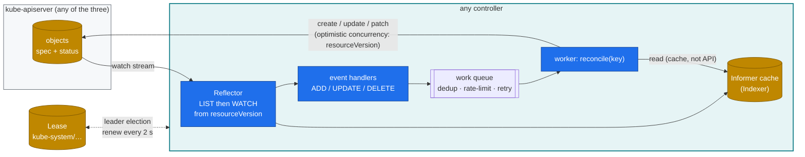
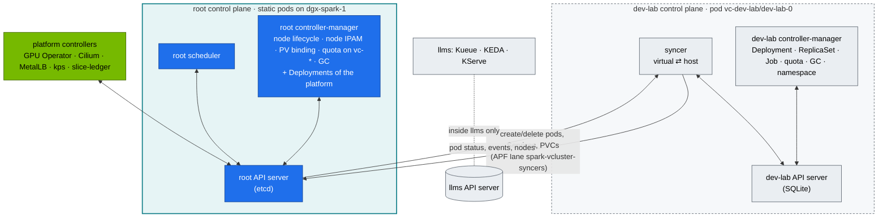

# Chapter 06 · kube-controller-manager & Controllers: Reconciliation Loops, Informers, Leader Election & Writing Your Own

> **02-Kubernetes · Part II — Controllers & scheduling · Chapter 06 of 28** · ← [Chapter 05 · DGX Spark datacenter simulation lab](05-dgx-spark-datacenter-simulation-lab.md) · [All chapters](00-kubernetes-step-by-step-guide.md) · [Chapter 07 · kube-scheduler & AI batch scheduling](07-kube-scheduler-and-ai-batch-scheduling.md) →

| | |
|---|---|
| **You will build** | Observed reconciliation (Deployment → ReplicaSet → Pod, quota status, garbage collection) in a vCluster and at the root, an outage of the root's controller-manager that dev-lab doesn't notice, the vCluster syncer seen as just another controller, and a working controller in ~150 lines of dependency-free Python. It watches every GPU pod on the Spark — the platform's and the ones both vClusters synced — and keeps a live "who holds which GB10 slice" ledger |
| **Hardware** | dgx-spark-1. The controller also runs on the fake-GPU kind cluster (`tests/fake-gpu-node.sh`) |
| **Time** | 90 min |
| **Risk** | Low. §5.3 stops the root's controller-manager for a minute (the kubelet restarts it when you put the manifest back) |
| **Clusters** | `dev-lab` (Deployment/ReplicaSet/Job/quota/GC inside a vCluster) · `spark-root` (leases, the root controller-manager, the syncer's writes, `slice-ledger` in `platform-tools`) |
| **Lab files** | [`manifests/root/45-controller/slice_ledger.py`](lab/manifests/root/45-controller/slice_ledger.py), [`slice-ledger.yaml`](lab/manifests/root/45-controller/slice-ledger.yaml), [`manifests/dev-lab/30-networking/echo-service.yaml`](lab/manifests/dev-lab/30-networking/echo-service.yaml), [`manifests/dev-lab/50-workloads/tokenizer-indexed-job.yaml`](lab/manifests/dev-lab/50-workloads/tokenizer-indexed-job.yaml), [`manifests/root/70-gpu/gemm-bench.yaml`](lab/manifests/root/70-gpu/gemm-bench.yaml), [`breakfix/02-gpu-oversubscribed.yaml`](lab/breakfix/02-gpu-oversubscribed.yaml), [`vclusters/dev-lab.yaml`](lab/vclusters/dev-lab.yaml) |

---

## 1. Why this matters on a Spark

Everything "automatic" in Kubernetes is a controller. Replacing a crashed vLLM pod, holding a tenant to its budget, cleaning up a finished tokenizer Job, and admitting a gang of training pods (Kueue) all work this way. So does the GPU Operator: it's a controller that happens to install device plugins. And so does **vCluster's syncer**, the piece that makes this lab's nesting work: it watches pods in a vCluster and writes pods at the root, watches their status at the root and writes it back.

This lab runs **three controller-managers on one node** — the root's (a kubeadm static pod) and one inside each vCluster's control-plane pod — and every one of them reconciles a different set of objects. When something misbehaves, you debug it the same way every time. Ask: *which cluster's* controller owns this object, what does it watch, what does it compare, what does it write, and is it running (and leader)?

---

## 2. Architecture — the reconcile pattern (HLD)



Three properties make this robust, and each one is a debugging clue:

1. **Level-triggered, not edge-triggered.** `reconcile(key)` looks at the *current* state and makes it right, whatever event arrived. Missing an event is harmless. The next resync fixes it.
2. **Idempotent writes.** Writing the same desired state twice changes nothing. A controller that writes on every loop is a *hot loop*, and it shows up as etcd churn (Chapter 02) and API load (Chapter 03 APF) — at the root even when the loop is inside a vCluster, because the syncer forwards every pod change.
3. **One active leader.** Two copies of the same controller fighting over an object is the classic "flapping" bug. Leases prevent it.

### 2.1 Who reconciles what in the nested lab



A tenant's Deployment never reaches the root. Its **ReplicaSet and Pods are created by dev-lab's controller-manager**; only the Pods are copied down by the syncer. At the root, a tenant pod is a bare pod with no ReplicaSet owner — so the root's controllers don't heal it. If it dies, the dev-lab ReplicaSet replaces it, and the syncer creates the new copy.

---

## 3. LLD

### 3.1 Controllers you'll meet in this lab

| Controller | Runs in | Cluster | Watches | Writes | Lab evidence |
|---|---|---|---|---|---|
| Deployment | kube-controller-manager | each cluster for its own Deployments | Deployments, ReplicaSets | ReplicaSets | `kubectl --context dev-lab rollout history` |
| ReplicaSet | kube-controller-manager | each | ReplicaSets, Pods | Pods | `FailedCreate` events (quota, admission) |
| Job (+ Indexed) | kube-controller-manager | each | Jobs, Pods | Pods, Job status | `JOB_COMPLETION_INDEX`, `backoffLimitPerIndex` |
| ResourceQuota | kube-controller-manager | **both layers**: dev-lab computes `tenant-budget`, the root computes `vcluster-budget` | quota'd objects | `status.used` | §5.3 |
| Garbage collector | kube-controller-manager | each | everything with `ownerReferences` | deletes | cascade vs orphan (§5.4) |
| Node lifecycle, node IPAM | kube-controller-manager | **root only** (vClusters have no real nodes) | Nodes, Leases in `kube-node-lease` | taints `not-ready`/`unreachable`, `spec.podCIDR` | Chapter 26, Chapter 08 |
| PV binder | kube-controller-manager | **root only** (a tenant PVC is bound as its host copy) | PVCs, PVs | bindings | Chapter 13 |
| vCluster syncer | `dev-lab-0` / `llms-0` pods | vCluster ⇄ root | pods, Services, PVCs, Secrets, ConfigMaps, NetworkPolicies, PriorityClasses, PDBs (virtual); nodes, StorageClasses, pod status (host) | host copies; virtual status/events | §5.6 |
| NVIDIA GPU Operator | `gpu-operator` ns | root | ClusterPolicy, Nodes | DaemonSets, labels | Chapter 17 |
| Kueue | `kueue-system` ns | **llms** | Jobs, Workloads, ClusterQueues | `suspend`, admission | Chapter 07 |
| **slice-ledger** (ours) | `platform-tools` ns | root | Pods (all namespaces, including `vc-*`) | one ConfigMap | §5.5 |

### 3.2 Leases

| Lease | Cluster / namespace | Holder format | Renew / lease duration |
|---|---|---|---|
| `kube-controller-manager` | root / kube-system | `dgx-spark-1_<uuid>` | 2 s / 15 s |
| `kube-scheduler` | root / kube-system | `dgx-spark-1_<uuid>` | 2 s / 15 s |
| `dgx-spark-1` (node heartbeat) | root / kube-node-lease | `dgx-spark-1` | 10 s / 40 s |
| controller-manager of a vCluster | inside that vCluster, if leader election is on | — | check in §5.1: with one control-plane replica there's nothing to elect |

### 3.3 slice-ledger design

| Concern | Choice |
|---|---|
| Where | the **root**, Deployment `platform-tools/slice-ledger`: only the root sees every pod that holds a slice (a vCluster only sees its own) |
| Informer | raw `LIST /api/v1/pods` + `WATCH ?resourceVersion=…&allowWatchBookmarks=true` |
| 410 Gone | re-LIST (the resourceVersion was compacted, Chapter 02 §5.5) |
| Desired state | ConfigMap `platform-tools/gpu-slice-ledger`: one key per node (`used`/`capacity` + holders, with the virtual name of synced pods) and `by-namespace` (compare `vc-dev-lab`/`vc-llms` with their root quotas of 2 / 8) |
| Capacity | `SLICES_PER_NODE=15` (GPU Operator time-slicing) |
| Idempotency | compares with last write, so there's no write when nothing changed |
| Resync | every 60 s (`RESYNC_SECONDS`), even with no events |
| RBAC | ClusterRole read pods. Role: create CMs + get/update **only** `gpu-slice-ledger` (`resourceNames`) |

---

## 4. Integrations

- **Kueue (Chapter 07)** is the same pattern at production quality, inside llms. It watches Jobs, keeps its own cache of quota usage, and flips `spec.suspend`. Its pods then go through the syncer like any other.
- **The GPU Operator (Chapter 17)** reconciles a single `ClusterPolicy` into about ten DaemonSets on the root. When a DaemonSet is deleted by hand, it comes back. That's the controller doing its job.
- **The vCluster syncer (Chapter 04)** is a controller pair: virtual → host for workloads, host → virtual for status, events and nodes. It writes to the root through APF lane `spark-vcluster-syncers` (Chapter 03 §3.4).
- **Grafana (Chapter 17)** can show the ledger's numbers without the ConfigMap: kube-state-metrics' `kube_pod_container_resource_limits{resource="nvidia_com_gpu"}` by namespace. The ledger exists to *teach* the pattern.
- **etcd (Chapter 02)**: compaction is why a watch can get `410 Gone`; an etcd restore is why every controller's view must be rebuilt (Chapter 02 §5.6).

---

## 5. Lab

```bash
cd "02-Kubernetes/lab"
export KUBECONFIG="$PWD/../../01-Ansible/lab/.cache/kubeconfig-spark-lab.yaml"
```

The `sudo` lines run on the Spark (`ssh dgxadmin@192.168.0.100`).

### 5.1 Who is leader, and is it renewing? Three controller-managers on one node

```bash
kubectl --context spark-root -n kube-system get lease kube-controller-manager kube-scheduler \
  -o custom-columns=NAME:.metadata.name,HOLDER:.spec.holderIdentity,RENEWED:.spec.renewTime,DURATION:.spec.leaseDurationSeconds
watch -n1 "kubectl --context spark-root -n kube-system get lease kube-controller-manager -o jsonpath='{.spec.renewTime}'"
```

Expected: `renewTime` advances every ~2 s. If it stops for > 15 s, nothing the root's controller-manager owns will reconcile.

Now look at the node, not the API:

```bash
pgrep -a kube-controller | cut -c1-160          # on the Spark
sudo crictl ps --name 'kube-controller-manager|syncer' -o table
```

Expected: **three** `kube-controller-manager` processes — the root's static pod and one inside each vCluster's control-plane pod (`dev-lab-0`, `llms-0`). Containers are just processes with namespaces; the host sees them all. Compare their flags:

```bash
for p in $(pgrep kube-controller); do echo "== $p"; tr '\0' '\n' < /proc/$p/cmdline | grep -E -- '--(controllers|leader-elect|kubeconfig|cluster-cidr|allocate-node-cidrs)' ; done
kubectl --context dev-lab -n kube-system get lease
```

What to look for: the root's has `--allocate-node-cidrs=true --cluster-cidr=10.42.0.0/16` (node IPAM, Chapter 08) and leader election on. The vClusters' point their `--kubeconfig` at their own API server, and their `--controllers=` list should switch off the node-facing controllers (look for `-nodelifecycle`, `-nodeipam`, `-attachdetach` and the persistent-volume ones): a vCluster has no real nodes or volumes of its own — those jobs belong to the root. Whether there's a controller-manager Lease inside dev-lab tells you whether leader election is on for a single replica; explain what you see from the `--leader-elect` flag.

### 5.2 Watch the Deployment → ReplicaSet → Pod chain react (in dev-lab)

```bash
kubectl --context dev-lab apply -k manifests/dev-lab/30-networking     # echo Deployment (3 replicas) in lab-tools
kubectl --context dev-lab -n lab-tools get deploy,rs,pod -l app=echo -o wide
kubectl --context dev-lab -n lab-tools get events -w &                 # leave running
POD=$(kubectl --context dev-lab -n lab-tools get pod -l app=echo -o name | head -1)
kubectl --context dev-lab -n lab-tools delete "$POD" --wait=false     # dev-lab's ReplicaSet controller notices 2/3 and creates one
kubectl --context dev-lab -n lab-tools set image deploy/echo echo=registry.k8s.io/e2e-test-images/agnhost:2.52
kubectl --context dev-lab -n lab-tools rollout status deploy/echo
kubectl --context dev-lab -n lab-tools get rs -l app=echo              # old RS scaled to 0, kept for rollback
kubectl --context dev-lab -n lab-tools rollout undo deploy/echo
kill %1
```

Expected events: `SuccessfulCreate` from `replicaset-controller` within ~1 s of the delete, then `Scheduled` from `default-scheduler`, `Pulled`/`Created`/`Started` from `kubelet` — the last ones were emitted at the root and copied into dev-lab by the syncer — and `ScalingReplicaSet` pairs from `deployment-controller` during the rollout.

Now the root's view of the same thing:

```bash
kubectl --context spark-root -n vc-dev-lab get deploy,rs                # nothing for echo: those objects exist only in dev-lab
kubectl --context spark-root -n vc-dev-lab get pods -o custom-columns=HOST:.metadata.name,VIRTUAL:.metadata.annotations.vcluster\\.loft\\.sh/object-name,OWNER:.metadata.ownerReferences[0].kind \
  | grep -E 'HOST|echo'
```

The host pods have no ReplicaSet owner. (The `OWNER` column shows what vCluster set instead, if anything — typically an object of the vCluster itself, so that deleting the vCluster lets the root's garbage collector clean its pods up.)

### 5.3 Quota controller: `status.used` is written by a controller, not admission — twice

```bash
kubectl --context dev-lab -n tenant-alpha describe resourcequota tenant-budget
kubectl --context dev-lab apply -f manifests/dev-lab/50-workloads/tokenizer-indexed-job.yaml
kubectl --context dev-lab -n tenant-alpha get pods -l job-name=tokenize-shards -w     # 2 at a time (parallelism)
kubectl --context dev-lab -n tenant-alpha describe resourcequota tenant-budget | grep -E 'cpu|pods'
kubectl --context spark-root -n vc-dev-lab describe resourcequota vcluster-budget | grep -E 'cpu|memory'
```

Expected while the job runs: `requests.cpu 400m/500m`, `limits.cpu 400m/500m`, `pods 2/10` in dev-lab — computed by **dev-lab's** controller-manager. The root's `vcluster-budget` counts the same two pods again (plus the control plane and everything else in `vc-dev-lab`) — computed by the **root's**. Two quota controllers, two databases, one set of containers.

The **admission** plugin blocks a pod that *would* exceed `hard`, and charges `used` inline as it admits. The **controller** recalculates `used` in the background — and is the only thing that *releases* usage when pods go away. Prove it by stopping the root's controller-manager:

```bash
sudo mv /etc/kubernetes/manifests/kube-controller-manager.yaml /etc/kubernetes/        # NOT a sibling file in manifests/: the kubelet would run it
until ! sudo crictl ps --name kube-controller-manager -q | grep -q .; do sleep 1; done
kubectl --context spark-root -n vc-dev-lab get resourcequota vcluster-budget -o jsonpath='{.status.used.requests\.cpu}{"\n"}'
kubectl --context dev-lab -n lab-tools scale deploy echo --replicas=1                    # dev-lab's controllers still work
kubectl --context dev-lab -n lab-tools get pods -l app=echo                              # 1 pod: deleted in dev-lab AND at the root
kubectl --context spark-root -n vc-dev-lab get resourcequota vcluster-budget -o jsonpath='{.status.used.requests\.cpu}{"\n"}'   # unchanged
kubectl --context spark-root -n platform-tools delete pod -l app=slice-ledger --wait=false
kubectl --context spark-root -n platform-tools get pods -l app=slice-ledger               # gone, NOT replaced: the root's RS controller is down
sudo mv /etc/kubernetes/kube-controller-manager.yaml /etc/kubernetes/manifests/
sleep 30; kubectl --context spark-root -n vc-dev-lab get resourcequota vcluster-budget -o jsonpath='{.status.used.requests\.cpu}{"\n"}'   # drops
kubectl --context spark-root -n platform-tools get pods -l app=slice-ledger               # back
kubectl --context dev-lab -n lab-tools scale deploy echo --replicas=3
```

What you just saw:

- With the root's controller-manager stopped, **dev-lab kept reconciling**: its own ReplicaSet controller scaled echo down, the syncer deleted the host pods, and the root scheduler and kubelet (which don't depend on the controller-manager) did the rest.
- The **root's own** Deployments stopped healing: the `slice-ledger` pod wasn't replaced until the manifest came back.
- The root's `vcluster-budget` `used` **didn't drop** while its controller was down: nobody released the deleted pods' usage. A long controller-manager outage therefore slowly "fills" every quota with ghosts until new pods are refused.

Check the Indexed Job:

```bash
kubectl --context dev-lab -n tenant-alpha logs -l job-name=tokenize-shards --prefix | sort
kubectl --context dev-lab -n tenant-alpha get job tokenize-shards -o jsonpath='{.status.completedIndexes}{"\n"}'
```

```text
[pod/tokenize-shards-0-xxxxx/tok] shard=0 docs=20000 tokens=120000 sha=…
…
0-7
```

### 5.4 Garbage collection: cascade vs orphan

```bash
kubectl --context dev-lab -n lab-tools get rs -l app=echo -o jsonpath='{.items[0].metadata.ownerReferences}' | jq
kubectl --context dev-lab -n lab-tools delete deploy echo --cascade=orphan
kubectl --context dev-lab -n lab-tools get rs,pod -l app=echo        # RS + pods still there, no owner now
kubectl --context dev-lab apply -k manifests/dev-lab/30-networking   # new Deployment adopts the orphan RS by selector+hash
kubectl --context dev-lab -n lab-tools get rs -l app=echo -o jsonpath='{.items[0].metadata.ownerReferences[0].name}{"\n"}'
```

Adoption is a controller feature, and a common surprise when two Deployments share a selector. All of it happened in dev-lab's database with dev-lab's garbage collector; the root saw only that the pods kept running.

### 5.5 Run your own controller (on the root)

```bash
kubectl --context spark-root apply -k manifests/root/45-controller     # already there if you ran scripts/apply-lab.sh root
kubectl --context spark-root -n platform-tools logs deploy/slice-ledger -f &
kubectl --context spark-root apply -k manifests/root/70-gpu
kubectl --context spark-root -n platform-tools scale deploy gemm-contention --replicas=2   # NGC PyTorch ≈ 10 GB on first pull
scripts/breakfix.sh inject 02                                         # dev-lab: 6 × 1 slice, the root quota lets 2 through
kubectl --context spark-root -n platform-tools get cm gpu-slice-ledger -o jsonpath='{.data.dgx-spark-1}' | jq
kubectl --context spark-root -n platform-tools get cm gpu-slice-ledger -o jsonpath='{.data.by-namespace}' | jq
```

Expected log and ledger (counts include anything else holding slices, such as serving pods in llms):

```text
relist: 0 GPU pods, resourceVersion=81234
reconciled: dgx-spark-1=2/15
reconciled: dgx-spark-1=4/15
```

```json
{ "used": 4, "capacity": 15,
  "holders": [
    "platform-tools/gemm-contention-…-a [1, Running]",
    "platform-tools/gemm-contention-…-b [1, Running]",
    "vc-dev-lab/bf02-gpu-…-x-lab-tools-x-dev-lab (dev-lab: lab-tools/bf02-gpu-…) [1, Running]",
    "vc-dev-lab/bf02-gpu-…-x-lab-tools-x-dev-lab (dev-lab: lab-tools/bf02-gpu-…) [1, Running]" ] }
{ "platform-tools": 2, "vc-dev-lab": 2 }
```

The four `bf02` pods that dev-lab shows as Pending are **not** in the ledger: the root quota refused them, so they never existed at the root. A controller can only reconcile what its API server has.

Now test the three robustness properties:

```bash
# idempotency: no write when nothing changes → log stays quiet across resyncs
sleep 130; kubectl --context spark-root -n platform-tools logs deploy/slice-ledger --since=2m | grep -c reconciled   # 0

# level-triggered: edit the ConfigMap behind its back; the next event or resync repairs… only if it differs from *its* memory
kubectl --context spark-root -n platform-tools patch cm gpu-slice-ledger --type merge -p '{"data":{"dgx-spark-1":"tampered"}}'
kubectl --context spark-root -n platform-tools scale deploy gemm-contention --replicas=1   # any change → reconcile → rewrite
kubectl --context spark-root -n platform-tools get cm gpu-slice-ledger -o jsonpath='{.data.dgx-spark-1}' | jq .used

# least privilege: it can't touch other ConfigMaps
kubectl --context spark-root auth can-i update configmaps/other -n platform-tools \
  --as=system:serviceaccount:platform-tools:slice-ledger                                   # no
kubectl --context spark-root -n platform-tools scale deploy gemm-contention --replicas=0
scripts/breakfix.sh reset 02; kill %1
```

> **Exercise:** the tamper test reveals a real bug. The controller compares against *its own last write*, not the live object, so a tamper survives until the next change. Fix it by reading the ConfigMap in `reconcile()` and comparing with that. This is exactly why client-go controllers compare against the informer cache of the object they own.

### 5.6 The syncer is a controller too

Everything in §2 applies to vCluster's syncer: it has informers on two API servers, reconciles keys, and writes only differences. Make it reconcile:

```bash
kubectl --context dev-lab -n lab-tools get pods -l app=echo -w &
HPOD=$(kubectl --context spark-root -n vc-dev-lab get pods -o name | grep -- '-x-lab-tools-x-dev-lab' | grep echo | head -1)
kubectl --context spark-root -n vc-dev-lab delete "$HPOD" --wait=false
```

Expected: the virtual pod that copy belonged to is deleted in dev-lab too (a pod's host copy is its reality: the containers are gone), dev-lab's ReplicaSet creates a replacement, and the syncer creates *its* host copy. Three controllers in two clusters, one `kubectl delete`.

Now see who writes the host copy, and how fast:

```bash
kill %1
kubectl --context spark-root -n vc-dev-lab get pods -o json | jq -r '.items[] | select(.metadata.name|test("echo")) | .metadata.managedFields[].manager' | sort | uniq -c
kubectl --context spark-root get --raw /metrics | grep -E 'apiserver_flowcontrol_dispatched_requests_total\{.*spark-vcluster-syncers' | head -3
```

Two managers on every host pod: the syncer (spec, labels, annotations) and the kubelet (status). The syncer's requests flow through the root's APF lane `spark-vcluster-syncers` — a hot loop inside a vCluster is throttled there before it can hurt the root (Chapter 03 §5 Task 6).

---

## 6. Verify

| Check | Expected |
|---|---|
| Root Lease `kube-controller-manager` `renewTime` age | < 5 s |
| `pgrep -c kube-controller` on the Spark | 3 |
| Deleted dev-lab pod replaced | new pod `Running` < 5 s later, with a new host copy in `vc-dev-lab` |
| Indexed Job | `completedIndexes: 0-7` |
| Root quota after the controller-manager is back | `vcluster-budget` `used` matches the pods actually in `vc-dev-lab` |
| slice-ledger | ConfigMap `used` equals `kubectl --context spark-root get pods -A -o json \| jq '[.items[] \| select(.status.phase=="Running") \| .spec.containers[].resources.limits["nvidia.com/gpu"] // "0" \| tonumber] \| add'` |

---

## 7. Troubleshooting

| Symptom | Cause | Diagnose | Fix |
|---|---|---|---|
| Root objects don't reconcile: deleted platform pods not replaced, root quotas never release | root controller-manager not running or not leader | Lease `renewTime` stale. `sudo crictl ps -a --name kube-controller-manager`, `sudo crictl logs <id>` | fix `/etc/kubernetes/manifests/kube-controller-manager.yaml` (the kubelet restarts it). Check CPU starvation of the node |
| A vCluster's Deployments/Jobs don't reconcile, root is fine | that vCluster's control-plane pod is down or crash-looping | `kubectl --context spark-root -n vc-dev-lab get pods`; `kubectl --context spark-root -n vc-dev-lab logs dev-lab-0` | Chapter 04 §8. Its memory limit (1 Gi in [`vclusters/dev-lab.yaml`](lab/vclusters/dev-lab.yaml)) counts against the vCluster's own budget |
| Pod exists in a vCluster, never appears at the root; sync error event | the syncer's write was refused by the root (quota, PSA, LimitRange) | `kubectl --context dev-lab -n <ns> describe pod <p>` → events | free budget or fix the spec (break/fix 02) |
| Object flips between two states every few seconds | two controllers own the same field (HPA **and** you both set `replicas`; KEDA **and** Argo CD in llms) | `kubectl get <obj> -o yaml --show-managed-fields` shows two managers on the same field | give the field one owner (drop `replicas` from Git when an autoscaler owns it) |
| Hand edit of a host copy at the root keeps reverting | the syncer owns those fields; the virtual object is the source of truth | `managedFields` on the host object | edit the object inside the vCluster |
| etcd churn, API latency up, events spam | hot loop: a controller writes every reconcile | `apiserver_request_total{verb="PUT"}` by `resource`; root audit log grouped by `user.username` (a syncer SA means the loop is inside that vCluster) | make writes conditional (compare first), add backoff |
| Custom controller logs `410 Gone` repeatedly | watching from a compacted resourceVersion without re-listing | controller logs | re-LIST on 410 (slice_ledger does). Use bookmarks |
| `Operation cannot be fulfilled … the object has been modified` | optimistic-concurrency conflict | normal under contention | re-read and retry (client-go `RetryOnConflict`) |
| Finished Jobs pile up | no `ttlSecondsAfterFinished` | `kubectl --context dev-lab get jobs -A` | set TTL (the tokenizer job uses 3600) |

---

## 8. Scale-out path

| Lab | At scale |
|---|---|
| 1 root controller-manager (static pod) | 3 control-plane nodes, one leader, two hot standbys. Failover takes one lease duration (15 s) |
| 1 controller-manager per vCluster, one replica | vCluster HA: several control-plane replicas with leader election, backed by etcd (Chapter 02 §8) — and a root with more than one node to spread them over |
| Python stdlib controller | Go + controller-runtime (Kubebuilder) or Python kopf. Shared informers, metrics, `MaxConcurrentReconciles`, finalizers, and a CRD for its own desired state |
| ConfigMap ledger | A CRD `GpuSliceClaim` with a status subresource. Or use Kubernetes Dynamic Resource Allocation (DRA, Chapter 07 §8), which makes GPU claims first-class objects |
| One syncer per vCluster, its own APF lane | per-tenant-cluster lanes sized from `apiserver_flowcontrol_*` history; syncer QPS limits tuned per vCluster |

---

## 9. Checklist

- [ ] I can find the leader of any built-in root controller and tell whether it's healthy — and I found all three controller-managers on the node.
- [ ] I can say which cluster's controller created a given object (dev-lab's ReplicaSet controller, the root's quota controller, the syncer).
- [ ] I stopped the root's controller-manager and explained why dev-lab kept working and the root quota stopped releasing.
- [ ] I explained why deleting a Deployment with `--cascade=orphan` leaves pods running.
- [ ] My own controller survived a 410, ran idempotently, used least-privilege RBAC, and saw only the pods the root admitted.
- [ ] I fixed (or at least described) the tamper bug.
