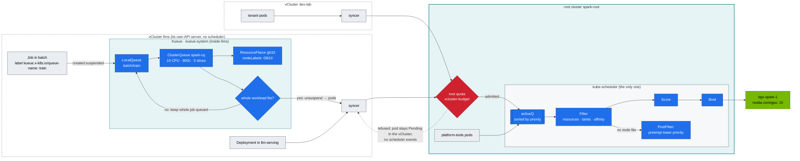
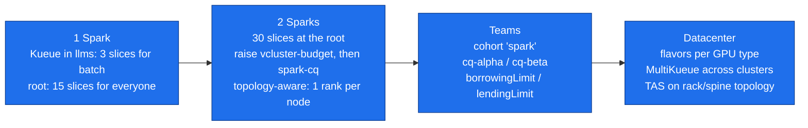

# Chapter 07 · kube-scheduler & AI Batch Scheduling: Priorities, Preemption, Taints, Kueue Gangs, DRA

> **02-Kubernetes · Part II — Controllers & scheduling · Chapter 07 of 28** · ← [Chapter 06 · kube-controller-manager & controllers](06-kube-controller-manager-and-controllers.md) · [All chapters](00-kubernetes-step-by-step-guide.md) · [Chapter 08 · Kubernetes networking deep dive](08-kubernetes-networking-deep-dive.md) →

| | |
|---|---|
| **You will build** | A priority ladder that lets serving pods preempt experiments — across cluster boundaries, because one scheduler places every pod on the Spark. A reproducible partial-gang deadlock inside dev-lab, the same shape of workload fixed with Kueue all-or-nothing admission inside llms, and taint/affinity rules ready for a second Spark |
| **Hardware** | dgx-spark-1. The Kueue parts also run on kind with `tests/fake-gpu-node.sh` + two vClusters (that's what CI does) |
| **Time** | 90 min |
| **Risk** | Low. Preemption kills *lab* pods on purpose |
| **Clusters** | `spark-root` (the only scheduler, preemption demo in `platform-tools`, taints) · `dev-lab` (no-Kueue deadlock, affinity demo) · `llms` (Kueue, gang jobs, a serving pod that preempts root pods) |
| **Lab files** | [`manifests/common/priorityclasses/priorityclasses.yaml`](lab/manifests/common/priorityclasses/priorityclasses.yaml), [`manifests/root/20-scheduling/preemption-demo.yaml`](lab/manifests/root/20-scheduling/preemption-demo.yaml), [`manifests/dev-lab/20-scheduling/`](lab/manifests/dev-lab/20-scheduling/), [`manifests/llms/20-scheduling/`](lab/manifests/llms/20-scheduling/), [`tests/kueue-gang-test.sh`](lab/tests/kueue-gang-test.sh), [`vclusters/llms.yaml`](lab/vclusters/llms.yaml) |

---

## 1. Why this matters on a Spark

One GB10 split into 15 time-slices is a **small, contended resource** shared by the platform and two clusters. The default scheduler places pods one at a time, first come first served. That's fine for web apps. It's wrong for:

- **Serving vs. experiments.** A notebook must not block the production endpoint → *priority + preemption*.
- **Distributed jobs.** A 2-rank job that gets only 1 slice holds it forever waiting for its peer → *gang admission (Kueue)*.
- **Shared capacity between teams.** "Batch may use 3 of llms's 11 slices, serving keeps the other 8" → *ClusterQueues, cohorts, borrowing*.

And one fact shapes everything in this chapter: **only the root runs a scheduler.** The vClusters have API servers and controller-managers but no kube-scheduler (vCluster's default); their syncers copy pods to the root, and the root's kube-scheduler binds them to a node. So a pod's *placement* — priority, preemption, taints, affinity — is always decided at the root, using the PriorityClasses and node labels the vClusters sync. What a vCluster *can* decide is *whether a pod exists yet*: its own quotas, and in llms, Kueue.

---

## 2. Architecture — HLD



**Division of labour:** Kueue decides *when* a workload may start (its quota, fairness, gang). The root quota decides *whether* a vCluster's pod may exist at the root (the vCluster's budget). kube-scheduler decides *where* each admitted pod goes (node fit, affinity) and *who gets evicted* when the node is full. Kueue never binds pods to nodes, and quota never preempts anyone.

For a GPU pod in `llms/batch` that's three gates, each with its own number:

| Gate | Cluster | Limit | Refusal looks like |
|---|---|---|---|
| Kueue `spark-cq` | llms | 3 slices for batch | Job stays `suspend: true`, Workload not admitted, **no pods** |
| Root `vcluster-budget` on `vc-llms` | root (admission) | 11 slices for all of llms | pod `Pending` in llms with a sync error, **no scheduler events** |
| Node allocatable | root (scheduler) | 15 slices on dgx-spark-1, for everyone | `0/1 nodes are available: 1 Insufficient nvidia.com/gpu`, then maybe preemption |

---

## 3. LLD

### 3.1 Priority ladder

| PriorityClass | Value | preemptionPolicy | Used by |
|---|---|---|---|
| `spark-platform` | 100000 | PreemptLowerPriority | monitoring, node-probe, **vCluster control planes** |
| `spark-serving` | 50000 | PreemptLowerPriority | vLLM, Triton, SGLang (llms) |
| `spark-interactive` (**globalDefault** inside the vClusters) | 20000 | PreemptLowerPriority | notebooks, dev pods |
| `spark-batch` | 10000 | **Never** | Kueue-admitted training (llms) |
| `spark-preemptible` | 1000 | **Never** | best-effort experiments, the `filler` demo |

`preemptionPolicy: Never` means *this pod never evicts others*. It can still **be** evicted by higher classes.

The same five classes are created in all three clusters ([`common/priorityclasses`](lab/manifests/common/priorityclasses/priorityclasses.yaml), included by each `00-platform`), so tenants can name them. With `sync.toHost.priorityClasses` on ([`vclusters/*.yaml`](lab/vclusters)), a vCluster's classes are copied to the root under translated names with their values, and the synced pod carries its priority value with it. The root scheduler therefore compares a dev-lab pod, an llms pod and a platform pod **on one ladder**: a `spark-serving` pod in llms can preempt a `spark-preemptible` pod in dev-lab or in `platform-tools`. That's the point of a shared GPU — and the reason tenants must not be able to create PriorityClasses (§7).

**No default class on the root.** [`root/00-platform`](lab/manifests/root/00-platform/kustomization.yaml) patches `globalDefault` off. A pod a vCluster creates before it has its own default (its CoreDNS, the first add-ons) reaches the root as `priority: 0` with no class. With a root default the Priority admission plugin computes 20000, rejects the pod (*"the integer value of priority (0) must not be provided in pod spec"*), and the syncer can never create it: the vCluster's pods stay `Pending` with a `SyncError` event.

The vCluster control planes run at `spark-platform` (`controlPlane.statefulSet.scheduling.priorityClassName`), so no tenant pod can ever preempt the API server it was created through.

### 3.2 Kueue objects (inside llms)

| Object | Name | Key fields |
|---|---|---|
| ResourceFlavor | `gb10` | `nodeLabels: {spark.lab/gpu: gb10}` — a lab-owned label the kubelet sets on the root node, visible in llms through node sync |
| ClusterQueue | `spark-cq` | `cpu 10`, `memory 80Gi`, `nvidia.com/gpu 3`, `BestEffortFIFO`, preempt `LowerPriority` within the queue |
| LocalQueue | `batch/train` | → `spark-cq` |
| WorkloadPriorityClass | `urgent` 1000, `routine` 100 | ordering *inside* Kueue, independent of the pod PriorityClass |

Why only 3 slices in the ClusterQueue? llms has 11 in total (its root budget), and `llm-serving`'s own quota is a ceiling of 8: 3 + 8 = 11 fills llms exactly, so batch and serving can't both claim the same slice. CPU and memory are different: `spark-cq` (10 CPU · 80 Gi) and `serving-budget` (10 CPU · 80 Gi) add up to more than llms's 12 CPU · 88 Gi on purpose (Chapter 14). Either side can use most of llms while the other is idle; the root quota, Kueue and PriorityClasses decide who waits. Kueue only knows about llms; it can't see what dev-lab or the platform use. Its numbers must therefore fit *inside* the root budget, not the node.

### 3.3 Scheduler messages you must recognise

| Message | Where you see it | Meaning |
|---|---|---|
| `0/1 nodes are available: 1 Insufficient nvidia.com/gpu` | pod events (copied into the vCluster for synced pods) | all 15 slices allocated, across all three clusters |
| `1 node(s) had untolerated taint {spark.lab/dedicated: gpu}` | pod events | missing toleration |
| `1 node(s) didn't match Pod's node affinity/selector` | pod events | label mismatch (GFD label missing? Kueue flavor nodeLabels?) |
| `preemption: 0/1 nodes are available: 1 No preemption victims found` | pod events | nothing of lower priority to evict |
| `Preempted by pod … on node dgx-spark-1` | event on the **victim** | preemption happened |
| `exceeded quota: vcluster-budget, requested: requests.nvidia.com/gpu=1, used: 2, limited: 2` | sync error event on the pod **inside the vCluster** | not a scheduler message at all: the root refused the pod (break/fix 02) |
| *(no events)* + Job `suspend: true` | llms | Kueue hasn't admitted it |

---

## 4. Integrations

- **GPU Feature Discovery (Chapter 17)** provides `nvidia.com/gpu.product` (`…-SHARED` under time-slicing), `nvidia.com/gpu.compute.major=12`, … on the root's node; the kubelet adds the lab-owned `spark.lab/gpu=gb10`. Node sync shows all of them inside both vClusters, so ResourceFlavors and tenant affinities can select on them — the lab uses `spark.lab/gpu` because GFD can rename its own labels — and the root scheduler evaluates the result.
- **Distributed training (Chapter 18)**: [`llms/80-distributed/base/ddp-job.yaml`](lab/manifests/llms/80-distributed/base/ddp-job.yaml) carries `kueue.x-k8s.io/queue-name: train` and `suspend: true`. Kueue gangs both ranks.
- **Autoscaling (Chapter 20)**: KEDA in llms scales serving on the root Prometheus's metrics. More serving replicas means fewer free slices for batch — the ladder decides who yields.
- **Quotas (Chapter 14) and vClusters (Chapter 04 §5)**: quotas are the admission-time budget; this chapter is the placement-time contest.

---

## 5. Lab

```bash
cd "02-Kubernetes/lab"
export KUBECONFIG="$PWD/../../01-Ansible/lab/.cache/kubeconfig-spark-lab.yaml"
```

### 5.1 Install Kueue and the queues (in llms)

```bash
scripts/install-addons.sh kueue                                  # into llms (kubectl --context llms …)
kubectl --context llms apply -k manifests/llms/20-scheduling
kubectl --context llms get resourceflavors,clusterqueues
kubectl --context llms -n batch get localqueues
kubectl --context spark-root get crd | grep -c kueue                # 0: Kueue doesn't exist at the root
```

Expected: `spark-cq` with `PENDING WORKLOADS 0`, and `train` pointing at it.

### 5.2 See how the scheduler thinks

```bash
kubectl --context spark-root -n kube-system get pods -l component=kube-scheduler     # the only scheduler
kubectl --context spark-root describe node dgx-spark-1 | sed -n '/Allocated resources/,/Events/p'
kubectl --context llms describe node dgx-spark-1 | sed -n '/Allocated resources/,/Events/p'
kubectl --context spark-root get pods -A -o custom-columns='NS:.metadata.namespace,POD:.metadata.name,PRIO:.spec.priority,CLASS:.spec.priorityClassName,GPU:.spec.containers[*].resources.limits.nvidia\.com/gpu' \
  | awk 'NR==1 || $5!="<none>"'
```

The root's node view counts every pod on the Spark. llms's view of the *same* node is computed from the pods llms knows about — its own — so it shows much less "allocated" than the node really has. A tenant reading `describe node` inside a vCluster can't tell whether the GPU is free. The root's list shows each synced pod's priority **value** next to its class name: that value is what the scheduler sorts on.

### 5.3 Priority and preemption (on the root)

Preemption needs a *full node*, and inside a vCluster the root quota refuses pods long before the node fills up. So the demo runs at the root, in `platform-tools`. First fill every free slice with preemptible pods:

```bash
command -v yq >/dev/null || sudo sh -c 'wget -qO /usr/local/bin/yq https://github.com/mikefarah/yq/releases/download/v4.47.1/yq_linux_$(dpkg --print-architecture) && chmod +x /usr/local/bin/yq'
yq 'select(.kind=="Deployment")' manifests/root/20-scheduling/preemption-demo.yaml | kubectl --context spark-root apply -f -
alloc=$(kubectl --context spark-root get node dgx-spark-1 -o jsonpath='{.status.allocatable.nvidia\.com/gpu}')
used=$(kubectl --context spark-root get pods -A -o json | jq '[.items[] | select(.status.phase=="Running" and (.metadata.labels.app // "") != "filler") | .spec.containers[].resources.limits["nvidia.com/gpu"] // "0" | tonumber] | add // 0')
kubectl --context spark-root -n platform-tools scale deploy filler --replicas=$((alloc - used))
kubectl --context spark-root -n platform-tools get pods -l app=filler                 # all Running: no slice left
```

Now one serving-priority pod arrives:

```bash
yq 'select(.kind=="Pod")' manifests/root/20-scheduling/preemption-demo.yaml | kubectl --context spark-root apply -f -
kubectl --context spark-root -n platform-tools get pod urgent -w                      # Pending, then Running a few seconds later
kubectl --context spark-root -n platform-tools get events --field-selector reason=Preempted
```

Expected:

```text
Normal  Preempted  pod/filler-7c9…-k2x  Preempted by pod … on node dgx-spark-1
```

The filler Deployment immediately recreates its lost pod, which now sits `Pending` with `Insufficient nvidia.com/gpu`. Low priority waits, high priority runs. (`yq` is mikefarah yq, version `YQ_VERSION` in `versions.env`; `scripts/preflight.sh` checks for it.)

**Across the cluster boundary.** Keep the node full (the filler is still there), delete `urgent`, and send the serving pod from **llms** instead:

```bash
kubectl --context spark-root -n platform-tools delete pod urgent
kubectl --context llms apply -f - <<'EOF'
apiVersion: v1
kind: Pod
metadata: {name: urgent-from-llms, namespace: llm-serving}
spec:
  priorityClassName: spark-serving
  containers:
    - name: sleep
      image: nvcr.io/nvidia/cuda:13.0.1-base-ubuntu24.04
      command: ["sleep", "infinity"]
      resources: {limits: {nvidia.com/gpu: "1", memory: 64Mi}, requests: {cpu: 10m}}
EOF
kubectl --context llms -n llm-serving get pod urgent-from-llms -w
kubectl --context spark-root -n platform-tools get events --field-selector reason=Preempted
kubectl --context spark-root -n vc-llms get pods -o custom-columns=NAME:.metadata.name,CLASS:.spec.priorityClassName,PRIO:.spec.priority | grep urgent
```

Expected: a filler pod in the **root's** `platform-tools` is preempted to make room for a pod created in llms. The host copy shows which class name the syncer gave it at the root and the same priority value, 50000. llms's quota and the root's `vcluster-budget` both had room (1 slice of 11), so the only contest left was on the node — and there, one ladder rules.

Clean up:

```bash
kubectl --context llms -n llm-serving delete pod urgent-from-llms
kubectl --context spark-root delete -f manifests/root/20-scheduling/preemption-demo.yaml --ignore-not-found
```

### 5.4 Reproduce the partial-gang deadlock (no Kueue, in dev-lab)

dev-lab has no Kueue, and its root budget is exactly 2 slices. Make sure nothing else in dev-lab holds a slice (`scripts/breakfix.sh reset 02`, delete `tenant-beta/gpu-smoke`), then submit two 2-rank jobs that each need both:

```bash
kubectl --context spark-root -n vc-dev-lab describe resourcequota vcluster-budget | grep nvidia     # used 0, hard 2
kubectl --context dev-lab apply -f manifests/dev-lab/20-scheduling/no-kueue-deadlock.yaml
kubectl --context dev-lab -n lab-tools get pods -l demo=deadlock -o wide
kubectl --context dev-lab -n lab-tools logs -l demo=deadlock --prefix --tail=2
```

When the slices split 1 + 1 (delete and re-apply 2–3 times if one job gets both):

```text
job-x-0-…   1/1 Running   job-y-0-…   1/1 Running
job-x-1-…   0/1 Pending   job-y-1-…   0/1 Pending
[pod/job-x-0-…/rank] rank 0 waiting for job-x-1.peers
[pod/job-y-0-…/rank] rank 0 waiting for job-y-1.peers
```

Both jobs hold a slice and neither can progress. Now ask *who* is holding the rank-1 pods back:

```bash
kubectl --context dev-lab -n lab-tools describe pod -l demo=deadlock | grep -E '^Name:|exceeded quota|Scheduled' 
kubectl --context spark-root -n vc-dev-lab get pods | grep -- '-x-lab-tools-x-dev-lab' | grep job-     # only the two rank-0s exist at the root
```

Not the scheduler — the node still has free slices. The **root quota** refused the rank-1 pods, so they never reached the scheduler. On a datacenter cluster the same deadlock happens when the *node pool* runs out instead of a quota; either way, a pod-at-a-time admitter can't see that half a gang is worthless. **This is the most expensive failure in AI clusters**: at datacenter scale, it's hundreds of GPUs idling. Clean up:

```bash
kubectl --context dev-lab delete -f manifests/dev-lab/20-scheduling/no-kueue-deadlock.yaml
```

### 5.5 Fix it with Kueue gang admission (in llms)

`gang-a` and `gang-b` each need 3 slices; `spark-cq` allows 3. Either fits, both don't:

```bash
kubectl --context llms apply -f manifests/llms/20-scheduling/gang-demo-jobs.yaml
kubectl --context llms -n batch get workloads
kubectl --context llms get clusterqueue spark-cq -o jsonpath='{.status.flavorsUsage}' | jq
kubectl --context llms -n batch get jobs -o custom-columns=JOB:.metadata.name,SUSPENDED:.spec.suspend,ACTIVE:.status.active
kubectl --context spark-root -n vc-llms get pods | grep -c -- '-x-batch-x-llms'                   # 3: only gang-a's pods exist at the root
```

Expected:

```text
NAME               QUEUE   RESERVED IN   ADMITTED   AGE
job-gang-a-8f2c1   train   spark-cq      True       6s
job-gang-b-1d9e0   train                              6s

JOB      SUSPENDED   ACTIVE
gang-a   false       3
gang-b   true        <none>
```

`gang-b` stays suspended, with **zero pods** anywhere, until `gang-a` finishes (~2 min). Then it's admitted whole. Kueue injected the `gb10` flavor's `nodeSelector` into `gang-a`'s pods; the root scheduler is what matched it to dgx-spark-1. Same check, automated: `tests/kueue-gang-test.sh`.

Try priority inside the queue. While `gang-a` runs, submit a copy of `gang-b` labelled `urgent`. It jumps ahead of the queued `routine` job:

```bash
yq 'select(.metadata.name=="gang-b") | .metadata.name="gang-c" | .metadata.labels["kueue.x-k8s.io/priority-class"]="urgent"' \
  manifests/llms/20-scheduling/gang-demo-jobs.yaml | kubectl --context llms apply -f -
kubectl --context llms -n batch get workloads -o custom-columns=NAME:.metadata.name,PRIORITY:.spec.priority,QUEUE:.spec.queueName
```

When `gang-a` completes, `gang-c` (priority 1000) is admitted before `gang-b` (100). Clean up: `kubectl --context llms -n batch delete jobs gang-a gang-b gang-c --ignore-not-found`.

Exercise: why didn't Kueue's 3 slices collide with the root? Add up `spark-cq` (3) + `llm-serving`'s ceiling (8): exactly llms's 11, so on slices they can't. Now do the same for memory with `kubectl --context spark-root -n vc-llms describe resourcequota vcluster-budget`: 80 Gi for batch plus 80 Gi for serving is more than 88 Gi. If serving already held its full 80 Gi of limits, the llms control plane and add-ons (≈4 Gi) plus `gang-a`'s 3 × 2 Gi would pass 88 Gi: Kueue would admit `gang-a` and the root would refuse its third pod — a partial gang again, one layer down. Kueue's quota has to be sized for what the *root* will give it.

### 5.6 Taints and affinity (ready for dgx-spark-2)

Nodes belong to the root: only the platform admin can taint them, and both vClusters see the taint through node sync.

```bash
kubectl --context spark-root taint node dgx-spark-1 spark.lab/dedicated=gpu:PreferNoSchedule
kubectl --context dev-lab get node dgx-spark-1 -o jsonpath='{.spec.taints}{"\n"}'               # synced into the vCluster
kubectl --context dev-lab apply -f manifests/dev-lab/20-scheduling/taints-affinity.yaml
kubectl --context dev-lab -n tenant-beta get pods -l app=affinity-demo -o wide
kubectl --context dev-lab -n tenant-beta get pod -l app=affinity-demo -o jsonpath='{.items[0].spec.tolerations}' | jq
kubectl --context spark-root taint node dgx-spark-1 spark.lab/dedicated-                           # remove
```

With one node, both replicas land on dgx-spark-1 (the anti-affinity is *preferred*, not required). With dgx-spark-2 joined (01-Ansible `k8s_workers`), they spread one per Spark. Change `preferred…` to `required…` and scale to 3 on two nodes, and the third stays Pending. That's the behaviour you want for HA serving. The tolerations and affinity are written in dev-lab but evaluated by the root scheduler against the root's real node.

Why `PreferNoSchedule` and not `NoSchedule`? On a one-node lab, `NoSchedule` stops every new pod in all three clusters at once — break/fix 13 is exactly that.

---

## 6. Verify

```bash
tests/kueue-gang-test.sh
```

```text
workloads: gang-a=True gang-b=False
jobs: gang-a=false gang-b=true
PASS: one gang admitted whole, the other held whole (no partial start)
```

| Check | Expected |
|---|---|
| `kubectl --context dev-lab -n kube-system get pods` | no kube-scheduler: placement is the root's |
| §5.3 cross-cluster | a `platform-tools` filler preempted by an llms pod |
| `kubectl --context spark-root -n platform-tools get deploy filler` | gone after cleanup |

---

## 7. Troubleshooting

| Symptom | Cause | Diagnose | Fix |
|---|---|---|---|
| Job never starts, no pods, `suspend: true` | Kueue hasn't admitted it | `kubectl --context llms -n batch describe workload …` → `couldn't assign flavors … insufficient quota for nvidia.com/gpu in flavor gb10` | wait, lower the request, or raise `nominalQuota` (within the root budget) |
| Workload `Inadmissible: LocalQueue train doesn't exist` | typo in `queue-name` label | `kubectl --context llms -n batch get localqueues` | fix the label |
| Job runs **without** Kueue although labelled | Kueue webhook missed it (Kueue installed after the Job, or namespace excluded by `manageJobsWithoutQueueName`), or the Job was created in **dev-lab**, which has no Kueue | `kubectl --context llms -n kueue-system logs deploy/kueue-controller-manager` | recreate the Job in llms after Kueue is up |
| Kueue admitted the job, some pods `Pending` in llms with no scheduler events | the **root** quota on `vc-llms` is spent (serving grew) — Kueue can't see it | sync error events on the pod; `kubectl --context spark-root -n vc-llms describe resourcequota vcluster-budget` | size `spark-cq` to fit beside serving inside the root budget (§5.5 exercise), or resize the vCluster (Chapter 04 §6.5) |
| Pods `Pending`, `Insufficient nvidia.com/gpu`, though the vCluster's own quota has room | the *node* is full: other clusters hold the slices | root view: §5.2 list, or `kubectl --context spark-root -n platform-tools get cm gpu-slice-ledger -o yaml` (Chapter 06) | wait, preempt (priority), or free slices elsewhere |
| Pods Pending, `didn't match Pod's node affinity` | GFD labels missing (GPU Operator not healthy) — so the synced node in the vCluster lacks them too | `kubectl --context spark-root get node dgx-spark-1 --show-labels \| tr , '\n' \| grep nvidia` | fix the GPU Operator (Chapter 17) |
| Preemption doesn't happen | victim has **equal/higher** priority, or a PDB protects it (preemption respects PDBs as best effort; PDBs are synced from the vClusters), or the preemptor was refused by a **quota** — quota never preempts | `kubectl --context spark-root get pod -n <ns> <p> -o jsonpath='{.spec.priority}'`; sync errors in the vCluster | adjust classes. Remember `preemptionPolicy: Never` on the *preemptor* blocks it |
| Serving pod preempted by a notebook | notebook class ≥ serving class | `kubectl --context spark-root get pc` | serving must be the highest non-platform class |
| **A tenant's pods preempt platform or other tenants' pods** | someone created a PriorityClass with a high value **inside a vCluster**; priority classes sync to the root with their value, and the root scheduler honours it | `kubectl --context <vc> get pc`; compare with the five lab classes; `.spec.priority` of the host copies in `vc-*` | tenants must not be able to create PriorityClasses: the tenant role (`spark-tenant-developer`, Chapter 03 §3.2) has no access to them, and the vCluster admin kubeconfig stays with the platform team. In a real platform, add an admission policy in each vCluster that allows only the lab's five classes |

Drill: `scripts/breakfix.sh inject 02` (a vCluster's GPU budget spent) and `inject 13` (NoSchedule taint on the only node — all three clusters stop placing pods).

---

## 8. Scale-out path



- **A second Spark** adds 15 slices to the *root* immediately. The vClusters see the node through sync, but their budgets don't grow until the root admin raises `vcluster-budget` (Chapter 04 §6.5) — and Kueue's `spark-cq` only after that. Capacity flows down through three layers, in that order.
- **Dynamic Resource Allocation (DRA)** is GA in Kubernetes 1.34. It replaces "count of `nvidia.com/gpu`" with `ResourceClaim`s that can express *which* GPU, sharing modes and device attributes. NVIDIA's DRA driver (`k8s-dra-driver-gpu`) is the path for it: it would run at the root, next to (or instead of) the device plugin, and the vClusters would have to sync claims to the root. Check both support matrices — GB10 in the driver, ResourceClaims in your vCluster version — before moving the lab off the device plugin.
- **Topology-aware scheduling (Kueue TAS)**: with 2 Sparks, label nodes `spark.lab/fabric=cx7-pair` so a 2-rank job lands on both ends of the same QSFP cable.
- **MultiKueue** dispatches workloads from a manager cluster to worker clusters. The two vClusters are already separate clusters with their own APIs — a manager Kueue in one and workers in the others is a datacenter pattern you can rehearse here.

---

## 9. Checklist

- [ ] I can say which cluster decides *whether*, *when* and *where* a pod runs — and why only the root has a scheduler.
- [ ] I watched a serving pod preempt a preemptible pod, including one created in a different cluster, and can explain `preemptionPolicy: Never`.
- [ ] I reproduced a partial-gang deadlock and showed it was the root quota, not the scheduler, holding the second ranks back.
- [ ] Kueue held a whole job back instead of starting half of it, and I can size its quota against the root budget.
- [ ] I know which labels my ResourceFlavor and affinities depend on, who writes them (GFD at the root), and how they reach the vClusters.
- [ ] I can explain why tenants must not create PriorityClasses.
