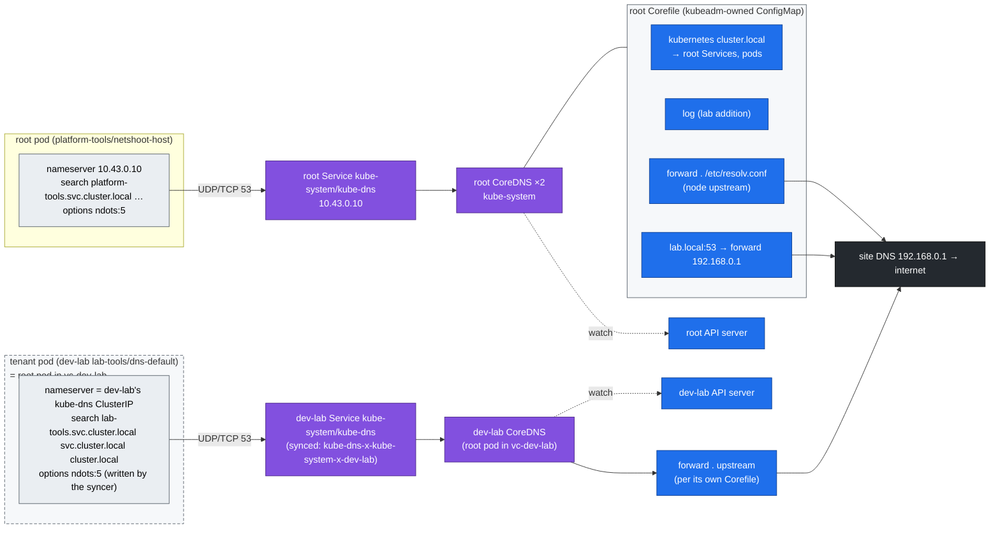

# Step 10 · CoreDNS & Service Discovery: Records, the `ndots:5` Tax, Custom Zones, DNS Failures

> **02-Kubernetes · Part III — Networking · Step 10 of 28** · ← [Step 09 · kube-proxy & ClusterIP](09-kube-proxy-and-cluster-ip-mechanics.md) · [All steps](00-kubernetes-step-by-step-guide.md) · [Step 11 · Ingress & Gateway API](11-ingress-controllers-and-gateway-api.md) →

| | |
|---|---|
| **You will build** | A map of the lab's **three** DNS servers (the root's CoreDNS and one per vCluster), a measured before/after of DNS query amplification for model downloads and external APIs, query logging and a forward zone for `lab.local` in the root's kubeadm-managed Corefile, and a rehearsed DNS outage whose blast radius is uneven by design |
| **Hardware** | dgx-spark-1 |
| **Time** | 60 min |
| **Risk** | Low. The outage drill (`breakfix 07`) breaks name resolution for root pods for ~5 min |
| **Clusters** | `spark-root` (CoreDNS at 10.43.0.10, its Corefile, `netshoot-host`), `dev-lab` (its own CoreDNS, the ndots pods, echo), `llms` (the replicated `default/prometheus`) |
| **Lab files** | [`manifests/root/30-networking/coredns-corefile.yaml`](lab/manifests/root/30-networking/coredns-corefile.yaml), [`manifests/dev-lab/30-networking/dns-lab.yaml`](lab/manifests/dev-lab/30-networking/dns-lab.yaml), [`manifests/dev-lab/30-networking/echo-service.yaml`](lab/manifests/dev-lab/30-networking/echo-service.yaml), [`manifests/root/30-networking/netshoot-host.yaml`](lab/manifests/root/30-networking/netshoot-host.yaml), [`vclusters/llms.yaml`](lab/vclusters/llms.yaml) (`replicateServices`) |

---

## 1. Why this matters on a Spark

Model servers resolve names constantly: `huggingface.co` and `cdn-lfs.hf.co` at startup, `nvcr.io` for pulls, `qdrant.llm-serving` on every RAG call, and the rendezvous host for torchrun. With the Kubernetes default `ndots:5`, any name with fewer than five dots is first tried against every search domain. **One lookup of `huggingface.co` costs 6–8 extra queries** (3–4 search domains × A + AAAA) before the real answer. On a busy gateway, that's most of CoreDNS's load, and every one of those queries is also a conntrack entry (Step 09).

The nesting adds a second lesson: **"cluster DNS" is not one thing here.** The root's CoreDNS answers for root pods. Each vCluster runs its own CoreDNS that reads *its* API server, so `echo.lab-tools.svc.cluster.local` exists in dev-lab and nowhere else, and a tenant can't even name a root Service. When DNS breaks, which pods notice depends on which server they use.

---

## 2. Architecture — HLD



Two resolvers, one network: the dev-lab CoreDNS pod and its Service are ordinary root objects in `vc-dev-lab` with a root ClusterIP. The difference is the API server each one reads.

---

## 3. LLD

### 3.1 Record types you'll use

| Query (asked inside the cluster that owns the Service) | Answer | Example |
|---|---|---|
| `svc.ns.svc.cluster.local` A | ClusterIP | in llms: `vllm.llm-serving.svc.cluster.local → 10.43.x.y` |
| headless `svc.ns.svc.cluster.local` A | every ready pod IP | in dev-lab: `echo-headless.lab-tools… → 3 IPs` |
| `pod-hostname.subdomain.ns.svc.cluster.local` A | that pod | in llms: `ddp-0.ddp-workers.batch.svc.cluster.local` (Step 18) |
| `qdrant-0.qdrant-headless.llm-serving.svc.cluster.local` | StatefulSet pod | in llms, Step 12 |
| `_http._tcp.echo.lab-tools.svc.cluster.local` SRV | port + target | in dev-lab, named ports |
| `prometheus.default.svc.cluster.local` | the root's `kps-prometheus` ClusterIP | in llms only: replicated with `networking.replicateServices.fromHost` |
| `kps-prometheus.observability.svc.cluster.local` | NXDOMAIN from inside a vCluster | that namespace exists only on the root |

### 3.2 Query amplification with `ndots:5`

For `huggingface.co` (1 dot < 5) from a pod in dev-lab's `lab-tools`:

| # | Name tried | Result |
|---|---|---|
| 1-2 | `huggingface.co.lab-tools.svc.cluster.local` A/AAAA | NXDOMAIN |
| 3-4 | `huggingface.co.svc.cluster.local` | NXDOMAIN |
| 5-6 | `huggingface.co.cluster.local` | NXDOMAIN |
| 7-8 | `huggingface.co.lab.local`, only if the pod's search list has `lab.local` (root pods that inherit the host's search domains, e.g. `ClusterFirstWithHostNet`) | NXDOMAIN (forwarded upstream!) |
| 9-10 | `huggingface.co` | ✅ |

Three fixes, in order of preference:

| Fix | Where | Trade-off |
|---|---|---|
| Use FQDNs with a trailing dot: `huggingface.co.` | app config / env | zero cost. Some HTTP libraries mishandle the dot in `Host:` |
| `dnsConfig.options: ndots: "1"` | pod spec (as in `dns-ndots1`) — the vCluster syncer keeps your options when it rewrites the pod's DNS | short in-cluster names (`qdrant`) still work via search. `qdrant.llm-serving` needs `.svc` |
| NodeLocal DNSCache | DaemonSet on every root node | caches on the node, avoids conntrack for UDP. Worth it at DC scale; vCluster pods need their nameserver pointed at it |

### 3.3 kubeadm and vCluster specifics

| Item | Root (kubeadm) | Inside a vCluster |
|---|---|---|
| Server | Deployment `kube-system/coredns`, 2 replicas, PriorityClass `system-cluster-critical` | Deployment `kube-system/coredns` *inside* the vCluster; on the root a pod in `vc-<vc>` |
| Service | `kube-system/kube-dns` = **10.43.0.10** (kubelet `clusterDNS`) | `kube-system/kube-dns` inside, synced as `kube-dns-x-kube-system-x-<vc>` with its own root ClusterIP |
| How pods find it | kubelet writes `/etc/resolv.conf` (`dnsPolicy: ClusterFirst`) | the syncer rewrites the root pod to `dnsPolicy: None` + a `dnsConfig` with the vCluster's DNS IP and the **inner** namespace's search path |
| Corefile | ConfigMap `kube-system/coredns`, owned by kubeadm. **No import hook: you edit the Corefile itself**, and `kubeadm upgrade` rewrites it (re-apply [`coredns-corefile.yaml`](lab/manifests/root/30-networking/coredns-corefile.yaml) after an upgrade) | managed by vCluster; change it with `controlPlane.coredns.overwriteConfig` in [`vclusters/<vc>.yaml`](lab/vclusters/dev-lab.yaml) and `helm upgrade` (Step 04) |
| Reload | the `reload` plugin re-reads the ConfigMap within ~30 s, no restart | same plugin, after vCluster updates its ConfigMap |
| Upstream | `forward . /etc/resolv.conf` → the kubelet's `resolvConf`; on DGX OS with systemd-resolved, kubeadm points that at `/run/systemd/resolve/resolv.conf` (the real servers), not `127.0.0.53` | whatever the vCluster's Corefile forwards to — read it in §5.1 |
| Who sees `lab.local` | root pods (the lab's `lab.local:53` block) | only if the upstream it forwards to resolves `lab.local` |

---

## 4. Integrations

- **01-Ansible site DNS (`dns_servers: [192.168.0.1, …]`)**: the root's `lab.local` forward zone lets platform pods resolve `dgx-spark-2.lab.local` and your NAS by name.
- **Model downloads (Step 20, modules 03–06)**: set `HF_ENDPOINT`/`HF_HUB_*` and any registry mirrors as FQDNs. These pods live in llms, so it's llms' CoreDNS that pays the ndots tax.
- **KEDA in llms (Step 20)** queries `http://prometheus.default:9090`: a name that only exists because llms replicates the root's `observability/kps-prometheus` into itself. DNS is how a vCluster is given *selected* root services and nothing else.
- **Prometheus (Step 17)**: the root's CoreDNS exposes `coredns_dns_requests_total{type}` and `coredns_dns_responses_total{rcode}`. An NXDOMAIN ratio > 50 % is the ndots tax showing up in a graph. The vClusters' CoreDNS pods are not in the root's `vcluster-workloads` ServiceMonitor; adding them is an exercise.
- **NetworkPolicy (Step 08)**: a tenant that restricts egress must allow UDP/TCP 53 to *its vCluster's* CoreDNS. Inside the vCluster that's `kube-system`, the same selector a tenant would write in a normal cluster.

---

## 5. Lab

Run from `02-Kubernetes/lab` with the lab kubeconfig (`export KUBECONFIG="$PWD/../../01-Ansible/lab/.cache/kubeconfig-spark-lab.yaml"`).

### 5.1 Inspect the resolvers

```bash
cd "02-Kubernetes/lab"
kubectl --context spark-root apply -k manifests/root/30-networking         # netshoot-host
kubectl --context dev-lab apply -k manifests/dev-lab/30-networking         # dns-default, dns-ndots1, echo, netshoot

# a root pod
kubectl --context spark-root -n platform-tools exec deploy/netshoot-host -- cat /etc/resolv.conf
# two tenant pods in dev-lab
kubectl --context dev-lab -n lab-tools exec dns-default -- cat /etc/resolv.conf
kubectl --context dev-lab -n lab-tools exec dns-ndots1  -- cat /etc/resolv.conf
# who answers for dev-lab?
kubectl --context dev-lab -n kube-system get svc kube-dns
kubectl --context spark-root -n vc-dev-lab get pods,svc | grep -i -E 'coredns|kube-dns'
kubectl --context spark-root -n vc-dev-lab get pod -l app=dns-lab -o jsonpath='{range .items[*]}{.metadata.name}{" "}{.spec.dnsPolicy}{" "}{.spec.dnsConfig.nameservers}{"\n"}{end}'
# the two Corefiles
kubectl --context spark-root -n kube-system get cm coredns -o jsonpath='{.data.Corefile}'
kubectl --context dev-lab -n kube-system get cm coredns -o jsonpath='{.data.Corefile}'
```

Expected: the root pod's nameserver is `10.43.0.10` with a `platform-tools.svc.cluster.local` search path (plus the host's search domains, because of `ClusterFirstWithHostNet`). The dev-lab pods' nameserver is dev-lab's `kube-dns` ClusterIP — another 10.43.x.y — with a `lab-tools.svc.cluster.local` search path, although on the root they run in `vc-dev-lab`. On the root, their spec says `dnsPolicy: None` with that nameserver: the syncer wrote it. `dns-ndots1` keeps its `ndots:1` and `single-request-reopen`.

Note the `forward` line in dev-lab's Corefile: it tells you whether a tenant's external lookups go straight to the node's upstream or through the root's CoreDNS. You'll need it in §5.5.

### 5.2 Turn on query logging and add the `lab.local` zone (root)

The root's Corefile is kubeadm's ConfigMap; the lab file is kubeadm's default plus `log` and a `lab.local:53` block:

```bash
kubectl --context spark-root -n kube-system get cm coredns -o yaml > /tmp/coredns-before.yaml   # keep kubeadm's version
kubectl --context spark-root apply -f manifests/root/30-networking/coredns-corefile.yaml
sleep 35                                                                                        # 'reload' picks it up
kubectl --context spark-root -n kube-system logs -l k8s-app=kube-dns --tail=5 | grep -i reload
kubectl --context spark-root -n kube-system logs -l k8s-app=kube-dns -f --tail=0 --prefix=false > /tmp/coredns.log &
```

`kubectl apply` warns that the ConfigMap lacks the last-applied annotation — expected, kubeadm created it.

### 5.3 Measure the amplification

**Root pod, from the root CoreDNS's query log:**

```bash
: > /tmp/coredns.log; sleep 1
kubectl --context spark-root -n platform-tools exec deploy/netshoot-host -- sh -c 'getent ahosts huggingface.co >/dev/null'
sleep 2; echo "netshoot-host: $(grep -c 'huggingface' /tmp/coredns.log) queries"
grep huggingface /tmp/coredns.log | awk '{print $5, $6, $7, $12}' | head -12
kill %1
```

Expected:

```text
netshoot-host: 10 queries        # 8 if your host has no 'search lab.local'
"AAAA IN huggingface.co.platform-tools.svc.cluster.local. NXDOMAIN
"A IN huggingface.co.platform-tools.svc.cluster.local. NXDOMAIN
…
"A IN huggingface.co. NOERROR
```

**Tenant pods in dev-lab.** Their queries go to dev-lab's CoreDNS, not the root's, so the root log doesn't see the search-domain walk at all. Count them on the wire instead — the netshoot image has `tcpdump`:

```bash
for p in dns-default dns-ndots1; do
  echo "── $p"
  kubectl --context dev-lab -n lab-tools exec $p -- sh -c \
    'tcpdump -nli eth0 udp dst port 53 2>/dev/null & sleep 1; getent ahosts huggingface.co >/dev/null; sleep 2; kill $!' \
    | awk '{print $(NF-2), $(NF-1)}' | sort | uniq -c
done
```

Expected:

```text
── dns-default
      1 A? huggingface.co.
      1 A? huggingface.co.cluster.local.
      1 A? huggingface.co.lab-tools.svc.cluster.local.
      1 A? huggingface.co.svc.cluster.local.
      1 AAAA? huggingface.co.
      1 AAAA? huggingface.co.cluster.local.
      1 AAAA? huggingface.co.lab-tools.svc.cluster.local.
      1 AAAA? huggingface.co.svc.cluster.local.
── dns-ndots1
      1 A? huggingface.co.
      1 AAAA? huggingface.co.
```

Eight queries for one lookup with `ndots:5` (three search domains × A + AAAA, then the real name), two with `ndots:1`. The count follows the `search` line you printed in §5.1: if your vCluster release also appends the node's search domains (e.g. `lab.local`), you'll see one more pair per extra domain. Drop the `awk` to see the destination of each packet: dev-lab's DNS ClusterIP.

Time it too:

```bash
for p in dns-default dns-ndots1; do
  kubectl --context dev-lab -n lab-tools exec $p -- sh -c 'time (for i in $(seq 50); do getent ahosts huggingface.co >/dev/null; done)' 2>&1 | grep real | sed "s/^/$p /"
done
```

### 5.4 Service discovery records — and where they stop

```bash
kubectl --context dev-lab -n lab-tools exec deploy/netshoot -- dig +short echo.lab-tools.svc.cluster.local
kubectl --context dev-lab -n lab-tools exec deploy/netshoot -- dig +short echo-headless.lab-tools.svc.cluster.local
kubectl --context dev-lab -n lab-tools exec deploy/netshoot -- dig +short SRV _http._tcp.echo.lab-tools.svc.cluster.local
kubectl --context dev-lab -n lab-tools exec deploy/netshoot -- dig +short kubernetes.default.svc.cluster.local      # dev-lab's own API Service
# names that belong to other clusters
kubectl --context dev-lab -n lab-tools exec deploy/netshoot -- dig +short kps-prometheus.observability.svc.cluster.local   # empty: root-only
kubectl --context spark-root -n platform-tools exec deploy/netshoot-host -- dig +short echo.lab-tools.svc.cluster.local    # empty: dev-lab-only
kubectl --context spark-root -n platform-tools exec deploy/netshoot-host -- dig +short echo-x-lab-tools-x-dev-lab.vc-dev-lab.svc.cluster.local  # the root's name for it
kubectl --context spark-root -n platform-tools exec deploy/netshoot-host -- dig +short dgx-spark-2.lab.local                   # via the root's lab.local zone
```

Expected: a ClusterIP, three pod IPs, an SRV record pointing at `echo.lab-tools.svc.cluster.local` port 80, dev-lab's own `kubernetes` ClusterIP — and empty answers for names that belong to another cluster. The last-but-one shows the same ClusterIP as the first: one Service, two names, two DNS servers.

If you have llms set up, the one deliberate exception:

```bash
kubectl --context llms -n default get svc prometheus -o wide
kubectl --context spark-root -n observability get svc kps-prometheus -o wide      # same ClusterIP
```

### 5.5 Outage drill

```bash
scripts/breakfix.sh inject 07
# root pods: by name, then by IP
kubectl --context spark-root -n platform-tools exec deploy/netshoot-host -- curl -s -m3 http://kps-grafana.observability || echo "name lookup failed"
kubectl --context spark-root -n platform-tools exec deploy/netshoot-host -- curl -s -m3 -o /dev/null -w '%{http_code}\n' \
  "http://$(kubectl --context spark-root -n observability get svc kps-grafana -o jsonpath='{.spec.clusterIP}')"   # by IP → works
# tenant pods: same drill in dev-lab
kubectl --context dev-lab -n lab-tools exec deploy/netshoot -- curl -s -m3 http://echo.lab-tools && echo " ← cluster names still work"
kubectl --context dev-lab -n lab-tools exec deploy/netshoot -- dig +short +time=2 huggingface.co || echo "external names fail"
# diagnose and fix it yourself; then:
scripts/breakfix.sh answer 07
scripts/breakfix.sh reset 07
```

The key triage move: **try by IP**. If the IP works and the name doesn't, it's DNS, not networking.

The second lesson is the blast radius. Root pods lose all name resolution at once. Tenants keep resolving their own cluster names because their vCluster's CoreDNS is still up. Whether their *external* names break depends on the `forward` line you read in §5.1. A shared dependency with an uneven, delayed failure is the hardest kind to spot from a tenant's ticket: "some lookups fail, the cluster looks fine".

Turn query logging off when you're done (it's chatty) — re-apply the lab Corefile without the `log` line, or restore kubeadm's original:

```bash
sed '/^        log$/d' manifests/root/30-networking/coredns-corefile.yaml | kubectl --context spark-root apply -f -
# or: kubectl --context spark-root apply -f /tmp/coredns-before.yaml   (drops lab.local too)
```

---

## 6. Verify

| Check | Expected |
|---|---|
| `scripts/verify.sh platform` | `CoreDNS ready` PASS |
| tenant pod's nameserver | dev-lab's `kube-dns` ClusterIP, not 10.43.0.10 |
| `dns-default` names tried for one external lookup | every search domain in its resolv.conf, then the real name (8 queries with 3 domains) |
| `dns-ndots1` names tried | the real name only |
| headless lookup (dev-lab) | 3 A records |
| `kps-prometheus.observability` from dev-lab | no answer |
| `coredns_dns_responses_total{rcode="NXDOMAIN"}` rate (root) | drops after you apply `ndots: "1"` to hot clients |

---

## 7. Troubleshooting

| Symptom | Cause | Diagnose | Fix |
|---|---|---|---|
| `Could not resolve host`, everything by name fails in root pods | root CoreDNS down / 0 replicas / NetworkPolicy blocks egress to `kube-system` | `kubectl --context spark-root -n kube-system get deploy coredns`. Try by IP | restore CoreDNS (`breakfix 07`). Allow UDP/TCP 53 to `kube-system` in egress policies |
| Names fail only inside one vCluster | that vCluster's CoreDNS pod not running (e.g. its root quota is spent, or the control plane is down) | `kubectl --context spark-root -n vc-<vc> get pods \| grep coredns`; `kubectl --context <vc> -n kube-system get pods` | free budget (Step 04 §8); restart the vCluster's CoreDNS |
| CoreDNS `CrashLoopBackOff`, log `Loop … detected` | upstream is a local stub (127.0.0.53) forwarding back to itself | `kubectl --context spark-root -n kube-system logs deploy/coredns` | kubelet `resolvConf: /run/systemd/resolve/resolv.conf` (kubeadm sets it when systemd-resolved is active) |
| Corefile change "didn't take" | edited the vCluster's ConfigMap (vCluster owns it), or `kubeadm upgrade` reset the root's | compare `get cm coredns` before/after; CoreDNS logs `Reloading` | root: re-apply `coredns-corefile.yaml`. vCluster: `controlPlane.coredns.overwriteConfig` + `helm upgrade` |
| Root's `lab.local` zone works on the root, not in tenants | tenants use their vCluster's CoreDNS | §5.1 resolv.conf | add the zone to the vCluster's CoreDNS config, or use FQDNs the upstream resolves |
| Tenant can't resolve a root Service | by design: vCluster DNS only knows its own API | `dig` from inside | replicate the Service into the vCluster (`networking.replicateServices.fromHost`, as llms does for Prometheus) |
| Intermittent `EAI_AGAIN` / 5 s stalls in Python | UDP conntrack race on parallel A+AAAA queries | `conntrack -S` `insert_failed` counter rises | `single-request-reopen` option (in `dns-ndots1`, glibc images), NodeLocal DNSCache |
| Slow first request to HF/NGC, fast afterwards | ndots amplification + cold cache | §5.3 | trailing dots / `ndots:1` |
| `ddp-0.ddp-workers…` NXDOMAIN at job start | pod not Ready yet and Service lacks `publishNotReadyAddresses` | `dig` from another pod in llms | set `publishNotReadyAddresses: true` on rendezvous Services (the lab's does) |

---

## 8. Scale-out path

| Lab | Datacenter |
|---|---|
| 2 root CoreDNS replicas, 1 per vCluster | ≥ 2 replicas with anti-affinity everywhere, HPA or cluster-proportional-autoscaler |
| query logging on demand | CoreDNS metrics + sampled logs to Loki, for the root and every virtual cluster |
| `ndots` per pod | NodeLocal DNSCache on every node, plus an admission policy that sets `ndots:2` on serving namespaces |
| forward zone to site DNS | split-horizon DNS, ExternalDNS publishing Ingress/Gateway hosts |
| one replicated Service (`default/prometheus`) | a deliberate catalogue of platform services exposed into tenant clusters, everything else invisible |

---

## 9. Checklist

- [ ] I can name the DNS server a root pod and a vCluster pod each use, and show where the syncer set it.
- [ ] I measured how many names one external lookup tries with `ndots:5`, and with `ndots:1`.
- [ ] I added a zone and query logging to the kubeadm-managed root Corefile, and know `kubeadm upgrade` resets it.
- [ ] I resolved a Service, a headless Service and an SRV record by name — and showed that names stop at the cluster boundary.
- [ ] I can tell a DNS outage from a network outage in one command, and explain why the root outage hit tenants unevenly.
